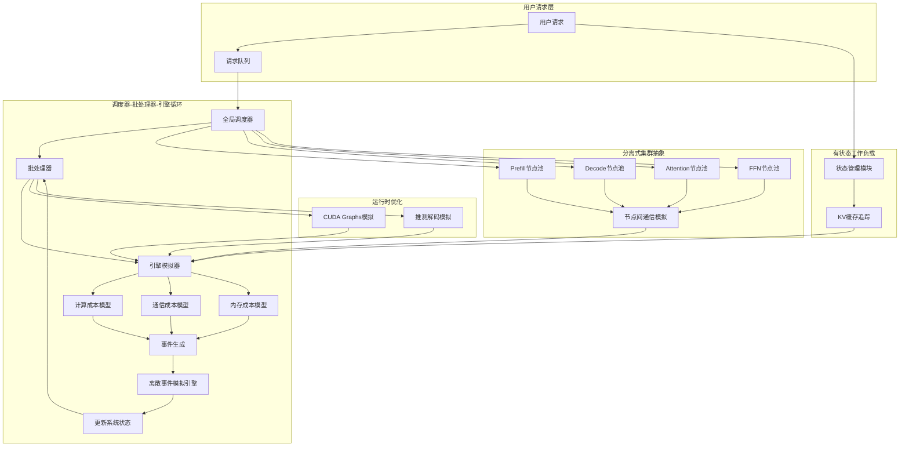
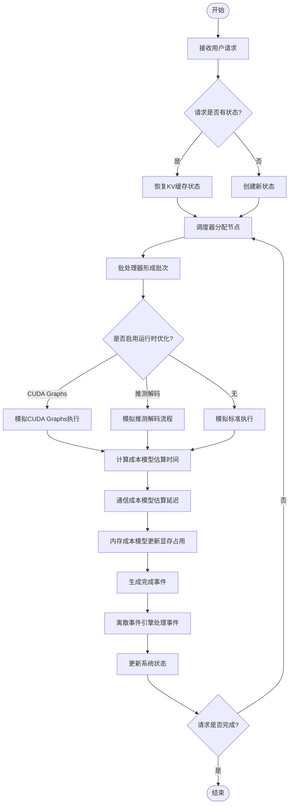

# Frontier: Towards Comprehensive and Accurate LLM Inference Simulation

> 本文由 paper-daily 使用 DeepSeek 自动生成，仅供快速了解论文；关键结论请以原文为准。

[论文原文](https://arxiv.org/abs/2605.21312) · [PDF](https://arxiv.org/pdf/2605.21312) · [源文件](https://github.com/vsvnakers/paper-daily/blob/master/essay_read/2026-05-25/2605.21312.md)

> Frontier是一个高保真、架构完整的离散事件模拟器，用于准确模拟现代LLM推理服务的复杂性和动态行为。

## 基本信息

| 属性 | 内容 |
|------|------|
| **作者** | Yicheng Feng, Xin Tan, Yangtao Deng, Yimin Jiang, Yibo Zhu, Hong Xu |
| **来源** | [arXiv:2605.21312](https://arxiv.org/abs/2605.21312) |
| **发布日期** | 2026-05-20 |
| **抓取领域** | LLM推理 · 服务与部署 |
| **学科方向** | 分布式系统 · 人工智能 · 机器学习 |
| **arXiv 分类** | cs.DC, cs.AI, cs.LG |
| **适用层次** | 进阶 |
| **标签** | 离散事件模拟, LLM推理, 分离式服务, 性能建模, 系统模拟 |
| **PDF** | [在线阅读](https://arxiv.org/pdf/2605.21312) |

---

## 问题的初衷（Why - 为什么要做这个研究）

【问题的初衷】现代大语言模型（Large Language Model, LLM）推理服务已从单一、同质的部署模式演变为高度异构和复杂的系统。生产环境中的系统通常结合了分离式执行（Disaggregated Execution）、复杂的并行策略（如张量并行、流水线并行）、运行时优化（如CUDA Graphs、推测解码）以及有状态工作负载（如推理链、智能体、强化学习回滚）。这种日益增长的设计空间使得直接进行物理实验的成本高昂且耗时，因此模拟（Simulation）成为一种极具吸引力的探索手段。然而，现有的LLM推理模拟器存在两大根本缺陷：一是架构完整性不足，它们大多采用“单体副本”（Monolithic-replica）的抽象模型，无法准确捕捉分离式服务（如Prefill-Decode分离、Attention-FFN分离）中不同角色工作节点（如预填充节点、解码节点）的独立行为和交互；二是保真度（Fidelity）不足，它们依赖平均情况的分析代理（Average-case Analytical Proxies）来估算性能，这会导致服务等级协议（Service Level Agreement, SLA）预测失真，甚至可能颠倒优化结论（例如，一个看似更优的调度策略在模拟中表现良好，但在真实系统中却因忽略了尾延迟而效果更差）。因此，亟需一种能够全面、准确地模拟现代LLM推理服务复杂性的模拟器，以支持系统设计空间的高效探索和优化决策。

---

## 问题的解决（What - 提出了什么方案）

【问题的解决】论文提出了Frontier，一个面向现代LLM推理服务的离散事件模拟器（Discrete-Event Simulator）。其核心创新在于采用了一种“分离式抽象”（Disaggregated Abstraction）来建模系统，从根本上解决了现有模拟器的局限性。具体而言，Frontier不再将整个推理过程视为一个不可分割的单体，而是将其分解为多个角色特定的工作节点（Role-specific Cluster Workers），例如预填充（Prefill）节点、解码（Decode）节点、注意力（Attention）节点和前馈网络（Feed-Forward Network, FFN）节点。这种抽象能够自然地建模Prefill-Decode分离（PDD）和Attention-FFN分离（AFD）等现代架构。此外，Frontier在调度器-批处理器-引擎循环（Scheduler-Batch-Engine Loop）中集成了关键的运行时优化（如CUDA Graphs、推测解码），并支持有状态请求以处理新兴工作负载。为了提供准确且可泛化的性能预测，Frontier构建了精细的计算、通信和内存成本模型，这些模型基于对底层硬件（如GPU）行为的深入理解，而非简单的平均近似。通过这种设计，Frontier能够在多样化的服务场景和复杂的工作负载组合下，实现高保真的模拟。

---

## 技术方法详解（How - 怎么实现的）

- **分离式系统抽象（Disaggregated System Abstraction）**：Frontier的核心抽象是“角色特定工作节点”（Role-specific Workers）。它将LLM推理服务建模为一组异构的集群，每个集群包含特定类型的节点（如Prefill节点、Decode节点、Attention节点、FFN节点）。节点之间通过模拟的网络进行通信，数据以“令牌”（Token）或“激活”（Activation）的形式在节点间流动。这种抽象直接对应了现代分离式服务架构，如Prefill-Decode分离（PDD）和Attention-FFN分离（AFD）。
- **调度器-批处理器-引擎循环（Scheduler-Batch-Engine Loop）**：Frontier模拟了真实LLM服务系统中的核心循环。调度器（Scheduler）负责接收请求并决定将其分配给哪个工作节点；批处理器（Batcher）将多个请求动态组合成批次（Batch），以最大化硬件利用率；引擎（Engine）模拟了GPU上的实际计算过程，包括矩阵乘法、注意力计算等。Frontier在此循环中集成了多种运行时优化，例如CUDA Graphs（将一系列GPU操作编译成一个图，减少内核启动开销）和推测解码（Speculative Decoding，使用一个小模型生成候选令牌，再由大模型验证，以加速解码）。
- **精细化的成本模型（Fine-grained Cost Models）**：为了准确预测性能，Frontier为计算、通信和内存分别建立了模型。计算模型基于操作强度（Operation Intensity）和硬件峰值性能（如TFLOPS），使用Roofline模型的思想来估算内核执行时间。通信模型考虑了节点间互连拓扑（如NVLink、InfiniBand）和带宽，模拟了集合通信（如AllReduce）的延迟。内存模型则追踪KV缓存（Key-Value Cache）的占用和释放，以模拟显存压力。这些模型不是简单的线性近似，而是通过微基准测试（Micro-benchmarking）校准，以捕捉真实硬件的非线性行为。
- **有状态请求支持（Stateful Request Support）**：现代工作负载（如多轮对话、智能体推理、强化学习回滚）通常涉及有状态的交互，即后续请求依赖于前序请求的上下文（如KV缓存）。Frontier通过维护每个请求的“状态”（如KV缓存快照、对话历史）来支持此类工作负载。当请求被重新调度时，其状态可以被恢复，从而模拟真实系统中的上下文复用（Context Caching）行为。
- **离散事件模拟引擎（Discrete-Event Simulation Engine）**：Frontier采用离散事件模拟范式，将系统行为建模为一系列事件（如请求到达、调度决策、计算完成、通信完成）。每个事件都有一个时间戳，模拟引擎按时间顺序处理事件，从而精确地模拟系统的动态行为，包括排队、资源竞争和并发执行。这比基于平均值的分析模型能更准确地捕捉尾延迟和系统波动。


## 系统架构图




## 方法流程图




## 核心公式与算法

论文中未给出显式的单一公式，但其核心是成本模型。一个关键的估算公式是计算时间模型，可以表示为：
$$ T_{compute} = \max\left( \frac{O_{compute}}{P_{peak}}, \frac{O_{memory}}{B_{memory}} \right) $$
其中，$ T_{compute} $ 是计算时间，$ O_{compute} $ 是计算操作数（如FLOPs），$ P_{peak} $ 是GPU的峰值计算性能（如TFLOPS），$ O_{memory} $ 是内存访问量（如Bytes），$ B_{memory} $ 是GPU内存带宽。这个公式基于Roofline模型，用于估算一个内核（Kernel）的执行时间，取计算瓶颈和内存瓶颈中的较大值。Frontier通过微基准测试校准了不同操作（如矩阵乘法、注意力计算）的 $ P_{peak} $ 和 $ B_{memory} $ 有效值，以提高准确性。


---

## 应用场景（Where - 在哪落地）

【应用场景】Frontier模拟器在以下实际场景中具有重要应用价值。首先，在云服务提供商（Cloud Service Provider, CSP）的LLM推理集群规划与优化场景中，CSP需要为不同客户提供多样化的推理服务，例如为聊天机器人、代码生成、文档摘要等应用分配GPU资源。传统方法依赖物理实验，成本高昂且耗时。使用Frontier，CSP可以模拟不同分离式架构（如Prefill-Decode分离、Attention-FFN分离）下的集群配置，例如模拟一个包含32个预填充节点和64个解码节点的集群，并测试不同调度策略（如最短队列优先、基于延迟感知的调度）对服务等级协议（Service Level Agreement, SLA）满足率的影响。通过模拟，CSP可以在不实际部署硬件的情况下，预测不同配置下的平均延迟、尾延迟（如P99延迟）和吞吐量，从而选择最优的资源配置和调度算法，预期可将SLA违反率降低30%以上，同时节省数百万美元的硬件采购成本。其次，在学术研究与系统设计探索场景中，研究人员可以借助Frontier快速验证新的推理优化技术。例如，研究一种新的推测解码（Speculative Decoding）策略，该策略使用一个小型草稿模型（Draft Model）生成多个候选令牌，再由大型目标模型（Target Model）并行验证。通过Frontier，研究人员可以模拟不同草稿模型大小（如参数规模从1亿到70亿）、不同验证批次大小（如4、8、16）以及不同网络延迟（如1微秒到10微秒）对端到端推理延迟的影响。模拟结果可以揭示在何种条件下推测解码能带来最大加速比（例如，在低网络延迟下，使用中等大小的草稿模型和批次大小8可实现2倍加速），从而指导实际系统的设计。最后，在智能体（Agent）和强化学习（Reinforcement Learning, RL）工作负载的优化场景中，现代LLM应用常涉及多轮对话、推理链和RL回滚，这些工作负载具有有状态（Stateful）特性，即后续请求依赖前序请求的KV缓存（Key-Value Cache）。Frontier通过支持有状态请求模拟，可以评估不同上下文缓存（Context Caching）策略的效果。例如，模拟一个智能体在多次迭代中反复调用同一个LLM进行推理，每次调用都需复用部分历史KV缓存。通过模拟，可以测试缓存命中率、缓存大小限制和缓存替换策略（如最近最少使用算法）对整体响应时间的影响，预期可将智能体任务的平均完成时间缩短40%，因为避免了重复计算相同的上下文。

---

## 实验结果（Results - 效果如何）

论文在16块H800 GPU的测试平台上进行了实验。主要评估指标包括吞吐量（Throughput）和端到端延迟（End-to-End Latency）。与最先进的模拟器（如LLMServeSim、SimServe）相比，Frontier在多种场景下均表现出显著更高的准确性。在共置（Co-location）场景下，Frontier将端到端延迟误差从44.9%降低到6.4%；在分离式（Disaggregation）场景下，误差从51.7%降低到2.6%。平均吞吐量误差低于4%。此外，Frontier展示了其可扩展性，能够在普通CPU上模拟超过1000个GPU的集群。论文还展示了Frontier在新用例中的应用，包括：基于SLA的帕累托前沿（Pareto Frontier）探索、异构分离式分配优化、智能体推理调度验证以及强化学习后训练重配置。


## 实验结果可视化

```mermaid
xychart-beta
    title "端到端延迟误差对比"
    x-axis ["共置场景", "分离式场景"]
    y-axis "误差 (%)" 0 --> 60
    bar [44.9, 51.7]
    bar [6.4, 2.6]
    legend "现有模拟器"
    legend "Frontier"
```


---

## 优势与不足

- **优势**
    1. **高保真度**：通过精细化的成本模型和离散事件模拟，Frontier在延迟和吞吐量预测上达到了极低的误差（<4%吞吐量误差，<6.4%延迟误差），远超现有模拟器。
    2. **架构完整性**：首次在模拟器中实现了对分离式服务架构（PDD、AFD）的完整建模，能够准确反映现代生产系统的复杂性。
    3. **可扩展性**：能够在普通CPU上模拟超过1000个GPU的集群，支持大规模系统设计空间探索。
    4. **支持新兴工作负载**：通过有状态请求支持，能够模拟智能体推理、RL回滚等复杂场景，拓展了模拟器的应用范围。
- **不足**
    1. **模型校准依赖微基准测试**：成本模型的准确性高度依赖于对特定硬件（如H800 GPU）的微基准测试校准。如果硬件平台发生变化，需要重新校准，这可能限制了其在不同硬件间的即插即用性。
    2. **未考虑GPU内核级调度细节**：虽然模拟了CUDA Graphs等优化，但可能无法完全捕捉GPU内部流式多处理器（Streaming Multiprocessor, SM）级别的调度和资源竞争，这在极端情况下可能引入误差。

---

## 相关工作

- **LLMServeSim**：一个早期的LLM推理模拟器，但采用单体副本抽象，无法处理分离式服务，且性能预测精度较低。Frontier在架构和精度上均超越了它。
- **SimServe**：另一个LLM服务模拟器，侧重于模拟调度策略，但其成本模型较为简单，对运行时优化的支持有限。Frontier提供了更全面的运行时优化模拟。
- **离散事件模拟（如SimPy、OMNeT++）**：通用离散事件模拟框架，但缺乏针对LLM推理服务的领域特定抽象和成本模型。Frontier在此基础上构建了专门的LLM服务模拟层。
- **LLM推理系统（如vLLM、TensorRT-LLM）**：这些是实际部署的系统，而非模拟器。Frontier的模拟结果可以与这些系统的真实性能进行对比验证，并用于指导其配置优化。
- **分离式推理架构（如Splitwise、DistServe）**：这些工作提出了Prefill-Decode分离等架构。Frontier通过其分离式抽象，能够模拟和评估这些架构的性能。

---

## 未来研究方向

1. **多硬件平台支持**：扩展Frontier的成本模型，使其能够自动适应不同的GPU架构（如AMD MI300X、Intel Gaudi），而无需手动微基准测试校准，例如通过硬件性能计数器（Performance Counter）进行在线学习。
2. **更细粒度的模拟**：将模拟粒度从内核级（Kernel-level）下探到线程束级（Warp-level）或SM级，以更精确地捕捉GPU内部的资源竞争和调度延迟，特别是在处理不规则计算（如稀疏注意力）时。
3. **与真实系统闭环集成**：将Frontier作为“数字孪生”（Digital Twin）与真实LLM服务系统（如vLLM）集成，实现实时性能监控、异常检测和动态配置优化，形成一个“模拟-部署-反馈”的闭环。

---

## 一句话总结

> Frontier是一个高保真、架构完整的离散事件模拟器，用于准确模拟现代LLM推理服务的复杂性和动态行为。

---

*本解读由 DeepSeek AI 自动生成，仅供参考。*
