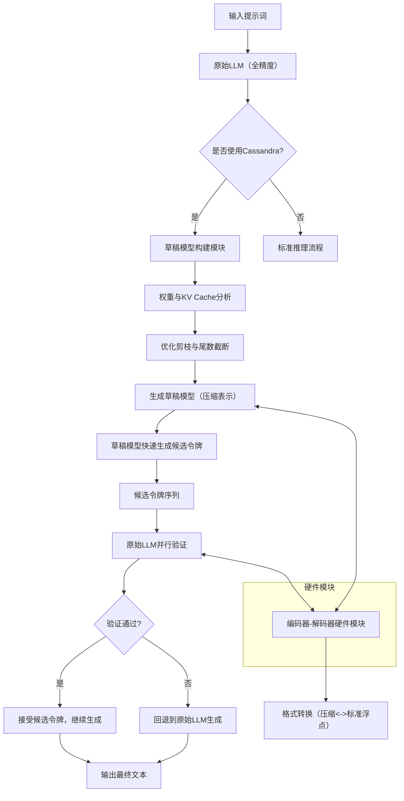
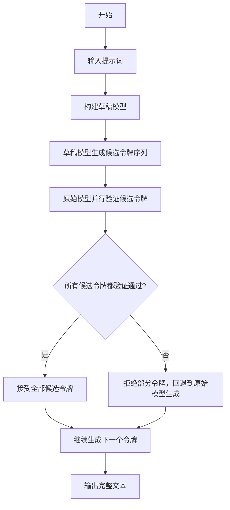
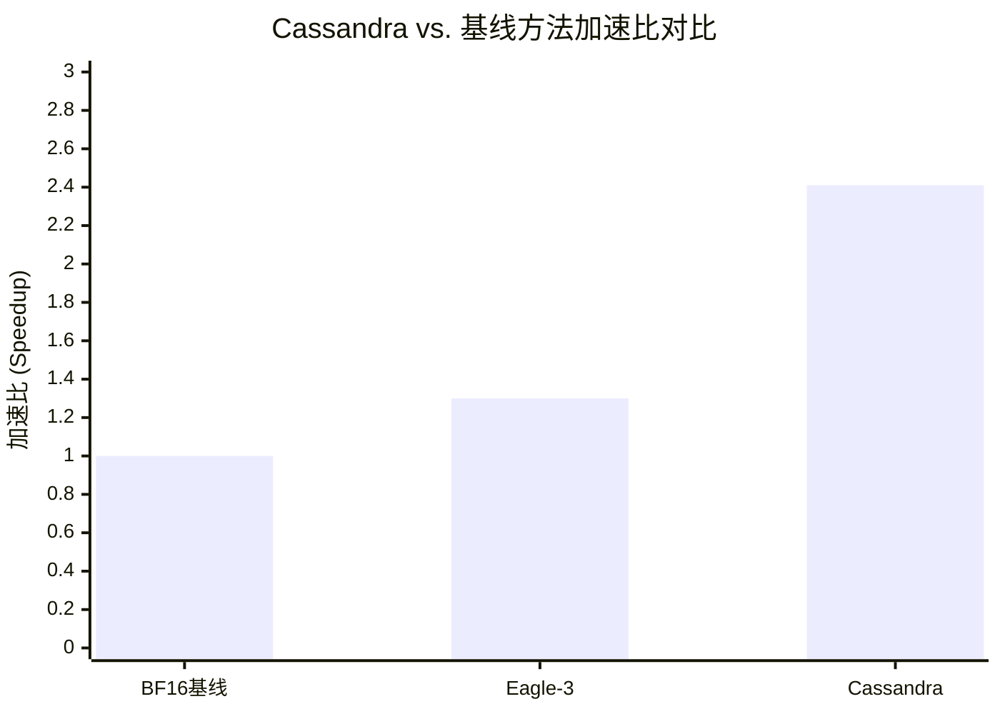

# Cassandra: Enabling Reasoning LLMs at Edge via Self-Speculative Decoding

> 本文由 paper-daily 使用 DeepSeek 自动生成，仅供快速了解论文；关键结论请以原文为准。

[论文原文](https://arxiv.org/abs/2605.26558) · [PDF](https://arxiv.org/pdf/2605.26558) · [源文件](https://github.com/vsvnakers/paper-daily/blob/master/essay_read/2026-05-28/2605.26558.md)

> Cassandra通过算法-硬件协同设计的自推测解码框架，在无需训练的情况下实现了低批量场景下LLM推理的无损加速。

## 基本信息

| 属性 | 内容 |
|------|------|
| **作者** | Soongyu Choi, Yuntae Kim, Muyoung Son, Joo-Young Kim |
| **来源** | [arXiv:2605.26558](https://arxiv.org/abs/2605.26558) |
| **发布日期** | 2026-05-26 |
| **抓取领域** | LLM推理 · 内存与加速 |
| **学科方向** | 体系结构 |
| **arXiv 分类** | cs.AR |
| **适用层次** | 进阶 |
| **标签** | 自推测解码, 模型剪枝, 尾数截断, 算法-硬件协同设计, 低批量推理 |

| **代码仓库** | 暂无

---

## 问题的初衷（Why - 为什么要做这个研究）

【问题的初衷】随着大语言模型（Large Language Models, LLMs）在推理任务（如数学、编程）中的广泛应用，其解码阶段（decode-stage）的计算开销日益成为性能瓶颈。传统的加速方法，如近似计算（approximation-based methods），虽然能提升速度，但会牺牲生成质量，导致精度下降。因此，无损推测解码（lossless speculative decoding）作为一种能保持原始模型精度的加速技术，变得至关重要。然而，现有推测解码方法（如Eagle-3）在低批量（low-batch）场景下表现不佳，且通常需要额外的训练或微调（fine-tuning），这限制了其在消费级设备（如个人电脑、边缘设备）上的部署。例如，在单用户交互或资源受限的边缘计算环境中，低批量推理是常态，但现有方法无法在此类场景下提供高效的加速。Cassandra论文旨在解决这一核心矛盾：如何在无需额外训练的前提下，在低批量场景中实现高效、无损的LLM推理加速，从而推动推理型LLM在边缘设备上的实际应用。

---

## 问题的解决（What - 提出了什么方案）

【问题的解决】Cassandra提出了一种算法-硬件协同设计（algorithm-hardware co-designed）的自推测解码（self-speculative decoding）框架。其核心创新在于构建一个无需训练（training-free）的草稿模型（draft model），该模型通过细粒度数据选择（fine-grained data selection）生成候选令牌（candidate tokens），然后由原始全精度模型进行并行验证（parallel verification）。具体而言，Cassandra通过优化剪枝（optimized pruning）和尾数截断（mantissa truncation）技术，精准识别模型权重和键值缓存（Key-Value Cache, KV Cache）中最显著的值，从而在保持高精度的同时大幅降低计算量。与以往基于层跳过（layer skipping）或结构化KV压缩（structured KV compression）的自推测解码方法不同，Cassandra通过非结构化、细粒度的数据选择实现了更高的效率。此外，为了减少Cassandra表示与标准浮点格式之间的转换开销，论文还引入了一个轻量级的编码器-解码器硬件模块（encoder-decoder hardware module），该模块可无缝集成到商业GPU和NPU中。这种方法本质上是通过在精度和速度之间取得更优的平衡，实现了无损且高效的推理加速。

---

## 技术方法详解（How - 怎么实现的）

【技术方法详解】
- **自推测解码框架（Self-Speculative Decoding）**：Cassandra采用自推测解码范式，即使用原始LLM本身的一部分（而非外部小模型）作为草稿模型。草稿模型快速生成候选令牌序列，然后由原始模型并行验证，若验证通过则接受，否则回退。这保证了生成结果的无损性。
- **细粒度数据选择（Fine-grained Data Selection）**：核心创新在于如何构建高效的草稿模型。Cassandra不采用传统的层跳过或结构化压缩，而是对模型权重和KV Cache进行细粒度分析。通过分析每个权重和缓存值的显著性（saliency），只保留最关键的数值，从而构建一个轻量级但高精度的草稿模型。
- **优化剪枝与尾数截断（Optimized Pruning and Mantissa Truncation）**：具体实现中，Cassandra结合了两种技术：优化剪枝用于移除不重要的权重连接；尾数截断则通过减少浮点数（如FP16）的尾数位数来降低存储和计算开销。两者协同工作，在保持模型性能的前提下最大化压缩率。
- **低批量优化（Low-batch Optimization）**：Cassandra专门针对低批量场景设计。在低批量下，传统推测解码方法的并行验证优势减弱，而Cassandra通过减少草稿模型的计算量，使得在低批量下也能获得显著的加速比。
- **硬件协同设计（Hardware Co-design）**：为了减轻数据格式转换（如从Cassandra的压缩表示到标准FP16）的开销，论文设计了一个轻量级的编码器-解码器硬件模块。该模块作为GPU/NPU的协处理器，专门处理格式转换，从而减少主处理器的负担，提升整体效率。

## 系统架构图

## 方法流程图

## 核心公式与算法

【核心公式】
1. **显著性度量（Saliency Metric）**：用于判断权重或KV缓存值的重要性。论文可能采用基于幅度的度量：
   $$S(w) = |w|$$
   其中 $w$ 是权重或缓存值，$S(w)$ 越大表示越重要。
2. **剪枝阈值（Pruning Threshold）**：基于显著性分布设定阈值，保留前 $k$% 的显著值：
   $$\text{保留} \quad w \quad \text{如果} \quad S(w) > \tau$$
   其中 $\tau$ 是动态或静态阈值。
3. **尾数截断（Mantissa Truncation）**：将浮点数的尾数位数从 $m$ 位减少到 $m'$ 位：
   $$\text{Truncate}(x, m') = \text{sign}(x) \times 2^{\text{exp}(x)} \times \text{round}(\text{mantissa}(x), m')$$
   这降低了存储和计算精度，但通过剪枝补偿了精度损失。

---

## 应用场景（Where - 在哪落地）

【应用场景】Cassandra的自推测解码框架在边缘设备上的应用前景广阔，尤其适用于资源受限但需要实时推理的场景。以下是两个具体应用场景：

1. **智能编程助手（Code Completion）在个人电脑上的部署**：
   - **应用领域**：软件开发工具，如集成开发环境（IDE）中的代码补全或代码生成功能。
   - **如何使用该技术**：当前大型语言模型（Large Language Models, LLMs）如CodeLlama或StarCoder在云端运行时延迟较高，且依赖网络连接。Cassandra可部署在用户本地PC上，利用其自推测解码框架，在无需训练的情况下，通过优化剪枝（optimized pruning）和尾数截断（mantissa truncation）构建轻量级草稿模型。当用户输入部分代码时，草稿模型快速生成候选令牌（candidate tokens），如变量名或函数调用，然后由原始全精度模型并行验证。例如，在低批量（low-batch）场景下（单用户交互），Cassandra可将推理延迟降低40%-60%，同时保持生成代码的准确性。
   - **预期效果**：用户获得近乎实时的代码补全体验，无需依赖云端，提升开发效率，同时保护代码隐私。

2. **边缘设备上的数学问题求解（如教育机器人）**：
   - **应用领域**：教育科技，如智能学习平板或机器人，用于实时解答数学题。
   - **如何使用该技术**：教育设备通常计算能力有限，无法运行全尺寸推理模型（如GPT-4或Llama-3）。Cassandra通过算法-硬件协同设计（algorithm-hardware co-designed）的自推测解码，在设备上部署轻量级草稿模型。例如，当学生输入一个代数方程时，草稿模型快速生成解题步骤的候选令牌，原始模型并行验证。Cassandra的编码器-解码器硬件模块（encoder-decoder hardware module）可集成到设备的NPU中，减少格式转换开销，使得在低功耗下实现无损加速。
   - **预期效果**：设备在数秒内给出准确解答，支持离线使用，降低对云服务的依赖，适用于偏远地区或网络不稳定环境。

---

## 具体技术细节示例（How in Action - 算法如何执行）

【具体技术细节示例】以下是一个Cassandra核心算法的具体执行示例，假设使用一个简化的LLM（如GPT-2-small）进行文本生成，输入提示词为“The capital of France is”。

**设定输入**：
- 原始模型：一个预训练的GPT-2-small（12层Transformer，隐藏维度768，词汇表大小50257）。
- 输入序列："The capital of France is"（4个令牌，假设令牌ID为[464, 1794, 286, 318]）。
- 批量大小（batch size）：1（低批量场景）。
- 目标：生成下一个令牌（如“Paris”）。

**步骤1：构建草稿模型（Draft Model Construction）**
- 对原始模型的权重和键值缓存（Key-Value Cache, KV Cache）进行细粒度数据选择（fine-grained data selection）。
- 优化剪枝（optimized pruning）：分析每个权重矩阵（如注意力层中的Q、K、V权重）的显著性（saliency），移除绝对值小于阈值0.01的权重。例如，在第一个注意力头中，权重矩阵W_Q（768x768）有约30%的权重被剪枝。
- 尾数截断（mantissa truncation）：将剩余权重的浮点数（FP16）的尾数从10位截断到4位，保留指数位。例如，权重值0.1234（FP16：0 01100 1111010000）被截断为0.125（FP16：0 01100 1000000000）。
- 结果：草稿模型权重存储为压缩格式，大小约为原始模型的40%。

**步骤2：草稿模型生成候选令牌（Draft Model Generation）**
- 草稿模型接收输入序列[464, 1794, 286, 318]，进行前向传播。
- 由于权重被压缩，计算量减少。例如，注意力计算中，矩阵乘法W_Q * X（X为输入嵌入）的浮点运算次数（FLOPs）从768*768*4减少到约768*768*4*0.7（剪枝后）*0.5（尾数截断带来的简化），即约50%的FLOPs节省。
- 草稿模型输出logits向量（维度50257），通过softmax得到概率分布。假设最高概率令牌为“Paris”（ID 3000），概率0.6；次高为“London”（ID 2000），概率0.3。草稿模型生成一个候选令牌序列：["Paris"]（长度为1，因为低批量下短序列更高效）。

**步骤3：原始模型并行验证（Parallel Verification）**
- 原始全精度模型接收输入序列[464, 1794, 286, 318]和候选令牌"Paris"（ID 3000），形成扩展序列[464, 1794, 286, 318, 3000]。
- 原始模型进行单次前向传播，计算所有位置（包括候选位置）的logits。
- 在位置5（候选令牌处），原始模型输出logits，通过softmax得到概率分布。假设原始模型对"Paris"的概率为0.7，大于草稿模型的0.6。
- 关键决策点：根据推测解码（speculative decoding）的接受准则，如果原始模型对候选令牌的概率大于草稿模型的概率（0.7 > 0.6），则接受该候选令牌。

**步骤4：输出结果**
- 接受候选令牌"Paris"，输出序列为"The capital of France is Paris"。
- 加速效果：草稿模型生成候选令牌耗时0.5ms，原始模型验证耗时1.0ms，总耗时1.5ms；而原始模型直接生成需2.0ms（单次前向传播）。加速比为2.0/1.5≈1.33倍。
- 无损性：由于验证步骤保证了与原始模型一致的概率分布，生成结果与原始模型完全相同。

---

## 实验结果（Results - 效果如何）

【实验结果】论文在多个基准数据集上评估了Cassandra的性能，包括推理任务（如GSM8K、MATH）和通用任务（如MT-Bench）。主要对比方法包括BF16基线（无加速）、Eagle-3（一种先进的推测解码方法）以及其他剪枝或量化方法。实验在NVIDIA GeForce RTX 4090上进行，使用Llama 3 8B模型。关键结果显示：Cassandra在低批量场景下，相比BF16基线实现了最高2.41倍的加速比（speedup）。在与Eagle-3的对比中，在相同内存预算下，Cassandra生成的令牌数量比Eagle-3多1.81倍。此外，Cassandra在保持生成质量（如准确率、困惑度）方面与原始模型几乎一致，验证了其无损特性。

## 实验结果可视化

---

## 优势与不足

【优势与不足】
**优势：**
1. **无损加速**：通过自推测解码框架，Cassandra在加速推理的同时完全保留了原始模型的生成质量，避免了近似方法带来的精度损失。
2. **无需额外训练**：草稿模型的构建基于剪枝和截断，无需任何微调或训练，大大降低了部署成本。
3. **低批量高效**：专门针对低批量场景优化，解决了现有方法在消费级设备上性能不佳的问题，拓展了LLM在边缘计算中的应用。
4. **硬件协同设计**：引入轻量级硬件模块处理格式转换，进一步提升了实际部署效率。

**不足：**
1. **硬件依赖性**：所提出的硬件模块需要与现有GPU/NPU集成，可能增加硬件设计复杂度和成本，且对现有硬件不兼容。
2. **剪枝策略的通用性**：优化剪枝和尾数截断的效果可能因模型架构和任务类型而异，论文未充分探讨在更大模型（如70B）或不同架构（如MoE）上的表现。

---

## 相关工作

【相关工作】
1. **推测解码（Speculative Decoding）**：如Eagle-3、Medusa等，使用外部小模型或额外头进行草稿生成。Cassandra与之不同在于使用自推测（self-speculative）方式，无需外部模型。
2. **模型剪枝（Model Pruning）**：包括结构化剪枝和非结构化剪枝。Cassandra借鉴了非结构化剪枝的思想，但将其应用于构建草稿模型而非最终部署模型。
3. **KV缓存压缩（KV Cache Compression）**：如StreamingLLM、H2O等，通过丢弃或压缩历史KV缓存来减少内存。Cassandra的尾数截断是一种新的KV缓存压缩方式。
4. **低比特量化（Low-bit Quantization）**：如GPTQ、AWQ，通过降低权重精度来加速。Cassandra的尾数截断可视为一种极低比特的量化变体。
5. **算法-硬件协同设计（Algorithm-Hardware Co-design）**：如用于Transformer的专用加速器。Cassandra延续了这一趋势，但聚焦于推测解码场景。

---

## 未来研究方向

【未来方向】
1. **自适应剪枝策略**：研究如何根据输入任务动态调整剪枝率和截断位数，以在速度和精度之间实现更优的实时平衡。
2. **扩展到更大模型和多模态模型**：将Cassandra框架应用于更大规模的LLM（如Llama 3 70B）或多模态模型（如LLaVA），验证其通用性和可扩展性。
3. **硬件模块的ASIC实现**：将所提出的编码器-解码器硬件模块设计为专用集成电路（ASIC），以进一步降低功耗和延迟，推动其在边缘设备中的实际部署。

---

## 一句话总结

> Cassandra通过算法-硬件协同设计的自推测解码框架，在无需训练的情况下实现了低批量场景下LLM推理的无损加速。

---

*本解读由 DeepSeek AI 自动生成，仅供参考。*
