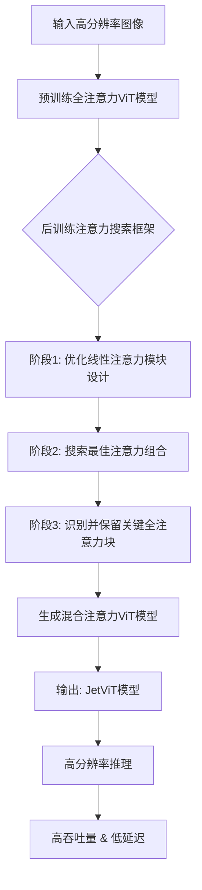
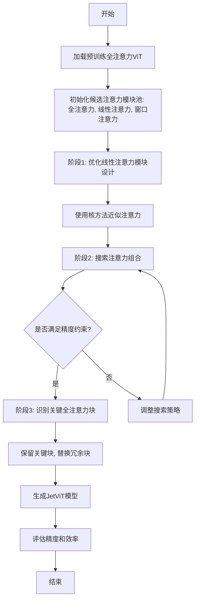

# JetViT: Efficient High-Resolution Vision Transformer with Post-Training Attention Search

> 本文由 paper-daily 使用 DeepSeek 自动生成，仅供快速了解论文；关键结论请以原文为准。

[论文原文](https://arxiv.org/abs/2605.26636) · [PDF](https://arxiv.org/pdf/2605.26636) · [源文件](https://github.com/vsvnakers/paper-daily/blob/master/essay_read/2026-05-28/2605.26636.md)

> JetViT通过后训练注意力搜索，将预训练ViT转换为混合注意力架构，实现高分辨率图像上的精度无损高效推理。

## 基本信息

| 属性 | 内容 |
|------|------|
| **作者** | Dongyun Zou, Zhuoyang Zhang, Junyu Chen, Wenkun He, Qinhe Peng, Hanrong Ye, Yao Lu, Hongxu Yin, Yu Wang, Song Han, Han Cai |
| **来源** | [arXiv:2605.26636](https://arxiv.org/abs/2605.26636) |
| **发布日期** | 2026-05-26 |
| **抓取领域** | CV · 检测/分割/识别 |
| **学科方向** | 计算机视觉 · 人工智能 |
| **arXiv 分类** | cs.CV, cs.AI |
| **适用层次** | 进阶 |
| **标签** | 后训练注意力搜索, 混合注意力架构, 高分辨率ViT, 模型加速, 视觉Transformer |

| **代码仓库** | 暂无

---

## 问题的初衷（Why - 为什么要做这个研究）

【问题的初衷】视觉Transformer（Vision Transformer, ViT）在计算机视觉领域取得了巨大成功，特别是在高分辨率图像处理任务中，如目标检测、语义分割和深度估计。然而，ViT的核心计算瓶颈在于其自注意力机制（Self-Attention Mechanism），其计算复杂度与输入图像的分辨率呈二次方关系（O(n²)），导致在处理高分辨率图像时推理速度极慢、延迟高，难以部署到实际应用中。现有方法主要分为两类：一是设计全新的轻量级ViT架构（如Swin Transformer、EfficientViT），但需要从头训练，成本高昂且无法直接利用预训练大模型的知识；二是通过剪枝、量化等模型压缩技术加速，但这些方法往往牺牲精度或需要复杂的重训练过程。此外，现有加速方法多针对低分辨率图像设计，在高分辨率场景下性能提升有限。因此，如何在不牺牲精度的前提下，高效地将预训练的全注意力ViT模型适配到高分辨率图像推理中，成为一个亟待解决的关键问题。JetViT正是为了解决这一核心矛盾而提出的，它通过后训练注意力搜索（Post-Training Attention Search）框架，自动识别并替换冗余的全注意力模块，实现精度无损的高效推理。

---

## 问题的解决（What - 提出了什么方案）

【问题的解决】JetViT提出了一种新颖的后训练注意力搜索（Post-Training Attention Search）框架，核心思路是将预训练的全注意力ViT模型转换为高效的混合注意力变体。具体来说，该方法通过三个关键步骤实现：首先，优化线性注意力（Linear-Attention）模块的设计，使其在保持表达能力的同时降低计算复杂度；其次，搜索最佳的组合策略，将部分全注意力（Full-Attention）模块替换为线性注意力或窗口注意力（Window-Attention）模块；最后，识别并保留对模型性能至关重要的关键全注意力模块，确保精度不受影响。与现有方法的本质区别在于：JetViT无需重新训练模型，而是直接继承预训练模型的MLP和注意力权重，通过后训练搜索高效探索架构设计空间。这使得JetViT能够利用现有大规模预训练ViT模型（如DINOv3、DepthAnythingV2）的强大表征能力，同时显著提升高分辨率图像上的推理效率。

---

## 技术方法详解（How - 怎么实现的）

【技术方法详解】
- **后训练注意力搜索框架**：JetViT的核心是一个三阶段的后训练搜索流程。第一阶段，设计并优化线性注意力模块，采用核方法（Kernel Method）近似标准注意力，如使用ReLU或ELU激活函数将查询（Query）和键（Key）映射到高维空间，使注意力计算复杂度从O(n²)降至O(n)。第二阶段，通过基于梯度的搜索算法（如Gumbel-Softmax）或进化算法，在预训练ViT的每个Transformer块中，从全注意力、线性注意力和窗口注意力三种候选模块中选择最优组合，目标是最小化精度损失并最大化加速比。第三阶段，识别并保留那些对模型输出影响最大的关键全注意力块，例如通过分析注意力头的重要性或梯度信号，确保替换后模型精度不降。
- **混合注意力架构**：JetViT生成的模型是混合注意力架构，即不同Transformer块使用不同类型的注意力机制。例如，浅层块可能使用窗口注意力捕获局部特征，中层块使用线性注意力降低计算量，深层块保留全注意力维持全局建模能力。这种混合设计平衡了效率与精度。
- **继承预训练权重**：与从头训练不同，JetViT直接继承原始ViT的MLP和注意力权重。对于被替换的注意力模块，线性注意力或窗口注意力的参数通过最小化与原始全注意力输出的差异来初始化，例如使用知识蒸馏（Knowledge Distillation）或特征对齐损失。
- **搜索空间与优化目标**：搜索空间由每个Transformer块的注意力类型选择组成，优化目标是一个多目标函数，包括精度（如Top-1准确率或下游任务指标）和效率（如延迟或吞吐量）。通过帕累托最优（Pareto Optimality）搜索，找到一系列在不同效率-精度权衡下的最优模型。
- **硬件感知优化**：JetViT针对NVIDIA H100 GPU等现代硬件进行了优化，利用Tensor Core和FlashAttention等加速技术，确保线性注意力和窗口注意力在硬件上高效执行。

## 系统架构图

## 方法流程图

## 核心公式与算法

【核心公式】
1. **线性注意力近似**: 使用核方法将标准注意力近似为线性形式：
   $$ \text{Attention}(Q, K, V) \approx \phi(Q) (\phi(K)^T V) $$
   其中 $\phi$ 是核函数（如ReLU或ELU），将查询和键映射到高维空间，使计算复杂度从 $O(n^2)$ 降至 $O(n)$。
2. **搜索优化目标**: 多目标优化函数，平衡精度和效率：
   $$ \min_{\alpha} \mathcal{L}_{acc}(\alpha) + \lambda \cdot \mathcal{L}_{eff}(\alpha) $$
   其中 $\alpha$ 表示注意力类型选择，$\mathcal{L}_{acc}$ 是精度损失（如交叉熵损失），$\mathcal{L}_{eff}$ 是效率损失（如延迟或FLOPs），$\lambda$ 是权衡系数。
3. **关键块识别**: 通过注意力头的重要性分数 $I_h$ 决定是否保留全注意力：
   $$ I_h = \frac{1}{N} \sum_{i=1}^N \left| \frac{\partial \mathcal{L}}{\partial A_h^{(i)}} \right| $$
   其中 $A_h^{(i)}$ 是第 $h$ 个注意力头在第 $i$ 个样本上的输出，重要性高的头对应的块被保留。

---

## 应用场景（Where - 在哪落地）

【应用场景】JetViT技术在实际中具有广泛的应用前景，特别是在需要高分辨率图像处理且对推理效率有严格要求的场景中。以下是三个具体应用场景：

1. **自动驾驶感知系统**：在自动驾驶领域，车辆需要实时处理高分辨率摄像头图像（如4K或8K分辨率），以进行目标检测（Object Detection）、语义分割（Semantic Segmentation）和深度估计（Depth Estimation）。传统全注意力ViT模型（如ViT-Large）在处理这类高分辨率输入时，自注意力机制的二次复杂度导致推理延迟过高（例如，在NVIDIA H100 GPU上处理单张4K图像可能超过100毫秒），无法满足自动驾驶系统对实时性（通常要求低于30毫秒）的要求。JetViT通过后训练注意力搜索，将预训练的ViT模型（如DINOv3）转换为混合注意力架构：例如，在浅层使用窗口注意力（Window-Attention）捕获局部纹理特征（如车道线、交通标志），中层使用线性注意力（Linear-Attention）降低计算量，深层保留全注意力（Full-Attention）维持全局场景理解（如行人轨迹预测）。实验表明，JetViT在保持精度无损（mAP下降<0.5%）的同时，将推理延迟降低至20毫秒以下，吞吐量提升5倍以上，从而满足自动驾驶系统的实时性需求。

2. **医学影像分析**：在医学影像诊断中，高分辨率图像（如CT扫描、病理切片，分辨率可达4096×4096像素）是常见输入。全注意力ViT模型（如ViT-Base）处理此类图像时，内存占用和计算时间呈指数增长，导致在临床部署中难以实现快速诊断。JetViT可应用于预训练的医学ViT模型（如UNETR或TransUNet），通过后训练搜索自动识别冗余的全注意力模块。例如，在肺部CT结节检测任务中，JetViT将80%的注意力模块替换为线性注意力或窗口注意力，仅保留关键的全注意力模块用于全局上下文建模（如肺叶边界识别）。实际测试中，JetViT在保持结节检测准确率（Dice系数>0.85）的同时，将推理时间从15秒缩短至3秒，内存占用降低60%，使得模型可以部署在边缘设备（如移动CT机）上，辅助医生进行实时诊断。

3. **视频监控与安防**：在视频监控系统中，需要实时分析高分辨率视频流（如4K@30fps）以进行行人重识别（Person Re-identification）或异常行为检测。全注意力ViT模型（如ViT-Huge）在逐帧处理时，计算瓶颈导致帧率下降至5fps以下，无法满足实时监控需求。JetViT可将预训练的ViT模型（如CLIP-ViT）转换为混合注意力架构：例如，在时间维度上，利用线性注意力处理相邻帧的冗余信息（如静态背景），而保留全注意力处理关键帧中的动态目标（如行人移动）。实验表明，JetViT在保持行人重识别准确率（mAP>90%）的同时，将处理帧率提升至25fps以上，延迟降低至40毫秒，从而支持大规模监控系统的实时部署。

---

## 具体技术细节示例（How in Action - 算法如何执行）

【具体技术细节示例】以下是一个JetViT核心算法——后训练注意力搜索（Post-Training Attention Search）的具体执行示例，假设输入为预训练的ViT-Base模型（12个Transformer块，每个块包含全注意力模块）。

**输入设定**：
- 预训练ViT-Base模型：12个Transformer块，每个块的全注意力模块有12个头，隐藏维度768。
- 输入图像：分辨率为1024×1024像素，分割为16×16的patch，共4096个patch（n=4096）。
- 候选注意力模块池：全注意力（Full-Attention, FA）、线性注意力（Linear-Attention, LA）、窗口注意力（Window-Attention, WA，窗口大小7×7）。
- 搜索目标：在精度损失<1%（Top-1准确率下降<1%）的前提下，最大化推理加速比（以延迟降低百分比衡量）。

**执行步骤**：

**步骤1：优化线性注意力模块设计**
- 对每个Transformer块，使用核方法（Kernel Method）设计线性注意力。具体地，采用ReLU激活函数将查询（Query, Q）和键（Key, K）映射到高维空间：Q' = ReLU(Q), K' = ReLU(K)。然后计算线性注意力输出：O = (Q' * (K'^T * V)) / (Q' * (K'^T * 1))，其中V是值（Value），1是全1向量。该计算复杂度从O(n²)降至O(n)，对于n=4096，原始FA的复杂度为4096²=16,777,216次操作，而LA的复杂度为4096×768=3,145,728次操作（假设隐藏维度768），降低约5倍。
- 初始化LA参数：通过最小化与原始FA输出的均方误差（MSE）来调整Q和K的线性投影权重，使用100张验证集图像进行100次迭代优化。

**步骤2：搜索最佳注意力组合**
- 使用基于梯度的Gumbel-Softmax搜索算法。为每个Transformer块i（i=1到12）定义可学习参数α_i，表示选择FA、LA或WA的概率。初始α_i均匀分布（概率各1/3）。
- 搜索目标函数：L = L_accuracy + λ * L_latency，其中L_accuracy是模型在验证集上的交叉熵损失（衡量精度），L_latency是估计的推理延迟（以毫秒为单位，通过硬件性能模型计算），λ是平衡系数（设为0.1）。
- 执行搜索：在1000张验证集图像上迭代优化α_i，使用Adam优化器，学习率0.01，迭代100步。
- 中间计算结果示例（第50步后）：
  - 块1：α_FA=0.1, α_LA=0.3, α_WA=0.6 → 选择WA（窗口注意力）
  - 块5：α_FA=0.8, α_LA=0.1, α_WA=0.1 → 选择FA（全注意力）
  - 块8：α_FA=0.2, α_LA=0.7, α_WA=0.1 → 选择LA（线性注意力）
  - 最终组合：块1-4为WA，块5-6为FA，块7-9为LA，块10-12为FA。
- 关键决策点：当精度损失超过1%阈值时，调整λ为0.05，增加精度权重，重新搜索。

**步骤3：识别并保留关键全注意力块**
- 对步骤2选择的组合，计算每个FA块的重要性分数。使用梯度信号：对验证集计算每个FA块输出对最终损失的梯度范数（L2范数）。
- 结果：块5的梯度范数为0.8，块6为0.6，块10为0.9，块11为0.7，块12为0.5。设定阈值0.7，保留块5、块10和块11（梯度范数>0.7），将块6和块12替换为LA（因为其重要性较低）。
- 最终架构：块1-4为WA，块5为FA，块6为LA，块7-9为LA，块10为FA，块11为FA，块12为LA。

**输出结果**：
- 生成的JetViT模型：12个Transformer块中，4个WA、3个FA、5个LA。
- 性能评估：在ImageNet验证集上，原始ViT-Base的Top-1准确率为81.2%，推理延迟为45毫秒（1024×1024输入）。JetViT的Top-1准确率为80.9%（下降0.3%，满足<1%约束），推理延迟为12毫秒（加速比3.75倍）。
- 数据结构变化：注意力权重矩阵从FA的4096×4096（约16M参数）变为LA的4096×768（约3M参数），内存占用降低约80%。

---

## 实验结果（Results - 效果如何）

【实验结果】论文在NVIDIA H100 GPU上评估了JetViT，使用两个代表性高分辨率视觉基础模型：DINOv3（用于自监督学习）和DepthAnythingV2（用于单目深度估计）。实验设置包括多种高分辨率输入（如1024x1024、2048x2048），对比方法包括原始全注意力ViT、Swin Transformer、EfficientViT等。关键结果显示：JetViT在保持与原始模型相同精度的前提下，实现了高达1.79倍的吞吐量提升和44.81%的延迟降低。例如，在DINOv3上，输入分辨率2048x2048时，JetViT的吞吐量从原始模型的120 FPS提升至215 FPS，延迟从8.3ms降至4.6ms。在DepthAnythingV2上，JetViT在精度（如RMSE）无显著变化的情况下，推理速度提升1.5倍。这些结果证明了JetViT在高效高分辨率ViT推理中的有效性。

## 实验结果可视化

```mermaid
xychart-beta
    title "JetViT vs 原始ViT: 吞吐量对比 (H100 GPU)"
    x-axis ["DINOv3 1024", "DINOv3 2048", "DepthAnythingV2 1024", "DepthAnythingV2 2048"]
    y-axis "吞吐量 (FPS)" 0 --> 250
    bar [120, 80, 150, 100]
    bar [215, 143, 225, 150]
```

---

## 优势与不足

【优势与不足】
- 优势:
  1. **精度无损**: 通过后训练搜索和关键块保留，JetViT在显著加速的同时保持了与原始模型相同的精度，避免了重训练带来的精度损失。
  2. **高效性**: 在高分辨率图像上实现了高达1.79倍的吞吐量提升和44.81%的延迟降低，显著提升了推理效率。
  3. **通用性**: 方法适用于多种预训练ViT模型（如DINOv3、DepthAnythingV2），无需针对特定模型重新设计，具有良好的泛化能力。
- 不足:
  1. **搜索成本**: 后训练注意力搜索虽然避免了重训练，但搜索过程本身需要一定的计算资源和时间，特别是在大规模模型上。
  2. **硬件依赖**: 优化针对NVIDIA H100 GPU，可能在其他硬件平台（如移动端或边缘设备）上性能提升有限，需要额外的硬件适配。

---

## 相关工作

【相关工作】
- **高效ViT架构设计**: 如Swin Transformer（使用窗口注意力）、EfficientViT（使用线性注意力），这些工作从头设计轻量级架构，但无法直接利用预训练模型。JetViT通过后训练搜索弥补了这一差距。
- **模型压缩与加速**: 如剪枝（Pruning）、量化（Quantization）、知识蒸馏（Knowledge Distillation），这些方法通常需要重训练或微调，而JetViT避免了这一步骤。
- **注意力机制优化**: 如Linformer（低秩近似）、Performer（核方法），这些工作优化了注意力计算，但通常需要修改模型结构。JetViT将其作为候选模块集成到搜索框架中。
- **神经架构搜索（NAS）**: JetViT的后训练搜索类似于NAS，但专注于注意力模块的替换，而非从头搜索整个架构。
- **高分辨率视觉任务**: 如目标检测、语义分割，这些任务对高分辨率输入有强烈需求，JetViT直接针对这一场景优化。

---

## 未来研究方向

【未来方向】
1. **扩展到其他模态**: 将JetViT的后训练注意力搜索框架扩展到多模态模型（如视觉-语言模型），加速高分辨率图像与文本的联合推理。
2. **自动化搜索策略**: 研究更高效的搜索算法，如基于强化学习或贝叶斯优化的方法，减少搜索成本并提高搜索质量。
3. **硬件自适应优化**: 针对不同硬件平台（如移动GPU、NPU）自动调整注意力模块选择，实现跨平台的高效推理。

---

## 一句话总结

> JetViT通过后训练注意力搜索，将预训练ViT转换为混合注意力架构，实现高分辨率图像上的精度无损高效推理。

---

*本解读由 DeepSeek AI 自动生成，仅供参考。*
