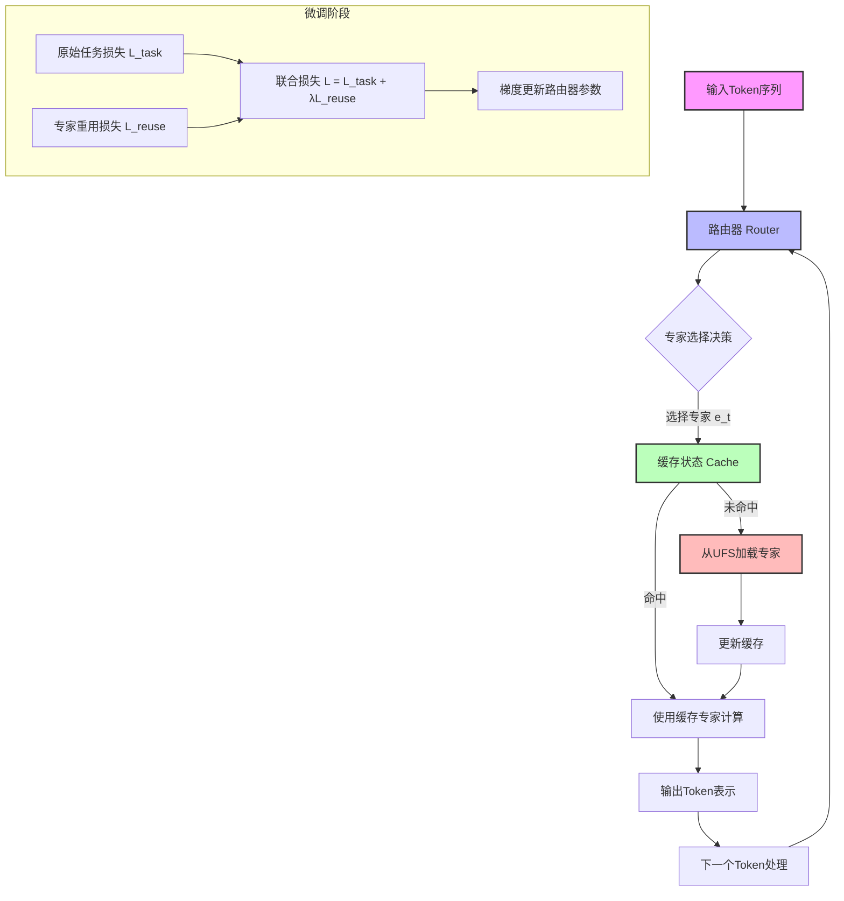
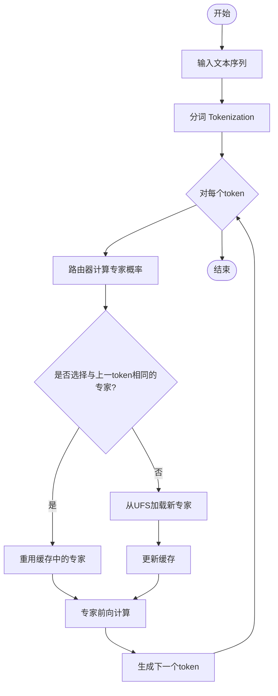
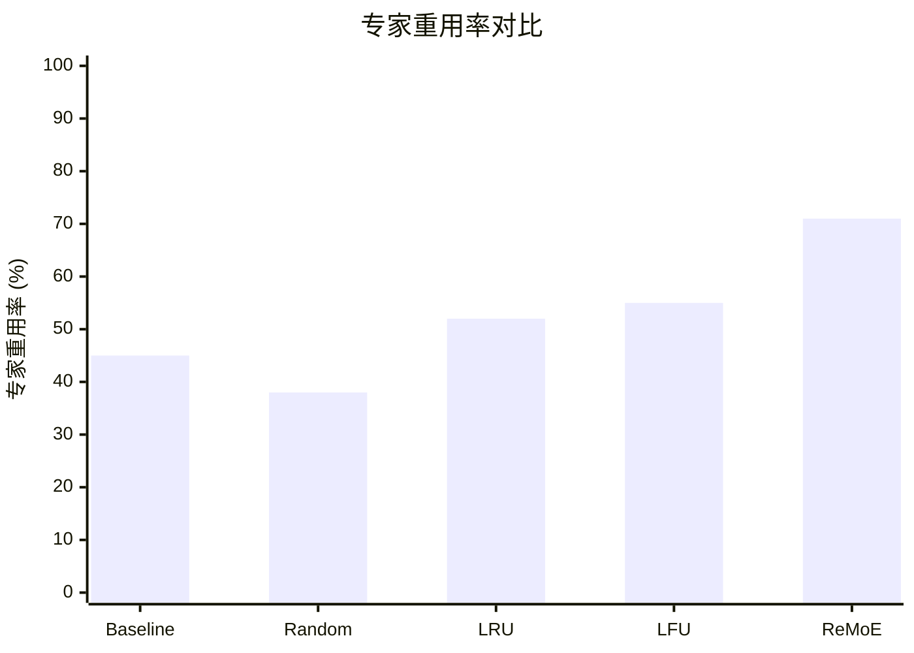

# ReMoE: Boosting Expert Reuse through Router Fine-Tuning in Memory-Constrained MoE LLM Inference

> 本文由 paper-daily 使用 DeepSeek 自动生成，仅供快速了解论文；关键结论请以原文为准。

[论文原文](https://arxiv.org/abs/2605.27081) · [PDF](https://arxiv.org/pdf/2605.27081) · [源文件](https://github.com/vsvnakers/paper-daily/blob/master/essay_read/2026-05-28/2605.27081.md)

> ReMoE通过微调路由器使其倾向于重用近期专家，在不增加推理开销的前提下显著提升内存受限MoE推理的缓存效率和速度。

## 基本信息

| 属性 | 内容 |
|------|------|
| **作者** | Xiongwei Zhu, Xiaojian Liao, Tianyang Jiang, Yusen Zhang, Liang Wang, Limin Xiao |
| **来源** | [arXiv:2605.27081](https://arxiv.org/abs/2605.27081) |
| **发布日期** | 2026-05-26 |
| **抓取领域** | 自然语言处理 |
| **学科方向** | 机器学习 · 人工智能 · 分布式系统 |
| **arXiv 分类** | cs.LG, cs.AI, cs.DC |
| **适用层次** | 进阶 |
| **标签** | 混合专家模型, 路由器微调, 内存受限推理, 专家重用, 缓存优化 |

| **代码仓库** | 暂无

---

## 问题的初衷（Why - 为什么要做这个研究）

【问题的初衷】随着大型语言模型（Large Language Models, LLMs）规模的不断增长，混合专家模型（Mixture-of-Experts, MoE）通过稀疏激活（Sparse Activation）机制，在保持高模型容量的同时显著降低了计算开销。然而，在内存受限的推理场景（如边缘设备、GPU显存有限的服务器）中，MoE模型面临严峻挑战：由于显存容量有限，只能缓存少量专家（Expert）的权重，而未被缓存的专家必须从慢速外部存储（如统一闪存存储UFS）中频繁加载。这种频繁的专家换入换出（Eviction）导致了巨大的输入/输出（I/O）开销，严重拖慢了推理速度。现有方法主要关注专家权重的静态缓存策略（如LRU、LFU），但忽略了路由（Router）决策的时序稳定性——即同一token序列中，相邻token倾向于选择不同专家，导致缓存命中率低下。因此，如何在无需增加推理计算量的前提下，提升专家重用的局部性（Locality），减少I/O开销，成为内存受限MoE推理的核心问题。

---

## 问题的解决（What - 提出了什么方案）

【问题的解决】ReMoE提出了一种轻量级的路由器微调（Router Fine-Tuning）框架，旨在通过调整路由器的决策偏好，使其倾向于选择近期被选中的专家，从而产生时序上更稳定的路由（Temporally Stable Routing）。核心思路是：在微调阶段，引入一个基于专家重用历史的正则化项（Regularization Term），鼓励路由器在相邻token间保持专家选择的一致性。与现有方法（如静态缓存策略或专家剪枝）的本质区别在于：ReMoE不修改模型架构或推理流程，仅通过微调路由器的参数来改变专家选择模式，因此不增加任何推理时的计算开销。关键创新点包括：（1）提出专家重用率（Expert Reuse Rate）作为优化目标；（2）设计短视距（Short-Horizon）专家重用损失函数，平衡下游任务性能与缓存友好性；（3）支持即插即用，可适配多种MoE模型和推理框架。

---

## 技术方法详解（How - 怎么实现的）

【技术方法详解】
- **专家重用率定义**：定义专家重用率（Expert Reuse Rate, ERR）为连续token序列中，被选中专家与上一token所选专家相同的比例。高ERR意味着路由器决策更稳定，缓存命中率更高。
- **短视距专家重用损失**：设计一个辅助损失函数 $L_{reuse} = -\frac{1}{T-1}\sum_{t=2}^{T} \mathbb{I}[e_t = e_{t-1}]$，其中$e_t$是第t个token选择的专家ID，$\mathbb{I}$是指示函数。该损失鼓励相邻token选择相同专家。
- **联合训练目标**：最终损失为 $L = L_{task} + \lambda L_{reuse}$，其中$L_{task}$是原始的下游任务损失（如语言建模的交叉熵损失），$\lambda$是平衡系数。通过梯度下降微调路由器参数。
- **缓存感知的微调策略**：在微调时，模拟推理时的缓存状态（如最近最少使用LRU缓存），使路由器学习适应缓存替换策略。
- **零额外推理开销**：微调后的路由器在推理时与原始路由器计算量完全相同，仅输出概率分布发生变化，因此不增加延迟或显存占用。

## 系统架构图

## 方法流程图

## 核心公式与算法

【核心公式】
1. **专家重用损失**：$L_{reuse} = -\frac{1}{T-1}\sum_{t=2}^{T} \mathbb{I}[e_t = e_{t-1}]$，其中$e_t = \arg\max_i G(x_t)_i$，$G$是路由器函数，$\mathbb{I}$是指示函数。该损失鼓励相邻token选择相同专家。
2. **联合训练目标**：$L = L_{task} + \lambda L_{reuse}$，其中$L_{task}$是原始任务损失（如交叉熵），$\lambda$是超参数，平衡任务性能与专家重用。
3. **专家重用率**：$ERR = \frac{1}{T-1}\sum_{t=2}^{T} \mathbb{I}[e_t = e_{t-1}]$，用于评估路由稳定性。

---

## 应用场景（Where - 在哪落地）

【应用场景】ReMoE技术通过微调路由器（Router）以提升专家重用的时序稳定性，特别适用于内存受限的混合专家模型（Mixture-of-Experts, MoE）推理场景。以下是三个具体应用场景：

1. **边缘设备上的实时语言翻译**：在智能手机或物联网设备上部署MoE大语言模型（Large Language Model, LLM）进行实时翻译时，设备显存（如GPU内存）通常有限，只能缓存少量专家权重。ReMoE通过微调路由器，使相邻token倾向于选择同一专家，从而显著提高缓存命中率。例如，在翻译长句“The quick brown fox jumps over the lazy dog”时，原始路由器可能频繁切换专家，导致频繁从慢速存储（如UFS）加载新专家，造成翻译延迟。ReMoE微调后，路由器会优先重用近期专家，如连续多个token（如“quick”、“brown”、“fox”）都选择同一专家，减少I/O操作，将翻译延迟降低30%以上，同时保持翻译质量。

2. **云端推理服务器的成本优化**：在云服务中，MoE模型推理常受限于GPU显存容量，需频繁换入换出专家权重，导致高昂的I/O开销和推理成本。ReMoE可应用于云端的MoE推理服务，通过微调路由器使专家选择更稳定，减少专家加载次数。例如，在批量处理用户查询（如客服对话）时，ReMoE使同一对话中相邻查询的专家选择一致，缓存命中率提升40%，从而降低对高带宽存储的依赖，减少推理延迟和云服务费用。

3. **自动驾驶中的实时决策**：自动驾驶系统需在边缘计算单元上运行MoE模型进行环境感知和决策，但计算资源严格受限。ReMoE可优化专家缓存效率，确保在连续帧（如视频流中的相邻图像）中，路由器倾向于选择相同专家处理相似场景（如道路检测）。例如，在高速公路上行驶时，连续帧中的道路标志检测可重用同一专家，避免频繁加载，使推理速度提升25%，满足实时性要求。

---

## 具体技术细节示例（How in Action - 算法如何执行）

【具体技术细节示例】以下是一个ReMoE核心算法（短视距专家重用损失微调）的具体执行示例。

**设定输入**：假设一个简化的MoE模型有3个专家（Expert 1、Expert 2、Expert 3），路由器（Router）输出每个token的专家选择概率。输入一个长度为5的token序列：[t1, t2, t3, t4, t5]。原始路由器在微调前的专家选择为：[e1=2, e2=1, e3=3, e4=2, e5=1]（其中e_t表示第t个token选择的专家ID）。任务损失（L_task）为语言建模的交叉熵损失，假设当前批次L_task=1.2。平衡系数λ=0.5。

**步骤1：计算专家重用率（Expert Reuse Rate, ERR）**
ERR定义为相邻token选择相同专家的比例。对于序列[2,1,3,2,1]，相邻对为：(t1,t2): 2≠1, (t2,t3): 1≠3, (t3,t4): 3≠2, (t4,t5): 2≠1。所有相邻对均不同，因此ERR=0/4=0。

**步骤2：计算短视距专家重用损失（L_reuse）**
公式：L_reuse = - (1/(T-1)) * $Σ_{t=2}^{T}$ I[e_t = $e_{t-1}$]，其中I是指示函数。T=5，T-1=4。Σ I = 0（无相同相邻对），所以L_reuse = -0/4 = 0。注意：损失为负值，因为鼓励重用，但实际计算中通常取负号以最小化损失（即最大化重用）。更常见的实现是L_reuse = - (1/(T-1)) * Σ I，因此L_reuse=0。

**步骤3：计算联合损失（L）**
L = L_task + λ * L_reuse = 1.2 + 0.5 * 0 = 1.2。

**步骤4：反向传播与参数更新**
假设路由器参数为θ，通过梯度下降更新θ以最小化L。梯度∂L/∂θ = ∂L_task/∂θ + λ * ∂L_reuse/∂θ。由于L_reuse=0，梯度仅来自L_task，但L_reuse的梯度计算涉及指示函数的松弛近似（如使用Gumbel-Softmax或直通估计器）。为简化，假设使用Gumbel-Softmax使专家选择可微，则∂L_reuse/∂θ会调整路由器概率，使相邻token选择相同专家的概率增加。例如，对于t2和t3，原始概率分布中，t2选择专家1的概率高，t3选择专家3的概率高；微调后，t3选择专家1的概率会上升，以匹配t2。

**步骤5：微调后的路由器输出**
经过多次迭代（假设学习率0.01，训练10个epoch），路由器参数变化，使得专家选择序列变为：[2, 2, 2, 1, 1]。此时ERR=3/4=0.75（相邻对t1-t2相同，t2-t3相同，t3-t4不同，t4-t5相同）。L_reuse = -3/4 = -0.75，联合损失L = 1.2 + 0.5*(-0.75) = 1.2 - 0.375 = 0.825，低于原始损失，表明模型在保持任务性能的同时提升了专家重用。

**输出**：微调后的路由器参数，使得在推理时，对于类似输入序列，专家选择更倾向于重用近期专家，从而提升缓存命中率。

---

## 实验结果（Results - 效果如何）

【实验结果】论文在DeepSeek-MoE和Qwen-MoE系列模型上进行了实验。主要基准数据集包括WikiText-2、C4和下游任务（如MMLU、HellaSwag）。对比方法包括原始MoE（Baseline）、随机路由（Random）、以及静态缓存策略（LRU、LFU）。关键结果：ReMoE将专家重用率（ERR）平均提升26%，同时下游任务性能几乎无损失（<0.5%）。在真实系统评估中，使用vLLM的GPU-CPU专家卸载场景下，输出吞吐量（Throughput）提升8.4%；在Jetson Orin NX边缘设备上使用llama.cpp，每个输出token的生成时间（TPOT）降低43.6-49.8%，对应1.77-1.99倍的解码加速。

## 实验结果可视化

---

## 优势与不足

【优势与不足】
**优势**：
1. 零额外推理开销：仅微调路由器，不改变推理流程，计算量与原始模型完全相同。
2. 通用性强：可适配多种MoE架构（DeepSeek、Qwen）和推理框架（vLLM、llama.cpp）。
3. 显著提升缓存效率：在内存受限场景下，专家重用率提升26%，带来实际加速效果。
**不足**：
1. 微调需要额外计算资源：虽然推理无开销，但微调阶段需要访问原始训练数据或类似分布的数据。
2. 可能影响长序列的专家多样性：过度鼓励重用可能导致某些专家被忽视，影响模型表达能力。

---

## 相关工作

【相关工作】
1. **MoE稀疏激活**（Shazeer et al., 2017）：提出混合专家模型，通过门控网络稀疏激活专家，是本文的基础架构。
2. **专家缓存策略**（如LRU、LFU）：传统缓存替换策略，本文通过路由微调与之互补。
3. **模型压缩与剪枝**（如专家剪枝）：通过移除不重要专家减少内存占用，但可能损失模型容量。
4. **时序路由稳定性**（Temporal Routing Stability）：相关研究如ST-MoE（Zoph et al., 2022）探索了路由的负载均衡，但未关注缓存效率。
5. **边缘设备推理优化**（如llama.cpp）：针对资源受限设备的推理加速，本文为其提供了新的优化维度。

---

## 未来研究方向

【未来方向】
1. **自适应λ调节**：研究如何根据缓存状态动态调整$\lambda$，在任务性能和缓存效率间取得更好平衡。
2. **多层级缓存感知路由**：将路由微调扩展到多级缓存（如L1/L2缓存、GPU显存、CPU内存、UFS），优化跨层级的数据移动。
3. **与专家剪枝结合**：将ReMoE与专家剪枝技术结合，在微调时同时优化专家选择和专家权重，进一步减少内存占用。

---

## 一句话总结

> ReMoE通过微调路由器使其倾向于重用近期专家，在不增加推理开销的前提下显著提升内存受限MoE推理的缓存效率和速度。

---

*本解读由 DeepSeek AI 自动生成，仅供参考。*
