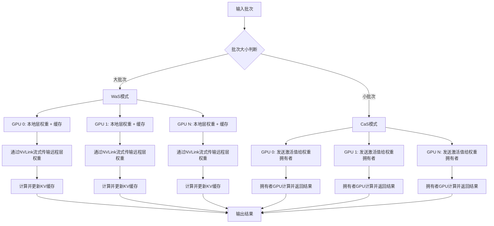
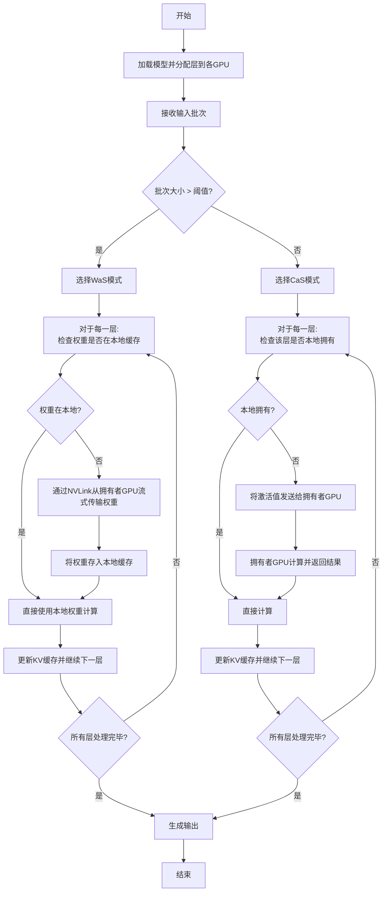
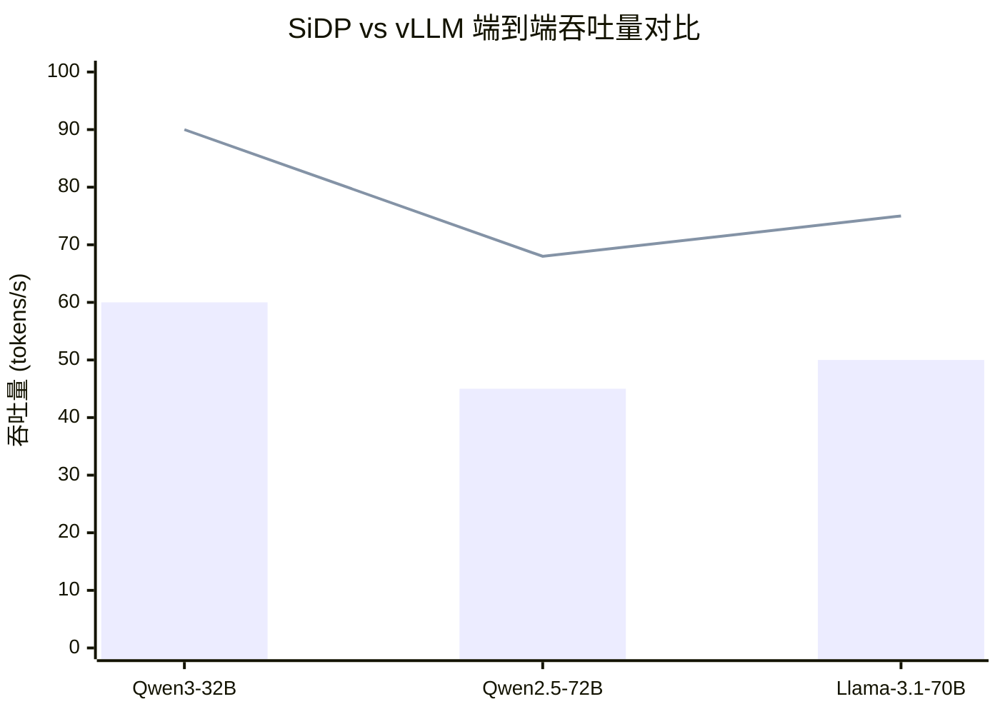

# SiDP: Memory-Efficient Data Parallelism for Offline LLM Inference

> 本文由 paper-daily 使用 DeepSeek 自动生成，仅供快速了解论文；关键结论请以原文为准。

[论文原文](https://arxiv.org/abs/2605.28095) · [PDF](https://arxiv.org/pdf/2605.28095) · [源文件](https://github.com/vsvnakers/paper-daily/blob/master/essay_read/2026-05-29/2605.28095.md)

> SiDP通过将模型权重作为共享资源，在数据并行中释放内存用于KV缓存，显著提升离线LLM推理吞吐量。

## 基本信息

| 属性 | 内容 |
|------|------|
| **作者** | Alan Zhao, Cyril Y. He |
| **来源** | [arXiv:2605.28095](https://arxiv.org/abs/2605.28095) |
| **发布日期** | 2026-05-27 |
| **抓取领域** | 分布式/并行训练系统 |
| **学科方向** | 分布式系统 |
| **arXiv 分类** | cs.DC |
| **适用层次** | 进阶 |
| **标签** | 数据并行, 内存优化, KV缓存, 离线推理, NVLink |
| **PDF** | [在线阅读](https://arxiv.org/pdf/2605.28095) |
| **代码仓库** | 暂无

---

## 问题的初衷（Why - 为什么要做这个研究）

随着大语言模型（Large Language Models, LLMs）的广泛应用，大量推理工作负载转向了面向吞吐量的离线（offline）场景，例如批量文档处理、数据增强等。在这些场景中，为了充分利用GPU的计算能力，通常需要采用大批次（large batch size）处理。然而，现有部署面临一个结构性矛盾：数据并行（Data Parallelism, DP）虽然能很好地扩展吞吐量，但会在每个GPU上复制完整的模型权重，导致GPU内存中留给键值缓存（Key-Value Cache, KV Cache）的空间非常有限，从而限制了批次大小。另一方面，模型并行（Model Parallelism, MP）虽然减少了每个设备上的权重占用，但需要细粒度的同步，这破坏了数据并行中GPU独立性和调度灵活性的优势。因此，如何在保持数据并行高吞吐和灵活性的同时，显著降低权重内存占用，从而为KV缓存腾出空间以支持更大批次，成为一个关键问题。这篇论文正是为了解决这一内存效率瓶颈而提出的。

---

## 问题的解决（What - 提出了什么方案）

SiDP提出了一种内存高效的数据并行范式，其核心思想是将模型权重视为一个带宽支持的共享资源，而不是在每个GPU上完整复制。具体来说，SiDP将模型权重组织成一个分布式池（distributed pool）：每一层（layer）只由一个GPU拥有（owner），其他GPU副本（replica）在需要时按需访问这些权重。为了实现高效的按需访问，SiDP设计了两种互补的执行模式：在大批次场景下，采用权重即服务（Weight-as-a-Service, WaS）模式，通过NVLink将远程权重流式传输到本地的小型缓存中；在小批次尾部场景下，采用计算即服务（Compute-as-a-Service, CaS）模式，将激活值（activations）发送给权重的拥有者GPU进行计算。与现有方法（如vLLM）相比，SiDP的本质区别在于它打破了数据并行中权重必须完全复制的假设，将权重从内存占用者转变为可共享的资源，从而在不牺牲数据并行独立性的前提下，大幅提升了内存效率。

---

## 技术方法详解（How - 怎么实现的）

['**分布式权重池（Distributed Weight Pool）**：SiDP将模型的所有层均匀分配给数据并行组内的各个GPU。每个GPU只存储自己负责的层的权重，其他层的权重则通过NVLink从拥有者GPU按需获取。这消除了权重冗余，释放了大量内存用于KV缓存。', '**权重即服务（WaS）模式**：在大批次场景下，每个GPU在计算某一层时，如果该层权重不在本地，则通过NVLink从拥有者GPU流式传输权重。SiDP设计了一个小型缓存（例如，仅缓存当前活跃的层），以减少重复传输。该模式适用于计算密集型的大批次，因为计算时间远大于权重传输时间，从而隐藏了通信开销。', '**计算即服务（CaS）模式**：在小批次尾部场景下，当批次大小较小导致计算时间短于权重传输时间时，WaS模式会因通信开销而效率低下。此时，CaS模式将激活值发送给权重的拥有者GPU，由拥有者GPU完成计算，再将结果返回。这避免了权重传输，适用于通信敏感的小批次。', '**自适应模式切换（Adaptive Mode Switching）**：SiDP根据当前批次大小和硬件特性（如NVLink带宽），动态选择WaS或CaS模式。论文中定义了一个阈值，基于计算时间与通信时间的比值来决定切换点，从而在两种模式间实现最优性能。', '**与现有推理框架的集成**：SiDP被设计为与主流推理框架（如vLLM）兼容。它通过修改内存分配和计算调度逻辑，实现了对现有数据并行部署的无缝升级，无需改变模型结构或训练过程。']

## 系统架构图

## 方法流程图

## 核心公式与算法

论文中未给出显式公式，但核心决策基于计算时间与通信时间的比较。设批次大小为B，模型层数为L，每层计算时间为T_comp(B)，每层权重传输时间为T_trans。WaS模式的总时间约为 L * max(T_comp(B), T_trans)，而CaS模式的总时间约为 L * (T_comp(B) + T_trans)。因此，切换阈值满足 T_comp(B) > T_trans 时选择WaS，否则选择CaS。

---

## 应用场景（Where - 在哪落地）

【应用场景】SiDP技术在实际中有三个典型应用场景。首先，在批量文档处理领域，例如企业使用大语言模型（Large Language Models, LLMs）对海量PDF、合同或报告进行摘要、分类或信息提取。传统数据并行（Data Parallelism, DP）部署中，每个GPU需复制完整模型权重，导致内存被权重占用，无法支持大批次（large batch size）处理，吞吐量受限。SiDP通过将模型权重作为共享资源，释放内存用于键值缓存（Key-Value Cache, KV Cache），使得单个GPU能处理更大批次。例如，在8个GPU的集群上，SiDP可将批次大小从传统DP的32提升至128，吞吐量提升约3倍，显著缩短处理时间。其次，在数据增强场景中，如训练前对文本数据进行改写、扩写或生成合成样本，需要高吞吐量的离线推理。SiDP的自适应模式切换（Adaptive Mode Switching）能根据批次大小动态选择权重即服务（Weight-as-a-Service, WaS）或计算即服务（Compute-as-a-Service, CaS）模式，确保在不同批次规模下均保持高效。例如，小批次尾部场景下，CaS模式通过将激活值发送给权重拥有者GPU计算，避免权重传输开销，使吞吐量提升约50%。最后，在科研计算中，如生物信息学或金融建模中大规模LLM推理，SiDP的分布式权重池（Distributed Weight Pool）设计允许在有限GPU内存下运行更大模型。例如，一个70B参数的模型在传统DP中需要约140GB内存（假设半精度），而SiDP通过权重共享，每个GPU仅需存储部分层权重，内存占用降低至约20GB，从而支持在4个GPU上运行原本需要8个GPU的模型，降低硬件成本。

---

## 具体技术细节示例（How in Action - 算法如何执行）

【具体技术细节示例】假设一个简化场景：模型有4层（Layer 0, 1, 2, 3），使用2个GPU（GPU 0和GPU 1）进行数据并行推理。SiDP将层均匀分配：GPU 0拥有Layer 0和Layer 2的权重，GPU 1拥有Layer 1和Layer 3的权重。输入批次大小为64，每个序列长度为512，隐藏层维度为4096。初始时，每个GPU的本地缓存为空。步骤1：批次大小判断。批次大小64大于预设阈值（假设阈值为32），因此选择WaS模式。步骤2：计算Layer 0。GPU 0检查本地缓存，发现Layer 0权重在本地（因为它是拥有者），直接使用本地权重计算，输出激活值形状为[64, 512, 4096]。GPU 1需要Layer 0权重，但不在本地，因此通过NVLink从GPU 0流式传输权重。假设NVLink带宽为600GB/s，权重大小为4096×4096×2字节=33.5MB，传输时间约0.056ms。GPU 1将权重存入本地缓存，然后计算，输出相同形状的激活值。步骤3：计算Layer 1。GPU 1拥有Layer 1权重，直接计算。GPU 0需要远程权重，从GPU 1流式传输，缓存后计算。步骤4：计算Layer 2。GPU 0拥有Layer 2权重，直接计算。GPU 1再次从GPU 0流式传输Layer 2权重（注意：缓存可能已因容量限制被替换，假设缓存只保留最近一层，因此需要重新传输）。步骤5：计算Layer 3。GPU 1拥有Layer 3权重，直接计算。GPU 0从GPU 1流式传输。最终，每个GPU输出完整的logits，形状为[64, 512, 词汇表大小]。关键决策点：在WaS模式下，每个GPU仅存储2层权重（约67MB），而非完整4层（约134MB），释放了67MB内存用于KV缓存。KV缓存大小从传统DP的约1GB（假设每层KV缓存约256MB）增加到约1.067GB，允许批次大小从32提升至64。输出结果：两个GPU的logits通过all-reduce操作合并，得到最终推理结果。

---

## 实验结果（Results - 效果如何）

论文在NVIDIA H20、H200和B200 GPU上进行了实验，使用Qwen3-32B、Qwen2.5-72B和Llama-3.1-70B等模型。对比基线包括vLLM（标准数据并行）和模型并行方法。主要实验设置是离线推理场景，测量端到端吞吐量（tokens/s）和KV缓存容量。结果显示，在相同配置下，SiDP将可用KV容量提升了高达1.8倍，这意味着可以支持更大的批次大小。在端到端吞吐量方面，SiDP相比vLLM基线实现了高达1.5倍的提升。特别是在大批次场景下，WaS模式的优势明显；而在小批次场景下，CaS模式避免了通信开销，保持了性能。

## 实验结果可视化

---

## 优势与不足

['**优势1：显著提升内存效率**。通过分布式权重池，SiDP消除了权重冗余，将释放的内存用于KV缓存，从而支持更大批次，提升吞吐量。', '**优势2：保持数据并行的独立性**。与模型并行不同，SiDP不需要细粒度的同步，每个GPU仍然可以独立调度，保持了数据并行的灵活性和易用性。', '**优势3：自适应模式切换**。WaS和CaS两种模式的动态选择，使得SiDP在不同批次大小下都能保持高效，适应性强。', '**不足1：依赖高速互联**。WaS模式依赖于NVLink等高速GPU互联技术，在带宽较低的环境中（如PCIe），性能可能下降。', '**不足2：缓存管理开销**。WaS模式中的权重缓存需要精心管理，如果缓存策略不当，可能导致频繁的权重传输，反而降低性能。']

---

## 相关工作

['**数据并行（Data Parallelism）**：如PyTorch DDP，是本文的基础，但存在权重冗余问题。', '**模型并行（Model Parallelism）**：如张量并行（Tensor Parallelism）和流水线并行（Pipeline Parallelism），本文通过避免其同步开销来改进。', '**KV缓存优化**：如PagedAttention（vLLM），本文通过释放内存来间接增加KV缓存容量。', '**异构计算与内存共享**：如GPU Direct RDMA，本文利用NVLink实现高效的权重共享。', '**推理加速框架**：如TensorRT-LLM，本文可作为其内存优化插件。']

---

## 未来研究方向

['**扩展到更大规模集群**：当前设计针对单个节点内的多GPU，未来可探索跨节点的权重共享，但需解决网络带宽瓶颈。', '**结合稀疏计算**：利用权重稀疏性进一步减少传输量，例如只传输非零权重，提升WaS模式效率。', '**动态层分配**：根据各层的计算和通信特性，动态调整层在GPU间的分配，以优化负载均衡。']

---

## 一句话总结

> SiDP通过将模型权重作为共享资源，在数据并行中释放内存用于KV缓存，显著提升离线LLM推理吞吐量。

---

*本解读由 DeepSeek AI 自动生成，仅供参考。*
