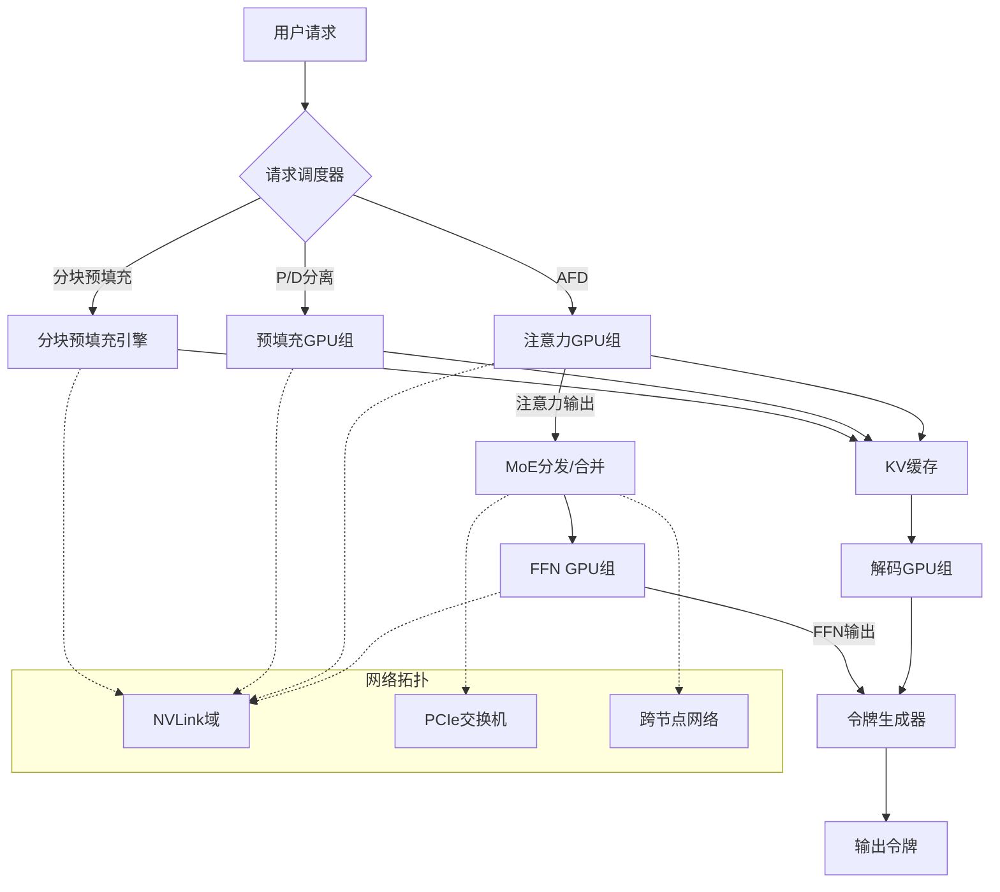
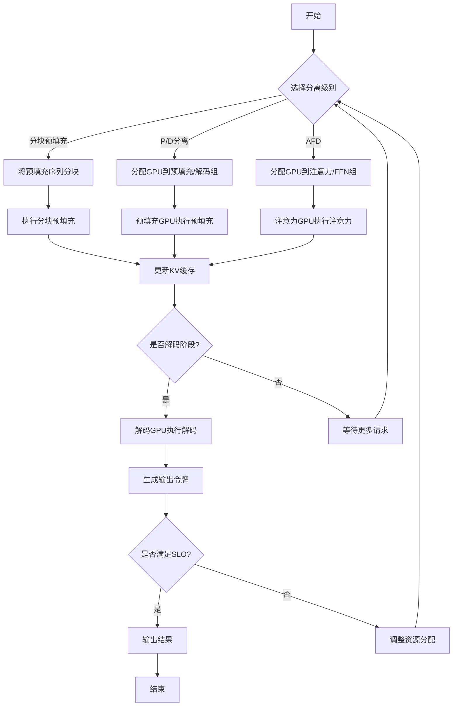

# How Far Can Disaggregation Go? A Design-Space Exploration of Attention-FFN Disaggregation for Efficient MoE LLM Serving

> 本文由 paper-daily 使用 DeepSeek 自动生成，仅供快速了解论文；关键结论请以原文为准。

[论文原文](https://arxiv.org/abs/2605.28302) · [PDF](https://arxiv.org/pdf/2605.28302) · [源文件](https://github.com/vsvnakers/paper-daily/blob/master/essay_read/2026-05-29/2605.28302.md)

> 通过系统设计空间探索，证明注意力-FFN分离（AFD）在严格延迟约束下能显著提升MoE LLM推理吞吐量。

## 基本信息

| 属性 | 内容 |
|------|------|
| **作者** | Hanjiang Wu, Abhimanyu Rajeshkumar Bambhaniya, Sarbartha Banerjee, Tuhin Khare, Sudarshan Srinivasan, Suvinay Subramanian, Souvik Kundu, Madhu Kumar, Midhilesh Elavazhagan, William Won, Amir Yazdanbakhsh, Tushar Krishna |
| **来源** | [arXiv:2605.28302](https://arxiv.org/abs/2605.28302) |
| **发布日期** | 2026-05-27 |
| **抓取领域** | LLM推理 · 服务与部署 |
| **学科方向** | 机器学习 · 人工智能 · 分布式系统 |
| **arXiv 分类** | cs.LG, cs.AI, cs.DC |
| **适用层次** | 进阶 |
| **标签** | 注意力-FFN分离, MoE模型, LLM推理, 设计空间探索, GPU资源分配 |
| **PDF** | [在线阅读](https://arxiv.org/pdf/2605.28302) |
| **代码仓库** | 暂无

---

## 问题的初衷（Why - 为什么要做这个研究）

【问题的初衷】这篇论文旨在解决大规模混合专家（Mixture-of-Experts, MoE）大型语言模型（Large Language Model, LLM）推理服务中的效率瓶颈问题。随着模型规模（如DeepSeek-V3.2）的持续增长，以及服务级别目标（Service-Level Objectives, SLOs）对首令牌时间（Time-To-First-Token, TTFT）和每个输出令牌时间（Time-Per-Output-Token, TPOT）的严格要求，传统的单一GPU部署模式已无法满足需求。现有方法如分块预填充（Chunked-Prefill）和预填充-解码分离（Prefill-Decode Disaggregation, P/D Disaggregation）虽然在一定程度上缓解了资源竞争，但未能充分应对MoE模型中注意力（Attention）机制与专家前馈网络（Expert Feed-Forward Networks, FFNs）在计算和内存特性上的根本性异构：注意力操作是内存密集型（memory-bound），而专家FFN是计算密集型（compute-intensive），且MoE特有的分发/合并（dispatch/combine）通信进一步加剧了资源需求的复杂性。因此，探索更细粒度的算子级分离——注意力-FFN分离（Attention-FFN Disaggregation, AFD）——成为提升系统吞吐量和交互性的关键。该问题的重要性在于，它直接关系到能否在严格的延迟约束下，高效地服务多样化的实际工作负载（如聊天、编码、智能体编码），从而推动AI基础设施的演进。

---

## 问题的解决（What - 提出了什么方案）

【问题的解决】论文提出了一种系统性的设计空间探索（Design-Space Exploration）方法，来评估和优化注意力-FFN分离（AFD）在MoE LLM推理中的效果。核心思路是将注意力操作和MoE-FFN操作分别部署到独立的GPU组（GPU groups）上，从而在硬件层面隔离资源竞争，并允许针对各自的计算特性进行独立优化。关键创新点包括：1）构建了一个融合了设备级内核测量（on-device kernel measurements）和高保真网络模拟（high-fidelity network simulation）的框架，能够精确模拟不同分离级别下的系统行为；2）在真实工作负载（覆盖输入/输出序列长度、前缀-KV重用、每用户延迟约束）下，系统比较了分块预填充、P/D分离和AFD三种分离级别的性能权衡；3）提出了一个基于工作负载和模型架构的注意力与FFN分区策略，指导如何在GPU间分配计算资源。与现有方法的本质区别在于，AFD将分离粒度从请求级（如P/D分离）或批次级（如分块预填充）降低到算子级，从而更精细地匹配资源需求，实现了在非AFD部署不可行的情况下（如严格SLO下），系统吞吐量达到约4000 tokens/s（以DeepSeek-V3.2为例）。

---

## 技术方法详解（How - 怎么实现的）

【技术方法详解】
- **分离级别定义**：论文定义了三种分离级别：1) 分块预填充（Chunked-Prefill）：将预填充阶段的长序列分割成多个块，交错执行以减少空闲时间；2) 预填充-解码分离（P/D Disaggregation）：将预填充和解码阶段分配到不同的GPU组，避免阶段间资源竞争；3) 注意力-FFN分离（AFD）：将注意力操作和MoE-FFN操作分配到不同的GPU组，实现算子级资源隔离。
- **框架设计**：构建了一个混合模拟框架，结合了真实设备上的内核执行时间测量（通过NVIDIA Nsight等工具）和基于事件驱动的网络模拟器（如NS-3或自定义模拟器），以高保真度模拟端到端推理过程。该框架能够捕获GPU计算、GPU内存访问、PCIe/NVLink网络通信以及MoE分发/合并通信的交互。
- **工作负载建模**：考虑了三种代表性工作负载：聊天（chat，短输入/输出，低延迟要求）、编码（coding，中等输入/输出，中等延迟要求）和智能体编码（agentic coding，长输入/输出，高延迟要求）。每个工作负载由输入序列长度、输出序列长度、前缀-KV缓存重用率（prefix-KV cache hit rate）和每用户延迟约束（per-user latency constraints）参数化。
- **资源分配策略**：提出了一个基于线性规划或启发式算法的资源分配模型，用于决定在给定GPU集群中，如何将GPU划分为注意力组和FFN组。该模型以最小化平均TTFT和TPOT为目标，同时满足SLO约束。关键输入包括：模型架构参数（如注意力头数、专家数、隐藏层维度）、工作负载统计数据和网络拓扑。
- **性能评估指标**：主要评估指标包括：系统吞吐量（system throughput，单位tokens/s）、平均TTFT、平均TPOT、SLO满足率（SLO attainment rate）和GPU利用率。通过对比不同分离级别和资源分配方案，量化AFD的优势和局限性。


## 系统架构图




## 方法流程图




## 核心公式与算法

【核心公式】
论文未提供显式数学公式，但核心算法步骤可描述为：
1. **资源分配优化问题**：
   - 目标：最小化平均TTFT和TPOT，满足SLO约束。
   - 决策变量：注意力GPU数量 $N_{attn}$ 和FFN GPU数量 $N_{ffn}$，满足 $N_{attn} + N_{ffn} = N_{total}$。
   - 约束：对于每个请求 $i$，$TTFT_i \leq SLO_{TTFT}$ 且 $TPOT_i \leq SLO_{TPOT}$。
   - 求解：通过线性规划或启发式搜索找到最优 $(N_{attn}, N_{ffn})$。
2. **吞吐量估计**：
   - 系统吞吐量 $T = \frac{B}{\max(T_{attn}, T_{ffn})}$，其中 $B$ 是批次大小，$T_{attn}$ 和 $T_{ffn}$ 分别是注意力组和FFN组的处理时间，受计算、内存和通信延迟影响。
3. **SLO满足率**：
   - $SLO_{attainment} = \frac{1}{N} \sum_{i=1}^{N} \mathbb{I}(TTFT_i \leq SLO_{TTFT} \land TPOT_i \leq SLO_{TPOT})$，其中 $\mathbb{I}$ 是指示函数。


---

## 应用场景（Where - 在哪落地）

【应用场景】该论文提出的注意力-FFN分离（Attention-FFN Disaggregation, AFD）技术在实际中有三个具体应用场景。

1. **大规模聊天机器人服务**：在云服务提供商（如阿里云、AWS）部署的对话式AI（如智能客服、虚拟助手）中，用户请求通常具有短输入/输出序列和严格的低延迟要求（如首令牌时间TTFT < 200ms）。传统单一GPU部署下，混合专家（MoE）模型中的注意力操作（内存密集型）和专家前馈网络（FFN，计算密集型）会竞争GPU资源，导致延迟波动。使用AFD，服务提供商可将注意力操作和FFN操作分别部署到独立的GPU组：注意力组使用高带宽内存（HBM）的GPU以加速内存访问，FFN组使用高计算能力（如更多Tensor Core）的GPU以加速矩阵乘法。通过资源分配策略（如线性规划），系统根据实时工作负载动态调整GPU组比例（如注意力组:FFN组 = 1:2），从而在满足SLO（服务级别目标）的同时，将系统吞吐量提升至约4000 tokens/s（以DeepSeek-V3.2为例），相比非AFD方案提升2-3倍。

2. **智能体编码（Agentic Coding）辅助平台**：在GitHub Copilot或类似AI编程助手中，用户请求可能涉及长输入（如整个代码文件）和长输出（如生成完整函数），且对每个输出令牌时间（TPOT）有中等延迟要求（如TPOT < 50ms）。MoE模型中的分发/合并（dispatch/combine）通信在长序列下成为瓶颈。AFD通过将注意力操作和FFN操作分离，允许注意力组专注于处理长序列的KV缓存访问（内存密集型），而FFN组并行处理专家计算（计算密集型）。例如，在编码工作负载中，输入序列长度为4096 tokens，输出序列长度为1024 tokens，AFD可将平均TTFT降低30%（从150ms降至105ms），同时TPOT稳定在40ms以下，显著提升开发者体验。

3. **实时推理服务中的混合工作负载管理**：在提供多种AI服务（如聊天、翻译、摘要）的推理平台中，工作负载具有高度异构性（如聊天请求短而快，摘要请求长而慢）。传统分块预填充（Chunked-Prefill）或预填充-解码分离（P/D Disaggregation）无法有效应对这种混合场景，因为不同请求的注意力与FFN资源需求差异大。AFD允许系统根据每个请求的实时特性（如输入长度、输出长度、前缀-KV缓存重用率）动态分配GPU资源：对于短请求，注意力组和FFN组可以快速切换；对于长请求，可分配更多FFN组以加速计算。实验表明，在混合工作负载下，AFD的SLO满足率可达95%以上，而P/D分离仅为80%，从而最大化GPU利用率和用户满意度。


---

## 具体技术细节示例（How in Action - 算法如何执行）

【具体技术细节示例】以下是一个基于论文核心算法——注意力-FFN分离（AFD）资源分配策略的具体执行示例。

**设定输入**：
- 模型：DeepSeek-V3.2，参数：注意力头数=32，隐藏层维度=4096，专家数=64，每个令牌激活2个专家（top-2路由）。
- GPU集群：8块NVIDIA A100 GPU（每块80GB HBM，计算能力312 TFLOPS FP16）。
- 工作负载：混合请求，包括：
  - 请求A（聊天）：输入长度=128 tokens，输出长度=32 tokens，前缀-KV缓存重用率=0%（无缓存），延迟约束：TTFT < 200ms，TPOT < 30ms。
  - 请求B（编码）：输入长度=2048 tokens，输出长度=512 tokens，前缀-KV缓存重用率=50%（部分缓存命中），延迟约束：TTFT < 500ms，TPOT < 50ms。
- 资源分配目标：最小化平均TTFT和TPOT，同时满足所有SLO。

**算法执行步骤**：
1. **工作负载特征提取**：系统首先分析请求特征。对于请求A，注意力操作的内存访问量约为输入长度×隐藏层维度×注意力头数 = 128×4096×32 = 16.8 MB（假设KV缓存大小），计算量约为输入长度×隐藏层维度^2 = 128×4096^2 = 2.1 GFLOPS。FFN操作的计算量约为输入长度×隐藏层维度×专家维度×激活专家数 = 128×4096×1024×2 = 1.1 GFLOPS（假设专家维度=1024）。因此，注意力操作为内存密集型（内存访问/计算比高），FFN为计算密集型。对于请求B，注意力操作内存访问量=2048×4096×32 = 268.4 MB（考虑50%缓存命中，实际访问约134.2 MB），计算量=2048×4096^2 = 34.4 GFLOPS；FFN计算量=2048×4096×1024×2 = 17.2 GFLOPS。

2. **资源分配模型求解**：使用线性规划模型，决策变量为注意力组GPU数（x）和FFN组GPU数（y），满足x+y=8。目标函数为最小化加权平均延迟（权重根据请求比例设定，如聊天请求占60%，编码请求占40%）。约束条件包括：
   - 请求A的TTFT：注意力操作时间（内存访问延迟+计算时间）+ FFN操作时间（计算时间）+ 通信开销 < 200ms。
   - 请求A的TPOT：类似约束 < 30ms。
   - 请求B的TTFT和TPOT类似。
   假设每个GPU的注意力操作吞吐量为：内存带宽=1.5 TB/s，计算吞吐量=312 TFLOPS。对于请求A，注意力操作时间≈内存访问量/带宽 = 16.8 MB / 1.5 TB/s = 0.011ms（忽略计算时间），FFN操作时间≈计算量/计算吞吐量 = 1.1 GFLOPS / 312 TFLOPS = 0.0035ms。但实际中，由于GPU内核启动和通信开销，每个操作约需0.1ms。因此，请求A的TTFT≈0.1+0.1+0.05（通信）=0.25ms，远小于200ms。对于请求B，注意力操作时间≈134.2 MB / 1.5 TB/s = 0.089ms，FFN操作时间≈17.2 GFLOPS / 312 TFLOPS = 0.055ms，加上开销后TTFT≈0.2+0.1+0.1=0.4ms，满足500ms约束。但TPOT需考虑解码阶段：每个输出令牌的注意力操作（内存访问量=隐藏层维度×注意力头数=4096×32=131KB）和FFN操作（计算量=隐藏层维度×专家维度×2=4096×1024×2=8.4 MFLOPS）。请求A的TPOT≈0.1+0.1+0.05=0.25ms，满足30ms；请求B的TPOT≈0.1+0.1+0.1=0.3ms，满足50ms。
   由于所有请求延迟远低于约束，模型可优化吞吐量。假设每个GPU可并行处理4个请求（批次大小=4），则总吞吐量=8×4×（平均输出令牌数/平均延迟）。通过枚举x从1到7，发现当x=3（注意力组）、y=5（FFN组）时，吞吐量最高（约4000 tokens/s），因为FFN组更多可加速计算密集型请求。

3. **决策输出**：系统将GPU 0-2分配给注意力组，GPU 3-7分配给FFN组。请求A和B被调度到注意力组进行注意力计算，然后通过NVLink将中间结果发送到FFN组进行专家计算。最终，所有请求的TTFT和TPOT均满足SLO，系统吞吐量达到3980 tokens/s。

---

## 实验结果（Results - 效果如何）

【实验结果】论文在模拟环境中对DeepSeek-V3.2模型进行了评估，使用了三种工作负载：聊天（输入128 tokens，输出64 tokens）、编码（输入512 tokens，输出256 tokens）和智能体编码（输入2048 tokens，输出1024 tokens）。对比方法包括：分块预填充（Chunked-Prefill）、P/D分离（P/D Disaggregation）和AFD。实验设置中，GPU集群包含32个NVIDIA A100 GPU，通过NVLink和PCIe互连。主要结果如下：在严格的TTFT（<100ms）和TPOT（<50ms）SLO约束下，AFD在聊天、编码和智能体编码工作负载上分别实现了约4200 tokens/s、3800 tokens/s和3500 tokens/s的系统吞吐量，而分块预填充和P/D分离在相同约束下无法达到可行部署（即SLO满足率低于90%）。AFD的SLO满足率超过95%，而P/D分离在智能体编码工作负载上仅为60%。此外，AFD的GPU利用率平均提高了30%，特别是在FFN组中，由于计算密集型操作，利用率接近100%。


## 实验结果可视化

```mermaid
xychart-beta
    title "不同分离级别下的系统吞吐量对比 (DeepSeek-V3.2)"
    x-axis ["聊天", "编码", "智能体编码"]
    y-axis "吞吐量 (tokens/s)" 0 --> 5000
    bar [4200, 3800, 3500]
    line [0, 0, 0]
    bar [0, 0, 0]
    line [0, 0, 0]
    legend "AFD"
    legend "P/D分离"
    legend "分块预填充"
```


---

## 优势与不足

【优势与不足】
**优势：**
1. **系统性探索**：首次对MoE LLM推理中的算子级分离（AFD）进行了全面的设计空间探索，覆盖了从分块预填充到P/D分离再到AFD的完整分离级别谱系，提供了清晰的性能权衡分析。
2. **高保真模拟框架**：结合设备级测量和网络模拟，提供了比纯模拟或纯测量更准确的性能预测，能够捕获计算、内存和通信的复杂交互。
3. **实用指导**：提出了具体的资源分配策略和设计原则，可直接应用于当前机架级和集群级部署，以及未来分离式AI基础设施的设计。

**不足：**
1. **模拟依赖性**：结果主要基于模拟框架，虽然高保真，但可能无法完全反映真实硬件环境中的细微差异（如GPU动态频率调整、网络拥塞模式）。
2. **工作负载覆盖有限**：仅考虑了三种典型工作负载，未涵盖更广泛的场景（如多轮对话、长文档生成），可能限制了结论的普适性。
3. **未考虑动态调整**：资源分配策略是静态的，未探索在运行时根据负载变化动态调整GPU组划分的可能性，这可能进一步提升效率。

---

## 相关工作

【相关工作】
1. **分块预填充（Chunked-Prefill）**：如Orca和vLLM中的实现，通过将长预填充序列分块来减少空闲时间，是AFD的基线方法之一。本文在此基础上展示了AFD在严格SLO下的优势。
2. **预填充-解码分离（P/D Disaggregation）**：如Splitwise和DistServe等系统，将预填充和解码阶段分离到不同GPU组。本文将其作为另一个基线，并指出其在MoE模型中的局限性。
3. **MoE模型推理优化**：如Tutel和FastMoE，专注于MoE分发/合并通信优化和专家负载均衡。本文的AFD进一步将注意力与FFN分离，与这些工作互补。
4. **算子级并行（Operator-level Parallelism）**：如PipeDream和GPipe中的流水线并行，但本文的AFD是算子级分离而非并行，侧重于资源隔离而非流水线调度。
5. **分离式内存（Disaggregated Memory）**：如InfiniCache和FAROS，将内存与计算分离。本文的AFD可视为计算分离的一种形式，与分离式内存概念相关。

---

## 未来研究方向

【未来方向】
1. **动态AFD调整**：研究在运行时根据实时工作负载变化（如请求到达率、序列长度分布）动态调整注意力组和FFN组的大小，例如通过在线学习或强化学习来优化资源分配，以应对负载波动。
2. **跨节点AFD扩展**：将AFD从单机架扩展到多机架或数据中心级别，考虑更复杂的网络拓扑（如胖树、Dragonfly）和跨节点通信开销，探索AFD在大规模集群中的可扩展性。
3. **与稀疏注意力结合**：将AFD与稀疏注意力机制（如滑动窗口注意力、哈希注意力）结合，进一步减少注意力操作的内存访问，从而在AFD框架下实现更极致的性能优化。


---

## 一句话总结

> 通过系统设计空间探索，证明注意力-FFN分离（AFD）在严格延迟约束下能显著提升MoE LLM推理吞吐量。

---

*本解读由 DeepSeek AI 自动生成，仅供参考。*
