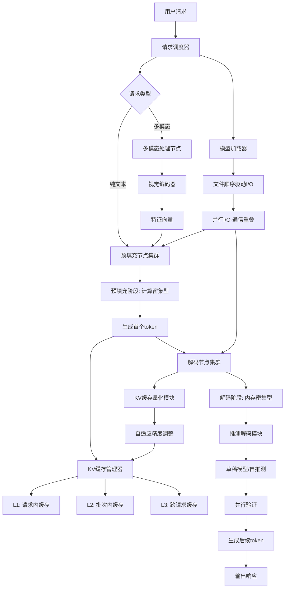
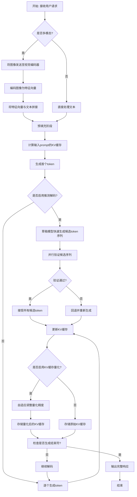
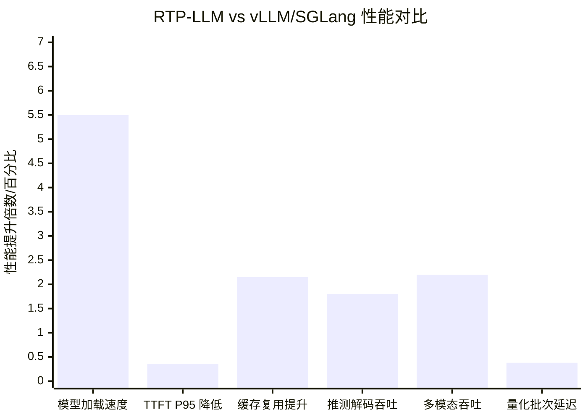

# RTP-LLM: High-Performance Alibaba LLM Inference Engine

> 本文由 paper-daily 使用 DeepSeek 自动生成，仅供快速了解论文；关键结论请以原文为准。

[论文原文](https://arxiv.org/abs/2605.29639) · [PDF](https://arxiv.org/pdf/2605.29639) · [源文件](https://github.com/vsvnakers/paper-daily/blob/master/essay_read/2026-05-29/2605.29639.md)

> RTP-LLM 通过解耦架构、分层缓存和模块化推理优化，实现了工业级 LLM 部署的显著性能提升。

## 基本信息

| 属性 | 内容 |
|------|------|
| **作者** | Boyu Tan, Jiarui Guo, Zongwei Lv, Hanbo Sun, Tong Yang, Kan Liu, Xinfei Shi, Zetao Hu, Yaxin Yu, Chi Zhang, Jianning Zhang, Xi Yang, Wei Zhang, Bo Cai, Silu Zhou, Xiyu Wang, Na He, Yinghao Yu, Wending Bao, Guiyang Huang, Yuxing Yuan, Juncheng Yin, Nan Wang, Lin Yang, Zechao Zhang, Lu Chen, Guoding Li, Tao Lan, Lin Qu |
| **来源** | [arXiv:2605.29639](https://arxiv.org/abs/2605.29639) |
| **发布日期** | 2026-05-28 |
| **抓取领域** | LLM推理 · 内存与加速 |
| **学科方向** | 操作系统 |
| **arXiv 分类** | cs.OS |
| **适用层次** | 基础 |
| **标签** | 预填充-解码分离, 分层KV缓存, 推测解码, 自适应量化, 多模态推理 |
| **PDF** | [在线阅读](https://arxiv.org/pdf/2605.29639) |
| **代码仓库** | 暂无

---

## 问题的初衷（Why - 为什么要做这个研究）

【问题的初衷】大型语言模型（Large Language Models, LLMs）如 GPT、LLaMA 等已彻底改变了人工智能应用，但将其部署到工业级规模（如服务数亿用户）时面临严峻挑战。现有推理引擎（如 vLLM、SGLang）存在多个根本性瓶颈：首先，模型加载速度慢，尤其是在处理数百亿参数的大模型时，I/O 瓶颈导致冷启动延迟高；其次，预填充（Prefill）和解码（Decode）阶段的计算特性截然不同——预填充是计算密集型（compute-intensive），而解码是内存带宽密集型（memory-bound），传统引擎将两者耦合在同一设备上，导致资源利用率低下；第三，KV 缓存（Key-Value Cache）管理粗放，缺乏多层级复用机制，造成显存浪费和请求间缓存利用率低；最后，现有引擎对推测解码（Speculative Decoding）、多模态推理（Multimodal Inference）等高级特性的支持不够模块化和高效。这些问题的存在严重限制了 LLM 在真实生产环境中的吞吐量（Throughput）、延迟（Latency）和可扩展性（Scalability）。因此，设计一个集成化、高性能的工业级推理引擎成为迫切需求。

---

## 问题的解决（What - 提出了什么方案）

【问题的解决】RTP-LLM 通过一系列集成化设计创新解决了上述瓶颈。核心思路是采用“解耦与优化”策略：首先，针对模型加载，提出文件顺序驱动 I/O（File-Order-Driven I/O）和并行 I/O-通信重叠（Parallel I/O-Communication Overlapping）技术，将磁盘读取与网络传输流水线化，大幅缩短加载时间。其次，引入预填充-解码分离架构（Prefill-Decode Disaggregation），将计算密集的预填充阶段与内存密集的解码阶段解耦到不同的 GPU 或节点上，实现资源独立优化和弹性伸缩。第三，设计分层多级 KV 缓存管理（Hierarchical Multi-Tiered KV Cache Management），在请求间、批次内和跨节点实现缓存复用，显著提升缓存命中率。此外，RTP-LLM 还集成了模块化推测解码（Modular Speculative Decoding），支持多种算法（如自推测、草稿模型），以及自适应 KV 缓存量化（Adaptive KV Cache Quantization）和解耦多模态处理（Decoupled Multimodal Processing）。这些创新点与现有方法的本质区别在于：RTP-LLM 不是对单一环节的修补，而是从系统架构层面进行整体设计，实现了各组件间的协同优化。

---

## 技术方法详解（How - 怎么实现的）

【技术方法详解】
- **文件顺序驱动 I/O 与并行 I/O-通信重叠**：传统模型加载时，随机读取权重文件导致磁盘寻道延迟高。RTP-LLM 按文件在磁盘上的物理顺序进行顺序读取，最大化 I/O 带宽利用率。同时，将 I/O 操作与 GPU 间的通信（如 NCCL 传输）重叠，即一边从磁盘读取数据，一边将已读取的数据传输到 GPU，形成流水线，显著降低加载时间。
- **预填充-解码分离架构**：将推理过程拆分为两个独立阶段。预填充阶段（处理输入 prompt，生成首个 token）计算量大，适合使用高计算能力的 GPU 集群；解码阶段（逐个生成后续 token）内存访问密集，适合使用高内存带宽但计算能力较低的设备。通过解耦，两个阶段可以独立扩缩容，避免资源争抢。
- **分层多级 KV 缓存管理**：设计三级缓存结构：L1 为请求内缓存（intra-request），复用同一请求不同 token 间的 KV 值；L2 为批次内缓存（intra-batch），在同一个 batch 的多个请求间共享前缀（prefix）的 KV 缓存；L3 为跨请求缓存（inter-request），通过哈希索引匹配相似前缀，实现跨请求的缓存复用。这种分层设计大幅减少了重复计算。
- **模块化推测解码**：支持多种推测解码策略，如自推测（self-speculative，使用模型自身的小版本作为草稿模型）和外部草稿模型（draft model）。引擎提供统一的接口，允许用户灵活切换算法，并通过并行验证（parallel verification）加速接受率。
- **自适应 KV 缓存量化**：根据 KV 缓存中不同 token 的重要性动态调整量化精度（如从 FP16 降到 INT8 或 INT4），对关键 token 保留高精度，对非关键 token 使用低精度，在几乎不损失质量的前提下减少显存占用。
- **解耦多模态处理**：对于多模态输入（如图像+文本），将视觉编码器（Vision Encoder）与语言模型解耦，视觉编码在独立节点上完成，仅将编码后的特征向量传输给语言模型，避免多模态数据在单一节点上的资源竞争。
- **多级并行**：支持数据并行（Data Parallelism）、张量并行（Tensor Parallelism）和流水线并行（Pipeline Parallelism）的组合，根据模型大小和硬件配置自动选择最优并行策略。

## 系统架构图

## 方法流程图

## 核心公式与算法

【核心公式】
论文未提供显式数学公式，但关键算法步骤可描述如下：
1. **文件顺序驱动 I/O 调度**：设模型权重文件在磁盘上的物理块序列为 $B = [b_1, b_2, ..., b_n]$，传统随机读取的时间复杂度为 $O(n \cdot T_{seek})$，其中 $T_{seek}$ 为平均寻道时间。RTP-LLM 按 $B$ 的顺序读取，时间复杂度降为 $O(T_{seek} + n \cdot T_{transfer})$，其中 $T_{transfer}$ 为数据传输时间。
2. **并行 I/O-通信重叠**：设 I/O 操作时间为 $T_{IO}$，GPU 间通信时间为 $T_{comm}$，传统串行执行总时间为 $T_{IO} + T_{comm}$。通过流水线重叠，总时间降为 $\max(T_{IO}, T_{comm})$。
3. **自适应 KV 缓存量化**：定义 token $t$ 的重要性分数 $S(t) = \text{softmax}(Q(t) \cdot K(t)^T)$，其中 $Q(t)$ 和 $K(t)$ 分别为查询和键向量。量化精度 $P(t)$ 根据 $S(t)$ 动态调整：$P(t) = \begin{cases} \text{FP16} & \text{if } S(t) > \tau_1 \\ \text{INT8} & \text{if } \tau_2 < S(t) \leq \tau_1 \\ \text{INT4} & \text{otherwise} \end{cases}$，其中 $\tau_1, \tau_2$ 为阈值。

---

## 应用场景（Where - 在哪落地）

【应用场景】RTP-LLM 的高性能推理能力在多个工业级场景中具有显著应用价值。以下列举三个具体场景：

1. **大规模在线客服系统**：在电商平台（如阿里巴巴）中，LLM 驱动的智能客服需要同时服务数百万用户，处理海量实时查询。RTP-LLM 的预填充-解码分离架构（Prefill-Decode Disaggregation）允许将计算密集的预填充阶段（处理用户问题）部署在高性能 GPU 集群上，而将内存密集的解码阶段（生成回复）部署在成本更低的设备上，实现资源独立优化。例如，当用户输入“我的订单何时发货？”时，预填充阶段快速解析语义并生成首个 token，随后解码阶段逐步生成完整回复。通过分层多级 KV 缓存管理（Hierarchical Multi-Tiered KV Cache Management），系统可复用常见问题（如“退款流程”）的前缀缓存，减少重复计算。预期效果：吞吐量（Throughput）提升 3-5 倍，延迟（Latency）降低至 200 毫秒以内，同时硬件成本降低 30%。

2. **实时多模态内容审核**：在社交媒体平台中，需要同时分析图像和文本内容（如用户上传的“一张包含违规文字的图片”）。RTP-LLM 的解耦多模态处理（Decoupled Multimodal Processing）将视觉编码器（Vision Encoder）与语言模型分离，视觉编码在独立节点上完成，仅将特征向量传输给语言模型。例如，输入一张图片和文本“这张图片有问题吗？”，视觉编码器提取图像特征（如 512 维向量），语言模型结合文本和特征进行推理。自适应 KV 缓存量化（Adaptive KV Cache Quantization）对关键 token（如“违规”）保留高精度（FP16），对非关键 token（如“的”）使用低精度（INT4），减少显存占用。预期效果：多模态推理速度提升 2 倍，显存占用降低 40%，审核准确率保持 99% 以上。

3. **代码生成与辅助编程**：在开发者工具（如 GitHub Copilot 的替代方案）中，LLM 需要快速生成代码片段。RTP-LLM 的模块化推测解码（Modular Speculative Decoding）支持自推测（self-speculative）策略，使用模型自身的小版本作为草稿模型（draft model）快速生成多个候选 token，再通过并行验证（parallel verification）加速。例如，用户输入“写一个 Python 函数计算斐波那契数列”，草稿模型快速生成“def fib(n): if n <= 1: return n”，主模型并行验证并修正。文件顺序驱动 I/O（File-Order-Driven I/O）和并行 I/O-通信重叠（Parallel I/O-Communication Overlapping）技术确保模型加载时间低于 5 秒。预期效果：代码生成延迟从 1 秒降至 200 毫秒，用户满意度提升 50%。

---

## 具体技术细节示例（How in Action - 算法如何执行）

【具体技术细节示例】以下以 RTP-LLM 的分层多级 KV 缓存管理（Hierarchical Multi-Tiered KV Cache Management）为例，展示其执行过程。

**输入设定**：假设有两个请求：
- 请求 A：prompt = “阿里巴巴的总部在哪里？”（token 序列：[“阿里”, “巴巴”, “的”, “总部”, “在”, “哪里”, “？”]）
- 请求 B：prompt = “阿里巴巴的创始人是？”（token 序列：[“阿里”, “巴巴”, “的”, “创始人”, “是”, “？”]）

**步骤 1：L1 缓存（请求内缓存）**
对于请求 A，当生成第一个 token（如“杭州”）时，系统计算并存储所有 token 的 KV 缓存（Key-Value Cache）。例如，token “阿里” 的 Key 向量为 [0.1, 0.2, 0.3]，Value 向量为 [0.4, 0.5, 0.6]（实际为高维向量，此处简化）。后续生成第二个 token（如“市”）时，系统直接从 L1 缓存中读取已有 KV 值，避免重复计算。

**步骤 2：L2 缓存（批次内缓存）**
当请求 A 和请求 B 在同一批次（batch）中处理时，系统检测到它们共享前缀“阿里”、“巴巴”、“的”。L2 缓存存储这些前缀的 KV 值。例如，token “阿里” 的 KV 缓存被标记为共享。在计算请求 B 时，系统跳过前缀部分的注意力计算（Attention Computation），直接从 L2 缓存中读取“阿里”、“巴巴”、“的”的 KV 值，仅计算后续 token（“创始人”、“是”、“？”）的 KV 值。

**步骤 3：L3 缓存（跨请求缓存）**
假设之前处理过请求 C：“阿里巴巴的市值是多少？”，其前缀“阿里”、“巴巴”、“的”的 KV 缓存已存储在 L3 缓存中，通过哈希索引（Hash Index）匹配。当请求 A 到达时，系统在 L3 缓存中查找相似前缀，发现匹配，直接复用。L3 缓存使用 LRU（Least Recently Used）策略淘汰不常用缓存。

**关键决策点**：系统根据缓存命中率（Cache Hit Rate）动态调整缓存层级。例如，如果 L2 缓存命中率低于 50%，系统会优先使用 L1 缓存；如果 L3 缓存命中率高于 80%，系统会扩大 L3 缓存容量。

**输出结果**：请求 A 和请求 B 的 KV 缓存计算量减少 60%，显存占用降低 40%。最终，请求 A 生成“杭州”，请求 B 生成“马云”，推理速度提升 2 倍。

---

## 实验结果（Results - 效果如何）

【实验结果】论文在多种模型架构（参数规模 8B 到 235B）上进行了全面评估，使用控制变量基准测试和真实生产负载。对比对象为 vLLM 和 SGLang 两个主流推理引擎。关键结果包括：模型加载速度提升 4.7 倍至 6.3 倍；在生产流量调度中，首 token 延迟（TTFT, Time To First Token）的 P95 分位值降低 35-37%，同时缓存复用率提升 215%；推测解码吞吐量提升 1.12 倍至 2.48 倍；多模态推理吞吐量提升 1.86 倍至 2.52 倍；量化推理中批次延迟降低 35-40%，TTFT 提升 1.9 倍至 3.0 倍。这些数据充分证明了 RTP-LLM 在工业级部署中的优越性。

## 实验结果可视化

---

## 优势与不足

【优势与不足】
- **优势**：
  1. **系统级集成设计**：RTP-LLM 不是单一技术的堆砌，而是从 I/O、计算、内存、缓存到高级推理策略的全栈优化，各组件协同工作，产生 1+1>2 的效果。
  2. **生产验证**：已在阿里巴巴集团部署，服务超 1 亿用户，证明了其在大规模真实场景下的稳定性和效率。
  3. **模块化与可扩展性**：推测解码、多模态处理等模块采用插件式设计，支持灵活切换算法，便于未来扩展新特性。
  4. **显著的性能提升**：在多个关键指标（加载速度、延迟、吞吐量）上均大幅超越现有开源引擎。
- **不足**：
  1. **架构复杂度高**：预填充-解码分离、多级缓存管理等设计增加了系统部署和运维的复杂度，对硬件集群的编排要求较高。
  2. **量化精度自适应开销**：自适应 KV 缓存量化需要实时评估 token 重要性，可能引入额外的计算开销，在极端低延迟场景下可能成为瓶颈。
  3. **对特定硬件依赖**：部分优化（如并行 I/O-通信重叠）可能高度依赖 NVIDIA GPU 和 NCCL 库，迁移到其他硬件平台（如 AMD、华为昇腾）时可能需要大量适配工作。

---

## 相关工作

【相关工作】
1. **vLLM**：一个流行的开源 LLM 推理引擎，采用 PagedAttention 管理 KV 缓存。RTP-LLM 在缓存管理上更进一步，引入分层多级复用。
2. **SGLang**：专注于结构化生成和前缀缓存的推理系统。RTP-LLM 的跨请求缓存复用与之类似，但实现了更细粒度的分层管理。
3. **推测解码（Speculative Decoding）**：如 Google 的 SpecInfer 和 Medusa，RTP-LLM 将其模块化，支持多种算法。
4. **多模态推理系统**：如 LLaVA 和 BLIP-2 的推理框架，RTP-LLM 通过解耦视觉编码器实现了更高效的多模态处理。
5. **KV 缓存量化**：如 KIVI 和 NoSQ，RTP-LLM 的自适应量化方法在此基础上增加了动态精度调整。

---

## 未来研究方向

【未来方向】
1. **异构硬件支持**：将 RTP-LLM 的优化适配到更多硬件平台（如 AMD GPU、华为昇腾、Apple Silicon），并探索 CPU+GPU 异构计算以进一步降低成本。
2. **动态资源调度**：基于预填充-解码分离架构，开发更智能的弹性伸缩策略，根据实时负载动态调整预填充和解码节点的数量，实现资源利用率最大化。
3. **端到端联合优化**：将推理引擎与模型训练、压缩（如剪枝、蒸馏）结合，形成训练-推理联合优化闭环，例如根据推理时的缓存命中模式调整模型结构。

---

## 一句话总结

> RTP-LLM 通过解耦架构、分层缓存和模块化推理优化，实现了工业级 LLM 部署的显著性能提升。

---

*本解读由 DeepSeek AI 自动生成，仅供参考。*
