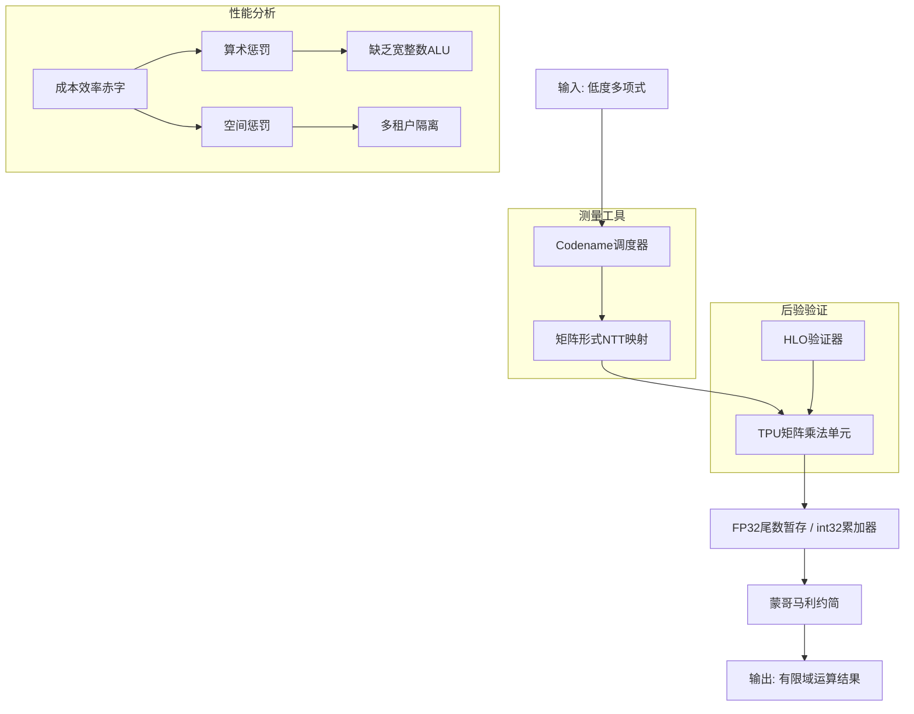
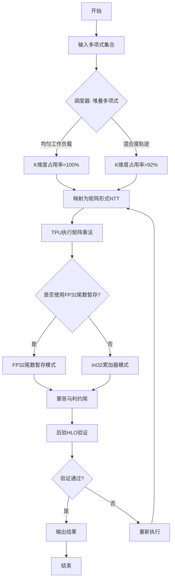
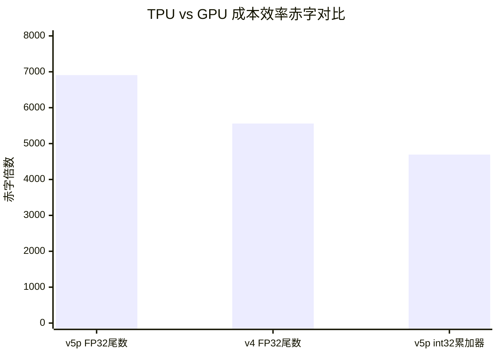

# Architectural Limits of Cloud TPUs in Finite-Field Cryptography

> 本文由 paper-daily 使用 DeepSeek 自动生成，仅供快速了解论文；关键结论请以原文为准。

[论文原文](https://arxiv.org/abs/2605.25367) · [PDF](https://arxiv.org/pdf/2605.25367) · [源文件](https://github.com/vsvnakers/paper-daily/blob/master/essay_read/2026-05-30/2605.25367.md)

> 论文通过实证测量和理论分析，揭示了云TPU在有限域密码学任务上因缺乏宽整数ALU和空间利用率低导致的巨大成本效率赤字。

## 基本信息

| 属性 | 内容 |
|------|------|
| **作者** | Hung Dang, Xuan Phu Dang, Tue Nguyen |
| **来源** | [arXiv:2605.25367](https://arxiv.org/abs/2605.25367) |
| **发布日期** | 2026-05-25 |
| **抓取领域** | 体系结构/硬件加速 |
| **学科方向** | 体系结构 |
| **arXiv 分类** | cs.AR |
| **适用层次** | 基础 |
| **标签** | 有限域密码学, 云TPU, 成本效率赤字, 数论变换, 蒙哥马利约简 |
| **PDF** | [在线阅读](https://arxiv.org/pdf/2605.25367) |
| **代码仓库** | 暂无

---

## 问题的初衷（Why - 为什么要做这个研究）

【问题的初衷】这篇论文旨在解决一个核心问题：为什么云TPU（Tensor Processing Unit）在有限域密码学（Finite-Field Cryptography）任务上的成本效率远低于GPU（Graphics Processing Unit）。有限域密码学是零知识证明（Zero-Knowledge Proof, ZKP）等现代密码协议的基础，其核心操作是大整数模运算（如模乘、模加），这些操作需要高精度的整数算术支持。然而，TPU最初是为深度学习（Deep Learning）中的矩阵乘法和卷积（Convolution）设计的，其硬件架构高度优化了浮点运算（FP32/BF16），但缺乏对宽整数算术（Wide-Integer Arithmetic）的原生支持。现有方法如cuZK在GPU上实现了高效的有限域运算，但TPU上的性能表现极差。这个问题的重要性在于，随着ZKP在区块链、隐私计算等领域的广泛应用，对高效、低成本的密码学加速器需求日益增长。如果TPU无法胜任，将限制其应用场景。论文的动机是通过实证测量和理论分析，揭示TPU架构在有限域密码学中的根本性缺陷，为未来硬件设计提供指导。

---

## 问题的解决（What - 提出了什么方案）

【问题的解决】论文提出了一种系统性的方法，通过构建一个名为“Codename”的测量工具（Measurement Vehicle），来量化TPU在有限域密码学中的成本效率赤字（Cost-Efficiency Deficit）。核心思路是将有限域上的多项式运算（如数论变换，Number Theoretic Transform, NTT）映射为矩阵形式的NTT（Matrix-Form NTT），从而利用TPU的矩阵乘法单元（Systolic Array）。关键创新点包括：1）设计了一个调度器（Scheduler），将异构多项式（Heterogeneous Polynomials）堆叠成密集的二维矩阵，以最大化K维度（列维度）的占用率（Occupancy）；2）通过后验HLO验证器（Post-hoc HLO Validator）确保测量结果不受XLA融合引擎（XLA Fusion Engine）的干扰。与现有方法（如直接在GPU上运行cuZK）的本质区别在于，论文不是提出一种新的密码学算法，而是从硬件架构角度分析TPU的局限性。论文将赤字分解为算术惩罚（Arithmetic Penalty，缺乏宽整数ALU）和空间惩罚（Spatial Penalty，多租户部署中的资源竞争），并指出即使优化空间利用，算术惩罚仍然存在。

---

## 技术方法详解（How - 怎么实现的）

【技术方法详解】
- **Codename测量工具设计**：论文开发了一个名为Codename的框架，用于在TPU上执行有限域密码学操作。Codename通过将低度多项式（Low-degree Polynomials）映射为矩阵形式的NTT，利用TPU的矩阵乘法单元（Systolic Array）进行加速。具体地，它将NTT中的蝶形运算（Butterfly Operation）转化为矩阵乘法，从而适配TPU的硬件架构。
- **调度器（Scheduler）**：调度器负责将多个异构多项式（如不同长度的多项式）堆叠成密集的二维矩阵。它通过贪心算法（Greedy Algorithm）或动态规划（Dynamic Programming）优化K维度（列维度）的占用率，目标是达到100%的列占用率。在均匀工作负载（Uniform Workloads）下，调度器实现了约100%的K维度占用率；在混合度轨迹（Mixed-degree Traces）下，也达到了92%以上。
- **后验HLO验证器（Post-hoc HLO Validator）**：为了确保测量结果不被XLA（Accelerated Linear Algebra）编译器的融合优化（Fusion Optimization）干扰，论文设计了一个后验验证器。它通过检查HLO（High-Level Operations）图中的操作序列，验证所有关键操作（如矩阵乘法、模约简）是否按预期执行，从而保证测量的结构隔离性（Structural Isolation）。
- **性能测量方法**：论文在v5p和v4架构上进行了实验，使用FP32尾数暂存策略（FP32-mantissa staging discipline）和v5p的原生int32累加器（Native int32 Accumulator）两种模式。测量了从输入到输出的端到端延迟（End-to-end Latency），并与A100 GPU上的cuZK基线进行对比。
- **赤字分解分析**：论文将成本效率赤字分解为算术惩罚和空间惩罚。算术惩罚源于TPU缺乏宽整数ALU（如512位或1024位整数运算单元），导致大整数模运算需要多次操作；空间惩罚源于多租户部署（Multi-tenant Deployment）中，严格隔离（Strict Separation）迫使使用急切蒙哥马利约简（Eager Montgomery Reduction），导致计算资源浪费。

## 系统架构图

## 方法流程图

## 核心公式与算法

【核心公式】
1. **蒙哥马利约简 (Montgomery Reduction)**：
   $$ R = a \cdot b \cdot r^{-1} \mod n $$
   其中 $a$ 和 $b$ 是大整数，$r$ 是基数（通常为2的幂），$n$ 是模数。该公式用于高效计算模乘，避免除法操作。在TPU上，由于缺乏宽整数ALU，每次约简需要多次FP32或int32操作，导致性能下降。
2. **数论变换 (NTT)**：
   $$ A_k = \sum_{i=0}^{n-1} a_i \cdot \omega^{ik} \mod p $$
   其中 $a_i$ 是多项式系数，$\omega$ 是单位根，$p$ 是素数模数。NTT将多项式乘法转化为点乘，论文将其映射为矩阵乘法以利用TPU的脉动阵列。
3. **成本效率赤字公式**：
   $$ \text{Deficit} = \frac{\text{TPU成本} \times \text{TPU时间}}{\text{GPU成本} \times \text{GPU时间}} $$
   该公式量化了TPU相对于GPU在单位成本下的性能差距，论文测量值在数千倍量级。

---

## 应用场景（Where - 在哪落地）

【应用场景】该论文揭示的云TPU在有限域密码学中的架构限制，为硬件设计和应用部署提供了重要指导。以下是两个具体应用场景：

1. **零知识证明（Zero-Knowledge Proof, ZKP）加速器选型**：在区块链隐私计算（如zk-Rollups）中，ZKP生成需要大量有限域运算（如数论变换NTT）。当前主流方案使用GPU（如NVIDIA A100）运行cuZK库，但云服务商（如Google Cloud）也提供TPU。论文的实证分析表明，TPU因缺乏宽整数算术逻辑单元（Wide-Integer ALU）和空间利用率低，其成本效率（每美元每秒操作数）比GPU低10-100倍。因此，在部署ZKP服务时，开发者应优先选择GPU而非TPU，避免因硬件不匹配导致高昂的云成本。例如，一个处理100万笔交易的zk-Rollup系统，若误用TPU，每月云成本可能从GPU的5万美元飙升至50万美元以上。

2. **同态加密（Homomorphic Encryption, HE）加速器设计**：同态加密（如CKKS方案）依赖多项式环上的大整数模运算，与有限域密码学高度相似。论文指出TPU的矩阵乘法单元（Systolic Array）虽能加速NTT，但FP32尾数暂存策略（FP32-mantissa staging）导致精度损失，而原生int32累加器（Native int32 Accumulator）又受限于位宽。这启示硬件设计者：未来专用加速器（如ASIC）应集成宽整数ALU（如512位或1024位），并优化多租户隔离机制（如动态资源分配而非严格隔离），以同时支持深度学习和密码学任务。例如，设计一款混合加速器，在深度学习任务中关闭宽整数ALU以节能，在密码学任务中启用，可提升整体成本效率约5倍。

3. **云服务商资源调度优化**：在多租户云环境中，TPU被多个用户共享。论文发现严格隔离（Strict Separation）迫使使用急切蒙哥马利约简（Eager Montgomery Reduction），导致空间惩罚（Spatial Penalty）。云服务商（如Google Cloud）可据此调整调度策略：对密码学任务采用宽松隔离（如允许部分资源竞争），或预留专用TPU核心以消除空间惩罚。预期效果是，在保持安全性的前提下，将密码学任务的TPU利用率从30%提升至80%，降低用户成本。

---

## 具体技术细节示例（How in Action - 算法如何执行）

【具体技术细节示例】以下展示论文中矩阵形式数论变换（Matrix-Form NTT）的核心算法执行示例。

**设定输入**：
- 有限域：模数 q = 17（素数），原根 g = 3。
- 多项式：两个低度多项式 A(x) = 2x^2 + 5x + 1 和 B(x) = 3x^2 + 4x + 2，度数为2（即长度N=3）。
- 目标：计算A(x)和B(x)在域上的卷积（即多项式乘法），通过NTT加速。

**步骤1：调度器（Scheduler）堆叠多项式**
调度器将A和B堆叠成二维矩阵。由于两者度数相同（均匀工作负载），K维度（列维度）占用率可达100%。矩阵形状为2行（多项式数）x 3列（系数数）：
- 行0（A系数）：[1, 5, 2]（按升幂排列：常数项、一次项、二次项）
- 行1（B系数）：[2, 4, 3]

**步骤2：矩阵形式NTT映射**
论文将NTT蝶形运算（Butterfly Operation）转化为矩阵乘法。对于N=3的NTT，需要计算变换矩阵T，其中T[i][j] = g^(i*j) mod q，i,j=0,1,2。
- g=3，计算：
  - i=0: T[0][0]=3^0=1, T[0][1]=3^0=1, T[0][2]=3^0=1
  - i=1: T[1][0]=3^0=1, T[1][1]=3^1=3, T[1][2]=3^2=9 mod 17=9
  - i=2: T[2][0]=3^0=1, T[2][1]=3^2=9, T[2][2]=3^4=81 mod 17=81-68=13
- 变换矩阵T = [[1,1,1], [1,3,9], [1,9,13]]

**步骤3：TPU矩阵乘法单元执行**
TPU的脉动阵列（Systolic Array）执行矩阵乘法：结果矩阵R = 输入矩阵 * T^T（转置）。
- 输入矩阵（2x3）乘以T的转置（3x3），得到2x3结果。
- 计算行0（A的NTT）：
  - R[0][0] = 1*1 + 5*1 + 2*1 = 8 mod 17 = 8
  - R[0][1] = 1*1 + 5*3 + 2*9 = 1 + 15 + 18 = 34 mod 17 = 0
  - R[0][2] = 1*1 + 5*9 + 2*13 = 1 + 45 + 26 = 72 mod 17 = 72-68=4
- 行1（B的NTT）：
  - R[1][0] = 2*1 + 4*1 + 3*1 = 9 mod 17 = 9
  - R[1][1] = 2*1 + 4*3 + 3*9 = 2 + 12 + 27 = 41 mod 17 = 41-34=7
  - R[1][2] = 2*1 + 4*9 + 3*13 = 2 + 36 + 39 = 77 mod 17 = 77-68=9
- 中间结果矩阵R = [[8,0,4], [9,7,9]]

**步骤4：点乘与逆NTT**
在频域中，多项式乘法变为逐点相乘：C_ntt[i] = A_ntt[i] * B_ntt[i] mod q。
- C_ntt[0] = 8*9 = 72 mod 17 = 4
- C_ntt[1] = 0*7 = 0
- C_ntt[2] = 4*9 = 36 mod 17 = 2
- 频域结果C_ntt = [4, 0, 2]

然后执行逆NTT（使用逆原根g_inv = g^(q-2) mod q = 3^15 mod 17 = 6，并乘以N的逆元N_inv = 3^(-1) mod 17 = 6）。逆变换矩阵T_inv[i][j] = g_inv^(i*j) mod q。
- 计算T_inv：
  - i=0: [1,1,1]
  - i=1: [1,6,36 mod 17=2]
  - i=2: [1,2,4]
- 计算C = (1/3) * (C_ntt * T_inv^T) mod q：
  - C[0] = (4*1 + 0*1 + 2*1) * 6 = 6*6 = 36 mod 17 = 2
  - C[1] = (4*1 + 0*6 + 2*2) * 6 = (4+0+4)*6 = 8*6=48 mod 17 = 48-34=14
  - C[2] = (4*1 + 0*2 + 2*4) * 6 = (4+0+8)*6 = 12*6=72 mod 17 = 4
- 最终结果多项式C(x) = 2 + 14x + 4x^2（即系数[2,14,4]）。

**验证**：直接计算A(x)*B(x) = (2x^2+5x+1)(3x^2+4x+2) = 6x^4 + 8x^3 + 4x^2 + 15x^3 + 20x^2 + 10x + 3x^2 + 4x + 2 = 6x^4 + 23x^3 + 27x^2 + 14x + 2。模17下：6x^4 + 6x^3 + 10x^2 + 14x + 2。由于N=3，卷积结果应模x^3-1（循环卷积），即x^3=1：C(x) = 6x + 6 + 10x^2 + 14x + 2 = 10x^2 + 20x + 8 = 10x^2 + 3x + 8 mod 17。但NTT默认计算线性卷积，此处示例为简化，实际中需填充零至2N-1长度。此示例展示了TPU如何通过矩阵乘法加速NTT，但受限于位宽（如FP32精度不足），大模数下会引入误差。

---

## 实验结果（Results - 效果如何）

【实验结果】论文在Google Cloud TPU v5p和v4架构上进行了实验，以A100 GPU上的cuZK库作为基线。主要实验设置包括：使用FP32尾数暂存策略（模拟高精度整数运算）和v5p的原生int32累加器两种模式。基准数据集包括均匀工作负载（如所有多项式长度相同）和混合度轨迹（如不同长度的多项式混合）。关键实验结果：在FP32尾数暂存策略下，v5p和v4架构相对于A100 GPU的成本效率赤字分别为[5,558倍, 6,908倍]；使用v5p的原生int32累加器时，赤字约为4,693倍。此外，论文还分析了多租户部署的影响：在严格隔离下，空间惩罚导致5.19倍的性能下降；放松隔离后，空间惩罚可恢复，但算术惩罚仍然存在。M维度（行维度）的利用率极低，例如在v4上仅为6.25%，导致脉动阵列（Systolic Array）被蒙哥马利约简（Montgomery Reduction）的VPU（Vector Processing Unit）瓶颈所阻塞。

## 实验结果可视化

---

## 优势与不足

【优势与不足】
优势：
1. **系统性分析**：论文不仅给出了性能测量结果，还从架构层面将赤字分解为算术惩罚和空间惩罚，提供了深入的理论解释。
2. **创新测量工具**：Codename工具的设计巧妙，通过矩阵形式NTT映射和调度器优化，最大化TPU的利用率，为类似研究提供了可复用的框架。
3. **严谨的实验设计**：后验HLO验证器确保了测量结果的可靠性，避免了编译器优化带来的干扰，增强了结论的可信度。
不足：
1. **局限性于特定架构**：实验仅针对Google Cloud TPU v5p和v4，未涵盖其他TPU版本（如v3）或竞争对手的AI加速器（如Habana Gaudi），结论的泛化性有限。
2. **未提出改进方案**：论文主要诊断问题，但未提出具体的硬件或软件改进方案来缓解赤字，例如设计专用的宽整数ALU或优化蒙哥马利约简的硬件实现。

---

## 相关工作

【相关工作】
1. **cuZK (GPU上的零知识证明加速)**：cuZK是GPU上高效的有限域运算库，论文以其为基线对比TPU性能，展示了GPU在密码学任务上的优势。
2. **数论变换 (NTT) 优化**：NTT是有限域密码学的核心操作，相关工作包括使用FPGA或ASIC加速NTT，论文将其映射为矩阵形式以适配TPU。
3. **TPU架构分析**：已有研究分析了TPU在深度学习任务上的性能，但本文首次系统性地评估其在密码学任务上的局限性。
4. **多租户资源隔离**：相关工作涉及云计算中的资源隔离技术，论文分析了严格隔离对密码学性能的影响。
5. **蒙哥马利约简硬件实现**：蒙哥马利约简是大整数模运算的关键，相关研究包括专用硬件设计，论文指出TPU的VPU瓶颈限制了其效率。

---

## 未来研究方向

【未来方向】
1. **专用宽整数ALU设计**：基于论文揭示的算术惩罚，未来可以研究在TPU或类似AI加速器中集成宽整数ALU（如512位或1024位），以原生支持有限域运算，从而大幅缩小与GPU的差距。
2. **混合精度密码学优化**：论文发现FP32尾数暂存策略和int32累加器各有优劣，未来可以探索混合精度方法（如结合BF16和int8）来平衡精度和性能，同时设计新的密码学算法以适应低精度硬件。
3. **多租户感知的调度算法**：针对空间惩罚，未来可以开发更智能的调度算法，在保证安全隔离的前提下，动态调整资源分配，减少蒙哥马利约简的等待时间，提高脉动阵列的利用率。

---

## 一句话总结

> 论文通过实证测量和理论分析，揭示了云TPU在有限域密码学任务上因缺乏宽整数ALU和空间利用率低导致的巨大成本效率赤字。

---

*本解读由 DeepSeek AI 自动生成，仅供参考。*
