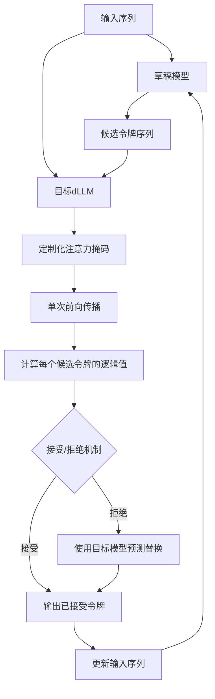
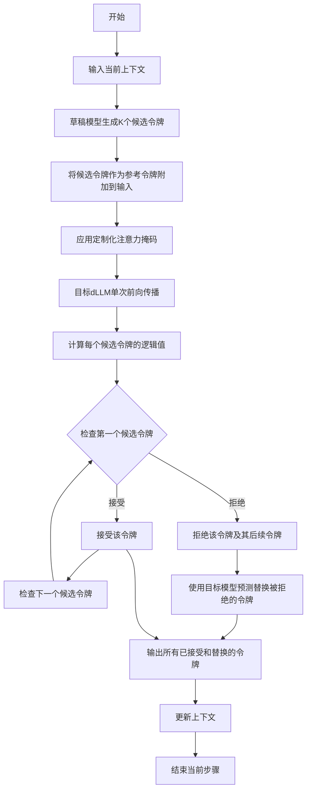
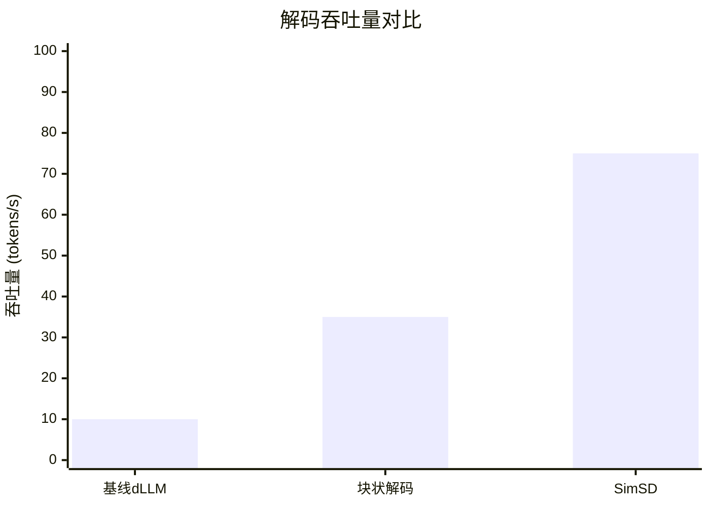

# SimSD: Simple Speculative Decoding in Diffusion Language Models

> 本文由 paper-daily 使用 DeepSeek 自动生成，仅供快速了解论文；关键结论请以原文为准。

[论文原文](https://arxiv.org/abs/2606.02544) · [PDF](https://arxiv.org/pdf/2606.02544) · [源文件](https://github.com/vsvnakers/paper-daily/blob/master/essay_read/2026-06-05/2606.02544.md)

> SimSD通过即插即用的掩码策略，使扩散语言模型具备投机解码能力，实现无需训练的高效推理加速。

## 基本信息

| 属性 | 内容 |
|------|------|
| **作者** | Junxia Cui, Haotian Ye, Runchu Tian, Hongcan Guo, Jinya Jiang, Haoru Li, Chaojie Ren, Yiming Huang, Kaijie Zhu, Zhongkai Yu, Kun Zhou, Jingbo Shang |
| **来源** | [arXiv:2606.02544](https://arxiv.org/abs/2606.02544) |
| **发布日期** | 2026-06-01 |
| **抓取领域** | LLM推理 · 内存与加速 |
| **学科方向** | 自然语言处理 · 人工智能 |
| **arXiv 分类** | cs.CL, cs.AI |
| **适用层次** | 进阶 |
| **标签** | 投机解码, 扩散语言模型, 推理加速, 注意力掩码, 无需训练 |
| **PDF** | [在线阅读](https://arxiv.org/pdf/2606.02544) |
| **代码仓库** | 暂无

---

## 问题的初衷（Why - 为什么要做这个研究）

【问题的初衷】这篇论文旨在解决扩散语言模型（Diffusion Language Models, dLLMs）在推理加速方面的一个关键瓶颈。尽管dLLMs通过并行或块状解码（blockwise decoding）提供了比自回归模型（Autoregressive Models, AR）更快的推理潜力，但它们基于掩码语言建模（Masked Language Modeling, MLM）的公式与投机解码（Speculative Decoding）这一在AR模型中最有效的加速技术不兼容。在AR解码中，因果掩码（Causal Mask）保证了时间上有效的令牌级上下文，使得目标模型可以在单次前向传播中验证多个草稿令牌。然而，dLLMs依赖于掩码令牌（Mask Tokens）和双向注意力（Bidirectional Attention），导致有效上下文在去噪步骤（Denoising Steps）之间发生变化，从而阻止了直接的令牌级投机验证。现有方法要么无法利用投机解码的优势，要么需要复杂的训练或架构修改。因此，设计一种简单、有效且无需训练的投机解码方法，以弥合dLLMs与投机解码之间的差距，对于提升dLLMs的实际部署效率至关重要。

---

## 问题的解决（What - 提出了什么方案）

【问题的解决】论文提出了一种简单但有效的投机解码算法，名为SimSD（Simple Speculative Decoding），用于扩散语言模型。其核心思路是采用一种即插即用的掩码策略，为dLLMs配备时间上有效的令牌级上下文，以支持投机解码。具体来说，SimSD显式地引入来自草稿模型预测的参考令牌（Reference Tokens），并设计了一种注意力掩码（Attention Mask），用于调节这些参考令牌与当前步骤令牌之间的交互。这使得dLLMs能够在单次前向传播中计算草稿令牌的有效逻辑值（Logits），从而恢复了AR模型中由因果掩码提供的关键验证能力，同时保留了dLLMs的并行解码优势。该方法无需训练，可以灵活地与KV缓存（KV Cache）和块状解码等其他加速技术集成。与现有方法的本质区别在于，SimSD不改变dLLMs的底层架构或训练过程，而是通过一个精心设计的掩码机制，在推理时动态地构建一个类似因果的上下文，使得投机验证成为可能。

---

## 技术方法详解（How - 怎么实现的）

【技术方法详解】
- **核心思想：投机解码（Speculative Decoding）**：投机解码是一种加速自回归模型推理的技术。它使用一个快速但精度较低的草稿模型（Draft Model）生成多个候选令牌，然后由目标模型（Target Model）在单次前向传播中并行验证这些令牌。如果验证通过，则接受这些令牌，从而加速解码过程。
- **挑战：dLLMs中的上下文不一致性**：在dLLMs中，每个去噪步骤的输入都包含掩码令牌，并且使用双向注意力。这意味着在步骤 $t$ 和步骤 $t+1$ 中，同一个位置的令牌所看到的上下文是不同的（因为掩码令牌被逐步替换为预测令牌）。这种上下文变化使得无法像AR模型那样，在单次前向传播中验证多个草稿令牌。
- **SimSD的解决方案：参考令牌与定制化注意力掩码**：SimSD的关键创新在于，在dLLMs的每个去噪步骤中，显式地将草稿模型预测的令牌序列作为参考令牌（Reference Tokens）添加到输入中。然后，设计一个特殊的注意力掩码，该掩码允许当前步骤的令牌关注所有参考令牌，但限制参考令牌之间的相互关注（类似于因果掩码）。这样，当前步骤的令牌可以基于完整的参考序列上下文来计算其逻辑值，而参考令牌则保持独立，从而实现了类似AR模型的验证功能。
- **算法流程**：
    1. 草稿模型（例如，一个小型的dLLM或AR模型）快速生成一个长度为 $K$ 的候选令牌序列 $[y_1, y_2, ..., y_K]$。
    2. 目标dLLM接收当前步骤的输入，该输入包含原始上下文和掩码令牌。SimSD将候选序列 $[y_1, y_2, ..., y_K]$ 作为参考令牌附加到输入中。
    3. 应用定制的注意力掩码：参考令牌可以关注所有其他参考令牌和上下文令牌（类似于双向），但当前步骤的令牌只能关注参考令牌和上下文令牌（不能关注未来步骤的令牌）。这确保了当前步骤的验证是基于完整的参考序列。
    4. 目标dLLM执行单次前向传播，为每个参考令牌位置计算一个逻辑值。这些逻辑值反映了目标模型对草稿模型预测的置信度。
    5. 使用标准的投机解码接受/拒绝机制：从第一个令牌开始，如果目标模型的逻辑值高于某个阈值（或通过采样），则接受该令牌；一旦遇到拒绝，则停止接受，并使用目标模型自身的预测来替换被拒绝的令牌及其后续令牌。
- **无需训练与即插即用**：SimSD完全在推理阶段实现，不需要对目标dLLM进行任何微调或架构修改。它仅通过修改注意力掩码和输入序列来工作，因此可以轻松地集成到现有的dLLM推理框架中。

## 系统架构图

## 方法流程图

## 核心公式与算法

【核心公式】
SimSD的核心思想可以通过以下公式描述。设目标dLLM为 $M_{target}$，草稿模型为 $M_{draft}$。在去噪步骤 $t$，输入序列为 $x^{(t)}$，其中包含掩码令牌。草稿模型生成候选序列 $y = [y_1, y_2, ..., y_K]$。

SimSD构造一个新的输入序列 $x'^{(t)} = [x^{(t)}, y]$，并应用一个定制的注意力掩码 $A$。然后，目标模型计算每个候选令牌的逻辑值：

$$\text{logits}(y_i) = M_{target}(x'^{(t)}, A)[i]$$

其中 $A$ 是一个块对角矩阵，允许 $x^{(t)}$ 中的令牌关注所有令牌，但 $y$ 中的令牌只能关注 $x^{(t)}$ 和其之前的 $y$ 令牌（即因果掩码）。

然后，使用标准的投机解码接受机制。接受概率为：

$$p_{accept}(y_i) = \min\left(1, \frac{q_{target}(y_i | x^{(t)}, y_{<i})}{q_{draft}(y_i | x^{(t)})}\right)$$

其中 $q_{target}$ 和 $q_{draft}$ 分别是目标模型和草稿模型预测的概率分布。如果 $y_i$ 被拒绝，则从目标模型的分布中重新采样。

---

## 应用场景（Where - 在哪落地）

【应用场景】
1. **实时文本生成服务**：在聊天机器人、智能客服等需要低延迟响应的场景中，SimSD可以显著加速dLLM的推理过程。例如，一个基于dLLM的对话系统，通过集成SimSD，可以在保持对话质量的同时，将响应时间从数百毫秒降低到几十毫秒，从而提升用户体验。具体来说，系统可以使用一个小型的草稿模型快速生成多个候选回复，然后由大型dLLM进行验证和精炼，最终输出高质量的回复。
2. **大规模文本批处理**：在机器翻译、文本摘要、内容创作等需要处理大量文本的任务中，SimSD可以大幅提高吞吐量。例如，一个新闻摘要系统每天需要处理数万篇文章。通过使用SimSD，系统可以在相同的硬件资源下，处理更多的文章，或者使用更少的GPU来达到相同的处理速度，从而降低运营成本。草稿模型可以快速生成初步摘要，dLLM则负责验证和优化，确保摘要的准确性和流畅性。
3. **移动端或边缘设备部署**：dLLM的推理通常需要大量的计算资源，限制了其在资源受限设备上的应用。SimSD通过加速推理，使得dLLM在移动设备或边缘服务器上的部署成为可能。例如，一个离线翻译应用，可以在手机端使用一个小型dLLM进行翻译，并通过SimSD加速，使得翻译速度接近实时。草稿模型可以是一个更小的模型，而目标模型则是一个稍大但精度更高的模型，两者协同工作，在有限的算力下实现最佳的性能。

---

## 具体技术细节示例（How in Action - 算法如何执行）

【具体技术细节示例】
假设我们有一个目标dLLM，它正在生成一个句子，当前步骤的输入序列为 `[CLS] The cat [MASK] [MASK] [MASK]`，其中 `[MASK]` 表示掩码令牌。草稿模型（一个小型AR模型）根据当前上下文生成了一个长度为3的候选序列 `[is, on, the]`。

**步骤1：构造输入**
SimSD将候选序列作为参考令牌附加到输入中，形成新的输入序列：`[CLS] The cat [MASK] [MASK] [MASK] [REF_is] [REF_on] [REF_the]`。其中 `[REF_*]` 是特殊的参考令牌。

**步骤2：应用注意力掩码**
定制化的注意力掩码定义如下：
- 原始上下文令牌（`[CLS]`, `The`, `cat`, `[MASK]` 等）可以相互关注，也可以关注所有参考令牌。
- 参考令牌（`[REF_is]`, `[REF_on]`, `[REF_the]`）只能关注原始上下文令牌和它们之前的参考令牌（即 `[REF_is]` 可以关注上下文，`[REF_on]` 可以关注上下文和 `[REF_is]`，`[REF_the]` 可以关注上下文、`[REF_is]` 和 `[REF_on]`）。这模拟了因果掩码的效果。

**步骤3：单次前向传播**
目标dLLM执行一次前向传播。由于注意力掩码的限制，模型在计算 `[REF_is]` 的逻辑值时，只能看到上下文；计算 `[REF_on]` 的逻辑值时，可以看到上下文和 `[REF_is]`；计算 `[REF_the]` 的逻辑值时，可以看到上下文、`[REF_is]` 和 `[REF_on]`。这确保了每个参考令牌的逻辑值是基于正确的因果上下文计算的。

**步骤4：接受/拒绝**
假设目标模型计算出的逻辑值对应的概率分布为：
- 对于 `[REF_is]`：目标模型预测 `is` 的概率为 0.9，草稿模型预测 `is` 的概率为 0.8。接受概率为 $\min(1, 0.9/0.8) = 1$，所以接受 `is`。
- 对于 `[REF_on]`：目标模型预测 `on` 的概率为 0.6，草稿模型预测 `on` 的概率为 0.7。接受概率为 $\min(1, 0.6/0.7) \approx 0.86$。假设采样后接受。
- 对于 `[REF_the]`：目标模型预测 `the` 的概率为 0.3，草稿模型预测 `the` 的概率为 0.9。接受概率为 $\min(1, 0.3/0.9) \approx 0.33$。假设采样后拒绝。

**步骤5：输出**
由于 `[REF_the]` 被拒绝，SimSD接受前两个令牌 `[is, on]`，然后使用目标模型自身的预测来替换 `[REF_the]`。假设目标模型预测下一个令牌为 `a`，则最终输出序列为 `[is, on, a]`。

**结果**：通过一次前向传播，SimSD成功验证并接受了2个草稿令牌，并纠正了1个错误令牌，从而加速了解码过程。

---

## 实验结果（Results - 效果如何）

【实验结果】论文在SDAR（Speculative Decoding with Autoregressive Models）系列的扩散语言模型上进行了实验，涵盖了四个基准数据集。实验主要对比了基线dLLM（无加速）、块状解码（Blockwise Decoding）以及SimSD。关键实验结果表明：SimSD在保持甚至提升平均生成质量的同时，实现了高达7.46倍的解码吞吐量提升。具体来说，在多个数据集上，SimSD的吞吐量（每秒生成的令牌数）显著高于基线模型和块状解码方法。同时，生成质量指标（如困惑度（Perplexity）或BLEU分数）与基线模型相当或更优，证明了SimSD在加速推理的同时没有牺牲生成质量。论文还进行了消融实验，验证了参考令牌和定制化注意力掩码各自的重要性。

## 实验结果可视化

---

## 优势与不足

【优势与不足】
**优势：**
1. **简单有效**：SimSD的核心思想非常直观，通过一个即插即用的掩码策略解决了dLLMs与投机解码不兼容的问题，实现简单且效果显著。
2. **无需训练**：该方法完全在推理阶段实现，不需要对目标模型进行任何额外的训练或微调，大大降低了应用门槛。
3. **兼容性强**：SimSD可以灵活地与KV缓存、块状解码等其他加速技术结合，实现进一步的性能提升。
4. **保持生成质量**：实验证明，SimSD在显著加速推理的同时，能够保持甚至提升生成文本的质量，没有出现明显的质量下降。

**不足：**
1. **依赖草稿模型质量**：SimSD的性能高度依赖于草稿模型的质量。如果草稿模型生成的候选令牌质量很差，会导致频繁的拒绝，从而降低加速效果。
2. **注意力掩码开销**：虽然单次前向传播的计算量没有显著增加，但定制化注意力掩码的实现可能会引入一些额外的计算或内存开销，尤其是在处理长序列时。
3. **对特定dLLM架构的依赖**：该方法主要针对基于掩码语言建模的dLLM架构。对于其他类型的扩散模型（如连续扩散模型），可能需要额外的适配。

---

## 相关工作

【相关工作】
1. **投机解码（Speculative Decoding）**：如Leviathan et al. (2023) 和 Chen et al. (2023) 提出的标准投机解码方法，主要用于加速自回归模型。SimSD将其扩展到扩散语言模型。
2. **扩散语言模型（Diffusion Language Models）**：如Li et al. (2022) 提出的Diffusion-LM和Austin et al. (2021) 提出的Masked Diffusion Language Models。SimSD针对这类模型的推理加速问题。
3. **块状解码（Blockwise Decoding）**：如Stern et al. (2018) 提出的块状并行解码方法。SimSD可以与块状解码结合，进一步提升加速效果。
4. **非自回归生成（Non-Autoregressive Generation）**：如Gu et al. (2018) 提出的非自回归机器翻译模型。dLLMs属于非自回归生成的一种，SimSD借鉴了投机解码的思想来加速非自回归模型。

---

## 未来研究方向

【未来方向】
1. **自适应草稿模型选择**：当前SimSD使用固定的草稿模型。未来可以研究如何根据当前上下文动态选择或调整草稿模型，以最大化加速效果。例如，在生成简单句子时使用更小的草稿模型，在生成复杂句子时使用稍大的草稿模型。
2. **与连续扩散模型结合**：SimSD主要针对离散令牌的扩散语言模型。未来可以探索如何将类似的思想扩展到连续扩散模型（如扩散图像生成模型），实现更通用的投机解码加速框架。
3. **多步投机解码**：当前SimSD在单个去噪步骤内进行投机解码。未来可以研究如何在多个去噪步骤之间进行投机解码，即草稿模型预测多个步骤的令牌序列，然后由目标模型一次性验证，从而进一步加速推理。

---

## 一句话总结

> SimSD通过即插即用的掩码策略，使扩散语言模型具备投机解码能力，实现无需训练的高效推理加速。

---

*本解读由 DeepSeek AI 自动生成，仅供参考。*
