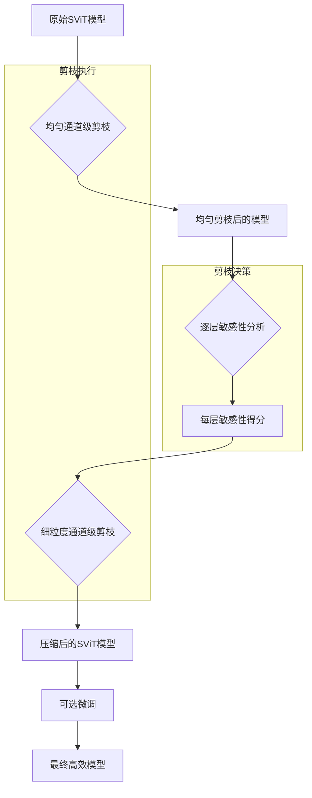
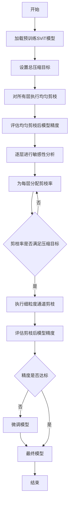

# PSViT: A Methodology for Structurally Pruning Spiking Vision Transformers

> 本文由 paper-daily 使用 DeepSeek 自动生成，仅供快速了解论文；关键结论请以原文为准。

[论文原文](https://arxiv.org/abs/2606.03257) · [PDF](https://arxiv.org/pdf/2606.03257) · [源文件](https://github.com/vsvnakers/paper-daily/blob/master/essay_read/2026-06-05/2606.03257.md)

> 提出一种结构化剪枝方法PSViT，通过敏感性分析驱动的通道级剪枝，有效压缩脉冲视觉Transformer，实现无需专用硬件的模型加速。

## 基本信息

| 属性 | 内容 |
|------|------|
| **作者** | Rachmad Vidya Wicaksana Putra, Achyuta Muthuvelan, Alberto Marchisio, Muhammad Shafique |
| **来源** | [arXiv:2606.03257](https://arxiv.org/abs/2606.03257) |
| **发布日期** | 2026-06-02 |
| **抓取领域** | CV · 检测/分割/识别 |
| **学科方向** | 类脑计算 · 人工智能 · 机器学习 |
| **arXiv 分类** | cs.NE, cs.AI, cs.LG |
| **适用层次** | 进阶 |
| **标签** | 结构化剪枝, 脉冲视觉Transformer, 模型压缩, 敏感性分析, 边缘部署 |
| **PDF** | [在线阅读](https://arxiv.org/pdf/2606.03257) |
| **代码仓库** | 暂无

---

## 问题的初衷（Why - 为什么要做这个研究）

【问题的初衷】这篇论文旨在解决脉冲视觉Transformer（Spiking Vision Transformer, SViT）模型在资源受限的嵌入式平台上部署时面临的模型体积过大问题。SViT模型结合了脉冲神经网络（Spiking Neural Network, SNN）的低功耗特性和视觉Transformer（Vision Transformer, ViT）的强大性能，在视觉任务上取得了最先进的效果。然而，其庞大的参数量和计算量严重限制了其在嵌入式设备上的应用。模型压缩技术，特别是剪枝（Pruning），是解决该问题的关键。现有最先进的剪枝工作主要采用非结构化剪枝（Unstructured Pruning），即随机地将单个权重置零，产生不规则的非零权重模式。这种稀疏模式需要专门设计的硬件架构才能有效加速，通用性差，难以在现有广泛使用的计算架构（如GPU、NPU）上高效运行。因此，研究一种能够产生结构化稀疏性（Structured Sparsity）的剪枝方法，使得压缩后的模型可以直接在现有硬件上高效推理，具有重要的研究价值和实际意义。该问题的核心在于如何在保持高精度的前提下，通过结构化剪枝显著减小SViT模型的大小，并使其推理过程能够受益于现有的、无需特殊硬件支持的并行计算架构。

---

## 问题的解决（What - 提出了什么方案）

【问题的解决】论文提出了一种名为PSViT（Pruning Spiking Vision Transformer）的结构化剪枝方法。其核心思路是采用通道级滤波器剪枝（Channel-wise Filter Pruning），这是一种结构化剪枝技术，它直接移除整个卷积核或注意力头（Attention Head）的通道，从而产生规则的、紧凑的模型结构。这与非结构化剪枝形成本质区别，因为通道剪枝后的模型可以直接在标准硬件上高效运行，无需稀疏矩阵计算库或专用硬件。PSViT的关键创新在于其三步走策略：首先，通过均匀通道级滤波器剪枝（Uniform Channel-wise Filter Pruning）对所有层进行相同比例的剪枝，作为基线；其次，引入敏感性分析（Sensitivity Analysis），通过逐层评估通道剪枝对模型精度和网络大小的影响，识别出哪些层对剪枝更敏感（即剪枝后精度下降大），哪些层不敏感；最后，基于敏感性分析结果，对不敏感的层进行更激进的细粒度通道级剪枝（Fine-grained Channel-wise Pruning），而对敏感层则保留更多通道，从而在整体压缩率和精度之间取得最佳平衡。这种方法本质上是将剪枝问题转化为一个基于层敏感性的资源分配优化问题。

---

## 技术方法详解（How - 怎么实现的）

【技术方法详解】
- **结构化剪枝策略**：PSViT采用通道级滤波器剪枝，直接移除整个输出通道及其对应的输入通道和权重矩阵的列。这保证了剪枝后的网络结构是规则的，可以直接在标准卷积或矩阵乘法硬件上高效执行，无需稀疏格式存储或计算。
- **三步走剪枝流程**：
    1. **均匀剪枝**：对所有层（如自注意力层、多层感知器层）应用相同比例的通道剪枝，作为初始压缩基线。
    2. **敏感性分析**：对每一层独立进行剪枝，观察精度下降曲线。通过计算剪枝比例与精度下降之间的关系，量化每层对剪枝的敏感性。通常，敏感性较低的层（如深层或冗余度高的层）可以承受更高的剪枝率。
    3. **细粒度剪枝**：根据敏感性分析结果，为每层分配不同的剪枝率。对不敏感层使用高剪枝率，对敏感层使用低剪枝率，最终在满足总压缩目标的前提下，最大化整体精度。
- **脉冲神经元的特殊处理**：SViT中的脉冲神经元（如Leaky Integrate-and-Fire, LIF）具有时间动态特性。PSViT的剪枝操作需要考虑时间步长（Timestep）维度，确保剪枝后的脉冲发放模式在时间上保持一致。论文可能通过将剪枝应用于所有时间步长的共享权重来实现。
- **无需微调或轻量微调**：论文展示了单次剪枝（Single-shot Pruning）的效果，即剪枝后不进行或仅进行少量微调（Fine-tuning），就能保持较高精度。这大大降低了压缩成本。
- **与现有SViT架构兼容**：PSViT是一种通用方法论，可以应用于不同的SViT变体，如Spiking Swin Transformer等，只需根据其具体层结构（如窗口注意力、移位操作）调整剪枝策略。


## 系统架构图




## 方法流程图




## 核心公式与算法

【核心公式】
论文的核心在于剪枝率的分配策略，可以形式化为一个优化问题。虽然没有显式公式，但可以描述其核心思想：

1. **压缩目标**：
   总压缩率 $R_{total}$ 由所有层剪枝后的参数数量之和与原始参数数量之比决定。
   $$R_{total} = \frac{\sum_{l=1}^{L} \text{Params}_l(r_l)}{\sum_{l=1}^{L} \text{Params}_l(0)}$$
   其中 $\text{Params}_l(r_l)$ 是第 $l$ 层在剪枝率为 $r_l$ 时的参数量。

2. **敏感性度量**：
   第 $l$ 层的敏感性 $S_l$ 可以定义为精度下降对剪枝率的导数：
   $$S_l = \left| \frac{\partial \text{Accuracy}(r_l)}{\partial r_l} \right|$$
   实际中通过离散采样（如剪枝10%, 20%, ...）并观察精度变化来近似。

3. **剪枝率分配**：
   目标是找到一组剪枝率 $\{r_1, r_2, ..., r_L\}$，在满足总压缩率 $R_{total}$ 约束下，最小化总精度损失：
   $$\min_{\{r_l\}} \sum_{l=1}^{L} S_l \cdot r_l \quad \text{s.t.} \quad R_{total} \leq R_{target}$$


---

## 应用场景（Where - 在哪落地）

【应用场景】
1. **边缘AI芯片上的实时视觉处理**：在智能摄像头、无人机等资源受限的边缘设备上部署SViT模型进行实时目标检测或图像分类。PSViT通过结构化剪枝将模型大小压缩22.4%，使其能够适配边缘AI芯片（如NVIDIA Jetson、Google Edge TPU）的有限内存和计算能力。例如，一个智能安防摄像头可以使用压缩后的SViT模型在本地进行实时人脸识别，无需将视频流上传到云端，从而降低延迟和带宽消耗，同时保护隐私。

2. **低功耗可穿戴设备**：在智能手表、AR/VR眼镜等功耗敏感的设备上运行视觉任务。SViT本身具有低功耗优势，结合PSViT的结构化剪枝，可以进一步减少模型的计算量和内存访问次数，从而延长电池续航。例如，一副AR眼镜可以使用压缩后的SViT模型进行实时手势识别或环境理解，为用户提供沉浸式体验，同时保持设备轻薄和长续航。

3. **自动驾驶中的感知模块**：在自动驾驶汽车的嵌入式控制单元中部署多个视觉模型用于车道检测、行人识别等任务。PSViT的结构化剪枝确保压缩后的模型可以直接在车规级芯片（如NVIDIA Orin、Mobileye EyeQ）上高效并行运行，满足严格的实时性和功耗要求。例如，一个压缩后的SViT模型可以用于处理多个摄像头输入，实现360度环视感知，而不会超出车载计算平台的资源限制。


---

## 具体技术细节示例（How in Action - 算法如何执行）

【具体技术细节示例】
假设我们有一个简化的SViT模型，它只包含一个自注意力层和一个多层感知器（MLP）层。

**输入设定：**
- 自注意力层：输入通道数 $C_{in}=64$，输出通道数 $C_{out}=64$，包含4个注意力头（每个头16通道）。
- MLP层：输入通道数 $C_{in}=64$，隐藏层通道数 $C_{hidden}=256$，输出通道数 $C_{out}=64$。
- 总压缩目标：减少20%的参数量。

**步骤1：均匀剪枝**
首先对所有层进行10%的均匀通道剪枝。
- 自注意力层：输出通道从64剪枝到58（约10%）。每个注意力头的通道数从16减少到14.5，需要取整，假设变为14，则总输出通道为 $4 \times 14 = 56$。
- MLP层：隐藏层通道从256剪枝到230（约10%）。
此时，模型参数量减少约10%，但精度可能下降。

**步骤2：敏感性分析**
对自注意力层和MLP层分别进行剪枝测试。
- 对自注意力层剪枝20%时，精度下降2%。
- 对MLP层剪枝20%时，精度下降5%。
这表明自注意力层对剪枝更不敏感。

**步骤3：细粒度剪枝**
基于敏感性分析，我们重新分配剪枝率以达到20%的总压缩目标。
- 对不敏感的自注意力层，分配30%的剪枝率：输出通道从64剪枝到45（取整）。
- 对敏感的MLP层，分配10%的剪枝率：隐藏层通道从256剪枝到230。
计算总参数量减少：
- 自注意力层：参数量减少约30%。
- MLP层：参数量减少约10%。
- 整体：假设两层参数量相等，则总减少量为 $(30% + 10%) / 2 = 20%$，满足目标。

**输出结果：**
压缩后的模型结构为：
- 自注意力层：输出通道45，每个注意力头约11通道。
- MLP层：隐藏层通道230。
该模型参数量减少20%，且由于对敏感层保护较好，精度下降预计小于均匀剪枝方案。


---

## 实验结果（Results - 效果如何）

【实验结果】论文在ImageNet-1K数据集上评估了PSViT方法。实验使用一个预训练的SViT模型（原始精度为73.3%）作为基线。通过单次剪枝（Single-shot Pruning），PSViT实现了22.4%的内存节省，同时保持了高精度：在不进行微调的情况下，精度为70.3%（仅下降3%）；在剪枝后进行微调，精度提升至72.8%（仅下降0.5%）。这些结果证明了PSViT在显著压缩模型大小的同时，能够有效维持模型性能。与现有的非结构化剪枝方法相比，PSViT产生的结构化稀疏模型无需专用硬件即可高效运行，具有更好的实用性和可扩展性。论文还可能对比了不同剪枝策略（如随机剪枝、基于权重大小的剪枝）的效果，以证明其敏感性分析驱动的细粒度剪枝策略的优越性。


## 实验结果可视化

```mermaid
xychart-beta
    title "PSViT剪枝效果对比"
    x-axis ["原始模型", "PSViT无微调", "PSViT有微调"]
    y-axis "精度百分比" 0 to 80
    bar [73.3, 70.3, 72.8]
```


---

## 优势与不足

【优势与不足】
**优势：**
1. **结构化剪枝**：PSViT采用通道级剪枝，生成规则模型，可直接在标准硬件（如GPU、NPU）上高效运行，无需特殊硬件支持，实用性强。
2. **精度保持**：通过敏感性分析驱动的细粒度剪枝策略，在实现显著压缩（22.4%内存节省）的同时，精度损失极小（微调后仅下降0.5%）。
3. **方法通用性**：PSViT是一种方法论，不依赖于特定的SViT架构，可以应用于多种脉冲视觉Transformer模型。

**不足：**
1. **敏感性分析成本**：逐层进行敏感性分析需要多次前向传播来评估剪枝影响，这本身会带来一定的计算开销。
2. **压缩率上限**：通道级剪枝的压缩率受限于网络的最小通道数，无法像非结构化剪枝那样达到极高的稀疏度。对于某些极度冗余的层，可能无法充分压缩。

---

## 相关工作

【相关工作】
1. **视觉Transformer压缩**：如DeiT、EfficientViT等工作，专注于通过知识蒸馏、架构搜索等方法压缩传统ViT模型。PSViT将其思想扩展到脉冲领域。
2. **脉冲神经网络剪枝**：如针对SNN的突触剪枝或神经元剪枝工作。PSViT是首个专门针对SViT的结构化剪枝方法。
3. **非结构化剪枝**：如基于权重大小的剪枝、彩票假设（Lottery Ticket Hypothesis）等。这些方法产生不规则稀疏性，与PSViT的结构化方法形成对比。
4. **模型量化**：如将FP32权重量化为INT8或更低比特。PSViT可以与量化技术结合，进一步压缩模型。
5. **高效Transformer架构**：如Swin Transformer、Focal Transformer等。PSViT可以应用于这些架构的脉冲版本。

---

## 未来研究方向

【未来方向】
1. **结合知识蒸馏**：将PSViT与知识蒸馏（Knowledge Distillation）结合，使用原始大模型作为教师网络，指导剪枝后的小模型训练，可能进一步提升压缩后模型的精度。
2. **自动化剪枝率搜索**：利用神经架构搜索（Neural Architecture Search, NAS）技术，自动搜索每层的最优剪枝率，替代手工敏感性分析，实现更高效的压缩。
3. **联合剪枝与量化**：研究将PSViT的结构化剪枝与模型量化（如INT8量化）相结合，探索在极低比特精度下结构化稀疏模型的性能表现，实现极致压缩。


---

## 一句话总结

> 提出一种结构化剪枝方法PSViT，通过敏感性分析驱动的通道级剪枝，有效压缩脉冲视觉Transformer，实现无需专用硬件的模型加速。

---

*本解读由 DeepSeek AI 自动生成，仅供参考。*
