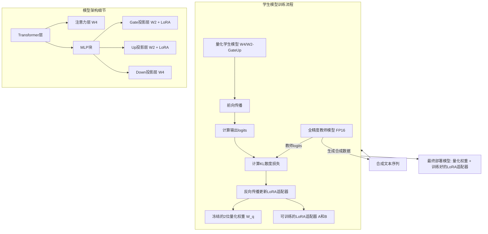
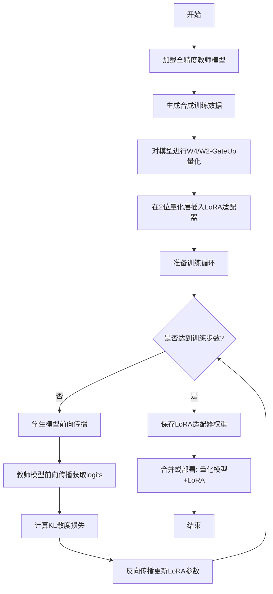

# Recover-LoRA for Aggressive Quantization: Reclaiming Accuracy in 2-Bit Language Models via Low-Rank Adaptation with Knowledge Distillation on Synthetic Data

> 本文由 paper-daily 使用 DeepSeek 自动生成，仅供快速了解论文；关键结论请以原文为准。

[论文原文](https://arxiv.org/abs/2606.04238) · [PDF](https://arxiv.org/pdf/2606.04238) · [源文件](https://github.com/vsvnakers/paper-daily/blob/master/essay_read/2026-06-05/2606.04238.md)

> Recover-LoRA通过轻量级低秩适配和合成数据蒸馏，高效恢复了2位极端量化对大型语言模型造成的精度损失。

## 基本信息

| 属性 | 内容 |
|------|------|
| **作者** | Devleena Das, Rajeev Patwari, Elliott Delaye, Ashish Sirasao |
| **来源** | [arXiv:2606.04238](https://arxiv.org/abs/2606.04238) |
| **发布日期** | 2026-06-02 |
| **抓取领域** | LLM推理 · 模型压缩 |
| **学科方向** | 机器学习 · 人工智能 |
| **arXiv 分类** | cs.LG, cs.AI |
| **适用层次** | 进阶 |
| **标签** | 低秩适配, 知识蒸馏, 模型量化, 合成数据, 大语言模型 |
| **PDF** | [在线阅读](https://arxiv.org/pdf/2606.04238) |
| **代码仓库** | 暂无

---

## 问题的初衷（Why - 为什么要做这个研究）

【问题的初衷】随着大语言模型（Large Language Model, LLM）的规模不断增长（从数十亿到数千亿参数），其部署到资源受限的边缘设备（Edge Device）或移动端面临巨大挑战。模型权重的存储和内存带宽成为主要瓶颈。为了降低部署成本，模型量化（Model Quantization）技术被广泛采用，例如将权重从16位浮点（FP16）压缩到4位整数（INT4）。然而，当量化精度进一步降低到2位（2-bit）这种极端低位时，虽然能带来显著的吞吐量和内存节省，但会引发严重的精度退化（Accuracy Degradation），导致模型输出质量大幅下降。现有的后训练量化（Post-Training Quantization, PTQ）方法，如GPTQ、AWQ，在4位精度下表现良好，但在2位精度下往往失效，因为它们无法有效补偿由极端量化引入的巨大信息损失。此外，传统的量化感知训练（Quantization-Aware Training, QAT）虽然精度恢复效果好，但需要原始训练数据和昂贵的全模型微调，这在数据隐私受限或计算资源有限的实际部署场景中难以实现。因此，论文旨在解决的核心问题是：如何在无需原始训练数据、仅使用合成数据（Synthetic Data）和轻量级微调的情况下，有效恢复2位极端量化对LLM造成的精度损失，使得在边缘设备上部署2位模型成为可能。

---

## 问题的解决（What - 提出了什么方案）

【问题的解决】论文提出了Recover-LoRA方法，这是一种轻量级、无需原始数据的精度恢复框架，专门用于应对极端低位量化（如2位）带来的精度损失。其核心思路是：首先，通过选择性混合精度量化（Selective Mixed-Precision Quantization）策略，将精度损失限制在模型中的特定子层。具体来说，论文发现Transformer架构中的多层感知机（MLP）的Gate和Up投影层对量化误差最为敏感，因此只将这两个层量化为2位（W2），而保持其他线性层（如注意力机制的QKV投影、MLP的Down投影）为更高精度（如4位），形成W4/W2-GateUp配置。这种策略通过Roofline模型分析证明，能在保持大部分计算吞吐量提升的同时，将量化误差隔离在可预测的少数层中。其次，针对这些被2位量化的层，Recover-LoRA应用低秩适配（Low-Rank Adaptation, LoRA）技术，仅在这些量化层上训练轻量级的低秩适配器（Low-Rank Adapters）。训练目标是通过知识蒸馏（Knowledge Distillation, KD），让量化后的模型（学生模型）的输出分布去拟合原始全精度模型（教师模型）的输出分布。训练数据完全由教师模型通过提示（Prompt）生成，无需任何真实标注数据。这种方法与现有方法的本质区别在于：它不修改量化后的权重本身，而是通过添加可训练的旁路适配器来补偿量化误差，且训练过程极其轻量（仅需10k合成样本），非常适合部署后的快速校准。

---

## 技术方法详解（How - 怎么实现的）

【技术方法详解】
- **选择性混合精度量化策略**：论文通过实验发现，在Transformer的MLP块中，Gate投影层（负责决定信息通过量）和Up投影层（负责扩展特征维度）对量化噪声的鲁棒性最差。因此，提出W4/W2-GateUp配置：所有注意力层（Attention）和MLP的Down投影层保持4位（W4），仅Gate和Up层量化为2位（W2）。这种不对称量化将精度损失集中到少数关键层，便于后续针对性恢复。
- **Recover-LoRA微调**：在每个被2位量化的线性层（Gate和Up）上，插入一个低秩适配器（LoRA Adapter）。LoRA的核心思想是冻结原始量化权重 $W_q$（2位），并训练一个低秩分解矩阵对 $BA$，其中 $B \in \mathbb{R}^{d \times r}, A \in \mathbb{R}^{r \times k}$，秩 $r \ll \min(d, k)$。前向传播变为 $h = W_q x + BAx$。训练时只更新 $A$ 和 $B$，参数量极少。
- **基于知识蒸馏的训练目标**：训练不使用任何真实标签。损失函数为教师模型（全精度FP16）和学生模型（量化后+LoRA适配器）输出logits之间的KL散度（Kullback-Leibler Divergence）。公式为：$\mathcal{L}_{KD} = \text{KL}(p_{\text{teacher}} || p_{\text{student}})$，其中 $p = \text{softmax}(z / \tau)$，$z$ 是logits，$\tau$ 是温度系数（Temperature）。通过最小化KL散度，学生模型学习模仿教师模型的输出分布。
- **合成数据生成**：为了摆脱对原始训练数据的依赖，论文使用教师模型本身来生成训练数据。具体做法是：向教师模型提供一组通用的、与任务无关的提示（如“写一个关于...”），然后让模型自回归地生成连续的文本序列。这些生成的文本序列作为训练样本，用于后续的知识蒸馏。
- **Roofline模型分析**：论文使用Roofline模型来量化W4/W2-GateUp配置相对于均匀W4配置的吞吐量提升。该模型考虑了计算强度（Arithmetic Intensity）、内存带宽和计算峰值。分析表明，在长序列和较大模型下，2位量化带来的内存带宽节省能显著提升每秒处理的Token数（Tokens Per Second, TPS），提升幅度在7.5%到23.3%之间。


## 系统架构图




## 方法流程图




## 核心公式与算法

【核心公式】
1. **LoRA前向传播**：对于被2位量化的权重矩阵 $W_q \in \mathbb{R}^{d \times k}$，其前向传播公式为：
   $$h = W_q x + \frac{\alpha}{r} B A x$$
   其中 $B \in \mathbb{R}^{d \times r}, A \in \mathbb{R}^{r \times k}$ 是训练的低秩矩阵，$r$ 是秩，$\alpha$ 是缩放超参数。该公式表明，输出是量化权重的结果与可训练低秩适配结果的加权和。

2. **知识蒸馏损失函数**：训练目标是最小化教师和学生模型输出分布之间的KL散度：
   $$\mathcal{L}_{KD} = \sum_{i} p_{\text{teacher}}(x_i) \log \frac{p_{\text{teacher}}(x_i)}{p_{\text{student}}(x_i)}$$
   其中 $p(x_i) = \frac{\exp(z_i / \tau)}{\sum_j \exp(z_j / \tau)}$ 是经过温度系数 $\tau$ 软化后的概率分布。该损失函数鼓励学生模型的输出概率分布尽可能接近教师模型。

3. **Roofline模型吞吐量估计**：在内存受限区域，模型推理的吞吐量（TPS）近似为：
   $$\text{TPS} \approx \frac{\text{Peak Memory Bandwidth}}{\text{Model Memory Footprint per Token}}$$
   通过将部分权重从4位压缩到2位，减少了模型的内存占用（Memory Footprint），从而在相同内存带宽下获得更高的TPS。


---

## 应用场景（Where - 在哪落地）

【应用场景】
1. **移动端和边缘设备上的智能助手**：在手机、智能音箱等设备上部署LLM时，内存和功耗是硬约束。使用Recover-LoRA可以将模型压缩到2位精度，同时保持接近全精度的回答质量。例如，一个离线翻译或文本摘要应用，用户输入查询后，设备上的2位模型能快速生成高质量回复，而无需联网。Recover-LoRA的轻量级校准流程允许设备在首次启动时，利用设备自身生成的少量合成数据快速完成精度恢复，确保用户体验。
2. **隐私敏感的医疗或金融文档分析**：在医疗或金融领域，数据高度敏感，无法上传到云端进行模型微调。Recover-LoRA允许机构在本地部署一个极端量化的LLM，然后仅使用内部生成的、不含客户隐私的合成数据（如从公开医学文献生成的摘要）进行精度恢复。这样既满足了数据不出域的合规要求，又通过2位量化大幅降低了本地服务器的硬件成本（如使用更少、更便宜的GPU），同时保证了分析任务的准确性。
3. **大规模模型推理服务的成本优化**：云服务提供商在提供LLM API时，推理成本主要由GPU内存和带宽决定。通过采用W4/W2-GateUp配置和Recover-LoRA，可以将单个GPU上容纳的模型实例数量提升20%以上（根据论文的TPS提升数据）。这意味着在相同的硬件集群上，可以服务更多的并发用户请求，从而显著降低每Token的推理成本。Recover-LoRA的快速校准能力使得服务商可以针对不同客户或不同任务，快速生成多个定制化的2位模型版本。


---

## 具体技术细节示例（How in Action - 算法如何执行）

【具体技术细节示例】
假设我们有一个简化版的Transformer MLP块，其隐藏层维度 $d=4$。我们关注其中的Gate投影层，其权重矩阵 $W_{gate} \in \mathbb{R}^{4 \times 4}$。

**步骤1：量化**
原始全精度权重 $W_{gate}$ 被量化为2位。假设量化后，权重矩阵变为 $W_q$（每个元素只能取0, 1, 2, 3四个值）。例如：
$$W_q = \begin{bmatrix} 1 & 0 & 3 & 2 \\ 2 & 1 & 0 & 1 \\ 0 & 3 & 2 & 0 \\ 3 & 2 & 1 & 3 \end{bmatrix}$$

**步骤2：插入LoRA适配器**
我们选择秩 $r=1$。初始化两个低秩矩阵 $A \in \mathbb{R}^{1 \times 4}$ 和 $B \in \mathbb{R}^{4 \times 1}$，通常用高斯分布初始化。假设初始化为：
$$A = \begin{bmatrix} 0.1 & -0.2 & 0.3 & 0.0 \end{bmatrix}, \quad B = \begin{bmatrix} 0.5 \\ -0.1 \\ 0.2 \\ 0.3 \end{bmatrix}$$
缩放因子 $\alpha = 2$。

**步骤3：前向传播（训练时）**
输入向量 $x \in \mathbb{R}^4$，假设为 $x = [1.0, 0.5, -0.5, 0.0]^T$。
- 量化路径输出：$h_q = W_q x = [1*1 + 0*0.5 + 3*(-0.5) + 2*0, ...]^T = [1 - 1.5, ...]^T = [-0.5, 2.5, -1.5, 4.0]^T$
- LoRA路径输出：首先计算 $A x = 0.1*1 + (-0.2)*0.5 + 0.3*(-0.5) + 0.0*0 = 0.1 - 0.1 - 0.15 = -0.15$。然后计算 $B (A x) = -0.15 * B = [-0.075, 0.015, -0.03, -0.045]^T$。
- 最终输出：$h = h_q + (\alpha / r) * B A x = [-0.5, 2.5, -1.5, 4.0]^T + 2 * [-0.075, 0.015, -0.03, -0.045]^T = [-0.65, 2.53, -1.56, 3.91]^T$。

**步骤4：损失计算与反向传播**
这个输出 $h$ 会经过后续层，最终得到学生模型的logits。教师模型（全精度）对同一输入生成logits。计算两者之间的KL散度损失。然后，梯度只反向传播到 $A$ 和 $B$ 矩阵，$W_q$ 保持冻结。

**步骤5：训练后部署**
经过多轮迭代，$A$ 和 $B$ 被优化。最终部署时，可以合并权重：$W_{eff} = W_q + (\alpha/r) B A$，或者保留分离形式以便快速切换任务。此时，对于输入 $x$，模型输出为 $W_{eff} x$，其精度远高于原始的 $W_q x$。


---

## 实验结果（Results - 效果如何）

【实验结果】论文以Qwen3-4B模型为主要案例，在12个标准自然语言理解与生成基准测试（如MMLU、HellaSwag、ARC等）上进行了评估。实验设置如下：使用W4/W2-GateUp量化配置，仅用10k个由教师模型生成的合成样本进行Recover-LoRA训练。关键结果显示：在12个基准中，有9个基准的精度恢复率达到了80%到95%。例如，在HellaSwag上，均匀W2量化导致准确率从FP16的72.1%骤降至35.2%，而Recover-LoRA将其恢复至68.5%，恢复率超过90%。与使用真实标注数据（如Alpaca数据集）进行蒸馏恢复相比，合成数据取得了相当甚至更好的效果，证明了方法的实用性。此外，论文还验证了恢复效果的泛化性，即在一个任务上训练后，在未见过的、分布外（Out-of-Distribution, OOD）的任务上也能观察到精度提升。与基线方法（如直接使用均匀W2量化、仅量化不恢复）相比，Recover-LoRA在所有测试任务上都取得了显著的精度提升，且训练成本极低（在单GPU上数小时即可完成）。


## 实验结果可视化

```mermaid
xychart-beta
    title "Qwen3-4B 不同量化配置在HellaSwag上的准确率对比"
    x-axis ["FP16基线", "均匀W2量化", "W4/W2-GateUp无恢复", "Recover-LoRA恢复后"]
    y-axis "准确率 (Accuracy %)" 0 to 80
    bar [72.1, 35.2, 52.0, 68.5]
```


---

## 优势与不足

【优势与不足】
- **优势**：
    1. **数据高效且无需标注**：仅需10k合成样本即可实现高精度恢复，完全摆脱了对原始训练数据的依赖，解决了数据隐私和获取难题。
    2. **计算极其轻量**：只训练极低秩的LoRA适配器，参数量远小于全模型微调，训练速度快，内存占用低，适合部署后的快速校准。
    3. **针对性强且有效**：通过选择性混合精度量化策略，精准定位并恢复对量化最敏感的层，避免了在无关层上浪费计算资源，恢复效果显著。
- **潜在不足**：
    1. **依赖教师模型质量**：合成数据的质量完全取决于教师模型，如果教师模型本身存在偏见或生成质量不高，可能会限制恢复效果。
    2. **通用性验证有限**：论文主要在一个模型系列（Qwen3-4B）上进行了详细案例研究，虽然在多个模型上进行了Roofline分析，但Recover-LoRA方法在更大规模（如70B）或不同架构（如MoE）模型上的效果和泛化性有待进一步验证。

---

## 相关工作

【相关工作】
1. **后训练量化（Post-Training Quantization, PTQ）**：如GPTQ、AWQ。这些方法在4位精度下高效，但在2位精度下精度损失严重，Recover-LoRA旨在弥补这一差距。
2. **量化感知训练（Quantization-Aware Training, QAT）**：如LLM-QAT。QAT精度恢复好但需要原始数据和全模型训练，Recover-LoRA通过LoRA和合成数据实现了更轻量的替代方案。
3. **参数高效微调（Parameter-Efficient Fine-Tuning, PEFT）**：如LoRA、Adapter。Recover-LoRA借鉴了LoRA的低秩适配思想，但将其应用于量化误差补偿这一特定任务，而非通用微调。
4. **知识蒸馏（Knowledge Distillation, KD）**：Recover-LoRA的核心训练范式，通过让学生模型模仿教师模型的输出分布来传递知识，此处用于恢复量化损失。
5. **合成数据生成（Synthetic Data Generation）**：如Self-Instruct。Recover-LoRA利用教师模型自生成数据，避免了对外部标注数据的依赖。

---

## 未来研究方向

【未来方向】
1. **扩展到更激进的量化方案**：将Recover-LoRA的思想应用于1位或二值化（Binary）量化。探索在信息损失更极端的情况下，低秩适配器是否仍能有效补偿，以及是否需要更复杂的适配器结构（如更高秩或MoE风格的适配器）。
2. **自动化混合精度配置搜索**：当前W4/W2-GateUp配置是基于人工分析和经验选择的。未来可以研究自动化方法，如基于梯度或神经架构搜索（NAS），为不同模型和硬件平台自动找到最优的混合精度量化位宽分配方案，并与Recover-LoRA的恢复能力协同优化。
3. **多任务与持续学习**：研究Recover-LoRA如何支持多任务场景。例如，为不同任务训练不同的LoRA适配器，并在推理时动态切换，或者探索如何通过持续蒸馏（Continual Distillation）让模型在不断接收新合成数据的过程中持续提升精度。


---

## 一句话总结

> Recover-LoRA通过轻量级低秩适配和合成数据蒸馏，高效恢复了2位极端量化对大型语言模型造成的精度损失。

---

*本解读由 DeepSeek AI 自动生成，仅供参考。*
