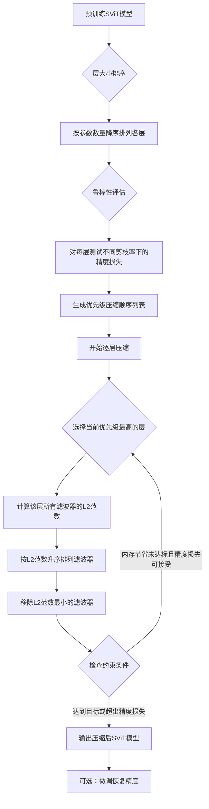
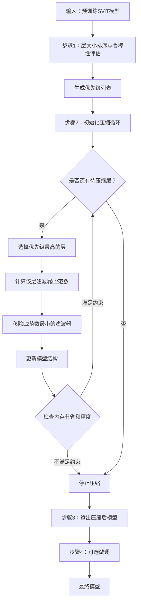

# PrimeSVT: An Automated Memory-aware Pruning Framework with Prioritized Compression Policy for Spiking Vision Transformers

> 本文由 paper-daily 使用 DeepSeek 自动生成，仅供快速了解论文；关键结论请以原文为准。

[论文原文](https://arxiv.org/abs/2606.03428) · [PDF](https://arxiv.org/pdf/2606.03428) · [源文件](https://github.com/vsvnakers/paper-daily/blob/master/essay_read/2026-06-06/2606.03428.md)

> PrimeSVT提出一种自动化、内存感知的结构化剪枝框架，通过优先级压缩策略高效压缩脉冲视觉Transformer，实现硬件友好的模型部署。

## 基本信息

| 属性 | 内容 |
|------|------|
| **作者** | Rachmad Vidya Wicaksana Putra, Achyuta Muthuvelan, Alberto Marchisio, Muhammad Shafique |
| **来源** | [arXiv:2606.03428](https://arxiv.org/abs/2606.03428) |
| **发布日期** | 2026-06-02 |
| **抓取领域** | LLM推理 · 模型压缩 |
| **学科方向** | 类脑计算 · 人工智能 · 机器学习 |
| **arXiv 分类** | cs.NE, cs.AI, cs.LG |
| **适用层次** | 进阶 |
| **标签** | 脉冲视觉Transformer, 结构化剪枝, 模型压缩, 自动化机器学习, 内存优化 |
| **PDF** | [在线阅读](https://arxiv.org/pdf/2606.03428) |
| **代码仓库** | 暂无

---

## 问题的初衷（Why - 为什么要做这个研究）

【问题的初衷】脉冲视觉Transformer（Spiking Vision Transformers, SViTs）结合了脉冲神经网络（Spiking Neural Networks, SNNs）的能量高效特性和视觉Transformer（Vision Transformers, ViTs）的强大表征能力，在神经形态计算领域展现出巨大潜力。然而，SViT模型通常包含大量参数，导致其模型体积庞大，严重阻碍了其在资源受限的嵌入式设备（如移动端、边缘计算节点）上的部署。现有最先进的SViT压缩方法主要采用非结构化剪枝（Unstructured Pruning），即随机地将单个权重置零。这种方法虽然能实现高压缩率，但产生的稀疏权重矩阵具有不规则的非零元素分布，需要专门设计的硬件加速器才能获得实际的推理加速和内存节省，这增加了部署成本和复杂性。此外，这些方法通常依赖人工手动调整剪枝率等超参数，针对不同网络结构需要大量的设计时间（Design Time）来寻找合适的剪枝配置，导致方法缺乏可扩展性（Scalability）。因此，迫切需要一种自动化、硬件友好的SViT模型压缩框架，能够在无需专用硬件的情况下，高效地减少模型内存占用，同时保持可接受的精度。

---

## 问题的解决（What - 提出了什么方案）

【问题的解决】针对上述问题，本文提出了PrimeSVT，一个新颖的自动化内存感知结构化剪枝框架。其核心思路是：对预训练的SViT模型进行结构化剪枝（Structured Pruning），即移除整个通道（Channel）或滤波器（Filter），从而直接减少模型尺寸并生成规则化的稀疏结构，这种结构能直接被通用计算架构（如GPU、CPU）高效利用，无需专用硬件。PrimeSVT的关键创新在于其“优先级压缩策略”（Prioritized Compression Policy）。该策略首先根据各层参数数量对SViT层进行排序，识别出“大层”；然后，通过评估不同剪枝率下各层的鲁棒性（Robustness），确定哪些层是“可剪枝的”；最后，按照从最大层到最小层的顺序，逐层进行压缩。这种策略优先压缩参数最多、对精度影响最小的层，能在满足用户定义的精度和内存节省约束下，最大化压缩效率。在每个层的剪枝过程中，PrimeSVT采用基于L2范数（L2-norm）的通道级滤波器剪枝，即计算每个滤波器的L2范数，并移除范数最小的那些滤波器，因为这些滤波器被认为对模型输出的贡献较小。与现有方法相比，PrimeSVT的本质区别在于：1）自动化，无需人工干预；2）结构化，兼容通用硬件；3）内存感知，优先压缩大层。

---

## 技术方法详解（How - 怎么实现的）

【技术方法详解】
- **优先级压缩策略（Prioritized Compression Policy）**：PrimeSVT的核心调度算法。它首先计算SViT模型中每一层的参数数量（即层大小），并按降序排列。然后，它通过一个鲁棒性评估步骤，对每一层进行不同剪枝率（如10%, 20%, ...）的快速剪枝测试，观察精度下降情况，从而确定该层对剪枝的敏感度。最终，它生成一个压缩顺序列表，优先处理“大且鲁棒”的层。
- **内存感知约束（Memory-aware Constraints）**：用户需要提供两个关键约束：目标内存节省率（如30%）和可接受的精度损失（如3%）。PrimeSVT的压缩过程会持续进行，直到达到内存节省目标或精度下降超出阈值。这确保了压缩结果满足用户的实际部署需求。
- **基于L2范数的通道级剪枝（Channel-wise L2-norm based Filter Pruning）**：在选定要剪枝的层后，PrimeSVT计算该层中每个卷积滤波器（或全连接层的神经元）的L2范数。L2范数定义为权重向量各元素平方和的平方根，即 $||W_i||_2 = \sqrt{\sum_{j} w_{ij}^2}$，其中 $W_i$ 是第 $i$ 个滤波器的权重向量。具有较小L2范数的滤波器被认为重要性较低，因此被移除。
- **单次剪枝（Single-shot Pruning）**：与需要迭代训练-剪枝-微调的方法不同，PrimeSVT在预训练模型上执行一次性的剪枝操作。剪枝后，模型可以直接使用（无需微调）或进行少量微调（Fine-tuning）以恢复精度。这大大简化了压缩流程。
- **结构化剪枝的兼容性**：通过移除整个滤波器，PrimeSVT直接减少了模型中的权重矩阵维度。例如，一个形状为 $[C_{out}, C_{in}, K, K]$ 的卷积层，如果剪掉 $m$ 个滤波器，其输出通道数变为 $C_{out} - m$，对应的后续层输入通道数也相应减少。这种结构变化是规则且连续的，无需特殊硬件支持。


## 系统架构图




## 方法流程图




## 核心公式与算法

【核心公式】
PrimeSVT的核心操作是基于L2范数的滤波器重要性评估。对于一个卷积层，其第 $i$ 个滤波器的L2范数定义为：
$$\text{Importance}(F_i) = ||W_i||_2 = \sqrt{\sum_{j=1}^{N} w_{ij}^2}$$
其中 $W_i$ 是第 $i$ 个滤波器的权重向量，包含 $N$ 个权重值 $w_{ij}$。该值越小，表示滤波器越不重要，越有可能被剪掉。

另一个关键概念是优先级得分（Priority Score），用于决定层的压缩顺序。虽然论文未给出显式公式，但其逻辑可概括为：
$$\text{Priority}(L) = \text{Size}(L) \times \text{Robustness}(L)$$
其中 $\text{Size}(L)$ 是层 $L$ 的参数数量，$\text{Robustness}(L)$ 是层 $L$ 在剪枝测试中保持精度的能力（例如，精度下降的倒数）。得分越高，越优先被压缩。


---

## 应用场景（Where - 在哪落地）

【应用场景】
1. **边缘AI推理（Edge AI Inference）**：在智能摄像头、无人机等边缘设备上部署SViT模型进行实时目标检测或分类。这些设备内存和计算能力有限。使用PrimeSVT，开发者可以输入目标内存节省率（如50%）和可接受的精度损失（如2%），框架自动压缩模型，生成一个能在设备上高效运行的轻量级SViT。例如，一个原本需要500MB内存的模型，压缩后仅需250MB，可以直接部署在边缘设备上，实现低延迟、低功耗的推理。
2. **神经形态芯片部署（Neuromorphic Chip Deployment）**：神经形态芯片（如Intel Loihi）旨在高效运行SNN模型。PrimeSVT的结构化剪枝产生的规则稀疏模型，可以更容易地映射到这些芯片的硬件结构上，最大化能效比。例如，在自动驾驶的感知模块中，使用PrimeSVT压缩后的SViT模型处理脉冲流数据，可以在保持高精度的同时，显著降低芯片的功耗和面积占用。
3. **移动端应用（Mobile Applications）**：在手机或平板电脑上运行基于SViT的视觉应用（如手势识别、增强现实）。这些应用对模型大小和推理速度有严格要求。PrimeSVT的自动化特性允许应用开发者快速为不同性能的手机定制不同大小的模型，而无需手动调参。例如，为高端手机生成高精度模型，为中低端手机生成更小、更快的模型，所有模型都通过PrimeSVT自动生成。


---

## 具体技术细节示例（How in Action - 算法如何执行）

【具体技术细节示例】
假设我们有一个简化的SViT模型，它包含三个卷积层：Layer1（参数数量：1000）、Layer2（参数数量：500）、Layer3（参数数量：200）。用户设定的约束是：内存节省至少30%，精度损失不超过3%。

**步骤1：层大小排序与鲁棒性评估**
- 排序结果：Layer1 (1000) > Layer2 (500) > Layer3 (200)。
- 鲁棒性评估：对每层进行剪枝测试。假设测试结果如下：
  - Layer1：剪掉20%参数，精度下降1%；剪掉40%参数，精度下降2.5%。
  - Layer2：剪掉20%参数，精度下降2%；剪掉40%参数，精度下降5%。
  - Layer3：剪掉20%参数，精度下降0.5%；剪掉40%参数，精度下降1%。
- 优先级计算：综合考虑大小和鲁棒性。Layer1最大且鲁棒性尚可，Layer3最小但最鲁棒。优先级顺序可能为：Layer1 > Layer3 > Layer2。

**步骤2：逐层压缩**
- **第一轮（压缩Layer1）**：
  - 计算Layer1所有滤波器的L2范数。假设有10个滤波器，其L2范数分别为：[0.1, 0.2, 0.8, 0.9, 1.0, 1.1, 1.2, 1.3, 1.4, 1.5]。
  - 按L2范数升序排列，移除最小的滤波器。假设我们尝试剪掉20%的参数（即移除2个滤波器），移除范数为0.1和0.2的滤波器。
  - 更新模型：Layer1的输出通道数从10变为8。后续层（Layer2）的输入通道数也相应调整。
  - 检查约束：内存节省 = 20%（因为只压缩了最大的层，总参数从1700变为1500，节省约11.8%）。精度下降 = 1%（根据鲁棒性测试）。两者均未超出约束，继续压缩。
- **第二轮（压缩Layer3）**：
  - 计算Layer3的L2范数。假设有4个滤波器，范数为[0.5, 0.6, 0.7, 0.8]。
  - 尝试剪掉20%（移除1个滤波器），移除范数为0.5的滤波器。
  - 更新模型：Layer3输出通道从4变为3。
  - 检查约束：内存节省 = 总参数从1500变为1495（节省约12.1%）。精度下降 = 1% + 0.5% = 1.5%。未超出约束。
- **第三轮（压缩Layer2）**：
  - 计算Layer2的L2范数。假设有5个滤波器，范数为[0.3, 0.4, 0.5, 0.6, 0.7]。
  - 尝试剪掉20%（移除1个滤波器），移除范数为0.3的滤波器。
  - 更新模型：Layer2输出通道从5变为4。
  - 检查约束：内存节省 = 总参数从1495变为1490（节省约12.4%）。精度下降 = 1.5% + 2% = 3.5%。超出精度损失约束（3%）。
  - **决策**：撤销对Layer2的剪枝，停止压缩。

**最终输出**：压缩后的模型，Layer1剪掉2个滤波器，Layer3剪掉1个滤波器，Layer2保持不变。总内存节省约12.1%，精度下降约1.5%，满足用户约束。


---

## 实验结果（Results - 效果如何）

【实验结果】论文在SViT模型上进行了实验。主要实验设置包括：使用预训练好的SViT模型作为基线，其原始精度为73.3%。PrimeSVT在单次剪枝（Single-shot Pruning）后，在不进行微调（Fine-tuning）的情况下，模型精度为70.3%，仅下降3%；在进行微调后，精度恢复至72.9%，仅下降0.4%。同时，模型的内存节省达到了26.68%。这表明PrimeSVT能够在满足用户定义的精度损失（3%）和内存节省约束下，有效地压缩SViT模型。实验还对比了不同剪枝策略（如随机剪枝、基于L1范数剪枝）的效果，验证了PrimeSVT的优先级压缩策略和L2范数剪枝的有效性。


## 实验结果可视化

```mermaid
xychart-beta
    title "PrimeSVT压缩效果对比"
    x-axis ["原始模型", "PrimeSVT无微调", "PrimeSVT有微调"]
    y-axis "精度（%）" 0 to 80
    bar [73.3, 70.3, 72.9]
    y-axis "内存节省（%）" 0 to 30
    line [0, 26.68, 26.68]
```


---

## 优势与不足

【优势与不足】
**优势：**
1. **自动化程度高**：PrimeSVT通过优先级压缩策略和鲁棒性评估，实现了全自动的剪枝过程，无需人工手动调整每层的剪枝率，大大减少了设计时间。
2. **硬件友好**：采用结构化剪枝，生成规则化的稀疏模型，可以直接在通用计算架构（如GPU、CPU）上高效运行，无需专用硬件加速器。
3. **内存感知**：框架直接以内存节省和精度损失作为优化目标，确保压缩结果满足实际部署的约束条件，实用性强。

**不足：**
1. **依赖预训练模型**：PrimeSVT是在预训练模型上进行剪枝，其效果受限于预训练模型的质量。如果预训练模型本身不够鲁棒，剪枝后的性能可能不佳。
2. **鲁棒性评估开销**：在确定优先级时，需要对每层进行多次剪枝测试来评估鲁棒性，这本身会带来一定的计算开销，虽然是一次性的。
3. **未考虑层间依赖**：优先级策略是逐层独立进行的，没有考虑不同层之间剪枝的联合影响。例如，同时剪掉多个层可能产生非线性的精度下降。

---

## 相关工作

【相关工作】
1. **脉冲神经网络压缩（SNN Compression）**：如使用非结构化剪枝或知识蒸馏来压缩SNN模型。PrimeSVT与之不同，专注于结构化剪枝和自动化。
2. **视觉Transformer剪枝（ViT Pruning）**：如Token剪枝、注意力头剪枝等。PrimeSVT将类似思想应用于脉冲版本的ViT。
3. **结构化剪枝（Structured Pruning）**：如基于L1/L2范数的滤波器剪枝。PrimeSVT采用了L2范数，但创新性地结合了优先级压缩策略。
4. **自动化机器学习（AutoML）**：如神经架构搜索（NAS）用于自动寻找压缩策略。PrimeSVT提供了一种更轻量级的自动化方法。
5. **内存高效深度学习（Memory-efficient Deep Learning）**：如模型量化、权重共享等。PrimeSVT专注于剪枝这一特定技术。

---

## 未来研究方向

【未来方向】
1. **联合剪枝与量化（Joint Pruning and Quantization）**：将PrimeSVT的结构化剪枝与模型量化（如INT8量化）相结合，进一步压缩模型大小和加速推理。可以探索剪枝和量化的最佳顺序或联合优化策略。
2. **动态优先级策略（Dynamic Priority Policy）**：当前的优先级策略是静态的，基于一次性的鲁棒性评估。未来可以研究动态优先级，即在压缩过程中根据已压缩层的实际影响，实时调整剩余层的优先级，以更好地处理层间依赖。
3. **扩展到其他SNN架构（Extension to Other SNN Architectures）**：PrimeSVT目前针对SViT设计。未来可以将其核心思想（内存感知、优先级压缩、结构化剪枝）推广到其他类型的SNN模型（如脉冲卷积神经网络SCNN），甚至传统的ANN模型。


---

## 一句话总结

> PrimeSVT提出一种自动化、内存感知的结构化剪枝框架，通过优先级压缩策略高效压缩脉冲视觉Transformer，实现硬件友好的模型部署。

---

*本解读由 DeepSeek AI 自动生成，仅供参考。*
