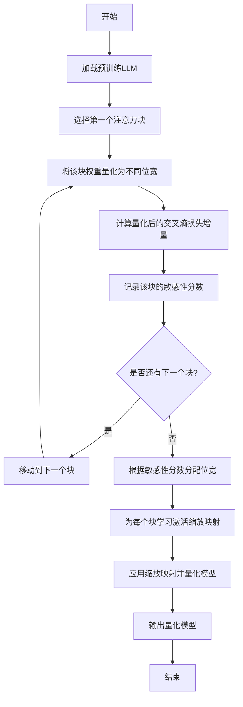
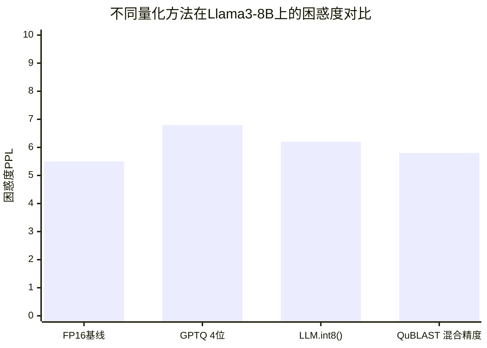

# QuBLAST: A Framework for Quantizing Large Language Models with Block-Level Compression Approach and Activation Scaling Strategy

> 本文由 paper-daily 使用 DeepSeek 自动生成，仅供快速了解论文；关键结论请以原文为准。

[论文原文](https://arxiv.org/abs/2606.04620) · [PDF](https://arxiv.org/pdf/2606.04620) · [源文件](https://github.com/vsvnakers/paper-daily/blob/master/essay_read/2026-06-06/2606.04620.md)

> QuBLAST通过块级混合精度量化和高效激活缩放，实现了LLM的高压缩率和低性能损失。

## 基本信息

| 属性 | 内容 |
|------|------|
| **作者** | Pasindu Wickramasinghe, Achyuta Muthuvelan, Rachmad Vidya Wicaksana Putra, Minghao Shao, Muhammad Shafique |
| **来源** | [arXiv:2606.04620](https://arxiv.org/abs/2606.04620) |
| **发布日期** | 2026-06-03 |
| **抓取领域** | LLM推理 · 模型压缩 |
| **学科方向** | 机器学习 · 人工智能 |
| **arXiv 分类** | cs.LG, cs.AI |
| **适用层次** | 进阶 |
| **标签** | 后训练量化, 混合精度量化, 激活值异常, 块级压缩, 大型语言模型 |
| **PDF** | [在线阅读](https://arxiv.org/pdf/2606.04620) |
| **代码仓库** | 暂无

---

## 问题的初衷（Why - 为什么要做这个研究）

【问题的初衷】大型语言模型（Large Language Models, LLMs）已成为自然语言处理（Natural Language Processing, NLP）任务的最先进算法。然而，它们通常伴随着巨大的计算和内存成本，这使得它们难以部署在嵌入式系统等资源受限的设备上。现有的后训练量化（Post-Training Quantization, PTQ）方法通常对整个网络的所有注意力块（Attention Blocks）采用统一的量化精度，忽略了在同一网络中对不同层应用不同量化级别的潜力。此外，这些方法通常采用复杂的操作来缓解激活值异常（Activation Outliers）的负面影响，从而引入了高昂的计算开销。更重要的是，现有方法尚未考虑使用具有非传统注意力架构（如状态空间模型 State-Space Models）的新兴LLMs进行评估，这些模型在应用量化时提出了不同的挑战。因此，迫切需要一种新的量化框架，能够实现混合精度量化以平衡模型大小和性能，同时高效处理激活值异常问题，并兼容包括状态空间模型在内的多种架构。

---

## 问题的解决（What - 提出了什么方案）

【问题的解决】针对上述问题，本文提出了QuBLAST，一种新颖的后训练量化方法，它采用块级压缩方法（Block-Level Compression Approach）和激活缩放策略（Activation Scaling Strategy）来量化LLMs。块级压缩方法使得网络中的不同块能够采用混合精度量化，而激活缩放策略则高效地缓解了激活值异常的负面影响。具体来说，QuBLAST首先通过交叉熵损失分析（Cross-Entropy Loss Analysis）来评估预训练模型中不同注意力块的敏感性。基于此敏感性分析，QuBLAST为模型中的每个注意力块确定其权重量化级别。此外，QuBLAST为每个块应用激活缩放映射（Activation Scaling Map）来控制激活值的范围，从而缓解激活值异常的影响，实现更好的量化结果。与现有方法的本质区别在于：QuBLAST不是对整个网络使用统一的量化精度，而是根据每个块对量化误差的敏感度动态分配不同的位宽，从而在模型压缩率和性能之间取得更好的平衡。同时，其激活缩放策略比复杂的异常值处理操作更高效。

---

## 技术方法详解（How - 怎么实现的）

【技术方法详解】
- **块级敏感性分析**：QuBLAST首先对预训练模型进行逐块（Block-wise）的敏感性分析。具体地，对于模型中的每个注意力块（或Transformer块），分别将其权重量化为不同的位宽（如8位、4位、2位），然后计算量化后模型在验证集上的交叉熵损失（Cross-Entropy Loss）相对于原始模型的增量。损失增量越大的块，被认为对量化越敏感，需要分配更高的位宽。
- **混合精度量化策略**：基于敏感性分析的结果，QuBLAST为每个块分配不同的量化位宽。例如，对损失增量超过某个阈值的块分配8位，对损失增量适中的块分配4位，对损失增量很小的块分配2位。这种混合精度策略能够在保持模型性能的同时，最大化压缩率。
- **激活缩放映射**：为了缓解激活值异常（Activation Outliers）的影响，QuBLAST为每个块学习一个激活缩放映射。该映射是一个与激活值张量形状相同的缩放因子矩阵，用于在量化前对激活值进行缩放，将异常值压缩到正常的量化范围内，从而减少量化误差。缩放映射通过最小化量化后激活值与原始激活值之间的均方误差（Mean Squared Error, MSE）来学习。
- **量化过程**：QuBLAST采用对称量化（Symmetric Quantization）或非对称量化（Asymmetric Quantization）对权重和激活值进行量化。对于权重，使用块级混合精度；对于激活值，使用激活缩放映射进行预处理后，再进行统一精度的量化。
- **兼容多种架构**：QuBLAST的设计不依赖于特定的注意力机制，因此可以应用于传统的Transformer架构（如Llama、Qwen）以及非传统的状态空间模型（如Falcon H1R）。其块级分析策略可以自然地扩展到任何由重复块组成的模型架构。

## 系统架构图

```mermaid
graph TD
    A[输入预训练LLM] --> B[逐块敏感性分析]
    B --> C[计算每个块的交叉熵损失增量]
    C --> D[根据损失增量分配量化位宽]
    D --> E[混合精度量化策略]
    E --> F[对每个块应用激活缩放映射]
    F --> G[学习缩放因子矩阵]
    G --> H[对激活值进行缩放预处理]
    H --> I[量化权重和激活值]
    I --> J[输出量化后的LLM]
    subgraph 块级压缩
        B
        C
        D
        E
    end
    subgraph 激活缩放
        F
        G
        H
    end
```

## 方法流程图

## 核心公式与算法

【核心公式】
1.  **块级敏感性度量**：对于第 $i$ 个块，其敏感性 $S_i$ 定义为将其权重量化为位宽 $b$ 后，模型在验证集 $D$ 上的交叉熵损失增量：
    $$S_i(b) = \mathcal{L}(\mathcal{M}_{\text{quant}, i}(b), D) - \mathcal{L}(\mathcal{M}_{\text{orig}}, D)$$
    其中 $\mathcal{M}_{\text{orig}}$ 是原始模型，$\mathcal{M}_{\text{quant}, i}(b)$ 是仅将第 $i$ 个块量化为 $b$ 位的模型。

2.  **激活缩放映射学习**：对于第 $i$ 个块的激活值 $X_i$，学习一个缩放映射 $\text{Scale}_i$，使得量化后的激活值 $\text{Quant}(X_i \odot \text{Scale}_i)$ 与原始激活值之间的均方误差最小：
    $$\text{Scale}_i = \arg\min_{\text{Scale}} \mathbb{E}[||X_i - \text{Dequant}(\text{Quant}(X_i \odot \text{Scale}))||^2]$$
    其中 $\odot$ 表示逐元素乘法，$\text{Quant}$ 和 $\text{Dequant}$ 分别表示量化与反量化操作。

3.  **混合精度量化目标**：给定总位宽预算 $B$，QuBLAST的目标是分配每个块的位宽 $b_i$，以最小化整体性能损失：
    $$\min_{b_1, ..., b_N} \sum_{i=1}^N S_i(b_i) \quad \text{s.t.} \quad \sum_{i=1}^N b_i \cdot \text{size}_i \leq B$$
    其中 $\text{size}_i$ 是第 $i$ 个块的参数数量。

---

## 应用场景（Where - 在哪落地）

【应用场景】
1.  **边缘设备部署**：在智能手机、物联网设备等资源受限的嵌入式系统上部署LLM。例如，将量化后的Llama3-8B模型部署到手机上进行离线文本生成或智能问答。通过QuBLAST将模型大小减少40%以上，可以显著降低内存占用和功耗，使得在低端设备上运行LLM成为可能。预期效果是用户可以在无网络环境下获得流畅的AI助手体验。
2.  **云端推理加速**：在数据中心或云服务器上，通过模型压缩减少GPU显存占用和推理延迟。例如，使用QuBLAST量化后的Qwen3-8B模型，可以在同一台GPU服务器上部署更多并发实例，提高吞吐量。预期效果是降低云端推理成本，同时保持接近原始模型的生成质量。
3.  **隐私保护计算**：在联邦学习或本地推理场景中，用户希望在不将数据上传到云端的情况下使用LLM。通过QuBLAST压缩模型，可以使其更容易在用户本地设备上运行，从而保护用户隐私。例如，在医疗或金融领域，用户可以在本地设备上使用量化后的Mistral模型进行敏感数据分析。

---

## 具体技术细节示例（How in Action - 算法如何执行）

【具体技术细节示例】假设我们有一个简化的LLM，包含3个注意力块（Block1, Block2, Block3），每个块有100万个参数。我们使用WikiText-2的100个样本作为校准数据集。

**步骤1：敏感性分析**
- 对于Block1，将其权重分别量化为8位、4位、2位，并计算交叉熵损失增量。假设结果：8位时增量0.1，4位时增量0.5，2位时增量2.0。
- 对于Block2，结果：8位时增量0.2，4位时增量0.6，2位时增量1.8。
- 对于Block3，结果：8位时增量0.05，4位时增量0.3，2位时增量1.0。

**步骤2：位宽分配**
- 设定阈值：损失增量小于0.2的块可用2位，0.2-0.5的用4位，大于0.5的用8位。
- 根据步骤1的数据：Block1在4位时增量0.5（等于阈值），分配4位；Block2在4位时增量0.6，分配8位；Block3在2位时增量1.0，但4位时增量0.3，分配4位。
- 最终位宽：Block1: 4位，Block2: 8位，Block3: 4位。

**步骤3：激活缩放映射学习**
- 对于每个块，使用校准数据学习一个缩放映射。例如，对于Block1，其激活值张量形状为[1, 128, 4096]，学习到的缩放映射Scale_1也是一个相同形状的矩阵。假设某个位置的激活值为15.0，而量化范围是[-8, 7]，则缩放因子可能为0.5，将激活值缩放为7.5，量化后为7。

**步骤4：量化**
- 对Block1的权重进行4位量化，对Block2的权重进行8位量化，对Block3的权重进行4位量化。
- 对所有块的激活值，先应用对应的缩放映射，再进行8位量化。

**输出**：量化后的模型，其总参数大小为：Block1: 100万 * 0.5字节 = 0.5MB，Block2: 100万 * 1字节 = 1MB，Block3: 0.5MB，总计2MB。原始模型（假设FP16）大小为：300万 * 2字节 = 6MB。压缩率为66.7%。

---

## 实验结果（Results - 效果如何）

【实验结果】论文在多个主流LLM架构上进行了实验，包括Qwen3-8B、Llama3-8B、Mistral v0.1-8B和Falcon H1R-7B。评估数据集为WikiText-2和WikiText-103，主要指标是困惑度（Perplexity, PPL）和模型大小压缩率。实验结果表明，QuBLAST能够将模型大小减少40%至45.2%，同时将困惑度增加控制在5%以内。与现有的统一精度量化方法（如GPTQ、LLM.int8()）相比，QuBLAST在相同压缩率下取得了更低的困惑度，或者在相同困惑度下实现了更高的压缩率。此外，消融实验验证了块级混合精度和激活缩放策略各自的有效性。

## 实验结果可视化

---

## 优势与不足

【优势与不足】
- **优势**：
    1.  **高效压缩**：通过块级混合精度量化，实现了40%-45.2%的模型大小缩减，显著降低了存储和内存需求。
    2.  **性能保持**：在显著压缩的同时，将困惑度增加控制在5%以内，性能损失极小。
    3.  **架构通用性**：不依赖于特定注意力机制，可应用于传统Transformer和新兴的状态空间模型。
    4.  **低计算开销**：激活缩放策略比复杂的异常值处理操作更简单高效。
- **不足**：
    1.  **敏感性分析成本**：逐块进行敏感性分析需要多次前向传播，对于非常大的模型可能带来一定的计算开销。
    2.  **缩放映射学习**：为每个块学习激活缩放映射需要额外的校准数据，且缩放映射的存储会略微增加模型大小。

---

## 相关工作

【相关工作】
- **GPTQ**：一种基于近似二阶优化的后训练量化方法，对权重进行逐层量化，但采用统一精度。
- **LLM.int8()**：一种混合精度量化方法，对异常值维度使用FP16，其余使用INT8，但依赖于异常值检测。
- **SmoothQuant**：通过平滑激活值分布来缓解异常值影响，但需要对模型进行微调。
- **AWQ**：基于激活值感知的权重量化，通过保护重要权重通道来提升量化效果。
- **状态空间模型**：如Mamba，其架构与Transformer不同，对量化提出了新挑战，本文首次在量化研究中考虑了此类模型。

---

## 未来研究方向

【未来方向】
1.  **动态位宽分配**：当前方法基于静态敏感性分析，未来可以研究基于输入动态调整每个块的量化位宽，以进一步优化性能。
2.  **联合优化权重和激活量化**：将权重量化位宽和激活缩放映射的学习联合优化，形成一个端到端的量化框架。
3.  **扩展到更大模型**：将QuBLAST应用于更大规模的模型（如70B参数），并研究其在大规模分布式训练和推理中的效果。

---

## 一句话总结

> QuBLAST通过块级混合精度量化和高效激活缩放，实现了LLM的高压缩率和低性能损失。

---

*本解读由 DeepSeek AI 自动生成，仅供参考。*
