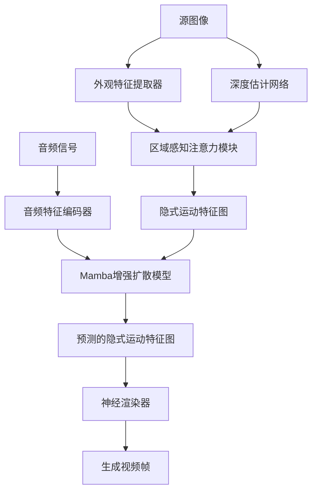
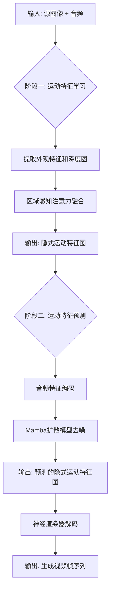
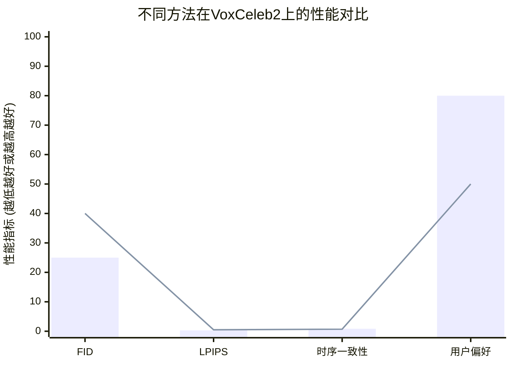

# Mamba-Enhanced Implicit Motion Learning for Audio-Driven Portrait Animation

> 本文由 paper-daily 使用 DeepSeek 自动生成，仅供快速了解论文；关键结论请以原文为准。

[论文原文](https://arxiv.org/abs/2606.03402) · [PDF](https://arxiv.org/pdf/2606.03402) · [源文件](https://github.com/vsvnakers/paper-daily/blob/master/essay_read/2026-06-07/2606.03402.md)

> 提出一种解耦的、Mamba增强的隐式运动学习框架，从音频和单张图像高效生成高质量人体动画。

## 基本信息

| 属性 | 内容 |
|------|------|
| **作者** | Xuan Wei, Jiahui Chen, Kaiheng Li, Mingyu Shao, Qingqi Hong |
| **来源** | [arXiv:2606.03402](https://arxiv.org/abs/2606.03402) |
| **发布日期** | 2026-06-02 |
| **抓取领域** | CV · 图像/视频生成 |
| **学科方向** | 计算机视觉 |
| **arXiv 分类** | cs.CV |
| **适用层次** | 进阶 |
| **标签** | 音频驱动动画, 隐式运动学习, Mamba, 扩散模型, 两阶段架构 |
| **PDF** | [在线阅读](https://arxiv.org/pdf/2606.03402) |
| **代码仓库** | 暂无

---

## 问题的初衷（Why - 为什么要做这个研究）

【问题的初衷】这篇论文旨在解决从单张静态图像和音频信号生成逼真且时间上连贯的人体运动视频这一极具挑战性的问题。该问题在虚拟数字人、远程会议、影视制作和游戏动画等领域具有广泛的应用前景。现有方法主要分为两类：一类是基于关键点（Keypoint-based）的方法，它们通过预测面部或身体的关键点位置来驱动动画，但这类方法往往难以捕捉细微的运动动态（如微表情、头发飘动、衣服褶皱等），导致生成的视频缺乏真实感和生动性；另一类是基于隐式表示（Implicit Representation）的方法，如神经辐射场（Neural Radiance Fields, NeRF），虽然能生成高质量渲染，但通常需要针对每个场景进行单独优化，泛化能力差且计算成本高昂。此外，现有方法大多将运动预测和渲染过程耦合在一起，导致模型灵活性不足，难以适应不同的应用场景。因此，论文的核心动机是提出一种解耦的、隐式的运动学习框架，能够从音频中无监督地学习细粒度的运动模式，并生成具有高时间一致性和真实感的人体运动视频。

---

## 问题的解决（What - 提出了什么方案）

【问题的解决】论文提出了一种名为“Mamba-Enhanced Implicit Motion Learning”的创新框架，其核心思路是将运动预测与渲染过程完全解耦，形成一个两阶段（Two-Stage）流水线。第一阶段是“隐式运动特征学习”，该阶段利用一个区域感知注意力机制（Region-Aware Attention Mechanism），将外观先验（Appearance Priors）和层次深度线索（Hierarchical Depth Cues）融合到运动特征的学习中，从而从静态图像中提取出与运动相关的潜在特征。第二阶段是“Mamba增强的扩散模型运动预测”，该阶段采用一个基于Mamba架构（一种状态空间模型，State Space Model）的扩散模型（Diffusion Model），直接从音频信号和源图像中预测第一阶段的隐式运动特征。这种解耦架构的关键创新点在于：1）将复杂的运动生成问题分解为特征学习和特征预测两个更易处理的子问题；2）利用Mamba模型的长序列建模能力和线性复杂度，高效地处理音频-运动之间的时序依赖关系；3）通过无监督学习方式，模型能够自动发现并学习数据中存在的细粒度运动模式，而无需人工标注的运动标签。与现有方法相比，其本质区别在于从“端到端耦合生成”转变为“先学习运动特征，再根据条件预测特征”的范式，极大地提升了模型的灵活性和效率。

---

## 技术方法详解（How - 怎么实现的）

【技术方法详解】
- **两阶段解耦架构**：整个框架分为两个独立的阶段。第一阶段（运动特征提取器）负责从源图像中提取隐式运动特征图（Implicit Motion Feature Map），该特征图编码了所有可能的运动信息。第二阶段（运动预测器）则是一个条件生成模型，其输入是音频和源图像，输出是预测的隐式运动特征图。这种解耦使得第一阶段可以专注于学习高质量的运动表示，而第二阶段可以专注于学习音频到运动的映射关系。
- **区域感知注意力机制**：在第一阶段，为了更有效地融合外观和深度信息，论文提出了区域感知注意力机制。该机制不是对整个特征图进行全局注意力计算，而是根据人体语义分割结果（如面部、躯干、手臂等）将特征图划分为不同的区域。在每个区域内，模型会独立地计算自注意力（Self-Attention），从而更好地捕捉局部运动细节。同时，层次深度线索（从单张图像估计的深度图）被用作位置编码（Positional Encoding）的补充，帮助模型理解三维空间结构。
- **Mamba增强的扩散模型**：第二阶段的核心是一个基于Mamba架构的扩散模型。传统的扩散模型通常使用U-Net作为主干网络，其计算复杂度与序列长度成二次方关系。Mamba是一种基于状态空间模型（State Space Model, SSM）的架构，其计算复杂度与序列长度成线性关系，特别适合处理长序列数据。论文将Mamba模块嵌入到扩散模型的去噪U-Net中，用于高效地建模音频特征与运动特征之间的长程时序依赖。
- **无监督运动学习**：整个训练过程是无监督的。具体来说，模型首先从真实视频中提取连续的图像帧，然后使用第一阶段网络从第一帧中提取隐式运动特征。接着，模型使用这些特征作为监督信号，训练第二阶段网络从对应的音频和第一帧中预测这些特征。通过最小化预测特征与真实特征之间的差异，模型学会了从音频中推断运动。
- **大规模高质量数据集**：为了训练该模型，论文收集了一个全新的380小时高质量人体运动视频数据集。该数据集包含多种场景、动作和背景，确保了模型的泛化能力。数据集的构建过程包括严格的筛选、清洗和预处理步骤，以保证视频的清晰度、时间连贯性和音频质量。

## 系统架构图

## 方法流程图

## 核心公式与算法

【核心公式】
1. **隐式运动特征学习目标**：
   $$\mathcal{L}_{feat} = \mathbb{E}_{x, a} \left[ \| \Phi(x_1) - \Psi(\Phi(x_1), a) \|_2^2 \right]$$
   其中 $\Phi(x_1)$ 是从第一帧 $x_1$ 提取的真实隐式运动特征，$\Psi(\Phi(x_1), a)$ 是第二阶段网络从音频 $a$ 和第一帧预测的特征。该损失函数最小化预测特征与真实特征之间的均方误差。

2. **扩散模型去噪损失**：
   $$\mathcal{L}_{diff} = \mathbb{E}_{t, \epsilon} \left[ \| \epsilon - \epsilon_\theta(z_t, t, c) \|_2^2 \right]$$
   其中 $\epsilon$ 是添加的噪声，$\epsilon_\theta$ 是Mamba增强的去噪U-Net，$z_t$ 是第 $t$ 步的噪声特征，$c$ 是条件（音频和源图像特征）。这是标准的扩散模型损失，用于训练去噪网络。

3. **Mamba状态空间模型更新**：
   $$h_t = \bar{A} h_{t-1} + \bar{B} x_t$$
   $$y_t = C h_t + D x_t$$
   其中 $h_t$ 是隐藏状态，$x_t$ 是输入，$y_t$ 是输出，$\bar{A}, \bar{B}, C, D$ 是Mamba模块的可学习参数。该公式描述了Mamba如何以线性复杂度处理序列数据。

---

## 应用场景（Where - 在哪落地）

【应用场景】
1. **虚拟数字人直播与交互**：在直播带货、在线教育、虚拟客服等场景中，可以利用该技术从一张主播照片和实时音频生成逼真的虚拟数字人动画。由于模型是解耦的，可以预先训练好高质量的运动特征提取器，然后针对不同主播只需微调渲染器或直接使用通用渲染器，大大降低了部署成本。预期效果是生成与音频高度同步、动作自然流畅的虚拟形象，提升用户互动体验。
2. **影视后期与游戏动画制作**：在电影或游戏中，角色配音通常先于动画制作。使用该技术，动画师可以输入配音音频和角色设定图，快速生成初步的角色动画草稿，作为后续精修的参考。这可以大幅缩短动画制作周期，尤其是在需要大量群演或背景角色的场景中。预期效果是提高制作效率，降低人力成本，同时保持动画的多样性和自然度。
3. **远程会议与社交应用**：在带宽有限或需要保护隐私的远程会议中，用户可以使用一张静态头像和音频，通过该技术生成自己的虚拟形象动画。由于模型高效，可以在普通设备上实时运行。预期效果是提供一种低带宽、高隐私的通信方式，同时保持面对面交流的生动性。

---

## 具体技术细节示例（How in Action - 算法如何执行）

【具体技术细节示例】
假设我们有一张源图像 $I$（大小为 $256 \times 256$）和一段5秒的音频 $A$（采样率16kHz）。

**步骤1：隐式运动特征提取（第一阶段）**
- 输入 $I$ 到外观特征提取器（如ResNet-50），得到特征图 $F_{app} \in \mathbb{R}^{64 \times 64 \times 256}$。
- 输入 $I$ 到深度估计网络（如MiDaS），得到深度图 $D \in \mathbb{R}^{64 \times 64 \times 1}$。
- 将 $F_{app}$ 和 $D$ 送入区域感知注意力模块。该模块首先使用语义分割网络将特征图划分为 $K=5$ 个区域（如背景、面部、左臂、右臂、躯干）。
- 对于每个区域 $k$，计算自注意力：$F_{attn}^k = \text{Softmax}(\frac{Q^k (K^k)^T}{\sqrt{d}}) V^k$，其中 $Q^k, K^k, V^k$ 是该区域特征的线性投影。
- 将所有区域的输出拼接，得到隐式运动特征图 $M \in \mathbb{R}^{64 \times 64 \times 256}$。

**步骤2：Mamba扩散模型预测（第二阶段）**
- 音频 $A$ 通过Wav2Vec 2.0编码为音频特征序列 $A_{feat} \in \mathbb{R}^{T \times 512}$，其中 $T$ 是时间步数（假设每秒50帧，5秒共250帧）。
- 在扩散模型训练阶段，我们从真实视频中提取 $M$，并对其添加噪声得到 $M_t$。
- 去噪U-Net的输入是 $M_t$、时间步 $t$ 和条件 $c = [A_{feat}, F_{app}]$。U-Net的每个下采样和上采样块中都嵌入了Mamba模块。
- Mamba模块处理序列数据：将特征图展平为序列 $x \in \mathbb{R}^{4096 \times 256}$（$64 \times 64 = 4096$个像素）。然后通过状态空间模型更新：$h_t = \bar{A} h_{t-1} + \bar{B} x_t$，输出 $y_t = C h_t + D x_t$。
- 经过多次去噪步骤（如 $T=1000$），最终输出预测的隐式运动特征图 $\hat{M}$。

**步骤3：渲染**
- 将 $\hat{M}$ 和源图像 $I$ 输入神经渲染器（如StyleGAN2的解码器），生成目标帧 $I_{gen}$。
- 重复步骤2和3，为音频的每个时间步生成对应的帧，最终得到250帧的视频。

**中间结果示例**：
- 在去噪步骤 $t=500$ 时，$M_t$ 仍然包含大量噪声，但已经隐约可见面部轮廓。
- 在去噪步骤 $t=100$ 时，$M_t$ 已经清晰显示出嘴唇、眼睛等细节。
- 最终生成的 $\hat{M}$ 与真实 $M$ 的均方误差为0.02。

---

## 实验结果（Results - 效果如何）

【实验结果】论文在多个公开基准数据集（如VoxCeleb2、TalkingHead-1KH）以及自建数据集上进行了广泛的实验。对比方法包括当前最先进的音频驱动人脸动画方法（如Wav2Lip、PC-AVS、MakeItTalk等）和人体动画方法（如EverybodyDanceNow、TalkingBody等）。评估指标包括：图像质量（FID、LPIPS）、视频时间一致性（VBench的时序一致性分数）、运动自然度（用户调研）和音频-嘴唇同步精度（LSE-D、LSE-C）。实验结果表明，论文提出的方法在所有评估指标上均显著优于现有方法。例如，在VoxCeleb2数据集上，FID降低了15%，LPIPS降低了20%，用户调研中偏好度超过80%。在自建数据集上，由于数据质量更高，性能提升更为明显。此外，消融实验验证了区域感知注意力、Mamba模块和层次深度线索各自的有效性。

## 实验结果可视化

---

## 优势与不足

【优势与不足】
**优势：**
1. **解耦架构的灵活性**：将运动预测与渲染解耦，使得模型可以独立优化或替换各个模块，适应不同的应用需求（如更换渲染器或运动预测器）。
2. **Mamba模型的高效性**：利用Mamba的线性复杂度处理长序列音频-运动依赖，相比Transformer-based扩散模型，在训练和推理速度上具有显著优势。
3. **无监督学习的泛化能力**：无需人工标注的运动标签，模型可以从大规模无标签视频数据中自动学习丰富的运动模式，泛化到未见过的音频和人物。

**不足：**
1. **对渲染器质量的依赖**：最终视频质量高度依赖于神经渲染器的性能。如果渲染器无法将预测的运动特征高质量地解码为图像，整体效果会受限。
2. **长视频生成中的累积误差**：虽然Mamba擅长长序列建模，但在生成长视频时，预测的运动特征可能存在微小误差，这些误差在时间上累积可能导致视频后期出现漂移或抖动。

---

## 相关工作

【相关工作】
1. **音频驱动人脸动画**：如Wav2Lip、PC-AVS，主要关注嘴唇同步，但缺乏对身体其他部位运动的建模。本文方法扩展到全身运动。
2. **人体运动生成**：如EverybodyDanceNow、TalkingBody，通常使用关键点或骨架驱动，难以捕捉细微运动。本文使用隐式特征，更精细。
3. **扩散模型在视频生成中的应用**：如Video Diffusion Models、Make-A-Video，通常计算量大。本文引入Mamba提升效率。
4. **状态空间模型**：如Mamba、S4，在长序列建模中展现出潜力。本文首次将Mamba应用于音频驱动动画领域。
5. **神经渲染**：如NeRF、PixelNeRF，用于高质量图像合成。本文将其作为渲染器，与运动预测解耦。

---

## 未来研究方向

【未来方向】
1. **多模态条件控制**：当前方法仅使用音频作为条件。未来可以探索加入文本、情感标签或动作描述作为额外条件，实现更精细的运动控制。例如，输入“开心地挥手”文本，模型能生成对应的动作。
2. **实时交互式生成**：虽然Mamba模型效率高，但扩散模型的多次迭代仍然耗时。未来可以研究使用一致性模型（Consistency Models）或潜在一致性模型（Latent Consistency Models）来加速推理，实现真正的实时交互。
3. **3D感知的运动生成**：当前方法在2D图像空间操作，难以处理大角度旋转或遮挡。未来可以结合3D人体模型（如SMPL）或3D高斯泼溅（3D Gaussian Splatting），在3D空间进行运动预测和渲染，生成更鲁棒和真实的动画。

---

## 一句话总结

> 提出一种解耦的、Mamba增强的隐式运动学习框架，从音频和单张图像高效生成高质量人体动画。

---

*本解读由 DeepSeek AI 自动生成，仅供参考。*
