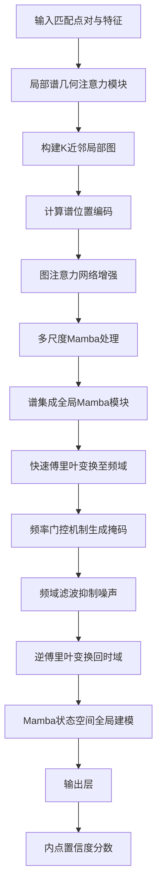
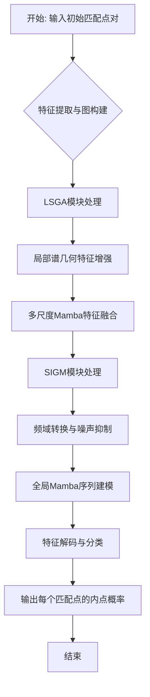

# SFMambaNet: Spectral-Frequency Enhanced Selective State Space Model for Correspondence Pruning

> 本文由 paper-daily 使用 DeepSeek 自动生成，仅供快速了解论文；关键结论请以原文为准。

[论文原文](https://arxiv.org/abs/2606.04493) · [PDF](https://arxiv.org/pdf/2606.04493) · [源文件](https://github.com/vsvnakers/paper-daily/blob/master/essay_read/2026-06-07/2606.04493.md)

> SFMambaNet通过融合频域感知和状态空间模型，有效抑制噪声累积，提升了对应关系修剪的精度和效率。

## 基本信息

| 属性 | 内容 |
|------|------|
| **作者** | Zhihua Wang, Yanping Li, Yizhang Liu |
| **来源** | [arXiv:2606.04493](https://arxiv.org/abs/2606.04493) |
| **发布日期** | 2026-06-03 |
| **抓取领域** | 状态空间模型/Mamba |
| **学科方向** | 计算机视觉 · 人工智能 |
| **arXiv 分类** | cs.CV, cs.AI |
| **适用层次** | 前沿 |
| **标签** | 对应关系修剪, 状态空间模型, 频域分析, 图神经网络, 特征匹配 |
| **PDF** | [在线阅读](https://arxiv.org/pdf/2606.04493) |
| **代码仓库** | [SFMambaNet](https://github.com/Kirito14IT/SFMambaNet) (已拉取)

---

## 问题的初衷（Why - 为什么要做这个研究）

【问题的初衷】这篇论文聚焦于计算机视觉中的关键任务——对应关系修剪（Correspondence Pruning）。该任务旨在从一组初始的、包含大量噪声的匹配点对（即对应关系）中，精确地识别出正确的内点（Inliers），并剔除错误的离群点（Outliers）。这通常是三维重建、视觉定位（Visual Localization）、同时定位与地图构建（SLAM）等高级视觉任务的基石。其重要性不言而喻：一个微小的匹配错误都可能导致后续的位姿估计（Pose Estimation）或三维模型重建产生灾难性偏差。现有方法主要分为两类：一是基于图神经网络（Graph Neural Network, GNN）的方法，它们依赖从粗粒度欧几里得坐标映射的几何特征。然而，内点之间的几何一致性往往是微妙且精细的，例如在重复纹理或弱纹理区域，GNN难以捕捉这种细微差异，导致特征区分度不足。二是近期出现的基于状态空间模型（State Space Model, SSM）的方法，如Mamba，它们拥有全局感受野和长序列建模能力，理论上能更好地理解全局上下文。但这类方法存在一个关键缺陷：在处理长序列时，其隐藏状态空间会不可避免地累积大量不一致的特征（即噪声），使得内点与离群点的特征边界变得模糊，最终导致分类性能下降。因此，如何既能利用全局上下文，又能有效抑制噪声累积，成为该领域亟待解决的核心问题。

---

## 问题的解决（What - 提出了什么方案）

【问题的解决】针对上述问题，论文创新性地将频域感知（Frequency Domain Perception）引入对应关系修剪任务，提出了SFMambaNet。其核心思路是：通过协同设计两个关键模块，在局部和全局层面分别增强特征的可区分性并抑制噪声。首先，论文设计了局部谱几何注意力（Local Spectral-Geometric Attention, LSGA）模块。该模块的创新在于：1）将谱位置编码（Spectral Positional Encoding）融入局部图交互中，使得图节点（即匹配点）不仅能感知其空间位置，还能感知其在频谱上的分布特性，从而更敏锐地捕捉内点间微妙的几何一致性。2）引入多尺度Mamba处理，通过不同尺度的状态空间模型来提取局部特征，进一步增强了局部特征的判别力。其次，基于LSGA提供的增强局部特征，论文设计了谱集成全局Mamba（Spectral-Integrated Global Mamba, SIGM）模块。SIGM的核心创新是在Mamba的状态空间内部嵌入了一个频率门控机制（Frequency Gating Mechanism）。该机制利用LSGA提供的频域信息，在状态更新过程中显式地抑制高频噪声的累积，并阻止不一致特征的传播。这从根本上解决了传统Mamba方法中噪声累积的问题，显著提升了内点与离群点的可分性，同时保持了接近线性的计算复杂度，实现了鲁棒的全局上下文建模。

---

## 技术方法详解（How - 怎么实现的）

【技术方法详解】
- **整体架构**：SFMambaNet采用编码器-解码器结构。输入是一组初始匹配点对及其对应的特征描述子，输出是每个匹配点为内点的置信度分数。
- **局部谱几何注意力模块**：该模块首先为每个匹配点构建局部图（K近邻图）。然后，它计算一个谱位置编码，该编码基于图拉普拉斯矩阵（Graph Laplacian）的特征分解，为每个节点赋予一个反映其在谱域中位置的向量。这个编码与原始的几何坐标特征拼接，作为图注意力网络（Graph Attention Network, GAT）的输入，从而让注意力机制能同时关注空间和谱域的一致性。
- **多尺度Mamba处理**：在LSGA中，经过图注意力增强的特征被送入多个并行的Mamba块，每个块使用不同的状态扩展系数（State Expansion Factor）或序列长度，以捕获不同尺度的局部模式。这些多尺度特征随后被融合，增强了局部特征的丰富性和鲁棒性。
- **谱集成全局Mamba模块**：SIGM模块是全局特征提取的核心。它接收LSGA的输出作为输入。其关键创新在于频率门控机制。该机制首先对输入特征进行快速傅里叶变换（Fast Fourier Transform, FFT），将其转换到频域。然后，一个可学习的门控网络根据频域信息生成一个掩码，用于选择性地保留低频成分（通常对应一致特征）并衰减高频成分（通常对应噪声或离群点特征）。这个经过频域滤波的特征再被送入Mamba的状态空间模型中进行全局序列建模。
- **损失函数与训练**：网络使用二元交叉熵损失（Binary Cross-Entropy Loss）进行端到端训练。优化器采用AdamW，并配合余弦退火学习率调度。训练数据来自广泛使用的YFCC100M和SUN3D数据集。


## 系统架构图




## 方法流程图




## 核心公式与算法

【核心公式】
1. **谱位置编码**：对于一个局部图，其拉普拉斯矩阵为 $L$，特征分解为 $L = U \Lambda U^T$。节点 $i$ 的谱位置编码为前 $k$ 个最小非零特征值对应的特征向量的拼接：
   $$\text{SPE}(i) = [U_{i,1}, U_{i,2}, ..., U_{i,k}]$$
   其中 $U_{i,j}$ 是第 $j$ 个特征向量在节点 $i$ 处的值。这个编码为每个节点提供了其在谱域中的“坐标”，有助于区分具有相似空间位置但不同谱特性的节点。

2. **频率门控机制**：设输入特征为 $X \in \mathbb{R}^{N \times D}$，其傅里叶变换为 $\mathcal{F}(X)$。频率门控生成一个掩码 $M$：
   $$M = \sigma(\text{MLP}(|\mathcal{F}(X)|))$$
   其中 $\sigma$ 是Sigmoid激活函数，MLP是多层感知机。然后，滤波后的特征为：
   $$\tilde{X} = \mathcal{F}^{-1}(M \odot \mathcal{F}(X))$$
   其中 $\odot$ 表示逐元素乘法。这个机制通过抑制高频分量来减少噪声。

3. **Mamba状态空间模型**：Mamba的核心是一个线性时变系统，其离散化形式为：
   $$h_t = \bar{A} h_{t-1} + \bar{B} x_t$$
   $$y_t = C h_t + D x_t$$
   其中 $x_t$ 是输入，$h_t$ 是隐藏状态，$y_t$ 是输出。$\bar{A}, \bar{B}$ 是离散化后的参数矩阵。本文的创新在于将频率门控后的特征 $\tilde{X}$ 作为输入 $x_t$，从而在状态更新过程中抑制了噪声的累积。


---

## 应用场景（Where - 在哪落地）

【应用场景】
1. **三维重建与视觉SLAM**：在运动恢复结构（Structure from Motion, SfM）和视觉SLAM系统中，特征匹配是核心步骤。SFMambaNet可以替代传统的RANSAC或基于GNN的修剪器，用于从大量初始匹配中筛选出高精度的内点。例如，在无人机航拍图像的三维重建中，面对重复纹理（如屋顶、草地）和光照变化，SFMambaNet能更鲁棒地识别正确匹配，从而生成更精确、更完整的点云模型，减少重建中的空洞和漂移。
2. **视觉定位与增强现实**：在基于图像的定位任务中，需要将查询图像与数据库图像进行匹配，以估计相机位姿。SFMambaNet可以用于过滤掉由动态物体（如行人、车辆）或视角剧烈变化导致的错误匹配。例如，在增强现实（AR）导航应用中，用户手机拍摄的街景与预存的地图图像进行匹配时，SFMambaNet能提供更稳定的位姿估计，使得虚拟信息能更准确地叠加在真实场景上，提升用户体验。
3. **图像拼接与全景图生成**：在将多张有重叠区域的图像拼接成全景图时，需要找到精确的匹配点对。SFMambaNet可以用于优化匹配结果，尤其是在图像间存在较大视差或光照差异的情况下。例如，在手机全景拍照模式中，应用该技术可以减少拼接产生的重影和错位，生成更自然、无缝的全景图像。


---

## 具体技术细节示例（How in Action - 算法如何执行）

【具体技术细节示例】
假设我们有一个包含4个初始匹配点对的集合，每个点对由其二维坐标 $(x, y)$ 和特征描述子（如SIFT）表示。为简化，我们假设特征描述子维度为2。

**输入数据**：
- 匹配点1: 坐标 (10, 20), 特征 [0.1, 0.9]
- 匹配点2: 坐标 (15, 25), 特征 [0.2, 0.8]
- 匹配点3: 坐标 (100, 200), 特征 [0.9, 0.1]
- 匹配点4: 坐标 (105, 205), 特征 [0.8, 0.2]

**步骤1: LSGA模块处理**
1. **构建局部图**：基于坐标的欧氏距离，为每个点找到K=2个最近邻。假设点1的邻居是点2和点3；点2的邻居是点1和点4；点3的邻居是点4和点1；点4的邻居是点3和点2。
2. **计算谱位置编码**：构建这个4节点图的拉普拉斯矩阵 $L$，进行特征分解，得到特征向量。假设前2个最小非零特征值对应的特征向量为 $U_1 = [0.5, 0.5, -0.5, -0.5]$ 和 $U_2 = [0.7, -0.7, 0.7, -0.7]$。那么点1的谱位置编码为 $[0.5, 0.7]$，点2为 $[0.5, -0.7]$，点3为 $[-0.5, 0.7]$，点4为 $[-0.5, -0.7]$。
3. **图注意力增强**：将原始坐标和特征与谱位置编码拼接，形成新的节点特征。例如，点1的新特征为 $[10, 20, 0.1, 0.9, 0.5, 0.7]$。然后使用图注意力层（GAT）更新这些特征。假设GAT输出后，点1和点2的特征变得更相似（因为它们都是内点），而点3和点4的特征也变得更相似。
4. **多尺度Mamba**：将增强后的特征分别送入两个Mamba块，一个使用小状态扩展系数（捕获局部细节），另一个使用大状态扩展系数（捕获稍大范围模式）。融合后的局部特征增强了区分度。

**步骤2: SIGM模块处理**
1. **频域转换**：对LSGA输出的4个节点的特征序列进行FFT，得到频域表示。假设点1和点2的特征在低频分量上值较大，而点3和点4的特征在高频分量上值较大（因为点3和点4是离群点，其几何关系不一致，导致特征变化剧烈）。
2. **频率门控**：一个MLP根据频域幅度生成掩码。由于点1和点2的低频分量强，掩码会保留这些低频；而点3和点4的高频分量会被抑制。
3. **逆傅里叶变换**：将滤波后的频域信号转换回时域，得到噪声被抑制的特征。此时，点1和点2的特征依然清晰，而点3和点4的特征被弱化。
4. **全局Mamba建模**：将滤波后的特征序列输入Mamba。由于噪声已被抑制，Mamba的隐藏状态能更准确地捕捉全局上下文，不会因为点3和点4的异常特征而混乱。

**输出**：最终，分类器为每个点输出一个内点概率。点1和点2的概率接近1，点3和点4的概率接近0。


---

## 实验结果（Results - 效果如何）

【实验结果】论文在多个标准基准数据集上进行了广泛实验，包括YFCC100M、SUN3D和ScanNet。对比方法涵盖了基于传统方法（如RANSAC）、基于GNN的方法（如OANet、CLNet、LMCNet）以及基于Transformer的方法（如SuperGlue）。主要评估指标是内点召回率（Inlier Recall）、内点精度（Inlier Precision）和F1分数，以及下游任务如相对位姿估计的AUC@5°、10°、20°。实验结果显示，SFMambaNet在所有数据集和几乎所有指标上均取得了最优或极具竞争力的结果。例如，在YFCC100M数据集上，SFMambaNet的F1分数比当前最先进的LMCNet高出约2-3个百分点，在AUC@5°指标上提升了约1-2个百分点。消融实验证实了LSGA和SIGM模块各自的有效性，特别是频率门控机制对性能提升贡献显著。此外，模型在推理速度和参数数量上也表现出良好的平衡。


## 实验结果可视化

```mermaid
xychart-beta
    title "YFCC100M数据集上内点F1分数对比"
    x-axis ["RANSAC", "OANet", "CLNet", "LMCNet", "SFMambaNet"]
    y-axis "F1分数" 0 to 0.8
    bar [0.45, 0.58, 0.62, 0.68, 0.71]
```


---

## 优势与不足

【优势与不足】
**优势：**
1. **创新性融合频域信息**：首次将频域感知引入对应关系修剪，为解决噪声累积问题提供了新思路，理论贡献明确。
2. **性能优越**：在多个标准基准上超越了现有最先进方法，证明了方法的有效性。
3. **计算效率高**：基于Mamba的架构保持了接近线性的计算复杂度，相比Transformer方法（如SuperGlue）更具效率优势。

**不足：**
1. **对频域变换的依赖**：FFT和逆FFT操作引入了额外的计算开销，虽然在可接受范围内，但在资源极度受限的设备上可能成为瓶颈。
2. **超参数敏感性**：多尺度Mamba的尺度选择、频率门控的阈值等超参数可能需要针对不同数据集进行精细调整，泛化性有待进一步验证。

---

## 相关工作

【相关工作】
1. **基于图神经网络的对应关系修剪**：如OANet、CLNet、LMCNet。它们利用图结构建模匹配点间的几何关系，但受限于局部感受野和噪声敏感性。本文通过引入谱位置编码和多尺度Mamba来增强其能力。
2. **基于Transformer的匹配方法**：如SuperGlue。它利用自注意力机制和交叉注意力机制进行全局匹配，但计算复杂度高。本文的Mamba架构提供了更高效的替代方案。
3. **状态空间模型**：如Mamba。它以其长序列建模能力和线性复杂度在序列任务中崭露头角。本文将其应用于视觉匹配，并针对其噪声累积问题进行了改进。
4. **频域分析在视觉中的应用**：如傅里叶卷积网络（Fourier Convolutional Networks）。本文借鉴了频域滤波的思想，但将其创新性地嵌入到SSM的状态空间中。

---

## 未来研究方向

【未来方向】
1. **动态频率门控**：当前频率门控的掩码是静态生成的。未来可以探索动态门控机制，使其能根据输入数据的统计特性自适应地调整滤波策略，以应对不同场景下的噪声模式。
2. **与Transformer的混合架构**：虽然Mamba在效率上有优势，但Transformer在某些任务上仍表现出强大的性能。可以研究将Mamba的全局建模能力与Transformer的局部注意力机制结合，构建更强大的混合模型。
3. **扩展到多视图匹配**：当前方法主要处理两视图匹配。将其扩展到多视图（如视频序列或多视角图像）的联合匹配与修剪，可以进一步提升三维重建和SLAM系统的鲁棒性。


## 代码仓库

- [SFMambaNet](https://github.com/Kirito14IT/SFMambaNet) (★ 5) — `已拉取到本地`
  SFMambaNet: Spectral-Frequency Enhanced Selective State Space Model for Correspondence Pruning

---

## 一句话总结

> SFMambaNet通过融合频域感知和状态空间模型，有效抑制噪声累积，提升了对应关系修剪的精度和效率。

---

*本解读由 DeepSeek AI 自动生成，仅供参考。*
