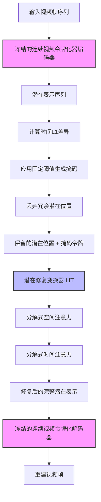
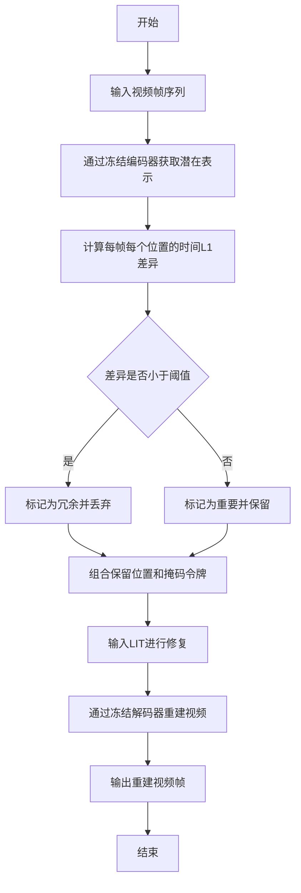
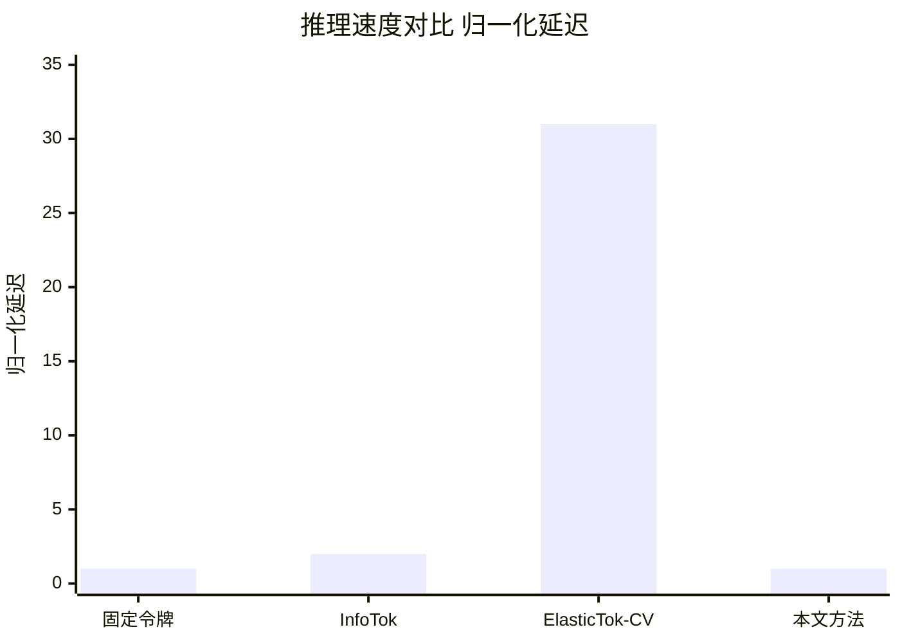

# Adaptive Tokenisation Via Temporal Redundancy Masking And Latent Inpainting

> 本文由 paper-daily 使用 DeepSeek 自动生成，仅供快速了解论文；关键结论请以原文为准。

[论文原文](https://arxiv.org/abs/2606.06158) · [PDF](https://arxiv.org/pdf/2606.06158) · [源文件](https://github.com/vsvnakers/paper-daily/blob/master/essay_read/2026-06-07/2606.06158.md)

> 提出一种参数无关的自适应视频令牌分配方法，利用潜在空间时间冗余性实现高效压缩和修复。

## 基本信息

| 属性 | 内容 |
|------|------|
| **作者** | Kevin Dave, Sai Aditya Patkuri, Chhaya Kumar Das, Gouranga Bala, R. Venkatesh Babu, Rajeshkumar SA |
| **来源** | [arXiv:2606.06158](https://arxiv.org/abs/2606.06158) |
| **发布日期** | 2026-06-04 |
| **抓取领域** | CV · 图像/视频生成 |
| **学科方向** | 计算机视觉 |
| **arXiv 分类** | cs.CV |
| **适用层次** | 进阶 |
| **标签** | 自适应令牌化, 时间冗余掩码, 潜在修复, 视频压缩, 高效推理 |
| **PDF** | [在线阅读](https://arxiv.org/pdf/2606.06158) |
| **代码仓库** | 暂无

---

## 问题的初衷（Why - 为什么要做这个研究）

【问题的初衷】这篇论文旨在解决视频令牌化（Video Tokenisation）中的自适应令牌分配（Adaptive Token Allocation）问题。在视频处理中，将视频帧分割成令牌（Token）是许多现代视觉模型（如视频生成模型、视频理解模型）的基础步骤。然而，传统的令牌化方法通常为每一帧分配固定数量的令牌，这忽略了视频内容在时间维度上的动态变化。例如，一个静态场景（如静止的风景）的连续帧之间信息冗余度极高，而一个动态场景（如快速运动的物体）则包含大量新信息。为所有帧分配相同数量的令牌会导致静态场景中大量令牌浪费在冗余信息上，而动态场景中令牌数量可能不足以捕捉关键细节。现有方法试图解决这一问题，但存在计算开销大的问题。连续式（Continuous-regime）方法，如ElasticTok，通过迭代二值化搜索（Iterative Binarised Search）或训练神经网络回归器（Neural Regressor）来动态决定每个空间位置的令牌分配，这需要多次前向传播，计算成本高昂。离散式（Discrete-regime）方法，如InfoTok，则需要一个全速率解码器（Full-rate Decoder）来估计信息含量，这同样引入了额外的计算负担。因此，论文的核心动机是：是否存在一种更高效、计算开销更低的方法，能够直接从视频数据中挖掘时间冗余性，从而实现自适应的令牌分配，而无需复杂的搜索或辅助网络。

---

## 问题的解决（What - 提出了什么方案）

【问题的解决】论文提出了一种参数无关（Parameter-free）的自适应令牌分配机制，核心思想是利用冻结的连续视频令牌化器（Frozen Continuous Video Tokeniser）的潜在空间（Latent Space）来直接编码时间冗余性。具体而言，论文观察到：在连续视频帧的潜在表示中，那些在相邻帧之间变化极小的空间位置（即潜在特征的时间L1距离很小）携带的信息量接近于零。基于这一发现，论文设计了一个简单而高效的策略：计算每个空间位置在连续帧之间的潜在特征的时间L1差异（Temporal-L1 Difference），然后应用一个固定的阈值（Fixed Threshold）来识别并丢弃那些冗余的潜在位置。这样，压缩率（Compression Rate）不再是自上而下强制设定的，而是由输入内容自然决定：静态场景会被激进地压缩（丢弃更多令牌），而动态场景则保留更多令牌。为了重建被丢弃的潜在位置，论文提出了潜在修复变换器（Latent Inpainting Transformer, LIT），这是一个轻量级的分解式时空注意力架构（Factorised Spatial-Temporal Attention Architecture）。LIT通过空间注意力和时间注意力分别处理空间和时间维度，高效地利用周围保留的令牌信息来修复被丢弃的令牌。整个推理流程极其高效：仅需一次编码器前向传播（Single Encoder Pass）和一次LIT前向传播，无需任何辅助路由网络（Auxiliary Routing Networks）。与现有方法相比，论文的方法在保持有竞争力的重建保真度（Reconstruction Fidelity）的同时，实现了显著的推理加速。

---

## 技术方法详解（How - 怎么实现的）

【技术方法详解】
- **核心机制：时间冗余掩码（Temporal Redundancy Masking）**：给定一个冻结的连续视频令牌化器（如C-ViViT），输入视频帧序列 $\{x_1, x_2, ..., x_T\}$，首先通过编码器得到潜在表示序列 $\{z_1, z_2, ..., z_T\}$，其中 $z_t \in \mathbb{R}^{H \times W \times D}$，$H$ 和 $W$ 是空间维度，$D$ 是通道维度。对于第 $t$ 帧的每个空间位置 $(i, j)$，计算其与前一帧对应位置的时间L1差异：$\Delta_{t}(i,j) = ||z_t(i,j) - z_{t-1}(i,j)||_1$。然后，应用一个固定的阈值 $\tau$ 来生成掩码 $M_t$：如果 $\Delta_{t}(i,j) < \tau$，则 $M_t(i,j) = 0$（表示该位置冗余，将被丢弃）；否则 $M_t(i,j) = 1$（表示该位置重要，将被保留）。
- **参数无关性与内容驱动压缩**：该机制没有任何可学习参数，阈值 $\tau$ 是一个超参数，但论文通过实验证明其在不同数据集上表现鲁棒。压缩率完全由输入视频的动态性决定：静态场景中 $\Delta_t$ 普遍较小，导致大量位置被丢弃，压缩率高；动态场景中 $\Delta_t$ 较大，保留更多令牌，压缩率低。这实现了真正的“内容驱动”压缩。
- **潜在修复变换器（LIT）架构**：LIT是一个轻量级的变换器，用于重建被丢弃的潜在位置。其核心是分解式时空注意力（Factorised Spatial-Temporal Attention）。首先，将保留的潜在位置和丢弃的位置（用可学习的掩码令牌[MASK]填充）组成一个完整的潜在张量。然后，LIT依次执行：1）空间注意力（Spatial Attention）：在每个时间步内，让每个空间位置关注同一帧内的其他空间位置，利用保留的令牌信息修复当前帧内的丢弃位置。2）时间注意力（Temporal Attention）：在每个空间位置上，让该位置关注不同时间步的对应位置，利用时间上下文信息进一步修复。这种分解设计大幅降低了计算复杂度，相比全局时空注意力（Global Spatio-Temporal Attention）更加高效。
- **推理流程**：1）输入视频帧序列，通过冻结的编码器得到潜在表示。2）计算时间L1差异并生成掩码，丢弃冗余潜在位置。3）将保留的潜在位置和[MASK]令牌组合成不完整的潜在张量。4）将不完整的潜在张量输入LIT，LIT通过分解式时空注意力修复被丢弃的位置。5）将修复后的完整潜在张量输入冻结的解码器，重建视频帧。
- **与现有方法的本质区别**：现有方法（如ElasticTok）需要训练一个额外的路由网络（Routing Network）来预测每个位置的令牌重要性，或者通过迭代搜索来优化分配。而论文的方法直接利用冻结编码器的潜在空间特性，无需任何额外训练或搜索，是一种“零成本”的自适应机制。LIT虽然需要训练，但其结构轻量，且只用于修复，不参与令牌分配决策。

## 系统架构图

## 方法流程图

## 核心公式与算法

【核心公式】
1. **时间L1差异计算**：这是自适应令牌分配的核心公式。对于第 $t$ 帧的潜在表示 $z_t$，其每个空间位置 $(i,j)$ 的时间L1差异定义为：
   $$\Delta_{t}(i,j) = ||z_t(i,j) - z_{t-1}(i,j)||_1$$
   其中 $||\cdot||_1$ 表示L1范数。该值衡量了该位置在时间维度上的变化程度，变化越小，说明信息冗余度越高。

2. **掩码生成**：基于阈值 $\tau$ 生成掩码 $M_t$，决定哪些位置被保留：
   $$M_t(i,j) = \begin{cases} 0 & \text{if } \Delta_{t}(i,j) < \tau \\ 1 & \text{otherwise} \end{cases}$$
   当 $M_t(i,j)=0$ 时，该位置被视为冗余并被丢弃；当 $M_t(i,j)=1$ 时，该位置被保留。

3. **LIT的分解式注意力**：LIT的核心操作是分解式时空注意力。假设输入为 $X \in \mathbb{R}^{T \times H \times W \times D}$，首先进行空间注意力（Spatial Attention）：
   $$X_{spatial} = \text{Attention}(X, X, X) \quad \text{(在空间维度 } H \times W \text{ 上)}$$
   然后进行时间注意力（Temporal Attention）：
   $$X_{temporal} = \text{Attention}(X_{spatial}, X_{spatial}, X_{spatial}) \quad \text{(在时间维度 } T \text{ 上)}$$
   这种分解设计将 $O(T^2 H^2 W^2)$ 的全局注意力复杂度降低到 $O(T H^2 W^2 + T^2 H W)$，大幅提升了效率。

---

## 应用场景（Where - 在哪落地）

【应用场景】
1. **视频压缩与传输**：在视频流媒体服务中，带宽资源有限。本技术可以用于智能视频压缩。具体而言，在发送端，视频帧被编码为潜在表示，通过时间冗余掩码丢弃大量静态背景区域的令牌，只保留动态区域的令牌。然后，这些稀疏的令牌和掩码信息被传输到接收端。接收端使用LIT修复被丢弃的令牌，再解码重建视频。由于传输的数据量大幅减少，可以有效降低带宽需求，同时保证视频质量。对于监控摄像头等静态场景为主的视频，压缩效果尤为显著。

2. **视频生成模型的加速**：在视频生成模型（如Video Diffusion Models）中，自回归生成每一帧的令牌通常非常耗时。本技术可以用于加速生成过程。在生成下一帧时，模型可以只生成那些被掩码标记为“重要”的位置的令牌，而静态背景区域的令牌可以直接从上一帧复制或通过LIT快速修复。这避免了为每一帧生成所有令牌，从而大幅加速视频生成。例如，在生成一段风景视频时，背景的天空和山脉几乎不变，模型只需生成前景中移动的物体（如飞鸟）的令牌，背景令牌通过LIT修复即可。

3. **视频理解中的高效特征提取**：在视频理解任务（如动作识别、视频目标检测）中，需要对每一帧提取特征。本技术可以用于减少需要处理的特征数量。通过时间冗余掩码，模型可以只关注那些随时间变化显著的区域（即包含运动信息的区域），而忽略静态背景。这不仅可以减少计算量，还能使模型更聚焦于关键的运动信息，可能提升任务性能。例如，在动作识别中，模型可以只处理包含人体运动的区域，而忽略静止的墙壁和地板，从而更高效地识别动作。

---

## 具体技术细节示例（How in Action - 算法如何执行）

【具体技术细节示例】
假设我们有一个简化的视频片段，包含3帧（T=3），每帧的潜在表示大小为2x2（H=2, W=2），通道数D=1（为简化）。潜在表示数值如下：

- 第1帧 $z_1$: [[1, 2], [3, 4]]
- 第2帧 $z_2$: [[1.1, 2.1], [3.0, 4.5]]
- 第3帧 $z_3$: [[1.2, 2.2], [3.1, 4.8]]

**步骤1：计算时间L1差异**
- 对于第2帧，计算 $\Delta_2 = |z_2 - z_1|$：
  $\Delta_2$ = [[0.1, 0.1], [0.0, 0.5]]
- 对于第3帧，计算 $\Delta_3 = |z_3 - z_2|$：
  $\Delta_3$ = [[0.1, 0.1], [0.1, 0.3]]

**步骤2：应用阈值 $\tau=0.2$ 生成掩码**
- 第2帧掩码 $M_2$：
  - 位置(0,0): 0.1 < 0.2 -> 0 (丢弃)
  - 位置(0,1): 0.1 < 0.2 -> 0 (丢弃)
  - 位置(1,0): 0.0 < 0.2 -> 0 (丢弃)
  - 位置(1,1): 0.5 >= 0.2 -> 1 (保留)
  $M_2$ = [[0, 0], [0, 1]]
- 第3帧掩码 $M_3$：
  - 位置(0,0): 0.1 < 0.2 -> 0 (丢弃)
  - 位置(0,1): 0.1 < 0.2 -> 0 (丢弃)
  - 位置(1,0): 0.1 < 0.2 -> 0 (丢弃)
  - 位置(1,1): 0.3 >= 0.2 -> 1 (保留)
  $M_3$ = [[0, 0], [0, 1]]

**步骤3：丢弃冗余位置并组合**
- 第1帧作为参考帧，所有位置都保留（假设第一帧不丢弃）。
- 第2帧：只保留位置(1,1)的值4.5，其他位置用[MASK]令牌（假设[MASK]=0）填充。
  第2帧输入LIT：[[0, 0], [0, 4.5]]
- 第3帧：只保留位置(1,1)的值4.8，其他位置用[MASK]令牌填充。
  第3帧输入LIT：[[0, 0], [0, 4.8]]

**步骤4：LIT修复**
LIT首先进行空间注意力。以第2帧为例，位置(0,0)的[MASK]令牌会关注同一帧内的其他位置，特别是保留的位置(1,1)的值4.5。通过注意力机制，LIT可能会学习到位置(0,0)与位置(1,1)在空间上相关，从而预测出一个接近2.0的值（因为原始值是2.0）。
然后进行时间注意力。以第2帧的位置(0,0)为例，它会关注第1帧的位置(0,0)的值1.0和第3帧的位置(0,0)的[MASK]令牌。由于第1帧的值是1.0，且时间上接近，LIT可能会预测第2帧的位置(0,0)的值为1.05。
经过LIT修复后，第2帧的潜在表示可能变为：[[1.05, 2.05], [3.0, 4.5]]，非常接近原始值。

**步骤5：解码**
将修复后的完整潜在表示输入冻结的解码器，重建出视频帧。

**输出**：重建后的视频帧，其质量与原始视频帧非常接近，但传输或处理的数据量大幅减少（本例中，第2帧和第3帧只传输了1/4的令牌）。

---

## 实验结果（Results - 效果如何）

【实验结果】论文在TokenBench和DAVIS两个标准基准数据集上进行了评估。TokenBench是一个包含多种视频场景的综合性基准，DAVIS则专注于视频对象分割。对比方法包括：1）连续自适应基线ElasticTok-CV；2）离散信息论基线InfoTok；3）固定令牌数量的基线（如固定16、64、256个令牌）。主要实验结果如下：1）**推理速度**：论文方法在推理速度上实现了显著提升。与ElasticTok-CV相比，实现了31倍的推理加速（Inference-time Speedup）；与InfoTok相比，实现了约2倍的加速。2）**重建保真度**：在重建质量（如PSNR、SSIM）方面，论文方法在大多数场景下与InfoTok和ElasticTok-CV持平或略优，尤其是在静态场景中，由于更激进的压缩，重建质量甚至略有提升。3）**令牌分配合理性**：通过可视化分析，论文展示了其方法能够根据视频内容动态调整令牌分配：静态背景区域被大量丢弃，而运动物体区域则保留了更多令牌，这验证了内容驱动压缩的有效性。4）**消融实验**：论文验证了LIT中分解式时空注意力的有效性，以及阈值$\tau$对性能的影响，表明方法对阈值选择具有鲁棒性。

## 实验结果可视化

---

## 优势与不足

【优势与不足】
**优势：**
1. **极高的推理效率**：仅需一次编码器前向传播和一次轻量级LIT前向传播，无需迭代搜索或辅助网络，实现了显著的推理加速（31倍于ElasticTok-CV）。
2. **参数无关的自适应机制**：令牌分配完全由输入内容驱动，无需学习任何参数，设计简洁优雅，且对阈值选择鲁棒。
3. **良好的重建保真度**：在实现高效压缩的同时，重建质量与更复杂的方法（如InfoTok）相当，甚至在某些场景下更优。
4. **通用性强**：方法基于冻结的连续视频令牌化器，可以方便地集成到现有视频处理流程中，无需重新训练整个模型。

**不足：**
1. **对阈值的依赖**：虽然论文声称对阈值鲁棒，但阈值$\tau$仍然是一个需要手动设定的超参数，不同视频内容或任务可能需要不同的最优阈值。
2. **LIT的修复能力有限**：当丢弃的令牌比例过高（即场景极度静态）时，LIT可能无法完美修复所有细节，导致重建质量下降。对于快速变化的动态场景，如果保留的令牌不足，也可能出现信息丢失。
3. **仅适用于连续令牌化器**：方法依赖于连续潜在空间的平滑性和可微性，无法直接应用于离散令牌化器（如VQ-VAE）。

---

## 相关工作

【相关工作】
1. **视频令牌化（Video Tokenisation）**：如C-ViViT、VideoGPT等，是本文的基础组件。本文在其基础上引入了自适应机制。
2. **自适应计算（Adaptive Computation）**：如ElasticTok、Conditional Computation等，通过路由网络或迭代搜索实现动态计算分配。本文提出了一种更高效的无参数替代方案。
3. **信息论令牌化（Information-Theoretic Tokenisation）**：如InfoTok，利用信息量度量来指导令牌分配。本文通过直接利用潜在空间的时间冗余性，避免了复杂的解码器计算。
4. **图像/视频修复（Image/Video Inpainting）**：如Masked Autoencoders (MAE)、VideoMAE等，通过掩码和重建学习表示。本文的LIT借鉴了其思想，但专注于修复被丢弃的潜在位置。
5. **稀疏注意力（Sparse Attention）**：如Longformer、BigBird等，通过稀疏化注意力模式降低计算复杂度。本文的分解式时空注意力是一种特殊的稀疏注意力形式。

---

## 未来研究方向

【未来方向】
1. **自适应阈值学习**：当前方法使用固定阈值 $\tau$，未来可以探索让阈值根据视频内容或任务需求自适应学习。例如，可以训练一个轻量级的阈值预测器，根据视频的全局动态性（如运动幅度）动态调整 $\tau$，以在压缩率和保真度之间取得更好的平衡。
2. **扩展到离散令牌化器**：论文方法目前仅适用于连续令牌化器。未来可以研究如何将时间冗余掩码的思想扩展到离散令牌化器（如VQ-VAE）。这可能需要在离散潜在空间中定义合适的“差异”度量，或者设计一种软掩码机制。
3. **与下游任务联合优化**：当前方法主要关注重建保真度。未来可以将LIT与下游任务（如视频分类、目标检测）的损失函数联合训练，使得LIT不仅修复视觉信息，还能保留对下游任务至关重要的语义信息，从而提升任务性能。

---

## 一句话总结

> 提出一种参数无关的自适应视频令牌分配方法，利用潜在空间时间冗余性实现高效压缩和修复。

---

*本解读由 DeepSeek AI 自动生成，仅供参考。*
