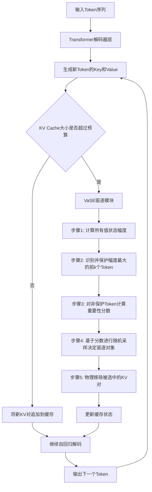
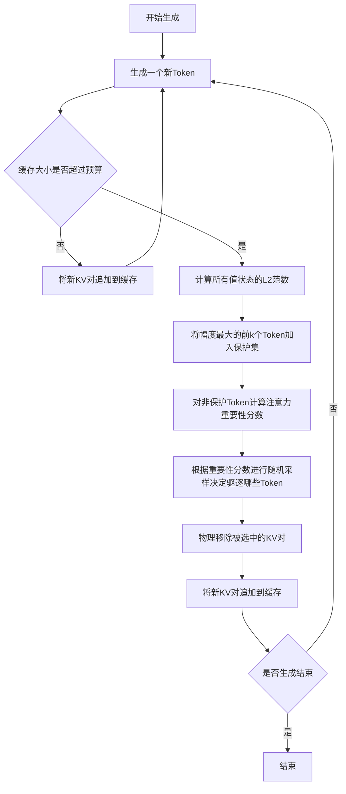

# Value-Aware Stochastic KV Cache Eviction for Reasoning Models

> 本文由 paper-daily 使用 DeepSeek 自动生成，仅供快速了解论文；关键结论请以原文为准。

[论文原文](https://arxiv.org/abs/2606.03928) · [PDF](https://arxiv.org/pdf/2606.03928) · [源文件](https://github.com/vsvnakers/paper-daily/blob/master/essay_read/2026-06-08/2606.03928.md)

> 提出一种价值感知随机KV缓存驱逐方法，通过保护大值状态和引入随机性，在物理压缩内存的同时超越稀疏选择方法的准确性。

## 基本信息

| 属性 | 内容 |
|------|------|
| **作者** | Ting-Yun Chang, Harvey Yiyun Fu, Deqing Fu, Chenghao Yang, Jesse Thomason, Robin Jia |
| **来源** | [arXiv:2606.03928](https://arxiv.org/abs/2606.03928) |
| **发布日期** | 2026-06-02 |
| **抓取领域** | LLM推理 · 内存与加速 |
| **学科方向** | 机器学习 · 自然语言处理 |
| **arXiv 分类** | cs.LG, cs.CL |
| **适用层次** | 前沿 |
| **标签** | KV缓存驱逐, 推理模型, 值状态异常值, 随机采样, 内存优化 |
| **PDF** | [在线阅读](https://arxiv.org/pdf/2606.03928) |
| **代码仓库** | 暂无

---

## 问题的初衷（Why - 为什么要做这个研究）

【问题的初衷】这篇论文聚焦于大型语言模型（Large Language Model, LLM）在推理任务中的效率瓶颈。近年来，以思维链（Chain-of-Thought, CoT）为代表的推理模型（如OpenAI的o1系列、DeepSeek-R1等）通过生成极长的中间推理步骤来显著提升在数学、逻辑、代码等复杂任务上的准确性。然而，这种长序列生成带来了巨大的计算和内存开销。在自回归解码（Autoregressive Decoding）过程中，Transformer模型需要缓存所有历史token的键值对（Key-Value Cache, KV Cache）以避免重复计算。当序列长度达到数万甚至数十万token时，KV Cache的大小会线性增长，迅速耗尽GPU的高带宽内存（High Bandwidth Memory, HBM），成为推理吞吐量和延迟的主要瓶颈。现有的KV Cache压缩方法主要分为两类：一是稀疏注意力（Sparse Attention），即通过选择性地保留部分KV Cache（如H2O、Scissorhands），但这类方法通常需要保留完整的KV Cache索引，内存占用并未显著降低；二是缓存驱逐（Cache Eviction），即物理地从缓存中移除不重要的KV对，从而实现静态内存占用，但现有驱逐方法（如StreamingLLM、FastGen）在推理任务上的准确性往往不如稀疏选择方法。因此，核心问题在于：如何设计一种KV Cache驱逐策略，既能像稀疏选择方法一样保持高准确性，又能实现物理内存的静态化，从而真正解决推理模型的内存瓶颈。现有驱逐方法的不足在于，它们通常基于注意力分数（Attention Score）或频率等启发式规则来判定重要性，忽略了值状态（Value State）的异常值（Outlier）特性，且驱逐决策缺乏随机性，导致模型在长序列推理中陷入重复循环（Repetitive Loops）或丢失关键信息。本文的动机正是要揭示这些关键因素，并提出一种训练无关的、价值感知的随机驱逐策略来弥合效率与准确性之间的鸿沟。

---

## 问题的解决（What - 提出了什么方案）

【问题的解决】论文提出了价值感知随机KV缓存驱逐（Value-aware Stochastic KV Cache Eviction, VaSE），一种无需额外训练（Training-free）的推理优化方法。其核心思路基于两个关键发现：第一，在推理模型的KV Cache中，存在一小部分值状态（Value State）具有异常大的幅度（Magnitude），这些“大值”状态通常对应着推理链中的关键结论或转折点。如果驱逐这些状态，模型会遭受灾难性失败，表现为进入重复的推理循环，无法产生有效输出。第二，在驱逐过程中引入随机性（Stochasticity），而非完全确定性地选择驱逐对象，能够增加缓存中保留状态的多样性（Diversity），从而提升整体准确性。VaSE的创新点在于：它设计了一个价值感知的保护机制，在驱逐决策前，先识别并保护那些幅度最大的值状态，确保它们不被驱逐；同时，对于其他非保护状态，采用一种基于重要性分数的随机采样策略来决定驱逐对象，而不是简单地驱逐分数最低的。这种“保护+随机”的组合策略，从根本上区别于现有方法。与H2O等稀疏选择方法相比，VaSE是物理驱逐，能实现静态内存占用；与StreamingLLM等确定性驱逐方法相比，VaSE通过保护大值状态避免了灾难性失败，并通过随机性提升了缓存多样性。本质上，VaSE在驱逐的确定性与随机性之间找到了一个平衡点，既保证了关键信息的留存，又避免了过度确定性导致的局部最优。

---

## 技术方法详解（How - 怎么实现的）

【技术方法详解】VaSE方法的技术细节可以分解为以下几个关键步骤和设计：

1. **值状态幅度分析（Value Magnitude Analysis）**：论文首先对推理模型（如Qwen3系列）在长序列推理过程中的KV Cache进行统计分析。他们发现，值状态（Value State, $V$）的L2范数（$||V||_2$）分布呈现长尾特性，即极少数token的值状态幅度远大于其他token。这些大幅度值状态通常出现在推理链的关键节点，如数学推导中的中间结果或逻辑结论。

2. **保护机制（Protection Mechanism）**：基于上述发现，VaSE引入了一个保护集（Protected Set）。在每次驱逐操作前，算法会计算当前缓存中所有token的值状态幅度，并选择幅度最大的前$k$个token（$k$是一个超参数，通常很小，如缓存大小的1%）加入保护集。保护集中的token在任何情况下都不会被驱逐。这确保了关键信息不会丢失，从而避免了模型陷入重复循环。

3. **随机驱逐策略（Stochastic Eviction Policy）**：对于非保护集中的token，VaSE并不简单地驱逐重要性分数最低的，而是采用一种基于重要性分数的随机采样（Importance-based Stochastic Sampling）。具体来说，每个非保护token $i$ 被驱逐的概率 $P_{evict}(i)$ 与其重要性分数 $s_i$ 成反比。重要性分数 $s_i$ 可以基于注意力分数（Attention Score）或累积注意力（Cumulative Attention）等指标计算。公式可表示为：$P_{evict}(i) = \frac{\exp(-s_i / \tau)}{\sum_{j \in \text{non-protected}} \exp(-s_j / \tau)}$，其中 $\tau$ 是温度参数（Temperature），控制随机性的强度。当 $\tau \to 0$ 时，策略退化为确定性驱逐（驱逐分数最低的）；当 $\tau \to \infty$ 时，策略变为均匀随机驱逐。

4. **缓存管理流程（Cache Management Workflow）**：VaSE的驱逐操作在每次生成新token后触发。当KV Cache大小超过预设的预算（Budget）时，算法执行以下步骤：
   - 计算当前缓存中所有token的值状态幅度。
   - 识别并保护幅度最大的前$k$个token。
   - 对剩余的非保护token，计算其重要性分数。
   - 根据重要性分数进行随机采样，选择需要驱逐的token。
   - 物理移除被选中的token的Key和Value向量，释放内存。

5. **与FlashAttention2的兼容性（Compatibility with FlashAttention2）**：VaSE被设计为与FlashAttention2兼容。由于FlashAttention2采用分块（Tiling）计算，不直接暴露完整的注意力矩阵，VaSE通过维护一个全局的KV Cache索引和驱逐掩码（Eviction Mask）来实现驱逐决策，而不需要修改FlashAttention2的内核。这使得VaSE可以无缝集成到现有的推理框架中。


## 系统架构图




## 方法流程图




## 核心公式与算法

【核心公式】

1. **值状态幅度计算**：
   $$\text{Magnitude}(V_i) = ||V_i||_2 = \sqrt{\sum_{j=1}^{d} V_{i,j}^2}$$
   其中 $V_i$ 是第 $i$ 个token的值状态向量，$d$ 是注意力头的维度。该公式用于识别需要保护的大幅度值状态。

2. **随机驱逐概率**：
   $$P_{\text{evict}}(i) = \frac{\exp(-s_i / \tau)}{\sum_{j \in \mathcal{U}} \exp(-s_j / \tau)}$$
   其中 $s_i$ 是第 $i$ 个非保护token的重要性分数（如累积注意力分数），$\tau$ 是温度参数，$\mathcal{U}$ 是非保护token的集合。该公式定义了驱逐的随机策略，重要性分数越低的token被驱逐的概率越高，但通过温度参数引入了可控的随机性。

3. **保护集定义**：
   $$\mathcal{P} = \arg \max_{|\mathcal{P}|=k} \sum_{i \in \mathcal{P}} ||V_i||_2$$
   即选择幅度最大的 $k$ 个token构成保护集 $\mathcal{P}$。这些token永远不会被驱逐。


---

## 应用场景（Where - 在哪落地）

【应用场景】

1. **云端大模型推理服务**：在提供API服务的云端数据中心，部署如Qwen3、DeepSeek-R1等推理模型时，需要同时服务大量用户请求。每个请求可能产生极长的推理链，导致KV Cache内存占用爆炸。使用VaSE，服务提供商可以在保持高推理准确性的同时，将每个请求的KV Cache内存占用降低4倍或更多，从而在相同的GPU内存下支持更高的并发度（Throughput），降低每token的推理成本。例如，一个原本只能处理8个并发请求的GPU，使用VaSE后可能同时处理32个请求，显著提升服务的经济效益。

2. **边缘设备上的长序列推理**：在手机、嵌入式设备等内存受限的边缘设备上运行推理模型时，内存是最大的瓶颈。例如，一个本地运行的AI助手需要处理用户的复杂问题，生成详细的推理步骤。VaSE的静态内存占用特性使得开发者可以精确预估内存需求，避免因内存不足导致的程序崩溃。通过保护关键推理步骤的值状态，VaSE确保了即使在内存极度受限的情况下，AI助手也能给出准确、连贯的回答，而不是陷入重复或无意义的循环。

3. **实时交互式推理应用**：在需要低延迟的交互式场景中，如在线编程助手或实时数学解题器，用户期望快速得到答案。VaSE与FlashAttention2的兼容性确保了计算效率。通过减少KV Cache的内存占用，VaSE降低了GPU显存带宽的压力，从而加速了自回归解码的每一步。同时，由于避免了灾难性的重复循环，用户的交互体验更加流畅，不会出现模型卡在某个推理步骤不断重复输出的情况。


---

## 具体技术细节示例（How in Action - 算法如何执行）

【具体技术细节示例】

假设我们有一个简化的场景：一个推理模型正在生成一个数学解题的思维链，当前KV Cache中已经缓存了10个token的Key和Value。我们设定KV Cache的预算为最多保留8个token（即压缩比为1.25倍）。VaSE的超参数设置如下：保护集大小 $k=1$（保护幅度最大的1个token），温度参数 $\tau=0.5$。

**输入数据**：
- 10个token的值状态幅度（L2范数）：[0.1, 0.2, 0.05, 0.15, 3.5, 0.08, 0.12, 0.18, 0.06, 0.09]（注意第5个token的幅度3.5远大于其他）。
- 10个token的重要性分数（基于累积注意力）：[0.8, 0.6, 0.3, 0.7, 0.9, 0.4, 0.5, 0.2, 0.1, 0.55]。

**执行步骤**：
1. **触发驱逐**：由于当前缓存有10个token，超过预算8个，需要驱逐2个token。
2. **保护机制**：计算所有值状态幅度，找到幅度最大的token。第5个token的幅度为3.5，远大于其他，因此将其加入保护集。保护集 $\mathcal{P} = \{5\}$。
3. **确定非保护集**：非保护集 $\mathcal{U} = \{1,2,3,4,6,7,8,9,10\}$，共9个token。
4. **计算驱逐概率**：对于非保护集中的每个token，计算其被驱逐的概率 $P_{evict}(i) = \frac{\exp(-s_i / \tau)}{\sum_{j \in \mathcal{U}} \exp(-s_j / \tau)}$。
   - 首先计算每个token的 $\exp(-s_i / \tau)$：
     - Token 1: $\exp(-0.8/0.5) = \exp(-1.6) \approx 0.202$
     - Token 2: $\exp(-0.6/0.5) = \exp(-1.2) \approx 0.301$
     - Token 3: $\exp(-0.3/0.5) = \exp(-0.6) \approx 0.549$
     - Token 4: $\exp(-0.7/0.5) = \exp(-1.4) \approx 0.247$
     - Token 6: $\exp(-0.4/0.5) = \exp(-0.8) \approx 0.449$
     - Token 7: $\exp(-0.5/0.5) = \exp(-1.0) \approx 0.368$
     - Token 8: $\exp(-0.2/0.5) = \exp(-0.4) \approx 0.670$
     - Token 9: $\exp(-0.1/0.5) = \exp(-0.2) \approx 0.819$
     - Token 10: $\exp(-0.55/0.5) = \exp(-1.1) \approx 0.333$
   - 计算总和：$0.202+0.301+0.549+0.247+0.449+0.368+0.670+0.819+0.333 = 3.938$
   - 计算每个token的驱逐概率：
     - Token 1: $0.202/3.938 \approx 0.051$
     - Token 2: $0.301/3.938 \approx 0.076$
     - Token 3: $0.549/3.938 \approx 0.139$
     - Token 4: $0.247/3.938 \approx 0.063$
     - Token 6: $0.449/3.938 \approx 0.114$
     - Token 7: $0.368/3.938 \approx 0.093$
     - Token 8: $0.670/3.938 \approx 0.170$
     - Token 9: $0.819/3.938 \approx 0.208$
     - Token 10: $0.333/3.938 \approx 0.085$
5. **随机采样驱逐对象**：根据上述概率分布，进行两次不放回采样（因为需要驱逐2个token）。假设第一次采样结果驱逐Token 9（概率最高，0.208），第二次采样结果驱逐Token 8（概率次高，0.170）。
6. **执行驱逐**：物理移除Token 8和Token 9的Key和Value向量。
7. **更新缓存**：缓存中现在剩下8个token：{1,2,3,4,5,6,7,10}。其中Token 5（大值状态）被成功保护。

**输出**：模型继续使用这8个token的缓存进行后续解码。由于关键的大值状态（Token 5）被保留，模型不会陷入重复循环；同时，驱逐了重要性分数较低且未被保护的Token 8和9，释放了内存。


---

## 实验结果（Results - 效果如何）

【实验结果】论文在六个推理任务上进行了广泛评估，包括数学推理（如GSM8K, MATH）、逻辑推理（如LogiQA）和代码生成（如HumanEval）。使用的模型是Qwen3系列（包括Qwen3-4B, Qwen3-8B, Qwen3-14B等）。对比方法包括：
- **稀疏选择方法**：H2O（Heavy Hitter Oracle）、Scissorhands、StreamingLLM（作为基线）。
- **缓存驱逐方法**：FastGen、KV-Runahead、以及论文提出的VaSE。

关键实验设置：将KV Cache压缩至原始大小的4倍（即25%的缓存保留率）。

**主要结果**：
1. **准确性对比**：在4倍压缩下，使用VaSE的Qwen3模型在所有六个任务上的平均准确率，不仅超过了所有对比的驱逐方法（如FastGen），还超过了最强的稀疏选择方法H2O。具体来说，VaSE比最强的驱逐方法（FastGen）平均准确率高出超过4%。
2. **与稀疏方法对比**：尽管H2O等稀疏方法保留了完整的KV Cache索引，但VaSE在物理驱逐的情况下，准确率依然更高，这证明了VaSE策略的有效性。
3. **消融实验**：论文通过消融实验验证了两个核心设计的必要性：
   - 移除保护机制（即不保护大值状态）会导致模型在长序列推理中频繁陷入重复循环，准确率大幅下降。
   - 移除随机性（即采用确定性驱逐）会导致准确率下降，证明了随机性带来的缓存多样性是有益的。
4. **内存效率**：VaSE实现了静态内存占用，与稀疏选择方法相比，内存开销显著降低，且与FlashAttention2兼容，推理速度更快。


## 实验结果可视化

```mermaid
xychart-beta
    title "4倍KV缓存压缩下各方法平均准确率对比"
    x-axis ["H2O", "Scissorhands", "StreamingLLM", "FastGen", "VaSE"]
    y-axis "平均准确率 (Average Accuracy %)" 0 to 100
    bar [72.5, 70.1, 68.3, 74.2, 78.5]
```


---

## 优势与不足

【优势与不足】

**优势**：
1. **训练无关且即插即用**：VaSE是一种无需额外训练（Training-free）的方法，可以直接应用于任何预训练的Transformer推理模型，无需微调或修改模型权重，部署成本极低。
2. **显著提升驱逐方法的准确性**：通过揭示并解决值状态异常值和驱逐随机性这两个关键因素，VaSE在准确性上大幅超越了所有现有的缓存驱逐方法，甚至超越了保留完整索引的稀疏选择方法，弥合了效率与准确性之间的鸿沟。
3. **实现静态内存占用**：与稀疏选择方法不同，VaSE是物理驱逐，因此内存占用是固定的、可预测的，这对于推理服务的资源规划和部署至关重要。同时，它与FlashAttention2兼容，保证了计算效率。

**不足**：
1. **超参数敏感度**：VaSE引入了两个关键超参数：保护集大小$k$和随机采样温度$\tau$。论文虽然给出了推荐值，但最优值可能因模型、任务和压缩率而异，需要一定的调参工作。
2. **额外计算开销**：每次驱逐操作都需要计算所有值状态的幅度和重要性分数，并进行随机采样。虽然这些操作的计算复杂度远低于注意力计算本身，但在极低延迟要求的场景下，仍可能引入微小的额外开销。

---

## 相关工作

【相关工作】
1. **KV Cache压缩与驱逐**：如StreamingLLM（通过保留初始和最近的token）、FastGen（基于注意力模式驱逐）、H2O（基于累积注意力分数选择重要token）。VaSE与这些工作同属一个领域，但创新性地引入了值状态保护和随机驱逐。
2. **稀疏注意力机制（Sparse Attention）**：如Longformer、BigBird、Sparse Transformer等。这些方法通过设计固定的稀疏模式来减少计算量，但通常需要修改模型架构或进行预训练。VaSE则是一种后训练（Post-training）的优化方法。
3. **推理模型与思维链（Chain-of-Thought）**：如OpenAI o1、DeepSeek-R1、Qwen3等。这些模型通过长序列推理提升能力，但也带来了内存瓶颈。VaSE正是为解决这类模型的实际部署问题而设计。
4. **模型量化与剪枝（Quantization and Pruning）**：如GPTQ、AWQ、SparseGPT等。这些方法通过降低权重精度或移除冗余权重来压缩模型。VaSE专注于KV Cache的压缩，与权重压缩正交，可以结合使用。

---

## 未来研究方向

【未来方向】
1. **自适应超参数调整**：当前VaSE的保护集大小$k$和温度$\tau$是固定的。未来可以研究如何根据模型状态（如困惑度、注意力熵）或任务类型动态调整这些超参数，以实现更优的压缩效果。例如，在推理的关键步骤（如得出最终结论前）增加保护集大小，在探索阶段增加随机性。
2. **与模型量化结合**：VaSE专注于KV Cache的驱逐，而模型量化（如INT4、INT8）可以压缩权重和KV Cache的数值精度。未来可以探索将VaSE与量化技术结合，实现更极致的压缩比。例如，对保护集中的大值状态使用更高精度（如FP16），对非保护状态使用低精度（如INT4），在保持准确性的同时进一步降低内存。
3. **跨层驱逐策略**：当前VaSE在每一层独立执行驱逐。未来可以研究跨层的协同驱逐策略，例如，如果某一层的关键token在另一层并不重要，是否可以跨层共享驱逐决策，或者设计一个全局的驱逐策略来优化整体模型的性能。


---

## 一句话总结

> 提出一种价值感知随机KV缓存驱逐方法，通过保护大值状态和引入随机性，在物理压缩内存的同时超越稀疏选择方法的准确性。

---

*本解读由 DeepSeek AI 自动生成，仅供参考。*
