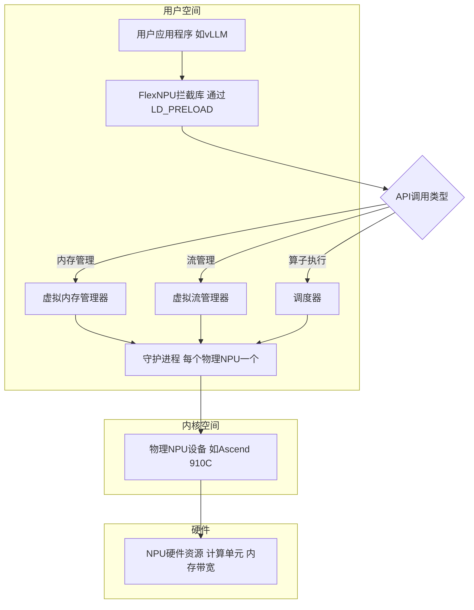
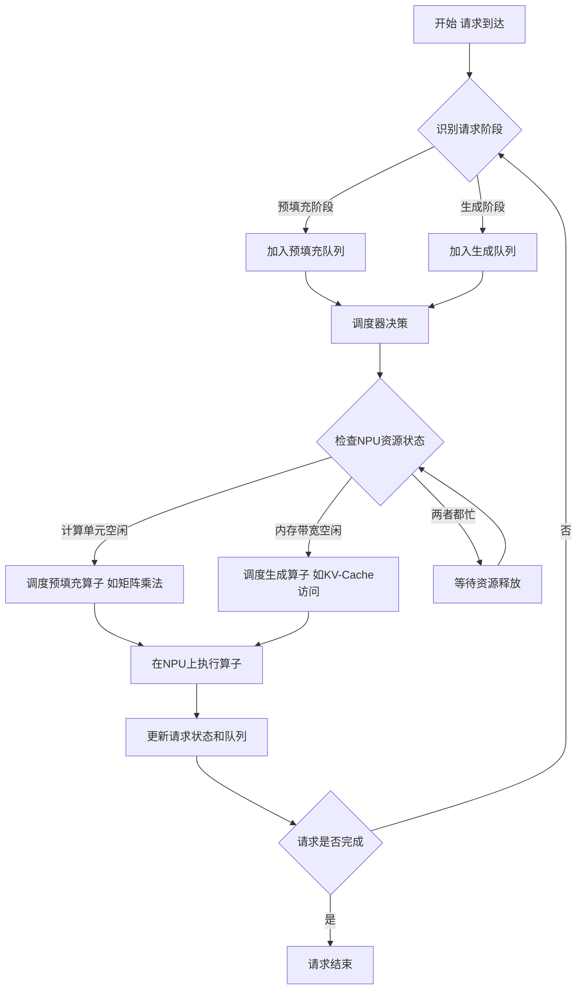
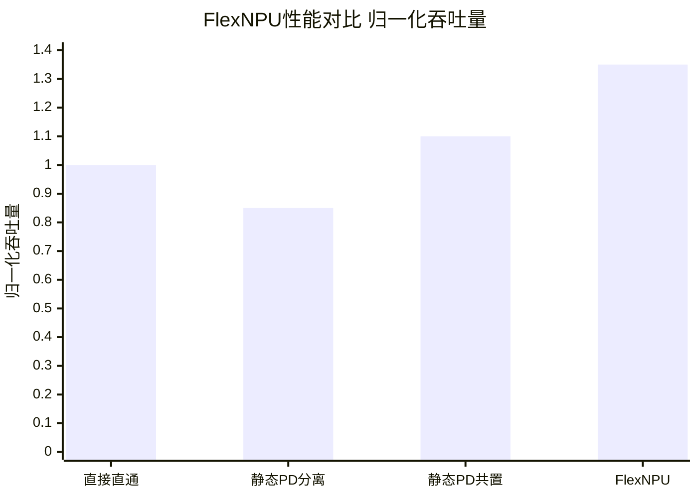

# FlexNPU: Transparent NPU Virtualization for Dynamic LLM Prefill-Decode Co-location

> 本文由 paper-daily 使用 DeepSeek 自动生成，仅供快速了解论文；关键结论请以原文为准。

[论文原文](https://arxiv.org/abs/2606.04415) · [PDF](https://arxiv.org/pdf/2606.04415) · [源文件](https://github.com/vsvnakers/paper-daily/blob/master/essay_read/2026-06-08/2606.04415.md)

> FlexNPU通过透明的用户空间虚拟化层，实现了NPU资源的动态、阶段感知调度，显著提升了LLM服务的效率和响应速度。

## 基本信息

| 属性 | 内容 |
|------|------|
| **作者** | Jiongjiong Gu, Jianfeng Wang, Zidong Han, Yongqiao Wang, Pengfei Xia, Mingjie Zhang, Hong Liu, Yuanyi Xia, Jiajia Chu, Yifeng Tang, Hui Zang, Xin Yao, Qijie Qiu, Yuzhao Wang, Chuanfei Xu, Lin Zhang, Zhuonan Lai, Hongming Huang, Jiawei Qiu, Gong Zhang, Zhong Ming, Weipeng Cao |
| **来源** | [arXiv:2606.04415](https://arxiv.org/abs/2606.04415) |
| **发布日期** | 2026-06-03 |
| **抓取领域** | LLM推理 · 服务与部署 |
| **学科方向** | 分布式系统 |
| **arXiv 分类** | cs.DC |
| **适用层次** | 进阶 |
| **标签** | NPU虚拟化, 大语言模型推理, 预填充-生成共置, 用户空间调度, 昇腾Ascend |
| **PDF** | [在线阅读](https://arxiv.org/pdf/2606.04415) |
| **代码仓库** | 暂无

---

## 问题的初衷（Why - 为什么要做这个研究）

【问题的初衷】当前，人工智能推理（AI Inference）和大语言模型（Large Language Model, LLM）服务越来越依赖神经网络处理器（Neural Processing Unit, NPU）来加速计算。然而，现有的NPU部署方式通常将物理设备直接暴露给上层应用，这种直通（Passthrough）模式虽然简单，但带来了严重的灵活性问题。首先，它限制了运行时对任务调度的控制能力，使得系统无法根据工作负载的阶段性行为（Phase-level Workload Behavior）动态调整执行策略。这个问题在LLM服务中尤为突出。LLM的推理过程包含两个截然不同的阶段：预填充阶段（Prefill Phase）和生成阶段（Decode Phase）。预填充阶段需要处理大量的输入Token，计算密集度高，对计算单元（如矩阵乘法单元）需求大；而生成阶段则是逐个Token自回归生成，其性能瓶颈主要在于内存带宽和键值缓存（Key-Value Cache, KV-Cache）的访问延迟。传统的静态预填充-生成分离（Static Prefill-Decode Disaggregation, 静态PD分离）方法虽然通过将两个阶段部署在不同的NPU上来避免相互干扰，但这种方法会导致资源分配不均（Resource Imbalance），例如，当请求的输入长度变化时，预填充NPU可能过载而生成NPU空闲，反之亦然。此外，静态分离还会引入不必要的数据移动（Unnecessary Data Movement），例如，预填充阶段产生的KV-Cache需要通过网络传输到生成阶段的NPU，增加了延迟和带宽开销。因此，迫切需要一种新的机制，能够在保持透明性的同时，实现对NPU资源的灵活、动态调度，以解决LLM服务中预填充和生成阶段的资源互补性问题。

---

## 问题的解决（What - 提出了什么方案）

【问题的解决】针对上述问题，论文提出了FlexNPU，一个透明的用户空间虚拟化层（Transparent User-space Virtualization Layer），专为华为昇腾（Ascend）NPU设计。其核心思路是在不修改模型代码、AI框架（如PyTorch）或NPU驱动的前提下，通过拦截AscendCL（Ascend Compute Language）API调用，实现对物理NPU的虚拟化和调度控制。FlexNPU的关键创新点在于：1）透明性（Transparency）：通过一个轻量级的拦截层，将上层应用（如vLLM）与物理NPU解耦，使得现有模型无需任何修改即可运行在虚拟化环境中。2）用户空间实现（User-space Implementation）：所有虚拟化逻辑都在用户空间完成，避免了内核模块的复杂性和不稳定性，易于部署和更新。3）阶段感知调度（Phase-aware Scheduling）：FlexNPU能够识别LLM推理请求的预填充和生成阶段，并利用它们互补的资源特性（计算密集 vs. 内存密集），实现动态的预填充-生成共置（Dynamic PD Co-location）。这意味着，同一个NPU可以同时处理来自不同请求的预填充和生成任务，通过精细的算子调度（Operator Dispatch）来最大化资源利用率，例如，在预填充请求等待计算时，插入生成请求的内存访问操作。与现有方法的本质区别在于，FlexNPU不是将物理NPU静态划分给不同阶段，而是在运行时动态地、细粒度地共享NPU资源，从而在避免干扰的同时，消除了资源不平衡和数据移动问题。

---

## 技术方法详解（How - 怎么实现的）

【技术方法详解】
- **用户空间API拦截与虚拟化层**：FlexNPU的核心是一个用户空间库，它通过动态链接劫持（LD_PRELOAD）技术，拦截所有对AscendCL API的调用。这个库充当了代理，将来自不同进程（如多个LLM服务实例）的API请求重定向到运行在后台的、每个物理NPU对应的守护进程（Daemon）。守护进程负责管理真实的NPU设备，并维护一个虚拟化对象表（Virtual Object Table），将虚拟的NPU资源（如内存、流Stream、事件Event）映射到物理资源。
- **虚拟化对象管理**：FlexNPU将NPU资源抽象为虚拟对象。例如，虚拟内存（Virtual Memory）通过守护进程管理，实际分配在物理NPU的HBM（High Bandwidth Memory）上。虚拟流（Virtual Stream）允许不同请求的任务在同一个物理流上交错执行，实现细粒度的并发。这种虚拟化机制使得多个逻辑上独立的LLM推理请求可以共享同一个物理NPU，而彼此之间互不知晓。
- **阶段感知的算子调度**：这是FlexNPU的核心调度策略。守护进程维护一个请求队列，其中每个请求被标记为“预填充”或“生成”阶段。调度器根据当前NPU的负载和资源利用率，动态决定下一个要执行的算子。例如，当NPU的计算单元（如Cube Unit）空闲时，优先调度预填充请求的矩阵乘法算子；当内存带宽成为瓶颈时，优先调度生成请求的KV-Cache访问算子。这种调度策略旨在最大化计算和内存带宽的并行度，实现资源的互补利用。
- **动态PD共置算法**：FlexNPU实现了一个基于优先级的动态共置算法。算法为每个请求维护一个优先级，该优先级基于请求的等待时间、阶段类型和系统负载动态调整。例如，为了满足服务等级协议（Service Level Agreement, SLA），可以给即将超时的生成请求更高的优先级。调度器在每次调度决策时，会从所有就绪的算子中选择优先级最高的一个执行，同时考虑资源亲和性，避免频繁的上下文切换。
- **零拷贝数据路径**：由于FlexNPU的虚拟化层位于用户空间，并且守护进程直接管理物理NPU内存，因此可以实现零拷贝（Zero-copy）的数据传输。当不同请求需要共享数据（如模型权重）时，守护进程可以直接映射同一块物理内存，避免了不必要的数据复制。这对于减少延迟和提高吞吐量至关重要。

## 系统架构图

## 方法流程图

## 核心公式与算法

【核心公式】
论文的核心在于调度策略，而非复杂的数学公式。其调度决策可以形式化为一个优化问题，目标是最大化系统吞吐量 $\text{Throughput}$ 并最小化平均TTFT。一个简化的调度优先级函数可以表示为：

$$\text{Priority}(r, t) = \alpha \cdot \text{PhaseWeight}(r) + \beta \cdot \text{WaitTime}(r, t) - \gamma \cdot \text{ResourceCost}(r, t)$$

其中，$r$ 代表一个请求，$t$ 是当前时间。$\text{PhaseWeight}(r)$ 是根据请求阶段（预填充或生成）赋予的权重，用于平衡两种类型的任务。$\text{WaitTime}(r, t)$ 是请求的等待时间，用于保证公平性和满足SLA。$\text{ResourceCost}(r, t)$ 是执行该请求下一个算子所需的资源成本（如计算时间或内存带宽），调度器倾向于选择资源成本低的算子来避免资源争抢。$\alpha$, $\beta$, $\gamma$ 是可调的超参数。

另一个关键指标是TTFT，其计算公式为：

$$\text{TTFT} = T_{submit} + T_{queue} + T_{prefill}$$

其中，$T_{submit}$ 是请求提交时间，$T_{queue}$ 是在调度队列中的等待时间，$T_{prefill}$ 是预填充阶段的实际执行时间。FlexNPU通过动态调度显著降低了 $T_{queue}$ 和 $T_{prefill}$（通过资源互补）。

---

## 应用场景（Where - 在哪落地）

【应用场景】
1. **云上LLM推理服务**：在云服务提供商（如华为云、阿里云）中，通常需要为大量用户提供多种LLM模型（如DeepSeek、Qwen）的推理服务。这些服务的请求模式高度动态，输入长度和输出长度变化极大。使用FlexNPU，云服务商可以在一个NPU集群上混合部署多个模型实例，并根据实时负载动态调整预填充和生成任务的资源分配。例如，当大量短输入请求涌入时，系统可以优先分配资源给生成阶段，快速响应用户；当有长文档分析请求时，则倾斜资源给预填充阶段。这不仅能提高集群的整体吞吐量，还能显著降低用户的TTFT，提升用户体验。
2. **边缘计算与端侧部署**：在资源受限的边缘设备或手机端部署LLM时，NPU资源尤为宝贵。FlexNPU的轻量级虚拟化层使得单块NPU可以同时服务于多个轻量级AI应用（如语音助手、实时翻译）。通过动态PD共置，系统可以在处理一个请求的预填充计算时，同时为另一个请求生成Token，从而充分利用NPU的计算和内存带宽，避免资源闲置。这对于需要低延迟响应的交互式应用至关重要。
3. **混合AI工作负载**：现代数据中心不仅运行LLM，还运行着各种传统AI模型（如图像分类、目标检测）。这些模型的推理过程也可能包含计算密集和内存密集的不同阶段。FlexNPU的通用虚拟化框架可以扩展到支持这些混合工作负载。通过定义不同模型的“阶段”特征，调度器可以跨模型进行资源协调，例如，在LLM的生成阶段（内存密集）穿插执行图像分类模型的计算密集型算子，实现更广泛的资源复用。

---

## 具体技术细节示例（How in Action - 算法如何执行）

【具体技术细节示例】
假设我们有一个Ascend 910C NPU，通过FlexNPU虚拟化。现在有两个LLM推理请求同时到达：
- **请求A**：预填充阶段，需要处理一个长度为1024的输入序列。其下一个要执行的算子是计算注意力分数（Attention Score），这是一个计算密集型操作，预计需要10个时间单位，且主要占用NPU的Cube计算单元。
- **请求B**：生成阶段，需要生成下一个Token。其下一个要执行的算子是读取KV-Cache并执行注意力计算，这是一个内存密集型操作，预计需要5个时间单位，且主要占用NPU的内存带宽和向量处理单元。

**执行步骤：**
1. **API拦截**：两个请求的AscendCL API调用被FlexNPU拦截库捕获，并转发给守护进程。
2. **阶段识别**：守护进程根据请求上下文（如是否已生成Token）识别出请求A为预填充阶段，请求B为生成阶段。
3. **入队**：请求A和请求B的算子描述被分别放入预填充队列和生成队列。
4. **调度决策**：调度器检查NPU资源状态。假设当前NPU的Cube单元空闲，但内存带宽被其他任务占用。调度器计算优先级：
   - 请求A的算子：计算密集型，适合利用空闲的Cube单元。
   - 请求B的算子：内存密集型，但当前内存带宽繁忙，执行效率会很低。
   因此，调度器选择优先调度请求A的算子。
5. **算子执行**：守护进程将请求A的注意力分数计算算子提交到物理NPU的流上执行。NPU的Cube单元开始工作。
6. **资源状态变化**：在请求A的算子执行过程中，内存带宽逐渐变得空闲。
7. **抢占与切换**：调度器检测到内存带宽空闲，且请求B的算子已经等待了3个时间单位。为了利用空闲的内存带宽，调度器决定暂停请求A的算子执行（如果硬件支持上下文切换）或等待其完成。假设它等待请求A的算子完成（10个时间单位后）。
8. **调度请求B**：请求A的算子完成后，调度器立即将请求B的KV-Cache读取算子提交执行。此时，内存带宽被充分利用。
9. **结果**：请求A的预填充阶段完成，其生成的KV-Cache被保存在NPU内存中。请求B成功生成了下一个Token。通过这种动态调度，NPU的计算和内存带宽都得到了有效利用，避免了单一资源成为瓶颈。

---

## 实验结果（Results - 效果如何）

【实验结果】论文在华为Ascend NPU集群上进行了大量实验。实验设置包括使用384张Ascend 910C NPU部署DeepSeek-R1模型，以及使用Qwen2.5-7B模型进行对比。主要对比方法包括：1）直接NPU直通（Direct NPU Passthrough），作为基线；2）静态PD分离（Static PD Disaggregation），将预填充和生成任务固定在不同的NPU上；3）静态PD共置（Static PD Co-location），将预填充和生成任务混合部署在相同NPU上，但无动态调度。关键实验结果如下：1）与直接NPU直通相比，FlexNPU在大多数场景下没有引入可测量的推理开销，甚至在某些场景下略微提升了吞吐量，证明了其透明性和低开销。2）在DeepSeek-R1模型上，与静态PD分离相比，FlexNPU将吞吐量提升了5.15%和26.33%（不同工作负载下）。3）在Qwen2.5-7B模型上，与静态PD共置相比，FlexNPU在保持相近吞吐量的同时，将首个Token生成时间（Time to First Token, TTFT）降低了超过92%，同时几乎不改变每个输出Token的生成时间（Token Per Output, TPOT）。这些结果充分证明了透明NPU虚拟化是实现高效、响应式LLM服务的实用基础。

## 实验结果可视化

---

## 优势与不足

【优势与不足】
**优势：**
1. **高度透明性**：无需修改模型代码、AI框架或NPU驱动，通过LD_PRELOAD即可实现，部署成本极低，兼容性好。
2. **显著的性能提升**：通过动态PD共置，有效解决了LLM服务中预填充和生成阶段的资源竞争问题，大幅降低了TTFT，同时保持了高吞吐量。
3. **用户空间实现**：所有虚拟化逻辑运行在用户空间，避免了内核模块开发的复杂性和安全风险，易于维护和更新。
4. **细粒度调度**：实现了算子级别的调度，能够根据NPU资源的实时状态（计算单元忙/闲，内存带宽忙/闲）做出最优决策，最大化资源利用率。

**潜在不足：**
1. **平台依赖性**：FlexNPU目前专为华为Ascend NPU和AscendCL API设计，其核心思想虽然通用，但具体实现需要针对不同厂商的NPU（如NVIDIA GPU的CUDA API）进行大量适配工作。
2. **调度策略的复杂性**：动态PD共置的调度策略依赖于对请求阶段的准确识别和资源状态的实时监控。在极端复杂的混合工作负载下，调度策略可能不够最优，甚至可能引入新的性能抖动。
3. **守护进程成为潜在瓶颈**：所有API调用都经过守护进程，虽然设计上力求轻量，但在高并发场景下，守护进程本身可能成为新的性能瓶颈。

---

## 相关工作

【相关工作】
1. **GPU虚拟化**：如NVIDIA的vGPU、AMD的MxGPU等。这些技术通常在内核层或硬件层实现，提供设备隔离，但灵活性和透明性不如FlexNPU的用户空间方案。
2. **LLM推理服务系统**：如vLLM、TensorRT-LLM、FasterTransformer等。这些系统专注于优化LLM推理的单个实例性能，但缺乏对跨实例、跨阶段的NPU资源动态调度能力。
3. **预填充-生成分离与共置**：如Splitwise、Sarathi等。这些工作探索了PD分离或共置的不同策略，但通常需要修改模型或框架，且调度粒度较粗（请求级别），不如FlexNPU的算子级调度灵活。
4. **用户空间网络与存储虚拟化**：如DPDK、SPDK。这些技术展示了在用户空间实现高性能I/O虚拟化的可行性，FlexNPU借鉴了其用户空间代理和零拷贝的思想。

---

## 未来研究方向

【未来方向】
1. **跨NPU的全局调度**：当前FlexNPU的调度是每个NPU守护进程独立进行的。未来可以扩展为全局调度器，协调多个NPU上的任务，实现更复杂的负载均衡和故障转移策略。
2. **支持更多NPU架构**：将FlexNPU的核心思想移植到其他NPU平台，如NVIDIA GPU（通过拦截CUDA API）和Google TPU（通过拦截PJRT API），使其成为一个通用的NPU虚拟化框架。
3. **与自动并行策略结合**：将FlexNPU的调度与模型并行策略（如张量并行、流水线并行）结合。调度器可以根据NPU间的拓扑结构和带宽，动态决定如何将模型的不同部分部署到不同的虚拟NPU上，实现更高效的分布式推理。

---

## 一句话总结

> FlexNPU通过透明的用户空间虚拟化层，实现了NPU资源的动态、阶段感知调度，显著提升了LLM服务的效率和响应速度。

---

*本解读由 DeepSeek AI 自动生成，仅供参考。*
