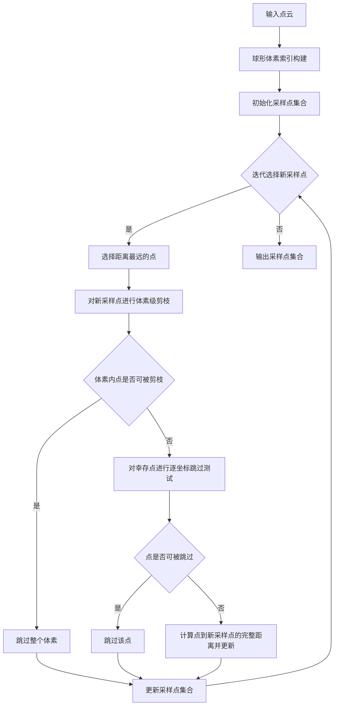
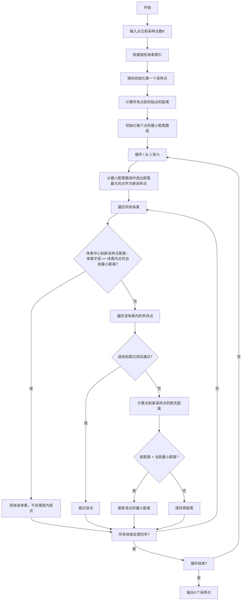
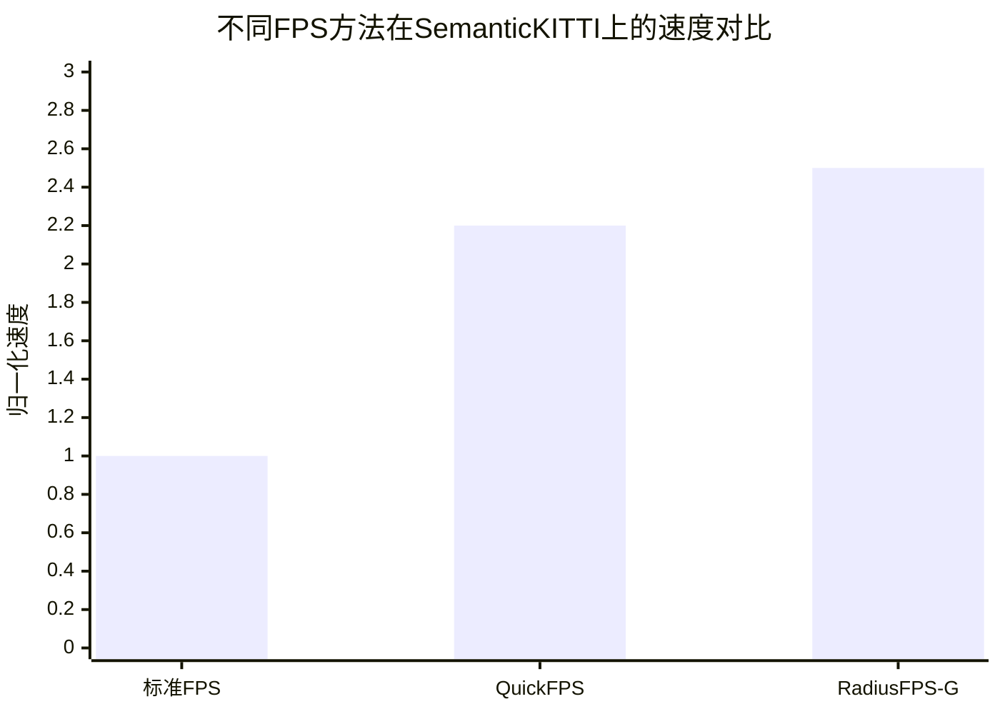

# RadiusFPS: Efficient Farthest Point Sampling on CPUs and GPUs via Spherical Voxel Pruning

> 本文由 paper-daily 使用 DeepSeek 自动生成，仅供快速了解论文；关键结论请以原文为准。

[论文原文](https://arxiv.org/abs/2606.06255) · [PDF](https://arxiv.org/pdf/2606.06255) · [源文件](https://github.com/vsvnakers/paper-daily/blob/master/essay_read/2026-06-08/2606.06255.md)

> RadiusFPS 通过球形体素剪枝，在不改变标准最远点采样结果的前提下，实现了高达 2.5 倍的 GPU 加速和更低的内存占用。

## 基本信息

| 属性 | 内容 |
|------|------|
| **作者** | Ziyang Yu, Xiang Li, Qiong Chang, Jun Miyazaki |
| **来源** | [arXiv:2606.06255](https://arxiv.org/abs/2606.06255) |
| **发布日期** | 2026-06-04 |
| **抓取领域** | LLM推理 · 模型压缩 |
| **学科方向** | 机器人 · 计算机视觉 · 分布式系统 |
| **arXiv 分类** | cs.RO, cs.CV, cs.DC |
| **适用层次** | 进阶 |
| **标签** | 最远点采样, 点云下采样, GPU加速, 球形体素剪枝, 实时机器人感知 |
| **PDF** | [在线阅读](https://arxiv.org/pdf/2606.06255) |
| **代码仓库** | 暂无

---

## 问题的初衷（Why - 为什么要做这个研究）

【问题的初衷】这篇论文旨在解决三维点云处理中一个核心但计算密集的操作——最远点采样（Farthest Point Sampling, FPS）的效率瓶颈问题。FPS 因其能够生成均匀覆盖点云几何结构的子集，而被广泛应用于激光雷达（LiDAR）自动驾驶、同步定位与地图构建（SLAM）和机器人导航等实时感知管线中。然而，经典 FPS 算法的时间复杂度为 $O(n^2)$，其中 $n$ 是点云数量。随着现代三维传感器（如 64 线或 128 线激光雷达）每秒产生数百万个点，FPS 的计算开销急剧增长，成为整个感知管线中主要的延迟瓶颈。现有方法要么试图用近似采样替代（如随机采样、基于学习的采样），但会牺牲 FPS 关键的均匀覆盖特性；要么尝试优化 FPS 本身，但往往在通用性（如依赖特定硬件）或加速效果上存在局限。因此，在保持 FPS 原始采样质量（即相同的初始化策略和打破平局策略）的前提下，大幅降低其计算复杂度，使其适用于实时、资源受限的机器人系统，是本文研究的核心动机。

---

## 问题的解决（What - 提出了什么方案）

【问题的解决】论文提出了 RadiusFPS，一个基于球形体素剪枝（Spherical Voxel Pruning）的 FPS 加速框架。其核心创新在于：在不改变标准 FPS 更新规则的前提下，通过一种保守的几何边界来剪枝掉大量冗余的距离计算。具体来说，RadiusFPS 首先将点云索引到球形体素（Spherical Voxels）中。在每次 FPS 迭代中，当一个新点被选为采样点时，算法不是计算所有剩余点到该新点的距离，而是利用球形体素结构推导出一个保守的几何边界。这个边界可以快速判断哪些体素内的所有点，其到新采样点的距离，都不可能小于它们当前到已选采样点集合的最小距离。这些体素内的点因此可以被安全地剪枝，无需进行昂贵的距离计算。此外，论文还引入了一个逐坐标的点跳过测试（Coordinate-wise Point-Skip Test），用于处理剪枝后剩余的少量点的残差更新。与现有方法（如 QuickFPS）通过改变采样规则来加速不同，RadiusFPS 严格保证了与标准 FPS 完全相同的输出结果，这是其与现有方法的本质区别。

---

## 技术方法详解（How - 怎么实现的）

【技术方法详解】
- **球形体素索引（Spherical Voxel Indexing）**：将点云空间划分为一系列球形体素。每个体素由一个中心点 $c$ 和半径 $r$ 定义。点云中的每个点被分配到其所属的体素中。这种索引结构为后续的几何剪枝提供了基础。
- **保守几何剪枝（Conservative Geometric Pruning）**：这是核心加速机制。在每次 FPS 迭代中，当新采样点 $p_{new}$ 被选出后，对于每个体素 $V$，算法计算体素中心 $c$ 到 $p_{new}$ 的距离 $d_{center}$。然后，利用体素半径 $r$，可以推导出体素内任何点 $p$ 到 $p_{new}$ 的距离 $d(p, p_{new})$ 的下界：$d(p, p_{new}) \geq d_{center} - r$。如果这个下界仍然大于或等于该体素内所有点当前的最小距离（即到已选采样点集合的最短距离），那么整个体素内的所有点都可以被安全地剪枝，无需更新它们的距离。
- **逐坐标点跳过测试（Coordinate-wise Point-Skip Test）**：对于经过体素级剪枝后，仍需要更新距离的“幸存”点，该测试进一步加速。它利用三角不等式，通过比较点到新采样点的各坐标轴分量差，来快速判断是否可能产生更小的距离。如果某个坐标轴上的差已经大于当前最小距离，则可以跳过该点的完整欧几里得距离计算。
- **RadiusFPS-G：Warp级 GPU 实现**：针对 GPU 架构进行了深度优化。它将体素选择、剪枝和距离更新融合到内存合并（memory-coalesced）的 CUDA 内核中。通过利用 warp 级（32线程为一组）的协作和共享内存（Shared Memory），避免了昂贵的全局内存（Global Memory）往返，从而在 GPU 上实现了显著的加速。
- **保持标准 FPS 输出**：RadiusFPS 的所有剪枝和跳过操作都是保守的，即它们只移除那些确定不会改变当前迭代中最小距离的点。因此，在相同的初始化和打破平局策略下，RadiusFPS 的输出与标准 FPS 完全一致。

## 系统架构图

## 方法流程图

## 核心公式与算法

【核心公式】
1. **体素级剪枝条件**：
   $$d(c, p_{new}) - r \geq \min_{p \in V} d(p, S)$$
   其中 $c$ 是体素中心，$r$ 是体素半径，$p_{new}$ 是新选出的采样点，$V$ 是体素，$S$ 是已选采样点集合。该不等式成立时，体素 $V$ 内的所有点都可以被安全剪枝。

2. **逐坐标跳过测试**：
   $$\max_{k \in \{x,y,z\}} |p_{new}[k] - p[k]| \geq \min_{s \in S} d(p, s)$$
   其中 $p$ 是待检查的点。如果点 $p$ 在任何一个坐标轴上的差都大于或等于其当前最小距离，那么计算完整欧氏距离不会得到更小的值，因此可以跳过。

---

## 应用场景（Where - 在哪落地）

【应用场景】
1. **自动驾驶中的实时点云处理**：在自动驾驶汽车中，激光雷达每秒产生大量点云数据。这些数据需要经过下采样（如 FPS）后，才能送入后续的目标检测、语义分割等神经网络。RadiusFPS 可以将 FPS 的延迟从数十毫秒降低到几毫秒，使得整个感知系统能够满足 10Hz 或更高的实时处理要求，同时不损失采样质量，这对于高速行驶的车辆安全至关重要。
2. **移动机器人的同步定位与地图构建（SLAM）**：在 SLAM 系统中，需要对连续帧的点云进行配准（如 ICP 算法）。FPS 常用于从每帧点云中提取关键点，以减少配准的计算量。RadiusFPS 的加速和低内存特性，使其非常适合部署在计算资源有限的移动机器人（如无人机、扫地机器人）上，实现更快速、更稳定的定位和建图。
3. **三维重建与场景理解**：在从多视角图像或深度传感器重建三维模型的过程中，需要对大量点云进行简化。RadiusFPS 能够快速生成均匀覆盖物体表面的点云子集，保留关键的几何特征，同时大幅缩短预处理时间，加速整个重建流程。

---

## 具体技术细节示例（How in Action - 算法如何执行）

【具体技术细节示例】
假设有一个二维点云（为简化，用二维代替三维），包含 6 个点：A(0,0), B(1,0), C(2,0), D(0,1), E(1,1), F(2,1)。我们需要从中采样 3 个点（K=3）。

**步骤1：构建球形体素**
我们将空间划分为 2 个球形体素：
- 体素 V1：中心 c1(0.5, 0.5)，半径 r1 = 0.8。包含点 A, B, D, E。
- 体素 V2：中心 c2(1.5, 0.5)，半径 r2 = 0.8。包含点 C, F。

**步骤2：初始化**
随机选择第一个采样点，假设为 A(0,0)。计算所有点到 A 的距离：
- d(B,A)=1, d(C,A)=2, d(D,A)=1, d(E,A)=√2≈1.414, d(F,A)=√5≈2.236
初始化每个点的最小距离数组 min_dist = [0, 1, 2, 1, 1.414, 2.236]。

**步骤3：第一次迭代（选择第二个点）**
从 min_dist 中选出距离最大的点，即 F(2,1)，距离为 2.236。

**步骤4：体素级剪枝**
新采样点为 F。遍历体素：
- **体素 V1**：中心 c1 到 F 的距离 d(c1, F) = √((1.5)^2 + (0.5)^2) ≈ 1.581。下界 = d(c1, F) - r1 = 1.581 - 0.8 = 0.781。V1 内点的当前最小距离（即到 A 的距离）最小为 0（A 本身），最大为 1.414（E）。下界 0.781 小于 V1 内点的最大当前最小距离 1.414，但大于最小当前最小距离 0。剪枝条件要求下界 >= 体素内所有点的当前最小距离。由于 A 的当前最小距离为 0，0.781 >= 0 成立，但我们需要检查是否所有点都满足？实际上，剪枝条件检查的是体素内点的当前最小距离的最大值？不，公式是 $\min_{p \in V} d(p, S)$，即体素内所有点当前最小距离的最小值。这里是 0（A点）。所以条件 0.781 >= 0 成立，因此整个 V1 可以被剪枝！这意味着 V1 内的所有点（A, B, D, E）都不需要更新它们到 F 的距离。
- **体素 V2**：中心 c2 到 F 的距离 d(c2, F) = √((0.5)^2 + (0.5)^2) ≈ 0.707。下界 = 0.707 - 0.8 = -0.093。下界为负数，显然小于 V2 内点的当前最小距离（C 为 2，F 为 2.236）。因此 V2 不能被剪枝。

**步骤5：逐坐标跳过测试**
对于 V2 内的幸存点 C 和 F（F 是刚选出的点，通常跳过），我们检查 C(2,0)。
- C 的当前最小距离是 2（到 A）。
- 逐坐标差：|2-2|=0, |0-1|=1。最大差为 1。
- 跳过条件：最大差 >= 当前最小距离？1 >= 2？不成立。所以不能跳过，需要计算完整距离 d(C, F) = 1。
- 新距离 1 < 当前最小距离 2，所以更新 C 的最小距离为 1。

**步骤6：更新并进入下一次迭代**
更新后的 min_dist = [0, 1, 1, 1, 1.414, 2.236]（注意 A 和 V1 内点未更新）。
现在选择第三个点，距离最大的是 F(2,1) 本身（2.236）或 E(1,1)（1.414）。由于 F 已被选为采样点，我们选择 E(1,1)。

**输出**：采样点为 A(0,0), F(2,1), E(1,1)。这与标准 FPS 的输出完全一致。

---

## 实验结果（Results - 效果如何）

【实验结果】论文在多个基准数据集上进行了评估，包括室内数据集 S3DIS 和 ScanNet，以及室外 LiDAR 数据集 SemanticKITTI。对比方法包括标准 FPS（GPU 实现）、QuickFPS 和 FastPoint 等。关键实验结果如下：1) **速度提升**：RadiusFPS-G（GPU 版本）相比标准 GPU FPS 实现了高达 2.5 倍的加速。2) **内存效率**：在所有评估方法中，RadiusFPS-G 的内存消耗约为 QuickFPS 的一半，同时速度与之相当或更快。3) **采样质量**：由于 RadiusFPS 保持了标准 FPS 的输出，其在下游任务（如点云分割）中的准确率与标准 FPS 完全一致，优于 QuickFPS 等近似方法。4) **端到端推理**：当 RadiusFPS 与学习型采样器 FastPoint 结合时，形成的管线在所有评估配置中实现了最快的端到端推理速度。

## 实验结果可视化

---

## 优势与不足

【优势与不足】
**优势：**
1. **无损加速**：RadiusFPS 在不改变标准 FPS 输出结果的前提下实现了显著加速，这是其最大的优势，保证了采样质量不受影响。
2. **通用性强**：该方法不依赖于特定的硬件或点云结构，可以应用于 CPU 和 GPU，具有很好的通用性。
3. **内存效率高**：其 GPU 实现 RadiusFPS-G 通过精心设计的内核，显著降低了内存占用，这对于内存受限的嵌入式系统尤为重要。
4. **易于集成**：由于保持了标准 FPS 的接口和输出，RadiusFPS 可以作为即插即用的模块替换现有管线中的 FPS 操作。

**潜在不足：**
1. **体素构建开销**：球形体素索引的构建本身需要一定的时间和内存开销。对于点云数量极小或迭代次数很少的场景，构建开销可能抵消剪枝带来的收益。
2. **对点云分布敏感**：剪枝效率高度依赖于点云的分布。对于分布极其不均匀的点云（如某些区域点极其稀疏），体素剪枝的效果可能会下降。

---

## 相关工作

【相关工作】
1. **标准最远点采样（Standard FPS）**：本文的基础和对比基线。经典算法，时间复杂度 $O(n^2)$。
2. **QuickFPS**：一种通过改变采样规则（如基于体素的近似采样）来加速 FPS 的方法。与本文不同，它牺牲了采样结果的精确性。
3. **基于学习的采样器（如 FastPoint, S-Net）**：使用神经网络学习点云采样策略。通常速度较快，但需要训练数据，且泛化性可能受限。本文展示了 RadiusFPS 可以与这类方法结合。
4. **体素化（Voxelization）与空间索引**：如八叉树（Octree）、KD树（KD-tree）等。本文的球形体素是一种专门为 FPS 剪枝设计的空间索引结构。
5. **GPU 上的距离计算优化**：利用 CUDA 的共享内存、warp shuffle 等特性优化距离计算，是本文 GPU 实现的技术基础。

---

## 未来研究方向

【未来方向】
1. **自适应体素划分**：研究如何根据点云的局部密度自适应地调整球形体素的大小和形状，以在点云稀疏区域减少体素构建开销，在密集区域提高剪枝效率。
2. **与其他采样策略结合**：探索 RadiusFPS 的剪枝思想是否可以应用于其他类型的采样算法，如基于密度或基于法向量的采样，以加速更广泛的点云处理流程。
3. **硬件特定优化**：针对特定的嵌入式 AI 芯片（如 NVIDIA Jetson、Google Edge TPU）进行更底层的算子融合和内存访问模式优化，进一步挖掘 RadiusFPS 在边缘设备上的性能潜力。

---

## 一句话总结

> RadiusFPS 通过球形体素剪枝，在不改变标准最远点采样结果的前提下，实现了高达 2.5 倍的 GPU 加速和更低的内存占用。

---

*本解读由 DeepSeek AI 自动生成，仅供参考。*
