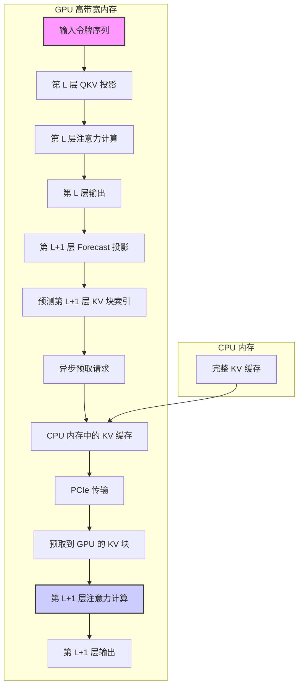
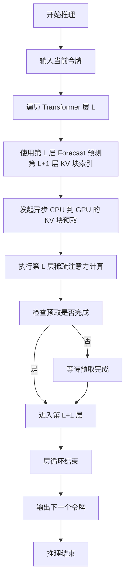
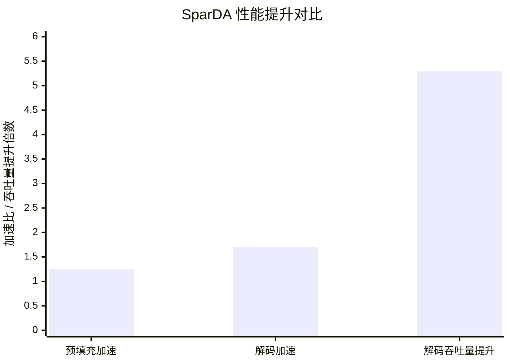

# SparDA: Sparse Decoupled Attention for Efficient Long-Context LLM Inference

> 本文由 paper-daily 使用 DeepSeek 自动生成，仅供快速了解论文；关键结论请以原文为准。

[论文原文](https://arxiv.org/abs/2606.04511) · [PDF](https://arxiv.org/pdf/2606.04511) · [源文件](https://github.com/vsvnakers/paper-daily/blob/master/essay_read/2026-06-09/2606.04511.md)

> SparDA 通过解耦的预测器实现前瞻性 KV 缓存预取，有效隐藏了长上下文 LLM 推理中的 PCIe 传输延迟。

## 基本信息

| 属性 | 内容 |
|------|------|
| **作者** | Yaosheng Fu, Guangxuan Xiao, Xin Dong, Song Han, Oreste Villa |
| **来源** | [arXiv:2606.04511](https://arxiv.org/abs/2606.04511) |
| **发布日期** | 2026-06-03 |
| **抓取领域** | GPU算子/编译优化 |
| **学科方向** | 自然语言处理 · 机器学习 |
| **arXiv 分类** | cs.CL, cs.LG |
| **适用层次** | 进阶 |
| **标签** | 稀疏注意力, KV缓存卸载, 长上下文推理, GPU优化, 预取 |
| **PDF** | [在线阅读](https://arxiv.org/pdf/2606.04511) |
| **代码仓库** | 暂无

---

## 问题的初衷（Why - 为什么要做这个研究）

【问题的初衷】大型语言模型（Large Language Model, LLM）在长上下文推理（Long-Context Inference）中面临严峻的效率和资源挑战。核心问题在于注意力机制（Attention Mechanism）的二次方复杂度 $O(T^2)$，其中 $T$ 是序列长度。稀疏注意力（Sparse Attention）通过只计算部分注意力权重来降低计算和内存带宽需求，是解决该问题的主流方向。然而，现有稀疏注意力方法存在两个关键瓶颈：第一，键值缓存（Key-Value Cache, KV Cache）的容量仍然随序列长度线性增长，当上下文极长时，KV Cache 无法完全容纳在 GPU 高带宽内存（High Bandwidth Memory, HBM）中，必须卸载（Offload）到 CPU 内存。这引入了通过 PCIe 总线进行数据传输的瓶颈，其延迟 $T_{transfer}$ 成为新的性能瓶颈。第二，稀疏选择（Sparse Selection）步骤本身，即确定哪些 KV 块是重要的，其复杂度仍为 $O(T^2)$，在长上下文场景下，这一步骤的计算开销甚至可能超过注意力计算本身，成为新的主导因素。因此，论文旨在解决这两个挑战：如何消除 PCIe 传输瓶颈，以及如何降低稀疏选择步骤的二次方复杂度。

---

## 问题的解决（What - 提出了什么方案）

【问题的解决】论文提出了一种名为 SparDA（Sparse Decoupled Attention）的解耦式稀疏注意力架构。其核心创新在于引入第四个每层投影（Per-Layer Projection），称为“预测器”（Forecast），与原有的查询（Query）、键（Key）、值（Value）并列。这个 Forecast 投影的作用是预测下一层（Next Layer）所需的 KV 块。通过这种“前瞻选择”（Lookahead Selection），系统可以在当前层执行注意力计算的同时，提前启动 CPU 到 GPU 的 KV 块预取（Prefetch），从而将数据传输时间 $T_{transfer}$ 与计算时间 $T_{compute}$ 重叠（Overlap），有效隐藏 PCIe 传输延迟。此外，由于 Forecast 与注意力查询（Attention Query）是解耦的，在分组查询注意力（Grouped Query Attention, GQA）的实现中，SparDA 为每个 GQA 组使用一个 Forecast 头（Head），而不是为每个注意力头都配备一个选择器。这显著降低了稀疏选择的计算开销，从 $O(T^2)$ 降低到 $O(T)$ 级别。与现有方法相比，SparDA 不是简单地优化现有稀疏选择算法，而是从根本上改变了计算与数据传输的依赖关系，并重构了稀疏选择的结构，使其更高效。

---

## 技术方法详解（How - 怎么实现的）

【技术方法详解】
- **解耦式稀疏注意力架构**：SparDA 在标准的 QKV 投影之外，新增了一个 Forecast 投影。该投影的输出用于预测下一层中哪些 KV 块是重要的。这使得稀疏选择与当前层的注意力计算解耦，允许并行执行。
- **前瞻选择与预取重叠**：在推理第 $l$ 层时，使用第 $l$ 层的 Forecast 头预测第 $l+1$ 层所需的 KV 块索引。然后，系统在计算第 $l$ 层注意力的同时，启动一个异步的 CPU-to-GPU 数据传输（DMA），将预测到的 KV 块从 CPU 内存预取到 GPU HBM。这实现了 $T_{compute}$ 和 $T_{transfer}$ 的重叠。
- **GQA 友好的分组预测**：在 GQA 架构中，多个查询头共享一组 KV 头。SparDA 为每个 GQA 组（而非每个查询头）分配一个 Forecast 头。这大大减少了 Forecast 头的数量，从而降低了稀疏选择步骤的计算量。例如，如果 GQA 的组数为 $g$，则 Forecast 头的数量为 $g$，远小于原始查询头的数量。
- **轻量级训练**：SparDA 仅新增了 Forecast 投影层的参数，其参数量增加不到模型总参数的 0.5%。训练过程仅更新 Forecast 投影的权重，通过最小化其预测的注意力分布与原始选择器（如基于 Top-K 的稀疏选择器）的注意力分布之间的差异（例如 KL 散度）来学习。模型的其他部分保持冻结。
- **稀疏预训练模型适配**：SparDA 设计为可以无缝集成到已有的稀疏预训练模型（如基于 StreamingLLM 或 H2O 训练的模型）中。它不改变模型的预训练权重，仅添加并训练 Forecast 投影，因此可以快速部署。

## 系统架构图

## 方法流程图

## 核心公式与算法

【核心公式】
1. **稀疏注意力计算**：
   $$\text{Attention}(Q, K, V) = \text{Softmax}\left(\frac{Q \cdot K_{\text{selected}}^T}{\sqrt{d_k}}\right) \cdot V_{\text{selected}}$$
   其中 $K_{\text{selected}}$ 和 $V_{\text{selected}}$ 是根据稀疏选择策略选出的 KV 块。SparDA 通过 Forecast 预测这些块。

2. **Forecast 投影的损失函数**：
   $$\mathcal{L}_{\text{Forecast}} = \text{KL}\left(\text{Selector}(Q, K) \parallel \text{Forecast}(H)\right)$$
   这里 $\text{Selector}(Q, K)$ 是原始稀疏选择器（如 Top-K）产生的注意力分布，$\text{Forecast}(H)$ 是 Forecast 投影根据隐藏状态 $H$ 预测的分布。KL 散度（Kullback-Leibler Divergence）用于最小化两者差异。

3. **总延迟模型**：
   $$T_{\text{total}} = \max(T_{\text{compute}}, T_{\text{transfer}})$$
   在 SparDA 中，通过预取重叠，总延迟 $T_{\text{total}}$ 由计算时间 $T_{\text{compute}}$ 和传输时间 $T_{\text{transfer}}$ 中的较大者决定，而非两者之和，从而实现了延迟隐藏。

---

## 应用场景（Where - 在哪落地）

【应用场景】
1. **长文档问答系统**：在需要处理数百页甚至数千页文档（如法律合同、医学报告、技术手册）的问答系统中，LLM 需要理解极长的上下文。SparDA 允许将完整的 KV 缓存卸载到 CPU 内存，同时通过预取保持 GPU 的高效计算，使得在消费级 GPU 上也能流畅运行长文档问答，显著降低延迟并提高吞吐量。
2. **代码库级代码生成与理解**：在处理整个大型代码仓库（如 Linux 内核）时，LLM 需要分析跨越数千个文件的代码。SparDA 能够高效地管理巨大的 KV 缓存，使得模型可以“记住”整个代码库的上下文，从而生成更准确、更符合项目规范的代码补全或重构建议。
3. **多轮对话与记忆增强系统**：在需要长期记忆的对话 AI 中，历史对话记录会不断累积，形成极长的上下文。SparDA 使得系统可以保留所有历史对话的 KV 缓存（卸载到 CPU），并在每轮对话中快速预取相关部分，实现真正的“无限”上下文对话，而不会因内存不足而丢失早期记忆。

---

## 具体技术细节示例（How in Action - 算法如何执行）

【具体技术细节示例】
假设一个 GQA 配置的 LLM，有 2 个 GQA 组（Group 0 和 Group 1）。当前正在推理第 $l$ 层，序列长度为 1024，KV 缓存被划分为 32 个块，每个块 32 个令牌。

**步骤 1：预测**
第 $l$ 层的 Forecast 投影（包含 2 个 Forecast 头，对应 2 个 GQA 组）接收第 $l$ 层的隐藏状态 $H_l$。对于 Group 0，Forecast 头 0 输出一个概率分布，表示第 $l+1$ 层中每个 KV 块的重要性。假设它预测块 5、12、20 和 28 是最重要的（Top-4）。类似地，Forecast 头 1 预测块 3、15、22 和 30。

**步骤 2：预取**
系统合并两个组的预测结果，得到需要预取的 KV 块集合：{3, 5, 12, 15, 20, 22, 28, 30}。然后，它发起一个异步 DMA 请求，将这些块从 CPU 内存传输到 GPU 的预取缓冲区。

**步骤 3：当前层计算**
在预取进行的同时，第 $l$ 层的注意力计算正常执行。它使用第 $l$ 层自己的稀疏选择器（例如，基于当前查询的 Top-K 选择）来选择 KV 块。假设它选择了块 {2, 5, 10, 15}。注意，块 5 和 15 与 Forecast 的预测重叠，但块 2 和 10 没有。这没关系，因为当前层的选择是独立的。

**步骤 4：下一层计算**
当第 $l$ 层计算完成，进入第 $l+1$ 层时，预取操作很可能已经完成。第 $l+1$ 层的注意力计算将使用第 $l$ 层 Forecast 预测的块 {3, 5, 12, 15, 20, 22, 28, 30} 作为其稀疏 KV 缓存。如果预测准确，这些块恰好是第 $l+1$ 层注意力所需的，则计算可以立即开始，无需等待 PCIe 传输。

**输出**：第 $l+1$ 层的注意力输出被计算出来，用于生成下一个令牌。整个过程展示了 SparDA 如何通过预测和预取，将 PCIe 传输时间隐藏在计算时间之后。

---

## 实验结果（Results - 效果如何）

【实验结果】论文在两个稀疏预训练的 8B 参数模型上进行了评估。实验设置包括长上下文基准测试，如 LongBench 和 RULER。对比方法包括：1) 非卸载的稀疏注意力基线（Non-offload Sparse Baseline），即 KV 缓存全部在 GPU 上；2) 卸载的稀疏注意力基线（Offload Sparse Baseline），即 KV 缓存卸载到 CPU，但无预取优化。关键实验结果：SparDA 在准确率上与基线方法持平或略有提升。在性能方面，SparDA 在预填充（Prefill）阶段实现了高达 1.25 倍的加速，在解码（Decode）阶段实现了高达 1.7 倍的加速，均优于卸载基线。更重要的是，通过允许在单个 GPU 上使用更大的批处理大小（Batch Size），SparDA 的解码吞吐量（Decode Throughput）相比非卸载稀疏基线提升了高达 5.3 倍。这证明了 SparDA 在长上下文场景下，通过隐藏 PCIe 传输延迟和降低稀疏选择开销，显著提升了推理效率。

## 实验结果可视化

---

## 优势与不足

【优势与不足】
**优势：**
1. **高效隐藏 PCIe 延迟**：通过前瞻预测和预取，成功将 KV 缓存卸载的传输延迟与计算时间重叠，是解决长上下文推理中内存墙问题的有效方案。
2. **降低稀疏选择复杂度**：通过 GQA 分组预测，将稀疏选择步骤的复杂度从 $O(T^2)$ 降低到 $O(T)$，消除了长上下文下的另一个计算瓶颈。
3. **轻量级且易于部署**：仅增加不到 0.5% 的参数，且训练过程仅微调新增的 Forecast 投影，可以快速适配现有的稀疏预训练模型。
**不足：**
1. **预测准确性依赖**：SparDA 的性能高度依赖于 Forecast 投影的预测准确性。如果预测不准确，导致预取的 KV 块并非下一层所需，则会造成缓存未命中（Cache Miss），反而增加延迟。
2. **额外训练开销**：虽然参数量小，但 Forecast 投影的训练仍然需要额外的数据和计算资源。对于没有稀疏预训练模型的场景，需要先进行稀疏预训练，增加了部署门槛。

---

## 相关工作

【相关工作】
1. **稀疏注意力机制（Sparse Attention）**：如 StreamingLLM、H2O、Scissorhands 等，它们通过丢弃不重要的 KV 对来减少计算和内存。SparDA 在此基础上增加了预取优化。
2. **KV 缓存卸载（KV Cache Offloading）**：如 FlexGen、InfiniGen 等，它们将 KV 缓存卸载到 CPU 或 SSD 以扩展上下文长度。SparDA 通过预取解决了卸载带来的 PCIe 瓶颈。
3. **推测性解码（Speculative Decoding）**：虽然目标不同，但 SparDA 的“预测未来”思想与推测性解码中“草稿模型预测未来令牌”有相似之处，都是通过预测来并行化或隐藏延迟。
4. **分组查询注意力（Grouped Query Attention, GQA）**：GQA 是 SparDA 架构的基础，SparDA 利用 GQA 的分组特性来高效实现 Forecast 头。

---

## 未来研究方向

【未来方向】
1. **自适应预测策略**：当前 Forecast 使用固定的 Top-K 策略。未来可以研究动态调整预测的 KV 块数量，根据当前层的计算负载和 PCIe 带宽状况，自适应地决定预取多少块，以更好地平衡计算和传输。
2. **跨层预测融合**：SparDA 目前只预测下一层。未来可以探索预测未来多层的 KV 块需求，实现更深度的预取，进一步隐藏延迟。这需要更复杂的预测模型，可能引入循环神经网络（RNN）或轻量级 Transformer。
3. **与稀疏注意力模式结合**：SparDA 的 Forecast 可以学习预测更复杂的稀疏注意力模式，如滑动窗口（Sliding Window）加全局令牌（Global Token）的混合模式，而不仅仅是 Top-K 块。这将使 SparDA 适用于更广泛的稀疏注意力变体。

---

## 一句话总结

> SparDA 通过解耦的预测器实现前瞻性 KV 缓存预取，有效隐藏了长上下文 LLM 推理中的 PCIe 传输延迟。

---

*本解读由 DeepSeek AI 自动生成，仅供参考。*
