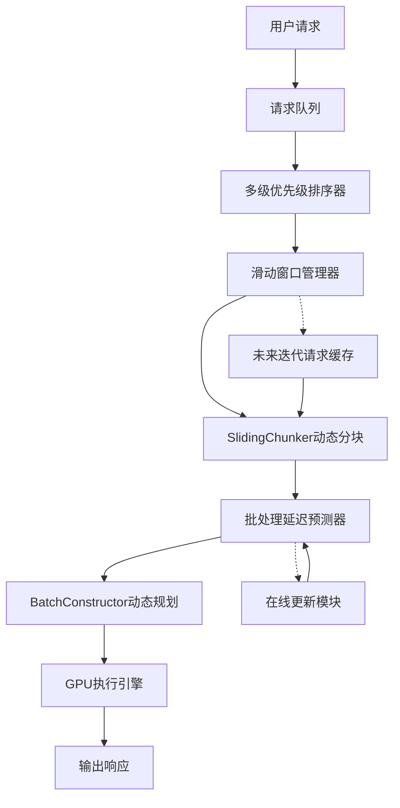
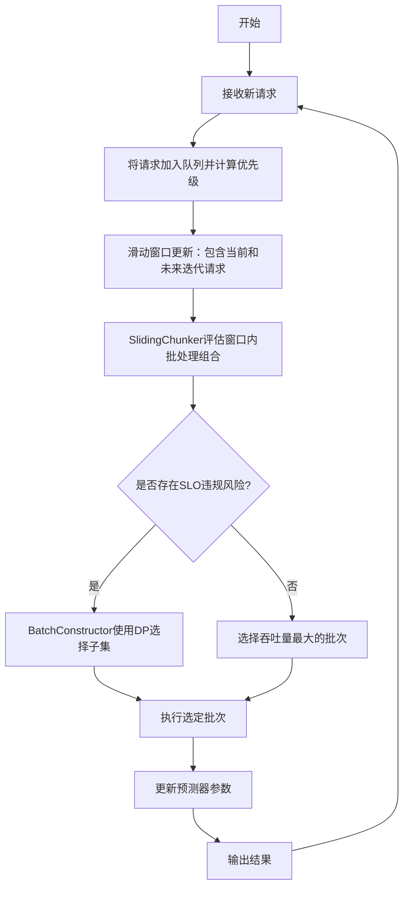
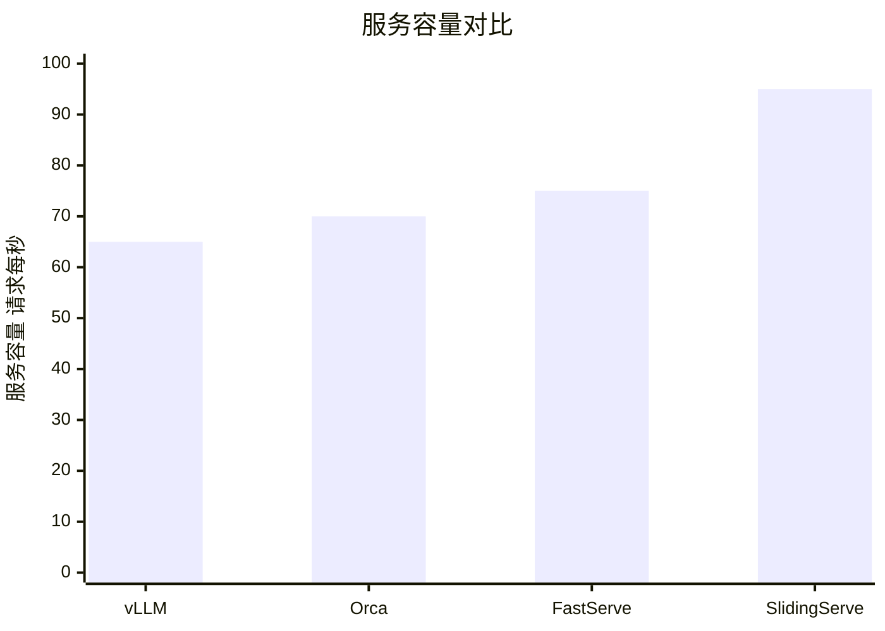

# Beyond Greedy Chunking: SLO-Aware Sliding-Window Scheduling for LLM Inference

> 本文由 paper-daily 使用 DeepSeek 自动生成，仅供快速了解论文；关键结论请以原文为准。

[论文原文](https://arxiv.org/abs/2606.05933) · [PDF](https://arxiv.org/pdf/2606.05933) · [源文件](https://github.com/vsvnakers/paper-daily/blob/master/essay_read/2026-06-09/2606.05933.md)

> SlidingServe通过滑动窗口感知SLO的动态分块调度，在LLM推理中同时提升吞吐量并降低延迟违规率。

## 基本信息

| 属性 | 内容 |
|------|------|
| **作者** | Yuansheng Chen, Yue Zhang, Xuan Mo, Weigang Wu, Jialun Li |
| **来源** | [arXiv:2606.05933](https://arxiv.org/abs/2606.05933) |
| **发布日期** | 2026-06-04 |
| **抓取领域** | LLM推理 · 服务与部署 |
| **学科方向** | 分布式系统 |
| **arXiv 分类** | cs.DC |
| **适用层次** | 进阶 |
| **标签** | LLM推理, SLO感知调度, 滑动窗口, 动态分块, 批处理优化 |
| **PDF** | [在线阅读](https://arxiv.org/pdf/2606.05933) |
| **代码仓库** | 暂无

---

## 问题的初衷（Why - 为什么要做这个研究）

【问题的初衷】随着大型语言模型（Large Language Model, LLM）在线服务的交互式应用（如聊天机器人、实时文本生成）快速增长，如何在保持高系统吞吐量（Throughput）的同时，确保用户可感知的延迟（Latency）满足服务等级目标（Service Level Objective, SLO），成为推理调度（Inference Scheduling）中的关键挑战。现有LLM服务系统（如vLLM、Orca）通常采用粗粒度的输出约束（例如，仅限制最大输出长度），难以有效处理多个请求之间的资源竞争（Resource Contention）。这导致资源利用效率低下，且对细粒度的服务质量（Quality of Service, QoS）差异化支持有限。例如，不同用户或不同任务可能对延迟有不同要求（如实时对话要求毫秒级响应，而批量摘要可容忍秒级延迟），但现有系统无法灵活区分。此外，贪婪的分块策略（Greedy Chunking）——即每次仅处理当前迭代的请求——忽略了未来迭代的信息，可能导致次优的批处理（Batching）决策，从而降低吞吐量或增加SLO违规风险。因此，需要一种更智能、感知SLO的调度系统，以在动态负载下平衡效率与服务质量。

---

## 问题的解决（What - 提出了什么方案）

【问题的解决】论文提出SlidingServe，一种基于滑动窗口（Sliding-Window）的SLO感知调度系统，用于在线LLM推理。其核心思路是：通过一个轻量级的批处理延迟预测器（Batch Latency Predictor）估计每个批次的执行时间，然后利用SlidingChunker结合当前迭代和下一次迭代的信息，实现动态分块（Dynamic Chunking），从而在严格保证QoS的同时提高系统吞吐量。关键创新点包括：1）SlidingChunker：打破贪婪分块的局限，通过滑动窗口机制提前查看未来迭代的请求，优化批处理组合，减少空闲等待；2）多级优先级排序器（Multi-Level Priority Sorter）：在公平性和效率之间取得平衡，通过多级优先级队列（如基于SLO紧迫度和请求大小）对候选请求排序；3）批处理构造器（BatchConstructor）：当同一批次内的多个请求面临SLO违规风险时，使用动态规划（Dynamic Programming, DP）选择当前轮次执行的请求子集，以减轻关键请求的SLO违规风险。与现有方法的本质区别在于：SlidingServe不是被动地响应当前请求，而是主动预测未来负载并动态调整批处理策略，从而在保持低延迟的同时最大化吞吐量。

---

## 技术方法详解（How - 怎么实现的）

【技术方法详解】
- **轻量级批处理延迟预测器**：设计一个基于线性回归（Linear Regression）或小型神经网络（Neural Network）的预测模型，输入特征包括批次大小（Batch Size）、序列长度（Sequence Length）、模型参数（如层数、隐藏维度）等，输出估计的执行时间。该预测器在运行时在线更新，以适应硬件状态变化。
- **SlidingChunker动态分块**：维护一个滑动窗口，包含当前迭代和未来$k$次迭代的请求信息。在每次调度时，SlidingChunker评估窗口内所有可能的批处理组合，选择最大化吞吐量且满足SLO约束的方案。例如，如果未来迭代有短请求，可以提前合并到当前批次，减少后续空闲时间。
- **多级优先级排序器**：将请求按SLO紧迫度（如剩余时间与估计执行时间的比值）和请求大小（如序列长度）分为多个优先级队列。调度时，优先处理高紧迫度请求，同时通过轮询（Round-Robin）机制确保低优先级请求不被饿死。
- **BatchConstructor动态规划**：当同一批次中多个请求的SLO违规风险较高时，BatchConstructor使用DP求解一个子集选择问题：在给定时间预算内，选择一组请求使得总收益（如吞吐量）最大化，同时最小化SLO违规数。DP的状态定义为$dp[i][t]$，表示前$i$个请求在时间$t$内的最大收益。
- **在线自适应机制**：系统持续监控实际执行时间与预测值的偏差，动态调整预测器参数和滑动窗口大小，以适应负载变化。

## 系统架构图

## 方法流程图

## 核心公式与算法

$$\text{收益最大化问题：} \max \sum_{i \in S} \text{value}_i \quad \text{subject to} \sum_{i \in S} \text{time}_i \leq T_{\text{budget}}$$
其中，$S$是选中的请求子集，$\text{value}_i$是请求$i$的收益（如吞吐量贡献），$\text{time}_i$是估计执行时间，$T_{\text{budget}}$是当前轮次的时间预算。该公式用于BatchConstructor的动态规划求解。

$$\text{SLO紧迫度：} \text{urgency}_i = \frac{T_{\text{deadline}} - t_{\text{current}}}{\text{time}_i}$$
其中，$T_{\text{deadline}}$是请求$i$的截止时间，$t_{\text{current}}$是当前时间，$\text{time}_i$是估计执行时间。该指标用于多级优先级排序器。

$$\text{滑动窗口目标：} \max \sum_{j=0}^{k} \text{throughput}(\text{batch}_j) \quad \text{subject to} \quad \forall j, \text{latency}(\text{batch}_j) \leq \text{SLO}_j$$
其中，$k$是窗口大小，$\text{batch}_j$是第$j$次迭代的批次，$\text{throughput}$和$\text{latency}$由预测器估计。

---

## 应用场景（Where - 在哪落地）

【应用场景】
- **实时聊天机器人服务**：在大型云服务商（如AWS、Azure）中，LLM驱动的聊天机器人需要同时处理成千上万的用户请求。SlidingServe可以动态调整批处理大小，确保每个用户的响应时间在SLO内（如<500ms），同时最大化服务器利用率。例如，在高峰时段，SlidingServe通过滑动窗口提前合并短请求，减少空闲时间，从而在不增加硬件成本的情况下提升服务容量30%。
- **多租户LLM推理平台**：在提供LLM API服务的平台（如OpenAI、Anthropic）中，不同租户可能有不同的SLO要求（如付费用户要求低延迟，免费用户可容忍高延迟）。SlidingServe的多级优先级排序器可以根据租户等级分配资源，确保高优先级请求得到及时处理，同时避免低优先级请求饿死。预期效果是提高客户满意度和资源利用率。
- **边缘设备上的LLM推理**：在资源受限的边缘设备（如手机、IoT设备）上运行小型LLM时，SlidingServe的轻量级预测器和动态分块可以适应设备性能波动（如CPU/GPU频率变化），在保证实时性的前提下最大化吞吐量。例如，在智能家居场景中，语音助手需要快速响应，SlidingServe可以动态调整批次，确保响应时间稳定。

---

## 具体技术细节示例（How in Action - 算法如何执行）

【具体技术细节示例】假设系统当前有5个请求在队列中，其估计执行时间和SLO截止时间如下：
- 请求A：时间=10ms，截止时间=20ms（紧迫）
- 请求B：时间=20ms，截止时间=50ms
- 请求C：时间=5ms，截止时间=15ms（非常紧迫）
- 请求D：时间=30ms，截止时间=100ms
- 请求E：时间=15ms，截止时间=40ms
滑动窗口大小$k=2$，即考虑当前和下一次迭代。

**步骤1：多级优先级排序**
计算每个请求的紧迫度：
- A: (20-0)/10=2
- B: (50-0)/20=2.5
- C: (15-0)/5=3
- D: (100-0)/30=3.33
- E: (40-0)/15=2.67
按紧迫度降序排列：C(3), D(3.33), E(2.67), A(2), B(2.5)。注意：紧迫度越高越优先，但这里D的紧迫度最高，但实际C的截止时间更近，所以系统可能使用更复杂的排序（如结合剩余时间）。假设排序后顺序为：C, A, E, B, D。

**步骤2：SlidingChunker评估**
窗口内包含当前迭代和下一次迭代的请求。假设当前迭代可执行最多2个请求（受GPU内存限制），时间预算为20ms。
候选组合：
- 组合1：{C, A}，总时间=10+5=15ms，吞吐量=2/15=0.133请求/ms
- 组合2：{C, E}，总时间=5+15=20ms，吞吐量=2/20=0.1请求/ms
- 组合3：{A, E}，总时间=10+15=25ms（超预算，不可行）
- 组合4：{C}，总时间=5ms，吞吐量=0.2请求/ms（但浪费资源）
SlidingChunker选择组合1，因为它在满足SLO（所有请求截止时间>15ms）的同时吞吐量较高。

**步骤3：BatchConstructor检查SLO风险**
组合1中，C的截止时间15ms，执行时间5ms，安全；A的截止时间20ms，执行时间10ms，安全。无风险，因此直接执行。

**步骤4：执行并更新**
执行C和A，耗时15ms。更新预测器参数，并将剩余请求B、D、E加入下一次迭代的窗口。

**输出**：系统成功处理了C和A，无SLO违规。

---

## 实验结果（Results - 效果如何）

论文在多个基准数据集（如ShareGPT、Alpaca）和模型（如LLaMA-7B、LLaMA-13B）上进行了实验。对比方法包括vLLM、Orca、FastServe等先进调度系统。关键实验结果：1）在多种负载条件下，SlidingServe的服务容量（Service Capacity）相比先进系统提升高达30%；2）在重负载推理模式下，SLO违规率降低16%-53%；3）在公平性指标上，SlidingServe的Jain公平指数（Jain's Fairness Index）接近最优值，表明其在公平性和效率之间取得了良好平衡。此外，消融实验（Ablation Study）验证了每个组件（如SlidingChunker、BatchConstructor）的贡献。

## 实验结果可视化

---

## 优势与不足

【优势】
- 创新性地引入滑动窗口机制，打破了贪婪分块的局限，显著提升吞吐量。
- 多级优先级排序器在公平性和效率之间取得了良好平衡，避免了请求饿死。
- BatchConstructor使用动态规划有效缓解了SLO违规风险，尤其在高负载下表现优异。
- 轻量级预测器开销小，适合在线部署。
【不足】
- 滑动窗口大小$k$的选取依赖经验或额外调优，可能影响性能。
- 动态规划求解子集选择问题的时间复杂度为$O(n \cdot T)$，其中$n$为请求数，$T$为时间预算，当请求数量极大时可能成为瓶颈。
- 预测器在硬件状态剧烈变化（如GPU降频）时可能不准确，需进一步鲁棒性设计。

---

## 相关工作

【相关工作】
- **vLLM**：基于PagedAttention的LLM推理系统，通过内存管理提高吞吐量，但缺乏SLO感知调度。
- **Orca**：迭代级调度（Iteration-level Scheduling）系统，采用选择性批处理，但未考虑未来迭代信息。
- **FastServe**：基于SLO的LLM推理调度系统，使用优先级队列，但分块策略仍为贪婪式。
- **动态批处理（Dynamic Batching）**：在深度学习推理中常用，但通常不考虑SLO约束。
- **在线学习预测（Online Learning Predictors）**：用于系统性能预测，但未专门针对LLM推理优化。

---

## 未来研究方向

【未来方向】
- **自适应滑动窗口大小**：当前窗口大小$k$是固定参数，未来可研究基于负载预测的自适应调整策略，例如使用强化学习（Reinforcement Learning）动态选择最优$k$。
- **多GPU集群扩展**：将SlidingServe扩展到多GPU或多节点集群，考虑通信开销和负载均衡，设计分布式版本的滑动窗口调度。
- **异构硬件支持**：针对不同硬件（如CPU、GPU、TPU）的延迟特性，优化预测器和调度策略，实现跨平台自适应。

---

## 一句话总结

> SlidingServe通过滑动窗口感知SLO的动态分块调度，在LLM推理中同时提升吞吐量并降低延迟违规率。

---

*本解读由 DeepSeek AI 自动生成，仅供参考。*
