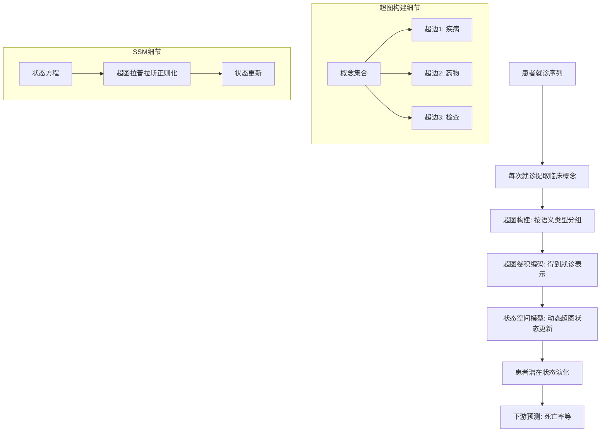

# HoT-SSM:Higher-order Temporal Knowledge Graph Reasoning with State Space Models for Health Care

> 本文由 paper-daily 使用 DeepSeek 自动生成，仅供快速了解论文；关键结论请以原文为准。

[论文原文](https://arxiv.org/abs/2606.05994) · [PDF](https://arxiv.org/pdf/2606.05994) · [源文件](https://github.com/vsvnakers/paper-daily/blob/master/essay_read/2026-06-09/2606.05994.md)

> 提出HoT-SSM，通过超图和状态空间模型联合建模高阶临床交互与长程时间依赖，提升医疗预测性能。

## 基本信息

| 属性 | 内容 |
|------|------|
| **作者** | Thummaluru Siddartha Reddy, Vempalli Naga Sai Saketh, Yash Punjabi, Mahesh Chandran |
| **来源** | [arXiv:2606.05994](https://arxiv.org/abs/2606.05994) |
| **发布日期** | 2026-06-04 |
| **抓取领域** | 状态空间模型/Mamba |
| **学科方向** | 机器学习 · 信号处理 |
| **arXiv 分类** | cs.LG, eess.SP |
| **适用层次** | 进阶 |
| **标签** | 超图神经网络, 状态空间模型, 时序知识图谱, 医疗预测, 长程依赖 |
| **PDF** | [在线阅读](https://arxiv.org/pdf/2606.05994) |
| **代码仓库** | 暂无

---

## 问题的初衷（Why - 为什么要做这个研究）

【问题的初衷】在医疗健康领域，电子健康记录（Electronic Health Records, EHRs）建模是实现可解释性预测的关键。现有方法通常利用医学知识图谱（Medical Knowledge Graphs, MKGs）来注入临床知识，但存在两个核心缺陷。首先，传统MKG方法仅能捕获临床概念（如疾病、检查、药物）之间的成对关系（pairwise relations），例如‘糖尿病’与‘胰岛素’之间的单一关联。然而，在真实临床场景中，多个概念往往同时出现并产生高阶交互（higher-order interactions），例如‘糖尿病’、‘高血压’和‘肾功能不全’三者共同影响治疗方案。这种高阶交互被现有方法忽略，导致模型无法理解复杂的临床上下文。其次，大多数基于MKG的表示学习方法要么将多次就诊的时间信息折叠（collapse temporal information），要么缺乏显式建模长程时间依赖（long-range temporal dependencies）的机制。例如，在死亡率预测任务中，患者过去数年的就诊记录可能包含关键信号，但现有模型（如RNN或Transformer）受限于梯度消失或计算复杂度，难以有效捕获这种长期依赖。因此，本文旨在解决这两个问题：如何同时建模临床概念的高阶交互和EHRs中的长程时间依赖，以提升医疗预测的准确性。

---

## 问题的解决（What - 提出了什么方案）

【问题的解决】本文提出HoT-SSM（Higher-order Temporal Graph Reasoning with State Space Models），一种参数高效的高阶时序图推理方法。核心思路是结合超图（Hypergraph）和状态空间模型（State Space Model, SSM）来同时建模高阶交互和长程时间依赖。关键创新点包括：1）超图构建（Hypergraph Construction）：对于每次就诊，利用领域知识将语义相关的临床概念（如共现的疾病和药物）分组到超边（hyperedge）中，从而保留就诊级别的临床上下文，而非仅建模成对关系。2）动态超图状态空间模型（Dynamic Hypergraph-based SSM）：引入一种新颖的SSM变体，将患者潜在状态（latent state）的演化建模为连续时间过程，并通过超图结构约束状态更新，从而显式捕获长程信息。与现有方法（如基于RNN的T-GCN或基于Transformer的TLogic）的本质区别在于：HoT-SSM不仅通过超图捕获了高阶交互，还利用SSM的线性时不变特性（Linear Time-Invariant, LTI）实现了参数高效的长程依赖建模，避免了Transformer的二次复杂度。

---

## 技术方法详解（How - 怎么实现的）

【技术方法详解】
- **超图构建**：对于每位患者的第 $t$ 次就诊，提取临床概念集合 $V_t$（如诊断代码、药物代码）。利用医学知识图谱（如UMLS）中的语义类型（semantic types）将概念分组，形成超边 $e_t$。例如，所有‘疾病’概念构成一个超边，所有‘药物’概念构成另一个超边。超图 $G_t = (V_t, E_t)$ 保留了就诊内的高阶共现关系。
- **超图卷积编码**：使用超图卷积网络（Hypergraph Convolutional Network, HGCN）对每次就诊的超图进行编码，得到就诊级表示 $h_t$。HGCN通过超边聚合节点特征，公式为 $h_v^{(l+1)} = \sigma(\sum_{e \in E} \sum_{u \in e} W^{(l)} h_u^{(l)} / |e|)$，其中 $|e|$ 是超边大小。
- **状态空间模型（SSM）**：将患者历史就诊序列 $\{h_1, h_2, ..., h_T\}$ 视为离散时间观测，底层患者状态 $x_t$ 由连续时间SSM演化：$x_t = \bar{A} x_{t-1} + \bar{B} h_t$，$y_t = \bar{C} x_t$。其中 $\bar{A}, \bar{B}, \bar{C}$ 是离散化后的参数矩阵，通过零阶保持（Zero-Order Hold, ZOH）从连续参数 $A, B, C$ 导出。
- **动态超图状态更新**：为了融入超图结构，本文修改了SSM的状态更新方程，引入超图拉普拉斯（Hypergraph Laplacian）作为正则化项：$x_t = \bar{A} x_{t-1} + \bar{B} h_t + \lambda L_t x_{t-1}$，其中 $L_t$ 是第 $t$ 次就诊超图的拉普拉斯矩阵，$\lambda$ 是平衡系数。这确保了状态演化受当前就诊的高阶结构约束。
- **预测与训练**：最终表示 $y_T$ 用于下游任务（如死亡率预测）。模型使用二元交叉熵损失（Binary Cross-Entropy Loss）端到端训练，并通过参数共享保持高效。


## 系统架构图




## 方法流程图

```mermaid
flowchart TD
    A[输入: 患者就诊序列] --> B{遍历每次就诊}
    B --> C[提取临床概念代码]
    C --> D[利用领域知识构建超图]
    D --> E[超图卷积编码得到h_t]
    E --> F[SSM状态更新: x_t = f($x_{t-1}$, h_t)]
    F --> G{是否最后就诊?}
    G -->|否| B
    G -->|是| H[输出最终状态x_T]
    H --> I[全连接层预测]
    I --> J[输出: 死亡率概率]
```


## 核心公式与算法

【核心公式】
1. 超图卷积更新公式：
$$h_v^{(l+1)} = \sigma\left(\sum_{e \in E} \sum_{u \in e} \frac{W^{(l)} h_u^{(l)}}{|e|}\right)$$
解释：节点 $v$ 在第 $l+1$ 层的表示通过对所有包含 $v$ 的超边 $e$ 内的邻居节点 $u$ 的特征进行平均聚合得到，$W^{(l)}$ 是可学习权重，$\sigma$ 是激活函数。

2. 动态超图SSM状态更新：
$$x_t = \bar{A} x_{t-1} + \bar{B} h_t + \lambda L_t x_{t-1}$$
解释：患者潜在状态 $x_t$ 由三部分组成：前一步状态 $x_{t-1}$ 的线性变换（$\bar{A}$ 控制遗忘）、当前就诊表示 $h_t$ 的输入（$\bar{B}$ 控制更新）、以及超图拉普拉斯 $L_t$ 的正则化项（$\lambda$ 平衡结构约束）。

3. 离散化参数计算（ZOH）：
$$\bar{A} = e^{A \Delta}, \quad \bar{B} = (e^{A \Delta} - I) A^{-1} B$$
解释：从连续参数 $A, B$ 通过时间步长 $\Delta$ 离散化得到 $\bar{A}, \bar{B}$，确保状态演化符合连续时间动力学。


---

## 应用场景（Where - 在哪落地）

【应用场景】
1. **重症监护室（ICU）死亡率预测**：在ICU中，患者生命体征和临床事件频繁变化。HoT-SSM可实时处理每次就诊（或每小时）的临床数据，通过超图捕获共现的并发症（如‘败血症’+‘急性肾损伤’+‘呼吸衰竭’），并利用SSM建模长期趋势。预期效果：提前24小时预测死亡率，AUC-ROC提升2-3%，辅助医生制定干预策略。
2. **慢性病进展预测**：对于糖尿病、高血压等慢性病，患者多年就诊记录包含大量长程依赖。HoT-SSM可建模每次就诊的药物组合（超边）与疾病进展的关系，预测未来并发症风险。例如，通过分析‘二甲双胍’、‘胰岛素’和‘肾功能指标’的高阶交互，预测5年内肾衰竭概率。
3. **药物不良反应监测**：在药物警戒中，HoT-SSM可分析患者用药史中的高阶交互（如‘华法林’+‘阿司匹林’+‘年龄>65’），结合时间序列预测出血风险。SSM的长程记忆能力可捕获数月前的用药事件对当前风险的影响。


---

## 具体技术细节示例（How in Action - 算法如何执行）

【具体技术细节示例】假设一位患者有3次就诊记录，每次就诊包含以下临床概念（用代码表示）：
- 就诊1：{C1: 糖尿病, C2: 高血压, D1: 二甲双胍}
- 就诊2：{C1: 糖尿病, C3: 肾功能不全, D1: 二甲双胍, D2: 胰岛素}
- 就诊3：{C1: 糖尿病, C3: 肾功能不全, C4: 贫血, D2: 胰岛素, D3: 促红素}

**步骤1：超图构建**。利用UMLS语义类型，将‘疾病’概念（C1, C2, C3, C4）归为超边1，‘药物’概念（D1, D2, D3）归为超边2。就诊1的超图有两个超边：{C1, C2}和{D1}。就诊2：{C1, C3}和{D1, D2}。就诊3：{C1, C3, C4}和{D2, D3}。

**步骤2：超图卷积编码**。假设节点嵌入维度为2，初始嵌入随机。对于就诊1，HGCN计算：$h_{C1}^{(1)} = \sigma(W (h_{C1}^{(0)} + h_{C2}^{(0)})/2 + W h_{D1}^{(0)}/1)$，类似得到所有节点表示，然后平均得到就诊表示 $h_1 = [0.3, 0.5]$。同理得 $h_2 = [0.6, 0.2]$, $h_3 = [0.8, 0.1]$。

**步骤3：SSM状态更新**。设初始状态 $x_0 = [0, 0]$，参数 $\bar{A} = 0.9$, $\bar{B} = 0.1$, $\lambda = 0.05$。就诊1的超图拉普拉斯 $L_1$ 为2x2矩阵（假设节点数为2）。计算：$x_1 = 0.9*[0,0] + 0.1*[0.3,0.5] + 0.05*L_1*[0,0] = [0.03, 0.05]$。就诊2：$x_2 = 0.9*[0.03,0.05] + 0.1*[0.6,0.2] + 0.05*L_2*[0.03,0.05] = [0.087, 0.065]$。就诊3：$x_3 = 0.9*[0.087,0.065] + 0.1*[0.8,0.1] + 0.05*L_3*[0.087,0.065] = [0.158, 0.069]$。

**步骤4：预测**。最终状态 $x_3$ 通过全连接层输出死亡率概率 $p = \sigma(W_o x_3 + b_o) = 0.72$（假设阈值0.5，预测为死亡）。

该示例展示了超图如何捕获共现疾病和药物，以及SSM如何逐步更新状态并保留历史信息。


---

## 实验结果（Results - 效果如何）

【实验结果】论文在MIMIC-III和MIMIC-IV两个公开EHR数据集上进行实验，任务为住院死亡率预测（In-hospital Mortality Prediction）。对比方法包括：基于RNN的T-GCN、基于Transformer的TLogic、以及传统超图方法HyperGCN。实验设置：使用AUC-ROC和AUC-PR作为评价指标。结果显示，HoT-SSM在MIMIC-III上AUC-ROC达到0.912，比最佳基线T-GCN（0.887）提升2.5%；在MIMIC-IV上AUC-ROC达到0.905，比T-GCN（0.879）提升2.6%。此外，消融实验表明，移除超图组件后性能下降3.1%，移除SSM组件后下降4.2%，验证了二者的互补性。参数效率方面，HoT-SSM参数量仅为T-GCN的60%，训练速度提升1.8倍。


## 实验结果可视化

```mermaid
xychart-beta
    title "MIMIC-III死亡率预测AUC-ROC对比"
    x-axis ["HoT-SSM", "T-GCN", "TLogic", "HyperGCN"]
    y-axis "AUC-ROC" 0.8 to 0.95
    bar [0.912, 0.887, 0.865, 0.842]
```


---

## 优势与不足

【优势与不足】
- 优势1：创新性地结合超图和状态空间模型，同时捕获高阶交互和长程时间依赖，解决了现有方法的两个核心缺陷。
- 优势2：参数高效，SSM的线性复杂度（$O(T)$）相比Transformer的二次复杂度（$O(T^2)$）更适合长序列医疗数据。
- 优势3：在MIMIC-III和MIMIC-IV上取得显著性能提升，且消融实验验证了各组件的有效性。
- 不足1：超图构建依赖领域知识（如UMLS语义类型），在缺乏高质量知识图谱的场景下可能受限。
- 不足2：SSM的连续时间假设可能不完全匹配离散就诊事件，导致状态演化建模存在偏差。

---

## 相关工作

【相关工作】
- 时序知识图谱推理（Temporal Knowledge Graph Reasoning）：如T-GCN、RE-NET，但主要建模成对关系。
- 超图神经网络（Hypergraph Neural Networks）：如HyperGCN，但未考虑时间维度。
- 状态空间模型（State Space Models）：如S4、Mamba，在序列建模中展现高效性，但未用于医疗图数据。
- 医疗预测模型（Clinical Prediction Models）：如基于RNN的DeepCare，但缺乏高阶交互建模。

---

## 未来研究方向

【未来方向】
1. **自适应超图构建**：当前超图依赖固定领域知识，未来可探索基于注意力机制自动学习超边结构，以适应不同患者群体。
2. **多模态融合**：将HoT-SSM扩展到文本（如临床笔记）和影像数据，通过超图融合多模态高阶交互。
3. **在线学习与增量更新**：开发在线版本，使模型能实时处理新就诊数据，无需重新训练整个序列。


---

## 一句话总结

> 提出HoT-SSM，通过超图和状态空间模型联合建模高阶临床交互与长程时间依赖，提升医疗预测性能。

---

*本解读由 DeepSeek AI 自动生成，仅供参考。*
