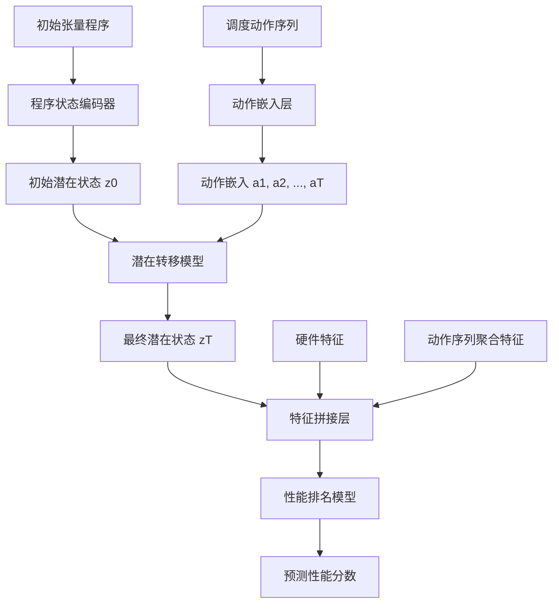
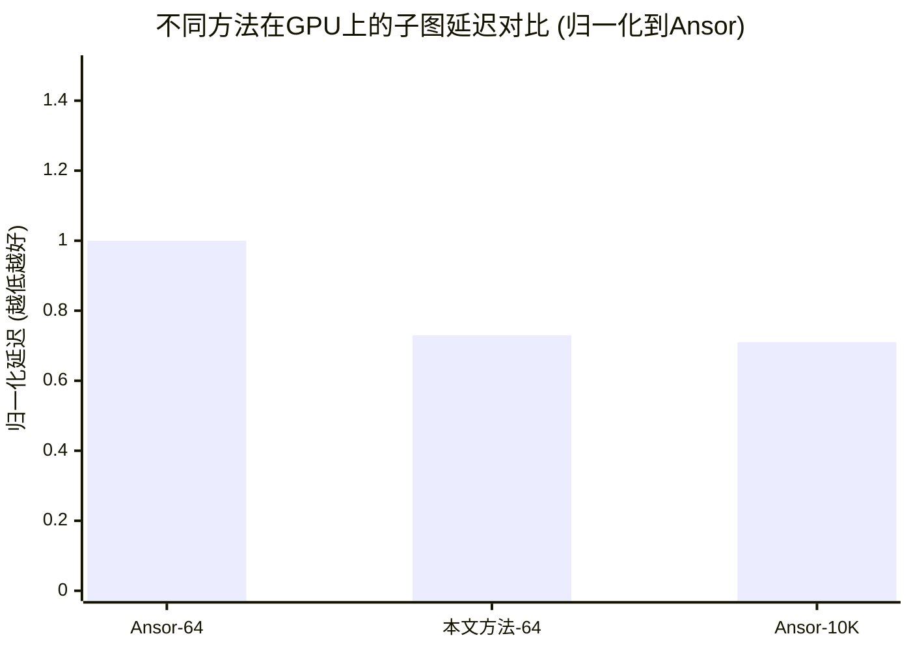

# Toward Compiler World Models: Learning Latent Dynamics for Efficient Tensor Program Search

> 本文由 paper-daily 使用 DeepSeek 自动生成，仅供快速了解论文；关键结论请以原文为准。

[论文原文](https://arxiv.org/abs/2606.09312) · [PDF](https://arxiv.org/pdf/2606.09312) · [源文件](https://github.com/vsvnakers/paper-daily/blob/master/essay_read/2026-06-10/2606.09312.md)

> 提出一种受世界模型启发的评估器，通过在潜在空间中模拟调度动作的动态演化，高效准确地预测张量程序性能。

## 基本信息

| 属性 | 内容 |
|------|------|
| **作者** | Haolin Pan, Lianghong Huang, Xvlin Zhou, Mingjie Xing, Yanjun Wu |
| **来源** | [arXiv:2606.09312](https://arxiv.org/abs/2606.09312) |
| **发布日期** | 2026-06-08 |
| **抓取领域** | 深度学习编译器/IR |
| **学科方向** | 机器学习 · 编程语言 |
| **arXiv 分类** | cs.LG, cs.PL |
| **适用层次** | 进阶 |
| **标签** | 世界模型, 张量程序优化, 自动调度器, 潜在动力学, 代价模型 |
| **PDF** | [在线阅读](https://arxiv.org/pdf/2606.09312) |
| **代码仓库** | 暂无

---

## 问题的初衷（Why - 为什么要做这个研究）

【问题的初衷】这篇论文旨在解决张量程序优化（Tensor Program Optimization）中搜索空间巨大且现有自动调度器（Auto-scheduler）评估效率低下的问题。在现代机器学习系统中，张量程序（如卷积、矩阵乘法）的性能高度依赖于底层硬件和调度策略（Schedule Strategy）。自动调度器通过搜索大量候选调度方案来寻找最优实现，但直接测量每个候选方案的执行时间（Profiling）成本极高。现有方法采用基于学习的代价模型（Cost Model）来预测性能，从而减少实际测量次数。然而，这些代价模型通常将每个候选调度视为一个静态代码快照（Static Code Snapshot），忽略了生成该调度的历史轨迹（Schedule Trajectory），即从初始程序到当前候选所经历的一系列调度动作（Scheduling Actions）。这种静态视角导致模型对动作之间的依赖关系（Action Dependencies）不敏感，例如，先进行循环分块（Loop Tiling）再进行向量化（Vectorization）与先向量化再分块，其最终性能可能差异巨大，但静态快照可能无法捕捉这种顺序带来的影响。此外，静态模型容易受到表面代码变化（Superficial Code Variations）的干扰，例如，变量重命名或循环顺序微调可能导致代码表示不同，但实际性能相似，从而误导模型。因此，论文的动机是提出一种新的评估范式，能够感知调度轨迹的动态演化过程，从而更准确、更高效地评估候选调度方案。

---

## 问题的解决（What - 提出了什么方案）

【问题的解决】论文提出了一种受世界模型（World Model）启发的评估器（World-Model-Inspired Evaluator），将调度评估建模为基于动作的条件潜在动力学（Action-Conditioned Latent Dynamics）。核心思路是：不直接评估最终生成的静态代码，而是模拟从初始程序状态开始，通过一系列调度动作在连续潜在空间（Continuous Latent Space）中的演化过程。具体而言，该方法首先将初始程序状态编码为一个潜在向量（Latent Vector）。然后，对于每个候选调度方案（即一系列动作序列），使用一个轻量级的转移模型（Transition Model）在潜在空间中逐步“滚动”（Rollout）这些动作，预测每一步后的新潜在状态。这个转移模型学习的是动作对程序状态在潜在空间中的影响，而不是在语法树（AST）层面进行昂贵的变异操作（AST Mutation）和重复的代码编码（Repeated Code Encoding）。最终，将滚动结束时的最终动态表示（Final Dynamic Representation）与动作特征（Action Features）和硬件特征（Hardware Features）结合，输入到一个排名模型（Ranking Model）中，对候选方案进行排序。与现有方法（如Ansor）的本质区别在于：1）动态性：模型感知了调度动作的序列效应，而不仅仅是静态代码；2）高效性：在潜在空间中进行模拟，避免了AST层面的操作，计算开销极低；3）泛化性：潜在动力学模型能够捕捉不同动作序列之间的内在联系，可能对未见过的动作组合有更好的泛化能力。

---

## 技术方法详解（How - 怎么实现的）

【技术方法详解】
- **程序状态编码（Program State Encoding）**：使用一个编码器（Encoder）将初始张量程序（通常表示为抽象语法树AST）映射到一个固定维度的潜在向量 $z_0 \in \mathbb{R}^d$。编码器可以是图神经网络（GNN）或简单的循环神经网络（RNN），用于捕捉程序的结构信息。
- **动作嵌入（Action Embedding）**：每个调度动作（如分块、融合、向量化）及其参数（如分块大小）被嵌入到一个连续向量 $a_t \in \mathbb{R}^k$ 中。动作嵌入层（Action Embedding Layer）将离散的动作空间映射到连续空间。
- **潜在转移模型（Latent Transition Model）**：这是核心组件，是一个轻量级的神经网络（如多层感知机MLP或门控循环单元GRU），用于学习潜在状态 $z_t$ 在动作 $a_t$ 作用下的演化规律：$z_{t+1} = f_\theta(z_t, a_t)$。其中 $f_\theta$ 是转移函数，参数为 $\theta$。该模型假设潜在状态的变化主要由当前状态和施加的动作决定，类似于世界模型中的状态转移。
- **动态滚动（Dynamic Rollout）**：给定一个候选调度方案（动作序列 $a_1, a_2, ..., a_T$），从初始潜在状态 $z_0$ 开始，依次应用转移模型：$z_1 = f_\theta(z_0, a_1)$, $z_2 = f_\theta(z_1, a_2)$, ..., $z_T = f_\theta(z_{T-1}, a_T)$。最终得到一系列潜在状态，其中 $z_T$ 是最终状态。
- **性能排名模型（Performance Ranking Model）**：将最终动态表示 $z_T$、动作序列的聚合特征（如动作类型直方图）$h_{actions}$ 和硬件特征（如GPU型号、内存带宽）$h_{hw}$ 拼接起来，输入到一个排名模型 $g_\phi$ 中，输出一个标量分数 $score = g_\phi([z_T, h_{actions}, h_{hw}])$，用于预测该调度方案的性能（如延迟）。排名模型通常使用成对排序损失（Pairwise Ranking Loss）或列表排序损失（Listwise Ranking Loss）进行训练。
- **训练策略**：使用真实测量数据（Ground Truth Latency）作为监督信号。训练数据包括大量（初始程序，动作序列，测量延迟）三元组。编码器、动作嵌入层、转移模型和排名模型进行端到端联合训练。


## 系统架构图




## 方法流程图

```mermaid
flowchart TD
    A[输入: 初始程序与候选调度动作序列] --> B[编码初始程序为潜在状态 z0]
    B --> C{是否还有未执行的动作?}
    C -- 是 --> D[获取下一个动作 a_t]
    D --> E[将动作 a_t 嵌入为向量]
    E --> F[应用转移模型: $z_{t+1}$ = f(z_t, a_t)]
    F --> C
    C -- 否 --> G[获取最终潜在状态 z_T]
    G --> H[计算动作序列聚合特征]
    H --> I[拼接 z_T, 动作特征, 硬件特征]
    I --> J[输入排名模型]
    J --> K[输出性能分数]
    K --> L[根据分数排序所有候选方案]
```


## 核心公式与算法

【核心公式】
1. **潜在状态转移方程**：
   $$z_{t+1} = f_\theta(z_t, a_t)$$
   其中 $z_t \in \mathbb{R}^d$ 是时刻 $t$ 的程序潜在状态，$a_t \in \mathbb{R}^k$ 是时刻 $t$ 的调度动作嵌入，$f_\theta$ 是参数为 $\theta$ 的转移模型（如MLP）。该方程描述了在潜在空间中，程序状态如何因调度动作而演化。

2. **性能分数预测方程**：
   $$score = g_\phi([z_T, h_{actions}, h_{hw}])$$
   其中 $z_T$ 是最终潜在状态，$h_{actions}$ 是动作序列的聚合特征，$h_{hw}$ 是硬件特征，$g_\phi$ 是参数为 $\phi$ 的排名模型（如MLP）。该方程将动态轨迹信息与静态特征结合，输出一个标量分数用于排序。

3. **训练损失函数（成对排序损失示例）**：
   $$\mathcal{L} = \sum_{i,j \in \text{pairs}} \max(0, \text{score}_j - \text{score}_i + \text{margin})$$
   其中 $i$ 和 $j$ 是一对候选方案，且已知 $i$ 的实际性能优于 $j$。该损失函数鼓励模型为更优的方案预测更高的分数。


---

## 应用场景（Where - 在哪落地）

【应用场景】
1. **深度学习编译器自动调优**：这是最直接的应用场景。深度学习编译器（如TVM、XLA、Glow）在将模型部署到特定硬件（如手机NPU、自动驾驶芯片）时，需要为每个算子（Operator）搜索最优调度。本文方法可以作为编译器的核心调优引擎，在有限的硬件测量预算内（例如，只允许测量100次），快速找到接近最优的调度方案。例如，在部署一个包含100个算子的ResNet模型时，传统方法可能需要测量每个算子的数千个候选方案，而本文方法通过潜在动力学模拟，只需测量少量候选即可，将调优时间从数小时缩短到数分钟。
2. **硬件设计空间探索**：在芯片设计阶段，需要评估不同微架构（如缓存大小、计算单元数量）对特定张量程序性能的影响。本文方法可以模拟在不同硬件配置下，调度动作序列的潜在演化，从而快速预测硬件参数变化对最终性能的影响，无需实际流片或搭建精确的模拟器。例如，设计者可以输入一个卷积程序，然后通过改变硬件特征向量（如 $h_{hw}$ 中的缓存大小参数），观察预测性能分数的变化，从而指导硬件设计决策。
3. **在线自适应优化**：在云服务或移动设备上，运行时的负载和硬件状态（如温度、功耗限制）是动态变化的。本文方法可以作为一个轻量级的在线优化器。当检测到环境变化时，它可以从当前正在执行的程序状态出发，快速模拟一系列可能的适应性调度动作（如降低并行度、切换数据布局），并选择预测性能最优的动作来执行，实现实时的自适应优化。


---

## 具体技术细节示例（How in Action - 算法如何执行）

【具体技术细节示例】
假设我们要优化一个简单的矩阵乘法程序 $C = A \times B$，其初始AST表示为一个两层的循环嵌套。我们设定潜在状态维度 $d=4$，动作嵌入维度 $k=2$。

**输入：**
- 初始程序状态编码为潜在向量 $z_0 = [0.1, -0.2, 0.3, 0.0]$。
- 候选调度动作序列：先进行循环分块（Tile），然后进行循环交换（Interchange）。
  - 动作1：Tile，参数为块大小32。其嵌入为 $a_1 = [0.5, 0.1]$。
  - 动作2：Interchange，交换内外循环。其嵌入为 $a_2 = [-0.3, 0.8]$。

**执行步骤：**
1. **步骤1：应用Tile动作**
   - 转移模型 $f_\theta$ 是一个单层MLP，权重矩阵 $W \in \mathbb{R}^{4 \times 6}$（输入维度 $d+k=6$），偏置 $b \in \mathbb{R}^4$。假设 $W$ 和 $b$ 已训练好。
   - 计算 $z_1 = \text{ReLU}(W \cdot [z_0, a_1] + b)$。
   - 假设计算结果为 $z_1 = [0.8, -0.1, 0.5, 0.2]$。这个新状态表示程序已经被分块，循环结构发生了变化。

2. **步骤2：应用Interchange动作**
   - 再次使用相同的转移模型 $f_\theta$，输入为 $[z_1, a_2]$。
   - 计算 $z_2 = \text{ReLU}(W \cdot [z_1, a_2] + b)$。
   - 假设计算结果为 $z_2 = [0.6, 0.3, 0.1, 0.9]$。这个最终状态 $z_2$ 代表了经过分块和交换后的程序状态。

3. **特征拼接与评分**
   - 动作序列聚合特征 $h_{actions}$：例如，统计动作类型，得到向量 $[1, 1, 0, ...]$（表示Tile和Interchange各出现一次）。
   - 硬件特征 $h_{hw}$：例如，GPU型号编码为 $[1, 0]$。
   - 拼接所有特征：$[z_2, h_{actions}, h_{hw}] = [0.6, 0.3, 0.1, 0.9, 1, 1, 0, ..., 1, 0]$。
   - 输入排名模型 $g_\phi$（另一个MLP），输出分数 $score = 0.85$。

**输出：**
- 该候选调度方案的预测性能分数为0.85。分数越高，表示预测的延迟越低（性能越好）。

通过这个示例，可以看到算法如何将离散的调度动作序列转化为连续的潜在状态演化，并最终输出一个可比较的分数，整个过程无需触及实际的AST或进行代码生成。


---

## 实验结果（Results - 效果如何）

【实验结果】论文在TVM AutoScheduler框架中实现了该方法，并在多个深度学习模型（如ResNet-50、BERT、MobileNetV2等）和硬件平台（NVIDIA GPU和Intel CPU）上进行评估。主要实验设置包括：使用Ansor作为基线，对比在相同搜索预算（如64次测量）下的性能。关键实验结果：1）在GPU上，该方法在代表性子图（Representative Subgraph）上的延迟比Ansor提升1.37倍（即加速1.37倍）；在CPU上提升1.54倍。2）在仅使用64次测量的预算下，该方法能达到Ansor使用10,000次测量性能的97.8%（即2.2%的几何平均差距），这意味着测量效率提升了10倍以上。3）在全模型推理加速方面，相比PyTorch默认实现，该方法平均加速4.61倍；相比PyTorch使用cuDNN优化，平均加速3.67倍。这些结果充分证明了该方法在低搜索预算下的高效性和优越性。


## 实验结果可视化




---

## 优势与不足

【优势与不足】
**优势：**
1. **高效性**：通过在潜在空间中进行模拟，避免了AST层面的昂贵操作，显著降低了评估成本，使得在极少的实际测量次数下就能找到高质量调度。
2. **动态感知**：模型能够捕捉调度动作序列的时序依赖关系，对动作顺序敏感，比静态代价模型更准确。
3. **泛化能力**：潜在动力学模型学习的是动作对程序状态的通用影响规律，可能对训练中未出现过的动作组合有更好的泛化能力。

**不足：**
1. **潜在空间的信息损失**：将复杂的程序状态压缩到固定维度的潜在向量中，可能会丢失一些对性能至关重要的细节信息，导致预测精度存在上限。
2. **训练数据需求**：训练端到端的模型（编码器、转移模型、排名模型）需要大量高质量的（程序，动作序列，延迟）三元组数据，获取这些数据的成本可能较高。
3. **转移模型的准确性**：潜在转移模型假设状态变化是马尔可夫的（仅依赖当前状态和动作），但实际中，长程依赖可能难以被简单模型捕捉，导致滚动误差累积。

---

## 相关工作

【相关工作】
1. **Ansor (Zheng et al., 2020)**：一个经典的自动调度器，使用分层搜索和基于树的代价模型。本文方法直接对比Ansor，并以其为基线。
2. **Halide Auto-Scheduler (Adams et al., 2019)**：Halide的自动调度器，使用随机搜索和beam search。与本文方法类似，都致力于自动搜索调度。
3. **TVM AutoScheduler (Chen et al., 2018)**：TVM框架中的自动调度组件，本文方法即实现于此框架中。
4. **世界模型 (World Models, Ha & Schmidhuber, 2018)**：本文方法的灵感来源，世界模型在强化学习中用于学习环境的潜在动力学。本文将其思想应用于程序优化。
5. **基于学习的代价模型 (Learned Cost Models)**：如使用XGBoost或神经网络预测程序性能。本文方法属于此类，但创新性地引入了动态轨迹建模。

---

## 未来研究方向

【未来方向】
1. **更复杂的转移模型**：当前使用简单的MLP作为转移模型，可能无法捕捉长程依赖或复杂的非线性变化。未来可以探索使用Transformer或神经ODE（Neural ODE）作为转移模型，以建模更精细的潜在动力学。
2. **多任务与迁移学习**：不同硬件平台或不同算子家族的潜在动力学可能具有共性。未来可以研究如何将在一个硬件上训练好的世界模型迁移到另一个硬件上，或者在一个算子家族上预训练的模型如何快速适应新算子，从而减少训练数据需求。
3. **与强化学习结合**：世界模型本身就是强化学习中的核心组件。未来可以将本文的潜在动力学模型嵌入到一个强化学习智能体中，让智能体在潜在空间中直接规划（Planning）最优的动作序列，而不是搜索离散的动作组合，从而实现端到端的调度策略学习。


---

## 一句话总结

> 提出一种受世界模型启发的评估器，通过在潜在空间中模拟调度动作的动态演化，高效准确地预测张量程序性能。

---

*本解读由 DeepSeek AI 自动生成，仅供参考。*
