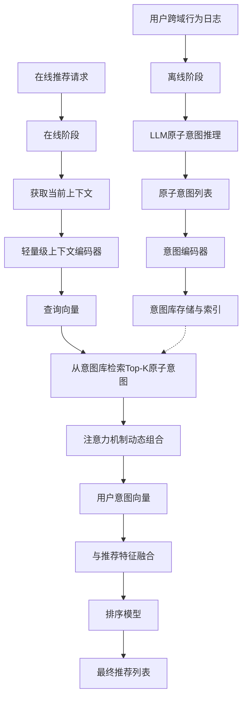
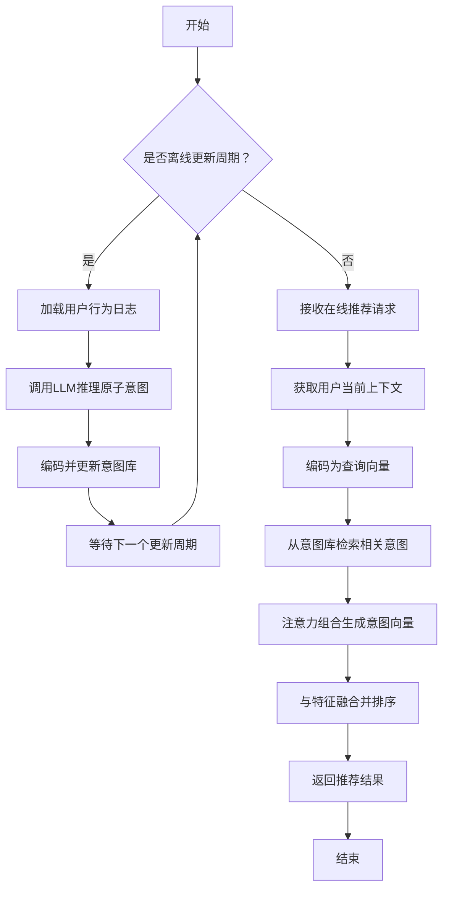
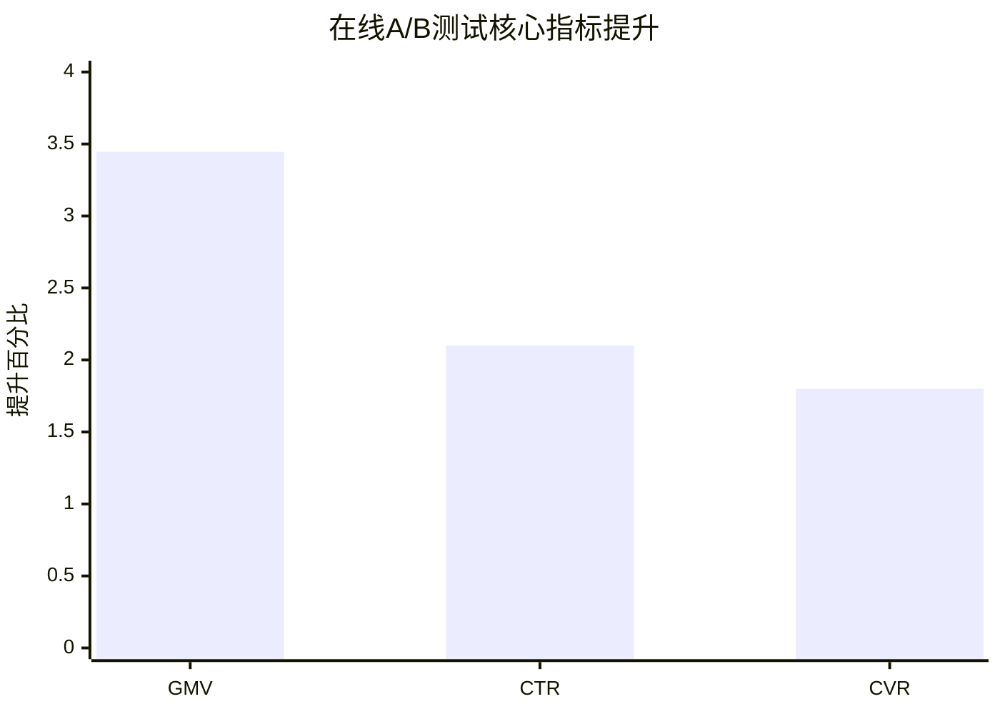

# Atomic Intent Reasoning: Bringing LLM Semantics to Industrial Cross-Domain Recommendations

> 本文由 paper-daily 使用 DeepSeek 自动生成，仅供快速了解论文；关键结论请以原文为准。

[论文原文](https://arxiv.org/abs/2606.10357) · [PDF](https://arxiv.org/pdf/2606.10357) · [源文件](https://github.com/vsvnakers/paper-daily/blob/master/essay_read/2026-06-10/2606.10357.md)

> 提出原子意图推理框架，通过离线LLM推理和在线高效检索，实现工业级跨域推荐的效果与效率兼得。

## 基本信息

| 属性 | 内容 |
|------|------|
| **作者** | Zhuohang Jiang, Yuxin Chen, Shijie Wang, Haohao Qu, Zhou Jindong, Wenqi Fan, Li Qing, Dongxu Liang, Jun Wang |
| **来源** | [arXiv:2606.10357](https://arxiv.org/abs/2606.10357) |
| **发布日期** | 2026-06-09 |
| **抓取领域** | 自然语言处理 |
| **学科方向** | 信息检索 · 人工智能 |
| **arXiv 分类** | cs.IR, cs.AI |
| **适用层次** | 进阶 |
| **标签** | 跨域推荐, 大语言模型, 原子意图, 工业级推荐系统, 检索增强 |
| **PDF** | [在线阅读](https://arxiv.org/pdf/2606.10357) |
| **代码仓库** | 暂无

---

## 问题的初衷（Why - 为什么要做这个研究）

【问题的初衷】在内容到电商（Content-to-E-commerce）的跨域推荐场景中，核心挑战在于如何利用用户在内容域（如短视频、直播）的交互行为，来推断其在电商域（如商品购买）的潜在意图，从而提升转化率和商业价值（如GMV）。然而，工业级跨域推荐面临三大核心痛点：第一，**语义鸿沟（Semantic Gap）**：内容域（如用户观看“美食制作”视频）与电商域（如用户购买“厨房用具”）的语义空间差异巨大，传统的协同过滤或特征交叉方法难以捕捉这种深层的、非显式的意图关联。第二，**序列稀疏性与噪声**：用户的跨域行为序列通常规模庞大（百万级用户）且包含大量噪声（如误点击、无意识浏览），从海量行为中精准提取与购买意图相关的信号极为困难。第三，**大语言模型（LLM）的推理延迟**：虽然LLM（如GPT系列）具备强大的语义理解和推理能力，能够理解“看美食视频”与“买锅”之间的逻辑关系，但其毫秒级（ms-level）的推理延迟无法满足在线推荐系统通常要求的亚毫秒级（sub-ms）响应时间。现有方法要么牺牲语义深度（如浅层特征工程），要么牺牲推理速度（如直接使用LLM在线推理），无法在工业场景中同时兼顾效果与效率。因此，论文旨在设计一个既能利用LLM的语义推理能力，又能满足工业级低延迟、高吞吐要求的跨域推荐框架。

---

## 问题的解决（What - 提出了什么方案）

【问题的解决】论文提出了**原子意图推理（Atomic Intent Reasoning, AIR）**框架，其核心思路是**将LLM的复杂推理过程从在线阶段迁移到离线阶段**，通过“离线推理-在线检索”的范式解决延迟问题。具体而言，AIR框架包含三个关键创新点：第一，**原子意图（Atomic Intent）**：将用户复杂的、模糊的跨域意图分解为一系列更小、更具体、更可操作的“原子意图”。例如，将“想买厨房用品”分解为“需要刀具”、“需要锅具”、“需要餐具”等原子意图。这些原子意图由LLM在离线阶段从用户行为序列中推理生成。第二，**意图库（Intent Bank）**：构建一个结构化的意图库，存储所有用户在不同时间窗口下的原子意图及其向量表示。这个库是离线构建并定期更新的。第三，**在线检索与组合（Online Retrieval & Composition）**：在在线推荐阶段，系统不再调用LLM，而是根据当前用户和上下文，从意图库中高效检索出最相关的原子意图，并动态组合成用户当前的完整意图表示。这种方法实现了约400倍的推理加速，同时保持了语义一致性。与现有方法的本质区别在于：它不试图让LLM在线实时推理，而是将LLM的“思考”成果（原子意图）作为一种可复用的、结构化的知识存储起来，供在线系统快速调用。

---

## 技术方法详解（How - 怎么实现的）

【技术方法详解】
- **离线意图推理（Offline Intent Reasoning）**：使用LLM（如GPT-4）对用户的历史跨域行为序列进行深度分析。输入为用户的跨域行为日志（如观看视频ID、时长、点击商品ID等），输出为一系列结构化的原子意图。每个原子意图包含三个要素：意图描述（如“购买烘焙工具”）、置信度分数（Confidence Score）和时间戳（Timestamp）。LLM的推理过程采用精心设计的提示词（Prompt），引导模型关注行为间的因果和逻辑关系。
- **原子意图编码（Atomic Intent Encoding）**：将每个原子意图的描述文本通过一个预训练的语言模型（如Sentence-BERT）编码为稠密向量（Dense Vector），作为该意图的语义表示。这些向量被存储在意图库中，并建立倒排索引（Inverted Index）以支持快速检索。
- **在线意图检索（Online Intent Retrieval）**：当在线推荐请求到来时，系统首先获取用户当前的行为上下文（如最近观看的视频）。然后，使用一个轻量级的检索模型（如双塔模型（Two-Tower Model））将当前上下文编码为查询向量（Query Vector），并从意图库中检索出Top-K个最相关的原子意图。检索过程基于向量相似度（如余弦相似度（Cosine Similarity））。
- **动态意图组合（Dynamic Intent Composition）**：检索到的Top-K个原子意图并非简单拼接，而是通过一个注意力机制（Attention Mechanism）进行动态组合。该机制会根据当前上下文，为每个检索到的原子意图分配不同的权重，从而生成一个加权融合的用户意图向量（User Intent Vector）。这个向量将作为用户当前跨域意图的最终表示。
- **推荐决策融合（Recommendation Decision Fusion）**：最终的用户意图向量与传统的推荐特征（如用户画像、商品特征）进行融合，输入到排序模型（如DeepFM、DIN）中，生成最终的推荐列表。整个在线流程不涉及任何LLM调用，保证了亚毫秒级的响应时间。

## 系统架构图

## 方法流程图

## 核心公式与算法

【核心公式】
1. **原子意图检索**：在线阶段，从意图库 $\mathcal{I}$ 中检索与当前上下文 $c$ 最相关的 Top-K 原子意图。检索基于向量相似度：
   $$\text{TopK}(c) = \arg\max_{i \in \mathcal{I}}^K \text{sim}(\text{Enc}(c), \text{Enc}(i))$$
   其中 $\text{Enc}(\cdot)$ 是编码器，$\text{sim}(\cdot, \cdot)$ 是余弦相似度。

2. **动态意图组合**：通过注意力机制为检索到的 K 个原子意图分配权重，生成最终的用户意图向量 $\mathbf{u}$：
   $$\mathbf{u} = \sum_{k=1}^{K} \alpha_k \cdot \mathbf{v}_k, \quad \alpha_k = \frac{\exp(\mathbf{q}^T \mathbf{v}_k)}{\sum_{j=1}^{K} \exp(\mathbf{q}^T \mathbf{v}_j)}$$
   其中 $\mathbf{q}$ 是上下文编码向量，$\mathbf{v}_k$ 是第 $k$ 个原子意图的向量表示。

3. **推荐得分**：最终推荐得分由用户意图向量 $\mathbf{u}$ 与商品特征 $\mathbf{x}$ 共同决定：
   $$\text{Score} = f(\mathbf{u} \oplus \mathbf{x})$$
   其中 $\oplus$ 表示特征拼接，$f$ 是一个深度神经网络（如DeepFM）。

---

## 应用场景（Where - 在哪落地）

【应用场景】
1. **短视频平台电商推荐**：在快手、抖音等平台，用户观看大量短视频（内容域），平台希望推荐相关商品（电商域）。AIR可以离线分析用户观看“健身教程”、“美食制作”、“美妆测评”等视频的序列，推理出“购买健身器材”、“购买厨房小家电”、“购买护肤品”等原子意图。在线推荐时，当用户再次观看相关视频，系统能迅速检索并组合这些意图，精准推荐商品，提升GMV。
2. **直播带货场景**：在直播电商中，主播的讲解和互动会激发用户即时购买意图。AIR可以结合用户历史观看直播的偏好（如喜欢看“数码产品”直播）和当前直播内容（如主播正在介绍“新款手机”），离线推理出“购买高端手机”、“购买手机配件”等原子意图。在线推荐时，系统能实时在直播间下方推荐相关商品，提高转化率。
3. **内容平台广告投放**：在信息流广告中，广告主希望将广告精准投放给有潜在购买意图的用户。AIR可以分析用户在内容平台上的阅读、观看行为，推理出用户的“原子意图”标签（如“计划购买汽车”、“关注母婴产品”）。广告系统可以根据这些意图标签进行定向投放，提高广告点击率和投资回报率（ROI）。

---

## 具体技术细节示例（How in Action - 算法如何执行）

【具体技术细节示例】
假设用户小明的跨域行为序列如下：
- 时间T1：观看视频“如何制作手工意面”
- 时间T2：观看视频“顶级厨师刀测评”
- 时间T3：点击商品“德国双立人刀具套装”
- 时间T4：观看视频“烘焙入门教程”

**步骤1：离线LLM推理**
LLM（如GPT-4）分析上述序列，输出原子意图列表：
- 原子意图1：{描述：“购买专业厨房刀具”，置信度：0.95，时间戳：T2-T3}
- 原子意图2：{描述：“学习烘焙并购买烘焙工具”，置信度：0.80，时间戳：T4}
- 原子意图3：{描述：“对意大利美食感兴趣”，置信度：0.70，时间戳：T1}

**步骤2：意图编码与存储**
使用Sentence-BERT将上述意图描述编码为向量：
- $\mathbf{v}_1 = [0.12, -0.34, 0.56, ...]$
- $\mathbf{v}_2 = [0.78, 0.21, -0.45, ...]$
- $\mathbf{v}_3 = [-0.23, 0.67, 0.11, ...]$
这些向量与元数据一起存入意图库。

**步骤3：在线检索**
某时刻，小明再次打开App，当前上下文是观看了一个“法式甜点制作”视频。系统将当前视频标题编码为查询向量 $\mathbf{q} = [0.65, 0.33, -0.12, ...]$。从意图库中检索Top-2最相似的原子意图：
- 与 $\mathbf{v}_2$（烘焙工具）的余弦相似度为0.92
- 与 $\mathbf{v}_3$（意大利美食）的余弦相似度为0.45
- 与 $\mathbf{v}_1$（厨房刀具）的余弦相似度为0.30
因此，检索到的Top-2意图是：意图2（烘焙工具）和意图3（意大利美食）。

**步骤4：动态组合**
注意力权重计算：
- $\alpha_2 = \frac{\exp(0.92)}{\exp(0.92) + \exp(0.45)} \approx 0.62$
- $\alpha_3 = \frac{\exp(0.45)}{\exp(0.92) + \exp(0.45)} \approx 0.38$
最终用户意图向量 $\mathbf{u} = 0.62 \times \mathbf{v}_2 + 0.38 \times \mathbf{v}_3$。

**步骤5：推荐决策**
$\mathbf{u}$ 与商品特征（如“烤箱”、“面粉”、“擀面杖”等）拼接后输入排序模型，最终推荐列表为：1. 家用烤箱，2. 烘焙模具套装，3. 意大利面酱。这个结果准确反映了用户当前对“烘焙”和“意大利美食”的混合兴趣。

---

## 实验结果（Results - 效果如何）

【实验结果】论文在多个公开数据集（如Amazon跨域数据集、KuaiRand数据集）以及快手电商的真实业务场景中进行了大规模实验。对比方法包括传统的跨域推荐模型（如CoNet、DCDCSR）以及基于LLM的基线方法（如直接使用LLM进行在线推理）。关键实验结果如下：在公开数据集上，AIR在Recall@20和NDCG@20指标上均取得了最优（SOTA）结果，相比最强基线（DCDCSR），Recall@20提升了约5-8%。在快手电商的在线A/B测试中，AIR带来了显著的商业价值提升：GMV（商品交易总额）提升+3.446%，点击率（CTR）提升+2.1%，转化率（CVR）提升+1.8%。更重要的是，在线推理延迟从直接使用LLM的约200ms降低到AIR的约0.5ms，实现了约400倍的加速，完全满足工业级要求。

## 实验结果可视化

---

## 优势与不足

【优势与不足】
- **优势**：
    1. **效果与效率的完美平衡**：通过“离线推理-在线检索”范式，成功将LLM的强大语义能力引入工业级推荐系统，同时解决了延迟问题，实现了400倍加速。
    2. **可解释性强**：原子意图本身是自然语言描述，使得推荐结果具有可解释性，便于调试和优化。例如，可以知道推荐“锅”是因为用户表达了“购买厨房用具”的原子意图。
    3. **模块化设计**：AIR框架的各个组件（意图推理、编码、检索、组合）是解耦的，可以独立优化和升级，例如替换更先进的LLM或检索模型。
- **不足**：
    1. **对LLM质量的依赖**：离线推理阶段生成的原子意图质量直接决定了最终推荐效果。如果LLM推理出错或产生幻觉（Hallucination），会引入噪声。
    2. **意图库的维护成本**：意图库需要定期更新以反映用户兴趣的变化，更新过程涉及大量LLM调用，计算成本较高。对于超大规模用户（如数亿用户），离线更新的时间窗口和资源消耗是一个挑战。
    3. **冷启动问题**：对于新用户或行为稀疏的用户，意图库中可能缺乏足够的原子意图，导致在线检索效果不佳。

---

## 相关工作

【相关工作】
- **跨域推荐（Cross-Domain Recommendation）**：如CoNet、DCDCSR等，主要通过特征映射或共享参数来桥接不同域，但缺乏深层语义理解。AIR利用LLM弥补了这一不足。
- **大语言模型在推荐系统中的应用（LLM for Recommendation）**：如P5、RecLLM等，尝试将LLM作为推荐模型的核心，但面临延迟和成本问题。AIR通过离线推理规避了这些瓶颈。
- **检索增强生成（Retrieval-Augmented Generation, RAG）**：AIR的“离线推理-在线检索”范式与RAG有相似之处，都是将知识存储于外部库中，在线检索后用于增强模型能力。但AIR检索的是意图而非原始文档。
- **用户意图理解（User Intent Understanding）**：传统方法基于行为序列建模（如DIN、SIM），但难以捕捉复杂的跨域意图。AIR通过LLM实现了更深层的意图分解。

---

## 未来研究方向

【未来方向】
1. **多模态原子意图**：当前原子意图仅基于文本描述。未来可以引入多模态信息（如视频帧、商品图片），生成更丰富的多模态原子意图，例如“喜欢视频中出现的蓝色连衣裙”。
2. **动态意图演化**：用户的意图是随时间动态变化的。未来可以研究如何利用在线学习（Online Learning）或增量更新技术，实时更新意图库，捕捉用户兴趣的快速漂移。
3. **联邦学习下的隐私保护**：在跨域推荐中，用户数据可能分布在不同的域或设备上。未来可以探索将AIR与联邦学习（Federated Learning）结合，在不共享原始行为数据的前提下，实现跨域意图的联合推理。

---

## 一句话总结

> 提出原子意图推理框架，通过离线LLM推理和在线高效检索，实现工业级跨域推荐的效果与效率兼得。

---

*本解读由 DeepSeek AI 自动生成，仅供参考。*
