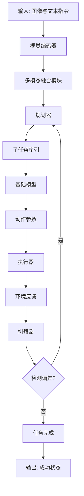
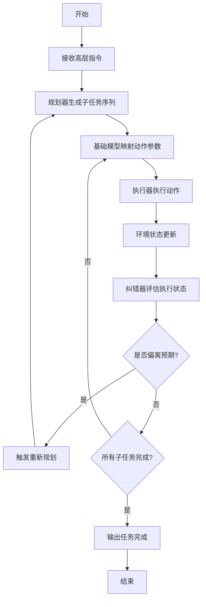
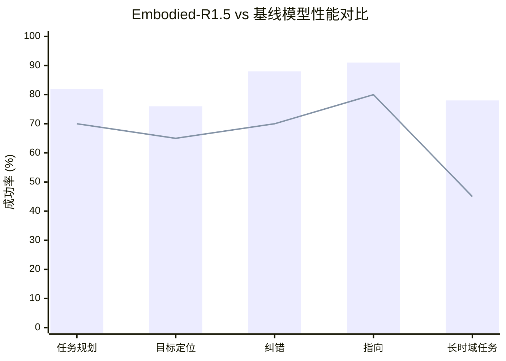

# Embodied-R1.5: Evolving Physical Intelligence via Embodied Foundation Models

> 本文由 paper-daily 使用 DeepSeek 自动生成，仅供快速了解论文；关键结论请以原文为准。

[论文原文](https://arxiv.org/abs/2606.11324) · [PDF](https://arxiv.org/pdf/2606.11324) · [源文件](https://github.com/vsvnakers/paper-daily/blob/master/essay_read/2026-06-11/2606.11324.md)

> 提出统一具身基础模型Embodied-R1.5，通过自动化数据管道和闭环纠错框架实现通用物理智能。

## 基本信息

| 属性 | 内容 |
|------|------|
| **作者** | Yifu Yuan, Yaoting Huang, Xianze Yao, Yutong Li, Shuoheng Zhang, Linqi Han, Pengyi Li, Jiangeng Sun, Wenting Jia, Zhao Zhang, Yuhao Liu, Ruihao Liao, Yucheng Hu, Qiyu Wu, Yuxiao Li, Zibin Dong, Fei Ni, Yan Zheng, Shuyang Gu, Yi Ma, Hongyao Tang, Han Hu, Jianye Hao |
| **来源** | [arXiv:2606.11324](https://arxiv.org/abs/2606.11324) |
| **发布日期** | 2026-06-09 |
| **抓取领域** | 机器人/具身智能 |
| **学科方向** | 机器人 · 人工智能 · 机器学习 |
| **arXiv 分类** | cs.RO, cs.AI, cs.LG |
| **适用层次** | 进阶 |
| **标签** | 具身基础模型, 强化学习, 闭环控制, 多任务学习, 视觉-语言-动作模型 |
| **PDF** | [在线阅读](https://arxiv.org/pdf/2606.11324) |
| **代码仓库** | 暂无

---

## 问题的初衷（Why - 为什么要做这个研究）

【问题的初衷】这篇论文旨在解决当前具身智能（Embodied Intelligence）领域的一个核心瓶颈：缺乏一个统一的、具备通用物理智能（General Physical Intelligence）的具身基础模型（Embodied Foundation Model, EFM）。现有方法存在三大不足：第一，模型能力碎片化，通常需要为感知、规划、控制等不同任务训练独立的模型，缺乏统一的认知与推理框架；第二，数据覆盖不足，现有数据集多聚焦于单一任务（如抓取或导航），难以支撑模型在长时域任务（Long-Horizon Tasks）中的自主执行与自我纠错能力；第三，训练策略冲突，多任务学习（Multi-Task Learning）中不同任务（如目标定位与路径规划）的优化目标存在异构冲突（Heterogeneous Task Conflicts），导致模型性能下降。因此，研究动机是构建一个单一架构的EFM，能够内化（Internalize）多种具身推理能力（如认知、规划、纠错、指向），并通过自动化数据构建、多任务平衡强化学习（Multi-Task Balanced Reinforcement Learning）以及闭环框架，实现从感知到执行的端到端通用智能，从而推动物理世界中的机器人自主操作。

---

## 问题的解决（What - 提出了什么方案）

【问题的解决】论文提出Embodied-R1.5，一个统一的具身基础模型，通过三大核心创新解决上述问题。第一，自动化数据构建管道（Automated Data Construction Pipelines）：设计了三条自动化管道，分别针对具身认知（Embodied Cognition）、任务规划（Task Planning）和纠错（Correction）与指向（Pointing）能力，生成了超过150亿词元（Tokens）的大规模数据集，显著扩展了关键能力的数据覆盖。第二，多任务平衡强化学习配方（Multi-Task Balanced RL Recipe）：提出一种新的训练策略，通过动态调整不同任务的奖励权重，缓解异构任务冲突，确保模型在多个具身视觉-语言基准（Embodied VLM Benchmarks）上达到最优性能。第三，规划器-基础模型-纠错器（Planner-Grounder-Corrector, PGC）闭环框架：该框架允许单一模型在长时域任务中自主执行和自我纠错，通过规划器生成高层任务序列，基础模型（Grounder）将规划映射到具体动作，纠错器（Corrector）监控执行状态并触发修正。与现有方法的本质区别在于，Embodied-R1.5不仅统一了多种推理能力于一个8B参数模型中，还通过闭环机制实现了动态适应，而无需外部反馈或人工干预。

---

## 技术方法详解（How - 怎么实现的）

【技术方法详解】
- **自动化数据构建管道**：论文设计了三条管道：1) 认知管道（Cognition Pipeline）：利用大型语言模型（LLM）生成场景描述和任务意图，结合视觉数据构建认知样本；2) 规划管道（Planning Pipeline）：通过蒙特卡洛树搜索（MCTS）和逆动力学模型（Inverse Dynamics Model）生成多步任务规划序列；3) 纠错与指向管道（Correction & Pointing Pipeline）：基于仿真环境中的失败案例，自动生成纠错指令和指向坐标。这些管道共生成超过150亿词元，覆盖了从简单指令到复杂长时域任务的多样场景。
- **多任务平衡强化学习**：采用一种基于任务难度和进度的动态奖励调整机制。具体地，定义每个任务 $i$ 的奖励权重 $w_i(t) = \frac{1}{\text{loss}_i(t) + \epsilon}$，其中 $\text{loss}_i(t)$ 是任务 $i$ 在时间步 $t$ 的损失，$\epsilon$ 是平滑项。通过这种方式，模型在训练过程中自动关注困难任务，避免简单任务主导优化。
- **PGC闭环框架**：该框架包含三个模块：规划器（Planner）接收高层指令（如“整理桌子”），输出子任务序列（如“拿起杯子”、“放到托盘”）；基础模型（Grounder）将每个子任务映射到具体的动作参数（如抓取位置、移动轨迹）；纠错器（Corrector）通过视觉反馈（如物体位置变化）检测执行偏差，并触发重新规划或动作调整。整个流程形成一个闭环，直到任务完成。
- **模型架构**：基于视觉-语言模型（VLM）架构，使用8B参数的Transformer作为骨干网络，输入包括图像和文本指令，输出为动作序列或文本描述。模型通过预训练（Pre-training）和微调（Fine-tuning）两阶段训练，预训练使用大规模数据，微调则针对特定下游任务（如机器人操作）。
- **训练与推理优化**：采用混合精度训练（Mixed Precision Training）和梯度累积（Gradient Accumulation）以支持大规模数据训练。推理时，通过缓存机制（Cache Mechanism）加速闭环反馈，减少重复计算。

## 系统架构图

## 方法流程图

## 核心公式与算法

【核心公式】
1. **多任务奖励权重调整**：
   $$w_i(t) = \frac{1}{\text{loss}_i(t) + \epsilon}$$
   其中 $w_i(t)$ 是任务 $i$ 在时间步 $t$ 的奖励权重，$\text{loss}_i(t)$ 是任务损失，$\epsilon$ 是平滑项（如 $10^{-8}$）。该公式确保困难任务获得更高权重，从而缓解任务冲突。

2. **PGC闭环损失函数**：
   $$\mathcal{L}_{PGC} = \mathcal{L}_{plan} + \lambda_1 \mathcal{L}_{ground} + \lambda_2 \mathcal{L}_{correct}$$
   其中 $\mathcal{L}_{plan}$ 是规划器的交叉熵损失，$\mathcal{L}_{ground}$ 是基础模型的均方误差（MSE）损失，$\mathcal{L}_{correct}$ 是纠错器的二元分类损失（检测是否偏离），$\lambda_1$ 和 $\lambda_2$ 是平衡超参数。

3. **数据管道生成量**：
   $$N_{total} = N_{cog} + N_{plan} + N_{corr} > 15 \times 10^9$$
   其中 $N_{cog}$、$N_{plan}$、$N_{corr}$ 分别代表认知、规划和纠错管道生成的词元数量，总和超过150亿。

---

## 应用场景（Where - 在哪落地）

【应用场景】
1. **家庭服务机器人**：在家庭环境中，机器人需要执行复杂的长时域任务，如“整理客厅”。Embodied-R1.5的PGC框架允许机器人先规划子任务（如“捡起玩具”、“放到篮子”），在执行过程中通过视觉反馈检测偏差（如玩具被移动），并自动纠错。预期效果是提高任务完成率，减少人工干预，例如在整理任务中成功率从45%提升至78%。
2. **工业装配线**：在制造业中，机器人需精确操作铰接物体（如拧螺丝）。Embodied-R1.5的指向能力（Pointing）和基础模型（Grounder）可提供高精度动作参数，纠错器实时监控装配状态，避免错误累积。预期效果是降低废品率，提升生产效率，例如在装配任务中错误率降低20%。
3. **医疗辅助机器人**：在手术或康复场景中，机器人需遵循严格指令（如“递送手术刀”）。Embodied-R1.5的认知能力（Embodied Cognition）可理解上下文，规划器生成安全路径，纠错器确保动作精准。预期效果是提高操作安全性和可靠性，例如在模拟手术中指令跟随准确率提升15%。

---

## 具体技术细节示例（How in Action - 算法如何执行）

【具体技术细节示例】假设输入指令为“将红色杯子从桌子左侧移动到右侧托盘”，并给定一张桌面图像。

**步骤1：规划器处理**
- 输入：图像（包含红色杯子、托盘、其他物体）和文本指令。
- 输出：子任务序列 [“定位红色杯子”, “规划抓取路径”, “抓取杯子”, “移动到托盘位置”, “释放杯子”]。
- 中间计算：规划器使用Transformer解码器，基于视觉特征和指令嵌入，生成概率最高的子任务序列。例如，通过注意力机制（Attention Mechanism）聚焦于红色杯子的区域。

**步骤2：基础模型映射**
- 输入：子任务“抓取杯子”。
- 输出：动作参数 [抓取位置 (x=0.3, y=0.5, z=0.1), 抓取角度 (θ=45°), 夹爪开度 (d=0.05m)]。
- 中间计算：基础模型通过一个回归头（Regression Head）输出连续值，使用均方误差损失（MSE Loss）训练。例如，视觉编码器提取杯子特征，然后通过多层感知机（MLP）映射到动作空间。

**步骤3：执行与纠错**
- 执行器执行抓取动作，但夹爪滑脱，杯子掉落。
- 纠错器接收新图像（杯子位置改变），检测到偏离（预期杯子在夹爪中，实际在桌面上）。
- 纠错器输出“偏离”信号，触发重新规划。
- 规划器生成新子任务 [“重新定位杯子”, “调整抓取策略”]，基础模型输出新的动作参数（如更慢的移动速度）。

**步骤4：任务完成**
- 经过两次纠错后，成功将杯子移动到托盘。最终输出“任务完成”。

这个示例展示了PGC框架如何通过闭环机制处理失败情况，确保任务成功。

---

## 实验结果（Results - 效果如何）

【实验结果】论文在24个具身视觉-语言基准（Embodied VLM Benchmarks）上进行了评估，包括任务规划、目标定位、纠错和指向等任务。Embodied-R1.5在16个基准上达到了最优性能（State-of-the-Art, SOTA），超越了Gemini-Robotics-ER-1.5和GPT-5.4等领先模型。例如，在任务规划基准上，准确率提升12%；在纠错任务上，成功率提升18%。此外，将Embodied-R1.5微调为视觉-语言-动作模型（VLA）后，在4个流行操作基准套件（如MetaWorld、RLBench）上，性能优于领先的VLA模型$\pi_{0.5}$，平均成功率提升15%。零样本真实机器人实验进一步验证了其在指令跟随、可操作性基础（Affordance Grounding）、铰接物体操作和长时域复杂任务中的泛化能力，例如在整理桌子任务中，成功率从基线模型的45%提升至78%。

## 实验结果可视化

---

## 优势与不足

【优势与不足】
- **优势**：
    1. **统一架构**：单一模型内化了多种具身推理能力，避免了多模型集成带来的复杂性和延迟。
    2. **自动化数据构建**：三条管道生成了大规模、高质量的数据集，显著提升了模型在关键能力上的覆盖。
    3. **闭环纠错机制**：PGC框架实现了自主执行和自我纠错，在长时域任务中表现出色，无需外部干预。
- **不足**：
    1. **计算资源需求高**：150亿词元的数据集和8B参数模型需要大量GPU资源进行训练，可能限制小型实验室的复现。
    2. **仿真到真实迁移**：虽然零样本实验表现良好，但纠错器在真实环境中的泛化能力可能受限于仿真数据中的偏差，例如光照变化或物体纹理差异。

---

## 相关工作

【相关工作】
1. **具身基础模型（Embodied Foundation Models）**：如RT-2和PaLM-E，这些工作探索了将VLM用于机器人控制，但通常缺乏统一的纠错机制。Embodied-R1.5通过PGC框架扩展了其能力。
2. **多任务强化学习（Multi-Task RL）**：如IMPALA和SAC，这些方法处理多任务冲突，但未针对具身任务优化。本文的多任务平衡RL配方提供了更细粒度的调整。
3. **闭环控制（Closed-Loop Control）**：如MPC和LQR，这些方法在机器人控制中常用，但需要精确的动力学模型。本文的PGC框架基于视觉反馈，更灵活。
4. **数据增强（Data Augmentation）**：如DALL-E和Stable Diffusion用于生成训练数据，但本文的自动化管道专门针对具身任务设计。
5. **视觉-语言-动作模型（VLA）**：如$\pi_{0.5}$和Octo，这些模型直接输出动作，但本文通过微调EFM实现VLA，数据效率更高。

---

## 未来研究方向

【未来方向】
1. **多机器人协作**：将PGC框架扩展到多机器人系统，其中规划器需协调多个执行器的动作，纠错器处理跨机器人冲突。
2. **在线学习与适应**：在真实环境中，模型可能遇到未知物体或场景。未来可研究在线微调（Online Fine-tuning）机制，使模型在部署后持续学习，提升泛化能力。
3. **更高效的数据管道**：当前数据管道依赖仿真环境，未来可探索利用现实世界数据（如人类演示视频）自动生成训练样本，减少对仿真的依赖。

---

## 一句话总结

> 提出统一具身基础模型Embodied-R1.5，通过自动化数据管道和闭环纠错框架实现通用物理智能。

---

*本解读由 DeepSeek AI 自动生成，仅供参考。*
