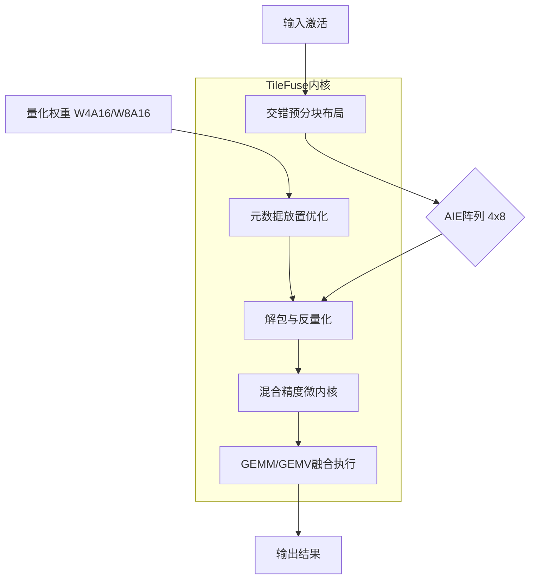
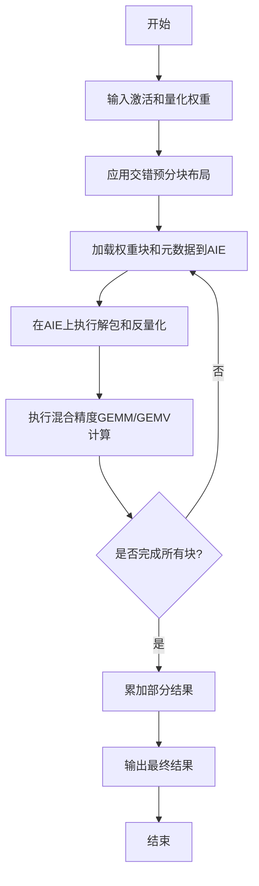
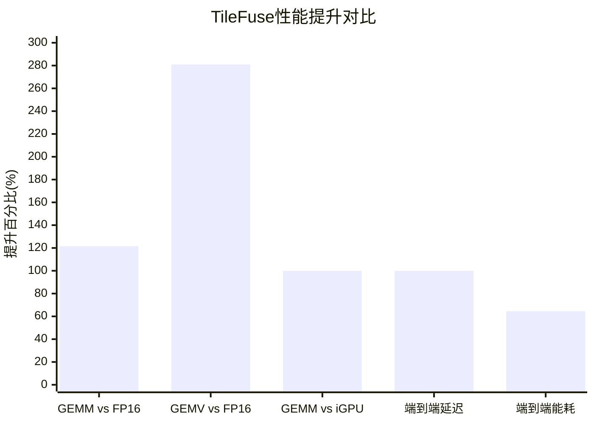

# TileFuse: A Fused Mixed-Precision Kernel Library for Efficient Quantized LLM Inference on AMD NPUs

> 本文由 paper-daily 使用 DeepSeek 自动生成，仅供快速了解论文；关键结论请以原文为准。

[论文原文](https://arxiv.org/abs/2606.11357) · [PDF](https://arxiv.org/pdf/2606.11357) · [源文件](https://github.com/vsvnakers/paper-daily/blob/master/essay_read/2026-06-11/2606.11357.md)

> TileFuse通过融合内核和协同设计，在AMD NPU上实现了对通用量化格式的高效支持，显著提升了边缘LLM推理性能和能效。

## 基本信息

| 属性 | 内容 |
|------|------|
| **作者** | Wesley Pang, Gregory Hyegang Jun, Feiyang Liu, Deming Chen |
| **来源** | [arXiv:2606.11357](https://arxiv.org/abs/2606.11357) |
| **发布日期** | 2026-06-09 |
| **抓取领域** | LLM推理 · 模型压缩 |
| **学科方向** | 分布式系统 · 人工智能 · 体系结构 |
| **arXiv 分类** | cs.DC, cs.AI, cs.AR, cs.PF |
| **适用层次** | 进阶 |
| **标签** | 混合精度推理, NPU优化, 量化LLM, 融合内核, AMD XDNA2 |
| **PDF** | [在线阅读](https://arxiv.org/pdf/2606.11357) |
| **代码仓库** | 暂无

---

## 问题的初衷（Why - 为什么要做这个研究）

【问题的初衷】随着大语言模型（Large Language Model, LLM）在边缘设备上的推理需求日益增长，系统级芯片（System-on-Chip, SoC）越来越多地集成神经网络处理单元（Neural Processing Unit, NPU）以在严格的功耗和热预算下提升性能和能效。然而，在实际部署中，将LLM高效地部署到客户端NPU上仍面临巨大挑战。广泛使用的量化格式（如AWQ，即Activation-aware Weight Quantization）无法直接映射到许多现有NPU的软件栈上，这些软件栈通常是专有的，且对底层控制暴露有限。现有方法往往迫使模型适配NPU特定的量化方案，导致精度损失或性能下降。因此，迫切需要一种能够将通用量化格式（如AWQ风格的W4A16和W8A16）高效、直接地映射到NPU硬件上的方法，以释放NPU在边缘LLM推理中的潜力，同时保持模型精度和硬件利用率。

---

## 问题的解决（What - 提出了什么方案）

【问题的解决】本文提出了TileFuse，一个面向AMD XDNA2 NPU的混合精度内核库，专门针对量化LLM推理中的Transformer线性层。TileFuse的核心创新在于将权重布局、元数据放置、混合精度微内核和阵列级数据流进行协同设计。它通过将解包（unpacking）、反量化（dequantization）和通用矩阵乘法/向量乘法（GEMM/GEMV）执行融合到单一内核流程中，避免了传统方法中分离操作带来的数据搬运和同步开销。此外，TileFuse引入了一种交错预分块布局（interleaved pre-tiling layout），支持高达32K的GEMM维度，并重新设计了GEMV数据流以充分利用4x8 AIE（AI Engine）阵列。与现有方法相比，TileFuse的本质区别在于它不是强迫模型适配NPU的特定量化方案，而是让NPU原生支持现成的量化格式，从而在保持模型精度的同时，显著提升性能和能效。

---

## 技术方法详解（How - 怎么实现的）

【技术方法详解】
- **融合内核设计**：TileFuse将解包、反量化和GEMM/GEMV执行融合到一个单一的内核流程中。这避免了传统流水线中不同阶段之间的数据搬运和同步开销，减少了内存访问次数，并提高了计算密度。
- **交错预分块布局**：为了支持大规模GEMM（维度高达32K），TileFuse提出了一种交错预分块布局。该布局将权重矩阵和激活矩阵预先分割成较小的块，并以交错方式排列，从而优化了数据在AIE阵列上的分布和访问模式，减少了数据搬运延迟。
- **GEMV数据流重设计**：针对GEMV操作（常用于自回归解码阶段），TileFuse重新设计了数据流，以充分利用XDNA2 NPU的4x8 AIE阵列。通过优化数据在阵列中的广播和累加方式，实现了更高的计算利用率和更低的延迟。
- **混合精度微内核**：TileFuse实现了针对W4A16（4位权重、16位激活）和W8A16（8位权重、16位激活）格式的混合精度微内核。这些微内核在AIE上高效执行低精度计算，同时利用高精度累加器保持数值稳定性。
- **元数据放置优化**：TileFuse优化了量化元数据（如缩放因子和零点）的放置策略，使其与权重数据紧密耦合，减少额外的内存访问，并支持高效的解包和反量化操作。

## 系统架构图

## 方法流程图

## 核心公式与算法

【核心公式】
1. 量化与反量化公式：
   $$W_{int} = \text{round}\left(\frac{W_{fp}}{s}\right) + z$$
   $$W_{fp} = s \cdot (W_{int} - z)$$
   其中 $W_{fp}$ 是全精度权重，$W_{int}$ 是量化后的整数权重，$s$ 是缩放因子，$z$ 是零点。TileFuse在AIE上高效执行反量化操作。

2. 融合GEMM操作：
   $$Y = \text{GEMM}(A, \text{dequant}(W_{int}, s, z))$$
   其中 $A$ 是激活矩阵，$W_{int}$ 是量化权重，$\text{dequant}$ 是反量化函数。TileFuse将反量化与GEMM融合，避免了中间数据存储。

3. 性能提升度量：
   $$\text{Speedup} = \frac{T_{baseline}}{T_{TileFuse}}$$
   其中 $T_{baseline}$ 是基线方法的执行时间，$T_{TileFuse}$ 是TileFuse的执行时间。

---

## 应用场景（Where - 在哪落地）

【应用场景】
1. **边缘AI助手**：在智能手机、笔记本电脑等设备上部署LLM驱动的AI助手（如智能问答、文本摘要）。TileFuse通过高效利用NPU，实现了低延迟、低功耗的推理，使得这些助手可以本地运行，无需依赖云端，从而保护用户隐私并减少网络延迟。例如，在Ryzen AI笔记本电脑上，用户可以使用本地LLM进行实时文档摘要，TileFuse将预填充延迟降低2倍，能耗降低64.6%，显著提升了用户体验。

2. **自动驾驶中的实时决策**：在自动驾驶系统中，LLM可用于理解复杂场景和生成自然语言指令。TileFuse的高效量化推理使得这些模型可以在车规级NPU上实时运行，满足严格的功耗和热约束。例如，车辆可以实时分析传感器数据并生成“前方有行人，建议减速”的指令，TileFuse确保推理延迟在毫秒级，同时能耗极低，延长了电池续航。

3. **工业物联网中的预测性维护**：在工业物联网场景中，LLM可以分析设备运行数据并预测故障。TileFuse使得这些模型可以在边缘NPU上高效运行，无需将数据上传到云端。例如，工厂中的传感器数据通过LLM分析，实时生成“设备A的轴承温度异常，建议在24小时内维护”的预警。TileFuse的低功耗特性使得该方案可以在电池供电的传感器节点上实现，降低了部署成本。

---

## 具体技术细节示例（How in Action - 算法如何执行）

【具体技术细节示例】假设我们有一个GEMM操作，输入激活矩阵 $A$ 的形状为 $[1, 4096]$（即一个token的隐藏状态），量化权重矩阵 $W_{int}$ 的形状为 $[4096, 11008]$（即FFN层的第一个线性层），采用W4A16格式（4位权重，16位激活）。

**步骤1：交错预分块布局**
TileFuse首先将权重矩阵 $W_{int}$ 分割成大小为 $[128, 128]$ 的块（tile）。由于权重是4位，每个块包含 $128 \times 128 \times 0.5 = 8192$ 字节。这些块以交错方式排列，使得相邻块在内存中连续，便于AIE阵列高效加载。

**步骤2：加载到AIE阵列**
XDNA2 NPU的AIE阵列大小为4x8，共32个AIE核心。每个AIE核心负责处理一个或多个块。例如，每个AIE核心可以处理一个 $[128, 128]$ 的权重块和对应的激活块。激活矩阵 $A$ 也被分割成 $[1, 128]$ 的块，并广播到所有AIE核心。

**步骤3：解包与反量化**
每个AIE核心加载其负责的权重块（4位整数）和对应的元数据（缩放因子 $s$ 和零点 $z$）。首先，将4位整数解包为8位整数（因为AIE原生支持8位运算）。然后，执行反量化：$W_{fp} = s \cdot (W_{int} - z)$。这里 $s$ 和 $z$ 是每个块共享的标量，因此反量化操作非常高效。

**步骤4：混合精度GEMM执行**
反量化后的权重 $W_{fp}$ 是FP16格式，激活 $A$ 也是FP16格式。AIE核心执行FP16的矩阵向量乘法（GEMV），因为激活是向量。每个AIE核心计算 $Y_{partial} = A_{block} \cdot W_{fp\_block}$，得到部分结果。

**步骤5：结果累加**
所有AIE核心的部分结果通过阵列内的累加网络进行累加，得到最终的输出向量 $Y$，形状为 $[1, 11008]$。

**输出**：最终输出向量 $Y$ 是FP16格式，可以直接用于下一层计算。整个过程中，TileFuse避免了将中间反量化结果写回全局内存，而是直接在AIE寄存器中完成所有操作，从而实现了高性能。

---

## 实验结果（Results - 效果如何）

【实验结果】论文在AMD Ryzen AI笔记本电脑上进行了实验，使用XDNA2 NPU。实验设置包括：GEMM和GEMV内核级评估，以及端到端LLM推理评估。对比基线包括全精度（FP16）实现和强大的集成GPU（iGPU）基线。在内核级评估中，TileFuse在GEMM上相比全精度基线实现了高达121.6%的性能提升，在GEMV上实现了高达281%的性能提升。与iGPU基线相比，TileFuse在GEMM上实现了超过2倍的性能和能效提升。在端到端LLM实验中，TileFuse实现了高达2.0倍的预填充延迟降低，同时能耗降低超过64.6%。这些结果证明了XDNA2 NPU是AWQ风格边缘LLM推理的实用目标，并且原生NPU支持现成量化可以显著提升NPU在真实客户端部署中的可用性。

## 实验结果可视化

---

## 优势与不足

【优势与不足】
- 优势1：提出了融合内核设计，显著减少了数据搬运和同步开销，提升了计算效率。
- 优势2：通过协同设计权重布局、元数据放置和数据流，实现了对通用量化格式（如AWQ）的原生支持，避免了模型适配NPU特定方案的精度损失。
- 优势3：在GEMM和GEMV上均取得了显著的性能提升，并在端到端LLM推理中实现了延迟和能耗的双重优化。
- 不足1：当前工作主要针对AMD XDNA2 NPU，其设计高度依赖于该硬件的特定架构（如4x8 AIE阵列），可能难以直接迁移到其他NPU架构上。
- 不足2：论文主要关注线性层的优化，对于LLM中其他关键操作（如注意力机制）的优化尚未涉及，可能限制了整体性能的进一步提升。

---

## 相关工作

【相关工作】
- **量化感知训练（Quantization-Aware Training, QAT）**：如LLM-QAT，通过训练过程减少量化误差，但需要大量计算资源。TileFuse则专注于推理阶段的优化。
- **后训练量化（Post-Training Quantization, PTQ）**：如GPTQ和AWQ，通过少量校准数据确定量化参数。TileFuse直接支持AWQ格式，无需额外适配。
- **GPU上的量化推理内核**：如vLLM和TensorRT-LLM，针对GPU架构优化量化推理。TileFuse则针对NPU架构进行定制优化。
- **NPU上的深度学习加速**：如华为昇腾和Google TPU，各有其软件栈和量化方案。TileFuse展示了在AMD NPU上实现通用量化格式的可行性。

---

## 未来研究方向

【未来方向】
1. **扩展到更多量化格式**：当前TileFuse支持W4A16和W8A16，未来可以扩展到其他格式，如W2A16或混合精度（不同层使用不同精度），以进一步压缩模型并提升性能。
2. **支持注意力机制优化**：当前工作主要针对线性层，未来可以将TileFuse的设计思想扩展到注意力机制中的矩阵乘法（如QKV投影和输出投影），实现更全面的LLM推理优化。
3. **跨NPU架构的通用化**：TileFuse的设计高度依赖于AMD XDNA2的特定架构，未来可以探索一种更通用的方法，使其能够适配不同厂商的NPU（如Intel NPU、Apple Neural Engine），从而扩大其应用范围。

---

## 一句话总结

> TileFuse通过融合内核和协同设计，在AMD NPU上实现了对通用量化格式的高效支持，显著提升了边缘LLM推理性能和能效。

---

*本解读由 DeepSeek AI 自动生成，仅供参考。*
