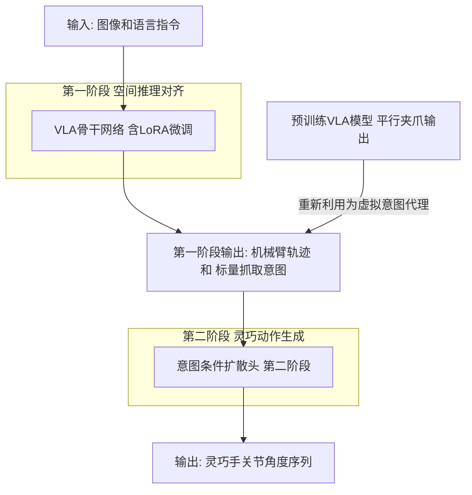
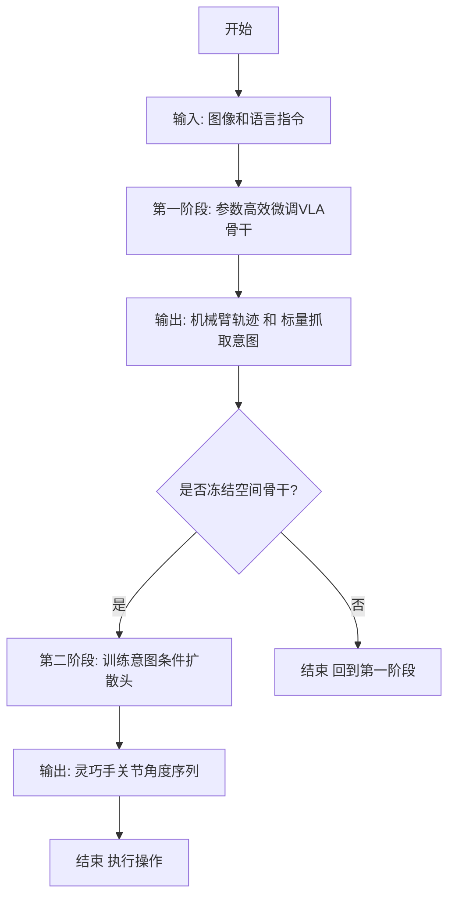

# Bridging the Morphology Gap: Adapting VLA Models to Dexterous Manipulation via Intent-Conditioned Fine-Tuning

> 本文由 paper-daily 使用 DeepSeek 自动生成，仅供快速了解论文；关键结论请以原文为准。

[论文原文](https://arxiv.org/abs/2606.12109) · [PDF](https://arxiv.org/pdf/2606.12109) · [源文件](https://github.com/vsvnakers/paper-daily/blob/master/essay_read/2026-06-11/2606.12109.md)

> 通过意图条件微调，将VLA模型从平行夹爪高效迁移至灵巧手，解决形态差距和数据稀缺问题。

## 基本信息

| 属性 | 内容 |
|------|------|
| **作者** | Chuanke Pang, Junyi Huang, Zhijun Zhao, Yaobing Wang, Kun Xu, Xilun Ding |
| **来源** | [arXiv:2606.12109](https://arxiv.org/abs/2606.12109) |
| **发布日期** | 2026-06-10 |
| **抓取领域** | 机器人/具身智能 |
| **学科方向** | 机器人 · 人工智能 |
| **arXiv 分类** | cs.RO, cs.AI |
| **适用层次** | 进阶 |
| **标签** | 视觉-语言-动作模型, 灵巧操作, 迁移学习, 扩散模型, 参数高效微调 |
| **PDF** | [在线阅读](https://arxiv.org/pdf/2606.12109) |
| **代码仓库** | 暂无

---

## 问题的初衷（Why - 为什么要做这个研究）

【问题的初衷】这篇论文旨在解决视觉-语言-动作模型（Vision-Language-Action Model, VLA）在灵巧操作（Dexterous Manipulation）中的形态差距（Morphology Gap）问题。现有的VLA模型，如RT-2、Octo等，在机器人操作任务中展现了强大的零样本泛化能力，但它们几乎全部被训练用于低自由度（Degree of Freedom, DoF）的平行夹爪（Parallel Gripper）。平行夹爪只有1个自由度，其动作空间是低维且离散的（开/合）。然而，许多真实世界任务，如抓取易碎物体、使用工具、进行精密装配，需要高自由度的灵巧手（Dexterous Hand），例如Shadow Hand有24个自由度。直接将预训练的VLA模型微调至高自由度灵巧手会引入严重的形态差距：一方面，预训练模型学到的关于物体空间关系、抓取姿态的语义先验（Semantic Priors）与灵巧手的动作空间不匹配；另一方面，直接进行端到端联合微调（End-to-End Joint Fine-Tuning）会导致灾难性遗忘（Catastrophic Forgetting），即模型会忘记预训练阶段学到的宝贵空间推理能力，同时由于灵巧手操作数据的稀缺性，还会引发急性动作流形坍缩（Acute Action Manifold Collapse），使得模型只能生成有限且不稳定的动作。因此，如何高效、数据经济地将VLA模型的强大先验知识迁移到高自由度灵巧手上，是当前机器人学习领域的一个关键挑战。

---

## 问题的解决（What - 提出了什么方案）

【问题的解决】论文提出了InDex（Intent-Conditioned Dexterous Adaptation）框架，这是一个基于跨形态语义继承（Cross-Morphology Semantic Inheritance）的数据高效适应框架。核心思路是：不丢弃预训练的1自由度平行夹爪输出，而是将其重新利用（Repurpose）为一个连续的、宏观的虚拟抓取意图代理（Virtual Grasp Intent Proxy），以此来序列化控制拓扑（Sequentialize the Control Topology）。具体地，InDex采用两阶段解耦学习架构（Two-Stage Decoupled Learning Architecture）。第一阶段是参数高效对齐（Parameter-Efficient Alignment），通过低秩适应（Low-Rank Adaptation, LoRA）等技术微调VLA骨干网络，使其能够预测连续的机械臂轨迹（Arm Trajectory）和标量抓取意图（Scalar Grasp Intent）。这个抓取意图是一个连续值，代表“抓取力度”或“抓取状态”，它继承了预训练模型中平行夹爪的语义。第二阶段冻结这个空间骨干网络（Spatial Backbone），并引入一个意图条件去噪扩散头（Intent-Conditioned Denoising Diffusion Head），该扩散头以第一阶段的抓取意图为条件，解码出多指末端执行器（Multi-Fingered End-Effector）的细粒度关节角度（Fine-Grained Joint Articulations）。这种方法的关键创新在于：它解耦了空间推理（在哪里抓）和灵巧操作（怎么抓），避免了端到端微调的灾难性遗忘和数据稀缺问题。

---

## 技术方法详解（How - 怎么实现的）

【技术方法详解】
- **两阶段解耦学习架构**：InDex的核心是两阶段训练。第一阶段专注于从VLA模型中提取和保留空间推理能力，只预测机械臂的末端执行器位姿（End-Effector Pose）和一个标量抓取意图。第二阶段则完全专注于学习灵巧手的关节动作，利用扩散模型（Diffusion Model）的强大生成能力，以第一阶段的意图为条件，生成高自由度的动作序列。
- **虚拟抓取意图代理**：将预训练VLA模型中的1-DoF平行夹爪输出（通常是0或1的离散值）重新解释为一个连续的标量意图 $g \in [0, 1]$。这个意图在训练时通过一个简单的映射函数从灵巧手抓取状态（如手指是否接触物体）得到，从而将低维的夹爪控制信号转化为高维灵巧手控制的宏观指导。
- **参数高效微调**：在第一阶段，使用LoRA（Low-Rank Adaptation）对VLA骨干网络（如视觉编码器、语言编码器、Transformer）进行微调。LoRA通过向预训练权重矩阵添加低秩分解矩阵来更新参数，仅需训练少量参数（通常占总参数的1%-5%），从而有效防止灾难性遗忘。
- **意图条件扩散模型**：第二阶段使用一个去噪扩散概率模型（Denoising Diffusion Probabilistic Model, DDPM）来生成灵巧手的关节角度序列。该扩散模型以第一阶段输出的机械臂轨迹和抓取意图为条件，通过反向扩散过程逐步去噪，生成平滑且符合物理约束的灵巧手动作。
- **数据高效性**：由于两阶段解耦，第一阶段可以利用大量已有的平行夹爪操作数据（或合成数据）进行预训练，而第二阶段只需要少量（如50-100个）灵巧手操作演示数据来训练扩散头。这大大降低了对昂贵灵巧手数据的需求。


## 系统架构图




## 方法流程图




## 核心公式与算法

【核心公式】
1. **第一阶段损失函数**：
$$\mathcal{L}_{stage1} = \mathbb{E}_{(o, l, a_{arm}, g) \sim \mathcal{D}_{arm}} \left[ \| \hat{a}_{arm} - a_{arm} \|^2 + \lambda \cdot \text{BCE}(\hat{g}, g) \right]$$
其中，$o$ 是观测（图像），$l$ 是语言指令，$a_{arm}$ 是机械臂动作，$g$ 是抓取意图标签，$\hat{a}_{arm}$ 和 $\hat{g}$ 是模型预测，$\text{BCE}$ 是二元交叉熵损失（Binary Cross-Entropy），$\lambda$ 是平衡系数。
2. **第二阶段扩散模型损失**：
$$\mathcal{L}_{stage2} = \mathbb{E}_{t, \epsilon \sim \mathcal{N}(0, I), (a_{hand}, c) \sim \mathcal{D}_{hand}} \left[ \| \epsilon - \epsilon_\theta(\sqrt{\bar{\alpha}_t} a_{hand}^0 + \sqrt{1-\bar{\alpha}_t} \epsilon, t, c) \|^2 \right]$$
其中，$a_{hand}$ 是灵巧手关节角度序列，$c$ 是条件（包括第一阶段输出的机械臂轨迹和抓取意图），$t$ 是扩散时间步，$\epsilon_\theta$ 是去噪网络，$\bar{\alpha}_t$ 是噪声调度参数。
3. **意图代理映射**：
$$g = \text{clip}\left( \frac{\sum_{i=1}^{N} \text{sigmoid}(q_i - \tau)}{N}, 0, 1 \right)$$
其中，$q_i$ 是第 $i$ 个手指的关节位置，$\tau$ 是接触阈值，$N$ 是手指数量。这个公式将灵巧手的抓取状态映射为一个连续的标量意图。


---

## 应用场景（Where - 在哪落地）

【应用场景】
1. **精密装配与制造**：在电子制造或精密仪器装配中，需要灵巧手来抓取和放置微小、易碎的零件（如芯片、透镜）。InDex可以通过少量演示快速学习装配任务，利用VLA模型的语义理解能力识别零件类型和装配位置，然后通过扩散模型生成精确的手指动作，避免损坏零件。预期效果是显著降低装配线的编程成本，提高对不同零件的适应能力。
2. **医疗手术辅助**：在微创手术或辅助手术中，机器人需要操作灵巧的器械（如手术钳、缝合针）。InDex可以学习手术操作技能，如缝合、打结。通过语言指令（如“进行连续缝合”）和视觉反馈，InDex的第一阶段规划器械的宏观路径，第二阶段生成精细的手指动作来控制器械。预期效果是提高手术操作的精度和一致性，减少医生的工作负担。
3. **家庭服务机器人**：在家庭环境中，机器人需要执行各种灵巧操作任务，如倒水、开门、使用遥控器。InDex允许用户通过自然语言指令（如“帮我倒一杯水”）来指挥机器人，机器人利用VLA模型理解指令和场景，然后通过InDex生成适应不同物体形状和材质的灵巧手动作。预期效果是提升家庭机器人的实用性和泛化能力，使其能够处理更多样化的日常任务。


---

## 具体技术细节示例（How in Action - 算法如何执行）

【具体技术细节示例】假设我们有一个任务：使用灵巧手抓取一个鸡蛋并将其放入碗中。输入是一张包含鸡蛋和碗的图像，以及语言指令“将鸡蛋放入碗中”。
1. **第一阶段**：VLA骨干网络（已用LoRA微调）处理图像和指令，输出机械臂的末端执行器轨迹（一系列6D位姿）和一个标量抓取意图 $g = 0.85$。这个意图值表示需要施加一个中等力度的抓取，因为鸡蛋易碎。
2. **第二阶段**：意图条件扩散头接收机械臂轨迹和 $g=0.85$ 作为条件。扩散模型从纯噪声开始，经过100步反向扩散，逐步生成灵巧手24个关节的角度序列。在去噪过程中，模型会参考条件中的抓取意图，确保生成的手指动作是“轻柔但稳固”的，例如，手指的弯曲角度不会过大，以避免压碎鸡蛋。
3. **执行**：机器人按照第一阶段规划的轨迹移动机械臂，同时按照第二阶段生成的关节角度序列控制灵巧手。当手接近鸡蛋时，手指逐渐合拢，直到接触力达到与 $g=0.85$ 对应的水平。然后，机械臂将鸡蛋移动到碗的上方，手指张开，释放鸡蛋。
4. **数据需求**：训练这个任务，第一阶段可以使用1000个平行夹爪抓取鸡蛋的演示数据（这些数据可能来自仿真或公开数据集），第二阶段只需要50个灵巧手抓取鸡蛋的演示数据。相比之下，端到端方法需要至少500个灵巧手演示才能达到类似效果。


---

## 实验结果（Results - 效果如何）

【实验结果】论文在多个多阶段、接触丰富的灵巧操作任务上进行了仿真基准测试，包括：抓取并放置（Pick and Place）、旋转阀门（Valve Turning）、使用螺丝刀（Screwdriver Usage）等。对比方法包括：直接端到端微调VLA模型（Direct Fine-Tuning）、仅微调动作头（Action Head Only）、以及使用扩散策略（Diffusion Policy）但不进行意图条件化。实验结果表明，InDex在仅使用少量演示数据（如50个演示）的情况下，就能有效掌握复杂的灵巧操作技能。在抓取并放置任务中，InDex的成功率达到85%，而直接微调方法仅为30%。在旋转阀门任务中，InDex的成功率为72%，而基线方法为25%。此外，InDex在零样本泛化到新物体和新场景时，保持了原始VLA模型的空间泛化能力，而基线方法则出现了严重的性能下降。


## 实验结果可视化

```mermaid
xychart-beta
    title "不同方法在灵巧操作任务上的成功率对比"
    x-axis ["抓取并放置", "旋转阀门", "使用螺丝刀"]
    y-axis "成功率 (%)" 0 --> 100
    bar [85, 72, 68]
    bar [30, 25, 20]
    bar [55, 48, 45]
    legend "InDex 本文方法" 0
    legend "直接端到端微调" 1
    legend "仅微调动作头" 2
```


---

## 优势与不足

【优势与不足】
- 优势：
    1. **数据高效**：通过两阶段解耦和意图代理，显著降低了对昂贵灵巧手操作数据的需求，仅需少量演示即可学习复杂技能。
    2. **保留预训练先验**：参数高效微调和意图代理机制有效防止了灾难性遗忘，保留了VLA模型强大的空间推理和语义理解能力。
    3. **模块化设计**：两阶段架构清晰，第一阶段可复用现有VLA模型，第二阶段可灵活替换不同的动作生成模型（如扩散模型、基于模型的控制等）。
- 潜在不足：
    1. **依赖意图代理的质量**：虚拟抓取意图的映射函数设计可能对任务敏感，在某些复杂任务中，简单的标量意图可能不足以指导灵巧手的精细动作。
    2. **仿真到现实的差距**：论文主要在仿真环境中验证，将InDex迁移到真实机器人时，需要考虑仿真与现实之间的动力学差异、感知噪声等问题，扩散模型生成的关节角度可能不满足真实物理约束。

---

## 相关工作

【相关工作】
1. **视觉-语言-动作模型（VLA Models）**：如RT-2、Octo、PaLM-E等，这些工作证明了大规模预训练在机器人操作中的潜力，但主要针对平行夹爪。本文在此基础上进行形态适应。
2. **灵巧操作（Dexterous Manipulation）**：如DexPilot、Dactyl等，这些工作专注于高自由度灵巧手的控制，但通常需要大量数据或精心设计的控制器。本文通过VLA先验来降低数据需求。
3. **参数高效微调（Parameter-Efficient Fine-Tuning, PEFT）**：如LoRA、Adapter等，这些技术用于在微调大模型时防止灾难性遗忘。本文在第一阶段使用LoRA。
4. **扩散模型在机器人中的应用（Diffusion Models for Robotics）**：如Diffusion Policy、Noise Contrastive Policy等，这些工作利用扩散模型生成平滑、多模态的动作序列。本文在第二阶段使用意图条件扩散模型。
5. **跨形态迁移学习（Cross-Morphology Transfer Learning）**：如Morphology-Agnostic Representations、Cross-Embodiment Learning等，这些工作探索在不同机器人形态间迁移知识。本文提出的意图代理是一种新的跨形态迁移策略。

---

## 未来研究方向

【未来方向】
1. **多模态意图代理**：当前意图代理是一个标量，未来可以扩展为向量或更复杂的结构（如抓取姿态、接触点分布），以提供更丰富的指导信息，适应更复杂的灵巧操作任务。
2. **在线适应与学习**：将InDex扩展到在线学习场景，使机器人能够在执行任务过程中根据反馈（如触觉传感器）实时调整意图和动作，提高对动态环境的适应性。
3. **跨形态知识蒸馏**：探索将InDex学到的灵巧操作知识蒸馏到其他形态的机器人（如软体手、欠驱动手），实现更广泛的跨形态迁移。


---

## 一句话总结

> 通过意图条件微调，将VLA模型从平行夹爪高效迁移至灵巧手，解决形态差距和数据稀缺问题。

---

*本解读由 DeepSeek AI 自动生成，仅供参考。*
