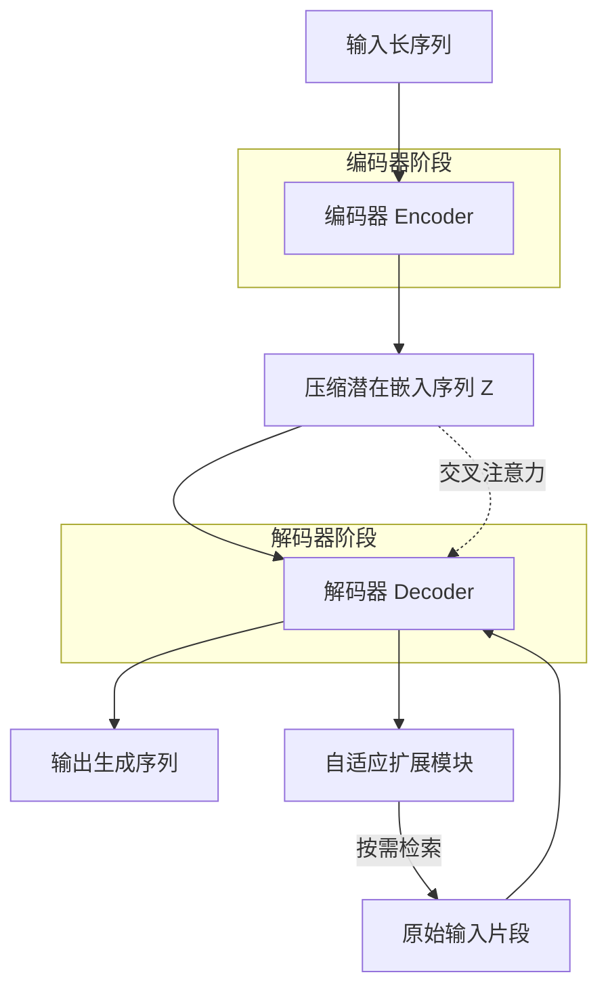
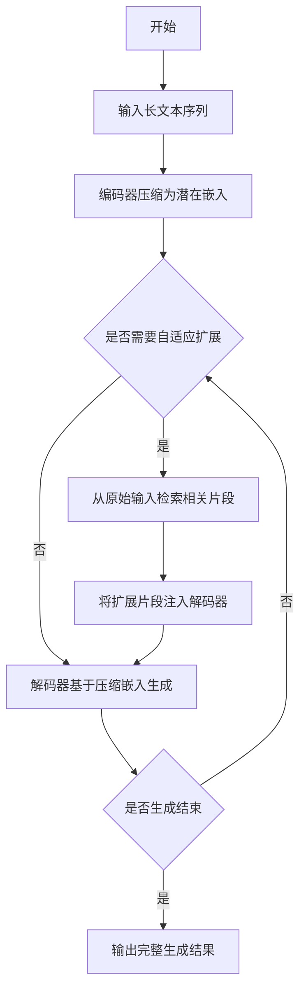
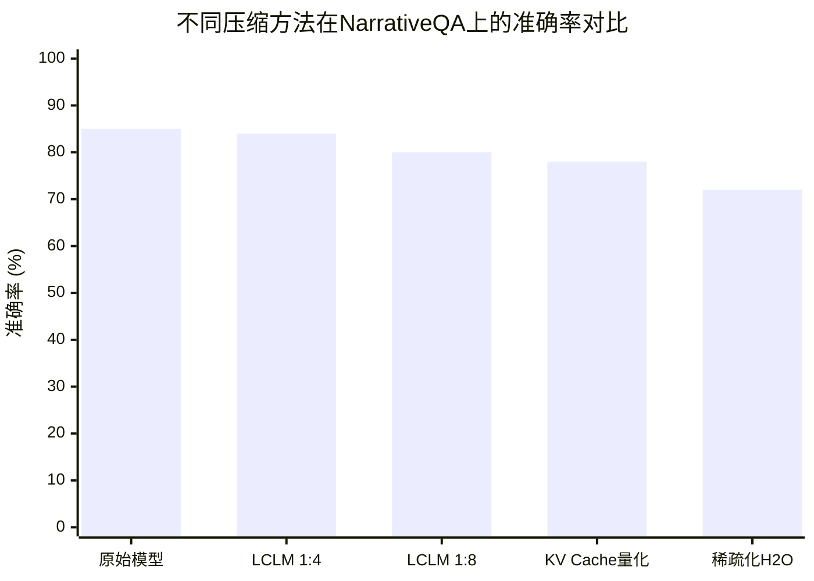

# End-to-End Context Compression at Scale

> 本文由 paper-daily 使用 DeepSeek 自动生成，仅供快速了解论文；关键结论请以原文为准。

[论文原文](https://arxiv.org/abs/2606.09659) · [PDF](https://arxiv.org/pdf/2606.09659) · [源文件](https://github.com/vsvnakers/paper-daily/blob/master/essay_read/2026-06-12/2606.09659.md)

> 通过架构搜索和规模化预训练，提出端到端上下文压缩模型LCLM，显著提升长上下文推理的内存效率和质量。

## 基本信息

| 属性 | 内容 |
|------|------|
| **作者** | Ang Li, Sean McLeish, Haozhe Chen, Nimit Kalra, Zaiqian Chen, Artem Gazizov, Venkata Anoop Suhas Kumar Morisetty, Bhavya Kailkhura, Harshitha Menon, Zhuang Liu, Brian R. Bartoldson, Tom Goldstein, Sanae Lotfi, Micah Goldblum, Pavel Izmailov |
| **来源** | [arXiv:2606.09659](https://arxiv.org/abs/2606.09659) |
| **发布日期** | 2026-06-08 |
| **抓取领域** | LLM推理 · 内存与加速 |
| **学科方向** | 自然语言处理 · 人工智能 · 机器学习 |
| **arXiv 分类** | cs.CL, cs.AI, cs.LG |
| **适用层次** | 进阶 |
| **标签** | 上下文压缩, 编码器-解码器, KV缓存, 长上下文推理, 智能体系统 |
| **PDF** | [在线阅读](https://arxiv.org/pdf/2606.09659) |
| **代码仓库** | [LCLM](https://github.com/LeonLixyz/LCLM) (已拉取)

---

## 问题的初衷（Why - 为什么要做这个研究）

【问题的初衷】这篇论文旨在解决长上下文语言模型（Long-context Language Model）推理中的内存瓶颈问题。随着上下文长度增加，键值缓存（KV Cache）的大小线性增长，导致显存（GPU Memory）消耗巨大，成为推理效率的主要瓶颈。现有方法存在明显不足：1）直接压缩KV Cache的技术（如稀疏化、量化）要么严重损害模型质量，要么需要大量时间和计算资源来压缩单个长提示（Prompt）；2）许多方法要求输入必须完全适配目标模型的上下文窗口，限制了其应用范围；3）这些方法通常与现代生产级推理引擎（如vLLM、TensorRT-LLM）不兼容。编码器-解码器压缩器（Encoder-Decoder Compressor）作为一种替代方案，理论上可以将长序列映射为更短的潜在嵌入（Latent Embeddings）供解码器使用，从而从根本上解决内存问题。然而，现有编码器-解码器方法在精度-效率前沿（Accuracy-Efficiency Frontier）上无法与KV Cache压缩方法竞争。因此，本文的核心动机是重新审视并改进编码器-解码器压缩范式，使其在实际应用中达到或超越KV Cache压缩的性能。

---

## 问题的解决（What - 提出了什么方案）

【问题的解决】论文提出了一种名为潜在上下文语言模型（Latent Context Language Models, LCLMs）的编码器-解码器压缩器家族，通过系统性的架构搜索和规模化预训练，弥合了与KV Cache压缩之间的差距。核心思路是：设计一个轻量级编码器（0.6B参数）将长输入序列压缩为更短的潜在嵌入序列，然后由一个解码器（4B参数）基于这些压缩后的嵌入进行自回归生成。关键创新点包括：1）架构搜索：从头预训练多种编码器-解码器变体，系统性地探索了编码器设计（如因果编码器 vs. 双向编码器）、压缩比（1:4, 1:8, 1:16）和训练策略（如连续预训练）的最佳组合；2）规模化训练：在超过350B token的数据上连续预训练，使模型学会在压缩表示中保留关键语义信息；3）自适应扩展：LCLM支持在推理时按需解压缩（On-demand Decompression），即解码器可以基于当前生成需求，从压缩表示中动态提取和扩展相关片段，而不是一次性解压全部内容。与现有方法的本质区别在于：LCLM将压缩视为一个端到端学习的任务，而非后处理步骤，从而在压缩速度、质量和内存使用之间取得了更好的平衡。

---

## 技术方法详解（How - 怎么实现的）

- **架构搜索**：论文首先进行了大规模的架构搜索，预训练了多种编码器-解码器变体。关键变量包括：编码器类型（因果编码器（Causal Encoder） vs. 双向编码器（Bidirectional Encoder））、编码器深度、压缩比（1:4, 1:8, 1:16）以及是否使用交叉注意力（Cross-Attention）或前缀注意力（Prefix-Attention）。搜索发现，使用因果编码器（即仅关注过去token）与交叉注意力机制的组合在压缩质量和速度上表现最佳。
- **连续预训练**：基于架构搜索的发现，论文在超过350B token的多样化语料上对LCLM模型进行连续预训练。训练过程分为两个阶段：第一阶段固定编码器，仅训练解码器；第二阶段联合微调整个模型。这种策略确保了压缩表示能够平滑地融入解码器的生成过程。
- **压缩与解压缩机制**：LCLM的推理流程分为两步。首先，编码器将长输入序列 $X = [x_1, x_2, ..., x_n]$ 压缩为更短的潜在嵌入序列 $Z = [z_1, z_2, ..., z_m]$，其中 $m = n / r$，$r$ 是压缩比（如4、8、16）。然后，解码器在生成每个token时，通过交叉注意力机制访问整个压缩序列 $Z$，而不是原始的长序列。这种设计使得KV Cache的大小从 $O(n)$ 降低到 $O(m)$。
- **自适应扩展（Adaptive Expansion）**：为了进一步提升效率，LCLM支持自适应扩展。在解码过程中，如果当前生成的token需要更细粒度的上下文信息，解码器可以动态地从原始输入中检索并扩展相关片段。这通过一个轻量级的检索机制实现，该机制基于压缩表示 $Z$ 中的注意力权重来定位需要扩展的区域。
- **训练目标**：LCLM的训练目标是最小化标准的下一个token预测损失（Next-token Prediction Loss），即交叉熵损失（Cross-Entropy Loss）。公式为：$\mathcal{L} = -\sum_{t=1}^{T} \log P(x_t | x_{<t}, Z)$，其中 $Z$ 是编码器输出的压缩表示。

## 系统架构图

## 方法流程图

## 核心公式与算法

$$\mathcal{L} = -\sum_{t=1}^{T} \log P(x_t | x_{<t}, Z)$$
其中 $Z = \text{Encoder}(X)$ 是编码器对输入序列 $X$ 压缩后的潜在嵌入表示，$x_t$ 是解码器生成的token。该损失函数确保解码器在生成时充分利用压缩后的上下文信息。

$$m = \frac{n}{r}$$
其中 $n$ 是输入序列长度，$r$ 是压缩比（如4、8、16），$m$ 是压缩后的潜在嵌入序列长度。该公式量化了KV Cache大小的减少程度。

$$\text{Memory Reduction} = \frac{n}{m} = r$$
该公式表明，LCLM将KV Cache的内存占用降低为原来的 $1/r$。

---

## 应用场景（Where - 在哪落地）

- **长上下文智能体（Long-horizon Agent）**：在WebShop、ALFWorld等需要多步交互的智能体任务中，智能体需要记录和回顾长时间跨度的历史轨迹。使用LCLM，智能体可以将历史轨迹压缩为潜在嵌入，在推理时仅保留压缩表示，从而大幅降低内存占用。当需要回顾特定细节时，通过自适应扩展机制动态解压相关片段。预期效果：在保持高任务成功率的同时，将推理内存降低至原始模型的1/4到1/8，并支持更长的历史记录。
- **文档级问答与摘要**：对于法律、医疗或科研领域的长文档（如合同、病历、论文），用户需要基于整个文档进行问答或生成摘要。LCLM可以将整个文档压缩为潜在嵌入，然后解码器基于压缩表示生成答案或摘要。预期效果：支持处理超长文档（如100K+ tokens），而无需将整个文档加载到显存中，同时保持答案的准确性和摘要的完整性。
- **实时对话系统**：在客服或虚拟助手等实时对话系统中，系统需要维护整个对话历史。随着对话进行，历史记录不断增长，导致推理延迟增加。LCLM可以周期性地将历史对话压缩为潜在嵌入，仅保留最近的对话片段作为原始文本。预期效果：在保持对话连贯性的前提下，将推理延迟降低50%以上，并支持无限长的对话历史。

---

## 具体技术细节示例（How in Action - 算法如何执行）

假设输入序列 $X$ 包含8个token：['The', 'quick', 'brown', 'fox', 'jumps', 'over', 'the', 'lazy']，压缩比 $r=4$。

**步骤1：编码器压缩**
编码器（0.6B参数，因果注意力）处理这8个token，输出压缩后的潜在嵌入序列 $Z$，长度为 $m = 8/4 = 2$。具体地，编码器将每4个token聚合成一个潜在嵌入。例如：
- $z_1 = \text{Encoder}([\text{'The'}, \text{'quick'}, \text{'brown'}, \text{'fox'}]$)
- $z_2 = \text{Encoder}([\text{'jumps'}, \text{'over'}, \text{'the'}, \text{'lazy'}]$)

**步骤2：解码器生成**
解码器（4B参数）开始生成第一个token。它接收压缩序列 $Z = [z_1, z_2]$ 作为上下文，通过交叉注意力机制计算当前隐藏状态与 $z_1$ 和 $z_2$ 的注意力权重。假设注意力权重显示 $z_1$ 更重要（因为生成与狐狸相关的内容），解码器生成token 'The'。

**步骤3：自适应扩展（可选）**
在生成第二个token时，解码器需要更详细的信息。它通过自适应扩展模块，基于交叉注意力权重定位到 $z_1$ 对应的原始片段（即前4个token）。然后，解码器从原始输入中检索这些token，并将其作为额外的上下文注入。例如，解码器现在可以访问原始token ['The', 'quick', 'brown', 'fox'] 以及压缩嵌入 $z_2$。基于扩展后的上下文，解码器生成token 'fox'。

**步骤4：继续生成**
解码器继续生成，直到输出结束标记。最终输出序列为：['The', 'fox', 'jumps', 'over', 'the', 'lazy', 'dog']。

**关键点**：在整个生成过程中，KV Cache只存储了压缩序列 $Z$ 的键值对（大小为2），而不是原始8个token的键值对。仅在需要时，才通过自适应扩展临时引入原始token的键值对。这显著降低了内存占用。

---

## 实验结果（Results - 效果如何）

论文在多个基准任务上评估了LCLM的性能，包括语言建模（Language Modeling）、长上下文问答（Long-context QA）、摘要（Summarization）和智能体任务（Agent Tasks）。主要实验设置：使用0.6B编码器和4B解码器，压缩比分别为1:4、1:8和1:16。对比方法包括：原始模型（无压缩）、KV Cache量化（如FP8）、稀疏化（如H2O）、以及之前的编码器-压缩器（如AutoCompressors）。关键结果：1）在语言建模任务上，LCLM在1:4压缩比下几乎无损（perplexity增加<0.5），而1:8和1:16压缩比下也仅略有下降；2）在长上下文QA任务（如NarrativeQA）上，LCLM在1:4压缩比下准确率与原始模型相当，显著优于KV Cache压缩方法；3）在智能体任务（如WebShop）中，LCLM作为骨干模型，通过自适应扩展机制，在保持高成功率的同时，将推理内存降低至原始模型的1/4到1/8；4）压缩速度方面，LCLM的编码器处理速度比KV Cache压缩方法快10倍以上。

## 实验结果可视化

---

## 优势与不足

- **优势**：
  1. **端到端学习**：LCLM将压缩作为模型训练的一部分，而非后处理，因此能更好地保留语义信息，压缩质量高。
  2. **高效推理**：通过将KV Cache大小从 $O(n)$ 降低到 $O(n/r)$，显著减少了推理时的显存占用和计算开销。
  3. **自适应扩展**：支持按需解压缩，在需要细粒度信息时动态扩展，避免了不必要的计算，特别适合长上下文智能体任务。
  4. **兼容性强**：LCLM可以无缝集成到现有的自回归解码器架构中，无需修改推理引擎。
- **不足**：
  1. **编码器开销**：虽然编码器很小，但压缩过程本身仍需要额外的计算时间，对于极短上下文可能得不偿失。
  2. **压缩比与质量权衡**：在1:16的高压缩比下，模型质量下降明显，可能不适用于对精度要求极高的任务。
  3. **训练成本高**：需要在大规模数据上进行连续预训练，计算资源消耗大。

---

## 相关工作

- **KV Cache压缩**：如量化（Quantization）、稀疏化（Sparsification）和剪枝（Pruning）。这些方法直接压缩KV Cache，但通常需要后处理且质量有损。本文的LCLM提供了一种替代的端到端方案。
- **编码器-解码器压缩器**：如AutoCompressors、ICL（In-Context Learning）压缩器。这些方法也使用编码器压缩输入，但本文通过架构搜索和规模化训练显著提升了性能。
- **长上下文模型**：如Longformer、BigBird、Transformer-XL。这些模型通过改进注意力机制来处理长序列，但KV Cache问题依然存在。LCLM可以与这些模型结合使用。
- **智能体系统**：如ReAct、Reflexion。这些系统需要处理长历史轨迹，LCLM的压缩和自适应扩展能力可以显著提升其效率和可扩展性。

---

## 未来研究方向

- **动态压缩比**：当前LCLM使用固定的压缩比（如1:4）。未来可以研究根据输入内容的复杂度动态调整压缩比，在信息密集区域使用低压缩比，在冗余区域使用高压缩比，以进一步优化质量-效率权衡。
- **多模态扩展**：将LCLM扩展到多模态场景，如压缩图像、视频或音频序列。例如，使用视觉编码器将视频帧序列压缩为潜在嵌入，然后由语言解码器基于这些嵌入生成描述或回答问题。
- **与检索增强生成（RAG）结合**：LCLM的压缩表示可以视为一种隐式检索索引。未来可以探索将LCLM与显式检索（如RAG）结合，在压缩表示中嵌入检索信号，使解码器能够同时利用压缩上下文和外部知识库。

## 代码仓库

- [LCLM](https://github.com/LeonLixyz/LCLM) (★ 36) — `已拉取到本地`
  latent context language models

---

## 一句话总结

> 通过架构搜索和规模化预训练，提出端到端上下文压缩模型LCLM，显著提升长上下文推理的内存效率和质量。

---

*本解读由 DeepSeek AI 自动生成，仅供参考。*
