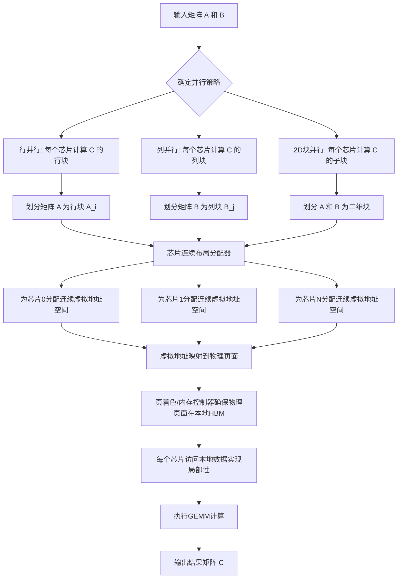
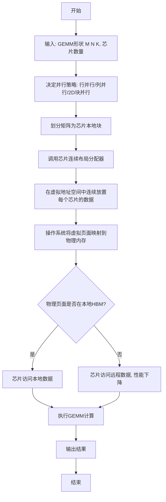
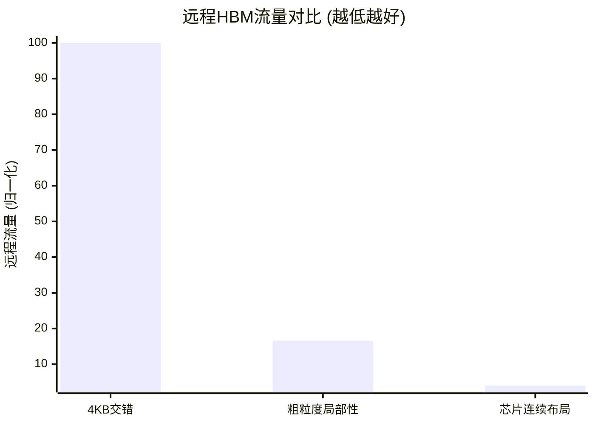

# Making Locality-aware GEMM Compatible with Page-Granularity Placement on Chiplet GPUs

> 本文由 paper-daily 使用 DeepSeek 自动生成，仅供快速了解论文；关键结论请以原文为准。

[论文原文](https://arxiv.org/abs/2606.11718) · [PDF](https://arxiv.org/pdf/2606.11718) · [源文件](https://github.com/vsvnakers/paper-daily/blob/master/essay_read/2026-06-12/2606.11718.md)

> 提出芯片连续布局，通过软件层面的内存重排，使局部性感知数据放置与页面粒度管理兼容，大幅减少多芯片GPU的远程内存访问。

## 基本信息

| 属性 | 内容 |
|------|------|
| **作者** | Euijun Chung, Jae Hyung Ju, Hyesoon Kim |
| **来源** | [arXiv:2606.11718](https://arxiv.org/abs/2606.11718) |
| **发布日期** | 2026-06-10 |
| **抓取领域** | 自然语言处理 |
| **学科方向** | 体系结构 |
| **arXiv 分类** | cs.AR |
| **适用层次** | 进阶 |
| **标签** | 多芯片GPU, 局部性感知, 内存布局, GEMM, 大语言模型 |
| **PDF** | [在线阅读](https://arxiv.org/pdf/2606.11718) |
| **代码仓库** | 暂无

---

## 问题的初衷（Why - 为什么要做这个研究）

【问题的初衷】随着人工智能（AI）和大语言模型（LLM）的快速发展，对计算能力和内存带宽的需求呈指数级增长。为了突破单个芯片的制造良率和面积限制，多芯片模块（Multi-chiplet GPU）架构应运而生，它将多个较小的芯片（chiplet）通过先进封装技术集成在一起，以扩展计算吞吐量和高带宽内存（HBM）容量。然而，这种架构引入了非一致内存访问（NUMA）特性：每个芯片（chiplet）拥有其本地HBM，访问本地内存的延迟和带宽远优于访问其他芯片的远程内存。因此，数据局部性（data locality）——即让计算发生在数据所在的芯片上——对于GPU的性能和能效至关重要。现有方法通过局部性感知调度（locality-aware scheduling）和数据放置（data placement）来识别哪些数据应驻留在每个芯片附近。然而，在通用矩阵乘法（GEMM）这一核心计算任务中，局部性感知的数据放置与操作系统（OS）和硬件强制要求的固定页面粒度（page-granularity）数据交错（interleaving）策略存在根本性冲突。因为最优的跨芯片数据映射粒度（granularity）在不同工作负载（如不同形状的LLM GEMM）之间差异巨大，固定页面粒度（如4KB）要么导致大量远程访问，要么无法充分利用局部性。现有粗粒度局部性感知放置方法（如将整个矩阵行或列分配给一个芯片）虽然能提升局部性，但会与页面粒度交错机制不兼容，导致实现复杂或性能受限。因此，亟需一种新的内存布局方案，既能实现局部性感知的数据放置，又能与现有的页面粒度内存管理机制兼容。

---

## 问题的解决（What - 提出了什么方案）

【问题的解决】论文提出了一种名为“芯片连续布局”（Chiplet-Contiguous Layout）的全局内存布局方案。其核心思路是：将每个芯片（chiplet）本地需要访问的数据在全局虚拟地址空间中连续存储（contiguously stored）。具体来说，对于GEMM操作中的输入矩阵（如 $A$ 和 $B$），根据其计算模式（如行并行或列并行），将矩阵划分为多个块（tile），每个块分配给一个芯片。然后，在全局内存中，属于同一个芯片的所有数据块被连续地放置在一起。这种布局的关键创新在于：它使得局部性感知的数据放置能够与操作系统和硬件强制要求的页面粒度（如4KB）交错机制兼容。因为数据是连续存储的，操作系统可以简单地将一个连续的虚拟地址范围映射到物理内存中，而物理内存的页面可以自然地分布在多个芯片的HBM上。通过精心设计布局，可以确保每个芯片的本地数据在物理上也尽可能本地化，从而在不修改操作系统或硬件的情况下，实现了局部性感知放置与页面粒度放置的兼容。与现有方法相比，其本质区别在于：它不是试图改变页面交错策略，而是改变数据在虚拟地址空间中的排列顺序，使其与期望的物理放置对齐。

---

## 技术方法详解（How - 怎么实现的）

【技术方法详解】
- **核心思想：芯片连续布局**：对于给定的GEMM操作 $C = A \times B$，根据并行策略（如行并行：每个芯片计算 $C$ 的一部分行），确定每个芯片需要访问的 $A$ 和 $B$ 的子矩阵。然后，在全局虚拟地址空间中，将属于同一个芯片的所有 $A$ 和 $B$ 的数据块连续排列。例如，对于行并行，芯片 $i$ 负责计算 $C_i = A_i \times B$，其中 $A_i$ 是 $A$ 的行块。那么，在布局中，所有 $A_i$ 的数据块被连续放置，所有 $B$ 的数据（因为 $B$ 被所有芯片共享）也被连续放置，但 $B$ 的局部性可能通过复制或广播优化。
- **与页面粒度兼容**：操作系统以页面（如4KB）为单位管理虚拟到物理的映射。由于芯片连续布局将每个芯片的数据连续存储，一个连续的虚拟地址范围可以映射到物理内存中。通过利用现代GPU的页着色（page coloring）或内存控制器（memory controller）的地址映射策略，可以确保这些连续的虚拟页面被映射到对应芯片的本地HBM物理页面上，从而实现局部性。
- **适应不同GEMM形状**：LLM中的GEMM形状多样（如 $M \times K$ 和 $K \times N$ 的矩阵乘法）。论文分析了不同形状下最优的数据放置策略（如行并行、列并行、2D块并行）。芯片连续布局可以灵活地适应这些策略，只需根据并行策略调整数据在虚拟地址空间中的排列顺序。
- **无需修改OS/硬件**：该方案完全在软件层面实现，通过修改内存分配器（memory allocator）或运行时系统（runtime system）来创建芯片连续布局。它不改变操作系统的页面管理机制，也不改变GPU硬件的内存访问路径，因此具有很好的兼容性和可部署性。
- **与粗粒度局部性放置对比**：现有粗粒度方法（如将整个矩阵行分配给一个芯片）虽然也实现了局部性，但会导致内存碎片化，且与页面粒度交错不兼容。芯片连续布局通过更精细的块级连续存储，避免了这些问题，同时实现了更高的局部性。

## 系统架构图

## 方法流程图

## 核心公式与算法

【核心公式】
1. **GEMM操作定义**：
   $$C_{M \times N} = A_{M \times K} \times B_{K \times N}$$
   这是论文优化的基本计算任务，其中 $M$、$N$、$K$ 是矩阵维度。

2. **行并行下的数据划分**：
   对于 $P$ 个芯片，矩阵 $A$ 被划分为 $P$ 个行块：
   $$A = [A_0; A_1; \dots; A_{P-1}]$$
   其中 $A_i$ 的维度为 $(M/P) \times K$。每个芯片 $i$ 计算 $C_i = A_i \times B$。

3. **远程流量减少因子**：
   假设默认4KB交错下远程流量比例为 $R_{default}$，芯片连续布局下为 $R_{proposed}$，则减少因子为：
   $$\text{Reduction Factor} = \frac{R_{default}}{R_{proposed}}$$
   论文实验结果显示该因子可达24.7倍。

---

## 应用场景（Where - 在哪落地）

【应用场景】
1. **大语言模型推理服务**：在云端部署的多芯片GPU服务器上运行LLM推理（如Qwen、Llama）。推理过程中，主要的计算瓶颈是GEMM操作（如全连接层）。通过应用芯片连续布局，可以确保每个芯片在计算其负责的矩阵块时，所需数据大部分位于本地HBM中，从而大幅减少跨芯片远程内存访问。这将显著降低推理延迟（latency），提升吞吐量（throughput），并降低功耗。例如，在Llama 3.1 70B模型上，该方法可将远程流量减少19.2倍，直接转化为更快的响应时间和更高的并发请求处理能力。
2. **大语言模型训练**：LLM训练涉及大量前向和反向传播中的GEMM操作。训练通常采用数据并行（data parallelism）和模型并行（model parallelism）混合策略。芯片连续布局可以优化模型并行中的GEMM，例如在张量并行（tensor parallelism）中，每个芯片负责计算输出矩阵的一部分。通过将每个芯片所需的输入矩阵块连续放置，可以加速训练过程中的矩阵乘法，减少通信开销（因为远程访问本质上是隐式通信）。这将缩短训练时间，降低训练成本。
3. **高性能计算（HPC）中的密集线性代数**：除了LLM，许多HPC应用（如气候模拟、分子动力学）也依赖于大规模GEMM操作。在多芯片GPU集群中，这些应用同样面临NUMA问题。芯片连续布局可以作为一种通用的内存优化技术，应用于这些科学计算库（如cuBLAS、MAGMA），提升其在多芯片系统上的性能，而无需修改应用代码。

---

## 具体技术细节示例（How in Action - 算法如何执行）

【具体技术细节示例】
假设一个多芯片GPU系统有2个芯片（Chiplet 0和Chiplet 1）。我们要执行一个GEMM操作：$C_{4 \times 4} = A_{4 \times 4} \times B_{4 \times 4}$，采用行并行策略，即Chiplet 0计算 $C$ 的前2行，Chiplet 1计算 $C$ 的后2行。

**步骤1：确定并行策略和数据划分**
- 并行策略：行并行。
- 划分：$A$ 被划分为两个行块：$A_0$（前2行，维度 $2 \times 4$）和 $A_1$（后2行，维度 $2 \times 4$）。$B$ 被所有芯片共享（维度 $4 \times 4$）。

**步骤2：创建芯片连续布局**
- 在全局虚拟地址空间中，我们分配一块连续的内存区域。
- 首先，放置Chiplet 0的数据：将 $A_0$ 的所有元素（2行 * 4列 = 8个浮点数）连续存储。例如，地址范围 [0x1000, 0x1020) 存储 $A_0$。
- 然后，放置Chiplet 1的数据：将 $A_1$ 的所有元素（8个浮点数）连续存储，紧跟在 $A_0$ 之后。例如，地址范围 [0x1020, 0x1040) 存储 $A_1$。
- 最后，放置共享数据 $B$：将 $B$ 的所有元素（16个浮点数）连续存储。例如，地址范围 [0x1040, 0x1080) 存储 $B$。

**步骤3：物理页面映射**
- 操作系统将虚拟页面映射到物理页面。假设页面大小为4KB。
- 通过页着色或内存控制器策略，确保虚拟页面 [0x1000, 0x1020) 映射到Chiplet 0的本地HBM物理页面。
- 虚拟页面 [0x1020, 0x1040) 映射到Chiplet 1的本地HBM物理页面。
- 虚拟页面 [0x1040, 0x1080) 可以映射到任意芯片，或者通过复制（replication）在每个芯片本地都有一份副本。

**步骤4：执行计算**
- Chiplet 0执行计算：它需要访问 $A_0$（在本地HBM）和 $B$（可能在本地或远程）。由于 $A_0$ 在本地，访问速度快。
- Chiplet 1执行计算：它需要访问 $A_1$（在本地HBM）和 $B$。同样，$A_1$ 在本地。

**输出**：
- 每个芯片计算得到 $C$ 的一部分，最终组合成完整的 $C_{4 \times 4}$。
- 相比4KB交错（其中 $A$ 的元素可能随机分布在两个芯片的HBM上），芯片连续布局确保了每个芯片的本地数据在物理上也是本地的，从而避免了大量的远程访问。

---

## 实验结果（Results - 效果如何）

【实验结果】论文在代表大语言模型（LLM）推理和训练的GEMM工作负载上进行了评估，这些工作负载来自Qwen 3 30B和Llama 3.1 70B模型。实验平台是一个模拟的多芯片GPU系统，包含4个芯片（chiplet），每个芯片有本地HBM。对比方法包括：1）4KB页面粒度交错（4KB interleaving），这是默认的OS页面放置策略；2）粗粒度局部性感知放置（coarse locality-aware placement），例如将整个矩阵行分配给一个芯片。关键实验结果：芯片连续布局（Chiplet-Contiguous Layout）在Qwen 3 30B的GEMM上，平均减少了24.7倍的远程HBM流量（相对于4KB交错），在Llama 3.1 70B上减少了19.2倍。相对于粗粒度局部性感知放置，分别减少了4.1倍和2.1倍的远程流量。此外，论文还展示了该方法在不同GEMM形状（如不同的M、N、K维度）下的鲁棒性，以及其带来的端到端性能提升（如加速比）。这些结果充分证明了芯片连续布局在减少远程内存访问、提升数据局部性方面的显著优势。

## 实验结果可视化

---

## 优势与不足

【优势与不足】
**优势：**
1. **兼容性强**：无需修改操作系统或硬件，仅通过软件层面的内存布局调整即可实现，易于部署到现有系统。
2. **显著提升局部性**：在多种LLM GEMM形状下，大幅减少了远程HBM流量（最高达24.7倍），从而提升性能和能效。
3. **适应性强**：能够灵活适应不同的并行策略（行、列、2D块并行），覆盖了LLM中常见的GEMM形状。
4. **细粒度控制**：相比粗粒度方法，芯片连续布局通过块级连续存储，实现了更精细的局部性控制，避免了内存碎片。

**不足：**
1. **依赖物理映射**：其效果依赖于操作系统或内存控制器能否将连续的虚拟页面映射到本地物理页面。如果物理映射无法保证（如内存压力大时），局部性收益可能下降。
2. **分配开销**：创建芯片连续布局需要修改内存分配器，可能引入额外的分配和初始化开销，尤其是在动态创建和销毁大量GEMM工作负载时。
3. **仅适用于GEMM**：该方法专门针对GEMM操作设计，对于其他不规则计算模式（如图计算、稀疏计算）可能不适用或效果有限。

---

## 相关工作

【相关工作】
1. **多芯片GPU架构与NUMA管理**：如AMD的Infinity Fabric和NVIDIA的NVLink-C2C，这些工作研究了多芯片系统的互连和内存层次结构，为本文提供了背景。
2. **局部性感知调度与数据放置**：如Locality-Aware Scheduling和Data Placement策略，这些方法尝试将计算调度到数据所在的芯片，但通常与页面粒度管理不兼容。
3. **内存页面交错策略**：如4KB、2MB页面交错，这些是OS和硬件默认的内存放置策略，本文旨在与之兼容。
4. **GEMM优化**：如cuBLAS、MAGMA等库中的GEMM优化，本文在其基础上增加了局部性感知的内存布局。
5. **大语言模型推理优化**：如FlashAttention、vLLM等，这些工作优化了LLM的注意力机制和内存管理，本文关注的是其底层的GEMM操作。

---

## 未来研究方向

【未来方向】
1. **动态布局调整**：当前方法针对静态GEMM形状进行布局优化。未来可以研究如何动态调整芯片连续布局，以适应运行时变化的GEMM形状（如LLM推理中的动态批处理）。
2. **扩展到稀疏计算**：将芯片连续布局的思想扩展到稀疏矩阵乘法（SpGEMM）或稀疏注意力机制，其中数据访问模式更不规则，需要更复杂的局部性优化。
3. **与编译器集成**：将芯片连续布局集成到编译器（如TVM、MLIR）中，使其能够自动分析计算图，为每个GEMM操作生成最优的芯片连续布局，从而无需手动干预。

---

## 一句话总结

> 提出芯片连续布局，通过软件层面的内存重排，使局部性感知数据放置与页面粒度管理兼容，大幅减少多芯片GPU的远程内存访问。

---

*本解读由 DeepSeek AI 自动生成，仅供参考。*
