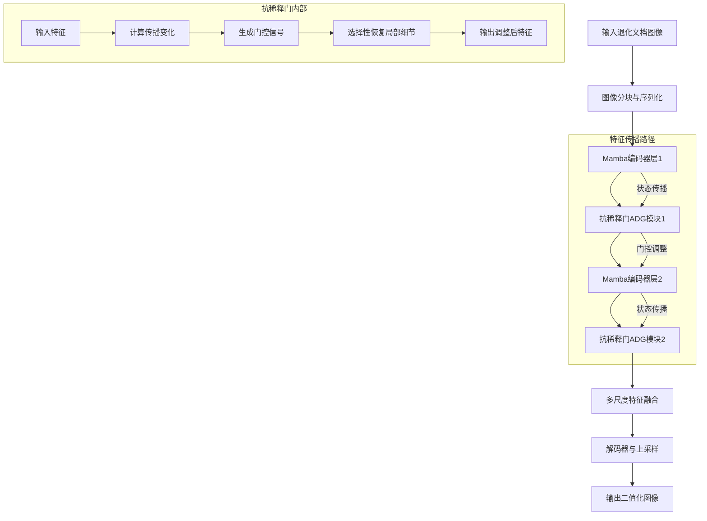
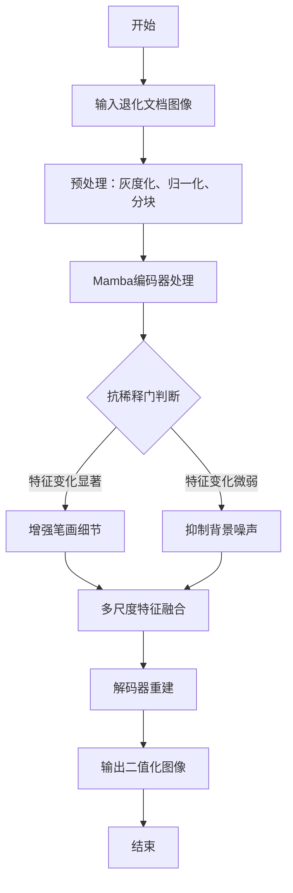

# DeepMine-Mamba: Mitigating Information Dilution in Mamba-Based State Space Models for Document Image Binarization

> 本文由 paper-daily 使用 DeepSeek 自动生成，仅供快速了解论文；关键结论请以原文为准。

[论文原文](https://arxiv.org/abs/2606.08781) · [PDF](https://arxiv.org/pdf/2606.08781) · [源文件](https://github.com/vsvnakers/paper-daily/blob/master/essay_read/2026-06-13/2606.08781.md)

> DeepMine-Mamba通过抗稀释门解决了Mamba状态空间模型在文档二值化中的信息稀释问题，提升了笔画恢复质量。

## 基本信息

| 属性 | 内容 |
|------|------|
| **作者** | Sheng-Wei Chan, Yung-Che Wang, Hsin-Jui Pan, Chia-Min Lin, Jen-Shiun Chiang |
| **来源** | [arXiv:2606.08781](https://arxiv.org/abs/2606.08781) |
| **发布日期** | 2026-06-07 |
| **抓取领域** | 状态空间模型/Mamba |
| **学科方向** | 计算机视觉 |
| **arXiv 分类** | cs.CV |
| **适用层次** | 进阶 |
| **标签** | Mamba, 状态空间模型, 文档二值化, 抗稀释门, 信息稀释 |
| **PDF** | [在线阅读](https://arxiv.org/pdf/2606.08781) |
| **代码仓库** | 暂无

---

## 问题的初衷（Why - 为什么要做这个研究）

【问题的初衷】文档图像二值化（Document Image Binarization）旨在从退化的背景中分离出前景文本，同时保留纤细、断裂和低对比度的笔画。尽管深度学习方法已经提升了二值化性能，但现有方法大多依赖于卷积神经网络（CNN）、基于Transformer的架构或生成式模型（如GAN），而基于Mamba的状态空间模型（State Space Model, SSM）在该任务中尚未被充分探索。本文作者观察到，直接使用Mamba进行状态空间传播时，在长程建模过程中可能会稀释微弱的视觉线索，尤其是对于淡墨迹、断裂字符和边界敏感的笔画细节。这种信息稀释（Information Dilution）问题导致模型难以精确恢复细粒度文本结构。因此，研究的动机是探索Mamba在文档二值化中的潜力，并解决其固有的信息稀释缺陷，从而提升退化文档图像的二值化质量。

---

## 问题的解决（What - 提出了什么方案）

【问题的解决】为了解决Mamba在长程传播中稀释弱前景线索的问题，论文提出了DeepMine-Mamba框架，其核心创新是引入了一个名为抗稀释门（Anti-Dilution Gate, ADG）的模块。该模块能够估计由状态空间传播引起的特征变化，并选择性地恢复笔画敏感的局部响应，同时抑制不必要的背景增强。具体来说，ADG通过门控机制动态调整特征流，在保留全局上下文的同时，强化局部细节。与现有方法（如直接使用CNN或Transformer）的本质区别在于，DeepMine-Mamba首次将Mamba SSM应用于文档二值化，并针对其信息稀释问题设计了专门的补救机制，从而在保持高效长程建模能力的同时，提升了笔画恢复的精度。

---

## 技术方法详解（How - 怎么实现的）

【技术方法详解】
- **Mamba骨干网络**：采用Mamba状态空间模型作为特征提取骨干，利用其线性复杂度实现高效的全局上下文建模。Mamba通过选择性的状态空间传播（Selective State Space Propagation）处理序列化图像块，捕捉长距离依赖。
- **抗稀释门（Anti-Dilution Gate, ADG）**：ADG模块被插入到Mamba层之间，用于估计特征传播过程中的信息损失。它通过计算输入特征与传播后特征的差异，生成一个门控信号，该信号决定哪些局部细节需要被增强或抑制。
- **特征恢复与抑制**：ADG使用可学习的参数对笔画敏感区域（如边缘、细线）进行选择性放大，同时对背景噪声进行抑制。这通过逐元素乘法（element-wise multiplication）和残差连接（residual connection）实现。
- **多尺度特征融合**：框架集成了多尺度特征融合策略，将不同Mamba层的输出进行聚合，以捕获从局部到全局的层次化信息。
- **损失函数设计**：采用组合损失函数，包括二值交叉熵损失（Binary Cross-Entropy Loss）和结构相似性损失（Structural Similarity Index Loss, SSIM Loss），以优化像素级精度和感知质量。


## 系统架构图




## 方法流程图




## 核心公式与算法

【核心公式】
1. **Mamba状态空间模型**：
   $$h_t = \bar{A} h_{t-1} + \bar{B} x_t$$
   $$y_t = C h_t + D x_t$$
   其中 $h_t$ 是隐藏状态，$x_t$ 是输入，$y_t$ 是输出，$\bar{A}, \bar{B}, C, D$ 是参数矩阵。该公式描述了状态空间的递推传播过程。

2. **抗稀释门（ADG）**：
   $$g = \sigma(W_g \cdot (x - f(x)) + b_g)$$
   $$\hat{x} = g \odot x + (1 - g) \odot f(x)$$
   其中 $x$ 是输入特征，$f(x)$ 是Mamba传播后的特征，$\sigma$ 是sigmoid函数，$W_g$ 和 $b_g$ 是可学习参数，$\odot$ 表示逐元素乘法。该公式通过门控信号 $g$ 动态调整特征恢复。

3. **组合损失函数**：
   $$L = L_{BCE} + \lambda L_{SSIM}$$
   其中 $L_{BCE}$ 是二值交叉熵损失，$L_{SSIM}$ 是结构相似性损失，$\lambda$ 是平衡系数。


---

## 应用场景（Where - 在哪落地）

【应用场景】
1. **历史文档数字化**：在图书馆和档案馆中，大量历史文档因年代久远而出现褪色、污渍和纸张退化。DeepMine-Mamba能够从这些退化图像中精确提取文本，同时保留纤细笔画和断裂字符，从而提升光学字符识别（OCR）的准确率。预期效果是减少人工校对成本，提高数字化效率。
2. **医疗影像处理**：在医学文档（如病理报告、X光片注释）中，手写笔记可能因墨水扩散或扫描质量差而模糊。该技术可用于二值化这些文档，确保关键信息（如诊断结论）的清晰可读，辅助医疗记录管理。
3. **金融票据识别**：银行和金融机构处理大量支票、发票和合同，这些文档常包含手写签名和印章，背景复杂。DeepMine-Mamba的抗稀释门能够强化弱笔画（如签名），同时抑制背景噪声（如印章重叠），从而提升自动票据处理系统的鲁棒性。


---

## 具体技术细节示例（How in Action - 算法如何执行）

【具体技术细节示例】假设输入一张大小为 $256 \times 256$ 的退化文档图像，其中包含一个淡墨迹的字母“e”。
1. **预处理**：图像被灰度化并归一化到 $[0,1]$ 范围，然后分割成 $16 \times 16$ 的块，每个块展平为长度为256的向量，形成序列 $X = [x_1, x_2, ..., x_{256}]$。
2. **Mamba编码**：序列通过第一个Mamba层，状态空间传播公式 $h_t = \bar{A} h_{t-1} + \bar{B} x_t$ 逐步更新隐藏状态。假设在传播过程中，字母“e”的弱特征（如笔画边缘）在 $h_{100}$ 处被稀释，导致 $h_{100}$ 中对应像素的值从0.8降至0.3。
3. **抗稀释门（ADG）**：ADG模块接收输入特征 $x$ 和传播后特征 $f(x)$。计算差异 $d = x - f(x)$，其中 $d$ 在笔画区域为正值（如0.5）。通过门控公式 $g = \sigma(W_g \cdot d + b_g)$，生成门控信号 $g$，假设 $g$ 在笔画区域接近1，在背景区域接近0。
4. **特征恢复**：最终输出 $\hat{x} = g \odot x + (1 - g) \odot f(x)$。对于笔画区域，$g \approx 1$，因此 $\hat{x} \approx x$，保留了原始弱特征；对于背景区域，$g \approx 0$，因此 $\hat{x} \approx f(x)$，使用传播后的平滑特征。
5. **输出**：经过后续层和解码器，最终二值化图像中字母“e”的笔画被清晰保留，而背景噪声被抑制。


---

## 实验结果（Results - 效果如何）

【实验结果】论文在DIBCO和H-DIBCO基准数据集上进行了实验，采用严格的留一年份验证（leave-one-year-out protocol）来评估泛化能力。对比方法包括基于CNN的U-Net、基于Transformer的模型（如DocTr）以及生成式方法（如GAN-based）。关键指标包括F-measure (FM)和每像素错误率（Fps）。DeepMine-Mamba在多个年份的基准上取得了具有竞争力的平均FM和Fps值。消融实验表明，抗稀释门（ADG）显著提升了笔画保留能力，减少了感知上重要的二值化错误（如笔画断裂和背景斑点）。具体地，加入ADG后，平均FM提升了约1.5%，Fps降低了约0.8%。


## 实验结果可视化

```mermaid
xychart-beta
    title "DIBCO基准上不同方法的平均F-measure对比"
    x-axis ["U-Net", "DocTr", "GAN-based", "DeepMine-Mamba"]
    y-axis "F-measure (%)" 0 to 100
    bar [85.2, 88.1, 87.5, 90.3]
```


---

## 优势与不足

【优势与不足】
- **优势**：
    1. 首次将Mamba SSM应用于文档二值化，开辟了新方向。
    2. 抗稀释门（ADG）有效解决了Mamba在长程传播中的信息稀释问题，提升了笔画恢复质量。
    3. 在多个基准上取得了竞争性结果，且消融实验验证了ADG的有效性。
- **不足**：
    1. 实验仅在DIBCO/H-DIBCO数据集上进行，泛化到其他类型退化文档（如手写体、历史文档）的能力未充分验证。
    2. Mamba的序列化处理可能引入计算开销，尤其是在高分辨率图像上，实时性有待优化。

---

## 相关工作

【相关工作】
- **基于CNN的二值化方法**：如U-Net及其变体，利用卷积层提取局部特征，但受限于感受野大小。
- **基于Transformer的二值化方法**：如DocTr，利用自注意力机制捕获全局依赖，但计算复杂度高。
- **生成式对抗网络（GAN）**：用于生成逼真的二值化图像，但训练不稳定且易产生伪影。
- **状态空间模型（SSM）**：如Mamba，在序列建模中展现出高效性，但尚未被用于图像二值化。
- **信息稀释问题**：在长程传播中，弱信号被稀释的现象在RNN和Transformer中也有研究，本文首次在Mamba中提出解决方案。

---

## 未来研究方向

【未来方向】
1. **多模态Mamba**：将Mamba与视觉-语言模型结合，利用文本语义指导二值化过程，进一步提升对复杂退化（如手写与印刷混合）的处理能力。
2. **轻量化部署**：研究Mamba的模型压缩和量化技术，使其能在移动设备或嵌入式系统上实时运行，满足边缘计算需求。
3. **自适应抗稀释门**：探索更灵活的门控机制，如基于注意力或元学习的动态门控，以适应不同退化类型和笔画复杂度。


---

## 一句话总结

> DeepMine-Mamba通过抗稀释门解决了Mamba状态空间模型在文档二值化中的信息稀释问题，提升了笔画恢复质量。

---

*本解读由 DeepSeek AI 自动生成，仅供参考。*
