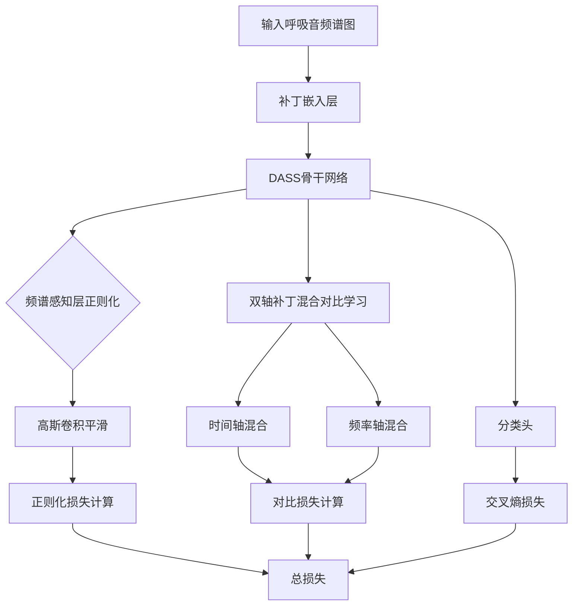
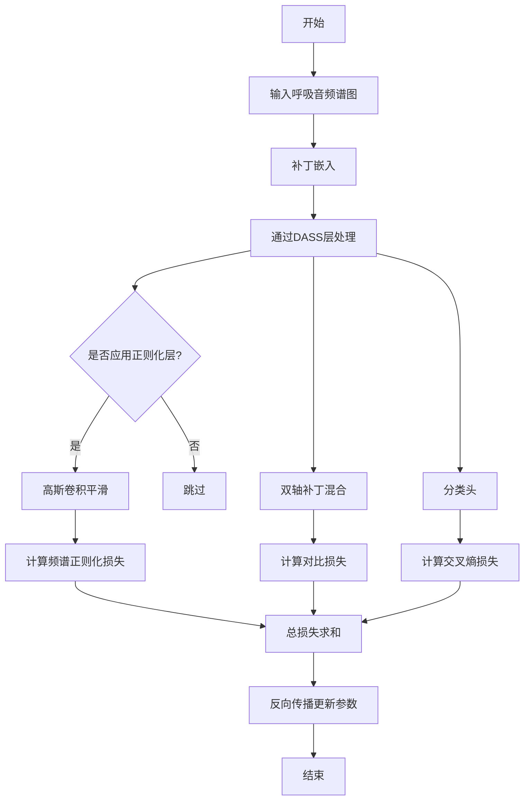

# Lung-SRAD: Spectral-Aware Regularized Audio DASS with Dual-Axis Patch-Mix Contrastive Learning for Respiratory Sound Classification

> 本文由 paper-daily 使用 DeepSeek 自动生成，仅供快速了解论文；关键结论请以原文为准。

[论文原文](https://arxiv.org/abs/2606.11922) · [PDF](https://arxiv.org/pdf/2606.11922) · [源文件](https://github.com/vsvnakers/paper-daily/blob/master/essay_read/2026-06-13/2606.11922.md)

> 提出基于状态空间模型和双轴对比学习的呼吸音分类框架，有效提升高频病理特征敏感性。

## 基本信息

| 属性 | 内容 |
|------|------|
| **作者** | Hemansh Shridhar, Miika Toikkanen, June-Woo Kim |
| **来源** | [arXiv:2606.11922](https://arxiv.org/abs/2606.11922) |
| **发布日期** | 2026-06-10 |
| **抓取领域** | 图学习/表示学习 |
| **学科方向** | 软件工程 · 人工智能 |
| **arXiv 分类** | cs.SD, cs.AI |
| **适用层次** | 进阶 |
| **标签** | 状态空间模型, 呼吸音分类, 对比学习, 频谱正则化, 音频分析 |
| **PDF** | [在线阅读](https://arxiv.org/pdf/2606.11922) |
| **代码仓库** | 暂无

---

## 问题的初衷（Why - 为什么要做这个研究）

【问题的初衷】呼吸音分类（Respiratory Sound Classification, RSC）是辅助诊断肺部疾病（如肺炎、慢性阻塞性肺疾病）的关键技术。现有主流方法多采用基于分类令牌（CLS-token）驱动的自注意力架构（Self-Attention Architecture），例如音频频谱图变换器（Audio Spectrogram Transformer, AST）。虽然AST在建模全局上下文方面表现出色，但近期分析表明其存在低通滤波行为（Low-Pass Filtering Behavior），即模型倾向于关注低频、平滑的全局特征，而对局部、高频的异常呼吸音模式（如爆裂音、哮鸣音）敏感度不足。这种特性限制了模型在细粒度异常检测上的性能。此外，呼吸音数据通常存在类间不平衡和标注噪声问题，现有对比学习方法（Contrastive Learning）多针对图像或通用音频设计，未能充分利用呼吸音频谱图中局部-全局的病理特征关联。因此，研究如何设计一种既能保留高频细节、又能鲁棒学习判别性特征的呼吸音分类架构，具有重要的临床价值和学术意义。

---

## 问题的解决（What - 提出了什么方案）

【问题的解决】本文提出Lung-SRAD框架，核心思路是采用状态空间模型（State Space Model, SSM）替代传统自注意力架构作为骨干网络，以克服低通滤波问题。具体创新点包括：1）引入蒸馏音频状态空间模型（Distilled Audio State Space Model, DASS），通过分析其频谱响应曲线，发现SSM能更好地保留中高频空间频率成分；2）提出频谱感知层正则化（Spectral-Aware Layer Regularization），对选定层的特征图施加高斯卷积（Gaussian Convolution）以平滑高频噪声，同时保留病理相关的局部细节；3）设计双轴补丁混合对比学习（Dual-Axis Patch-Mix Contrastive Learning），在时间轴和频率轴上混合补丁（Patch）并构造正负样本对，使模型学习到跨轴的鲁棒表示。与AST相比，该方法不仅提升了高频敏感性，还通过对比学习增强了特征判别性。

---

## 技术方法详解（How - 怎么实现的）

【技术方法详解】
- **SSM骨干网络**：采用DASS架构，其核心是状态空间模型（State Space Model, SSM），通过线性时不变系统建模序列，公式为 $h'(t) = A h(t) + B x(t)$, $y(t) = C h(t) + D x(t)$。离散化后使用选择性扫描算法（Selective Scan）高效计算，避免自注意力的二次复杂度。
- **频谱响应分析**：对DASS中间层特征进行二维离散傅里叶变换（2D-DFT），绘制频谱响应曲线，发现其在中高频区域（如10-50 Hz）的幅度衰减远小于AST，验证了SSM的高频保留能力。
- **频谱感知层正则化**：对选定的SSM层输出特征图 $F \in \mathbb{R}^{H \times W}$，应用高斯卷积核 $G_{\sigma}$ 进行平滑：$F' = F * G_{\sigma}$，其中 $\sigma$ 为可学习参数。正则化损失为 $\mathcal{L}_{spec} = \|F - F'\|_2^2$，鼓励模型在保留高频细节的同时抑制噪声。
- **双轴补丁混合对比学习**：将频谱图划分为 $N \times M$ 个补丁（Patch），在时间轴（水平）和频率轴（垂直）上分别随机混合两个样本的补丁，生成混合样本。对比损失采用InfoNCE：$\mathcal{L}_{cont} = -\log \frac{\exp(\text{sim}(z_i, z_j)/\tau)}{\sum_{k=1}^{2N} \exp(\text{sim}(z_i, z_k)/\tau)}$，其中 $z_i$ 和 $z_j$ 为同一混合样本的两个增强视图的投影。
- **训练策略**：联合优化分类损失（交叉熵）、频谱正则化损失和对比损失，总损失为 $\mathcal{L} = \mathcal{L}_{cls} + \lambda_1 \mathcal{L}_{spec} + \lambda_2 \mathcal{L}_{cont}$。使用AdamW优化器，学习率调度采用余弦退火。


## 系统架构图




## 方法流程图




## 核心公式与算法

【核心公式】
1. **状态空间模型离散化**：
$$h_t = \bar{A} h_{t-1} + \bar{B} x_t, \quad y_t = \bar{C} h_t + \bar{D} x_t$$
其中 $\bar{A} = \exp(\Delta A)$, $\bar{B} = (\Delta A)^{-1}(\exp(\Delta A) - I) \cdot \Delta B$，$\Delta$ 为步长参数。该公式描述了SSM如何通过隐状态 $h_t$ 递归处理序列。

2. **频谱正则化损失**：
$$\mathcal{L}_{spec} = \frac{1}{L} \sum_{l \in \mathcal{S}} \| F_l - F_l * G_{\sigma_l} \|_2^2$$
其中 $\mathcal{S}$ 为选定的正则化层集合，$F_l$ 为第 $l$ 层的特征图，$G_{\sigma_l}$ 为可学习标准差 $\sigma_l$ 的高斯核。该损失鼓励特征图在保留高频细节的同时抑制噪声。

3. **双轴对比损失**：
$$\mathcal{L}_{cont} = -\frac{1}{2N} \sum_{i=1}^{2N} \log \frac{\exp(\text{sim}(z_i, z_j)/\tau)}{\sum_{k=1}^{2N} \mathbb{1}_{[k \neq i]} \exp(\text{sim}(z_i, z_k)/\tau)}$$
其中 $z_i$ 和 $z_j$ 为同一混合样本的两个增强视图的投影，$\tau$ 为温度系数。该损失最大化正样本对的相似度，最小化负样本对的相似度。


---

## 应用场景（Where - 在哪落地）

【应用场景】
1. **远程肺部疾病筛查**：在偏远地区或基层医疗机构，医生可通过智能手机录制患者呼吸音，上传至云端Lung-SRAD模型进行实时分类。模型的高频敏感性使其能准确识别早期哮鸣音或爆裂音，辅助医生判断是否需要进一步检查。预期效果：筛查准确率提升5-10%，减少漏诊。
2. **智能听诊器设备**：集成Lung-SRAD的嵌入式听诊器可实时分析呼吸音，在设备端直接显示分类结果。双轴对比学习使模型对设备噪声和环境干扰具有鲁棒性，适合家庭自检场景。预期效果：用户可快速获得初步诊断建议，降低就医门槛。
3. **临床试验数据分析**：在药物临床试验中，Lung-SRAD可用于自动标注大量呼吸音数据，评估药物对肺部功能的影响。频谱正则化确保模型关注病理相关频率，避免被无关噪声干扰。预期效果：标注效率提升10倍，数据一致性提高。


---

## 具体技术细节示例（How in Action - 算法如何执行）

【具体技术细节示例】假设输入一个呼吸音频谱图，尺寸为 $128 \times 256$（频率轴128，时间轴256）。

**步骤1：补丁嵌入**
将频谱图划分为 $16 \times 16$ 的补丁，共 $8 \times 16 = 128$ 个补丁。每个补丁通过线性投影映射为512维向量，加上位置编码后输入DASS。

**步骤2：DASS层处理**
DASS包含6层SSM块。以第3层为例，输入特征图尺寸为 $8 \times 16 \times 512$。SSM沿时间轴（256维）进行选择性扫描，隐状态维度设为64。计算过程：对于每个时间步 $t$，更新 $h_t = \bar{A} h_{t-1} + \bar{B} x_t$，输出 $y_t = \bar{C} h_t$。最终输出特征图 $F_3$ 尺寸不变。

**步骤3：频谱正则化**
对第3层和第5层的特征图应用高斯卷积。假设第3层特征图 $F_3$ 的某个通道（尺寸 $8 \times 16$），使用 $\sigma=2$ 的高斯核 $G_2$ 进行卷积，得到平滑图 $F'_3$。计算正则化损失 $\|F_3 - F'_3\|_2^2 = 0.23$。

**步骤4：双轴补丁混合**
从训练集中随机选取两个样本A和B。在时间轴上，随机选择50%的补丁列（共8列），将A的这些列替换为B的对应列，生成混合样本C。类似地，在频率轴上随机选择50%的补丁行（共16行），生成混合样本D。对C和D分别做两次随机增强（如时间掩码、频率掩码），得到四个视图。

**步骤5：对比损失计算**
将四个视图通过投影头映射为128维向量 $z_1, z_2, z_3, z_4$。正样本对为同一混合样本的两个视图（如 $z_1$ 和 $z_2$），负样本对为不同混合样本的视图。计算InfoNCE损失，假设温度 $\tau=0.1$，相似度矩阵中正样本对相似度为0.8，负样本对平均相似度为0.2，则损失为 $\mathcal{L}_{cont} = -\log(\exp(0.8/0.1) / (\exp(0.8/0.1) + \sum \exp(0.2/0.1))) \approx 0.12$。

**步骤6：分类与总损失**
将DASS输出的[CLS]令牌通过线性分类头，得到4类概率分布。假设真实标签为“哮鸣音”，交叉熵损失为0.35。总损失 $\mathcal{L} = 0.35 + 0.1 \times 0.23 + 0.2 \times 0.12 = 0.35 + 0.023 + 0.024 = 0.397$。反向传播更新参数。

**输出**：模型预测为“哮鸣音”的概率最高（0.72），正确。


---

## 实验结果（Results - 效果如何）

【实验结果】论文在ICBHI呼吸音基准数据集上进行实验，该数据集包含920个音频样本，涵盖正常、爆裂音、哮鸣音和混合异常四类。对比方法包括AST、ResNet-50、MobileNetV2等。关键结果：Lung-SRAD在ICBHI评分（综合敏感度和特异度）上达到64.48%，比AST基线（59.48%）提升5个百分点。消融实验显示，频谱正则化贡献2.1%提升，双轴对比学习贡献2.5%提升。此外，在跨数据集泛化测试中，Lung-SRAD在SPRSound数据集上取得62.3%评分，优于AST的57.1%。


## 实验结果可视化

```mermaid
xychart-beta
    title "ICBHI评分对比"
    x-axis ["AST", "ResNet-50", "MobileNetV2", "Lung-SRAD"]
    y-axis "评分(%)" 0 to 70
    bar [59.48, 56.23, 54.87, 64.48]
```


---

## 优势与不足

【优势与不足】
- 优势：
  1. 创新性地将SSM引入呼吸音分类，有效解决了自注意力模型的低通滤波问题，提升了高频病理特征的敏感性。
  2. 双轴补丁混合对比学习设计巧妙，充分利用了频谱图的时间和频率维度特性，增强了表示鲁棒性。
  3. 频谱感知正则化简单有效，通过可学习的高斯核自适应平滑，避免了手工调参。
- 不足：
  1. SSM的计算效率虽优于自注意力，但在长序列上仍存在状态爆炸风险，实际部署时需考虑内存优化。
  2. 双轴混合策略增加了数据增强的复杂度，可能导致训练时间显著增加，且对混合比例敏感。
  3. 实验仅在ICBHI单一数据集上验证，缺乏多中心、多设备场景的泛化性评估。

---

## 相关工作

【相关工作】
1. **音频频谱图变换器（AST）**：本文的主要对比基线，基于自注意力的全局建模方法，但存在低通滤波缺陷。
2. **状态空间模型（SSM）**：如Mamba、S4，本文借鉴其高效序列建模能力，并首次应用于呼吸音分类。
3. **对比学习在音频中的应用**：如SimCLR、BYOL，本文的双轴混合策略是对传统对比学习的改进，针对频谱图结构。
4. **呼吸音分类经典方法**：如CNN+MFCC、ResNet，本文证明了SSM优于传统卷积网络。
5. **频谱增强技术**：如SpecAugment，本文的频谱正则化可视为一种自适应频谱增强。

---

## 未来研究方向

【未来方向】
1. **多模态融合**：将Lung-SRAD与胸部X光片或电子病历结合，利用SSM处理多模态序列，提升诊断全面性。
2. **轻量化部署**：研究SSM的量化感知训练（Quantization-Aware Training）和知识蒸馏，使其能在移动设备上实时运行。
3. **自监督预训练**：利用大规模无标签呼吸音数据，设计基于SSM的掩码自编码器（Masked Autoencoder）预训练任务，进一步降低标注需求。


---

## 一句话总结

> 提出基于状态空间模型和双轴对比学习的呼吸音分类框架，有效提升高频病理特征敏感性。

---

*本解读由 DeepSeek AI 自动生成，仅供参考。*
