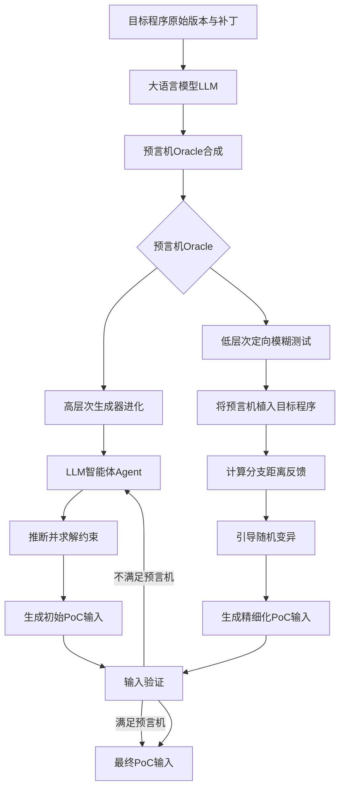
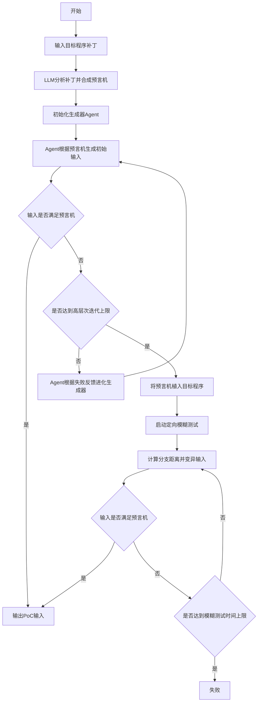
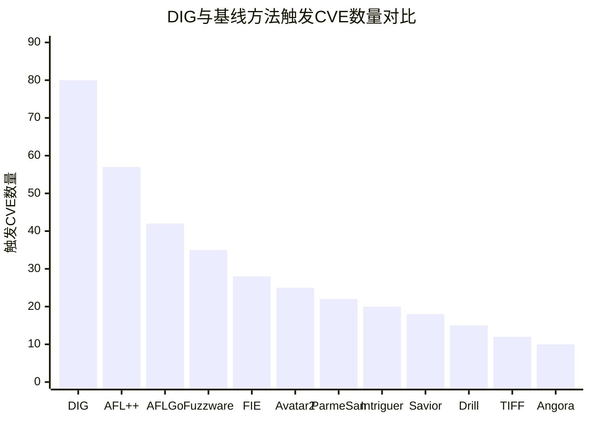

# DIG: Oracle-Guided Directed Input Generation for One-Day Vulnerabilities

> 本文由 paper-daily 使用 DeepSeek 自动生成，仅供快速了解论文；关键结论请以原文为准。

[论文原文](https://arxiv.org/abs/2606.13037) · [PDF](https://arxiv.org/pdf/2606.13037) · [源文件](https://github.com/vsvnakers/paper-daily/blob/master/essay_read/2026-06-14/2606.13037.md)

> DIG通过利用LLM从补丁中合成可执行预言机，引导智能体与模糊测试协同工作，高效生成已知漏洞的PoC输入。

## 基本信息

| 属性 | 内容 |
|------|------|
| **作者** | Andrew Bao, Haochen Zeng, Peng Chen, Stephen McCamant, Pen-Chung Yew |
| **来源** | [arXiv:2606.13037](https://arxiv.org/abs/2606.13037) |
| **发布日期** | 2026-06-11 |
| **抓取领域** | 自然语言处理 |
| **学科方向** | 安全加密 · 软件工程 |
| **arXiv 分类** | cs.CR, cs.SE |
| **适用层次** | 前沿 |
| **标签** | 已知漏洞, 定向输入生成, 大语言模型, 模糊测试, 预言机 |
| **PDF** | [在线阅读](https://arxiv.org/pdf/2606.13037) |
| **代码仓库** | 暂无

---

## 问题的初衷（Why - 为什么要做这个研究）

【问题的初衷】软件安全领域，已知漏洞（One-Day Vulnerability）是指已被公开披露但尚未被广泛修复的漏洞。由于补丁部署的延迟或不完整性，这些漏洞构成了持续且重大的安全威胁。为了评估漏洞的真实影响并加速补丁的部署，安全分析师需要生成能够触发该漏洞的概念验证（Proof-of-Concept, PoC）输入。然而，生成PoC输入是一项极具挑战性的任务，其核心难点在于：1) 识别触发漏洞所必需的一系列约束条件（Necessary Constraints）；2) 高效地求解这些约束以生成满足条件的输入。现有的定向模糊测试（Directed Fuzzing）方法，如AFLGo，虽然能够引导输入朝着目标代码位置执行，但它们并未显式地识别或求解这些约束，而是依赖于目标距离（Target-Distance）反馈和随机变异，导致效率低下。另一方面，基于大语言模型（LLM）的智能体（Agent）方法，如由LLM驱动的代码推理和结构化输入生成，展现出巨大潜力，但在处理需要长序列推理（Long-Horizon Reasoning）的复杂任务时，容易发生目标漂移（Goal Drift），即智能体在推理过程中偏离了原始目标，从而限制了其有效性。因此，亟需一种新的方法，能够显式地利用漏洞补丁中蕴含的丰富信息，高效、准确地生成PoC输入。

---

## 问题的解决（What - 提出了什么方案）

【问题的解决】DIG（Oracle-Guided Directed Input Generation）论文提出了一种新颖的、由预言机（Oracle）引导的定向输入生成方法。其核心洞察在于：针对已知漏洞的补丁（Patch）通常揭示了触发该漏洞所必需的前提条件。DIG利用这一关键特性，通过以下两步解决上述问题：首先，DIG使用大语言模型（LLM）分析补丁，并综合生成一个“预言机”（Oracle）。这个预言机将补丁中隐含的、触发漏洞的必要条件显式地表达出来，例如，一个特定的函数调用序列、某个变量的值必须满足某个范围等。其次，DIG利用这个预言机在两个层面指导PoC生成：1) 在高层次（High-Level），DIG执行预言机引导的生成器进化（Oracle-Guided Generator Evolution）。一个LLM智能体（Agent）根据预言机推断出需要满足的约束，并主动求解这些约束，从而生成一个初始的、可能满足条件的输入。2) 在低层次（Low-Level），DIG将预言机作为探针（Instrumentation）植入目标程序，并使用分支距离（Branch-Distance）反馈来引导定向模糊测试中的随机变异。这使得模糊测试能够更精细地调整输入，以精确满足预言机所指定的条件。与现有方法相比，DIG的本质区别在于：它不再盲目地搜索或依赖脆弱的推理，而是将补丁知识显式化为一个可执行的、可引导的预言机，从而将复杂的PoC生成问题分解为两个更可控的子问题：约束推断与求解（由智能体完成）和精细调优（由模糊测试完成）。

---

## 技术方法详解（How - 怎么实现的）

【技术方法详解】DIG的技术方法是一个结合了LLM智能体、符号化约束求解和定向模糊测试的混合系统。其核心流程如下：

- **补丁分析与预言机合成（Patch Analysis & Oracle Synthesis）**：DIG首先将目标程序的原始版本和补丁版本输入给一个LLM（如GPT-4）。LLM被提示（Prompted）分析代码差异，并识别出触发漏洞所需的关键条件。这些条件被形式化为一个“预言机”（Oracle），它是一个可执行的断言（Assertion）或检查函数。例如，预言机可以检查：`if (x > 10 && y == 0) { trigger_vulnerability(); }`。
- **高层次生成器进化（High-Level Generator Evolution）**：DIG维护一个“生成器”（Generator），它本质上是一个LLM智能体，负责生成初始的PoC输入。该智能体接收预言机作为输入，并尝试推断出满足预言机所需的输入结构（如文件格式、网络包结构）和具体数值。如果生成的输入未能满足预言机，智能体会根据失败反馈（如“变量x的值是5，但需要大于10”）进行迭代修正，这个过程称为“进化”。
- **低层次定向模糊测试（Low-Level Directed Fuzzing）**：DIG将预言机作为探针植入目标程序。当程序执行时，探针会计算当前执行路径与满足预言机所需路径之间的“分支距离”（Branch Distance）。例如，如果预言机要求执行`if (x > 10)`的真分支，而当前执行走了假分支，则分支距离为`|x - 10|`。DIG使用这个分支距离作为适应度函数（Fitness Function），引导模糊测试的变异过程，使得输入逐渐接近并最终满足预言机条件。
- **协同工作流**：高层次智能体负责生成“有希望”的初始输入，而低层次模糊测试则负责对这些输入进行“微调”，以精确满足那些智能体难以精确控制的复杂数值或路径约束。这种协同机制避免了智能体在长序列推理中的目标漂移，也弥补了模糊测试在初始种子生成上的盲目性。
- **关键创新点**：DIG的核心创新在于“预言机”的概念。它不是一个简单的目标位置，而是一个包含了触发漏洞所需的具体、可量化的条件的知识表示。这使得引导过程从“向目标位置靠近”转变为“满足特定条件”，从而更加高效和精确。

## 系统架构图

## 方法流程图

## 核心公式与算法

【核心公式】DIG的核心在于其引导机制，虽然没有复杂的数学公式，但其关键思想可以用以下形式化描述：

1. **预言机定义**：预言机 $O$ 是一个布尔函数，它接受一个输入 $x$ 和目标程序 $P$ 的执行状态 $s$，返回真当且仅当输入 $x$ 触发了漏洞。
   $$O(x, P) = \begin{cases} \text{True} & \text{if } x \text{ triggers vulnerability in } P \\ \text{False} & \text{otherwise} \end{cases}$$

2. **分支距离（Branch Distance）**：对于预言机中指定的一个条件分支 $C$（例如 $x > 10$），分支距离 $d$ 衡量当前执行路径与满足该分支的距离。对于形如 $a < b$ 的条件，分支距离通常定义为：
   $$d = \begin{cases} 0 & \text{if } a < b \\ a - b + K & \text{otherwise} \end{cases}$$
   其中 $K$ 是一个小的正常数，用于确保距离始终为正。DIG使用这个距离作为模糊测试的适应度函数。

3. **生成器进化目标**：高层次智能体的目标是找到一个输入 $x$，使得 $O(x, P) = \text{True}$。它通过迭代地修改生成策略 $G$ 来实现，其中 $G$ 是一个从约束空间到输入空间的映射。智能体的损失函数 $L$ 可以定义为预言机反馈的负对数似然：
   $$L(G) = -\log P(O(G(z), P) = \text{True})$$
   其中 $z$ 是随机噪声或初始种子。智能体通过最小化 $L(G)$ 来进化生成器。

---

## 应用场景（Where - 在哪落地）

【应用场景】

1. **安全补丁验证与回归测试**：在企业级软件开发中，当一个安全补丁被发布后，安全团队需要快速验证该补丁是否确实修复了漏洞，并且没有引入新的问题。DIG可以自动分析补丁，生成能够触发原漏洞的PoC输入。将这些PoC输入应用于打补丁后的程序，如果程序不再崩溃或表现出异常行为，则证明补丁有效。同时，这些PoC输入可以作为回归测试用例，确保未来的代码变更不会重新引入该漏洞。这极大地提高了补丁验证的效率和可靠性。

2. **漏洞影响评估与优先级排序**：安全公告（如CVE）发布后，企业安全运营中心（SOC）需要评估这些漏洞对其自身系统的影响，以决定修复的优先级。DIG可以快速为大量CVE生成PoC输入。通过在实际或模拟环境中运行这些PoC，安全分析师可以直观地看到漏洞被触发后的后果（如服务崩溃、数据泄露等），从而更准确地评估风险等级，并优先修复那些影响最严重的漏洞。

3. **自动化漏洞挖掘与零日发现**：安全研究员可以使用DIG来探索已知漏洞的边界。DIG在尝试生成PoC的过程中，会对目标程序进行广泛的测试。由于DIG的测试是高度定向的，它可能会发现与已知漏洞位于同一代码区域或共享类似触发条件的其他未知漏洞。论文中DIG发现6个零日漏洞的案例就证明了这一点。这为安全研究员提供了一种半自动化的、高效的漏洞挖掘新范式，即从已知漏洞出发，探索未知的安全隐患。

---

## 具体技术细节示例（How in Action - 算法如何执行）

【具体技术细节示例】

假设我们有一个简单的C语言程序，存在一个整数溢出漏洞。补丁将`if (size > 100)`改为`if (size > 100 || size < 0)`。

**输入设定**：目标程序`vuln.c`，补丁文件`patch.diff`。

**步骤1：补丁分析与预言机合成**
DIG将`vuln.c`和`patch.diff`输入给LLM。LLM分析后，合成一个预言机：`Oracle: 在函数`process_data`中，当执行到`if (size > 100)`时，必须满足`size > 100`为真，且`size`为负数（因为补丁新增了`size < 0`检查，说明原漏洞触发条件是`size`为负数且大于100，即整数溢出导致`size`变为一个很大的正数或负数）。更精确的预言机是：`assert(size > 100 && size < 0)`，这在C语言中是不可能的，但LLM会将其转化为一个可检查的条件，例如检查`size`的原始值是否大于100，但经过某种运算后变为负数。

**步骤2：高层次生成器进化**
LLM智能体（生成器）接收预言机，推断出需要生成一个输入，使得`size`变量在进入`if`语句前，其值大于100，但实际在内存中表示为负数（即整数溢出）。智能体首先尝试生成一个简单的输入：`size = 200`。运行程序，预言机检查失败，因为`size=200`是正数，不会触发补丁修复的漏洞。智能体根据失败反馈，推断出需要利用整数溢出。它进化生成器，尝试生成一个输入，使得`size`通过某种计算（如乘法）后溢出。例如，智能体生成输入：`size = 50 * 3`，但`50*3=150`，仍然不溢出。经过多次迭代，智能体最终生成一个输入：`size = 2147483647 + 1`（在32位int下，这会导致溢出，结果为-2147483648）。这个输入使得`size`在比较时被视为一个很大的正数（因为比较是有符号比较，但实际值已溢出为负），满足了`size > 100`，同时其实际值（-2147483648）也满足了`size < 0`。

**步骤3：低层次定向模糊测试**
如果高层次智能体生成的输入`size = 2147483647 + 1`未能精确触发漏洞（例如，程序需要特定的文件格式），DIG会启动低层次模糊测试。它将预言机植入程序，并计算分支距离。假设当前输入导致程序在`if (size > 100)`处走了假分支，分支距离为`|size - 100|`。模糊测试会尝试变异输入的其他部分（如文件头、其他字段），使得程序能执行到`if`语句，并且`size`的值逐渐接近并最终满足`size > 100`。

**最终输出**：一个能够稳定触发整数溢出漏洞的PoC输入文件。

---

## 实验结果（Results - 效果如何）

【实验结果】DIG在138个真实世界的通用漏洞披露（CVE）上进行了评估，与2个最先进的智能体方法和10个模糊测试工具进行了对比。实验结果表明：1) DIG成功触发了80个漏洞，超越了所有基线方法，比表现最好的基线方法（AFL++）高出40%（57个 vs 80个）。2) DIG独家触发了9个现有技术无法触发的漏洞，证明了其独特优势。3) 在触发速度上，DIG在92.9%的案例中比其他工具平均更快，在48.8%的案例中实现了超过100倍的加速，最大加速比达到3664倍。4) 除了生成已知漏洞的PoC，DIG还在广泛部署的库中发现了6个以前未知的漏洞（零日漏洞），展示了其超越原始目标的潜力。

## 实验结果可视化

---

## 优势与不足

【优势与不足】

**优势：**
1. **高效性**：通过预言机引导，DIG在触发漏洞的成功率和速度上显著优于现有方法，尤其是在复杂约束场景下。
2. **鲁棒性**：结合了LLM的语义理解能力和模糊测试的精细搜索能力，避免了单一方法的局限性（如智能体的目标漂移和模糊测试的盲目性）。
3. **可扩展性**：预言机作为一个显式的知识表示，可以轻松地集成到不同的生成和测试框架中，具有很好的通用性。
4. **零日漏洞发现能力**：DIG不仅能生成已知漏洞的PoC，还能在测试过程中发现新的、未知的漏洞，具有超出原始目标的实用价值。

**不足：**
1. **对LLM质量的依赖**：预言机的质量直接取决于LLM分析补丁的能力。如果LLM无法正确理解补丁逻辑，生成的预言机可能不准确或不完整，导致后续步骤失败。
2. **计算成本**：调用LLM进行补丁分析和智能体迭代会产生较高的计算成本和时间开销，尤其是在处理大量漏洞时。
3. **预言机表达能力有限**：对于某些极其复杂的漏洞，其触发条件可能难以用简单的断言或分支距离来表达，预言机的表达能力可能存在上限。

---

## 相关工作

【相关工作】
1. **定向模糊测试（Directed Fuzzing）**：如AFLGo、Hawkeye。这些方法使用目标距离引导模糊测试，但未显式利用补丁信息。DIG通过预言机提供了更精确的引导信号。
2. **基于LLM的智能体（LLM-based Agents）**：如由GPT-4驱动的代码生成和漏洞利用工具。这些方法在长序列推理中易发生目标漂移。DIG通过将推理结果转化为可执行的预言机，并辅以模糊测试，解决了这一问题。
3. **符号执行（Symbolic Execution）**：如KLEE、Angr。符号执行可以精确求解约束，但面临路径爆炸问题，难以处理大型程序。DIG的模糊测试部分可以处理符号执行难以处理的复杂路径。
4. **补丁分析（Patch Analysis）**：如VUDDY、FIBER。这些工作专注于识别补丁引入的变更。DIG则更进一步，利用补丁信息来指导输入生成。
5. **漏洞利用生成（Exploit Generation）**：如Mayhem、CRAX。这些工作旨在自动生成完整的漏洞利用代码。DIG专注于生成PoC输入，是漏洞利用生成的一个关键前置步骤。

---

## 未来研究方向

【未来方向】
1. **多预言机协同**：当前DIG使用单个预言机。未来可以探索使用多个互补的预言机，分别关注漏洞的不同方面（如内存破坏、控制流劫持），并通过一个仲裁机制来协调它们，以处理更复杂的、需要多条件组合触发的漏洞。
2. **预言机自动修复**：当LLM生成的预言机不准确时，可以设计一个反馈循环，让模糊测试的结果（如成功触发的崩溃但不符合预言机，或符合预言机但未触发崩溃）来修正预言机本身，使其更精确地描述漏洞的触发条件。
3. **跨语言与跨架构支持**：将DIG扩展到更多编程语言（如Java、Python）和处理器架构（如ARM、RISC-V）。这需要LLM能够理解不同语言的语义，并且模糊测试框架能够处理不同的指令集和运行时环境。

---

## 一句话总结

> DIG通过利用LLM从补丁中合成可执行预言机，引导智能体与模糊测试协同工作，高效生成已知漏洞的PoC输入。

---

*本解读由 DeepSeek AI 自动生成，仅供参考。*
