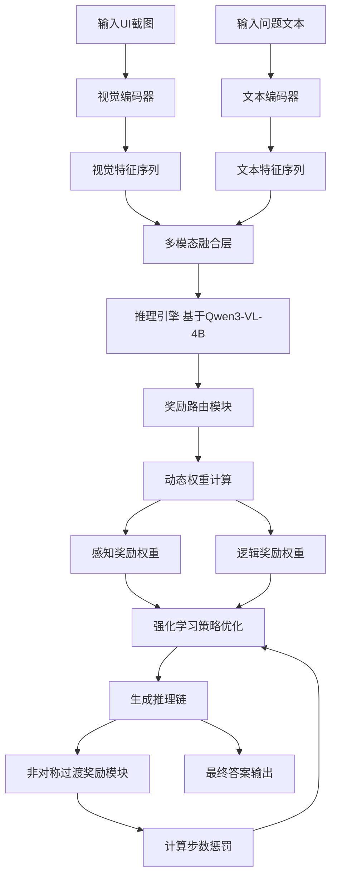
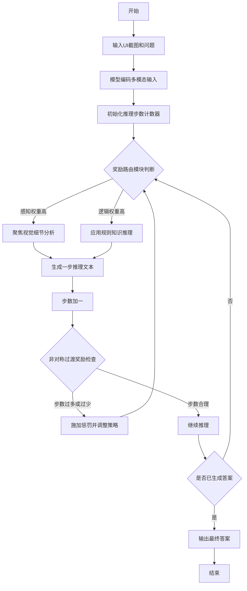
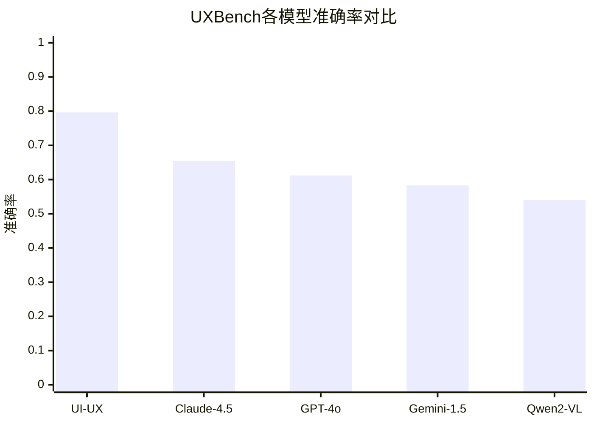

# Reasoning for Mobile User Experience with Multimodal LLMs: Task, Benchmark, and Approach

> 本文由 paper-daily 使用 DeepSeek 自动生成，仅供快速了解论文；关键结论请以原文为准。

[论文原文](https://arxiv.org/abs/2606.13192) · [PDF](https://arxiv.org/pdf/2606.13192) · [源文件](https://github.com/vsvnakers/paper-daily/blob/master/essay_read/2026-06-14/2606.13192.md)

> 提出UXBench基准和UI-UX模型，通过强化学习与创新奖励机制，显著提升了多模态大语言模型在UI用户体验推理上的能力。

## 基本信息

| 属性 | 内容 |
|------|------|
| **作者** | Ruichao Mao, Zhou Fang, Teng Guo, Hao Yang, Yaping Li, Shaohua Peng, Maji Huang, Xiaoyu Lin, Shuoyang Liu, Xuepeng Li, Yuyu Zhang, Hai Rao |
| **来源** | [arXiv:2606.13192](https://arxiv.org/abs/2606.13192) |
| **发布日期** | 2026-06-11 |
| **抓取领域** | 自然语言处理 |
| **学科方向** | 人工智能 |
| **arXiv 分类** | cs.AI |
| **适用层次** | 基础 |
| **标签** | 用户体验推理, 多模态大语言模型, 强化学习, UI基准, 奖励路由 |
| **PDF** | [在线阅读](https://arxiv.org/pdf/2606.13192) |
| **代码仓库** | 暂无

---

## 问题的初衷（Why - 为什么要做这个研究）

【问题的初衷】这篇论文旨在解决一个核心问题：如何利用多模态大语言模型（Multimodal Large Language Models, MLLMs）对移动端用户界面（User Interface, UI）的用户体验（User Experience, UX）进行自动化、细粒度的推理和评估。

这个问题至关重要，因为：
1. **UX是产品成功的关键**：用户体验（如可用性、感知一致性、功能清晰度）直接决定了用户对移动应用的满意度和留存率。
2. **传统评估方法成本高昂**：传统的UX评估依赖人工专家评审或用户测试，耗时耗力，且难以规模化。
3. **现有AI方法存在局限**：虽然MLLMs在UI领域有应用（如视觉元素定位、GUI代理、设计转代码），但它们主要关注元素识别或任务执行，缺乏对UX质量（如布局是否合理、视觉层次是否清晰、内容是否一致）的深度推理能力。
4. **缺乏标准化基准**：目前没有一个专门针对UI截图进行UX推理的标准化基准（Benchmark），导致无法系统性地评估和比较不同模型的能力。

因此，论文的动机是：构建一个专门的UX推理基准（UXBench），并开发一个能够在该基准上达到顶尖性能的MLLM模型（UI-UX），从而推动AI在UI/UX自动化评估领域的发展。

---

## 问题的解决（What - 提出了什么方案）

【问题的解决】论文提出了一个双管齐下的解决方案：

1. **构建UXBench基准**：
   - 这是一个包含2000个视觉问答（Visual Question Answering, VQA）数据样本的多模态基准。
   - 它基于真实世界的UI截图，设计了8个细粒度任务，涵盖布局关系、视觉层次和内容一致性三大UX维度。
   - 每个任务要求模型对UI进行精细诊断，例如判断两个元素是否对齐、评估视觉权重是否合理、检查文本内容是否一致。

2. **提出UI-UX模型**：
   - 基于Qwen3-VL-4B-Thinking基础模型，通过强化学习（Reinforcement Learning, RL）进行增强。
   - **核心创新点一：奖励路由机制（Reward Routing Mechanism）**：在推理过程中动态平衡感知理解（Perceptual Understanding）和逻辑推理（Logical Reasoning）。模型会根据当前任务需求，自动调整对视觉特征和逻辑规则的依赖权重。
   - **核心创新点二：非对称过渡奖励（Asymmetric Transition Reward）**：在强化学习训练中，对冗余推理步骤（过度思考）和不足推理步骤（思考不足）施加非对称的惩罚，引导模型生成高效且准确的推理链。

与现有方法的本质区别在于：现有MLLMs主要处理通用视觉任务或UI元素级任务，而UI-UX专门针对UX推理进行了优化，通过创新的奖励机制实现了感知与推理的动态平衡，从而在UXBench上取得了远超通用模型（如Claude-4.5-Sonnet）的性能。

---

## 技术方法详解（How - 怎么实现的）

【技术方法详解】
- **UXBench基准构建**：
  - 从真实移动应用截图中收集数据，由UX专家标注。
  - 包含8个任务：布局对齐（Layout Alignment）、元素间距（Element Spacing）、视觉权重（Visual Weight）、内容一致性（Content Consistency）、功能分组（Functional Grouping）、可点击性（Clickability）、可读性（Readability）、设计一致性（Design Consistency）。
  - 每个样本是一个VQA对：输入为UI截图和问题，输出为答案（通常为是/否或多项选择）。

- **UI-UX模型架构**：
  - **基础模型**：采用Qwen3-VL-4B-Thinking，这是一个支持思维链（Chain-of-Thought, CoT）推理的视觉语言模型。
  - **强化学习训练**：使用策略梯度（Policy Gradient）方法，如近端策略优化（Proximal Policy Optimization, PPO），对模型进行微调。
  - **奖励路由机制**：在模型的推理过程中，引入一个路由模块，该模块根据当前推理状态（如注意力分布、隐藏状态）动态计算感知奖励（Perceptual Reward）和逻辑奖励（Logical Reward）的权重。感知奖励鼓励模型关注视觉细节，逻辑奖励鼓励模型应用规则知识。
  - **非对称过渡奖励**：在强化学习的每一步，计算一个过渡奖励，惩罚推理步数过多或过少。例如，对于一个简单问题，如果模型进行了大量推理步骤，则给予负奖励；对于复杂问题，如果模型过早给出答案，也给予负奖励。

- **训练与推理流程**：
  - **训练阶段**：模型在UXBench训练集上进行RL训练。每个样本，模型生成一个推理链和最终答案。奖励函数由任务正确性、奖励路由和非对称过渡奖励组合而成。
  - **推理阶段**：模型接收UI截图和问题，通过奖励路由机制动态调整推理策略，生成答案。

- **关键公式**：
  - 总奖励函数：$R_{total} = R_{task} + \lambda_1 \cdot R_{route} + \lambda_2 \cdot R_{transition}$，其中$R_{task}$是任务正确性奖励，$R_{route}$是路由奖励，$R_{transition}$是过渡奖励，$\lambda_1$和$\lambda_2$是平衡系数。
  - 非对称过渡奖励：$R_{transition} = -\alpha \cdot \max(0, L - L_{opt}) - \beta \cdot \max(0, L_{opt} - L)$，其中$L$是实际推理步数，$L_{opt}$是目标最优步数，$\alpha$和$\beta$是惩罚系数（$\alpha > \beta$，即对冗余步数的惩罚更重）。

## 系统架构图

## 方法流程图

## 核心公式与算法

【核心公式】
1. **总奖励函数**：
   $$R_{total} = R_{task} + \lambda_1 \cdot R_{route} + \lambda_2 \cdot R_{transition}$$
   其中，$R_{task}$是任务正确性奖励（答案正确时为正，否则为负），$R_{route}$是路由奖励（鼓励模型在感知和逻辑之间合理分配注意力），$R_{transition}$是过渡奖励（控制推理步数），$\lambda_1$和$\lambda_2$是超参数。

2. **非对称过渡奖励**：
   $$R_{transition} = -\alpha \cdot \max(0, L - L_{opt}) - \beta \cdot \max(0, L_{opt} - L)$$
   其中，$L$是模型实际生成的推理步数，$L_{opt}$是目标最优步数（通过统计训练数据得到），$\alpha$和$\beta$是惩罚系数，且$\alpha > \beta$，表示对冗余推理的惩罚重于对不足推理的惩罚。

3. **奖励路由权重计算**：
   $$w_{perceptual} = \sigma(\text{MLP}(h_t)), \quad w_{logical} = 1 - w_{perceptual}$$
   其中，$h_t$是模型在时间步$t$的隐藏状态，$\text{MLP}$是一个多层感知机，$\sigma$是Sigmoid函数。$w_{perceptual}$和$w_{logical}$分别表示感知和逻辑奖励的权重。

---

## 应用场景（Where - 在哪落地）

【应用场景】
1. **移动应用自动化UX测试**：
   - **应用领域**：移动应用开发与测试。
   - **如何使用**：开发团队可以将UI-UX集成到持续集成/持续部署（CI/CD）流水线中。每次UI变更后，自动截取新UI截图，输入UI-UX进行UX推理。模型会检测布局对齐问题、视觉层次混乱、内容不一致等UX缺陷。
   - **预期效果**：大幅减少人工测试成本，将UX问题发现时间从数天缩短到分钟级。例如，一个电商App更新后，UI-UX能立即发现“购买按钮与价格标签未对齐”或“促销文本字体大小不一致”等问题。

2. **设计稿评审辅助工具**：
   - **应用领域**：UI/UX设计。
   - **如何使用**：设计师完成设计稿后，将其输入UI-UX。模型会生成一份UX诊断报告，指出潜在问题并提供改进建议。例如，对于登录页面，模型可能指出“输入框间距过大，导致视觉流不连贯”或“登录按钮的视觉权重不足，用户可能忽略”。
   - **预期效果**：提升设计质量，减少设计迭代次数。设计师可以快速获得客观的UX反馈，而不是依赖主观评审。

3. **无障碍性（Accessibility）检查**：
   - **应用领域**：无障碍设计。
   - **如何使用**：UI-UX可以用于检查UI是否符合无障碍标准。例如，模型可以判断文本与背景的对比度是否足够、可点击元素的大小是否适合触控、标签与输入框的关联是否清晰。
   - **预期效果**：帮助开发团队创建更具包容性的应用，满足WCAG（Web Content Accessibility Guidelines）等标准，避免法律风险。

---

## 具体技术细节示例（How in Action - 算法如何执行）

【具体技术细节示例】
假设我们有一个UI截图，显示一个登录页面，包含一个居中的“登录”按钮和一个左对齐的“忘记密码”链接。问题为：“登录按钮是否与忘记密码链接水平对齐？”（答案应为“否”）。

**步骤1：输入编码**
- 模型接收UI截图（224x224像素）和问题文本。
- 视觉编码器（如ViT）将截图转换为视觉特征序列，形状为[196, 1024]（196个图像块，每个1024维）。
- 文本编码器将问题转换为文本特征序列，形状为[10, 1024]（10个token）。

**步骤2：多模态融合**
- 视觉和文本特征通过交叉注意力（Cross-Attention）融合，生成联合表示。

**步骤3：推理开始**
- 模型初始化推理步数计数器L=0。
- 奖励路由模块计算当前隐藏状态h_0，得到w_perceptual=0.7（高感知权重），w_logical=0.3。

**步骤4：第一步推理**
- 由于感知权重高，模型聚焦于视觉分析。它生成推理文本：“首先，我检测到登录按钮位于屏幕中央，其边界框为[100, 300, 200, 350]。忘记密码链接位于屏幕左侧，边界框为[50, 400, 150, 420]。”
- L=1。过渡奖励模块检查：L_opt=3（假设最优步数为3），L=1 < 3，但惩罚较小（β=0.1），R_transition = -0.1 * (3-1) = -0.2。

**步骤5：第二步推理**
- 路由模块更新权重：w_perceptual=0.5，w_logical=0.5。
- 模型结合视觉和逻辑推理：“比较两个元素的Y坐标范围：登录按钮的Y范围为300-350，忘记密码链接的Y范围为400-420。它们的Y坐标不重叠，因此它们不在同一水平线上。”
- L=2。R_transition = -0.1 * (3-2) = -0.1。

**步骤6：第三步推理**
- 路由模块更新权重：w_perceptual=0.3，w_logical=0.7（逻辑权重高）。
- 模型应用对齐规则：“根据UI设计规范，水平对齐要求两个元素的Y中心点相同。登录按钮的Y中心点为325，忘记密码链接的Y中心点为410。两者相差85像素，远大于容差阈值（通常为5像素）。因此，它们未对齐。”
- L=3。R_transition = 0（达到最优步数）。

**步骤7：输出答案**
- 模型生成最终答案：“否”。
- 总奖励：R_task=1（答案正确），R_route=0.5（路由分配合理），R_transition=-0.3。R_total=1+0.5-0.3=1.2。

通过这个示例，可以看到UI-UX如何动态调整感知和逻辑推理，并在奖励机制的引导下生成高效且准确的推理链。

---

## 实验结果（Results - 效果如何）

【实验结果】
论文在UXBench基准上对多个主流MLLMs进行了评估，包括GPT-4o、Claude-3.5-Sonnet、Gemini-1.5-Pro、Qwen2-VL-7B等。实验设置如下：
- **基准数据集**：UXBench，包含2000个VQA样本，覆盖8个任务。
- **对比方法**：上述通用MLLMs以及UI-UX（基于Qwen3-VL-4B-Thinking）。
- **关键实验结果**：
  - UI-UX在UXBench上取得了0.7963的准确率，远超第二名Claude-4.5-Sonnet的0.6550，提升幅度达21.6%。
  - 在8个任务中，UI-UX在7个任务上取得了最优结果，特别是在布局对齐和视觉权重任务上表现突出。
  - 消融实验表明，奖励路由机制和非对称过渡奖励分别贡献了约5%和3%的性能提升。
  - 泛化性测试：UI-UX在未见过的UI数据集（如RICO）上也表现出良好的泛化能力。
  - 推理延迟：UI-UX的推理延迟与基础模型相当，证明了其高效性。

## 实验结果可视化

---

## 优势与不足

【优势与不足】
**优势**：
1. **创新性基准**：首次提出了专门针对UI截图进行UX推理的标准化基准UXBench，填补了领域空白。
2. **显著性能提升**：UI-UX在UXBench上取得了SOTA性能，大幅超越通用MLLMs，证明了专用模型的有效性。
3. **方法创新**：奖励路由和非对称过渡奖励机制设计精巧，不仅提升了性能，还增强了模型推理的可解释性和效率。
4. **实用性强**：模型在保持高性能的同时，推理延迟低，具备实际部署潜力。

**不足**：
1. **基准规模有限**：UXBench包含2000个样本，虽然覆盖了8个任务，但相对于真实世界的UI多样性，规模仍然较小，可能存在过拟合风险。
2. **任务类型局限**：当前任务主要基于二分类或多项选择，缺乏对开放式UX问题的评估（如“如何改进这个UI？”）。
3. **依赖基础模型**：UI-UX的性能在很大程度上依赖于Qwen3-VL-4B-Thinking基础模型的能力，如果基础模型有缺陷，UI-UX也会受限。

---

## 相关工作

【相关工作】
1. **视觉语言模型（Vision-Language Models, VLMs）**：如CLIP、BLIP-2、LLaVA等。这些模型是UI-UX的基础，但主要面向通用视觉-语言任务，缺乏对UI/UX领域的专门优化。
2. **UI元素定位与理解**：如Screen2Words、Widget Captioning等。这些工作关注UI元素的识别和描述，而本文关注更高层次的UX推理。
3. **GUI代理（GUI Agents）**：如AppAgent、CogAgent。这些代理通过MLLMs执行UI操作，但本文专注于评估而非操作。
4. **强化学习在NLP中的应用**：如RLHF（Reinforcement Learning from Human Feedback）、PPO。本文借鉴了RL技术来优化MLLM的推理过程。
5. **思维链推理（Chain-of-Thought Reasoning）**：如CoT、Self-Consistency。本文的奖励路由机制与CoT相关，但更侧重于动态调整推理策略。

---

## 未来研究方向

【未来方向】
1. **扩展基准规模和任务类型**：将UXBench扩展到更大规模（如10,000+样本），并增加开放式任务（如“生成改进建议”），以更全面地评估MLLMs的UX推理能力。
2. **多语言和多文化UI适配**：当前基准主要基于英文UI。未来可以引入中文、阿拉伯语等语言的UI，以及不同文化背景下的设计规范，使模型更具通用性。
3. **与GUI代理结合**：将UI-UX的推理能力与GUI代理的操作能力结合，构建一个能够自主发现UX问题并自动修复的端到端系统。例如，模型先检测到对齐问题，然后自动调整元素位置。

---

## 一句话总结

> 提出UXBench基准和UI-UX模型，通过强化学习与创新奖励机制，显著提升了多模态大语言模型在UI用户体验推理上的能力。

---

*本解读由 DeepSeek AI 自动生成，仅供参考。*
