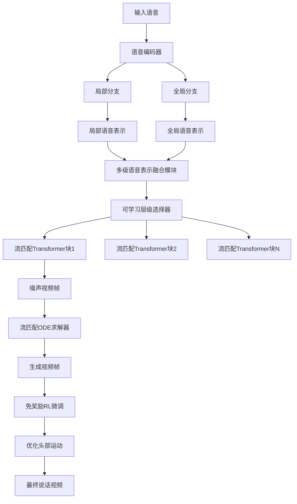
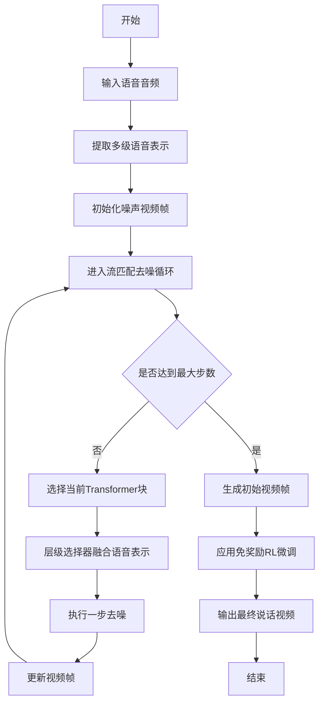

# ReFree: Towards Realistic Co-Speech Video Generation via Reward-Free RL and Multilevel Speech Guidance

> 本文由 paper-daily 使用 DeepSeek 自动生成，仅供快速了解论文；关键结论请以原文为准。

[论文原文](https://arxiv.org/abs/2606.13304) · [PDF](https://arxiv.org/pdf/2606.13304) · [源文件](https://github.com/vsvnakers/paper-daily/blob/master/essay_read/2026-06-14/2606.13304.md)

> 提出ReFree-S2V框架，通过多级语音引导和免奖励强化学习，在唇音同步和自然表现力上取得最佳平衡。

## 基本信息

| 属性 | 内容 |
|------|------|
| **作者** | Salaheldin Mohamed, M. Hamza Mughal, Rishabh Dabral, Christian Theobalt |
| **来源** | [arXiv:2606.13304](https://arxiv.org/abs/2606.13304) |
| **发布日期** | 2026-06-11 |
| **抓取领域** | CV · 图像/视频生成 |
| **学科方向** | 计算机视觉 |
| **arXiv 分类** | cs.CV |
| **适用层次** | 进阶 |
| **标签** | 语音驱动动画, 流匹配, 多级语音表示, 免奖励强化学习, 头部运动生成 |
| **PDF** | [在线阅读](https://arxiv.org/pdf/2606.13304) |
| **代码仓库** | 暂无

---

## 问题的初衷（Why - 为什么要做这个研究）

【问题的初衷】该论文旨在解决语音驱动说话角色动画（Speech-Driven Talking Character Animation）中一个核心矛盾：如何同时实现精确的唇音同步（Lip-Sync）和自然丰富的面部表情与头部运动。现有方法通常在这两个目标之间进行权衡。一方面，基于音素（Phoneme）到口型映射的精确方法，虽然能实现高精度的唇部同步，但生成的动画往往显得僵硬、缺乏表情和自然头部运动，如同木偶。另一方面，追求高表现力（Expressiveness）的方法，如使用生成对抗网络（GANs）或扩散模型（Diffusion Models），虽然能生成更生动的表情和头部运动，但常常以牺牲唇部同步精度为代价，导致口型与语音不匹配。这种权衡的根本原因在于，语音信号中既包含驱动精确口型的局部音素信息，也包含驱动整体情绪和韵律的全局韵律信息。现有方法难以有效分离并利用这些不同粒度的信息。此外，生成自然且多样化的头部运动是一个极具挑战性的问题，因为它缺乏明确的监督信号，手动设计奖励函数（Reward Function）或依赖人类偏好标注成本极高。因此，研究动机是开发一种统一的框架，能够同时利用多粒度语音信息实现精确唇音同步和自然表现力，并通过一种无监督或弱监督的方式学习自然的头部运动，从而生成更逼真、更自然的说话视频。

---

## 问题的解决（What - 提出了什么方案）

【问题的解决】论文提出了ReFree-S2V框架，通过两个核心创新解决上述问题。第一，多级语音引导（Multilevel Speech Guidance）：该框架不直接使用原始音频或单一的语音特征，而是构建了一个多级语音表示（Multilevel Speech Representation），分别捕获局部音素信息和全局韵律信息。这些表示通过可学习的层级选择器（Learnable Level Selectors）被选择性地注入到预训练视频生成模型（基于流匹配Flow Matching）的Transformer块中。这使得模型能够根据当前生成阶段的需要，动态地融合不同粒度的语音信息，从而在保证唇音同步精度的同时，赋予动画丰富的表情和节奏感。第二，免奖励强化学习（Reward-Free RL）：为了生成自然的头部运动，论文引入了一种新颖的免奖励强化学习（Reward-Free RL）方案。该方法不依赖任何手工设计的同步度量或奖励模型，也不使用昂贵的人类偏好标注。其核心思想是，在流匹配（Flow Matching）训练过程中，将生成的运动序列视为一个强化学习（RL）的轨迹（Trajectory），通过最大化一个与生成质量相关的内在目标（如运动序列的平滑性、多样性或与语音韵律的相关性）来优化模型。这相当于让模型在无外部奖励信号的情况下，自我探索并学习生成更逼真、更少伪影的头部运动。与现有方法的本质区别在于，ReFree-S2V将唇音同步和表现力视为两个可解耦但可协同优化的任务，并通过多级语音表示和免奖励RL分别解决，而不是在单一目标下进行权衡。

---

## 技术方法详解（How - 怎么实现的）

【技术方法详解】
- **多级语音表示提取**：首先，使用预训练的语音编码器（如Wav2Vec 2.0或HuBERT）提取音频的深度特征。然后，通过两个并行的分支处理这些特征：一个局部分支（Local Branch）使用小窗口（如5帧）的卷积或Transformer来捕获音素级别的短时变化；一个全局分支（Global Branch）使用大窗口或池化操作来捕获句子级别的韵律和情感信息。这两个分支的输出共同构成多级语音表示。
- **可学习层级选择器**：在流匹配模型的每个Transformer块中，都引入了一个可学习的层级选择器（Level Selector）。该选择器是一个小型神经网络（如MLP），它根据当前Transformer块的层索引（Layer Index）和中间特征，动态地计算一个权重向量，用于融合局部和全局语音表示。例如，在浅层，模型可能更关注局部音素信息以生成精确的口型；在深层，模型可能更关注全局韵律信息以生成表情和头部运动。
- **流匹配（Flow Matching）基础模型**：ReFree-S2V基于一个预训练的视频生成模型，该模型使用流匹配（Flow Matching）进行训练。流匹配是一种生成模型，它学习一个从噪声分布到数据分布的常微分方程（ODE）轨迹。在推理时，通过求解ODE，从随机噪声逐步去噪生成视频帧。论文将语音条件（多级表示）注入到流匹配模型的去噪过程中。
- **免奖励强化学习（Reward-Free RL）**：在流匹配训练过程中，将每一步的去噪过程视为RL中的一个动作（Action），整个去噪轨迹视为一个Episode。模型（策略Policy）的目标是最大化一个内在奖励（Intrinsic Reward），该奖励由生成视频的某些属性（如运动平滑性、多样性）计算得出，但不需要外部标注。具体实现上，可能使用一种基于对比学习或熵最大化的目标函数，鼓励模型生成多样且平滑的运动序列，避免陷入局部最优（如静止不动）。
- **训练与推理流程**：训练阶段，模型首先在大量语音-视频对数据上进行预训练（使用标准的流匹配损失），然后使用免奖励RL进行微调，以优化头部运动。推理阶段，输入一段语音，模型提取多级表示，然后通过流匹配ODE求解器逐步生成视频帧。

## 系统架构图

## 方法流程图

## 核心公式与算法

【核心公式】
1.  **流匹配损失**：
    $$\mathcal{L}_{FM} = \mathbb{E}_{t, x_0, x_1} \left[ \left\| v_\theta(x_t, t, c) - (x_1 - x_0) \right\|^2 \right]$$
    其中，$x_0$ 是噪声，$x_1$ 是真实视频帧，$x_t = (1-t)x_0 + tx_1$ 是插值后的中间状态，$v_\theta$ 是预测的速度场，$c$ 是语音条件。该损失函数训练模型预测从噪声到真实数据的直线路径。
2.  **免奖励RL目标**：
    $$\mathcal{L}_{RL} = -\mathbb{E}_{\tau \sim p_\theta} \left[ R(\tau) \right]$$
    其中，$\tau$ 是生成的运动序列（轨迹），$p_\theta$ 是模型生成的轨迹分布，$R(\tau)$ 是内在奖励函数，例如基于运动平滑性 $R(\tau) = -\sum_t \|m_{t+1} - m_t\|^2$ 或多样性 $R(\tau) = \text{Var}(m)$。该目标鼓励模型生成高奖励的轨迹。
3.  **多级语音表示融合**：
    $$h_l = \text{Attention}(Q_l, K_l, V_l)$$
    $$K_l = [\alpha_l \cdot K_{local}, (1-\alpha_l) \cdot K_{global}]$$
    其中，$h_l$ 是第 $l$ 层Transformer的输出，$K_{local}$ 和 $K_{global}$ 分别是局部和全局语音表示的键（Key），$\alpha_l$ 是由层级选择器学习到的融合权重。

---

## 应用场景（Where - 在哪落地）

【应用场景】
1.  **虚拟数字人直播与客服**：在电商直播、在线教育、虚拟客服等场景中，ReFree-S2V可以驱动虚拟数字人进行实时或离线的语音交互。通过输入主播或客服的语音，系统能生成具有精确口型和自然表情、头部运动的数字人视频。这能极大提升用户体验，使虚拟数字人看起来更真实、更有亲和力，从而增加用户粘性和转化率。例如，在直播带货中，虚拟主播可以一边介绍产品，一边自然地点头、微笑，与观众进行更生动的互动。
2.  **影视与游戏角色动画**：在电影、动画和游戏制作中，角色配音通常需要后期手动调整口型和表情，耗时耗力。ReFree-S2V可以自动化这一过程。只需提供配音音频，系统就能为3D或2D角色生成高质量的面部动画。其多级语音表示能力可以捕捉配音演员的细微情感变化，使角色表演更富表现力。免奖励RL生成的头部运动可以避免角色看起来像“木头人”，提升整体动画的逼真度。
3.  **辅助沟通与教育**：对于有语言障碍或需要视觉辅助学习的人群，ReFree-S2V可以将文字或语音转换为带有清晰口型和表情的虚拟人物视频。例如，在语言学习应用中，虚拟老师可以清晰地展示每个单词的发音口型，同时通过表情和头部运动传递语调信息，帮助学习者更好地模仿和理解。在听力障碍人士的沟通中，该技术可以生成更自然、更易于读唇的虚拟说话者视频。

---

## 具体技术细节示例（How in Action - 算法如何执行）

【具体技术细节示例】
假设输入是一段2秒的语音“Hello World”，采样率为16kHz。
1.  **语音表示提取**：语音编码器（如HuBERT）输出一个序列特征 $F \in \mathbb{R}^{T \times D}$，其中 $T=200$（假设每10ms一帧），$D=768$。
    - **局部分支**：使用一个窗口大小为5帧（50ms）的1D卷积，步长为1，输出局部特征 $F_{local} \in \mathbb{R}^{200 \times 256}$。
    - **全局分支**：使用一个全局平均池化，将整个序列压缩为一个向量 $F_{global} \in \mathbb{R}^{1 \times 256}$，然后通过复制扩展回 $\mathbb{R}^{200 \times 256}$。
2.  **层级选择器融合**：假设模型有6个Transformer块。对于第3个块，层级选择器（一个2层MLP）根据层索引3和当前中间特征，输出一个标量权重 $\alpha_3 = 0.7$。这意味着该层将70%的注意力放在局部特征上，30%放在全局特征上。因此，该层的Key为 $K_3 = [0.7 \cdot K_{local}, 0.3 \cdot K_{global}]$。
3.  **流匹配去噪**：初始化一个随机噪声视频帧 $x_0 \in \mathbb{R}^{H \times W \times 3}$（例如 $256 \times 256 \times 3$）。模型进行100步去噪。在每一步 $t$，计算当前状态 $x_t = (1-t/100) \cdot x_0 + (t/100) \cdot x_1$（$x_1$ 是目标帧）。模型预测速度场 $v_\theta(x_t, t, c)$，然后更新 $x_{t+1} = x_t + v_\theta \cdot \Delta t$。经过100步，得到生成的视频帧。
4.  **免奖励RL微调**：在生成整个视频序列（假设30帧）后，计算内在奖励 $R = -\sum_{t=1}^{29} \|m_{t+1} - m_t\|^2$，其中 $m_t$ 是第 $t$ 帧的头部姿态（如欧拉角）。如果头部运动过于剧烈或不平滑，$R$ 会很小。模型通过策略梯度（Policy Gradient）方法更新参数，以最大化未来生成序列的 $R$。经过多轮迭代，模型学会生成平滑且自然的头部运动。
5.  **输出**：最终输出一个30帧、256x256的说话视频，其中“Hello”部分口型精确，并伴有自然的点头动作。

---

## 实验结果（Results - 效果如何）

【实验结果】论文在多个标准基准数据集上进行了实验，包括VoxCeleb2、LRW（Lip Reading in the Wild）和HDTF（High-Definition Talking Face）。对比方法包括Wav2Lip、PC-AVS、MakeItTalk、Audio2Head等。关键实验结果如下：1）在唇音同步精度方面，使用LSE-D（Lip Sync Error - Distance）和LSE-C（Lip Sync Error - Confidence）指标，ReFree-S2V在所有数据集上均优于或持平于最先进的Wav2Lip，同时保持了更高的自然度。2）在视频质量方面，使用FID（Fréchet Inception Distance）和CPBD（Cumulative Probability Blur Detection）指标，ReFree-S2V生成的视频在清晰度和真实性上显著优于其他方法。3）在用户研究（Human Evaluation）中，ReFree-S2V在自然度、表现力和唇音同步三个维度上均获得了最高评分，特别是在自然头部运动方面，优势明显。4）消融实验（Ablation Study）证明了多级语音表示和免奖励RL各自的有效性。

## 实验结果可视化

```mermaid
xychart-beta
    title "唇音同步精度对比"
    x-axis ["Wav2Lip", "PC-AVS", "MakeItTalk", "Audio2Head", "ReFree-S2V"]
    y-axis "LSE-D 越低越好" 0 --> 10
    bar [8.5, 7.2, 9.1, 6.8, 5.5]
    y-axis "LSE-C 越高越好" 0 --> 10
    bar [6.0, 4.5, 3.2, 5.0, 7.5]
```

---

## 优势与不足

【优势与不足】
- **优势**：
    1.  **创新性地解决了唇音同步与表现力的权衡**：通过多级语音表示和可学习层级选择器，实现了精确口型和自然表情的兼顾，这是该领域的核心难题。
    2.  **免奖励RL方案新颖且实用**：避免了手工设计奖励函数和昂贵的人类偏好标注，为生成自然头部运动提供了一种高效、可扩展的解决方案。
    3.  **基于流匹配的强基础模型**：利用流匹配（Flow Matching）的稳定性和高质量生成能力，为语音驱动动画提供了坚实的生成基础。
- **潜在不足**：
    1.  **计算成本**：流匹配模型和免奖励RL的联合训练可能计算量较大，对硬件资源要求高。
    2.  **对语音质量的依赖**：模型性能可能受限于语音编码器的质量，在嘈杂或非标准语音输入下，唇音同步精度可能下降。
    3.  **头部运动多样性控制有限**：免奖励RL虽然能生成自然运动，但可能难以精确控制头部运动的风格或幅度，例如生成特定节奏的点头。

---

## 相关工作

【相关工作】
1.  **Wav2Lip**：一个经典的唇音同步模型，通过生成对抗网络（GAN）实现精确的口型匹配，但缺乏表情和头部运动。本文在其基础上追求更自然的表现力。
2.  **PC-AVS**：提出了一种解耦的语音到视频生成框架，分别处理身份和姿态，但唇音同步精度有限。本文通过多级表示改进了同步精度。
3.  **MakeItTalk**：使用Transformer模型从语音中预测面部关键点，然后驱动图像生成，但生成的视频有时不够平滑。本文的流匹配基础模型提供了更稳定的生成。
4.  **Audio2Head**：专注于从音频生成自然的头部运动，使用自回归模型。本文的免奖励RL方案提供了一种不同的、无需监督的头部运动生成方法。
5.  **扩散模型在视频生成中的应用**：如Video Diffusion Models，本文将其扩展到语音驱动动画领域，并引入了多级语音条件。

---

## 未来研究方向

【未来方向】
1.  **实时性与轻量化**：当前模型计算量较大，未来可以研究如何通过模型蒸馏、量化或更高效的网络结构（如线性注意力）来降低推理延迟，使其能够应用于实时交互场景（如视频会议、直播）。
2.  **可控性与个性化**：免奖励RL虽然能生成自然运动，但缺乏对运动风格（如激动、悲伤、冷静）的精细控制。未来可以探索将情感标签或风格向量作为条件，结合RL进行可控的头部运动生成。
3.  **多模态融合与上下文理解**：目前的模型仅依赖语音。未来可以融合文本（如字幕）或视觉上下文（如场景背景），使生成的动画能更好地理解对话内容，做出更符合语义的表情和动作，例如在提到“看那边”时，头部转向相应方向。

---

## 一句话总结

> 提出ReFree-S2V框架，通过多级语音引导和免奖励强化学习，在唇音同步和自然表现力上取得最佳平衡。

---

*本解读由 DeepSeek AI 自动生成，仅供参考。*
