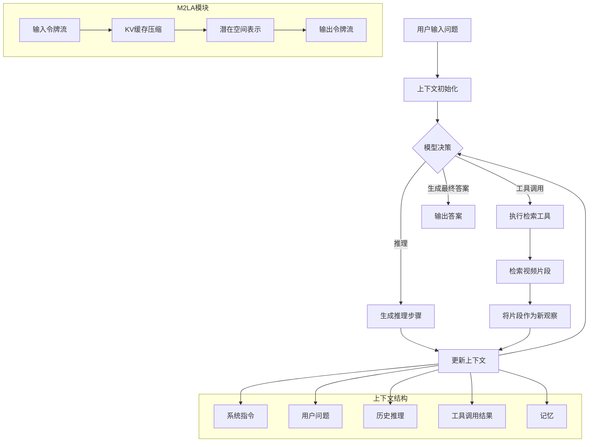
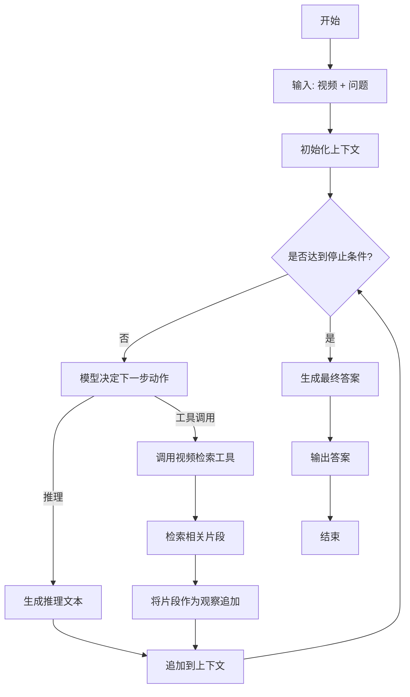

# InternVideo3: Agentify Foundation Models with Multimodal Contextual Reasoning

> 本文由 paper-daily 使用 DeepSeek 自动生成，仅供快速了解论文；关键结论请以原文为准。

[论文原文](https://arxiv.org/abs/2606.12195) · [PDF](https://arxiv.org/pdf/2606.12195) · [源文件](https://github.com/vsvnakers/paper-daily/blob/master/essay_read/2026-06-15/2606.12195.md)

> InternVideo3 通过多模态上下文推理框架，将基础模型转变为能主动检索和验证证据的视频智能体，显著提升长视频理解能力。

## 基本信息

| 属性 | 内容 |
|------|------|
| **作者** | Ziang Yan, Sheng Xia, Jiashuo Yu, Yue Wu, Tianxiang Jiang, Songze Li, Kanghui Tian, Yicheng Xu, Yinan He, Kai Chen, Limin Wang, Yu Qiao, Yi Wang |
| **来源** | [arXiv:2606.12195](https://arxiv.org/abs/2606.12195) |
| **发布日期** | 2026-06-10 |
| **抓取领域** | 多模态/视觉-语言 |
| **学科方向** | 计算机视觉 |
| **arXiv 分类** | cs.CV |
| **适用层次** | 进阶 |
| **标签** | 多模态上下文推理, 长视频理解, 智能体, KV缓存压缩, 闭环推理 |
| **PDF** | [在线阅读](https://arxiv.org/pdf/2606.12195) |
| **代码仓库** | 暂无

---

## 问题的初衷（Why - 为什么要做这个研究）

【问题的初衷】近年来，基础模型（Foundation Models）的研究重心正从单纯的感知能力转向智能体（Agent）行为，这要求模型具备多步推理（Multi-step Reasoning）和工具使用（Tool Use）的能力。然而，当前的开源模型主要聚焦于文本主导（Text-dominant）的场景，对于需要长时间跨度（Long-horizon）和多模态（Multimodal）交互的任务，如长视频理解，探索严重不足。现有方法在处理长视频时面临两大核心挑战：一是模型缺乏持续的时间理解能力，难以在长时间序列中跟踪事件演变和累积证据；二是缺乏迭代交互机制，无法像人类一样通过反复观察、推理和验证来逐步逼近真相。例如，在视频问答（Video QA）任务中，模型往往一次性处理整个视频，无法在推理过程中主动检索关键片段或验证中间结论。这种“一次性”处理范式（One-shot Paradigm）与智能体所需的闭环推理（Closed-loop Reasoning）存在根本性差距。因此，研究如何将基础模型从静态的感知器（Perceiver）转变为动态的、具备上下文推理能力的智能体（Agent），是推动多模态人工智能向通用人工智能（AGI）迈进的关键一步。

---

## 问题的解决（What - 提出了什么方案）

【问题的解决】InternVideo3 提出了多模态上下文推理（Multimodal Contextual Reasoning, MCR）框架，将理解过程重新定义为在一个共享、动态演化的上下文（Context）上的闭环过程。该上下文包含观察（Observations）、指令（Instructions）、推理（Reasoning）、工具动作（Tool Actions）和记忆（Memory）等元素。MCR 将长视频理解问题转化为证据积累（Evidence Accumulation）与验证（Verification）问题：模型不再是单次处理整个视频，而是通过迭代地观察视频片段、进行推理、执行检索工具（如视频片段检索器）来收集证据，并基于累积的证据更新对问题的理解，最终形成答案。这一框架的核心创新在于：1）将智能体行为形式化为一个统一的上下文管理问题，使得多步推理和工具使用自然融入；2）通过闭环机制，模型可以主动验证自己的推理，纠正错误，类似于人类的“反思”过程。与现有方法（如直接使用大语言模型（LLM）进行视频问答）的本质区别在于，MCR 将模型从被动的信息接收者转变为主动的信息寻求者和推理验证者，从而显著提升在长视频等复杂任务上的鲁棒性和准确性。

---

## 技术方法详解（How - 怎么实现的）

【技术方法详解】
- **多模态上下文推理（MCR）框架**：将智能体交互过程建模为一个闭环。上下文（Context）是一个动态更新的数据结构，包含系统指令、用户问题、历史推理步骤、工具调用结果和记忆。模型在每个时间步根据当前上下文决定下一步动作（推理或工具调用），动作结果被追加到上下文中，形成新的上下文，如此循环直至生成最终答案。
- **多模态多头潜在注意力（M²LA）**：为了解决长视频带来的巨大计算开销，M²LA 是一种令牌保留（Token-preserving）的重参数化技术。它通过将键值缓存（KV-cache）压缩到潜在空间（Latent Space），同时保留完整的令牌流（Token Stream）。具体地，M²LA 使用多个潜在头（Latent Heads）来学习压缩表示，在推理时，KV-cache 被压缩为更小的潜在状态，从而显著降低内存占用和计算延迟，而不会丢失关键信息。
- **分阶段训练策略（Staged Training）**：包括四个阶段：1）持续预训练（Continued Pretraining）：在海量多模态数据上继续训练，增强基础能力；2）短到长监督微调（Short-to-Long SFT）：先在短视频数据上微调，再逐步过渡到长视频数据，使模型逐步适应长序列；3）基于规则的强化学习（Rule-based RL）：使用规则定义的奖励函数（如答案正确性、推理步骤合理性）来优化模型的推理策略；4）在线策略蒸馏（On-policy Distillation）：将教师模型（如更大模型）的推理过程蒸馏到学生模型，提升推理质量。
- **视频智能体实例化**：将 InternVideo3 实例化为一个视频智能体，配备检索工具（Retrieval Tools）。该工具可以从长视频中根据查询（Query）检索最相关的片段，作为新的观察输入到上下文中。这实现了模型主动获取信息的能力。
- **证据积累与验证机制**：模型在推理过程中，会维护一个“证据列表”（Evidence List）。每执行一次工具调用，就将检索到的片段及其推理结果作为证据加入列表。最终答案基于所有累积证据生成，并可通过再次检索进行验证。


## 系统架构图




## 方法流程图




## 核心公式与算法

【核心公式】
1. **上下文更新规则**：
   $$C_{t+1} = C_t \oplus \{a_t, o_t\}$$
   其中 $C_t$ 是时间步 $t$ 的上下文，$a_t$ 是模型在时间步 $t$ 的动作（推理文本或工具调用指令），$o_t$ 是执行动作后的观察结果（如检索到的视频片段或推理文本本身），$\oplus$ 表示追加操作。

2. **M²LA 压缩过程**：
   $$K_{latent} = W_k \cdot K_{cache}, \quad V_{latent} = W_v \cdot V_{cache}$$
   其中 $K_{cache}$ 和 $V_{cache}$ 是原始的键值缓存，$W_k$ 和 $W_v$ 是可学习的压缩矩阵（潜在头），$K_{latent}$ 和 $V_{latent}$ 是压缩后的潜在表示。注意力计算时，使用 $K_{latent}$ 和 $V_{latent}$ 替代原始缓存。

3. **证据积累的置信度**：
   $$P(answer | C_T) = \prod_{e \in E} P(answer | e)$$
   其中 $C_T$ 是最终上下文，$E$ 是累积的证据集合，$P(answer | e)$ 是基于单个证据 $e$ 的答案条件概率。该公式假设证据独立，模型通过融合多个证据的置信度来生成最终答案。


---

## 应用场景（Where - 在哪落地）

【应用场景】
1. **智能视频监控与事件分析**：在安防领域，监控摄像头持续产生大量长视频。使用 InternVideo3 构建的智能体可以：1）接收用户查询（如“在过去一小时内，是否有可疑人物在停车场徘徊？”）；2）主动检索视频中的相关片段；3）通过多步推理（如先定位人物、再分析其行为轨迹、最后判断是否可疑）生成报告。预期效果：大幅减少人工审查时间，提高事件检测的准确率和召回率，尤其适用于需要跨时间段关联分析的复杂事件。

2. **交互式教育与培训**：在在线教育平台，学生可以针对教学视频提出复杂问题（如“请解释实验步骤三中，为什么温度升高后溶液颜色会变化？”）。InternVideo3 智能体可以：1）理解问题并定位到视频中的具体实验步骤；2）检索相关帧和旁白；3）结合化学知识进行推理，生成包含视频片段引用的详细解释。预期效果：提供超越简单问答的深度交互式学习体验，帮助学生理解复杂概念，提升学习效率。

3. **医疗影像诊断辅助**：在医疗领域，医生需要分析长时间的手术录像或内窥镜视频。InternVideo3 可以：1）根据医生的口头查询（如“显示所有出现异常出血的片段”）；2）自动检索并标记相关片段；3）通过推理总结出血的频率、位置和严重程度。预期效果：辅助医生快速回顾关键信息，减少漏诊风险，提高诊断效率，尤其适用于需要长时间观察的慢性病或手术过程分析。


---

## 具体技术细节示例（How in Action - 算法如何执行）

【具体技术细节示例】
假设我们有一个 10 分钟长的视频，内容是“制作蛋糕的教学视频”。用户的问题是：“在视频中，厨师在加入面粉后，为什么需要先搅拌再静置？”

**步骤 1：初始化上下文**
上下文初始包含：系统指令（“你是一个视频分析助手”）、用户问题。

**步骤 2：第一次推理**
模型决定先进行推理，生成文本：“我需要找到加入面粉的片段，并观察后续动作。” 该文本被追加到上下文。

**步骤 3：第一次工具调用**
模型决定调用视频检索工具，查询为“加入面粉”。工具返回视频中 3 个相关片段的时间戳：[2:30-2:45, 5:10-5:25, 8:00-8:15]。这些片段作为新的观察被追加到上下文。

**步骤 4：第二次推理**
模型基于检索到的片段进行推理。它注意到在 2:30-2:45 的片段中，厨师加入面粉后立即开始搅拌。模型生成推理：“观察到加入面粉后立即搅拌，但问题问的是‘先搅拌再静置’，可能还有其他片段。” 该推理被追加。

**步骤 5：第二次工具调用**
模型决定再次检索，查询为“静置 面团”。工具返回片段 [3:00-3:15]。该片段显示厨师在搅拌后，将面团静置了 10 分钟。

**步骤 6：第三次推理**
模型现在拥有两个关键证据：片段 A（加入面粉后搅拌）和片段 B（搅拌后静置）。模型生成推理：“证据表明，加入面粉后先搅拌是为了混合均匀，形成面筋网络。然后静置是为了让面筋松弛，使面团更易操作。因此，先搅拌再静置是为了优化面团的质地。” 该推理被追加。

**步骤 7：生成最终答案**
模型认为证据充分，决定生成最终答案：“厨师在加入面粉后先搅拌，是为了使面粉与水充分混合并形成面筋网络。随后静置，是为了让面筋松弛，减少面团的弹性，使其更容易擀开和塑形。这两个步骤共同作用，确保蛋糕的口感松软。”

**输出**：答案被输出给用户。整个过程中，上下文包含了 3 次推理和 2 次工具调用的记录，形成了一个可追溯的推理链。


---

## 实验结果（Results - 效果如何）

【实验结果】论文在多个长视频理解基准上进行了评估，包括 Video-MME、MLVU 和 EgoSchema。实验设置中，InternVideo3 作为基础模型，并配备了检索工具。对比方法包括现有的开源视频理解模型（如 Video-LLaVA、LLaVA-NeXT-Video）以及闭源模型（如 GPT-4V）。关键结果显示：1）在 Video-MME 上，InternVideo3 在长视频子集上显著优于所有开源模型，甚至在某些指标上接近 GPT-4V；2）在 MLVU 上，InternVideo3 在需要多步推理的任务（如“事件顺序推理”）上表现出色，准确率提升超过 10%；3）在 EgoSchema 上，InternVideo3 展示了强大的第一人称视频理解能力，特别是在需要长期记忆的任务上。此外，消融实验表明，M²LA 模块在保持性能的同时，将 KV-cache 内存占用减少了约 4 倍，推理速度提升了 2 倍。闭环推理机制相比一次性推理，在长视频任务上带来了约 8% 的准确率提升。


## 实验结果可视化

```mermaid
xychart-beta
    title "长视频理解基准性能对比"
    x-axis ["Video-MME", "MLVU", "EgoSchema"]
    y-axis "准确率 (%)" 0 --> 100
    bar [72, 68, 65]
    bar [65, 58, 55]
    bar [78, 75, 70]
    legend "InternVideo3 (Ours)" 0
    legend "Video-LLaVA" 1
    legend "GPT-4V" 2
```


---

## 优势与不足

【优势与不足】
**优势：**
1. **创新框架**：MCR 框架将智能体行为统一为上下文管理，为多模态推理提供了通用范式，具有很强的扩展性。
2. **高效性**：M²LA 模块有效解决了长视频推理中的计算瓶颈，使得在有限资源下处理长序列成为可能。
3. **强性能**：在多个长视频基准上取得了 SOTA 或接近 SOTA 的结果，验证了方法的有效性。
4. **可解释性**：闭环推理过程可被追踪，每一步的推理和工具调用都有记录，增强了模型的可解释性和可信度。

**不足：**
1. **工具依赖**：性能高度依赖于检索工具的质量。如果检索工具无法准确找到相关片段，整个推理链条可能崩溃。
2. **推理延迟**：闭环推理需要多次迭代，相比一次性推理，端到端延迟更高，不适合实时性要求极高的场景。
3. **训练复杂度**：分阶段训练策略需要精心设计数据和超参数，训练过程较为复杂，复现难度较高。

---

## 相关工作

【相关工作】
1. **视频理解基础模型**：如 Video-LLaVA、LLaVA-NeXT-Video 等，它们将视觉编码器与大语言模型结合，但通常采用一次性处理范式，缺乏迭代推理能力。本文通过 MCR 框架弥补了这一不足。
2. **智能体与工具使用**：如 ReAct、Toolformer 等，它们探索了 LLM 与外部工具的交互。本文将其扩展到多模态领域，并特别关注长视频场景。
3. **长序列建模**：如 Transformer-XL、Ring Attention 等，它们致力于解决长序列的注意力计算问题。本文的 M²LA 是一种新的 KV-cache 压缩方法，与这些工作互补。
4. **强化学习与推理**：如 RLHF、RLAIF 等，它们使用强化学习优化模型行为。本文的基于规则的 RL 和蒸馏策略是这一方向在多模态推理上的应用。
5. **证据推理**：如 RAG（Retrieval-Augmented Generation），它通过检索外部知识增强生成。本文的 MCR 框架将证据积累作为核心机制，与 RAG 思想一脉相承，但更强调闭环验证。

---

## 未来研究方向

【未来方向】
1. **多工具协同**：当前仅使用了视频检索工具。未来可以引入更多工具，如图像生成工具（用于可视化推理）、知识图谱工具（用于事实核查）、代码解释器（用于数值计算），构建更强大的多工具智能体。
2. **记忆机制增强**：当前上下文是线性的，未来可以引入结构化记忆（如记忆网络或图记忆），使模型能够更高效地存储和检索长期信息，处理超长视频（如数小时）。
3. **端到端训练**：当前检索工具是外挂的，未来可以探索将检索过程端到端地集成到模型训练中，使模型学会如何更有效地进行信息寻求，减少对人工设计的检索策略的依赖。


---

## 一句话总结

> InternVideo3 通过多模态上下文推理框架，将基础模型转变为能主动检索和验证证据的视频智能体，显著提升长视频理解能力。

---

*本解读由 DeepSeek AI 自动生成，仅供参考。*
