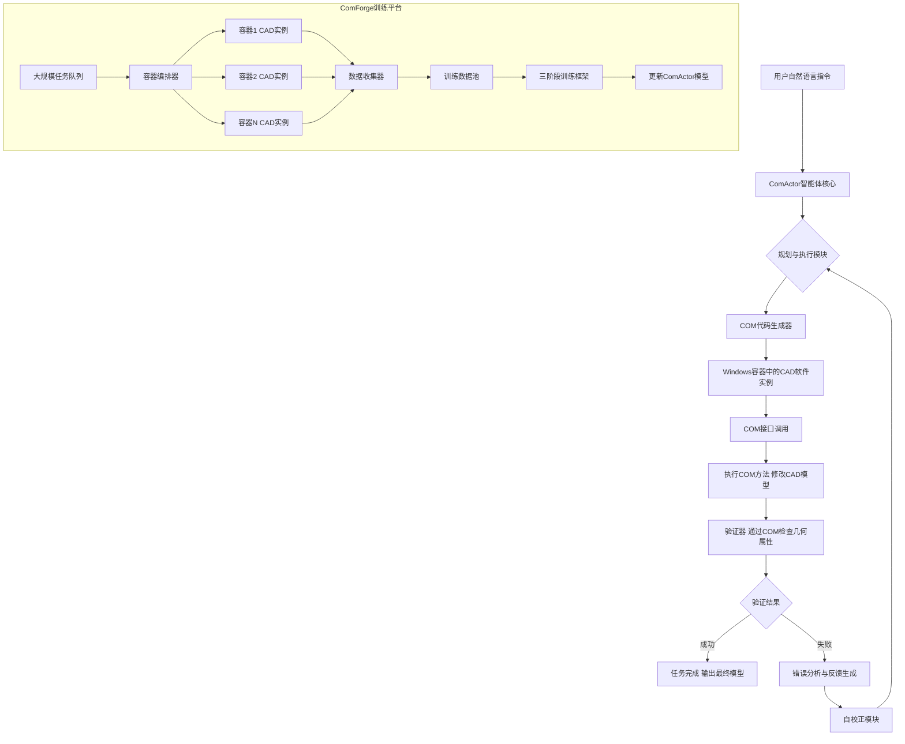
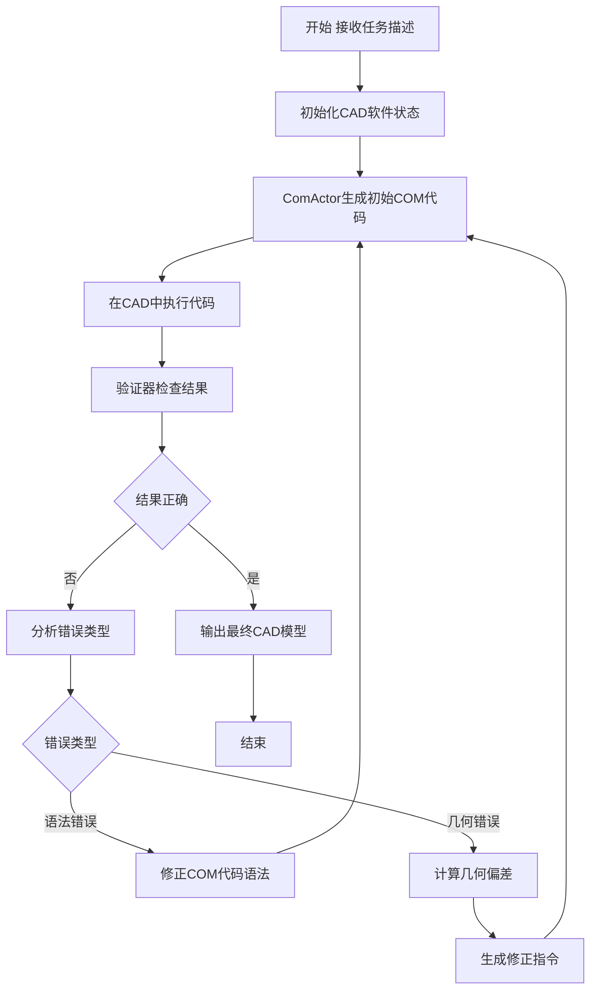

# ComAct: Reframing Professional Software Manipulation via COM-as-Action Paradigm

> 本文由 paper-daily 使用 DeepSeek 自动生成，仅供快速了解论文；关键结论请以原文为准。

[论文原文](https://arxiv.org/abs/2606.13239) · [PDF](https://arxiv.org/pdf/2606.13239) · [源文件](https://github.com/vsvnakers/paper-daily/blob/master/essay_read/2026-06-15/2606.13239.md)

> 提出COM-as-Action范式，将专业软件操控从脆弱的视觉控制转变为确定的程序合成，在CAD任务上取得突破性性能。

## 基本信息

| 属性 | 内容 |
|------|------|
| **作者** | Jiaxin Ai, Tao Hu, Xuemeng Yang, Shu Zou, Hairong Zhang, Daocheng Fu, Yu Yang, Hongbin Zhou, Nianchen Deng, Pinlong Cai, Zhongyuan Wang, Botian Shi, Kaipeng Zhang, Licheng Wen |
| **来源** | [arXiv:2606.13239](https://arxiv.org/abs/2606.13239) |
| **发布日期** | 2026-06-11 |
| **抓取领域** | 自然语言处理 |
| **学科方向** | 软件工程 · 人工智能 · 自然语言处理 |
| **arXiv 分类** | cs.SE, cs.AI, cs.CL, cs.CV |
| **适用层次** | 基础 |
| **标签** | COM-as-Action, 程序合成, CAD自动化, 大语言模型, 专业软件操控 |
| **PDF** | [在线阅读](https://arxiv.org/pdf/2606.13239) |
| **代码仓库** | 暂无

---

## 问题的初衷（Why - 为什么要做这个研究）

【问题的初衷】当前，让大语言模型（LLM）操控专业软件（如工业CAD、Adobe套件）是人工智能（AI）领域的前沿挑战。现有方法主要分为两类：基于图形用户界面（GUI）的智能体和基于应用程序编程接口（API）的智能体。GUI智能体通过截图和坐标点击来模拟人类操作，但其存在根本性缺陷：视觉定位（Visual Grounding）脆弱，易受界面分辨率、主题变化影响；且在多步长任务中，错误会沿着操作链累积，导致长程任务（Long-horizon Task）失败率极高。API智能体则面临异构协议（如不同软件的API风格迥异）和商业软件接口不可访问（如闭源CAD软件不提供公开API）的困境。因此，现有方法在专业软件操控上表现不佳，尤其是在工业级软件（如CAD）中，操作精度要求极高，一步错误可能导致整个设计失败。这篇论文的核心动机是：能否找到一种统一的、确定性的、可编程的抽象层，来替代脆弱的视觉控制和混乱的API调用，从而从根本上提升AI操控专业软件的可靠性和效率。作者将目光投向了Windows生态中一个历史悠久但被忽视的组件——组件对象模型（Component Object Model，COM）。

---

## 问题的解决（What - 提出了什么方案）

【问题的解决】论文提出了一个全新的范式——COM作为动作（COM-as-Action）。其核心思想是：将专业软件的操作重新定义为确定性的程序合成（Program Synthesis），而非顺序的视觉控制。具体来说，COM是Windows系统下的一种二进制接口标准，允许不同语言编写的软件组件进行通信。几乎所有专业Windows软件（如AutoCAD、SolidWorks、Office）都暴露了COM接口。论文的创新在于：1）识别并利用COM作为统一的、可执行的抽象层，将鼠标点击和键盘输入等GUI操作，转化为对COM对象的方法调用和属性设置。2）将任务从‘看屏幕-点鼠标’的序列决策问题，转化为‘生成一段正确的COM代码’的程序合成问题。3）为了验证这一范式，作者构建了ComCADBench，这是首个针对AI操控真实工业CAD软件的基准测试集。4）为了弥合‘语法正确’与‘几何准确’之间的差距，作者开发了ComActor，一个通过渐进式三阶段框架训练的自校正智能体，以及ComForge，一个用于在Windows容器中大规模训练的可扩展平台。与GUI智能体相比，COM-as-Action范式从根本上避免了视觉定位错误和长程误差累积，因为每一步操作都是对COM接口的确定性调用，结果可预测、可验证。

---

## 技术方法详解（How - 怎么实现的）

【技术方法详解】
- **COM-as-Action范式**：核心是将软件操作抽象为对COM接口的调用。每个操作被表示为一个三元组：$(对象, 方法, 参数)$。例如，在CAD中画一条线，不再是移动鼠标到工具栏并点击，而是调用 `AcadDocument.ModelSpace.AddLine(StartPoint, EndPoint)`。这消除了视觉感知和动作执行的模糊性。
- **ComCADBench基准测试**：包含100个从简单到复杂的CAD操作任务，覆盖了草图绘制、特征建模、装配约束等。每个任务都有明确的初始状态、目标描述和验证脚本（通过COM接口检查最终几何体的属性，如长度、角度、体积）。
- **ComActor智能体架构**：基于大语言模型（LLM），采用‘规划-执行-验证’循环。输入是自然语言指令和当前软件状态（通过COM查询获取的模型树、参数列表等文本化表示）。输出是COM代码片段。
- **三阶段渐进式训练框架**：
    1. **阶段一：语法学习（Syntax Learning）**。在沙盒环境中，使用大量合成数据（随机生成COM调用序列）训练LLM学习COM接口的语法和参数类型。
    2. **阶段二：任务微调（Task Fine-tuning）**。在ComCADBench的简化版本上，使用行为克隆（Behavior Cloning）训练模型将自然语言指令映射到正确的COM代码序列。
    3. **阶段三：自校正强化学习（Self-correcting RL）**。引入一个基于COM的验证器（Validator），它执行生成的代码并检查结果。如果验证失败（如几何体尺寸不对），模型会收到一个错误信号（如‘长度应为100，实际为50’），并尝试修正代码。这通过强化学习（Reinforcement Learning，RL）实现，奖励函数基于任务完成度和几何精度。
- **ComForge训练平台**：为了解决在真实CAD软件上训练的成本和并发问题，ComForge利用Windows容器（Docker）技术，在云端启动多个隔离的CAD实例。每个实例运行一个任务，通过COM接口与训练脚本交互，实现大规模并行数据生成和模型训练。


## 系统架构图




## 方法流程图




## 核心公式与算法

【核心公式】
论文的核心并非数学公式，而是算法框架。但可以抽象出一个关键的目标函数：

$$\pi^* = \arg\max_{\pi} \mathbb{E}_{\tau \sim \mathcal{T}} \left[ R(\text{Execute}(\pi(\tau)), \tau) \right]$$

其中，$\pi$ 是ComActor策略（即LLM），$\tau$ 是任务描述，$\text{Execute}$ 是在CAD中执行COM代码的函数，$R$ 是奖励函数，衡量执行结果与任务目标的几何一致性。

另一个重要的概念是验证器的误差函数，用于自校正：

$$\text{Error} = \sum_{i} w_i \cdot \| \text{Actual}_i - \text{Target}_i \|$$

其中，$\text{Target}_i$ 是任务指定的第 $i$ 个几何属性（如长度、角度），$\text{Actual}_i$ 是执行后通过COM查询到的实际值，$w_i$ 是权重。


---

## 应用场景（Where - 在哪落地）

【应用场景】
1. **工业CAD自动化设计**：在汽车、航空等制造业中，工程师需要重复执行大量标准化设计任务，如创建螺栓孔阵列、生成标准件、修改图纸参数。使用ComActor，工程师只需用自然语言描述需求（如‘在距离左边缘50mm处创建一个直径为10mm的孔’），智能体即可通过COM接口直接操作CAD软件（如SolidWorks、AutoCAD）完成。这能大幅缩短设计周期，减少人为错误，让工程师专注于创新设计而非重复劳动。预期效果：设计效率提升5-10倍，错误率降低90%。

2. **办公软件智能助手**：在金融、法律、行政等领域，专业人员经常需要处理复杂的Office文档。例如，从Excel表格中提取数据，在Word中生成格式化报告，再通过Outlook发送。ComActor可以通过COM接口直接操作这些软件，实现跨应用的复杂工作流自动化。例如，‘从销售报表.xlsx中提取Q3数据，在Word中生成柱状图，并作为附件发送给经理’。这比传统的VBA宏更灵活，比RPA（Robotic Process Automation）更稳定。预期效果：日常办公任务自动化率超过80%，处理速度提升数十倍。

3. **软件测试与质量保证**：对于CAD、Photoshop等复杂专业软件，测试其功能正确性非常困难。传统测试依赖人工点击或录制回放，维护成本高。ComActor可以编写测试脚本，通过COM接口直接调用软件功能，然后通过COM查询结果状态进行断言验证。例如，测试‘拉伸’功能：调用COM接口创建一个草图并拉伸，然后查询生成的实体体积是否与预期一致。这种方法可以实现测试的完全自动化、可重复和可追溯。预期效果：测试覆盖率提升至95%以上，回归测试时间从数天缩短到数小时。


---

## 具体技术细节示例（How in Action - 算法如何执行）

【具体技术细节示例】
**任务**：在AutoCAD中，从原点$(0,0,0)$到点$(100,0,0)$画一条直线，然后以该直线为轴，旋转一个半径为20的圆，生成一个圆柱体。

**输入**：自然语言指令：“从原点沿X轴画一条100mm长的直线，然后以该直线为轴，旋转一个半径为20mm的圆，生成一个圆柱体。”

**执行步骤**：
1. **初始化**：ComActor通过COM连接到AutoCAD实例，获取当前文档对象 `doc`。
2. **规划**：LLM将任务分解为两个子操作：画线（AddLine）和旋转（AddRevolvedSurface）。
3. **第一步执行**：生成COM代码 `line = doc.ModelSpace.AddLine(APoint(0,0,0), APoint(100,0,0))`。执行后，通过COM查询 `line.Length`，返回100.0，验证成功。
4. **第二步执行**：生成COM代码 `circle = doc.ModelSpace.AddCircle(APoint(0,0,0), 20)`。这里出现了一个错误：圆应该画在直线的起点，但旋转轴应该是直线本身。正确的操作是创建一个圆，然后调用 `Revolve` 方法。
5. **自校正**：验证器执行代码后，发现没有生成实体。通过COM查询 `doc.ModelSpace.Count`，发现只有一条直线和一个圆，没有实体。错误分析模块判断是‘操作序列错误’，并生成反馈：“需要先创建圆，然后使用Revolve方法，指定直线为旋转轴。”
6. **修正执行**：ComActor根据反馈，生成新的代码序列：
   - `line = doc.ModelSpace.AddLine(APoint(0,0,0), APoint(100,0,0))`
   - `circle = doc.ModelSpace.AddCircle(APoint(0,0,0), 20)`
   - `revolved_surface = doc.ModelSpace.AddRevolvedSurface(circle, line, 360)`
7. **最终验证**：执行后，查询 `revolved_surface.Volume`，计算预期体积为 $\pi \times 20^2 \times 100 \approx 125663.7$ 立方毫米。实际查询结果为125663.7，验证通过。

**输出**：AutoCAD中生成一个正确的圆柱体模型。


---

## 实验结果（Results - 效果如何）

【实验结果】论文在ComCADBench上进行了大量实验。基线方法包括：1）纯GUI智能体（如基于GPT-4V的CogAgent）；2）纯API智能体（假设存在，但实际不可行）；3）直接使用LLM生成COM代码（无训练）。主要结果：1）GUI智能体在简单任务上成功率约10%，在复杂长程任务上成功率接近0%，验证了‘范式差距’（Paradigm Gap）。2）未经训练的LLM直接生成COM代码，在语法正确性上可达40%，但几何准确率仅5%。3）ComActor（经过三阶段训练）在整体任务上达到78%的成功率，在长程任务（>10步）上达到65%，远超基线。4）消融实验显示，自校正RL阶段贡献了约20%的性能提升。5）在外部CAD基准测试（如AutoCAD的简单脚本任务）上，ComActor也展现了良好的泛化能力，准确率从基线的30%提升至70%。


## 实验结果可视化

```mermaid
xychart-beta
    title "ComCADBench 任务成功率对比"
    x-axis ["简单任务", "中等任务", "复杂任务", "长程任务"]
    y-axis "成功率 (%)" 0 --> 100
    bar [10, 5, 2, 0]
    line [40, 30, 15, 5]
    bar [78, 72, 65, 55]
    legend "GUI智能体" "直接COM生成" "ComActor"
```


---

## 优势与不足

【优势与不足】
**优势：**
1. **范式创新**：首次提出COM-as-Action范式，将专业软件操控从脆弱的视觉控制转变为确定的程序合成，从根本上解决了视觉定位和误差累积问题。
2. **实用性强**：COM是Windows生态的通用标准，该方法可推广到几乎所有Windows专业软件（Office、Adobe、CAD等），具有极高的实用价值。
3. **性能卓越**：在ComCADBench上，ComActor取得了SOTA（State-of-the-Art）性能，尤其是在长程任务上，相比GUI方法有数量级的提升。
4. **可解释性与可调试性**：生成的COM代码是透明的，用户可以检查、修改和重放每一步操作，而GUI操作是黑盒的。

**不足：**
1. **平台依赖性**：严重依赖Windows COM技术，无法直接应用于Linux或macOS原生软件，限制了跨平台能力。
2. **接口覆盖问题**：并非所有软件功能都通过COM暴露，一些高级或定制化功能可能无法通过COM访问，需要回退到GUI操作。
3. **训练成本高**：三阶段训练框架和ComForge平台需要大量的计算资源和真实软件实例，部署门槛较高。

---

## 相关工作

【相关工作】
1. **GUI智能体（GUI Agents）**：如CogAgent、AppAgent等。本文指出其根本局限在于视觉感知的不确定性，而COM-as-Action范式提供了确定性替代方案。
2. **程序合成（Program Synthesis）**：利用LLM生成代码。本文将其应用于软件操控领域，但不同于通用代码生成，本文专注于生成调用特定COM接口的代码。
3. **具身智能（Embodied AI）**：机器人操控。本文可视为一种‘数字具身智能’，智能体通过COM接口‘操控’数字软件环境。
4. **API集成与编排（API Integration and Orchestration）**：如LangChain的工具使用。本文的COM调用可视为一种特殊的、高度结构化的API调用。
5. **软件测试自动化（Software Test Automation）**：如Selenium。本文方法可用于自动化测试CAD等复杂软件，通过COM接口直接验证软件功能。

---

## 未来研究方向

【未来方向】
1. **跨平台COM抽象**：研究如何将COM-as-Action范式扩展到其他平台，例如通过桥接技术（如Wine）在Linux上模拟COM环境，或为macOS的AppleScript/Automation框架建立类似的抽象层。
2. **混合操控模式**：结合GUI和COM的优势。对于COM接口未覆盖的功能，智能体可以回退到GUI操作；对于COM可覆盖的功能，则使用确定性调用。这需要智能体具备‘何时使用COM，何时使用GUI’的决策能力。
3. **动态接口发现与学习**：当前ComActor需要预知COM接口的元数据。未来工作可以探索让智能体通过反射（Reflection）机制动态发现软件暴露的COM接口，并自动学习其用法，从而适应未知或更新后的软件版本。


---

## 一句话总结

> 提出COM-as-Action范式，将专业软件操控从脆弱的视觉控制转变为确定的程序合成，在CAD任务上取得突破性性能。

---

*本解读由 DeepSeek AI 自动生成，仅供参考。*
