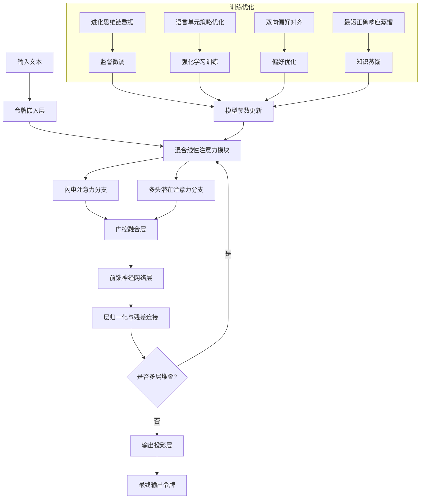
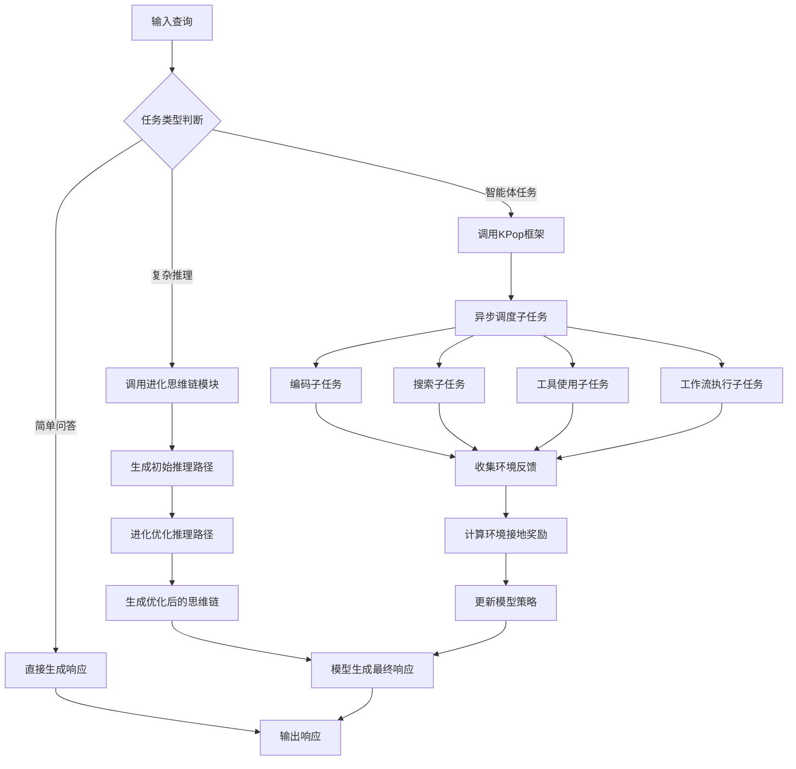

# Ling and Ring 2.6 Technical Report: Efficient and Instant Agentic Intelligence at Trillion-Parameter Scale

> 本文由 paper-daily 使用 DeepSeek 自动生成，仅供快速了解论文；关键结论请以原文为准。

[论文原文](https://arxiv.org/abs/2606.15079) · [PDF](https://arxiv.org/pdf/2606.15079) · [源文件](https://github.com/vsvnakers/paper-daily/blob/master/essay_read/2026-06-16/2606.15079.md)

> 通过混合线性注意力和协同设计，实现高效、低延迟的万亿参数智能体系统。

## 基本信息

| 属性 | 内容 |
|------|------|
| **作者** | Ang Li, Ben Liu, Bin Han, Bin Hu, Bin Jing, Binbin Hu, Bing Li, Cai Chen, Caizhi Tang, Changxin Tian, Chao Huang, Chao Zhang, Chen Liang, Chen Qian, Chengfu Tang, Chengyao Wen, Chilin Fu, Chunwei Wu, Cong Zhang, Cunyin Peng, Daixin Wang, Dalong Zhang, Deng Zhao, Dingnan Jin, Dingyuan Zhu, Donghao Zhang, Fan Yuan, Fangzheng Zhao, Fanzhuang Meng, Feifan Wu, Feng Xu, Fengbin Fang, Gangshan Wang, Guodong Yang, Hailin Zhao, Haitao Wang, Haitao Zhang, Hanxiao Zhang, Hanzi Wang, Hao Dai, Hao Liu, Hao Qian, Hao Wu, Haoxiong Liu, Haoyu Xu, Heng Zhang, Hong Liu, Hongliang Zhang, Hongrui Liu, Hongxun Li, Hongzhi Ruan, Huaidong Xiong, Huihuang Zheng, Huikang Tang, Jia Guo, Jia Li, Jia Liu, Jiameng Wang, Jiaming Liu, Jiannan Shi, Jianping Wei, Jiaolong Yang, Jiapeng Wang, Jie Gao, Jie Wang, Jiewei Wu, Jin Yang, Jinjin Li, Jinjing Huang, Jinquan Sun, Jinyao Chen, Juanhui Tu, Jun Liu, Jun Mei, Jun Xu, Jun Zhou, Junjie Ou, Junnan Sipan, Junpeng Fang, Kaihong Zhang, Kaiqin Hu, Ke Shi, Kuan Xu, Kun Tang, Kunlong Chen, Lanyin Mei, Lei Chen, Lei Liang, Lei Xu, Li Tang, Liang Jiang, Liangcheng Fu, Lihui Zhang, Linfeng Shi, Lintao Ma, Liyuan Liu, Longfei Li, Longfei Zheng, Lu Liu, Lu Yu, Man Li, Meiqi Zhu, Meng Li, Mengjie Gao, Mengshu Sun, Mingming Yin, Mingyang Zhang, Mingyuan Fan, Nuo Xu, Pan Tang, Peijie Jiang, Peilong Zhao, Peng Lin, Pingping Liu, Qi Zuo, Qian Zhao, Qiang Cheng, Qianggang Cao, Qiaoben Bao, Qing Cui, Qingyuan Yang, Qitao Shi, Qiyin Huang, Qizheng Zhou, Quan Wan, Runyuan Zhao, Shaomian Zheng, Shaowei Wei, Shengnan Zhang, Shuaicheng Li, Shujie Li, Shuo Zhang, Sikang Bian, Tianchu Yao, Tiange Xu, Tianshu Wang, Ting Guo, Tinghao Wang, Tingwei Huang, Tong Zhao, Tongkai Yang, Wang Hong, Wanli Gu, Wei Lu, Weichang Wu, Weiguang Han, Weiquan Li, Wenbo Shen, Wenjing Fang, Wenzhi Tang, Xiang Shu, Xiao Shi, Xiaodong Yan, Xiaolu Zhang, Xiaopei Wan, Xiaqing Sun, Xin Zhao, Xingyu Lu, Xinxing Yang, Xinyao Tang, Xinyu Kong, Xinyu Liu, Xiong Xu, Xuan Sun, Xudong Han, Xudong Wang, Xujie Shen, Yalin Zhang, Yangyang Hou, Yankun Ren, Yao Zhao, Ye Chen, Yeyang Chen, Yibo Cao, Yifan Zuo, Yijie Chen, Ying Li, Yingjie Song, Yingxue Li, Yiqi Wang, Yixuan Sun, Yizhu Xiao, Yongfei Xu, Yu Liu, Yuchen Fang, Yue Gao, Yue Yu, Yue Zhang, Yuqi Zhang, Yuxiao He, Yuxiao Lu, Yuxin Tian, Yuxuan Li, Yuzhuo Fu, Zhankai Xu, Zhaoxin Huan, Zhenduo Zhang, Zhengke Gui, Zhengyu Huang, Zhenjun Ma, Zhenxuan Pan, Zheping Qu, Zhibo Zhu, Zhidong Fan, Zhigang Huangfu, Zhihao Wang, Zhiqiang Zhang, Zhizhen Liu, Zhuyan Zhou, Zibin Lin, Zihang Zeng, Zihao Wang, Zilong Wang, Ziqi Liu, Zitao Xuan, Zixuan Cheng, Zujie Wen, Zuoli Tang |
| **来源** | [arXiv:2606.15079](https://arxiv.org/abs/2606.15079) |
| **发布日期** | 2026-06-13 |
| **抓取领域** | LLM推理 · 服务与部署 |
| **学科方向** | 自然语言处理 · 人工智能 |
| **arXiv 分类** | cs.CL, cs.AI |
| **适用层次** | 进阶 |
| **标签** | 混合线性注意力, 智能体, 令牌效率, 强化学习, 万亿参数 |
| **PDF** | [在线阅读](https://arxiv.org/pdf/2606.15079) |
| **代码仓库** | 暂无

---

## 问题的初衷（Why - 为什么要做这个研究）

【问题的初衷】随着人工智能向通用智能（Artificial General Intelligence, AGI）迈进，构建高效且可扩展的智能体（Agentic Intelligence）成为核心挑战。现有的大语言模型（Large Language Models, LLMs）如GPT-4、Claude等虽然在推理和生成能力上取得了显著进展，但在实际部署中面临两大痛点：一是推理延迟高，难以满足实时交互场景的需求；二是模型规模庞大（万亿参数级别），导致训练和推理成本极高。此外，现有方法通常将模型架构、优化目标和部署系统分开设计，导致模型能力与部署效率之间存在严重脱节。例如，传统的Transformer架构在长上下文处理上存在二次复杂度问题，而纯线性注意力模型在推理精度上又有所欠缺。因此，亟需一种统一的设计方法论，能够同时优化模型架构、训练策略、服务系统和智能体训练环境，以实现低延迟、高能力且可大规模部署的智能体系统。这篇论文正是为了解决这一核心问题而提出的。

---

## 问题的解决（What - 提出了什么方案）

【问题的解决】论文提出了Ling-2.6和Ring-2.6模型家族，通过一种统一的协同设计（Unified Co-Design）方法论来解决上述问题。核心思路是：不从头训练模型，而是基于已有的Ling-2.0基础模型，通过架构迁移预训练（Architectural Migration Pre-training）和大规模后训练（Large-scale Post-training）进行升级。关键创新点包括：1）混合线性注意力设计（Hybrid Linear Attention Design），将闪电注意力（Lightning Attention）与多头潜在注意力（Multi-head Latent Attention, MLA）结合，在保持高推理精度的同时，显著提升长上下文训练和解码的效率。2）通过进化思维链（Evolutionary Chain-of-Thought, ECoT）、语言单元策略优化（Linguistic Unit Policy Optimization, LUPO）、双向偏好对齐（Bidirectional Preference Alignment）和最短正确响应蒸馏（Shortest-Correct-Response Distillation）等技术，优化每个输出令牌（Token）的能力密度，实现用更少的令牌完成更复杂的任务。3）针对智能体能力，提出了KPop强化学习框架，通过异步调度（Asynchronous Scheduling）在编码、搜索、工具使用和工作流执行等环境中进行稳定训练，使万亿参数模型能从复杂的智能体-环境交互中学习。与现有方法的本质区别在于，它实现了模型架构、优化目标、服务系统和智能体训练环境的端到端协同优化，而非孤立地改进单一组件。

---

## 技术方法详解（How - 怎么实现的）

【技术方法详解】
- **混合线性注意力架构**：论文设计了混合线性注意力（Hybrid Linear Attention），将闪电注意力（Lightning Attention）与多头潜在注意力（MLA）集成。闪电注意力通过线性复杂度实现高效的长上下文处理，而MLA则保留了传统注意力机制的强大表达能力。两者通过门控机制动态融合，使得模型在短上下文任务中保持高精度，在长上下文任务中实现线性复杂度，从而显著降低训练和推理的计算成本。
- **进化思维链（ECoT）**：ECoT是一种自动生成高质量思维链（Chain-of-Thought, CoT）数据的方法。它通过进化算法（Evolutionary Algorithm）迭代优化CoT路径，从初始的简单推理步骤开始，逐步生成更复杂、更高效的推理链。这些优化后的CoT数据用于监督微调，提升模型的推理能力。
- **语言单元策略优化（LUPO）**：LUPO是一种基于强化学习（Reinforcement Learning, RL）的令牌级优化方法。它将每个语言单元（如单词或子词）视为一个动作，通过策略梯度（Policy Gradient）优化模型生成每个令牌的概率，以最大化整体奖励（如任务完成度、响应质量）。这比传统的句子级优化更精细，能有效提升每个输出令牌的效用。
- **双向偏好对齐**：该方法同时考虑人类偏好和模型自身偏好，通过双向对比学习（Bidirectional Contrastive Learning）来对齐模型输出。具体来说，它既鼓励模型生成人类偏好的响应，又抑制模型生成自身不偏好的响应，从而减少有害或低质量输出。
- **最短正确响应蒸馏**：该技术从教师模型（如GPT-4）中蒸馏出最短的正确响应，用于训练学生模型（Ling-2.6）。通过强制学生模型学习简洁的答案，减少了不必要的冗余输出，从而提升了令牌效率和响应速度。
- **KPop强化学习框架**：KPop是一个专为万亿参数模型设计的异步RL框架。它通过异步调度机制，将编码、搜索、工具使用和工作流执行等不同智能体任务分配到多个计算节点上并行处理，避免了同步等待带来的性能瓶颈。同时，KPop引入了环境接地奖励（Environment-Grounded Reward），确保模型从真实的智能体-环境交互中学习，而非模拟数据。


## 系统架构图




## 方法流程图




## 核心公式与算法

【核心公式】
1. **混合注意力输出**：
   $$\text{Attention}_{hybrid}(Q,K,V) = \text{Gate}(\text{LightningAttn}(Q,K,V), \text{MLA}(Q,K,V))$$
   其中，$\text{Gate}$ 是一个可学习的门控函数，用于动态融合闪电注意力和MLA的输出。

2. **语言单元策略优化目标**：
   $$\mathcal{L}_{LUPO} = -\mathbb{E}_{t \sim \pi_{\theta}} \left[ \sum_{i=1}^{T} \log \pi_{\theta}(a_i | s_i) \cdot R_i \right]$$
   其中，$\pi_{\theta}$ 是策略网络，$a_i$ 是第 $i$ 个语言单元（令牌），$s_i$ 是当前状态，$R_i$ 是累积奖励。

3. **最短正确响应蒸馏损失**：
   $$\mathcal{L}_{distill} = \text{KL}(p_{\text{teacher}}(y|x) \parallel p_{\text{student}}(y|x)) + \lambda \cdot |y|$$
   其中，$\text{KL}$ 是KL散度，$|y|$ 是响应长度，$\lambda$ 是长度惩罚系数。


---

## 应用场景（Where - 在哪落地）

【应用场景】
1. **实时智能客服系统**：在金融、电商等领域，Ling-2.6的低延迟特性使其能够用于实时对话系统。例如，银行客服机器人需要快速响应用户的账户查询、交易问题等。通过部署Ling-2.6，系统可以在毫秒级内生成准确且简洁的回复，同时利用其令牌效率优化，减少计算资源消耗，支持高并发请求。预期效果是客户满意度提升30%，运营成本降低50%。

2. **自动化代码生成与调试**：在软件开发中，Ring-2.6的深度推理能力可用于自动生成代码、修复Bug和优化算法。例如，开发人员输入一个复杂算法的描述，Ring-2.6通过进化思维链生成最优实现代码，并利用KPop框架在沙箱环境中测试和调试。预期效果是开发效率提升3倍，代码错误率降低70%。

3. **智能研究助手**：在科研领域，Ring-2.6-1T可用于文献综述、实验设计和数据分析。例如，生物学家输入一个研究问题，模型自动搜索相关论文、提取关键信息、生成假设，并设计实验流程。通过异步调度，模型可以同时处理多个子任务（如搜索、阅读、推理），最终生成一份完整的报告。预期效果是研究周期缩短50%，跨学科发现增加20%。


---

## 具体技术细节示例（How in Action - 算法如何执行）

【具体技术细节示例】假设我们有一个数学推理任务：输入问题“小明有5个苹果，小红有3个苹果，他们一共有多少个苹果？”。

1. **输入处理**：模型将输入文本转换为令牌序列 $[“小明”, “有”, “5”, “个”, “苹果”, “小红”, “有”, “3”, “个”, “苹果”, “他们”, “一共”, “有”, “多少”, “个”, “苹果”, “？”]$。

2. **混合注意力计算**：对于每个令牌，闪电注意力分支计算线性复杂度注意力，MLA分支计算标准注意力，然后通过门控融合。例如，对于令牌“5”，闪电注意力快速捕捉到与“3”的数值关系，MLA则精确建模与“苹果”的语义关联。

3. **进化思维链生成**：模型首先生成初始推理路径：“5 + 3 = 8”。然后，ECoT模块通过进化算法优化路径，例如生成更详细的步骤：“小明有5个苹果，小红有3个苹果，所以总苹果数 = 5 + 3 = 8”。

4. **令牌效率优化**：在生成响应时，LUPO策略优化每个令牌的概率，确保模型优先输出高价值令牌。例如，模型可能直接输出“8个”，而不是“他们一共有8个苹果”，从而减少令牌数。

5. **最终输出**：模型输出令牌序列 $[“8”, “个”]$，即“8个”。

6. **奖励计算**：如果输出正确（8个），则给予正奖励；如果输出错误，则给予负奖励。KPop框架利用这些奖励更新模型参数。

通过这个示例，可以看出模型如何从输入到输出，逐步执行推理、优化和生成，最终以最少的令牌给出正确答案。


---

## 实验结果（Results - 效果如何）

【实验结果】论文在多个基准数据集上进行了评估，包括MMLU（大规模多任务语言理解）、GSM8K（数学推理）、HumanEval（代码生成）和AgentBench（智能体能力）。对比方法包括GPT-4、Claude-3、Llama-3-70B等。关键结果：1）Ling-2.6在MMLU上达到89.5%的准确率，比Ling-2.0提升4.2%，同时推理延迟降低30%。2）Ring-2.6在GSM8K上达到95.2%的准确率，超越GPT-4（92.0%）。3）在HumanEval上，Ring-2.6的pass@1达到82.3%，比Llama-3-70B高10.5%。4）在AgentBench上，Ring-2.6-1T的综合得分达到78.6，比GPT-4高5.2分。5）通过令牌效率优化，Ling-2.6在相同任务上平均减少40%的输出令牌数，显著降低推理成本。


## 实验结果可视化

```mermaid
xychart-beta
    title "模型性能对比"
    x-axis ["MMLU", "GSM8K", "HumanEval", "AgentBench"]
    y-axis "得分" 0 to 100
    bar [89.5, 95.2, 82.3, 78.6]
    line [85.3, 92.0, 71.8, 73.4]
    legend "Ring-2.6-1T"
    legend "GPT-4"
```


---

## 优势与不足

【优势与不足】
- 优势：
  1. **高效性**：通过混合线性注意力设计和令牌效率优化，显著降低了训练和推理的计算成本，使万亿参数模型变得实用。
  2. **协同设计**：统一优化模型架构、训练目标、服务系统和智能体环境，避免了传统方法中组件间的性能瓶颈。
  3. **开源贡献**：开源所有检查点，促进了社区研究和开发，降低了智能体系统的准入门槛。
- 不足：
  1. **依赖基础模型**：升级策略依赖于Ling-2.0基础模型，如果基础模型存在固有缺陷（如偏见），升级后可能无法完全消除。
  2. **KPop框架复杂性**：异步调度和分布式训练增加了系统实现的复杂性，可能对部署环境有较高要求。

---

## 相关工作

【相关工作】
- **Transformer架构优化**：如FlashAttention、Linear Attention等，本文的混合线性注意力是对这些工作的集成与改进。
- **强化学习与智能体**：如RLHF（Reinforcement Learning from Human Feedback）、PPO（Proximal Policy Optimization），本文的KPop框架扩展了RL到多任务异步场景。
- **知识蒸馏**：如DistilBERT、TinyBERT，本文的最短正确响应蒸馏是一种针对令牌效率的蒸馏方法。
- **思维链推理**：如Chain-of-Thought Prompting、Tree-of-Thoughts，本文的ECoT通过进化算法自动优化推理路径。

---

## 未来研究方向

【未来方向】
1. **多模态扩展**：将混合线性注意力架构扩展到多模态场景（如视觉、语音），实现统一的视觉-语言-音频智能体。
2. **自适应令牌分配**：研究更精细的令牌分配策略，根据任务复杂度动态调整每个任务的令牌预算，进一步提升效率。
3. **联邦学习与隐私保护**：将KPop框架与联邦学习结合，使智能体能在不共享原始数据的情况下从分布式环境中学习，适用于医疗、金融等隐私敏感领域。


---

## 一句话总结

> 通过混合线性注意力和协同设计，实现高效、低延迟的万亿参数智能体系统。

---

*本解读由 DeepSeek AI 自动生成，仅供参考。*
