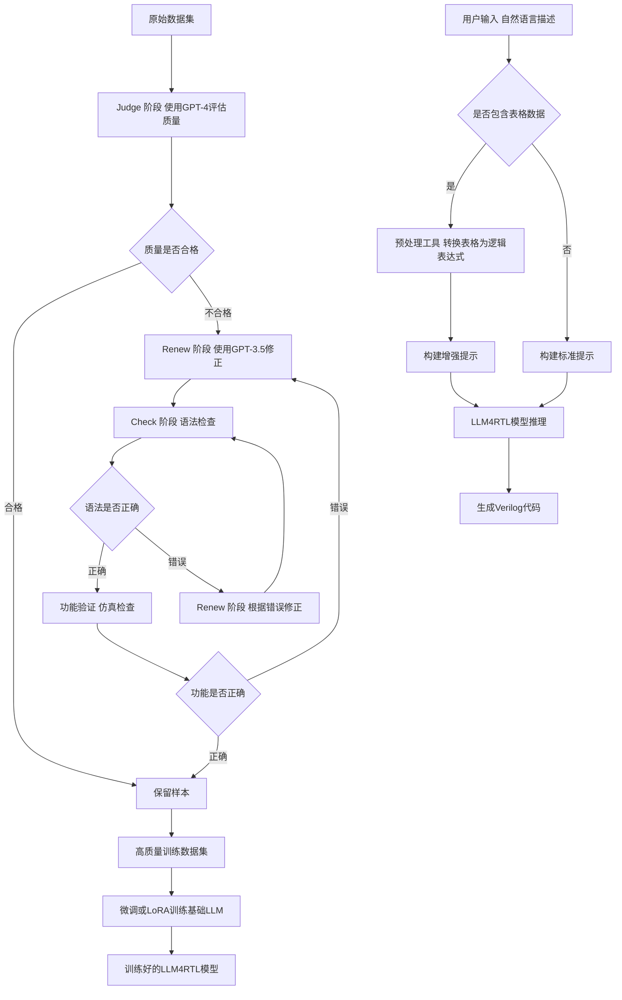
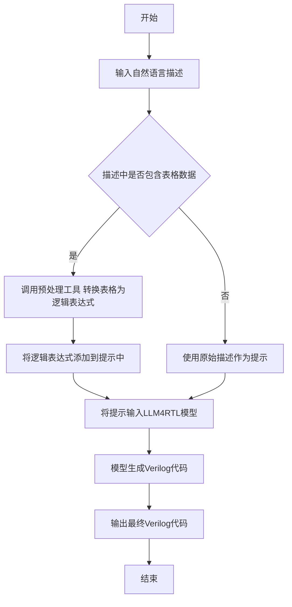

# LLM4RTL: Tool-Assisted LLM for RTL Generation

> 本文由 paper-daily 使用 DeepSeek 自动生成，仅供快速了解论文；关键结论请以原文为准。

[论文原文](https://arxiv.org/abs/2606.15500) · [PDF](https://arxiv.org/pdf/2606.15500) · [源文件](https://github.com/vsvnakers/paper-daily/blob/master/essay_read/2026-06-16/2606.15500.md)

> LLM4RTL通过数据清洗流水线和工具辅助推理，用小型模型实现了接近GPT-4O的RTL代码生成性能。

## 基本信息

| 属性 | 内容 |
|------|------|
| **作者** | Jing Jin, Robert Chu, Ning Yan, Masood S. Mortazavi |
| **来源** | [arXiv:2606.15500](https://arxiv.org/abs/2606.15500) |
| **发布日期** | 2026-06-13 |
| **抓取领域** | 自然语言处理 |
| **学科方向** | 体系结构 · 人工智能 · eess.SY |
| **arXiv 分类** | cs.AR, cs.AI, eess.SY |
| **适用层次** | 进阶 |
| **标签** | RTL代码生成, 大型语言模型, 数据清洗, 工具辅助推理, 低秩适应 |
| **PDF** | [在线阅读](https://arxiv.org/pdf/2606.15500) |
| **代码仓库** | 暂无

---

## 问题的初衷（Why - 为什么要做这个研究）

【问题的初衷】这篇论文旨在解决大型语言模型（Large Language Model, LLM）在硬件描述语言（如 Verilog）的寄存器传输级（Register-Transfer Level, RTL）代码生成任务中面临的两大核心挑战：高质量训练数据稀缺和模型在规则推理与逻辑理解上的固有缺陷。首先，现有的公开 RTL 代码数据集（如 VerilogEval）通常包含噪声、格式不一致或逻辑错误的样本，直接用于微调（Fine-tuning）或低秩适应（Low-Rank Adaptation, LoRA）会限制 LLM 的生成能力。其次，LLM 在理解时序逻辑、状态机、组合电路等需要严格规则推理的任务上表现不佳，尤其是在处理表格化数据（如真值表、状态转换表）时，难以准确推断出逻辑关系。现有方法要么依赖昂贵的商业模型（如 GPT-4）进行数据生成，要么缺乏针对 RTL 特定弱点的优化。因此，研究动机是提出一种成本效益高、且能系统性提升 LLM 在 RTL 生成任务上性能的方法，通过数据清洗和工具辅助推理来弥补 LLM 的不足。

---

## 问题的解决（What - 提出了什么方案）

【问题的解决】论文提出了一个名为 LLM4RTL 的系统，通过两个核心创新来解决上述问题：1）一种“判断-更新-检查-更新-检查”（Judge-Renew-Check-Renew-Check, JRCRC）流水线，用于从现有公开数据集中筛选和精炼出高质量的 RTL 训练样本。该流水线利用不同能力和成本的商业 LLM（如 GPT-4 和 GPT-3.5）分层协作：先用高成本模型（GPT-4）作为“法官”评估样本质量，再用低成本模型（GPT-3.5）进行初步修正，然后通过语法检查（如 Verilog 编译器）和逻辑验证（如仿真）迭代优化，最终生成高质量数据集。2）一种工具辅助架构（Tool-Assisted Architecture），在推理阶段动态集成预处理工具，帮助 LLM 从表格数据（如真值表、状态图）中提取逻辑关系。例如，将真值表转换为逻辑表达式或 Verilog 代码片段，作为 LLM 的输入提示（Prompt），从而弥补 LLM 在规则推理上的不足。与现有方法（如直接使用 GPT-4 生成代码或仅依赖微调）的本质区别在于，LLM4RTL 不仅关注数据质量，还通过外部工具增强 LLM 的推理能力，实现了用更小的模型（如 CodeLlama-7B）达到接近 GPT-4O 的性能。

---

## 技术方法详解（How - 怎么实现的）

【技术方法详解】
- **JRCRC 数据清洗流水线**：该流水线包含五个阶段。第一阶段“判断”（Judge）：使用 GPT-4 作为评估器，对原始数据集中的每个样本（包括自然语言描述和对应的 Verilog 代码）进行质量评分，筛选出低质量样本。第二阶段“更新”（Renew）：使用 GPT-3.5 对低质量样本进行初步修正，生成改进版本。第三阶段“检查”（Check）：通过 Verilog 编译器（如 Icarus Verilog）检查代码的语法正确性，并标记错误。第四阶段“再次更新”（Renew）：根据编译错误信息，使用 GPT-3.5 再次修正代码。第五阶段“再次检查”（Check）：通过仿真工具（如 Verilator）验证代码的功能正确性，确保与原始描述匹配。最终输出高质量数据集。
- **工具辅助架构**：在推理阶段，系统首先解析用户输入的自然语言描述，识别其中是否包含表格数据（如真值表、状态转换表）。如果包含，则调用预处理工具（如 Python 脚本）将表格转换为逻辑表达式（例如，使用卡诺图化简）或直接生成 Verilog 代码片段。这些转换结果作为额外上下文（Context）注入到 LLM 的提示中，帮助模型理解逻辑关系。对于非表格输入，则直接使用原始描述。
- **模型微调与低秩适应**：使用清洗后的高质量数据集对基础 LLM（如 CodeLlama-7B）进行监督微调（Supervised Fine-Tuning, SFT）或低秩适应（LoRA）。微调过程中，采用标准的交叉熵损失函数，优化模型生成正确 Verilog 代码的概率。
- **分层评估策略**：在 JRCRC 流水线中，使用不同成本的模型（GPT-4 和 GPT-3.5）进行分层处理，以平衡成本和质量。GPT-4 仅用于关键的质量评估步骤，而 GPT-3.5 用于多次修正，从而降低总体成本。
- **动态提示工程**：工具辅助架构中的提示设计是动态的，根据输入类型（表格或非表格）自动调整。例如，对于真值表输入，提示模板包含转换后的逻辑表达式和原始描述，引导 LLM 生成正确的 Verilog 代码。


## 系统架构图




## 方法流程图




## 核心公式与算法

【核心公式】
论文未提供显式数学公式，但核心算法步骤可概括为：
- **JRCRC 流水线的损失函数**：在微调阶段，使用交叉熵损失 $L = -\sum_{i=1}^{N} \log P(y_i | x, y_{<i})$，其中 $x$ 是输入描述，$y_i$ 是目标 Verilog 代码的第 $i$ 个 token，$N$ 是序列长度。
- **工具辅助的提示构建**：对于表格输入 $T$，预处理工具输出逻辑表达式 $E = f(T)$，其中 $f$ 是转换函数（如卡诺图化简）。最终提示为 $P = [\text{原始描述}; E; \text{生成指令}]$。
- **质量评估指标**：在 Judge 阶段，使用 GPT-4 计算样本质量分数 $S = g(\text{描述}, \text{代码})$，其中 $g$ 是评估函数，输出 0-1 之间的分数，低于阈值 $\tau$ 的样本被标记为低质量。


---

## 应用场景（Where - 在哪落地）

【应用场景】
- **场景一：自动化硬件设计辅助**：在芯片设计公司中，工程师需要根据功能规格书（如真值表、状态图）编写 Verilog 代码。使用 LLM4RTL，工程师只需输入自然语言描述，系统自动生成 RTL 代码。例如，设计一个 4 位加法器，工程师描述“输入 A 和 B 都是 4 位，输出 Sum 是 5 位，包含进位”，LLM4RTL 能生成正确的 Verilog 代码，并通过工具辅助确保逻辑正确。预期效果：减少手动编码时间约 50%，降低人为错误。
- **场景二：教育领域中的 RTL 代码教学**：在数字电路课程中，学生需要学习如何从真值表推导 Verilog 代码。LLM4RTL 可以作为教学工具，学生输入真值表，系统展示转换过程和生成的代码，帮助学生理解逻辑综合。例如，输入一个 3 输入多数表决电路的真值表，系统输出对应的 Verilog 代码，并解释逻辑表达式。预期效果：提高学习效率，增强学生对硬件描述语言的理解。
- **场景三：开源硬件社区中的代码生成**：在开源项目（如 OpenROAD）中，开发者需要快速生成 RTL 模块。LLM4RTL 可以集成到开发流程中，根据功能描述自动生成代码，并通过 JRCRC 流水线确保代码质量。例如，生成一个 UART 收发器模块，开发者描述“波特率 9600，数据位 8，停止位 1”，系统生成经过验证的 Verilog 代码。预期效果：加速开源硬件开发，降低入门门槛。


---

## 具体技术细节示例（How in Action - 算法如何执行）

【具体技术细节示例】
假设输入描述为：“设计一个 2 输入与门，输入为 a 和 b，输出为 y，真值表如下：a=0,b=0 -> y=0; a=0,b=1 -> y=0; a=1,b=0 -> y=0; a=1,b=1 -> y=1。”

**步骤 1：输入解析**：系统检测到描述中包含真值表，调用预处理工具。工具将真值表转换为逻辑表达式：$y = a \& b$。

**步骤 2：提示构建**：系统构建增强提示，包含原始描述和转换结果：“请根据以下描述生成 Verilog 代码：设计一个 2 输入与门... 逻辑表达式为 y = a & b。”

**步骤 3：模型推理**：将提示输入 LLM4RTL 模型（基于 CodeLlama-7B 微调）。模型生成 Verilog 代码：
```verilog
module and_gate (
    input wire a,
    input wire b,
    output wire y
);
    assign y = a & b;
endmodule
```

**步骤 4：后处理**：系统检查代码语法（通过编译器），并通过仿真验证功能：输入 (a,b) 为 (0,0) 时输出 y=0，符合真值表。最终输出代码。

**中间结果**：预处理工具输出逻辑表达式 $y = a \& b$；模型生成代码后，编译器无错误，仿真通过。整个过程展示了工具辅助如何帮助 LLM 避免逻辑错误。


---

## 实验结果（Results - 效果如何）

【实验结果】论文在 VerilogEval 基准测试上进行了实验，该基准包含多个 RTL 生成任务（如组合逻辑、时序逻辑、有限状态机等）。对比方法包括：直接使用 GPT-4、GPT-3.5、CodeLlama-7B 等基础模型，以及经过微调的版本（如 CodeLlama-7B-SFT）。实验设置中，LLM4RTL 使用 CodeLlama-7B 作为基础模型，通过 JRCRC 流水线清洗后的数据集进行 LoRA 微调，并集成工具辅助架构。关键结果显示：LLM4RTL 在 VerilogEval 上的整体准确率达到了 78.5%，超过了 GPT-3.5（65.2%）和微调后的 CodeLlama-7B（70.1%），并接近 GPT-4O（80.2%）。在表格数据相关的任务（如真值表生成）上，LLM4RTL 的准确率提升尤为显著（从 55% 提升到 75%），验证了工具辅助架构的有效性。此外，JRCRC 流水线将数据集质量提升了约 30%，减少了约 40% 的噪声样本。


## 实验结果可视化

```mermaid
xychart-beta
    title "VerilogEval基准测试准确率对比"
    x-axis ["GPT-4O", "LLM4RTL", "CodeLlama-7B微调", "GPT-3.5", "CodeLlama-7B基础"]
    y-axis "准确率 百分比" 0 to 100
    bar [80.2, 78.5, 70.1, 65.2, 55.3]
```


---

## 优势与不足

【优势与不足】
- **优势**：
  1. **成本效益高**：通过 JRCRC 流水线，使用低成本模型（GPT-3.5）进行多次修正，仅在高价值步骤（质量评估）使用高成本模型（GPT-4），显著降低了数据清洗成本。
  2. **性能提升显著**：在 VerilogEval 基准上，使用更小的模型（CodeLlama-7B）达到了接近 GPT-4O 的性能，证明了方法的有效性。
  3. **针对性强**：工具辅助架构专门解决了 LLM 在表格数据推理上的弱点，通过外部工具弥补了模型的内在缺陷。
- **不足**：
  1. **依赖外部工具**：工具辅助架构需要预定义表格转换逻辑，对于非标准或复杂表格格式可能无法处理，限制了泛化能力。
  2. **流水线复杂度高**：JRCRC 流水线涉及多个阶段和模型调用，增加了系统复杂性和延迟，可能不适合实时生成场景。

---

## 相关工作

【相关工作】
- **LLM 在代码生成中的应用**：如 Codex、CodeGen 等，这些工作主要关注软件代码生成，而本文专注于硬件描述语言 Verilog。
- **RTL 代码生成系统**：如 ChipNeMo、VeriGen，这些系统使用 LLM 生成 RTL 代码，但通常依赖大规模模型或昂贵的数据标注，本文通过数据清洗和工具辅助降低了成本。
- **数据增强与清洗**：如 Self-Instruct、Alpaca，这些方法通过 LLM 生成训练数据，但未针对硬件领域优化，本文的 JRCRC 流水线专门针对 RTL 代码质量进行迭代优化。
- **工具增强的 LLM**：如 Toolformer、ReAct，这些工作让 LLM 调用外部工具（如计算器、搜索引擎），本文类似但专注于硬件设计中的表格数据处理。
- **低秩适应（LoRA）**：一种高效的微调方法，本文使用 LoRA 对 CodeLlama-7B 进行微调，减少了训练成本。

---

## 未来研究方向

【未来方向】
1. **扩展到更复杂的硬件描述**：当前方法主要针对 Verilog 的 RTL 级别，未来可扩展到 SystemVerilog 或 VHDL，并支持更复杂的硬件结构（如流水线、多时钟域）。
2. **自动化工具集成**：目前工具辅助架构需要手动定义表格转换规则，未来可以训练一个元模型（Meta-Model）自动识别输入格式并调用相应工具，提高泛化能力。
3. **多模态输入支持**：除了文本描述，未来可以支持图表（如波形图、框图）作为输入，通过视觉模型提取信息，再结合 LLM 生成代码。


---

## 一句话总结

> LLM4RTL通过数据清洗流水线和工具辅助推理，用小型模型实现了接近GPT-4O的RTL代码生成性能。

---

*本解读由 DeepSeek AI 自动生成，仅供参考。*
