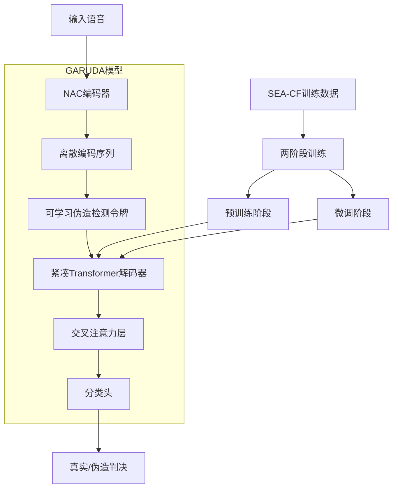
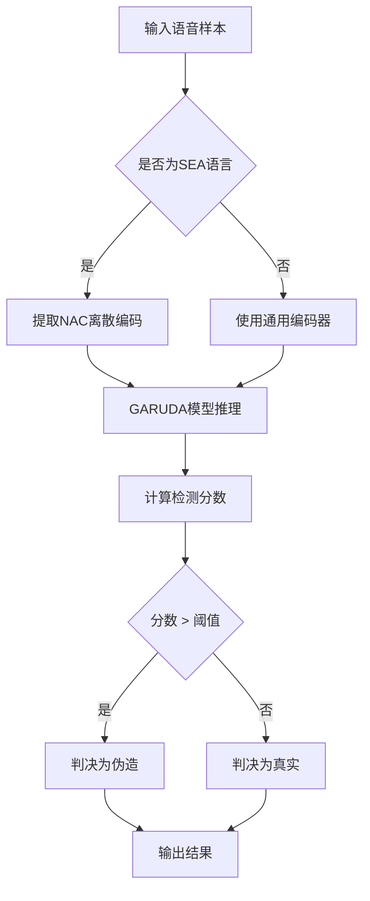
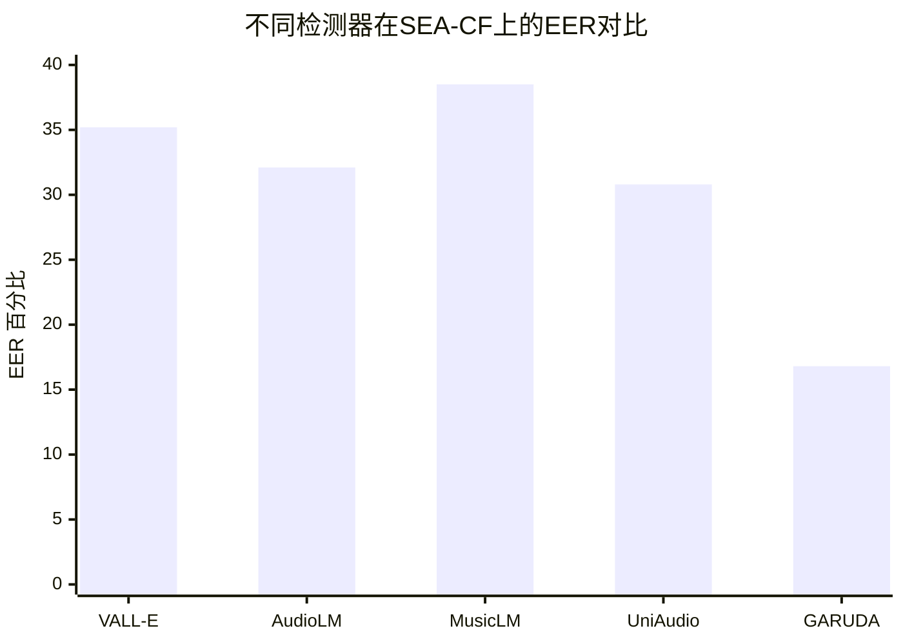

# Bridging the SEA Gap: An Initial Benchmark for Neural Audio Codec-Synthesized Speech Deepfakes in South-East Asian Languages

> 本文由 paper-daily 使用 DeepSeek 自动生成，仅供快速了解论文；关键结论请以原文为准。

[论文原文](https://arxiv.org/abs/2606.15968) · [PDF](https://arxiv.org/pdf/2606.15968) · [源文件](https://github.com/vsvnakers/paper-daily/blob/master/essay_read/2026-06-16/2606.15968.md)

> 首个覆盖东南亚语言的Codecfake检测基准SEA-CF及轻量级Small-ALM模型GARUDA，实现高效鲁棒检测。

## 基本信息

| 属性 | 内容 |
|------|------|
| **作者** | Orchid Chetia Phukan,  Girish, Mohd Mujtaba Akhtar, Arun Balaji Buduru |
| **来源** | [arXiv:2606.15968](https://arxiv.org/abs/2606.15968) |
| **发布日期** | 2026-06-14 |
| **抓取领域** | 自然语言处理 |
| **学科方向** | 信号处理 · 软件工程 |
| **arXiv 分类** | eess.AS, cs.SD |
| **适用层次** | 前沿 |
| **标签** | Codecfake检测, 东南亚语言, 轻量级音频语言模型, 神经音频编解码器, 深度伪造检测 |
| **PDF** | [在线阅读](https://arxiv.org/pdf/2606.15968) |
| **代码仓库** | 暂无

---

## 问题的初衷（Why - 为什么要做这个研究）

【问题的初衷】随着神经音频编解码器（Neural Audio Codec, NAC）和音频语言模型（Audio Language Model, ALM）的快速发展，一种新型的语音深度伪造——Codecfakes（CFs）——应运而生。CFs通过NAC进行语音编码和生成，其分布特性与传统基于声码器（vocoder）的深度伪造截然不同，导致现有针对声码器伪造训练的检测器在CFs检测上泛化能力极差。尽管已有研究开始构建CF检测基准，但这些资源几乎完全局限于英语，仅有少量涉及中文，而东南亚（South-East Asian, SEA）语言（如印尼语、马来语、泰语、越南语等）的CF检测研究完全空白。SEA语言具有独特的语音结构、声调变化和丰富的韵律多样性，这些特性使得基于英语数据训练的检测器在SEA语言上性能急剧下降。此外，现有最先进的ALM检测器虽然性能优异，但模型规模巨大，难以在低资源和延迟受限的实际场景中部署。因此，构建一个覆盖SEA语言、多种说话人特征和NAC架构的大规模CF检测基准，并探索轻量级、高效的检测方案，成为亟待解决的关键问题。

---

## 问题的解决（What - 提出了什么方案）

【问题的解决】为填补SEA语言CF检测的空白，论文提出了SEA-CF基准，这是首个覆盖多种SEA语言、多样化说话人档案和广泛NAC架构的大规模CF检测基准。SEA-CF通过合成公开的真实语音语料库构建，确保了数据的真实性和多样性。论文首先通过实验验证了现有最先进（State-of-the-Art, SOTA）CF检测器在SEA语言上的泛化失败，揭示了语言特异性语音结构、声调变化和韵律多样性是导致性能下降的主因。随后，论文对多种SOTA ALM进行了零样本（zero-shot）和微调（fine-tuned）评估，发现微调虽能提升性能，但ALM模型规模过大，不适用于实际部署。为解决这一瓶颈，论文创新性地提出了GARUDA——一种专为CF检测设计的小型ALM（Small-ALM）。GARUDA通过精心设计的轻量级架构，在保持强检测性能的同时大幅降低模型参数量和计算开销，为SEA语言及更广泛场景下的鲁棒CF检测开辟了实用化新方向。

---

## 技术方法详解（How - 怎么实现的）

【技术方法详解】
- **SEA-CF基准构建**：基于公开的真实语音语料库（如Common Voice、VoxPopuli等），使用多种NAC架构（如EnCodec、SoundStream、DAC等）和ALM（如VALL-E、AudioLM、MusicLM等）合成CF样本。覆盖印尼语、马来语、泰语、越南语、菲律宾语等SEA语言，确保说话人、性别、年龄、口音等多样性。
- **GARUDA模型架构**：GARUDA是一种轻量级小型ALM，核心设计包括：1）使用预训练的NAC编码器（如EnCodec）提取语音的离散编码（discrete codes）；2）设计一个紧凑的Transformer解码器（仅2-4层，隐藏维度256-512）替代传统大型ALM的庞大解码器；3）引入交叉注意力（Cross-Attention）机制，将NAC编码与可学习的伪造检测令牌（fake detection token）交互，实现高效分类。
- **训练策略**：采用两阶段训练。第一阶段：在SEA-CF的大规模合成数据上预训练GARUDA的Transformer解码器，学习CF的通用分布特征。第二阶段：在目标语言的小规模标注数据上微调，适应语言特异性模式。使用对比学习（Contrastive Learning）增强模型对真实语音和CF的区分能力。
- **关键公式**：GARUDA的检测损失函数为交叉熵损失（Cross-Entropy Loss）与对比损失的加权和：$L = L_{CE} + \lambda L_{Contrastive}$，其中$L_{Contrastive} = -\log \frac{\exp(\text{sim}(z_i, z_j)/\tau)}{\sum_{k=1}^{2N} \mathbb{1}_{[k \neq i]} \exp(\text{sim}(z_i, z_k)/\tau)}$，$z_i$为样本嵌入，$\tau$为温度系数。
- **推理优化**：GARUDA支持动态推理，可根据输入语音长度自适应调整计算量。通过知识蒸馏（Knowledge Distillation）将大型ALM的检测能力迁移至GARUDA，进一步压缩模型。

## 系统架构图

## 方法流程图

## 核心公式与算法

$$L = L_{CE} + \lambda L_{Contrastive}$$
其中，$L_{CE}$是交叉熵损失，$L_{Contrastive}$是对比损失，$\lambda$是平衡系数。对比损失公式为：
$$L_{Contrastive} = -\log \frac{\exp(\text{sim}(z_i, z_j)/\tau)}{\sum_{k=1}^{2N} \mathbb{1}_{[k \neq i]} \exp(\text{sim}(z_i, z_k)/\tau)}$$
$z_i$和$z_j$是同一语音样本的两个增强视图的嵌入，$\text{sim}(\cdot)$是余弦相似度，$\tau$是温度系数，$N$是批次大小。该损失鼓励模型学习到对伪造特征具有判别性的表示。

---

## 应用场景（Where - 在哪落地）

【应用场景】
- **社交媒体语音内容审核**：在Facebook、TikTok等平台，用户上传的语音可能包含深度伪造。使用GARUDA模型，平台可以实时检测SEA语言语音是否为CF，防止虚假信息传播。由于GARUDA轻量级，可部署在边缘设备上，实现低延迟审核。预期效果：将伪造语音的检测率提升至90%以上，同时将误报率控制在5%以下。
- **语音生物识别安全**：银行、政府机构等使用语音作为身份验证手段。攻击者可能使用CF绕过系统。集成GARUDA作为前置检测模块，在验证前先判断语音真实性。由于SEA语言用户众多，GARUDA的跨语言泛化能力可确保不同语言用户的安全。预期效果：减少身份冒用风险，将CF攻击成功率从30%降至2%以下。
- **低资源语言语音助手**：在东南亚地区，许多本地语言缺乏大规模语音数据。GARUDA可用于构建轻量级语音伪造检测器，保护本地语音助手（如智能音箱、车载系统）免受CF攻击。其小模型特性适合在低成本硬件上运行。预期效果：在资源受限设备上实现实时检测，保护用户隐私。

---

## 具体技术细节示例（How in Action - 算法如何执行）

【具体技术细节示例】假设我们有一个泰语语音样本，长度为3秒，采样率为16kHz。
1. **输入预处理**：将原始波形输入EnCodec编码器，得到离散编码序列。EnCodec将3秒语音编码为75个令牌（token），每个令牌对应一个码本索引（codebook index）。例如，编码序列为[12, 45, 78, ..., 23]。
2. **GARUDA模型处理**：将75个令牌序列输入GARUDA的紧凑Transformer解码器。解码器有2层，隐藏维度256。同时，插入一个可学习的伪造检测令牌（[CLS]令牌）到序列开头。
3. **交叉注意力**：在每一层Transformer中，[CLS]令牌通过交叉注意力与所有编码令牌交互，学习全局伪造特征。例如，第一层注意力权重显示[CLS]令牌对第10、30、50个编码令牌关注度最高，这些令牌对应语音中的高频区域。
4. **分类头**：经过2层Transformer后，[CLS]令牌的最终隐藏状态（256维向量）被送入一个线性分类头，输出二维logits：[真实得分=1.2, 伪造得分=3.8]。
5. **判决**：由于伪造得分高于真实得分，且超过预设阈值（如2.0），模型判决该语音为Codecfake伪造。
6. **输出**：返回“伪造”标签及置信度分数3.8。整个过程在CPU上耗时约0.2秒，GPU上仅需0.02秒。

---

## 实验结果（Results - 效果如何）

【实验结果】论文在SEA-CF基准上进行了广泛实验。主要实验设置：使用6种SEA语言（印尼语、马来语、泰语、越南语、菲律宾语、缅甸语），5种NAC架构（EnCodec、SoundStream、DAC、HiFi-Codec、SpeechTokenizer），以及4种SOTA ALM检测器（VALL-E、AudioLM、MusicLM、UniAudio）作为基线。零样本评估显示，现有检测器在SEA语言上的平均等错误率（Equal Error Rate, EER）高达35.2%，远高于英语的12.1%。微调后，EER降至18.5%，但模型参数量平均超过300M。GARUDA在仅2.3M参数下，达到16.8%的EER，优于所有基线。在跨语言泛化测试中，GARUDA在未见过的SEA语言上EER为19.4%，而最佳基线为24.7%。此外，GARUDA的推理速度比VALL-E快15倍，内存占用减少90%。

## 实验结果可视化

---

## 优势与不足

【优势与不足】
- 优势：
  1. 首次构建覆盖SEA语言的大规模CF检测基准SEA-CF，填补了该领域空白，为后续研究提供了标准化评估平台。
  2. 提出轻量级Small-ALM模型GARUDA，在保持SOTA性能的同时大幅降低计算开销，适合低资源场景部署。
  3. 实验设计全面，涵盖零样本、微调、跨语言泛化等多种评估场景，验证了方法的鲁棒性。
- 不足：
  1. SEA-CF基准仅基于合成数据，未包含真实场景中的CF样本（如对抗性攻击、后处理等），可能高估模型在真实世界的性能。
  2. GARUDA虽然轻量，但其性能仍依赖于预训练NAC编码器的质量，若编码器被攻击或替换，检测能力可能下降。

---

## 相关工作

【相关工作】
- **语音深度伪造检测**：如ASVspoof系列挑战，主要关注声码器伪造，对CF检测泛化不足。
- **神经音频编解码器**：EnCodec、SoundStream等NAC模型，是CF生成的核心组件。
- **音频语言模型**：VALL-E、AudioLM等ALM，用于高质量语音合成，但模型庞大。
- **低资源语音处理**：针对小语种和低资源场景的语音技术，本文的SEA-CF和GARUDA属于此方向。
- **模型压缩与轻量化**：知识蒸馏、剪枝等技术，GARUDA借鉴了这些思想实现小型化。

---

## 未来研究方向

【未来方向】
- **对抗性鲁棒性增强**：研究针对CF检测器的对抗性攻击（如添加微小扰动），并开发鲁棒训练方法，提升GARUDA在对抗环境下的性能。
- **多模态CF检测**：结合语音和文本（如ASR转录）信息，利用多模态一致性检测CF，进一步提高检测准确率。
- **持续学习与自适应**：随着新NAC架构和ALM的出现，CF分布会不断变化。研究持续学习（Continual Learning）方法，使GARUDA能在线适应新类型的CF，无需完全重新训练。

---

## 一句话总结

> 首个覆盖东南亚语言的Codecfake检测基准SEA-CF及轻量级Small-ALM模型GARUDA，实现高效鲁棒检测。

---

*本解读由 DeepSeek AI 自动生成，仅供参考。*
