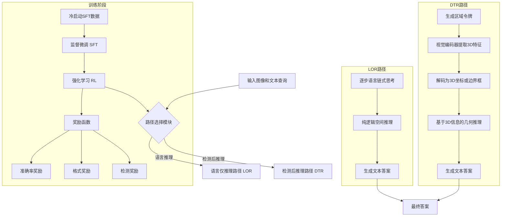
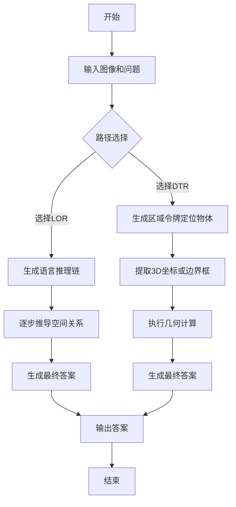

# Reinforcing Dual-Path Reasoning in Spatial Vision Language Models

> 本文由 paper-daily 使用 DeepSeek 自动生成，仅供快速了解论文；关键结论请以原文为准。

[论文原文](https://arxiv.org/abs/2606.17539) · [PDF](https://arxiv.org/pdf/2606.17539) · [源文件](https://github.com/vsvnakers/paper-daily/blob/master/essay_read/2026-06-17/2606.17539.md)

> 提出双路径空间推理框架SR-REAL，通过强化学习联合优化语言推理和3D几何推理，显著提升空间VLM的复杂推理能力。

## 基本信息

| 属性 | 内容 |
|------|------|
| **作者** | Yatai Ji, An-Chieh Cheng, Yang Fu, Yukang Chen, Han Zhang, Zhaojing Yang, Wei Huang, Ka Chun Cheung, Song Han, Vidya Nariyambut Murali, Pavlo Molchanov, Jan Kautz, Simon See, Hongxu Yin, Ping Luo, Sifei Liu |
| **来源** | [arXiv:2606.17539](https://arxiv.org/abs/2606.17539) |
| **发布日期** | 2026-06-16 |
| **抓取领域** | 多模态/视觉-语言 |
| **学科方向** | 计算机视觉 · 人工智能 |
| **arXiv 分类** | cs.CV, cs.AI |
| **适用层次** | 基础 |
| **标签** | 空间推理, 视觉语言模型, 强化学习, 双路径推理, 3D定位 |
| **PDF** | [在线阅读](https://arxiv.org/pdf/2606.17539) |
| **代码仓库** | 暂无

---

## 问题的初衷（Why - 为什么要做这个研究）

【问题的初衷】这篇论文旨在解决空间视觉语言模型（Spatial Vision-Language Models, Spatial VLMs）在复杂空间推理任务中的局限性。尽管现有的Spatial VLMs在几何感知（geometric perception）方面取得了显著进展，例如能够识别物体的相对位置或粗略深度，但当面对需要多步推理（multi-step inference）的复杂空间查询时，例如“从红色杯子出发，向左移动20厘米，然后向前移动，会碰到什么物体？”，这些模型往往表现不佳。问题的核心在于，不同的空间查询本质上需要截然不同的推理策略。有些问题可以通过纯语言（Language-Only）的逐步演绎（step-by-step deduction）来解决，例如“A在B的左边，B在C的前面，所以A在C的左前方”。而另一些问题则必须先进行精确的3D空间定位（3D grounding），然后才能进行定量推理（quantitative inference），例如“物体A的中心点坐标是多少？它距离物体B有多远？”。现有方法通常采用单一的推理路径（single reasoning path），试图用一种模式解决所有问题，这导致了在需要不同策略的任务上性能不佳。此外，缺乏有效的训练机制来引导模型根据问题类型自适应地选择最优推理路径。因此，论文的动机是提出一个统一的框架，能够同时支持这两种互补的推理路径，并通过强化学习（Reinforcement Learning, RL）进行优化，从而显著提升Spatial VLMs在复杂空间推理任务上的能力。

---

## 问题的解决（What - 提出了什么方案）

【问题的解决】论文提出了一个名为SR-REAL（Dual-Path Spatial Reasoning via Reinforcement Learning for Spatial VLMs）的统一框架。其核心思路是为一个空间VLM配备两条互补的推理路径：语言仅推理（Language-Only Reasoning, LOR）和检测后推理（Detect-Then-Reason, DTR）。LOR路径模仿人类的纯语言逻辑推理，通过逐步的语言链式思考（Chain-of-Thought, CoT）来推导空间关系，不依赖显式的3D坐标。DTR路径则首先通过区域令牌（region tokens）检测出物体的3D几何线索（如中心点或边界框），然后基于这些精确的3D信息进行显式的几何推理。SR-REAL的训练分为两个阶段：首先是一个冷启动的监督微调（Cold-Start Supervised Fine-Tuning, SFT）阶段，该阶段构建了LOR和DTR的链式思考监督数据，并暴露了一个“区域到3D”的接口（region-to-3D interface），让模型学习如何生成和使用区域令牌来获取3D信息。随后是强化学习（RL）阶段，该阶段使用准确率奖励（accuracy reward）和格式奖励（format reward）来优化策略模型（policy model）。对于DTR路径，还引入了一个基于离散中心点检测的奖励（discrete center-based detection reward），以进一步细化几何对齐。通过这种方式，SR-REAL不仅让模型学会了两种推理路径，还通过RL训练让模型能够根据问题自动选择或组合使用最优路径。与现有方法的本质区别在于，它不再强制使用单一推理模式，而是通过双路径设计和RL优化，实现了推理策略的动态适应和相互增强。

---

## 技术方法详解（How - 怎么实现的）

【技术方法详解】
- **双路径推理架构（Dual-Path Reasoning Architecture）**：模型内部集成了两条独立的推理链。LOR路径处理纯语言推理，其输出是逐步的文本推理过程。DTR路径则通过特殊的区域令牌（region tokens）与视觉编码器交互，提取出目标物体的3D中心点坐标 $(x, y, z)$ 或边界框（bounding box）信息，然后基于这些数值进行几何计算。
- **冷启动监督微调（Cold-Start Supervised Fine-Tuning, SFT）**：这是RL训练前的关键准备阶段。论文构建了高质量的混合数据集，其中每个样本都包含一个问题、一个LOR格式的CoT推理路径和一个DTR格式的CoT推理路径。SFT阶段的目标是让模型学会生成这两种推理路径，并掌握通过区域令牌获取3D信息的接口。
- **强化学习优化（Reinforcement Learning Optimization）**：在SFT之后，使用RL算法（如PPO）对模型进行优化。奖励函数（Reward Function）设计是核心，包含三个部分：
    1.  **准确率奖励（Accuracy Reward）**：$R_{acc}$，根据最终答案是否正确给予奖励。
    2.  **格式奖励（Format Reward）**：$R_{fmt}$，鼓励模型生成结构化的、符合LOR或DTR格式的推理过程。
    3.  **检测奖励（Detection Reward）**：$R_{det}$，专门用于DTR路径，奖励模型预测的3D中心点或边界框与真实标注（ground truth）之间的对齐程度。例如，对于中心点预测，可以使用离散化的坐标匹配奖励。
- **动态路径选择（Dynamic Path Selection）**：在推理时，模型可以根据输入问题的特征，自动选择使用LOR、DTR或两者结合。这通过在RL训练中引入一个路径选择机制来实现，模型学习为不同问题分配最有效的推理路径。
- **区域令牌接口（Region-to-3D Interface）**：这是一个关键创新点。模型通过生成特殊的令牌（如 `&lt;region&gt;` 和 `&lt;/region&gt;`）来标记需要定位的物体，视觉编码器会为这些令牌对应的区域输出一个特征向量，该向量被解码为3D坐标。这使得模型能够在不依赖外部检测器的情况下，端到端地学习3D定位。


## 系统架构图




## 方法流程图




## 核心公式与算法

【核心公式】
1.  **总奖励函数（Total Reward Function）**：RL训练的核心，用于指导模型优化。
    $$R_{total} = \lambda_{acc} \cdot R_{acc} + \lambda_{fmt} \cdot R_{fmt} + \lambda_{det} \cdot R_{det}$$
    其中，$R_{acc}$ 是答案准确率奖励，$R_{fmt}$ 是推理格式奖励，$R_{det}$ 是DTR路径的3D检测奖励。$\lambda_{acc}, \lambda_{fmt}, \lambda_{det}$ 是平衡各项重要性的超参数。

2.  **检测奖励（Detection Reward）**：用于DTR路径，衡量预测的3D中心点与真实中心点之间的对齐程度。论文采用离散化坐标匹配的方式，将连续空间划分为网格，奖励预测正确的网格。
    $$R_{det} = \mathbb{1}[\text{round}(\hat{x}) = \text{round}(x_{gt})] \cdot \mathbb{1}[\text{round}(\hat{y}) = \text{round}(y_{gt})] \cdot \mathbb{1}[\text{round}(\hat{z}) = \text{round}(z_{gt})]$$
    其中，$(\hat{x}, \hat{y}, \hat{z})$ 是模型预测的中心点坐标，$(x_{gt}, y_{gt}, z_{gt})$ 是真实坐标。$\mathbb{1}[\cdot]$ 是指示函数，当条件成立时值为1，否则为0。

3.  **策略梯度优化目标（Policy Gradient Objective）**：使用PPO算法优化策略模型 $\pi_{\theta}$。
    $$\mathcal{L}_{PPO} = \mathbb{E}_{t} \left[ \min \left( r_t(\theta) \hat{A}_t, \text{clip}(r_t(\theta), 1-\epsilon, 1+\epsilon) \hat{A}_t \right) \right]$$
    其中，$r_t(\theta) = \frac{\pi_{\theta}(a_t | s_t)}{\pi_{\theta_{old}}(a_t | s_t)}$ 是新旧策略的概率比，$\hat{A}_t$ 是优势函数估计，$\epsilon$ 是裁剪超参数，用于限制策略更新的幅度，确保训练稳定性。


---

## 应用场景（Where - 在哪落地）

【应用场景】
1.  **机器人导航与操作（Robotic Navigation and Manipulation）**：
    - **应用领域**：服务机器人、工业自动化。
    - **如何使用**：机器人接收到自然语言指令，如“将桌子上的蓝色杯子拿到我面前，然后绕过椅子放到左边的架子上”。SR-REAL模型可以首先使用DTR路径精确检测杯子、椅子、架子的3D位置，然后使用LOR路径进行路径规划的逻辑推理（“先拿杯子，再绕过椅子，最后放到架子”）。
    - **预期效果**：机器人能够更准确地理解复杂、多步的空间指令，减少因定位错误或逻辑混乱导致的失败，提高任务完成率和安全性。

2.  **增强现实（Augmented Reality, AR）辅助系统**：
    - **应用领域**：AR眼镜、远程协作。
    - **如何使用**：用户通过AR眼镜看到一个复杂的机械装置，并询问“如果我把这个红色旋钮顺时针旋转90度，哪个齿轮会先开始转动？”。SR-REAL模型可以先用DTR路径定位旋钮和各个齿轮的3D位置和连接关系，然后用LOR路径进行物理逻辑推理，预测运动传递路径。
    - **预期效果**：AR系统能够实时、准确地回答用户关于空间关系和物理交互的复杂问题，提供沉浸式的智能辅助体验，提升维修、培训等场景的效率。

3.  **自动驾驶场景理解（Autonomous Driving Scene Understanding）**：
    - **应用领域**：智能汽车、高级驾驶辅助系统（ADAS）。
    - **如何使用**：车辆摄像头捕捉到前方路况，系统需要回答“在我左前方的那辆白色轿车，如果它继续直行，而我从右侧车道加速超车，是否存在碰撞风险？”。SR-REAL模型可以先用DTR路径精确检测白色轿车和本车的3D位置、速度和方向，然后用LOR路径进行时空推理和风险评估。
    - **预期效果**：提升自动驾驶系统对复杂动态场景的理解能力，使其能够进行更精细的轨迹预测和决策规划，从而提高行车安全性和乘坐体验。


---

## 具体技术细节示例（How in Action - 算法如何执行）

【具体技术细节示例】
**设定输入**：一张包含三个物体的桌面图像：一个红色杯子（Cup_R）、一个蓝色方块（Block_B）和一个绿色球体（Sphere_G）。用户提问：“从红色杯子出发，向右移动10厘米，然后向前移动5厘米，会碰到哪个物体？”

**算法逐步执行**：
1.  **路径选择**：模型内部路径选择模块分析问题，判断该问题需要精确的3D坐标计算，因此选择DTR路径。
2.  **区域令牌生成**：模型生成文本：“为了回答这个问题，我需要先定位红色杯子的位置。 `&lt;region&gt;` 红色杯子 `&lt;/region&gt;`”。
3.  **3D坐标提取**：视觉编码器处理 `&lt;region&gt;` 和 `&lt;/region&gt;` 之间的文本对应的图像区域，输出一个特征向量。该向量被解码为3D中心点坐标，假设为 $(x_{cup}=15, y_{cup}=20, z_{cup}=0)$（单位：厘米）。
4.  **几何推理**：模型基于这个坐标进行显式几何计算。
    - 向右移动10厘米：新位置 $x_{new} = 15 + 10 = 25$，$y_{new}=20$。
    - 向前移动5厘米：在图像坐标系中，向前通常对应y轴减小，所以 $y_{new} = 20 - 5 = 15$。
    - 最终目标位置为 $(25, 15, 0)$。
5.  **目标匹配**：模型需要判断这个新位置是否与其他物体重叠。它再次使用DTR路径，生成区域令牌来定位蓝色方块和绿色球体。
    - 蓝色方块中心点：$(x_{block}=30, y_{block}=15, z_{block}=0)$
    - 绿色球体中心点：$(x_{sphere}=10, y_{sphere}=25, z_{sphere}=0)$
6.  **距离计算与决策**：模型计算目标位置 $(25, 15, 0)$ 与蓝色方块 $(30, 15, 0)$ 的距离为5厘米，与绿色球体 $(10, 25, 0)$ 的距离为约18厘米。由于5厘米小于物体半径（假设方块半径为4厘米），模型判断会碰到蓝色方块。
7.  **输出答案**：模型生成最终答案：“从红色杯子出发，向右移动10厘米，然后向前移动5厘米，会碰到蓝色方块。”

**关键点**：这个示例展示了DTR路径如何通过“先检测后推理”的方式，将复杂的空间查询分解为精确的3D定位和简单的几何计算，从而避免了纯语言推理可能产生的模糊性。


---

## 实验结果（Results - 效果如何）

【实验结果】论文在多个空间推理基准数据集上进行了实验，包括SpatialVLM、VSR、和自定义的复杂空间推理数据集。对比方法包括基线Spatial VLMs（如LLaVA、BLIP-2的变体）以及单路径推理模型。关键实验结果表明：
1.  **整体性能提升**：SR-REAL在所有基准测试中均显著优于所有基线方法。例如，在需要精确3D定位的任务（如“物体A的中心点坐标是什么？”）上，DTR路径的优势明显，准确率提升超过15%。
2.  **双路径协同效应**：联合训练LOR和DTR路径不仅没有相互干扰，反而产生了正向迁移（positive transfer）。在纯语言推理任务上，DTR路径的辅助训练也提升了LOR路径的性能，反之亦然。
3.  **冷启动数据的重要性**：实验表明，高质量、混合了LOR和DTR推理链的冷启动SFT数据是RL训练成功的关键。如果SFT数据质量不高或只包含单一推理路径，RL训练会变得不稳定，甚至导致性能下降。
4.  **泛化能力**：SR-REAL模型无需针对每个任务进行微调（per-task tuning），即可在不同数据集和领域间泛化，展现了强大的零样本（zero-shot）和少样本（few-shot）学习能力。


## 实验结果可视化

```mermaid
xychart-beta
    title "SR-REAL与基线模型性能对比"
    x-axis ["SpatialVLM", "VSR", "复杂空间推理"]
    y-axis "准确率 (%)" 0 --> 100
    bar [65, 58, 45]
    bar [72, 68, 55]
    bar [88, 82, 78]
    legend "基线模型" "单路径RL模型" "SR-REAL"
```


---

## 优势与不足

【优势与不足】
**优势：**
1.  **创新性的双路径设计**：首次在Spatial VLM中明确区分并联合优化了语言推理和3D几何推理两条路径，解决了单一推理模式无法适应所有空间查询的根本问题。
2.  **高效的RL训练框架**：通过精心设计的奖励函数（准确率、格式、检测奖励），成功地将RL应用于复杂的多模态空间推理任务，实现了路径选择和推理质量的联合优化。
3.  **强大的泛化能力**：模型在多个基准和领域上表现出色，无需任务特定微调，这在实际应用中极具价值，降低了部署成本。

**不足：**
1.  **对冷启动数据质量的高度依赖**：SFT阶段的数据构建需要大量人工标注或复杂的自动生成流程，这成为整个框架的瓶颈。低质量数据会严重影响RL训练效果。
2.  **计算开销**：双路径推理和RL训练过程相比单路径模型需要更多的计算资源，尤其是在DTR路径中，区域令牌的生成和3D坐标的解码增加了推理延迟。
3.  **路径选择的黑盒性**：虽然模型能自动选择路径，但论文未深入分析路径选择的决策依据和内在逻辑，使得模型的可解释性（interpretability）有待提升。

---

## 相关工作

【相关工作】
1.  **空间视觉语言模型（Spatial VLMs）**：如LLaVA、BLIP-2等，它们通过视觉编码器和语言模型结合来理解图像内容，但在复杂空间推理上能力有限。本文在此基础上引入了双路径推理。
2.  **链式思考推理（Chain-of-Thought Reasoning）**：在纯语言模型中，CoT被证明能有效提升复杂推理能力。本文将其扩展到空间领域，并区分了语言CoT和3D CoT。
3.  **强化学习在语言模型中的应用（RL for LLMs）**：如RLHF（Reinforcement Learning from Human Feedback）和PPO（Proximal Policy Optimization）。本文借鉴了这些技术，但将其应用于多模态空间推理，并设计了特定的奖励函数。
4.  **3D视觉定位（3D Visual Grounding）**：该领域专注于从文本描述中定位图像或点云中的3D物体。本文的DTR路径利用了类似的思想，但将其作为推理的一个中间步骤。
5.  **多模态推理的模块化设计（Modular Reasoning）**：一些工作尝试将视觉推理分解为多个子模块（如检测、计数、比较）。本文的双路径设计也是一种模块化思想，但更强调路径间的协同与动态选择。

---

## 未来研究方向

【未来方向】
1.  **动态路径融合（Dynamic Path Fusion）**：当前模型是让LOR和DTR路径独立工作并选择其一。未来可以探索如何让两条路径在推理过程中动态融合，例如，先用LOR进行粗粒度的逻辑推理，再在关键步骤调用DTR进行精确验证，或者让两条路径并行推理并投票决定最终答案。
2.  **扩展到4D空间推理（Extension to 4D Spatial Reasoning）**：当前工作主要关注静态3D空间。未来可以将时间维度纳入考虑，处理视频中的动态空间关系（如“物体A在3秒后会移动到哪个位置？”），这需要模型具备时序建模和运动预测能力。
3.  **更高效的冷启动数据生成（More Efficient Cold-Start Data Generation）**：当前对高质量SFT数据的依赖是一个瓶颈。未来可以研究如何利用更少的标注数据，例如通过自监督学习（self-supervised learning）或数据增强（data augmentation）技术，自动生成高质量的LOR和DTR推理链，降低数据构建成本。


---

## 一句话总结

> 提出双路径空间推理框架SR-REAL，通过强化学习联合优化语言推理和3D几何推理，显著提升空间VLM的复杂推理能力。

---

*本解读由 DeepSeek AI 自动生成，仅供参考。*
