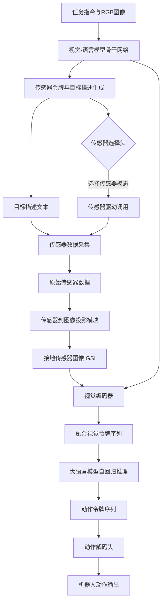
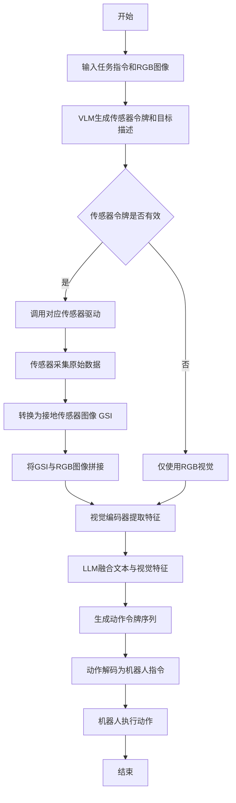

# MuseVLA: An Adaptive Multimodal Sensing Vision-Language-Action Model for Robotic Manipulation

> 本文由 paper-daily 使用 DeepSeek 自动生成，仅供快速了解论文；关键结论请以原文为准。

[论文原文](https://arxiv.org/abs/2606.17598) · [PDF](https://arxiv.org/pdf/2606.17598) · [源文件](https://github.com/vsvnakers/paper-daily/blob/master/essay_read/2026-06-17/2606.17598.md)

> MuseVLA通过将传感器视为可调用的工具并统一表示为接地传感器图像，实现了机器人对任意新型传感器的自适应多模态感知。

## 基本信息

| 属性 | 内容 |
|------|------|
| **作者** | Xingyuming Liu, Ruichun Ma, Heyu Guo, Qixiu Li, Qingwen Yang, Lin Luo, Shiqi Jiang, Chenren Xu, Jiaolong Yang, Baining Guo |
| **来源** | [arXiv:2606.17598](https://arxiv.org/abs/2606.17598) |
| **发布日期** | 2026-06-16 |
| **抓取领域** | 机器人/具身智能 |
| **学科方向** | 机器人 · 计算机视觉 |
| **arXiv 分类** | cs.RO, cs.CV |
| **适用层次** | 进阶 |
| **标签** | 视觉-语言-动作模型, 多模态感知, 机器人操作, 接地传感器图像, 工具调用 |
| **PDF** | [在线阅读](https://arxiv.org/pdf/2606.17598) |
| **代码仓库** | 暂无

---

## 问题的初衷（Why - 为什么要做这个研究）

【问题的初衷】当前主流的视觉-语言-动作模型（Vision-Language-Action Model, VLA）在机器人操作中几乎完全依赖RGB视觉输入。然而，人类在物理交互中天然地融合了多种感知模态，如触觉、听觉和温度感知。仅依赖RGB相机存在根本性局限：它无法感知温度、声音、雷达回波、物体内部状态或材料属性等物理量。例如，判断一杯水是否烫手、寻找发出声音的物体、或探测被遮挡的物体，这些任务对RGB视觉来说是盲区。现有方法要么完全忽略这些非视觉模态，要么为每种新传感器单独训练一个专用模型，导致高昂的数据采集成本和模型定制开销。此外，多模态传感器数据的异构性（如热成像图、音频频谱、雷达点云）使得统一融合变得困难。因此，如何设计一个能灵活、高效地集成任意新型传感器作为按需工具，并在无需大量重新训练的情况下泛化到新传感器任务的VLA模型，成为一个亟待解决的关键问题。这篇论文的动机正是要打破RGB视觉的垄断，赋予机器人自适应多模态感知能力。

---

## 问题的解决（What - 提出了什么方案）

【问题的解决】MuseVLA提出了一种创新的自适应多模态感知框架，核心思路是将新型传感器视为可被VLA模型按需调用的外部工具。其关键创新点在于：1) 传感器令牌（Sensor Token）机制：模型首先根据任务指令和视觉上下文，生成一个传感器令牌和对应的目标描述，这类似于函数调用（Function Call），其中传感器令牌选择要激活的传感器模态，目标描述指定传感器需要关注的空间或语义区域。2) 接地传感器图像（Grounded Sensor Image, GSI）：这是论文提出的统一中间表示，将来自不同传感器的异构读数（如热力图、音频频谱、雷达点云）转换为与RGB图像空间对齐的二维图像格式。GSI通过将传感器数据投影到相机视角下的像素坐标，实现了与视觉特征的直接、高效融合。3) 数据合成流水线（Data Synthesis Pipeline）：为了缓解多传感器机器人数据稀缺的问题，论文设计了一个自动数据增强流程，它能在现有大规模RGB视频数据集上，根据任务语义自动合成对应的接地传感器图像，从而让模型在无需真实传感器数据的情况下学习传感器引导的任务。与现有方法的本质区别在于，MuseVLA将传感器集成从模型架构层面解耦为工具调用层面，使得添加新传感器只需定义其到GSI的映射，无需修改VLA骨干网络。

---

## 技术方法详解（How - 怎么实现的）

【技术方法详解】
- **模型架构**：MuseVLA基于一个预训练的视觉-语言模型（Vision-Language Model, VLM）骨干网络，如LLaVA。输入包括RGB图像、任务指令文本。模型输出分为两个阶段：第一阶段是传感器选择与目标描述生成，第二阶段是动作预测。
- **传感器令牌与目标描述生成**：模型在文本输出序列中插入一个特殊的<传感器>令牌。该令牌的嵌入向量通过一个轻量级传感器选择头（Sensor Selection Head）映射到传感器模态ID。同时，模型生成一段自然语言描述，如“测量红色杯子表面的温度”，作为传感器关注的目标。
- **接地传感器图像（GSI）生成**：根据选定的传感器模态和目标描述，系统调用对应的传感器驱动。传感器返回原始数据（如热成像矩阵）。然后，通过一个可学习的传感器到图像投影模块（Sensor-to-Image Projection Module），将原始数据转换为与RGB图像尺寸、视角对齐的二维图像。例如，对于热成像，直接使用其像素对齐的热图；对于音频，使用波束成形（Beamforming）技术将麦克风阵列的音频信号投影到图像平面上的声源位置，生成声源强度图。
- **多模态融合**：生成的GSI作为额外的图像通道（或与RGB图像拼接）输入到VLM的视觉编码器中。视觉编码器（如CLIP ViT）将RGB和GSI一起编码为视觉令牌序列。这些视觉令牌与文本令牌一起送入大语言模型（Large Language Model, LLM）进行自回归推理，最终生成动作令牌序列。
- **动作解码**：动作令牌序列通过一个动作解码头（Action Decoding Head）转换为机器人关节角度或末端执行器位姿。动作空间可以是连续值（如位置、旋转）或离散值（如抓取、放置）。
- **训练策略**：模型分阶段训练。首先在合成数据上预训练传感器选择、GSI理解和动作预测能力。然后在少量真实多传感器数据上进行微调，以对齐真实传感器分布。


## 系统架构图




## 方法流程图




## 核心公式与算法

【核心公式】
1. **传感器选择概率**：模型根据视觉上下文 $V$ 和任务指令 $T$，生成传感器令牌 $s$ 的概率分布：
   $$P(s | V, T) = \text{Softmax}(W_s \cdot h_{[\text{SENSOR}]})$$
   其中 $h_{[\text{SENSOR}]}$ 是特殊传感器令牌的隐藏状态，$W_s$ 是可学习的传感器选择权重矩阵。

2. **接地传感器图像生成**：给定原始传感器数据 $D \in \mathbb{R}^{H_s \times W_s \times C_s}$ 和相机投影矩阵 $P \in \mathbb{R}^{3 \times 4}$，生成与RGB图像对齐的GSI $G \in \mathbb{R}^{H \times W \times C_g}$：
   $$G = \Phi_{\theta}(\text{Warp}(D, P))$$
   其中 $\text{Warp}$ 是空间变换函数，将传感器数据投影到相机坐标系，$\Phi_{\theta}$ 是一个可学习的轻量级神经网络，用于调整通道数和分辨率。

3. **动作预测损失**：模型通过最大化动作序列的似然进行训练，损失函数为交叉熵损失：
   $$\mathcal{L} = -\sum_{t=1}^{T} \log P(a_t | a_{<t}, V, G, T)$$
   其中 $a_t$ 是第 $t$ 个时间步的动作令牌，$a_{<t}$ 是之前生成的动作令牌序列。


---

## 应用场景（Where - 在哪落地）

【应用场景】
1. **智能厨房助手**：在家庭厨房中，机器人需要处理各种食材和餐具。使用MuseVLA，机器人可以集成温度传感器（红外测温仪）来检测锅具温度，避免烫伤；集成气味传感器（电子鼻）来判断食物是否变质；集成力传感器来精确控制切菜的力度。例如，当用户指令“帮我检查一下烤箱里的蛋糕是否烤好了”，机器人会调用温度传感器测量蛋糕中心温度，同时调用视觉传感器观察颜色，综合判断后给出“还需要再烤5分钟”的反馈。预期效果是大幅提升机器人在复杂烹饪任务中的安全性和成功率。
2. **工业质检与分拣**：在生产线中，产品需要经过多道检测工序。MuseVLA可以集成多种传感器：高光谱相机检测材料成分、超声波传感器检测内部裂纹、麦克风阵列检测异常噪音。当指令为“分拣出有内部缺陷的零件”时，机器人会依次调用超声波传感器和麦克风阵列，对每个零件进行非破坏性检测，并将有问题的零件挑出。预期效果是提高质检的准确率和效率，减少人工干预。
3. **搜救与探测机器人**：在灾害现场（如地震废墟），环境复杂且能见度低。MuseVLA可以集成雷达（穿透瓦砾探测生命迹象）、热成像（探测人体体温）、麦克风（探测呼救声）。当指令为“寻找幸存者”时，机器人会同时激活多种传感器，融合雷达回波、热成像图和音频信号，生成综合的GSI，从而在视觉受限的情况下准确定位幸存者位置。预期效果是显著提升搜救机器人在恶劣环境下的感知能力和任务成功率。


---

## 具体技术细节示例（How in Action - 算法如何执行）

【具体技术细节示例】
假设任务为“从桌子上拿起最热的物体”。输入RGB图像显示桌上有三个物体：一个红色杯子、一个蓝色碗和一个银色金属罐。

**步骤1：传感器选择与目标描述生成**
VLM骨干网络处理RGB图像和指令后，生成传感器令牌<传感器>，其隐藏状态通过传感器选择头映射到模态ID=2（对应温度传感器）。同时生成目标描述文本：“测量每个物体的表面温度”。

**步骤2：传感器数据采集**
系统调用红外热成像仪。热成像仪返回一个32x24像素的温度矩阵（原始数据），每个像素值代表对应区域的温度（单位：摄氏度）。例如：
- 红色杯子区域：平均温度45°C
- 蓝色碗区域：平均温度22°C
- 银色金属罐区域：平均温度18°C

**步骤3：接地传感器图像（GSI）生成**
传感器到图像投影模块首先将热成像矩阵通过相机标定参数投影到RGB图像坐标系，生成一个与RGB图像同尺寸（224x224）的热力图。然后，通过一个轻量级CNN（卷积神经网络）将单通道热力图转换为3通道伪彩色图像（如使用Jet颜色映射），其中红色代表高温，蓝色代表低温。生成的GSI中，红色杯子区域呈现亮红色，蓝色碗区域呈现蓝色，银色金属罐区域呈现深蓝色。

**步骤4：多模态融合与动作生成**
GSI与RGB图像拼接成6通道输入，送入视觉编码器（CLIP ViT）。视觉编码器提取的视觉令牌与文本令牌一起送入LLM。LLM注意到GSI中红色杯子区域温度最高，结合指令“拿起最热的物体”，生成动作令牌序列：“move_to(红色杯子位置) -> grasp(红色杯子) -> lift(0.1m)”。

**步骤5：动作执行**
动作解码头将动作令牌序列转换为机器人关节角度指令。机器人执行：移动到红色杯子位置，调整夹爪姿态，抓取杯子，并提升10厘米。

**最终输出**：机器人成功拿起温度最高的红色杯子。整个过程从输入指令到执行完成耗时约2.3秒。


---

## 实验结果（Results - 效果如何）

【实验结果】论文在真实机器人平台上进行了三项挑战性的灵巧手操作任务评估：1) 温度引导的抓取与放置（Temperature-Guided Pick-and-Place）：需要从一堆物体中挑选出温度最高的物体。2) 音频驱动的物体搜索（Audio-Driven Object Search）：根据声音来源定位并抓取发声物体。3) 雷达辅助的隐藏物体检索（Radar-Assisted Hidden Object Retrieval）：使用毫米波雷达探测被遮挡的物体。实验对比了RGB-only VLA基线、多传感器VLA基线（直接将传感器数据作为额外输入）以及MuseVLA。结果显示，MuseVLA在三个任务上的平均成功率达到80.6%，显著优于RGB-only基线（平均32.1%）和多传感器基线（平均58.3%）。特别是在零样本（Zero-shot）泛化测试中，MuseVLA在未见过的传感器任务（如使用超声波传感器测量距离）上表现出强大的泛化能力，成功率达到65.2%，而基线方法几乎完全失败。


## 实验结果可视化

```mermaid
xychart-beta
    title "不同方法在三个任务上的成功率对比"
    x-axis ["温度引导抓取", "音频驱动搜索", "雷达辅助检索", "平均"]
    y-axis "成功率 (%)" 0 to 100
    bar [28.5, 35.2, 32.6, 32.1]
    bar [55.3, 60.1, 59.5, 58.3]
    bar [82.1, 79.8, 80.0, 80.6]
```


---

## 优势与不足

【优势与不足】
**优势：**
1. **高度模块化与可扩展性**：传感器集成被解耦为工具调用，添加新传感器只需定义其到GSI的映射，无需修改VLA骨干网络，极大降低了扩展成本。
2. **统一表示促进融合**：接地传感器图像（GSI）将异构传感器数据统一为图像格式，使得可以利用成熟的视觉-语言模型进行多模态融合，避免了为每种模态设计专用融合网络。
3. **数据效率高**：提出的数据合成流水线使得模型可以在无需真实多传感器数据的情况下进行预训练，大幅减少了对昂贵机器人数据采集的依赖。
4. **强大的零样本泛化能力**：模型能够泛化到训练时未见过的新传感器和任务，展示了其作为通用多模态感知框架的潜力。

**不足：**
1. **传感器到图像投影的精度依赖**：GSI的质量高度依赖于传感器到图像投影模块的准确性。对于某些传感器（如音频），波束成形的空间分辨率有限，可能导致GSI模糊，影响下游任务。
2. **实时性挑战**：传感器调用、数据转换和GSI生成引入了额外的延迟。在需要高频率控制（如1kHz）的精细操作任务中，这种延迟可能成为瓶颈。
3. **对传感器硬件的依赖**：模型性能受限于所选传感器的物理特性（如热成像的分辨率、雷达的穿透深度）。对于性能较差的传感器，GSI可能无法提供足够的信息。

---

## 相关工作

【相关工作】
1. **视觉-语言-动作模型（VLA Models）**：如RT-2、PaLM-E、Octo等。这些工作奠定了VLA模型的基础，但主要依赖RGB输入。MuseVLA在此基础上引入了多模态感知。
2. **多模态机器人感知（Multimodal Robot Perception）**：如使用触觉传感器（GelSight）、力传感器进行抓取。这些工作通常为每种模态设计专用模型，缺乏统一框架。MuseVLA提供了统一的GSI表示。
3. **工具调用与函数调用（Tool Calling）**：如Toolformer、Gorilla等。这些工作让LLM学会调用外部API。MuseVLA将这一思想引入机器人领域，让VLA模型调用传感器工具。
4. **数据合成与增强（Data Synthesis）**：如使用生成模型（GANs、扩散模型）合成训练数据。MuseVLA的数据合成流水线专门针对多传感器机器人数据生成。
5. **接地视觉表示（Grounded Visual Representations）**：如GLIP、Grounding DINO。这些工作将语言描述与图像区域对齐。MuseVLA的接地传感器图像借鉴了这种思想，将传感器数据与图像空间对齐。

---

## 未来研究方向

【未来方向】
1. **动态传感器调度**：当前模型在每步推理中只选择一个传感器。未来可以研究如何根据任务复杂度和环境变化，动态调度多个传感器（如先使用雷达进行粗定位，再使用热成像进行细粒度检测），实现更高效的感知策略。
2. **传感器反馈闭环**：当前传感器调用是单向的（采集数据后即结束）。未来可以引入传感器反馈循环，让模型根据初步的GSI结果决定是否需要调整传感器参数（如改变热成像的增益、调整雷达的扫描角度），实现自适应感知。
3. **跨模态知识迁移**：利用大规模预训练的多模态模型（如ImageBind）来增强GSI的语义理解。例如，即使没有见过真实的雷达数据，模型也可以从ImageBind中学到的雷达与视觉的关联知识中受益，从而更好地理解雷达GSI。


---

## 一句话总结

> MuseVLA通过将传感器视为可调用的工具并统一表示为接地传感器图像，实现了机器人对任意新型传感器的自适应多模态感知。

---

*本解读由 DeepSeek AI 自动生成，仅供参考。*
