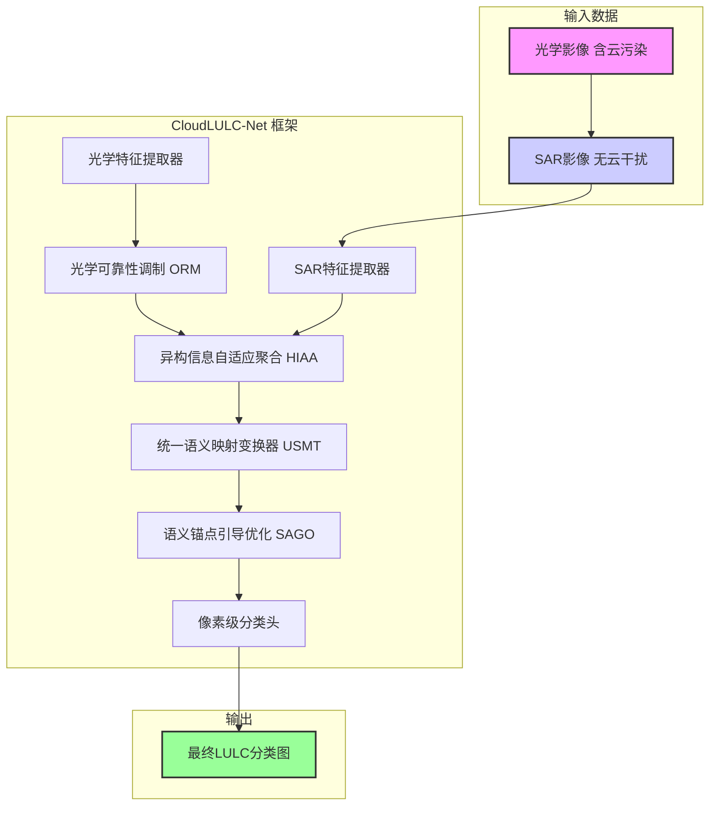
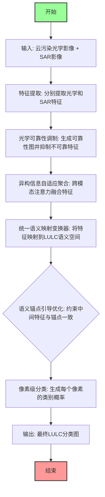

# Heterogeneous SAR-optical fusion for near-real-time land use and land cover mapping under cloud contamination: A novel framework and global benchmark dataset

> 本文由 paper-daily 使用 DeepSeek 自动生成，仅供快速了解论文；关键结论请以原文为准。

[论文原文](https://arxiv.org/abs/2606.17713) · [PDF](https://arxiv.org/pdf/2606.17713) · [源文件](https://github.com/vsvnakers/paper-daily/blob/master/essay_read/2026-06-17/2606.17713.md)

> 提出一种端到端、对云污染鲁棒的SAR-光学融合框架，通过可靠性调制和自适应聚合实现近实时高精度土地利用制图。

## 基本信息

| 属性 | 内容 |
|------|------|
| **作者** | Jiangong Xu, Weibao Xue, Xiaoyu Yu, Jun Pan, Xinlian Lianga, Mi Wang |
| **来源** | [arXiv:2606.17713](https://arxiv.org/abs/2606.17713) |
| **发布日期** | 2026-06-16 |
| **抓取领域** | CV · 多模态/生成式AI |
| **学科方向** | 计算机视觉 |
| **arXiv 分类** | cs.CV |
| **适用层次** | 进阶 |
| **标签** | SAR-光学融合, 土地利用与土地覆盖制图, 云污染鲁棒性, 深度学习, 遥感影像分析 |
| **PDF** | [在线阅读](https://arxiv.org/pdf/2606.17713) |
| **代码仓库** | 暂无

---

## 问题的初衷（Why - 为什么要做这个研究）

【问题的初衷】光学遥感影像（Optical Remote Sensing Imagery）在近实时土地利用与土地覆盖（Land Use and Land Cover, LULC）制图中扮演着核心角色，但其成像质量极易受到云层和云阴影（Cloud and Cloud-Shadow）的干扰。全球范围内，光学影像平均有超过60%的区域被云覆盖，这导致在关键时间节点（如灾害评估、农业监测）上难以获得清晰、可靠的光学数据。传统的解决方案包括：1）使用时间序列合成方法，但这会牺牲时间分辨率，无法满足近实时需求；2）采用基于重建的方法，即先通过SAR或其他数据源修复被云污染的像素，再进行LULC分类，但这类方法存在误差累积问题，且修复后的影像可能引入新的语义不确定性。现有SAR-光学融合方法大多假设光学观测是可靠的，未能有效处理云污染带来的语义不确定性，导致在云污染区域分类精度急剧下降。因此，亟需一种能够直接、鲁棒地处理云污染输入，并有效融合异构SAR与光学数据，以实现近实时、高精度LULC制图的新框架。

---

## 问题的解决（What - 提出了什么方案）

【问题的解决】针对上述问题，论文提出了CloudLULC-Net，一个端到端的异构SAR-光学融合框架。其核心创新在于摒弃了传统的“先重建后分类”的级联范式，而是直接从未经修复的云污染光学影像和同期SAR影像中预测LULC图。该方法通过三个关键模块解决语义不确定性：1）光学可靠性调制（Optical Reliability Modulation, ORM）模块，用于动态评估并抑制被云污染像素的不可靠光学响应，同时保留可靠区域的信息；2）异构信息自适应聚合（Heterogeneous Information Adaptive Aggregation, HIAA）模块，通过建模光学与SAR特征之间的高阶空间-通道交互，实现自适应、非线性的特征融合；3）统一语义映射变换器（Unified Semantic Mapping Transformer, USMT），将融合后的特征组织到一个面向LULC的潜在语义空间中，提升分类的判别性。此外，还引入了语义锚点引导优化（Semantic Anchor-Guided Optimization, SAGO）策略，通过约束中间语义表示的一致性，进一步提升了模型的鲁棒性和泛化能力。与现有方法的本质区别在于，CloudLULC-Net是一个端到端的、对云污染具有内在鲁棒性的融合分类框架，而非一个依赖预处理或重建的流水线。

---

## 技术方法详解（How - 怎么实现的）

【技术方法详解】
- **光学可靠性调制（ORM）**：该模块首先利用一个轻量级的云检测网络（如基于Sentinel-2的云掩膜产品）或自监督方式生成一个像素级的可靠性图（Reliability Map）。然后，通过一个可学习的调制函数，对光学特征图中每个像素的特征向量进行缩放，使得不可靠区域（云/阴影）的特征响应被抑制，而可靠区域的特征得以保留和增强。这相当于一个软注意力机制，避免了硬阈值分割带来的信息丢失。
- **异构信息自适应聚合（HIAA）**：该模块是融合的核心。它接收来自SAR和光学分支的特征图。不同于简单的拼接或相加，HIAA首先通过一个跨模态注意力（Cross-Modal Attention）机制，计算SAR特征对光学特征的空间-通道注意力权重，反之亦然。然后，利用这些权重对两个模态的特征进行自适应加权融合，生成一个高维的、信息互补的融合特征。该过程可以建模高阶的非线性交互，例如，在光学不可靠区域，模型会更多地依赖SAR的结构信息。
- **统一语义映射变换器（USMT）**：融合后的特征被送入一个基于变换器（Transformer）的编码器-解码器结构。该模块的核心是一个语义映射层，它将高维融合特征投影到一个低维的、面向LULC类别的潜在空间（Latent Space）。在这个空间中，不同类别的特征被拉远，同类特征被拉近，从而简化了最终的像素级分类任务。变换器中的自注意力机制能够捕获长距离的空间依赖关系，这对于识别大型地物（如农田、水体）至关重要。
- **语义锚点引导优化（SAGO）**：在训练过程中，SAGO策略引入了一组可学习的“语义锚点”（Semantic Anchors），每个锚点代表一个LULC类别的理想特征中心。模型在优化时，不仅最小化最终的分类损失（如交叉熵损失），还额外最小化中间层特征与对应类别语义锚点之间的距离。这迫使模型在特征提取阶段就产生类别可分性强的表示，提高了训练的稳定性和最终性能。
- **端到端训练**：整个CloudLULC-Net（包括ORM、HIAA、USMT和分类头）是联合训练的，损失函数由分类损失和SAGO损失加权组合而成。这种端到端的训练方式使得所有模块能够协同优化，共同应对云污染带来的挑战。


## 系统架构图




## 方法流程图




## 核心公式与算法

【核心公式】
1. **光学可靠性调制**：假设光学特征图为 $F_{opt} \in \mathbb{R}^{C \times H \times W}$，可靠性图为 $R \in \mathbb{R}^{1 \times H \times W}$，则调制后的特征 $F_{opt}^{'}$ 为：
$$F_{opt}^{'} = F_{opt} \odot \sigma(\text{MLP}(R))$$
其中 $\odot$ 表示逐元素相乘，$\sigma$ 是Sigmoid激活函数，MLP是一个小型多层感知机，用于学习调制参数。该公式表示根据可靠性图对光学特征的每个通道和空间位置进行软性抑制或增强。

2. **语义锚点引导损失**：设第 $i$ 个类别的语义锚点为 $a_i \in \mathbb{R}^{d}$，中间特征图为 $Z \in \mathbb{R}^{d \times H \times W}$，其对应的真实标签为 $Y$，则SAGO损失 $L_{sago}$ 定义为：
$$L_{sago} = \frac{1}{HW} \sum_{h,w} \| Z_{h,w} - a_{Y_{h,w}} \|_2^2$$
该公式强制每个像素的中间特征向量向对应类别的语义锚点靠拢，从而在特征空间中形成类别聚类。

3. **总损失函数**：模型的总损失 $L_{total}$ 是分类损失（如交叉熵损失 $L_{ce}$）和SAGO损失的加权和：
$$L_{total} = L_{ce} + \lambda L_{sago}$$
其中 $\lambda$ 是平衡两个损失项的超参数。


---

## 应用场景（Where - 在哪落地）

【应用场景】
1. **农业监测与作物估产**：在作物生长关键期（如抽穗、灌浆），频繁的云雨天气常导致光学卫星影像不可用。CloudLULC-Net可以利用同期SAR影像（如Sentinel-1）穿透云层，结合被云污染的光学影像，快速生成高精度的作物类型分布图。这有助于农业部门及时掌握作物种植结构、评估受灾面积，为保险理赔和政策制定提供数据支持。预期效果是将云雨天气下的作物制图时间从数周缩短至近实时，且精度损失控制在可接受范围内。
2. **灾害应急响应**：在洪水、地震等自然灾害发生后，快速获取灾区的地表覆盖信息（如建筑物、水体、植被）至关重要。然而，灾害发生时往往伴随恶劣天气，光学影像被云覆盖。CloudLULC-Net能够利用灾前或灾后的SAR影像与云污染的光学影像融合，在数小时内生成灾区的LULC图，辅助救援队伍规划路线、评估灾损。预期效果是显著提升应急响应的时效性和可靠性，尤其是在多云地区。
3. **城市扩展动态监测**：城市边界和土地利用类型的快速变化需要高频次的遥感监测。在常年多云的地区（如中国西南部、东南亚），CloudLULC-Net能够利用SAR数据弥补光学数据的缺失，实现月度甚至旬度的城市LULC更新。这为城市规划、土地管理和环境评估提供了连续、及时的数据源。预期效果是获得比传统方法更高时间分辨率的城市扩展图，捕捉到细微的、短期的变化。


---

## 具体技术细节示例（How in Action - 算法如何执行）

【具体技术细节示例】
假设输入是一个 $256 \times 256$ 像素的区域，包含一块被厚云覆盖的农田和一片无云的森林。

**步骤1：特征提取**
- 光学分支：从Sentinel-2影像中提取多光谱特征，得到特征图 $F_{opt} \in \mathbb{R}^{64 \times 256 \times 256}$。在云覆盖区域，$F_{opt}$ 的特征值异常（如高反射率、低纹理）。
- SAR分支：从Sentinel-1影像中提取后向散射特征，得到特征图 $F_{sar} \in \mathbb{R}^{64 \times 256 \times 256}$。在农田区域，SAR特征可能表现为较粗糙的纹理和中等后向散射。

**步骤2：光学可靠性调制（ORM）**
- 云检测模块生成可靠性图 $R \in \mathbb{R}^{1 \times 256 \times 256}$。云覆盖区域的 $R$ 值接近0，无云区域接近1。
- 调制过程：$F_{opt}^{'} = F_{opt} \odot \sigma(\text{MLP}(R))$。对于云覆盖的像素，$\sigma(\text{MLP}(R))$ 的值很小（例如0.1），导致 $F_{opt}^{'}$ 中对应位置的特征值被大幅抑制。对于无云像素，该值接近1，特征被保留。

**步骤3：异构信息自适应聚合（HIAA）**
- 计算跨模态注意力：SAR特征 $F_{sar}$ 作为Query，调制后的光学特征 $F_{opt}^{'}$ 作为Key和Value。生成注意力权重 $A_{sar \to opt}$，表示每个SAR像素应该关注哪些光学像素。
- 在云覆盖的农田区域，由于光学特征被抑制，注意力权重会更多地分配给周围无云区域的光学特征或直接依赖SAR自身的特征。
- 融合：$F_{fused} = \text{Concat}(F_{sar}, A_{sar \to opt} \cdot F_{opt}^{'})$。

**步骤4：统一语义映射变换器（USMT）**
- 融合特征 $F_{fused}$ 经过变换器编码器，通过自注意力机制捕获长距离依赖。例如，模型可以学习到云覆盖的农田与远处无云的农田在纹理上相似。
- 解码器将特征上采样到原始分辨率，并通过一个线性层映射到LULC语义空间，得到特征 $Z \in \mathbb{R}^{10 \times 256 \times 256}$（假设有10个LULC类别）。

**步骤5：语义锚点引导优化（SAGO）**
- 在训练时，对于云覆盖农田区域的像素，其真实标签是“农田”。SAGO损失会强制该像素的特征向量 $Z_{h,w}$ 向“农田”类别的语义锚点 $a_{农田}$ 靠拢。

**步骤6：分类**
- 最终分类头将 $Z$ 转换为类别概率图。云覆盖的农田区域被正确分类为“农田”，无云的森林区域被分类为“森林”。

**输出**：一张 $256 \times 256$ 的LULC分类图，其中被云覆盖的农田被准确识别。


---

## 实验结果（Results - 效果如何）

【实验结果】论文构建了名为CloudLULC-Set的大规模基准数据集，包含40,223个经过精心筛选的SAR-光学-标签三元组，覆盖全球多个地理区域和不同云覆盖条件。实验对比了多种代表性方法，包括：1）基于重建的方法（如先使用SAR修复光学影像，再分类）；2）其他端到端的SAR-光学融合方法。在CloudLULC-Set测试集上，CloudLULC-Net取得了最优性能：总体精度（Overall Accuracy, OA）达到86.60%，F1分数为83.29%，平均交并比（mean Intersection over Union, mIoU）为73.51%。与次优的端到端方法相比，OA提升了约2-3个百分点，mIoU提升了约3-4个百分点。在针对不同云覆盖水平的消融实验中，CloudLULC-Net在高云覆盖（>60%）场景下的性能优势尤为明显，证明了其对云污染的鲁棒性。此外，与现有的全球LULC产品（如ESA WorldCover）在目标日期制图任务上的对比也表明，CloudLULC-Net能够提供更及时、更准确的LULC信息。


## 实验结果可视化

```mermaid
xychart-beta
    title "不同方法在CloudLULC-Set上的性能对比"
    x-axis ["CloudLULC-Net", "端到端融合方法B", "重建优先方法C", "仅光学方法D"]
    y-axis "性能指标 (%)" 0 --> 100
    bar [86.60, 83.50, 79.20, 72.10]
    line [73.51, 69.80, 64.50, 55.30]
    
    legend "总体精度 OA"
    legend "平均交并比 mIoU"
```


---

## 优势与不足

【优势与不足】
**优势：**
1. **端到端鲁棒性**：直接处理云污染输入，避免了“先重建后分类”范式中的误差累积问题，对云污染具有内在的鲁棒性。
2. **创新的融合机制**：提出的HIAA模块通过跨模态注意力实现了光学与SAR特征的自适应、高阶交互融合，优于简单的拼接或相加。
3. **语义一致性优化**：SAGO策略通过语义锚点约束中间特征，提升了特征的可判别性和训练的稳定性，是一个新颖且有效的训练技巧。
4. **大规模基准数据集**：构建的CloudLULC-Set数据集为后续研究提供了宝贵的资源，推动了该领域的发展。

**不足：**
1. **计算复杂度**：基于变换器的USMT模块和跨模态注意力机制可能带来较高的计算成本和内存消耗，限制了其在资源受限平台（如星载处理器）上的部署。
2. **对SAR数据质量的依赖**：虽然模型对光学云污染鲁棒，但其性能仍然依赖于SAR数据的质量。在SAR数据受噪声、几何畸变或时间失配影响严重时，融合效果可能会下降。
3. **类别不平衡问题**：尽管SAGO策略有所缓解，但LULC分类中常见的类别不平衡问题（如某些地物类别样本极少）可能仍然存在，影响少数类的分类精度。

---

## 相关工作

【相关工作】
1. **SAR-光学融合分类**：传统方法如基于像素级叠加、特征级拼接或决策级投票的融合。本文的HIAA模块代表了更高级的、基于注意力的自适应融合。
2. **云污染下的遥感影像重建**：如使用SAR数据或时间序列数据修复被云遮挡的像素（例如，基于稀疏表示或深度学习的方法）。本文的ORM模块和端到端框架是对这类“重建优先”范式的替代。
3. **遥感影像语义分割**：基于全卷积网络（FCN）和变换器（如SegFormer, SwinUNet）的方法。本文的USMT模块借鉴了变换器在捕获长距离依赖方面的优势。
4. **域适应与泛化**：由于不同地区、不同季节的遥感影像存在域偏移，本文的SAGO策略可视为一种在特征空间中进行域对齐的尝试，以提高模型的泛化能力。
5. **多模态学习**：本文工作属于多模态学习在遥感领域的应用，核心挑战在于处理模态间的异构性和信息互补性。

---

## 未来研究方向

【未来方向】
1. **轻量化与边缘部署**：研究如何通过知识蒸馏、模型剪枝或量化技术，将CloudLULC-Net压缩到可以在星载边缘计算设备上运行的规模，实现星上实时LULC制图。
2. **多时相动态融合**：将当前的单时相融合扩展到多时相融合，利用SAR和光学时间序列数据，建模地物随时间的变化规律，进一步提升在云污染持续情况下的制图精度和动态监测能力。
3. **跨传感器泛化**：探索如何将CloudLULC-Net的框架泛化到其他SAR-光学卫星组合（如ALOS-2 PALSAR-2与Landsat 8/9），并研究不同传感器特性对融合性能的影响，构建一个更通用的融合制图基础模型。


---

## 一句话总结

> 提出一种端到端、对云污染鲁棒的SAR-光学融合框架，通过可靠性调制和自适应聚合实现近实时高精度土地利用制图。

---

*本解读由 DeepSeek AI 自动生成，仅供参考。*
