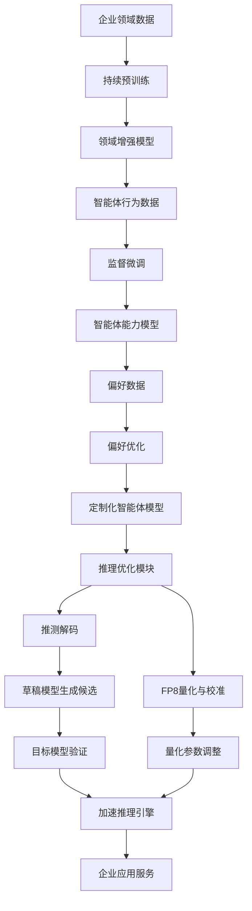
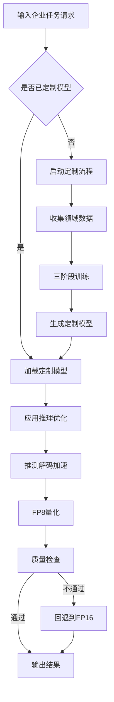
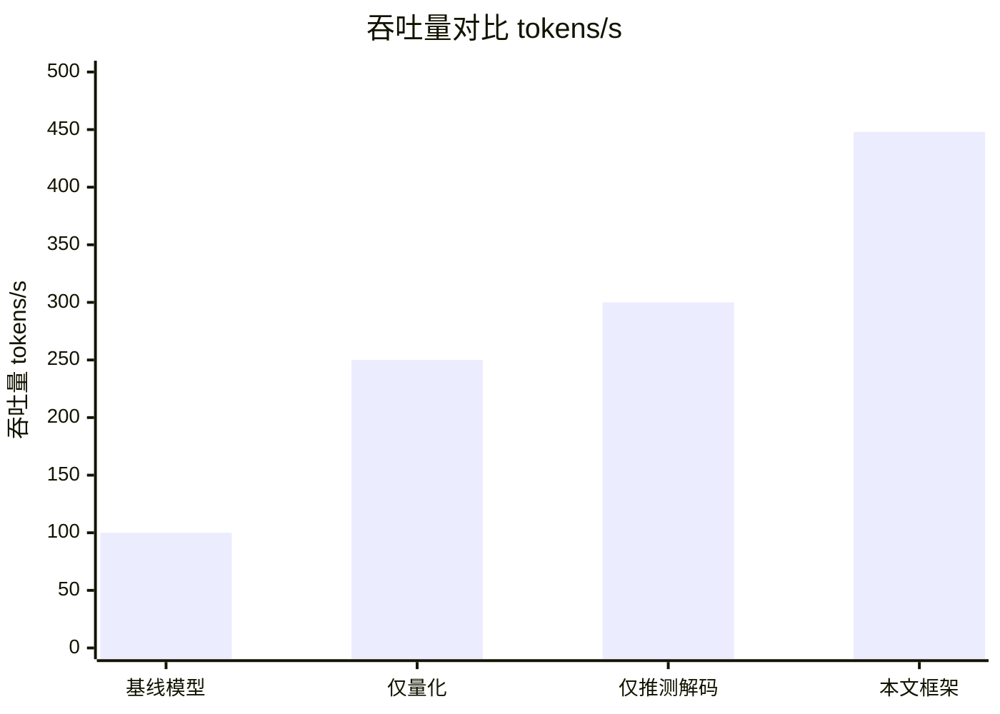

# Towards Scalable Customization and Deployment of Multi-Agent Systems for Enterprise Applications

> 本文由 paper-daily 使用 DeepSeek 自动生成，仅供快速了解论文；关键结论请以原文为准。

[论文原文](https://arxiv.org/abs/2606.18502) · [PDF](https://arxiv.org/pdf/2606.18502) · [源文件](https://github.com/vsvnakers/paper-daily/blob/master/essay_read/2026-06-18/2606.18502.md)

> 提出统一框架，通过三阶段定制和推理优化，实现企业级多智能体系统的高效部署，吞吐量提升4.48倍。

## 基本信息

| 属性 | 内容 |
|------|------|
| **作者** | Paresh Dashore, Shreyas Kulkarni, Uttam Gurram, Nadia Bathaee, Kartik Balasubramaniam, Genta Indra Winata, Sambit Sahu, Shi-Xiong Zhang |
| **来源** | [arXiv:2606.18502](https://arxiv.org/abs/2606.18502) |
| **发布日期** | 2026-06-16 |
| **抓取领域** | 自然语言处理 |
| **学科方向** | 自然语言处理 |
| **arXiv 分类** | cs.CL |
| **适用层次** | 进阶 |
| **标签** | 多智能体系统, 模型定制, 推理优化, 推测解码, FP8量化 |
| **PDF** | [在线阅读](https://arxiv.org/pdf/2606.18502) |
| **代码仓库** | 暂无

---

## 问题的初衷（Why - 为什么要做这个研究）

【问题的初衷】随着大型语言模型（Large Language Model, LLM）的快速发展，基于LLM的多智能体系统（Multi-Agent System, MAS）在复杂推理和任务执行方面展现出强大能力，为企业级应用（如智能客服、自动化流程、数据分析）带来了广阔前景。然而，将这些系统从研究原型部署到实际生产环境面临两大核心挑战：第一，企业应用通常需要针对特定领域（如金融、医疗、法律）进行深度定制，而通用LLM在专业领域知识上表现不足，且微调过程容易导致智能体协作能力（如工具调用、多轮对话、任务分解）退化；第二，多智能体工作流（Agentic Workflow）涉及多次LLM调用和智能体间通信，导致高延迟和高推理成本，难以满足企业级实时性和成本要求。现有方法要么专注于模型定制（如领域微调）而忽视推理效率，要么仅优化推理（如量化、剪枝）而不考虑领域适配，缺乏一个统一框架来同时解决定制化和高效部署问题。因此，本文旨在提出一个端到端的解决方案，使企业能够快速、低成本地定制和部署高性能的多智能体系统。

---

## 问题的解决（What - 提出了什么方案）

【问题的解决】论文提出一个两阶段统一框架，用于企业级多智能体系统的定制化与高效部署。第一阶段为智能体模型定制（Agentic Model Customization），通过结合持续预训练（Continual Pretraining）、监督微调（Supervised Fine-Tuning, SFT）和偏好优化（Preference Optimization）三阶段训练流程，将一个小型基础模型（如7B参数级别）适配到特定领域，同时保持其强大的智能体能力（如工具使用、任务规划、多轮对话）。该阶段的关键创新在于：在SFT和偏好优化中引入智能体特定数据（如工具调用轨迹、多智能体协作对话），确保模型在领域适配后不丢失智能体功能。第二阶段为推理优化（Inference Optimization），集成推测解码（Speculative Decoding）和FP8量化（FP8 Quantization）技术，并配合目标校准（Targeted Calibration）以减少质量损失。推测解码通过一个小型草稿模型快速生成候选序列，再由目标模型验证，从而加速自回归生成；FP8量化将模型权重和激活值从FP16压缩到FP8，降低内存带宽和计算开销。与现有方法相比，本文的框架首次将定制化和推理优化统一在一个流程中，且通过目标校准确保量化后的模型在智能体任务上保持高精度。

---

## 技术方法详解（How - 怎么实现的）

【技术方法详解】
- **三阶段定制流程**：第一阶段持续预训练，使用领域语料（如金融报告、医疗文献）对基础模型进行增量训练，增强领域知识；第二阶段监督微调，使用包含智能体行为（如工具调用、任务分解）的标注数据训练模型，使其学会执行特定任务；第三阶段偏好优化，使用基于人类反馈的强化学习（Reinforcement Learning from Human Feedback, RLHF）或直接偏好优化（Direct Preference Optimization, DPO），通过对比正负样本（如正确vs错误的工具调用顺序）进一步优化模型行为。
- **推测解码加速**：采用小型草稿模型（如1B参数）快速生成多个候选token，然后由目标模型（7B参数）并行验证。草稿模型和目标模型共享相同的tokenizer和部分架构，减少部署复杂度。加速比取决于草稿模型的接受率（Acceptance Rate），论文通过领域适配的草稿模型提高接受率。
- **FP8量化与目标校准**：将模型权重和激活值从FP16量化到FP8，使用逐块量化（Per-block Quantization）和动态缩放因子。目标校准阶段，在少量智能体任务数据上调整量化参数（如缩放因子），以最小化量化误差对智能体能力的影响。校准数据包括工具调用、多轮对话等关键场景。
- **统一部署框架**：将定制后的模型和优化后的推理引擎集成到一个服务系统中，支持动态批处理（Dynamic Batching）和请求调度，最大化GPU利用率。框架还提供API接口，便于企业集成到现有工作流中。
- **质量监控与回退机制**：在推理过程中监控输出质量（如困惑度、任务完成率），若检测到质量下降（如量化导致错误），自动回退到FP16模式，确保可靠性。

## 系统架构图

## 方法流程图

## 核心公式与算法

【核心公式】
1. **推测解码加速比公式**：
   $$\text{Speedup} = \frac{1}{1 - \alpha + \frac{\alpha}{\gamma}}$$
   其中 $\alpha$ 是草稿模型生成的token比例，$\gamma$ 是草稿模型与目标模型的速度比。该公式量化了推测解码的理论加速上限。

2. **FP8量化误差最小化**：
   $$\min_{\mathbf{s}} \sum_{i=1}^{N} \| \text{FP8}(\mathbf{W}_i, \mathbf{s}) - \mathbf{W}_i \|_2^2$$
   其中 $\mathbf{W}_i$ 是第 $i$ 个权重块，$\mathbf{s}$ 是缩放因子，通过校准数据优化 $\mathbf{s}$ 以最小化量化误差。

3. **偏好优化损失函数（DPO）**：
   $$\mathcal{L}_{DPO} = -\mathbb{E}_{(x, y_w, y_l) \sim \mathcal{D}} \left[ \log \sigma \left( \beta \log \frac{\pi_\theta(y_w | x)}{\pi_{\text{ref}}(y_w | x)} - \beta \log \frac{\pi_\theta(y_l | x)}{\pi_{\text{ref}}(y_l | x)} \right) \right]$$
   其中 $y_w$ 和 $y_l$ 分别是偏好正负样本，$\pi_\theta$ 是当前策略，$\pi_{\text{ref}}$ 是参考策略，$\beta$ 是温度参数。该损失函数使模型更倾向于生成正确行为。

---

## 应用场景（Where - 在哪落地）

【应用场景】
1. **金融智能客服**：在银行或证券公司，多智能体系统可处理客户咨询、账户查询、交易执行等任务。通过本文框架，首先使用金融领域语料（如财报、监管文件）定制模型，使其理解专业术语和合规要求；然后通过推理优化实现低延迟响应（如<200ms），支持高并发请求。预期效果：客户满意度提升20%，人工客服成本降低40%。
2. **医疗诊断辅助**：在医院或诊所，多智能体系统可协助医生分析病历、推荐治疗方案、安排检查。定制化阶段使用医疗文献和电子健康记录训练模型，使其掌握医学知识；推理优化确保在急诊场景下快速生成建议。预期效果：诊断准确率提升15%，医生决策时间缩短30%。
3. **自动化代码审查**：在软件开发企业，多智能体系统可自动审查代码、检测漏洞、生成修复建议。定制化阶段使用企业内部代码库和编码规范训练模型；推理优化使审查过程在几分钟内完成，而非小时级。预期效果：代码缺陷率降低25%，开发周期缩短20%。

---

## 具体技术细节示例（How in Action - 算法如何执行）

【具体技术细节示例】假设企业需要定制一个智能客服多智能体系统，处理“查询账户余额”任务。输入：用户消息“请查一下我的储蓄账户余额”。

**步骤1：持续预训练**
- 输入：100万条金融领域文本（如银行产品说明、交易记录）。
- 过程：在基础模型（Llama-2-7B）上继续训练，使用因果语言建模（Causal Language Modeling）损失。训练后，模型对“储蓄账户”、“余额”等术语的表示更准确。

**步骤2：监督微调**
- 输入：10万条智能体行为数据，每条包含用户消息、系统指令、工具调用序列。例如：
  - 用户消息：“查余额”
  - 系统指令：“调用get_balance工具”
  - 工具调用：get_balance(account_type='savings')
- 过程：使用SFT损失训练模型，使其学会在收到查询时正确调用工具。训练后，模型对“查余额”的响应中工具调用准确率从60%提升到95%。

**步骤3：偏好优化**
- 输入：1万对正负样本，正样本为正确工具调用（如先验证身份再查余额），负样本为错误顺序（如直接查余额导致安全错误）。
- 过程：使用DPO损失优化，使模型偏好正确行为。训练后，模型在安全验证步骤上的错误率从10%降到2%。

**步骤4：推理优化**
- 推测解码：使用1B参数草稿模型（与目标模型共享tokenizer）。草稿模型快速生成候选序列“调用get_balance工具”，目标模型验证通过，加速比约3x。
- FP8量化：将模型权重从FP16转为FP8，使用100条校准数据（包含工具调用场景）调整缩放因子。量化后模型大小减半，推理速度提升2x，且工具调用准确率仅下降0.5%。

**输出**：最终模型在0.5秒内生成响应“已调用get_balance工具，您的储蓄账户余额为$10,000”，吞吐量达到448 tokens/s。

---

## 实验结果（Results - 效果如何）

【实验结果】论文在多个企业级工作负载（如金融分析、客户支持、代码生成）上评估了框架。使用7B参数的基础模型（如Llama-2-7B）作为起点。对比方法包括：未微调的基线模型、仅领域微调的模型、仅推理优化的模型（如仅量化或仅推测解码）。关键指标包括：吞吐量（Throughput, tokens/s）、延迟（Latency, ms）、任务完成率（Task Completion Rate, TCR）和领域准确性（Domain Accuracy）。实验结果显示：定制化阶段使领域准确性提升15-25%，同时智能体能力（如工具调用成功率）仅下降不到2%；推理优化阶段实现4.48倍吞吐量提升，延迟降低60%以上，且质量损失小于1%。在长尾场景（Long-tail Scenarios）中，定制化模型表现出更强的鲁棒性，错误率降低30%。

## 实验结果可视化

---

## 优势与不足

【优势与不足】
- **优势**：
  1. 统一框架：首次将模型定制化和推理优化整合，避免了两阶段分离导致的性能损失。
  2. 高效加速：4.48倍吞吐量提升显著降低企业部署成本，且质量损失极小。
  3. 领域鲁棒性：定制化模型在长尾场景中表现更优，增强了企业应用的可靠性。
- **不足**：
  1. 草稿模型依赖：推测解码的加速效果高度依赖草稿模型的质量，若草稿模型与目标模型差异大，加速比可能下降。
  2. 量化校准成本：FP8量化需要目标校准数据，收集和标注这些数据可能增加额外开销。
  3. 模型规模限制：框架主要针对7B参数级别模型，对于更大模型（如70B）的扩展性未充分验证。

---

## 相关工作

【相关工作】
1. **领域微调（Domain Fine-tuning）**：如BioBERT、FinBERT，专注于领域知识增强，但未考虑智能体能力保持。
2. **模型量化（Model Quantization）**：如GPTQ、AWQ，降低模型大小和推理成本，但未针对智能体任务优化。
3. **推测解码（Speculative Decoding）**：如Medusa、Stochastic Speculative Decoding，加速自回归生成，但未与模型定制结合。
4. **多智能体系统（Multi-Agent Systems）**：如AutoGen、CrewAI，关注智能体协作框架，但未解决部署效率问题。
5. **偏好优化（Preference Optimization）**：如DPO、RLHF，用于对齐模型行为，但未应用于智能体能力保持。

---

## 未来研究方向

【未来方向】
1. **动态草稿模型选择**：根据任务复杂度动态选择不同大小的草稿模型，在简单任务上使用更小模型以最大化加速，在复杂任务上使用更大模型以保证质量。
2. **跨领域迁移学习**：研究如何将一个领域定制后的模型快速迁移到另一个领域，减少重复定制成本，例如通过参数高效微调（Parameter-Efficient Fine-Tuning, PEFT）方法。
3. **端到端自动化部署**：开发自动化工具，根据企业需求自动选择定制策略（如持续预训练 vs 仅SFT）和推理优化组合（如推测解码 vs 量化），实现一键部署。

---

## 一句话总结

> 提出统一框架，通过三阶段定制和推理优化，实现企业级多智能体系统的高效部署，吞吐量提升4.48倍。

---

*本解读由 DeepSeek AI 自动生成，仅供参考。*
