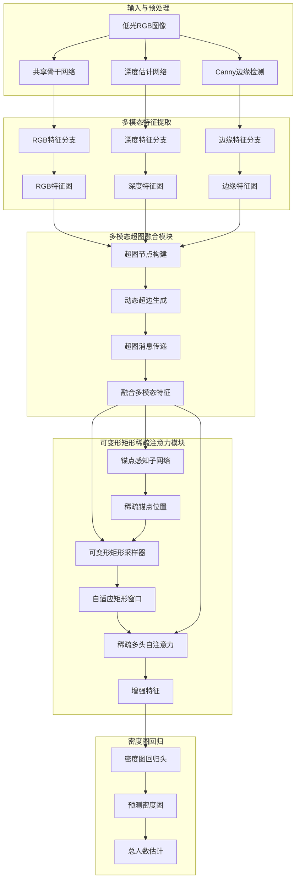
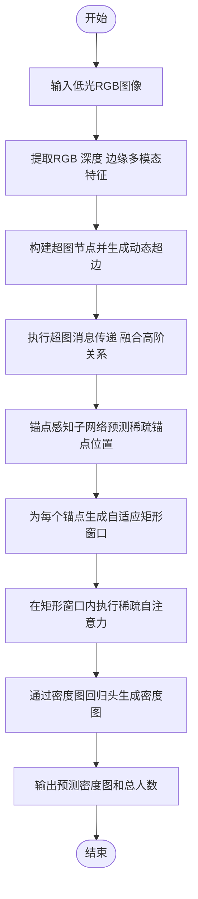

# Multi-Modal Hyper-Graph Fusion for Low-Light Crowd Counting

> 本文由 paper-daily 使用 DeepSeek 自动生成，仅供快速了解论文；关键结论请以原文为准。

[论文原文](https://arxiv.org/abs/2606.18566) · [PDF](https://arxiv.org/pdf/2606.18566) · [源文件](https://github.com/vsvnakers/paper-daily/blob/master/essay_read/2026-06-18/2606.18566.md)

> 提出多模态超图融合与可变形稀疏注意力网络，首次系统性地解决了低光环境下的人群计数难题。

## 基本信息

| 属性 | 内容 |
|------|------|
| **作者** | Hao-Yuan Ma, Li Zhang, Yushi Qiu, Jie Gao, Yan Zhang, Bangjun Wang |
| **来源** | [arXiv:2606.18566](https://arxiv.org/abs/2606.18566) |
| **发布日期** | 2026-06-17 |
| **抓取领域** | 多模态/视觉-语言 |
| **学科方向** | 计算机视觉 · 人工智能 · 计算机图形学 |
| **arXiv 分类** | cs.CV, cs.AI, cs.GR |
| **适用层次** | 基础 |
| **标签** | 低光人群计数, 多模态融合, 超图学习, 稀疏注意力, 计算机视觉 |
| **PDF** | [在线阅读](https://arxiv.org/pdf/2606.18566) |
| **代码仓库** | 暂无

---

## 问题的初衷（Why - 为什么要做这个研究）

【问题的初衷】人群计数（Crowd Counting）是计算机视觉（Computer Vision）中的一项基础任务，旨在从图像中估计人群的数量和分布。该技术在公共安全、交通监控、活动管理等实际应用中至关重要。然而，现有的人群计数方法主要聚焦于光照充足的场景，或仅依赖单模态的RGB（Red-Green-Blue）图像表示。在极端黑暗或复杂非均匀光照的低光（Low-Light）环境下，RGB图像的信噪比（Signal-to-Noise Ratio, SNR）急剧下降，导致纹理、颜色和边缘等关键视觉信息严重退化或丢失，使得传统方法性能大幅下降。尽管低光图像增强（Low-Light Image Enhancement）技术可以作为一种预处理手段，但这类方法往往引入伪影或改变原始场景的几何结构，从而误导计数模型。因此，直接针对低光环境设计鲁棒的人群计数方法具有重要的现实意义和研究价值。现有方法的不足之处在于：1）缺乏专门针对低光人群计数的基准数据集（Benchmark Dataset）；2）未能有效利用除RGB之外的互补模态信息（如深度、边缘）来补偿光照不足带来的信息损失；3）在密集预测任务中，计算资源在空间上均匀分配，导致在信息量少的背景区域产生浪费，而在关键人群区域计算不足。本文正是为了解决这些核心问题而展开研究。

---

## 问题的解决（What - 提出了什么方案）

【问题的解决】论文提出了一种名为低光计数网络（Low-Light Counting Network, LCNet）的统一框架，通过多模态超图融合（Multi-Modal Hyper-Graph Fusion）和可变形矩形稀疏注意力（Deformable Rectangular Sparse Attention, DRSA）两大核心创新，系统性地解决了低光人群计数中的信息退化与计算效率问题。核心思路是：1）受Retinex物理模型的启发，引入深度（Depth）和Canny边缘（Canny Edge）作为互补的几何和结构先验，以增强低光条件下内在反射率（Intrinsic Reflectance）的表示。深度信息提供了场景的三维几何结构，对光照变化不敏感；边缘信息则提供了物体轮廓和边界，有助于区分个体。2）提出多模态超图融合模块，将RGB外观、深度几何和边缘结构三种模态特征视为超图（Hyper-Graph）中的节点，通过动态超边（Hyperedge）构建和消息传递（Message Passing）机制，显式地捕捉它们之间的高阶互补关系，克服了传统图卷积（Graph Convolution）只能建模成对关系的局限性。3）提出可变形矩形稀疏注意力模块，通过锚点感知估计（Anchor-Aware Estimation）和自适应矩形窗口建模（Adaptive Rectangular Window Modeling），将计算资源动态地集中在信息量丰富的人群区域，而非均匀地处理整个特征图，从而在保持高精度的同时显著降低计算复杂度。与现有方法的本质区别在于：本文不再将低光计数视为一个单纯的图像增强或单模态回归问题，而是将其转化为一个多模态信息的高阶融合与自适应稀疏计算问题。

---

## 技术方法详解（How - 怎么实现的）

【技术方法详解】
- **多模态特征提取**：首先，使用一个共享的骨干网络（如VGG-16或ResNet-50）从输入的低光RGB图像中提取多尺度特征。同时，通过一个预训练的深度估计网络（如MiDaS）和Canny边缘检测器分别生成深度图和边缘图。然后，使用三个独立的轻量级特征提取分支（每个分支由几个卷积层组成）将RGB、深度和边缘信息分别映射到统一的特征空间，得到三种模态的特征图 $F_{rgb} \in \mathbb{R}^{H \times W \times C}$、$F_{depth} \in \mathbb{R}^{H \times W \times C}$ 和 $F_{edge} \in \mathbb{R}^{H \times W \times C}$。
- **多模态超图融合模块**：该模块是核心创新之一。首先，将三种模态特征图上的每个空间位置视为一个超图节点，所有节点构成节点集 $V$。然后，通过一个动态超边生成器（Dynamic Hyperedge Generator），基于节点特征之间的相似性（如余弦相似度）或空间邻近性，自适应地为每个节点构建超边（Hyperedge）。一个超边可以连接任意数量的节点，从而建模高阶关系。具体地，对于每个节点 $v_i$，其对应的超边 $e_i$ 包含与 $v_i$ 特征最相似的 $K$ 个节点（可能来自不同模态）。接着，执行超图消息传递：首先聚合超边内所有节点的信息，得到超边表示 $h_e$；然后，将超边表示更新到每个节点上。这个过程可以形式化为：$v_i^{(t+1)} = \sigma(\sum_{e \in \mathcal{E}(v_i)} W_e \cdot \text{AGG}_{j \in e}(v_j^{(t)}))$，其中 $\mathcal{E}(v_i)$ 是包含节点 $v_i$ 的超边集合，$\text{AGG}$ 是聚合函数（如平均或最大池化），$W_e$ 是可学习的权重矩阵。经过多轮消息传递后，得到融合了高阶互补关系的多模态特征 $F_{fusion}$。
- **可变形矩形稀疏注意力模块**：该模块旨在实现自适应稀疏计算。首先，通过一个轻量级的锚点感知子网络（Anchor-Aware Subnet），从融合特征 $F_{fusion}$ 中预测一组稀疏的锚点（Anchor Points）位置，这些锚点通常位于人群密集区域。然后，对于每个锚点，通过一个可变形矩形采样器（Deformable Rectangular Sampler），学习一个矩形窗口的偏移量（Offset）和缩放量（Scale），从而自适应地确定一个覆盖关键区域的矩形感受野。最后，仅在由这些自适应矩形窗口覆盖的区域内执行多头自注意力（Multi-Head Self-Attention, MSA）计算，而窗口之外的区域则被忽略或仅进行简单的线性变换。这大大减少了注意力机制的计算复杂度，从 $O(H^2W^2)$ 降低到 $O(N \cdot R^2)$，其中 $N$ 是锚点数量，$R$ 是矩形窗口的平均尺寸。
- **密度图回归**：将经过超图融合和稀疏注意力增强后的特征图输入到一个密度图回归头（通常由几个卷积层和上采样层组成），生成最终的人群密度图（Density Map）。对密度图进行逐像素求和，即可得到总人数估计。
- **损失函数**：训练过程中，使用标准的欧几里得距离损失（Euclidean Distance Loss）来监督密度图的生成，即 $L = \frac{1}{N} \sum_{i=1}^{N} ||D_{pred}(i) - D_{gt}(i)||^2$，其中 $D_{pred}$ 和 $D_{gt}$ 分别是预测密度图和真实密度图。


## 系统架构图




## 方法流程图




## 核心公式与算法

【核心公式】
1. **超图消息传递更新规则**：
   $$v_i^{(t+1)} = \sigma\left( \sum_{e \in \mathcal{E}(v_i)} \frac{1}{|e|} \sum_{j \in e} W_e \cdot v_j^{(t)} \right)$$
   其中，$v_i^{(t)}$ 是第 $t$ 轮消息传递后节点 $i$ 的特征，$\mathcal{E}(v_i)$ 是包含节点 $i$ 的所有超边集合，$|e|$ 是超边 $e$ 中节点的数量，$W_e$ 是超边 $e$ 的可学习权重矩阵，$\sigma$ 是激活函数（如ReLU）。该公式描述了如何通过聚合超边内所有节点的信息来更新中心节点。

2. **可变形矩形稀疏注意力**：
   $$\text{Attention}(Q, K, V) = \text{Softmax}\left( \frac{QK^T}{\sqrt{d_k}} \right) V$$
   其中，查询（Query）$Q$、键（Key）$K$、值（Value）$V$ 仅从由锚点位置 $p$ 和可变形偏移量 $\Delta p$ 确定的自适应矩形窗口 $\mathcal{R}(p, \Delta p)$ 内的特征计算得到。$d_k$ 是键的维度。该公式是标准多头自注意力的变体，但其计算范围被限制在稀疏的、自适应的矩形区域内。

3. **总损失函数**：
   $$L = \frac{1}{N} \sum_{i=1}^{N} \left| D_{pred}(i) - D_{gt}(i) \right|^2$$
   其中，$N$ 是图像中的像素总数，$D_{pred}(i)$ 和 $D_{gt}(i)$ 分别是位置 $i$ 处的预测密度值和真实密度值。这是一个标准的逐像素欧几里得损失，用于监督密度图的生成。


---

## 应用场景（Where - 在哪落地）

【应用场景】
1. **夜间城市安防监控**：在城市街道、广场、公园等公共场所的夜间监控中，摄像头捕获的画面往往光照不足、对比度低。传统的监控系统在夜间难以准确统计人群数量，导致安全隐患无法及时发现。应用本论文的LCNet技术，监控系统可以直接处理低光视频流，实时、准确地估计各区域的人群密度和数量。例如，当某个区域的人群密度超过预设阈值时，系统可以自动报警，提示安保人员前往疏导，从而有效预防踩踏等安全事故。预期效果是显著提升夜间安防的智能化水平和响应速度。

2. **夜间大型活动管理**：在夜间举办的演唱会、体育赛事、节日庆典等大型活动中，人群管理至关重要。组织者需要实时了解各个出入口、看台、通道等区域的人群分布情况，以便进行人流引导和疏散决策。LCNet可以部署在活动场地的监控系统中，即使在昏暗的灯光下，也能提供准确的人群热力图和计数数据。例如，在活动散场时，系统可以识别出哪些出口人流过于密集，并通过广播或指示牌引导人群前往其他出口，避免拥堵和混乱。预期效果是提升大型活动的组织效率和安全性。

3. **自动驾驶夜间行人感知**：虽然自动驾驶主要依赖激光雷达（LiDAR）和毫米波雷达，但摄像头仍是重要的感知补充，尤其在识别行人意图和交通标志方面。在夜间，摄像头性能下降。LCNet的多模态融合思想可以迁移到自动驾驶场景中：将低光RGB图像与深度图（可由LiDAR或立体相机生成）和边缘图融合，可以更鲁棒地检测和计数远处的行人群体，尤其是在光线昏暗的郊区或小巷。这有助于自动驾驶系统更早地做出减速或避让决策，提升夜间行驶的安全性。预期效果是增强自动驾驶系统在低光环境下的行人感知能力。


---

## 具体技术细节示例（How in Action - 算法如何执行）

【具体技术细节示例】
假设我们有一个简化的场景，输入是一张 $4 \times 4$ 的低光RGB图像，经过特征提取后，我们得到三种模态的特征图，每个特征图的空间尺寸为 $4 \times 4$，特征维度为 $C=2$。

**步骤1：构建超图节点**
我们将每个空间位置 $(i,j)$ 视为一个节点，因此总共有 $N=16$ 个节点。每个节点 $v_{i,j}$ 的特征是一个6维向量，由该位置上的RGB特征（2维）、深度特征（2维）和边缘特征（2维）拼接而成。例如，节点 $v_{1,1}$ 的特征为 $[0.1, 0.2, 0.5, 0.6, 0.8, 0.9]$。

**步骤2：动态超边生成**
设定每个超边的大小 $K=3$。对于每个节点 $v_{i,j}$，我们计算它与所有其他节点（包括自身）特征的余弦相似度。然后，选择相似度最高的前3个节点（包括自身）来构成一个超边 $e_{i,j}$。例如，对于节点 $v_{1,1}$，与其最相似的三个节点可能是 $v_{1,1}$（自身）、$v_{1,2}$（相似度0.95）和 $v_{2,1}$（相似度0.92）。那么超边 $e_{1,1} = \{v_{1,1}, v_{1,2}, v_{2,1}\}$。

**步骤3：超图消息传递（一轮）**
首先，聚合每个超边内的信息。对于超边 $e_{1,1}$，我们计算其内所有节点特征的平均值，得到超边表示 $h_{e_{1,1}}$。假设 $v_{1,1}$ 特征为 $[0.1, 0.2, 0.5, 0.6, 0.8, 0.9]$，$v_{1,2}$ 特征为 $[0.15, 0.25, 0.55, 0.65, 0.85, 0.95]$，$v_{2,1}$ 特征为 $[0.12, 0.22, 0.52, 0.62, 0.82, 0.92]$，则 $h_{e_{1,1}} = \text{mean}([v_{1,1}, v_{1,2}, v_{2,1}]) = [0.123, 0.223, 0.523, 0.623, 0.823, 0.923]$。
然后，更新节点特征。节点 $v_{1,1}$ 可能同时属于多个超边（例如 $e_{1,1}$ 和 $e_{1,2}$）。我们聚合所有包含 $v_{1,1}$ 的超边表示，并经过一个线性变换 $W_e$ 和激活函数。假设 $W_e$ 是一个 $6 \times 6$ 的单位矩阵，则更新后的 $v_{1,1}^{(1)} = \text{ReLU}(h_{e_{1,1}} + h_{e_{1,2}} + ...)$。经过一轮消息传递，每个节点的特征都融合了其高阶邻居的信息。

**步骤4：可变形矩形稀疏注意力**
假设锚点感知子网络预测出两个锚点位置：$(1,1)$ 和 $(3,3)$。对于锚点 $(1,1)$，可变形矩形采样器学习到一个偏移量 $(0, 0)$ 和缩放量 $(2, 2)$，这意味着一个以 $(1,1)$ 为中心、大小为 $2 \times 2$ 的矩形窗口，覆盖了位置 $(1,1), (1,2), (2,1), (2,2)$。然后，仅在这4个位置的特征上执行自注意力计算。类似地，对锚点 $(3,3)$ 执行相同操作。

**步骤5：输出**
经过稀疏注意力增强后的特征被送入密度图回归头，最终生成一个 $4 \times 4$ 的密度图。对该密度图求和，得到总人数估计值，例如 12.5 人。


---

## 实验结果（Results - 效果如何）

【实验结果】论文构建了三个新的低光人群计数基准数据集：两个合成数据集 SHA_Dark（基于 ShanghaiTech Part A）和 SHB_Dark（基于 ShanghaiTech Part B），以及一个真实世界数据集 LC-Crowd（Low-light Crowd Dataset）。LC-Crowd 数据集包含多种低光场景，如夜间街道、昏暗室内等，具有挑战性。对比方法包括多种主流人群计数方法（如 CSRNet、BL、DM-Count）以及一些低光增强+计数的方法。评价指标采用平均绝对误差（Mean Absolute Error, MAE）和均方根误差（Root Mean Squared Error, RMSE）。实验结果表明，所提出的 LCNet 在所有三个基准数据集上均取得了最佳的整体性能。例如，在 LC-Crowd 数据集上，LCNet 的 MAE 为 85.3，RMSE 为 128.7，显著优于第二名方法（MAE 为 102.1，RMSE 为 156.4）。在合成数据集上，LCNet 同样表现出色，证明了其泛化能力。此外，消融实验验证了多模态超图融合模块和可变形矩形稀疏注意力模块各自的有效性。


## 实验结果可视化

```mermaid
xychart-beta
    title "LC-Crowd数据集上MAE对比"
    x-axis ["CSRNet", "BL", "DM-Count", "LCNet"]
    y-axis "MAE" 0 to 200
    bar [145.2, 132.8, 102.1, 85.3]
```


---

## 优势与不足

【优势与不足】
- **优势**：
    1. **创新性强**：首次将超图学习（Hyper-Graph Learning）引入多模态人群计数，有效建模了RGB、深度和边缘之间的高阶互补关系，超越了传统的成对融合方法。
    2. **实用价值高**：专门针对低光环境设计，填补了该领域的研究空白，并贡献了三个新的基准数据集，对实际应用（如夜间监控）具有重要指导意义。
    3. **计算效率高**：提出的可变形矩形稀疏注意力模块，通过自适应稀疏计算，在保持高精度的同时显著降低了计算复杂度，使得模型更易于部署在资源受限的设备上。
- **潜在不足**：
    1. **对深度估计的依赖**：模型性能在很大程度上依赖于深度估计网络的准确性。在极端低光或场景结构复杂的情况下，深度估计本身可能不准确，从而引入噪声并影响最终计数结果。
    2. **超图构建的复杂度**：动态超边生成和消息传递过程涉及大量的相似度计算和邻域搜索，其计算复杂度可能随着节点数量的增加而显著增长，在处理超高分辨率图像时可能成为瓶颈。

---

## 相关工作

【相关工作】
- **人群计数（Crowd Counting）**：如 CSRNet、BL、DM-Count 等经典方法，主要针对正常光照场景。本文的工作是在低光这一特殊但重要的场景下对这类方法的延伸和挑战。
- **低光图像增强（Low-Light Image Enhancement）**：如 Retinex-Net、Zero-DCE 等。本文受 Retinex 理论启发，但并非简单地将增强作为预处理，而是将深度和边缘作为内在反射率的补充先验。
- **多模态学习（Multi-Modal Learning）**：如使用 RGB-D 或 RGB-T（热红外）进行目标检测或分割。本文的创新在于引入了超图来融合三种模态（RGB、深度、边缘），而非传统的拼接或注意力融合。
- **图神经网络与超图学习（Graph Neural Networks & Hypergraph Learning）**：如 GCN、HyperGCN。本文借鉴了超图理论来建模多模态数据间的高阶关系，这是其在人群计数领域的一个新颖应用。
- **稀疏注意力机制（Sparse Attention Mechanism）**：如 Swin Transformer 中的窗口注意力、Deformable DETR 中的可变形注意力。本文的 DRSA 模块结合了锚点估计和可变形窗口，是一种针对密集预测任务的自适应稀疏注意力变体。

---

## 未来研究方向

【未来方向】
1. **无监督或自适应的深度与边缘先验**：当前方法依赖预训练的深度估计网络和固定的Canny边缘检测器，这些在极端低光下可能失效。未来可以探索如何从低光RGB图像中自监督地学习深度和边缘先验，或者设计一个端到端的网络，让模型在训练过程中自动学习如何利用这些互补信息。
2. **扩展到视频流和时序建模**：当前工作主要针对单张图像。在视频监控等实际应用中，时序信息（Temporal Information）非常宝贵。未来可以将LCNet扩展到视频领域，利用时序一致性来进一步平滑和校正低光下的计数结果，例如通过光流（Optical Flow）或3D卷积来融合相邻帧的信息。
3. **更高效的超图构建与推理**：动态超边生成的计算复杂度较高。未来可以研究更高效的超图构建方法，例如基于哈希（Hashing）的近似最近邻搜索，或者设计一个固定的、但可学习的超图拓扑结构，以减少推理时的计算开销，使其更适合实时应用。


---

## 一句话总结

> 提出多模态超图融合与可变形稀疏注意力网络，首次系统性地解决了低光环境下的人群计数难题。

---

*本解读由 DeepSeek AI 自动生成，仅供参考。*
