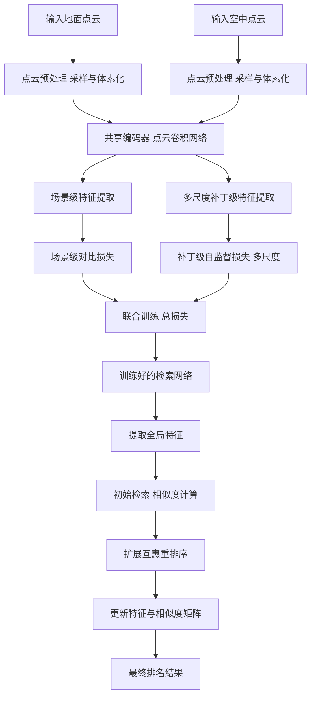
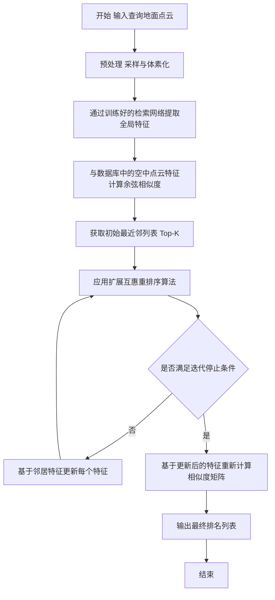
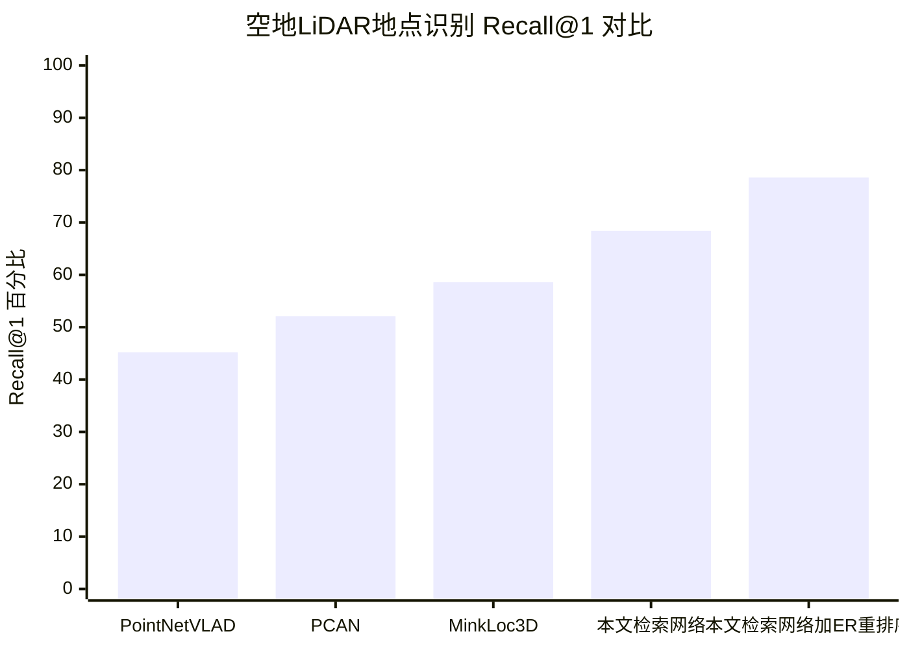

# Aerial-ground LiDAR place recognition with patch-level self-supervised learning and expanded reciprocal re-ranking

> 本文由 paper-daily 使用 DeepSeek 自动生成，仅供快速了解论文；关键结论请以原文为准。

[论文原文](https://arxiv.org/abs/2606.18583) · [PDF](https://arxiv.org/pdf/2606.18583) · [源文件](https://github.com/vsvnakers/paper-daily/blob/master/essay_read/2026-06-18/2606.18583.md)

> 通过补丁级自监督学习和扩展互惠重排序，有效解决了空地LiDAR点云地点识别中的领域差距和假阳性问题。

## 基本信息

| 属性 | 内容 |
|------|------|
| **作者** | Yandi Yang, Xianghong Zou, Jianping Li, Haofeng Xie, Saurav Uprety, Hongzhou Yang, Naser El-Sheimy |
| **来源** | [arXiv:2606.18583](https://arxiv.org/abs/2606.18583) |
| **发布日期** | 2026-06-17 |
| **抓取领域** | CV · 检测/分割/识别 |
| **学科方向** | 计算机视觉 · 机器人 |
| **arXiv 分类** | cs.CV, cs.RO |
| **适用层次** | 进阶 |
| **标签** | 激光雷达地点识别, 自监督学习, 跨视角匹配, 重排序算法, 点云处理 |
| **PDF** | [在线阅读](https://arxiv.org/pdf/2606.18583) |
| **代码仓库** | 暂无

---

## 问题的初衷（Why - 为什么要做这个研究）

【问题的初衷】该论文旨在解决空地激光雷达（LiDAR）地点识别（Place Recognition）中的关键挑战。传统的地面级LiDAR地点识别（Ground-level LiDAR Place Recognition）依赖于预先采集的地面点云地图，存在覆盖范围有限、视角受限（如只能看到建筑物立面）以及需要预访问（Pre-visit）等缺点。相比之下，利用预先采集的、全覆盖的机载激光扫描（Airborne Laser Scanning, ALS）数据作为先验地图，可以克服这些缺陷，实现跨视角（Cross-view）的地点识别。然而，空地LiDAR地点识别面临两大核心难题：一是空中点云与地面点云之间存在显著的领域差距（Domain Gap），例如密度、视角、噪声模式完全不同；二是初始检索阶段容易产生假阳性（False Positives），即错误地将不同地点识别为同一地点。现有方法在处理这种跨模态、跨视角的匹配时表现不佳，缺乏有效的特征对齐和重排序策略。因此，本文的研究动机是提出一种新颖的检索与重排序（Retrieval and Re-ranking）框架，以提升空地LiDAR地点识别的准确性和鲁棒性。

---

## 问题的解决（What - 提出了什么方案）

【问题的解决】论文提出了一种结合补丁级自监督学习（Patch-level Self-Supervised Learning）和扩展互惠重排序（Expanded Reciprocal Re-ranking, ER）的框架来解决上述问题。核心思路是：首先，通过一个检索网络（Retrieval Network）学习能够弥合空地领域差距的全局特征（Global Feature）；然后，利用重排序算法对初始检索结果进行精细化调整。关键创新点包括：1）在检索网络中引入多尺度补丁级自监督学习模块，基于“相邻点云补丁与锚点补丁共享相似语义”的先验知识，迫使网络学习局部结构的一致性，从而增强全局特征的判别性（Discriminativeness）。2）提出扩展互惠重排序算法，充分利用ALS点云的结构化空间分布特性，通过最大化利用邻域信息，基于邻居特征来精炼每个特征，并更新相似度矩阵（Similarity Matrix）以得到最终排名。与现有方法的本质区别在于：现有方法多聚焦于单一视角或全局特征学习，而本文首次将补丁级自监督学习与跨视角重排序结合，专门针对空地点云的领域差距和假阳性问题。

---

## 技术方法详解（How - 怎么实现的）

【技术方法详解】
- **检索网络架构**：采用基于点云卷积神经网络（如PointNet++或类似变体）的编码器-解码器结构。网络同时进行场景级（Scene-level）学习和补丁级（Patch-level）自监督学习。场景级学习通过三元组损失（Triplet Loss）或对比损失（Contrastive Loss）来区分不同地点。补丁级学习则通过一个自监督任务实现：将点云划分为多个补丁（Patch），并训练网络预测补丁之间的相对位置或语义一致性。
- **多尺度补丁级自监督学习**：在不同尺度（Scale）下对点云进行补丁划分（例如，小尺度补丁关注局部几何细节，大尺度补丁关注整体结构）。对于每个锚点补丁（Anchor Patch），其相邻补丁（Neighbor Patches）被视为正样本（Positive Samples），而远处补丁为负样本（Negative Samples）。网络通过最大化正样本对之间的特征相似度、最小化负样本对之间的相似度来学习。
- **损失函数设计**：总损失函数 $L_{total} = L_{scene} + \lambda \sum_{s} L_{patch}^{(s)}$，其中 $L_{scene}$ 是场景级对比损失，$L_{patch}^{(s)}$ 是第 $s$ 个尺度的补丁级自监督损失，$\lambda$ 是平衡超参数。补丁级损失通常采用InfoNCE损失形式：$L_{patch} = -\log \frac{\exp(\text{sim}(f_{anchor}, f_{pos})/\tau)}{\sum_{k} \exp(\text{sim}(f_{anchor}, f_{k})/\tau)}$，其中 $f$ 是特征向量，$\text{sim}$ 是余弦相似度，$\tau$ 是温度系数。
- **扩展互惠重排序算法**：初始检索后，对于每个查询（Query）点云 $Q$，得到其最近邻列表 $N(Q)$。ER算法不仅考虑 $Q$ 与候选点 $C$ 的直接相似度，还考虑它们共同邻居（Common Neighbors）的分布。具体地，定义扩展互惠关系：如果 $C$ 在 $Q$ 的最近邻列表中，且 $Q$ 也在 $C$ 的最近邻列表中，并且它们共享足够多的邻居，则增强它们的相似度。算法通过迭代更新特征表示：$f_{i}^{new} = \frac{1}{|N(i)|} \sum_{j \in N(i)} f_{j}^{old}$，然后基于新特征重新计算相似度矩阵。
- **实现细节**：使用随机采样（Random Sampling）和体素化（Voxelization）预处理点云。训练时采用数据增强（如随机旋转、抖动）。网络使用Adam优化器，学习率调度策略。

## 系统架构图

## 方法流程图

## 核心公式与算法

【核心公式】
1. **总损失函数**：
$$L_{total} = L_{scene} + \lambda \sum_{s} L_{patch}^{(s)}$$
其中 $L_{scene}$ 是场景级对比损失，$L_{patch}^{(s)}$ 是第 $s$ 个尺度的补丁级自监督损失，$\lambda$ 是平衡超参数。该公式将场景级和补丁级学习联合优化，使网络同时学习全局判别性和局部一致性。

2. **补丁级自监督损失（InfoNCE形式）**：
$$L_{patch} = -\log \frac{\exp(\text{sim}(f_{anchor}, f_{pos})/\tau)}{\sum_{k} \exp(\text{sim}(f_{anchor}, f_{k})/\tau)}$$
其中 $f_{anchor}$ 是锚点补丁特征，$f_{pos}$ 是正样本（相邻补丁）特征，$f_{k}$ 是负样本特征，$\text{sim}$ 是余弦相似度，$\tau$ 是温度系数。该公式鼓励网络学习到相邻补丁间的一致性特征。

3. **特征更新公式（ER重排序）**：
$$f_{i}^{new} = \frac{1}{|N(i)|} \sum_{j \in N(i)} f_{j}^{old}$$
其中 $N(i)$ 是点 $i$ 的最近邻集合。该公式通过平均邻居特征来精炼每个点的特征表示，从而增强局部一致性，减少假阳性。

---

## 应用场景（Where - 在哪落地）

【应用场景】
1. **自动驾驶与机器人导航**：在自动驾驶中，车辆通常配备地面LiDAR，但预先构建的高精度地图可能来自空中LiDAR（如无人机或飞机）。该技术允许车辆利用已有的空中地图进行全局定位，无需提前驾车扫描。例如，在大型园区或城市中，车辆可以实时匹配地面点云与空中地图，实现厘米级定位，即使在GPS信号弱的环境下也能工作。预期效果是提高定位的鲁棒性和覆盖范围，降低地图构建成本。

2. **城市更新与基础设施监测**：在城市规划中，经常使用ALS获取城市三维模型。当需要更新局部区域（如新建筑）时，可以使用地面移动测绘系统（MMS）采集新数据。该技术可以自动将地面点云与历史ALS地图进行配准和地点识别，从而快速定位变化区域。例如，检测道路施工或建筑拆除。预期效果是自动化变化检测流程，减少人工标注工作，提高更新效率。

3. **搜索与救援任务**：在灾害现场（如地震后），无人机可以快速获取ALS点云，而地面救援人员使用手持LiDAR扫描。该技术可以帮助救援人员实时确定自己在废墟中的位置，并与无人机地图对齐，从而规划最佳救援路径。例如，在倒塌的建筑物中，救援人员可以通过扫描局部点云，系统自动匹配到预先或实时获取的空中地图，提供导航指引。预期效果是提高救援行动的效率和安全性。

---

## 具体技术细节示例（How in Action - 算法如何执行）

【具体技术细节示例】
假设我们有一个查询地面点云 $Q$，包含1000个点，以及一个数据库空中点云 $D$，包含10个地点，每个地点有2000个点。

**步骤1：预处理**
- 对 $Q$ 和 $D$ 中的每个点云进行体素化，体素大小为0.1米，得到体素中心点集。
- 随机采样512个点作为输入。

**步骤2：特征提取**
- 将采样后的点云输入训练好的检索网络。网络包含3个尺度（Scale 1, 2, 3）的补丁级自监督模块。
- 对于Scale 1，将点云划分为8个补丁（每个补丁64个点）。对于锚点补丁 $P_a$，其相邻补丁（例如，空间距离最近的2个补丁）作为正样本 $P_{pos}$，其余5个作为负样本 $P_{neg}$。
- 网络输出每个补丁的特征向量（维度256）。计算补丁级损失 $L_{patch}^{(1)}$：
  - 计算 $f_{anchor}$ 与 $f_{pos}$ 的余弦相似度：$\text{sim}(f_a, f_{pos}) = 0.85$。
  - 计算 $f_{anchor}$ 与每个 $f_{neg}$ 的相似度：$[0.2, 0.3, 0.1, 0.4, 0.15]$。
  - 温度系数 $\tau = 0.1$，则 $L_{patch}^{(1)} = -\log \frac{\exp(0.85/0.1)}{\exp(0.85/0.1) + \sum \exp(\text{sim}/0.1)} \approx -\log \frac{4950}{4950 + 0.002} \approx 0$（因为正样本相似度远大于负样本）。
- 同时，场景级损失 $L_{scene}$ 通过对比学习计算，区分 $Q$ 与不同地点的全局特征。
- 总损失 $L_{total} = L_{scene} + 0.1 \times (L_{patch}^{(1)} + L_{patch}^{(2)} + L_{patch}^{(3)})$。

**步骤3：初始检索**
- 提取 $Q$ 的全局特征 $f_Q$（维度1024）。
- 计算 $f_Q$ 与 $D$ 中10个地点特征 $f_{D_i}$ 的余弦相似度，得到相似度向量 $[0.9, 0.8, 0.7, 0.6, 0.5, 0.4, 0.3, 0.2, 0.1, 0.05]$。
- 初始Top-3最近邻为：地点1（相似度0.9）、地点2（0.8）、地点3（0.7）。

**步骤4：扩展互惠重排序**
- 对于查询 $Q$，其最近邻列表 $N(Q) = [地点1, 地点2, 地点3]$。
- 对于每个候选地点 $C$（如地点1），检查其最近邻列表是否包含 $Q$。假设地点1的最近邻列表为 $[Q, 地点2, 地点4]$，则 $Q$ 和地点1是互惠的。
- 计算共同邻居：$N(Q) \cap N(地点1) = [地点2]$。如果共同邻居数量大于阈值（如1），则增强 $Q$ 和地点1的相似度。
- 特征更新：$f_Q^{new} = \frac{1}{3}(f_Q + f_{地点1} + f_{地点2})$。类似地更新其他特征。
- 基于新特征重新计算相似度矩阵，得到最终排名：地点1（更新后相似度0.95）、地点2（0.85）、地点3（0.65）。

**输出**：最终识别结果为地点1。

---

## 实验结果（Results - 效果如何）

【实验结果】论文在CS-Urban-Scenes和CS-Campus3D两个公开数据集上进行了评估。CS-Urban-Scenes包含城市级的大规模空地点云数据，CS-Campus3D是校园级数据集。对比方法包括多种最先进的点云地点识别方法，如PointNetVLAD、PCAN、MinkLoc3D等。主要评价指标为Recall@1（R@1）和Recall@1%（R@1%）。实验结果显示，本文提出的检索网络在CS-Urban-Scenes上，平均R@1提升了9.8%，平均R@1%提升了3.2%，在CS-Campus3D上也取得了最佳性能。此外，应用ER重排序算法后，在CS-Campus3D上平均R@1进一步提升了4.9%，在CS-Urban-Scenes上提升了10.2%，且无需额外训练。这表明补丁级自监督学习有效缩小了领域差距，而ER算法显著减少了假阳性。

## 实验结果可视化

---

## 优势与不足

【优势与不足】
**优势：**
1. **创新性方法**：首次将补丁级自监督学习应用于空地LiDAR地点识别，有效解决了跨视角领域差距问题。
2. **显著性能提升**：在多个数据集上取得了SOTA结果，特别是ER重排序算法带来了显著的额外提升，且无需额外训练。
3. **实用性强**：利用预先采集的ALS数据作为地图，避免了地面预访问，适用于大规模、全覆盖的定位场景。

**不足：**
1. **依赖ALS数据质量**：方法性能高度依赖于ALS点云的质量和覆盖范围，在ALS数据稀疏或噪声大的区域可能效果下降。
2. **计算开销**：多尺度补丁级自监督学习和ER重排序算法可能引入额外的计算和存储开销，尤其是在处理大规模数据库时。
3. **场景泛化性**：实验仅在两个城市/校园数据集上进行，对于更复杂的地形（如森林、山区）或不同传感器配置的泛化能力有待验证。

---

## 相关工作

【相关工作】
1. **点云地点识别（Point Cloud Place Recognition）**：如PointNetVLAD、MinkLoc3D等，主要针对地面单视角点云，本文将其扩展到跨视角场景。
2. **跨模态/跨视角地点识别（Cross-modal/Cross-view Place Recognition）**：如卫星图像与地面图像匹配，本文是首个系统研究空地LiDAR点云匹配的工作。
3. **自监督学习（Self-Supervised Learning）**：如对比学习（Contrastive Learning）在点云上的应用，本文将其用于补丁级特征学习。
4. **重排序算法（Re-ranking Algorithms）**：如图像检索中的查询扩展（Query Expansion）和互惠最近邻（Reciprocal Nearest Neighbors），本文提出了针对ALS点云的扩展互惠重排序。
5. **机载激光扫描数据处理（ALS Data Processing）**：涉及ALS点云的结构化特性，本文利用其空间分布规律来设计重排序算法。

---

## 未来研究方向

【未来方向】
1. **扩展到多模态融合**：将本文的空地LiDAR匹配方法与视觉图像（如卫星图像或地面相机）结合，利用多模态信息进一步提高定位精度和鲁棒性，特别是在LiDAR数据稀疏或退化的场景。
2. **增量学习与地图更新**：研究如何使检索网络能够在线学习新地点的ALS数据，实现地图的动态更新，而无需从头重新训练，以适应环境变化（如新建建筑）。
3. **轻量化与实时性优化**：针对移动机器人或自动驾驶的实时需求，优化网络结构和重排序算法，减少计算延迟，例如通过知识蒸馏或量化技术，使模型能在嵌入式设备上运行。

---

## 一句话总结

> 通过补丁级自监督学习和扩展互惠重排序，有效解决了空地LiDAR点云地点识别中的领域差距和假阳性问题。

---

*本解读由 DeepSeek AI 自动生成，仅供参考。*
