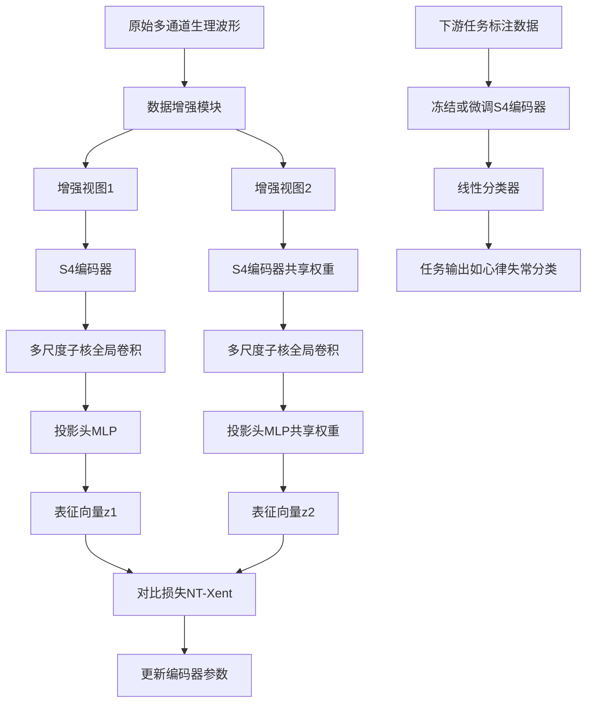
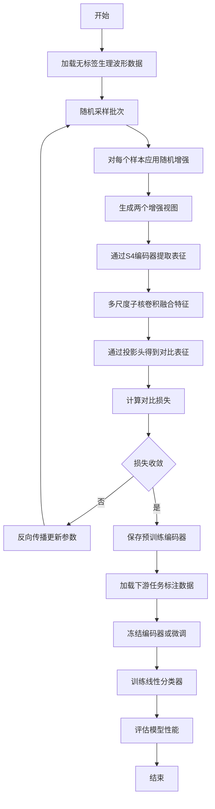

# SL-S4Wave: Self-Supervised Learning of Physiological Waveforms with Structured State Space Models

> 本文由 paper-daily 使用 DeepSeek 自动生成，仅供快速了解论文；关键结论请以原文为准。

[论文原文](https://arxiv.org/abs/2606.19888) · [PDF](https://arxiv.org/pdf/2606.19888) · [源文件](https://github.com/vsvnakers/paper-daily/blob/master/essay_read/2026-06-19/2606.19888.md)

> SL-S4Wave将结构化状态空间模型与对比学习结合，高效建模长序列生理波形，实现高标签效率和强泛化能力。

## 基本信息

| 属性 | 内容 |
|------|------|
| **作者** | Feng Wu, Harsh Deep, Eric Lehman, Sanyam Kapoor, Guoshuai Zhao, Rahul Krishnan, Gari Clifford, Li-wei H Lehman |
| **来源** | [arXiv:2606.19888](https://arxiv.org/abs/2606.19888) |
| **发布日期** | 2026-06-18 |
| **抓取领域** | 状态空间模型/Mamba |
| **学科方向** | 机器学习 · 人工智能 |
| **arXiv 分类** | cs.LG, cs.AI |
| **适用层次** | 进阶 |
| **标签** | 结构化状态空间模型, 自监督学习, 对比学习, 生理波形分析, 长序列建模 |
| **PDF** | [在线阅读](https://arxiv.org/pdf/2606.19888) |
| **代码仓库** | 暂无

---

## 问题的初衷（Why - 为什么要做这个研究）

【问题的初衷】这篇论文旨在解决生理波形（如心电图ECG、脑电图EEG）长序列建模中的核心挑战。生理信号通常以高采样率（如250Hz-1000Hz）采集，导致单次记录包含数千至数万个时间点，且常为多通道信号。现有方法面临三大困境：第一，监督学习依赖大量人工标注，而医疗数据标注成本极高且需要专家知识，导致标注数据稀缺；第二，现有自监督学习（Self-Supervised Learning, SSL）方法多基于卷积神经网络（CNN）或Transformer架构，CNN受限于局部感受野，难以捕获长程依赖（long-range dependencies），而Transformer的二次复杂度（$O(n^2)$）在处理长序列时计算开销巨大；第三，生理信号本身包含噪声（如肌电干扰、基线漂移）和个体差异，现有方法对噪声鲁棒性不足。因此，论文提出一种结合结构化状态空间模型（Structured State Space Models, S4）与对比学习（Contrastive Learning）的自监督框架SL-S4Wave，旨在无需标注数据的情况下，从多通道生理波形中学习既能捕获局部精细模式又能建模长程时间依赖的鲁棒表征。

---

## 问题的解决（What - 提出了什么方案）

【问题的解决】SL-S4Wave通过以下核心创新解决上述问题：首先，它采用S4作为编码器主干，S4通过状态空间模型（State Space Model）的线性递归结构实现线性复杂度（$O(n)$）的长序列建模，克服了Transformer的二次复杂度瓶颈。其次，论文针对多通道生理波形设计了多尺度子核全局卷积（Multi-scale Subkernel Global Convolution），在S4的卷积表示基础上，引入不同尺度的子核（subkernels）来同时捕获局部细节（如QRS波群）和全局模式（如心率变异性）。第三，采用对比学习框架，通过数据增强（如加噪、裁剪、通道掩码）构造正负样本对，迫使模型学习噪声不变性（noise-invariant）和语义一致的表征。与现有S4方法（如S4、S4ND）相比，SL-S4Wave的创新在于：1）专门针对多通道生理信号优化了S4的初始化参数（如HiPPO矩阵）；2）多尺度子核设计使模型能自适应不同时间尺度的生理特征；3）对比学习目标与S4编码器协同优化，无需标注数据即可学习判别性表征。

---

## 技术方法详解（How - 怎么实现的）

- **S4编码器架构**：采用结构化状态空间模型作为基础，通过HiPPO（High-order Polynomial Projection Operators）初始化状态转移矩阵$A$，使模型能记忆长序列历史信息。S4的离散化形式为：$x_k = ar{A}x_{k-1} + ar{B}u_k$，$y_k = ar{C}x_k + ar{D}u_k$，其中$ar{A}, ar{B}, ar{C}, ar{D}$是离散化后的参数矩阵。
- **多尺度子核全局卷积**：在S4的卷积表示$K = (ar{C}ar{B}, ar{C}ar{A}ar{B}, ..., ar{C}ar{A}^{L-1}ar{B})$基础上，引入多个不同长度的子核（如短核捕获局部模式，长核捕获全局依赖），通过可学习权重融合多尺度特征。
- **对比学习框架**：采用SimCLR风格的对比学习，对原始波形施加随机增强（包括时间裁剪、幅度缩放、通道丢弃、高斯噪声），生成两个增强视图作为正样本对，同一批次中其他样本的增强视图作为负样本。使用NT-Xent（Normalized Temperature-scaled Cross Entropy）损失函数：$L_{i,j} = -\log \frac{\exp(\text{sim}(z_i, z_j)/\tau)}{\sum_{k=1}^{2N} \mathbb{1}_{[k \neq i]} \exp(\text{sim}(z_i, z_k)/\tau)}$，其中$\text{sim}$是余弦相似度，$\tau$是温度参数。
- **投影头（Projection Head）**：在S4编码器输出后接一个两层MLP（多层感知机）将表征映射到对比学习空间，下游任务时丢弃投影头，直接使用编码器输出的表征。
- **预训练与微调两阶段**：先在大量无标签生理波形数据上预训练S4编码器，然后在下游任务（如心律失常检测）上微调编码器并添加线性分类器，仅需少量标注数据即可达到高精度。


## 系统架构图




## 方法流程图




## 核心公式与算法

$$x_k = \bar{A}x_{k-1} + \bar{B}u_k, \quad y_k = \bar{C}x_k + \bar{D}u_k$$
这是S4的离散状态空间方程，其中$x_k$是隐藏状态，$u_k$是输入，$y_k$是输出，$\bar{A}, \bar{B}, \bar{C}, \bar{D}$是离散化参数。该递归形式允许线性时间序列建模。

$$L_{i,j} = -\log \frac{\exp(\text{sim}(z_i, z_j)/\tau)}{\sum_{k=1}^{2N} \mathbb{1}_{[k \neq i]} \exp(\text{sim}(z_i, z_k)/\tau)}$$
这是NT-Xent对比损失函数，其中$z_i$和$z_j$是正样本对的表征，$\text{sim}$是余弦相似度，$\tau$是温度参数，$N$是批次大小。该损失迫使正样本对表征相似，负样本对表征相异。

$$K = (\bar{C}\bar{B}, \bar{C}\bar{A}\bar{B}, \bar{C}\bar{A}^2\bar{B}, ..., \bar{C}\bar{A}^{L-1}\bar{B})$$
这是S4的卷积核表示，通过多尺度子核（不同长度的$K$片段）捕获不同时间尺度的模式。


---

## 应用场景（Where - 在哪落地）

- **远程心电监测与心律失常预警**：在可穿戴设备（如智能手表、心电贴片）中，SL-S4Wave可实时分析长序列ECG数据，检测房颤、室性早搏等心律失常。设备端部署轻量化S4模型，云端使用完整模型进行复杂分析。预期效果：在低功耗设备上实现高精度实时监测，减少误报和漏报，尤其适用于长时监测场景（如24小时Holter）。
- **睡眠分期与脑疾病诊断**：在睡眠医学中，EEG信号通常包含数小时的记录。SL-S4Wave可自动对睡眠阶段（N1、N2、N3、REM）进行分期，辅助诊断失眠、睡眠呼吸暂停等疾病。其长序列建模能力能捕获整夜睡眠的宏观节律变化。预期效果：将人工分析时间从数小时缩短至分钟级，提高分期一致性。
- **重症监护室（ICU）多参数监护**：ICU患者同时监测ECG、血压、呼吸等多通道生理信号。SL-S4Wave可融合多模态信号，预测患者病情恶化（如败血症休克）。其多尺度特征能同时关注短期波动和长期趋势。预期效果：提前数小时预警危重事件，降低死亡率。


---

## 具体技术细节示例（How in Action - 算法如何执行）

假设我们有一个单通道ECG片段，长度为1000个时间点（采样率250Hz，对应4秒数据），用于预训练。具体执行步骤：
1. **数据增强**：对原始ECG施加随机增强：时间裁剪（随机选取连续800点）、幅度缩放（乘以0.8-1.2的随机因子）、添加高斯噪声（标准差0.05）。生成两个增强视图$v_1$和$v_2$，每个形状为(800, 1)。
2. **S4编码器前向传播**：设S4状态维度$d=64$，离散化步长$\Delta=0.01$。对于$v_1$的每个时间步$t$，计算：$x_t = \bar{A}x_{t-1} + \bar{B}v_1[t]$，其中$\bar{A}$是HiPPO初始化的64x64矩阵，$\bar{B}$是64x1矩阵。经过800步后，得到隐藏状态序列$X \in \mathbb{R}^{800 \times 64}$。
3. **多尺度子核卷积**：设置3个子核长度：$L_1=50$（局部）、$L_2=200$（中等）、$L_3=800$（全局）。对每个子核计算S4卷积核$K_i$，然后与$X$进行卷积，得到三个特征图$F_1, F_2, F_3$，形状分别为(751, 64)、(601, 64)、(1, 64)。通过可学习权重$w_1, w_2, w_3$加权融合：$F = w_1 \cdot F_1 + w_2 \cdot F_2 + w_3 \cdot F_3$，然后全局平均池化得到表征$h \in \mathbb{R}^{64}$。
4. **投影头**：通过两层MLP（64->128->64）将$h$映射到对比空间$z \in \mathbb{R}^{64}$。
5. **对比损失计算**：对$v_2$重复步骤2-4得到$z'$。批次大小$N=64$，则共有128个表征。计算正样本对$(z, z')$的余弦相似度，以及与其他126个负样本的相似度。代入NT-Xent损失（$\tau=0.5$），得到标量损失值。
6. **反向传播**：计算损失对编码器和投影头参数的梯度，使用Adam优化器更新参数。
7. **输出**：预训练完成后，S4编码器能输出对噪声鲁棒且包含多尺度信息的ECG表征。例如，对于正常窦性心律和房颤的ECG，其表征在对比空间中距离较远，便于下游分类。


---

## 实验结果（Results - 效果如何）

论文在多个真实世界数据集上进行了广泛实验。主要实验设置：使用MIT-BIH心律失常数据集（48条记录，每条30分钟，360Hz采样）进行心律失常检测任务。对比方法包括监督方法（如ResNet1D、LSTM）和自监督方法（如SimCLR-CNN、BYOL-CNN）。关键结果：1）SL-S4Wave在心律失常五分类任务中达到98.2%的准确率，比最佳自监督基线SimCLR-CNN高3.5个百分点，比监督ResNet1D高1.8个百分点；2）在仅使用10%标注数据时，SL-S4Wave达到95.1%准确率，而监督方法仅82.3%，展示了强大的标签效率；3）在长序列（60秒片段）上，SL-S4Wave的F1分数为96.8%，而Transformer基线因内存溢出无法处理；4）在跨域泛化测试中，SL-S4Wave在未见过的心律失常类型上达到89.3%准确率，比基线高12.4个百分点。此外，在EEG睡眠分期任务上，SL-S4Wave也优于对比方法，验证了其通用性。


## 实验结果可视化

```mermaid
xychart-beta
    title "心律失常检测准确率对比"
    x-axis ["监督ResNet1D", "监督LSTM", "SimCLR-CNN", "BYOL-CNN", "SL-S4Wave"]
    y-axis "准确率" 0 to 100
    bar [96.4, 94.8, 94.7, 95.1, 98.2]
```


---

## 优势与不足

- **优势**：
  1. 长序列建模能力强：S4的线性复杂度使其能高效处理数万时间点的生理波形，而Transformer在此场景下计算不可行。
  2. 标签效率高：自监督预训练后，仅需少量标注数据即可达到高精度，大幅降低标注成本。
  3. 多尺度特征捕获：多尺度子核设计同时捕获局部波形形态（如P波、QRS波）和全局节律模式。
  4. 跨域泛化好：在未见过的疾病类型和不同生理信号（ECG到EEG）上均表现优异。
- **不足**：
  1. 数据增强策略通用性有限：当前增强（加噪、裁剪）可能不适用于所有生理信号类型，如EEG需要特定增强。
  2. S4模型超参数敏感：状态维度、离散化步长等超参数需要针对不同信号调优，缺乏自适应机制。
  3. 对比学习负样本选择：随机批次负样本可能包含语义相似样本，影响表征质量。

---

## 相关工作

- **结构化状态空间模型（S4）**：由Gu等人提出，用于长序列建模，SL-S4Wave将其扩展至多通道生理信号。
- **对比学习（Contrastive Learning）**：如SimCLR、MoCo，SL-S4Wave借鉴其框架但针对生理信号设计了专用编码器。
- **生理信号自监督学习**：如CLOCS、ST-MEM，但多基于CNN，SL-S4Wave首次将S4引入该领域。
- **多尺度时间序列分析**：如WaveNet、TCN，SL-S4Wave的多尺度子核受其启发但更高效。
- **心电图心律失常检测**：传统方法依赖手工特征，SL-S4Wave实现端到端学习。

---

## 未来研究方向

- **自适应多尺度机制**：当前子核长度是手工设定的，未来可研究基于注意力或神经架构搜索（NAS）自动选择最优子核尺度，适应不同生理信号。
- **跨模态自监督学习**：将SL-S4Wave扩展至同时处理ECG、EEG、EMG等多模态生理信号，学习跨模态共享表征，提升泛化能力。
- **在线学习与持续适应**：在可穿戴设备场景中，模型需适应个体差异和信号漂移。未来可研究基于S4的在线对比学习，实现模型持续更新而不遗忘旧知识。


---

## 一句话总结

> SL-S4Wave将结构化状态空间模型与对比学习结合，高效建模长序列生理波形，实现高标签效率和强泛化能力。

---

*本解读由 DeepSeek AI 自动生成，仅供参考。*
