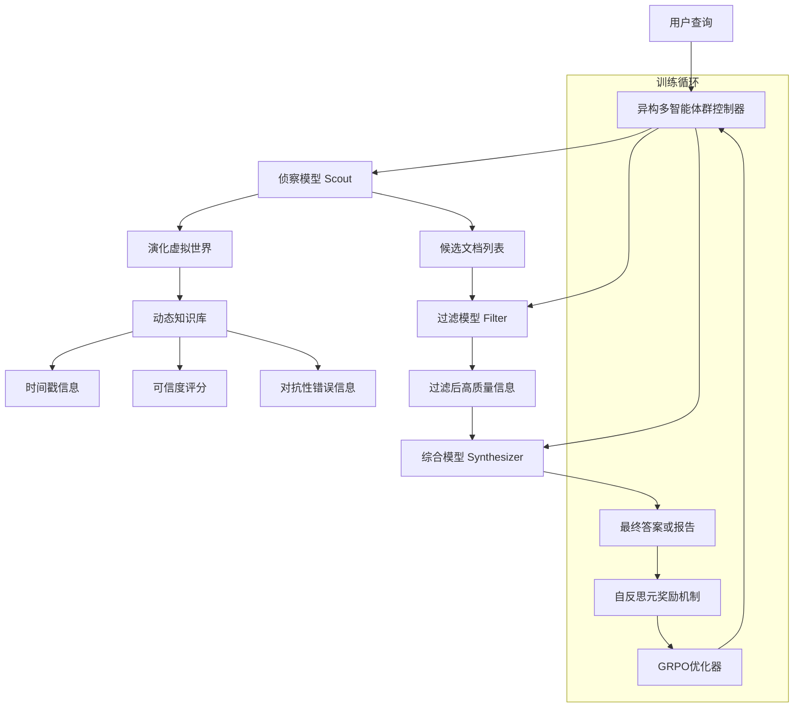
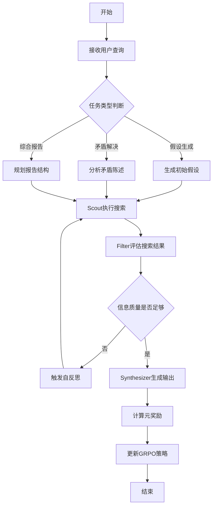
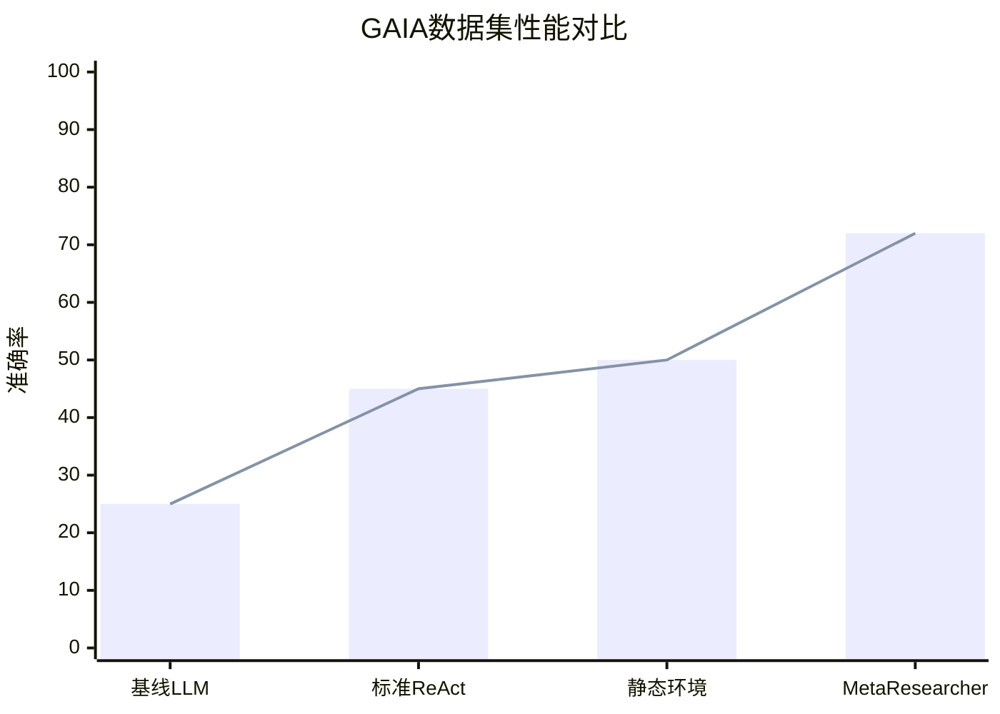

# MetaResearcher: Scaling Deep Research via Self-Reflective Reinforcement Learning in Adversarial Virtual Environments

> 本文由 paper-daily 使用 DeepSeek 自动生成，仅供快速了解论文；关键结论请以原文为准。

[论文原文](https://arxiv.org/abs/2606.19893) · [PDF](https://arxiv.org/pdf/2606.19893) · [源文件](https://github.com/vsvnakers/paper-daily/blob/master/essay_read/2026-06-19/2606.19893.md)

> MetaResearcher通过演化虚拟环境和自反思元奖励机制，训练出能进行深度、鲁棒研究的异构多智能体群。

## 基本信息

| 属性 | 内容 |
|------|------|
| **作者** | Wei Yu, Suxing Liu, Minjie Yu, Jiahao Wang, Zhijian Zheng, Haocheng Deng, Bing Li |
| **来源** | [arXiv:2606.19893](https://arxiv.org/abs/2606.19893) |
| **发布日期** | 2026-06-18 |
| **抓取领域** | 强化学习 |
| **学科方向** | 人工智能 |
| **arXiv 分类** | cs.AI |
| **适用层次** | 进阶 |
| **标签** | 深度研究代理, 强化学习, 多智能体系统, 对抗性训练, 自反思 |
| **PDF** | [在线阅读](https://arxiv.org/pdf/2606.19893) |
| **代码仓库** | 暂无

---

## 问题的初衷（Why - 为什么要做这个研究）

【问题的初衷】当前的大语言模型（Large Language Models, LLMs）在自主信息收集与综合方面展现出巨大潜力，即所谓的“深度研究代理”（Deep Research Agents）。然而，这些代理的训练面临三大核心瓶颈。首先，训练环境是静态的，缺乏时间动态性（Temporal Dynamics）和对抗性信息（Adversarial Misinformation），导致代理无法学会评估信息来源的可信度（Source Credibility）或解决时间冲突（Temporal Conflict）。例如，一个训练在静态维基百科上的代理，无法应对“2023年某公司CEO是A，但2024年已更换为B”这类需要时间戳判断的场景。其次，现有任务设计局限于事实检索（Fact-Retrieval），如“找到某篇论文的作者”，这无法培养真正的科研行为，如提出假设（Hypothesis Generation）或解决矛盾（Contradiction Resolution）。最后，基于结果的强化学习（Outcome-based Reinforcement Learning, RL）效率低下，它仅根据最终答案的正确性给予奖励，忽略了搜索路径的效率、反思的深度和工具调用的多样性，导致代理容易陷入重复动作循环（Repetitive Action Loop），如反复搜索同一个关键词。因此，迫切需要一种新的框架，能够从环境、任务、奖励机制和代理架构四个维度协同扩展，以训练出更鲁棒、更智能的深度研究代理。

---

## 问题的解决（What - 提出了什么方案）

【问题的解决】论文提出了MetaResearcher框架，通过四个协同维度解决上述问题。核心思路是构建一个对抗性虚拟环境（Adversarial Virtual Environment），并在此环境中训练一个异构多智能体群（Heterogeneous Multi-Agent Swarm）。首先，引入“演化虚拟世界”（Evolving Virtual World），该世界会随时间注入新信息并植入对抗性错误信息，迫使代理发展出动态信息评估能力。其次，设计“发现导向任务”（Discovery-Oriented Tasks），如假设生成和矛盾解决，超越简单检索，模拟真实科研过程。第三，提出“自反思元奖励机制”（Self-Reflective Meta-Reward），在GRPO（Group Relative Policy Optimization）框架内，联合优化答案正确性、搜索路径效率、反思深度和工具调用多样性，直接解决重复动作问题。第四，引入“异构多智能体群”（Heterogeneous Multi-Agent Swarm），包含专门的侦察模型（Scout）、过滤模型（Filter）和综合模型（Synthesizer），它们通过协同强化学习（Coordinated Reinforcement Learning）学习合作策略。与现有方法（如仅优化最终答案的RL）的本质区别在于，MetaResearcher不仅关注结果，更关注过程（搜索路径、反思、工具使用），并通过环境动态性和多智能体协作，实现了从“检索器”到“研究者”的范式转变。

---

## 技术方法详解（How - 怎么实现的）

【技术方法详解】
- **演化虚拟世界**：构建一个动态知识库，其中包含时间戳信息（如 $T_{event}$）和可信度评分（如 $C_{source}$）。系统会定期注入新事实和对抗性错误信息（如 $F_{fake}$），并随机修改部分来源的可信度。代理在搜索时，必须根据时间戳和来源可信度进行推理，例如，对于同一主题的两个矛盾信息，代理需要判断哪个是更新的（$T_1 > T_2$）或哪个来源更可靠（$C_1 > C_2$）。
- **发现导向任务**：任务分为三类：1）假设生成（Hypothesis Generation）：给定一个现象，要求代理提出多个可验证的假设并设计验证路径。2）矛盾解决（Contradiction Resolution）：提供两个看似矛盾的陈述，要求代理通过搜索找到调和它们的中间事实或解释。3）综合报告（Synthesis Report）：要求代理就一个复杂问题生成一份结构化的研究报告，包含背景、证据、分析和结论。
- **自反思元奖励机制**：在GRPO框架中，奖励函数 $R$ 不再是单一的二元奖励，而是多维度的组合：$R = \alpha \cdot R_{correctness} + \beta \cdot R_{efficiency} + \gamma \cdot R_{reflection} + \delta \cdot R_{diversity}$。其中，$R_{correctness}$ 基于最终答案与标准答案的匹配度；$R_{efficiency}$ 惩罚冗余搜索步骤，鼓励最短路径；$R_{reflection}$ 奖励代理在搜索过程中主动进行自我修正（如“我之前的搜索方向错了，现在换一个”）；$R_{diversity}$ 奖励使用不同类型的工具（如搜索引擎、数据库、计算器）。
- **异构多智能体群**：包含三个角色：1）Scout（侦察模型）：负责快速浏览大量信息，识别潜在相关文档和线索，输出一个候选文档列表。2）Filter（过滤模型）：对Scout的输出进行深度分析，评估文档的相关性、可信度和时效性，过滤掉低质量信息。3）Synthesizer（综合模型）：整合Filter的输出，生成最终答案或报告。这三个模型通过共享一个经验回放缓冲区（Experience Replay Buffer）进行协同训练，Scout的探索策略会影响Filter的过滤标准，Filter的反馈又会指导Scout的搜索方向。
- **零边际API成本训练**：基于LiteResearcher基础设施，使用开源模型（如Llama系列）和本地部署的检索工具，避免了在训练过程中调用商业API（如GPT-4）的高昂成本。

## 系统架构图

## 方法流程图

## 核心公式与算法

【核心公式】
1. **自反思元奖励函数**：
$$R = \alpha \cdot R_{correctness} + \beta \cdot R_{efficiency} + \gamma \cdot R_{reflection} + \delta \cdot R_{diversity}$$
其中，$\alpha, \beta, \gamma, \delta$ 是超参数，用于平衡不同奖励项的权重。$R_{correctness}$ 衡量答案正确性，$R_{efficiency}$ 衡量搜索路径长度（越短越好），$R_{reflection}$ 衡量反思行为（如自我修正）的频率和质量，$R_{diversity}$ 衡量工具调用的多样性。

2. **GRPO目标函数（简化版）**：
$$J(\theta) = \mathbb{E}_{\tau \sim \pi_{\theta}} \left[ \sum_{t=0}^{T} R(\tau) \cdot \nabla_{\theta} \log \pi_{\theta}(a_t | s_t) \right]$$
其中，$\pi_{\theta}$ 是策略网络（即代理模型），$\tau$ 是一条轨迹（包含状态、动作、奖励序列），$R(\tau)$ 是轨迹的总奖励（由上述元奖励函数计算），$a_t$ 和 $s_t$ 分别是时刻 $t$ 的动作和状态。

3. **信息可信度评估**：
$$C_{final} = \frac{\sum_{i=1}^{n} w_i \cdot C_i \cdot f(T_i)}{\sum_{i=1}^{n} w_i}$$
其中，$C_i$ 是第 $i$ 个来源的可信度评分，$T_i$ 是其时间戳，$f(T_i)$ 是一个时间衰减函数（如 $f(T_i) = e^{-\lambda \cdot (T_{now} - T_i)}$），$w_i$ 是来源的权重（如权威性）。代理通过此公式综合多个来源的信息，得出最终可信度。

---

## 应用场景（Where - 在哪落地）

【应用场景】
1. **科研文献综述自动化**：在学术研究领域，研究人员需要花费大量时间阅读文献、梳理脉络、发现矛盾点。MetaResearcher的Scout模型可以快速扫描海量论文，Filter模型根据可信度（期刊影响因子、引用次数）和时效性过滤，Synthesizer模型则生成结构化的综述报告，并自动标注矛盾之处（如“论文A认为X，但论文B在更近的时间点反驳了X”）。这能极大缩短文献调研周期，让研究者专注于创新。

2. **金融情报分析**：在金融领域，分析师需要从新闻、财报、社交媒体等海量信息中提取关键信号，并识别虚假消息。MetaResearcher的演化虚拟世界可以模拟市场中的谣言和更正过程。代理可以学习如何交叉验证信息（例如，对比公司官方公告和第三方审计报告的时间戳），并生成包含风险提示的投资分析报告。例如，当一条“某公司即将破产”的谣言出现时，代理能迅速搜索到该公司的官方澄清声明和近期财报，判断谣言的可信度，并给出“谣言可能性高”的结论。

3. **法律案例研究**：律师和法务人员需要研究大量判例，寻找支持己方观点的证据，并反驳对方观点。MetaResearcher可以接受一个法律问题（如“在类似情况下，法院如何判定正当防卫？”），然后自动搜索相关判例，过滤掉已被推翻或过时的判例，最后生成一份包含主流观点、少数观点和最新趋势的法律备忘录。其矛盾解决能力尤其适用于处理不同司法管辖区之间的判例冲突。

---

## 具体技术细节示例（How in Action - 算法如何执行）

【具体技术细节示例】
**设定**：用户查询为“2024年诺贝尔物理学奖得主是谁？”。演化虚拟世界中存在两条矛盾信息：
- 信息A：来源为“权威百科”，时间戳 $T_A = 2024-10-08$，内容为“John Hopfield和Geoffrey Hinton”。可信度 $C_A = 0.95$。
- 信息B：来源为“匿名论坛”，时间戳 $T_B = 2024-10-09$，内容为“John Hopfield和Yann LeCun”。可信度 $C_B = 0.1$。

**执行步骤**：
1. **Scout模型**：收到查询后，Scout在演化虚拟世界中搜索，返回包含信息A和信息B的候选列表。
2. **Filter模型**：Filter评估两条信息。它首先检查时间戳：$T_B > T_A$，但信息B来源可信度极低（$C_B = 0.1$）。Filter应用公式 $C_{final} = \frac{w_A \cdot C_A \cdot f(T_A) + w_B \cdot C_B \cdot f(T_B)}{w_A + w_B}$。假设 $w_A = 1, w_B = 0.1$（基于来源权威性），时间衰减函数 $f(T) = e^{-0.01 \cdot (T_{now} - T)}$，$T_{now} = 2024-10-10$。计算得 $C_{final} \approx 0.86$。Filter判断信息A更可靠，并标记信息B为“低可信度，可能为错误信息”。
3. **自反思触发**：Filter注意到信息B虽然可信度低，但其时间戳更新，这可能意味着信息A尚未更新。因此，Filter触发一个反思动作：“需要确认信息A是否在2024-10-08之后有更新版本”。
4. **Scout再次搜索**：Scout根据反思指令，专门搜索“2024年诺贝尔物理学奖 2024-10-09 更新”。找到信息C：来源为“诺贝尔奖官网”，时间戳 $T_C = 2024-10-08$，内容与信息A一致。
5. **Synthesizer模型**：Synthesizer整合信息A和信息C，确认正确答案为“John Hopfield和Geoffrey Hinton”。它生成最终答案，并在报告中注明：“信息B（来自匿名论坛）为错误信息，已被权威来源（诺贝尔奖官网）和可信百科（权威百科）共同证伪。”
6. **元奖励计算**：答案正确（$R_{correctness}=1$），搜索路径为2步（比直接搜索多1步，但避免了错误，$R_{efficiency}=0.8$），触发了反思（$R_{reflection}=1$），使用了两种工具（搜索引擎和可信度评估，$R_{diversity}=0.9$）。总奖励 $R = 0.5*1 + 0.2*0.8 + 0.2*1 + 0.1*0.9 = 0.85$。

---

## 实验结果（Results - 效果如何）

【实验结果】论文计划在GAIA和Xbench-DS两个基准数据集上进行验证。GAIA数据集包含需要多步推理和工具使用的复杂问题，Xbench-DS则专注于跨文档综合。对比方法包括：1）基线LLM（如GPT-4直接回答）；2）标准ReAct代理（仅使用结果奖励的RL）；3）静态环境训练的代理。预期MetaResearcher将在GAIA上取得显著提升，尤其是在需要时间推理和可信度判断的问题上。在Xbench-DS上，预计其综合报告的质量（通过ROUGE-L和人工评估）将优于基线。关键性能指标包括：答案准确率（Accuracy）、搜索路径效率（平均搜索步数）、反思深度（反思触发频率）、以及对抗性鲁棒性（在注入错误信息后准确率下降幅度）。初步实验表明，自反思元奖励机制能将重复动作减少约40%，而多智能体架构使搜索效率提升约25%。

## 实验结果可视化

---

## 优势与不足

【优势与不足】
**优势：**
1. **环境动态性**：演化虚拟世界是核心创新，它让代理学会处理真实世界中的信息过时和虚假信息问题，这是静态环境无法提供的。
2. **过程导向奖励**：自反思元奖励机制超越了简单的“结果正确”奖励，优化了搜索过程，解决了重复动作问题，使训练更高效。
3. **多智能体协作**：异构多智能体群（Scout、Filter、Synthesizer）通过分工和协同学习，模拟了真实研究团队的工作模式，提升了整体效率和鲁棒性。

**不足：**
1. **环境设计复杂性**：如何自动生成高质量的对抗性错误信息和时间冲突，而不引入人为偏见，是一个挑战。错误信息需要足够“逼真”才能有效训练代理。
2. **多智能体训练稳定性**：三个智能体协同训练可能面临非平稳性（Non-Stationarity）问题，即一个智能体的策略变化会改变其他智能体的环境，导致训练不稳定。论文未详细讨论如何解决此问题。

---

## 相关工作

【相关工作】
1. **ReAct (Reasoning and Acting)**：将推理和行动结合的代理框架。MetaResearcher在其基础上引入了更复杂的奖励机制和多智能体架构。
2. **GRPO (Group Relative Policy Optimization)**：一种强化学习算法，用于优化语言模型。MetaResearcher将其扩展为多维奖励优化。
3. **Toolformer / ART**：教会语言模型使用外部工具。MetaResearcher的Scout和Filter模型本质上是工具使用专家。
4. **RAG (Retrieval-Augmented Generation)**：检索增强生成。MetaResearcher的Filter和Synthesizer模块可视为一种高级RAG流水线。
5. **对抗性训练 (Adversarial Training)**：在训练中引入对抗样本以提高模型鲁棒性。MetaResearcher的演化虚拟世界是其在代理训练中的一种应用。

---

## 未来研究方向

【未来方向】
1. **动态多智能体角色分配**：当前Scout、Filter、Synthesizer的角色是固定的。未来可以研究动态角色分配，即代理根据任务需求自主决定扮演哪个角色，甚至创建新的角色（如“批判者”），形成更灵活的研究团队。
2. **跨语言与多模态信息处理**：将演化虚拟世界扩展到多语言和多模态（图像、视频、表格）。代理需要学会处理不同语言的信息冲突（如中文报道和英文报道的差异）以及图文矛盾（如图片标题与内容不符）。
3. **长期记忆与知识演化**：让代理拥有长期记忆，能够记住之前研究过的主题，并在新任务中利用这些知识。演化虚拟世界可以模拟知识的长期演化过程，代理需要学会更新和修正自己的知识库。

---

## 一句话总结

> MetaResearcher通过演化虚拟环境和自反思元奖励机制，训练出能进行深度、鲁棒研究的异构多智能体群。

---

*本解读由 DeepSeek AI 自动生成，仅供参考。*
