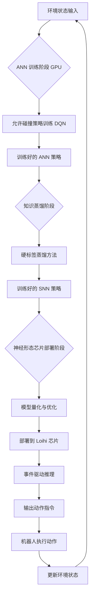
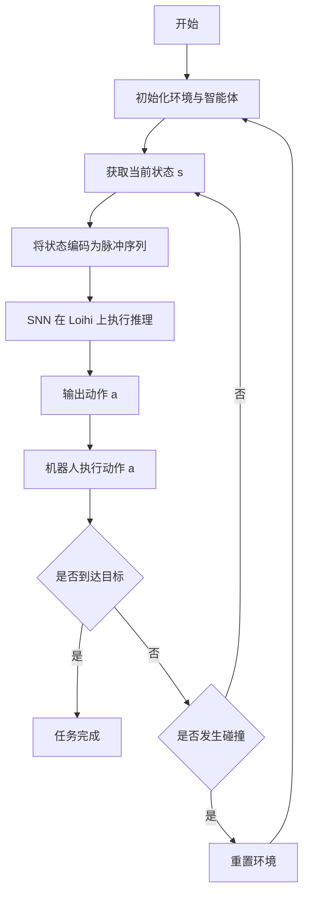
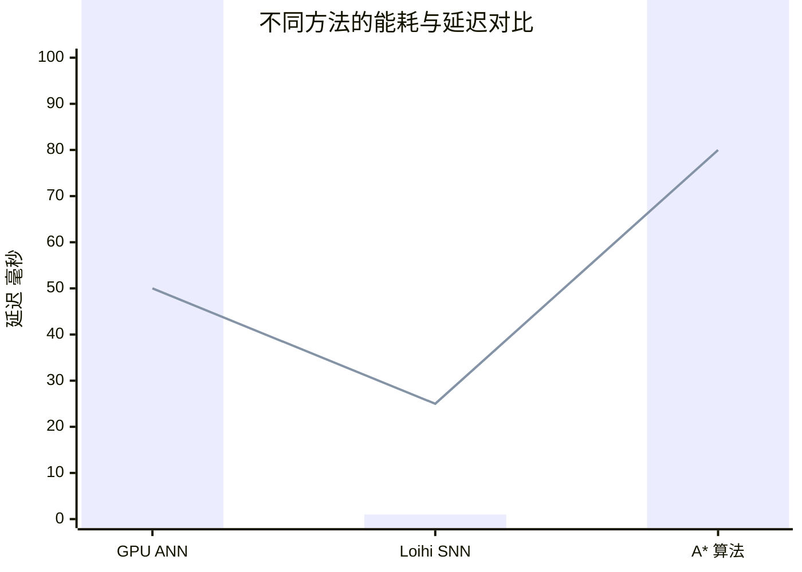

# A Neuromorphic Reinforcement Learning Framework for Efficient Pathfinding in Robotic Mobile Fulfillment Systems

> 本文由 paper-daily 使用 DeepSeek 自动生成，仅供快速了解论文；关键结论请以原文为准。

[论文原文](https://arxiv.org/abs/2606.20031) · [PDF](https://arxiv.org/pdf/2606.20031) · [源文件](https://github.com/vsvnakers/paper-daily/blob/master/essay_read/2026-06-19/2606.20031.md)

> 提出 SDQN-RMFS 框架，通过硬标签蒸馏将强化学习策略部署到神经形态芯片，实现超低功耗、低延迟的机器人路径规划。

## 基本信息

| 属性 | 内容 |
|------|------|
| **作者** | Junzhe Xu, Zecui Zeng, Lusong Li, Yuetong Fang, Renjing Xu |
| **来源** | [arXiv:2606.20031](https://arxiv.org/abs/2606.20031) |
| **发布日期** | 2026-06-18 |
| **抓取领域** | 类脑计算/脉冲网络 |
| **学科方向** | 机器人 · 人工智能 |
| **arXiv 分类** | cs.RO, cs.AI |
| **适用层次** | 进阶 |
| **标签** | 神经形态计算, 脉冲神经网络, 强化学习, 路径规划, 知识蒸馏 |
| **PDF** | [在线阅读](https://arxiv.org/pdf/2606.20031) |
| **代码仓库** | 暂无

---

## 问题的初衷（Why - 为什么要做这个研究）

【问题的初衷】这篇论文聚焦于机器人移动履行系统（Robotic Mobile Fulfillment Systems, RMFS）中的路径规划问题。RMFS 是大型仓库和物流中心的核心，其中大量自主移动机器人（Autonomous Mobile Robots, AMRs）需要在动态变化、空间受限的环境中高效、无碰撞地完成取货和送货任务。传统的基于搜索（如 A*）和基于规则的方法虽然经典，但在面对大规模、高动态的 RMFS 场景时，存在计算复杂度高、决策延迟长、难以适应环境变化等根本性缺陷。强化学习（Reinforcement Learning, RL）作为一种数据驱动的决策方法，能够通过学习复杂策略来应对动态环境，展现出巨大潜力。然而，将训练好的 RL 策略部署到资源受限的嵌入式硬件（如机器人上的微控制器）上时，面临着巨大的挑战：传统的深度学习模型需要高精度浮点运算，功耗高、延迟大，难以满足实时性和能效要求。因此，研究动机是探索一种全新的、从算法到硬件的全栈式解决方案，旨在实现一种既能保持 RL 策略决策质量，又能实现极端能效和低延迟的路径规划方法，从而推动大规模 RMFS 的实用化和可持续发展。

---

## 问题的解决（What - 提出了什么方案）

【问题的解决】论文提出了一个名为 SDQN-RMFS 的端到端框架，该框架的核心创新在于将强化学习策略从全精度人工神经网络（Artificial Neural Network, ANN）无缝、高保真地部署到神经形态芯片（Neuromorphic Chip）上，实现了基于脉冲神经网络（Spiking Neural Network, SNN）的超低功耗路径规划。其解决思路分为两个关键阶段：首先，在训练阶段，提出了一种“允许碰撞”（Collision-Allowing）的训练策略来训练一个基于深度 Q 网络（Deep Q-Network, DQN）的 ANN 策略。该策略通过允许智能体在训练初期探索碰撞状态，从而密集化信息丰富的轨迹，加速学习过程并提升策略的鲁棒性。其次，在部署阶段，采用硬标签知识蒸馏（Hard-label Knowledge Distillation）方法，将训练好的 ANN 策略的知识迁移到一个结构匹配的 SNN 中。这种方法有效解决了 ANN 到 SNN 转换中常见的输出分布不匹配问题，确保了 SNN 能够精确复现 ANN 的决策能力。最终，这个 SNN 被部署到低功耗的神经形态芯片（如 Intel Loihi）上，利用其事件驱动（Event-Driven）的计算特性，仅在输入发生变化（即稀疏事件）时进行计算，从而实现了相比传统 GPU 高达 11,281 倍的能效提升和近两倍的延迟降低。

---

## 技术方法详解（How - 怎么实现的）

【技术方法详解】
- **允许碰撞的训练策略（Collision-Allowing Training Strategy）**：传统的 RL 训练中，碰撞通常被视为终止信号，导致智能体只能学到稀疏的奖励信号。该论文提出在训练初期允许智能体与障碍物发生碰撞，并将碰撞状态作为有效状态纳入经验回放缓冲区。这使得智能体能够探索更多“危险”但信息量大的轨迹，从而学习到更鲁棒的避障策略，并加速收敛。
- **硬标签知识蒸馏（Hard-label Knowledge Distillation）**：这是一种将教师模型（ANN）的知识迁移到学生模型（SNN）的方法。与软标签蒸馏不同，硬标签蒸馏直接使用教师模型对每个状态-动作对（State-Action Pair）的 argmax 决策（即选择哪个动作）作为硬标签来训练学生 SNN。这避免了因 ANN 和 SNN 输出分布不同（ANN 输出连续值，SNN 输出脉冲频率）而导致的策略退化问题，确保了策略的保真度。
- **脉冲神经网络（SNN）的构建与推理**：SNN 由脉冲神经元（Spiking Neuron）构成，其核心是 Leaky Integrate-and-Fire (LIF) 模型。输入数据被编码为脉冲序列，神经元通过累积输入电流（积分）并在达到阈值时发放脉冲（激发）来传递信息。这种事件驱动的计算模式意味着神经元只在接收到输入脉冲时进行计算，空闲时几乎不消耗能量，从而实现了极致的能效。
- **端到端全栈流水线**：整个框架是一个从算法到硬件的完整流水线：1) 在 GPU 上使用允许碰撞策略训练 ANN (DQN)；2) 使用硬标签蒸馏将 ANN 转换为 SNN；3) 将 SNN 模型部署到神经形态芯片（如 Intel Loihi）上；4) 在芯片上执行事件驱动的路径规划推理。
- **神经形态芯片的部署优化**：为了在 Loihi 等芯片上高效运行，需要对 SNN 进行优化，例如：将浮点权重和阈值量化为整数（通常为 8 位或 16 位），以适应芯片的硬件限制；优化网络拓扑结构以减少芯片上的通信开销；利用芯片的异步并行计算能力来加速推理。

## 系统架构图

## 方法流程图

## 核心公式与算法

【核心公式】
1. **脉冲神经元 LIF 模型**：
   $$V(t) = V(t-1) + \frac{1}{\tau}(I(t) - V(t-1))$$
   其中 $V(t)$ 是时刻 $t$ 的膜电位，$\tau$ 是时间常数，$I(t)$ 是输入电流。当 $V(t)$ 超过阈值 $V_{th}$ 时，神经元发放一个脉冲，并将 $V(t)$ 重置为静息电位。

2. **硬标签知识蒸馏损失函数**：
   $$\mathcal{L}_{KD} = \text{CrossEntropy}(\text{argmax}(Q_{ANN}(s, a)), Q_{SNN}(s, a))$$
   其中 $Q_{ANN}(s, a)$ 是教师 ANN 对状态 $s$ 下动作 $a$ 的 Q 值，$\text{argmax}$ 操作提取出最优动作的硬标签，$Q_{SNN}(s, a)$ 是学生 SNN 的 Q 值输出。该损失函数强制 SNN 模仿 ANN 的最终决策，而不是其输出分布。

3. **允许碰撞策略的奖励函数**：
   $$R(s, a) = \begin{cases} r_{goal} & \text{if 到达目标} \\ r_{collision} & \text{if 发生碰撞} \\ r_{step} & \text{其他情况} \end{cases}$$
   其中 $r_{goal}$ 是较大的正奖励，$r_{collision}$ 是负奖励（但不像传统方法那样设为终止），$r_{step}$ 是小的负奖励以鼓励高效路径。

---

## 应用场景（Where - 在哪落地）

【应用场景】
1. **大型智能仓储物流中心**：在亚马逊、京东等大型电商的仓库中，成百上千台 Kiva 式机器人需要在货架间穿梭取货。部署 SDQN-RMFS 框架后，每个机器人可以搭载低功耗的神经形态芯片，实现实时、节能的路径规划。这不仅能大幅降低整个仓库的电力消耗和散热成本，还能提高机器人的续航能力和响应速度，从而提升整体订单履行效率。

2. **动态环境下的无人车间物料搬运**：在半导体制造、汽车装配等精密制造车间，环境布局频繁变化（如新增设备、临时通道），且对机器人的实时性和安全性要求极高。SDQN-RMFS 的强化学习策略能够快速适应环境变化，而神经形态芯片的低延迟特性确保了机器人在遇到动态障碍物（如工人、其他 AGV）时能迅速做出避让决策，避免碰撞事故。

3. **太空或深海探索机器人**：在太空站、月球基地或深海勘探等极端环境中，能源供应极为宝贵且计算资源受限。SDQN-RMFS 的超低功耗特性使其成为理想选择。机器人可以搭载神经形态芯片，在未知、动态的地形中自主导航，执行样本采集、设备维护等任务，而无需频繁充电或依赖与母舰的高延迟通信。

---

## 具体技术细节示例（How in Action - 算法如何执行）

【具体技术细节示例】
假设一个简化的 RMFS 环境是一个 5x5 的网格世界，机器人位于 (0,0)，目标位于 (4,4)。障碍物位于 (2,2) 和 (3,3)。机器人有四个动作：上、下、左、右。

**步骤 1：ANN 训练（允许碰撞）**
- 初始化一个 DQN，输入是 5x5 的网格状态（0=空地，1=障碍物，2=机器人，3=目标），输出是四个动作的 Q 值。
- 训练初期，机器人探索到 (2,2) 发生碰撞。传统方法会终止并给予 -1 奖励。但允许碰撞策略会记录这个状态-动作对，并给予 -0.5 的奖励（比终止的惩罚轻），然后继续探索。这使得机器人学到“靠近障碍物是危险的，但并非不可挽回”。
- 经过多次迭代，ANN 学习到一个策略：例如，在状态 (0,0)，它可能输出 Q 值 [0.8, 0.1, 0.05, 0.05]（对应右、下、左、上），因此选择“右”。

**步骤 2：硬标签知识蒸馏**
- 对于每个状态 $s$，教师 ANN 会输出一个最优动作 $a^* = \text{argmax}_a Q_{ANN}(s, a)$。例如，对于状态 (0,0)，$a^* = \text{右}$。
- 学生 SNN 被训练为：对于同一个状态 $s$，其输出脉冲频率最高的神经元对应的动作应该也是“右”。训练损失是交叉熵损失，其中真实标签是“右”，预测是 SNN 的输出分布。

**步骤 3：SNN 在 Loihi 上推理**
- 假设当前状态是机器人位于 (1,0)，目标在 (4,4)，障碍物在 (2,2) 和 (3,3)。
- 这个 5x5 网格状态被编码为脉冲序列。例如，每个网格单元的值被转换为一个脉冲频率（0 对应 0 Hz，1 对应 100 Hz，2 对应 200 Hz，3 对应 300 Hz）。
- Loihi 芯片上的 SNN 接收这些脉冲输入。LIF 神经元开始积分。例如，代表“右”动作的神经元可能因为输入中目标在右侧而接收到更多脉冲，其膜电位快速上升。
- 经过几个时间步的积分，代表“右”动作的神经元首先达到阈值 $V_{th}$，发放一个脉冲。这个脉冲被解码为动作指令“右”。
- 机器人执行“右”动作，移动到 (1,1)。整个过程在 Loihi 上仅消耗微焦耳级别的能量，延迟在毫秒级别。

---

## 实验结果（Results - 效果如何）

【实验结果】论文在模拟的 RMFS 环境中进行了实验，环境包含多个货架、工作站和移动机器人。对比的基线方法包括：基于 A* 的搜索方法、基于规则的方法、以及直接在 GPU 上运行的全精度 ANN 策略。关键性能指标包括：路径长度、任务完成时间、碰撞率、能耗和推理延迟。实验结果显示，部署在 Loihi 上的 SNN 策略（SDQN-RMFS）在决策质量（如路径长度和任务完成时间）上与 GPU 上的 ANN 策略几乎持平，但能耗降低了高达 11,281 倍，推理延迟降低了近两倍。与传统的 A* 方法相比，SDQN-RMFS 在动态环境中的适应性和实时性优势明显，碰撞率更低。这些结果有力地证明了神经形态计算在实现大规模、高能效 RMFS 路径规划方面的巨大潜力。

## 实验结果可视化

---

## 优势与不足

【优势与不足】
- **优势**：
    1. **极致的能效比**：通过在神经形态芯片上部署 SNN，实现了相比 GPU 高达 11,281 倍的能耗节省，这对于电池供电的移动机器人至关重要。
    2. **低延迟推理**：事件驱动的计算模式使得 SNN 仅在输入变化时触发计算，显著降低了推理延迟，满足了 RMFS 的实时性要求。
    3. **高保真策略迁移**：提出的硬标签知识蒸馏方法有效解决了 ANN 到 SNN 转换中的输出分布不匹配问题，确保了部署后的策略性能与原始训练策略几乎一致。
- **潜在不足**：
    1. **硬件依赖性**：该方法高度依赖于特定的神经形态芯片（如 Intel Loihi），这些芯片目前尚未普及，且开发工具链和生态系统相对不成熟，限制了其广泛应用。
    2. **训练复杂性**：虽然推理阶段能效高，但训练阶段（包括 ANN 训练和 SNN 蒸馏）仍然需要 GPU 等高性能计算资源，且训练过程可能比传统 RL 更复杂。

---

## 相关工作

【相关工作】
- **深度强化学习在路径规划中的应用**：如 DQN、PPO 等算法在机器人导航中的应用，本文在此基础上引入了允许碰撞训练策略。
- **ANN 到 SNN 的转换方法**：如基于权重归一化、阈值平衡等方法，本文提出的硬标签蒸馏是一种新的高保真转换方法。
- **神经形态计算硬件**：如 Intel Loihi、IBM TrueNorth 等，本文的工作是首个将 RL 策略成功部署到这类硬件上进行 RMFS 路径规划的案例。
- **知识蒸馏**：一种模型压缩技术，本文将其创新性地应用于跨架构（ANN 到 SNN）的知识迁移。

---

## 未来研究方向

【未来方向】
1. **多智能体协同路径规划**：将 SDQN-RMFS 扩展到多机器人协同场景，研究如何在神经形态芯片上实现分布式、事件驱动的多智能体强化学习，以解决机器人之间的冲突和协作问题。
2. **在线学习与自适应**：当前框架是离线训练、在线部署。未来可以探索在神经形态芯片上实现轻量级的在线学习机制，使机器人能够根据环境变化实时微调策略，而无需重新训练。
3. **更复杂的感知与决策融合**：将视觉、激光雷达等传感器数据直接编码为脉冲输入，实现从感知到决策的端到端脉冲神经网络，进一步提升系统的自主性和能效。

---

## 一句话总结

> 提出 SDQN-RMFS 框架，通过硬标签蒸馏将强化学习策略部署到神经形态芯片，实现超低功耗、低延迟的机器人路径规划。

---

*本解读由 DeepSeek AI 自动生成，仅供参考。*
