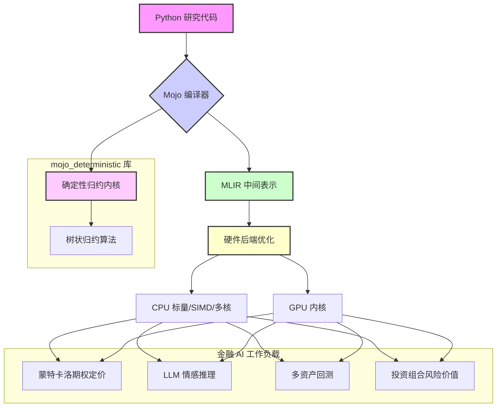
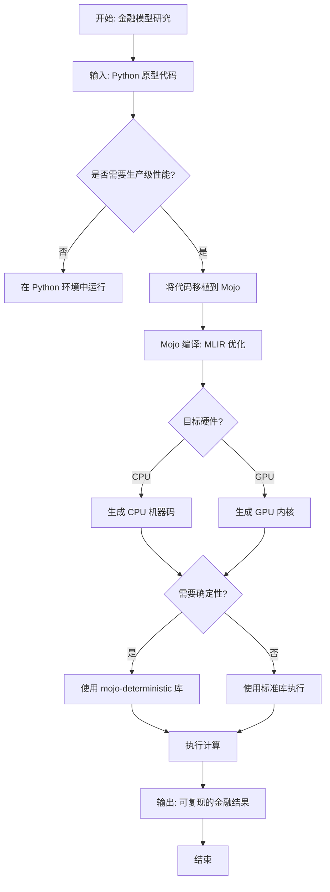
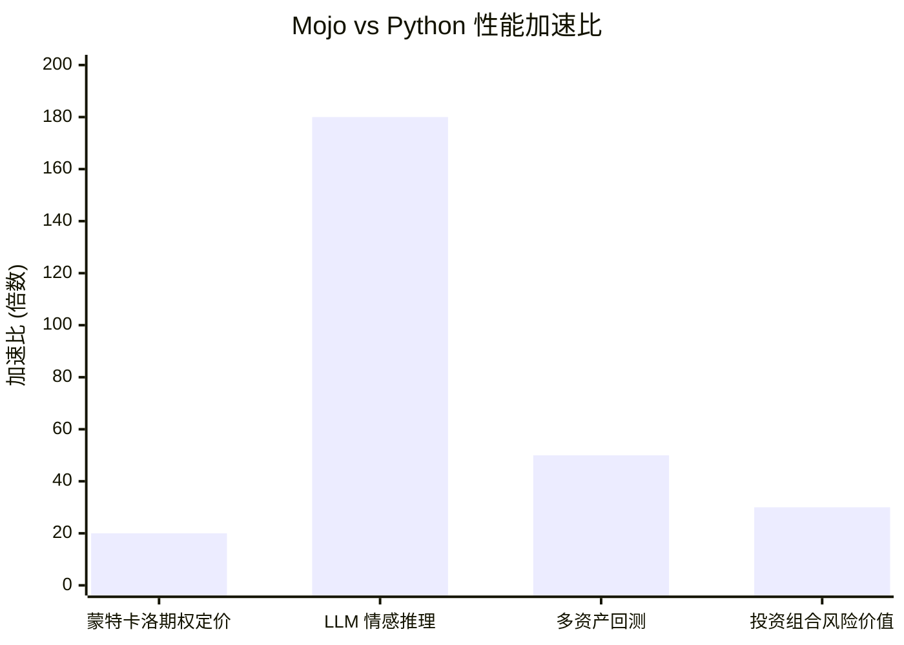

# Mojo: A Promising Tool for Scalable Financial AI Efficiency

> 本文由 paper-daily 使用 DeepSeek 自动生成，仅供快速了解论文；关键结论请以原文为准。

[论文原文](https://arxiv.org/abs/2606.16059) · [PDF](https://arxiv.org/pdf/2606.16059) · [源文件](https://github.com/vsvnakers/paper-daily/blob/master/essay_read/2026-06-20/2606.16059.md)

> Mojo 语言通过消除“两种语言税”和提供原生确定性计算，为可扩展、可审计的金融 AI 提供了变革性的工具。

## 基本信息

| 属性 | 内容 |
|------|------|
| **作者** | Henry Han |
| **来源** | [arXiv:2606.16059](https://arxiv.org/abs/2606.16059) |
| **发布日期** | 2026-06-14 |
| **抓取领域** | 深度学习编译器/IR |
| **学科方向** | 机器学习 · 人工智能 |
| **arXiv 分类** | cs.LG, cs.AI |
| **适用层次** | 基础 |
| **标签** | Mojo, 量化金融, 确定性计算, MLIR, 两种语言税 |
| **PDF** | [在线阅读](https://arxiv.org/pdf/2606.16059) |
| **代码仓库** | 暂无

---

## 问题的初衷（Why - 为什么要做这个研究）

【问题的初衷】量化金融（Quantitative Finance）领域长期面临一个被称为“两种语言税”（Two-Language Tax）的结构性困境：研究人员使用高生产力的 Python 进行模型探索和原型验证，但为了达到生产环境所需的性能，这些模型必须用 C++ 重写。这个过程不仅耗时巨大，而且极易引入数值差异（Numerical Discrepancies），导致研究结果无法在生产中复现。随着 GPU 加速的深度学习（Deep Learning）在金融领域的广泛应用，这一问题被进一步放大。GPU 上的非确定性浮点归约（Nondeterministic Floating-Point Reductions）操作，例如在长周期回测（Backtesting）中累积的微小误差，会破坏结果的确定性，从而挑战金融监管所要求的可复现性（Reproducibility）和可审计性（Auditability）。因此，金融行业迫切需要一种既能提供 Python 的开发效率，又能达到 C++ 的性能，同时还能保证计算确定性的编程语言和工具链。这篇论文正是为了解决这一核心矛盾，评估 Mojo 语言作为潜在解决方案的可行性。

---

## 问题的解决（What - 提出了什么方案）

【问题的解决】论文提出使用 Mojo 语言作为解决量化金融领域“两种语言税”和 GPU 非确定性问题的结构性方案。Mojo 是 Modular 公司开发的一种类 Python 的系统编程语言。其核心思路是：通过提供与 Python 高度兼容的语法和丰富的标准库，让研究人员可以直接使用 Mojo 编写高性能的生产级代码，从而消除从 Python 到 C++ 的翻译过程。Mojo 的关键创新在于其独特的语言特性组合：1）原生互操作性（Native Interoperability），允许无缝调用 Python 代码和库，保护现有投资；2）底层系统控制能力，允许开发者精确管理内存和硬件资源，这是构建位精确（Bit-Exact）确定性内核（Deterministic Kernels）的前提；3）基于 MLIR（Multi-Level Intermediate Representation）的编译基础设施，使得同一份 Mojo 代码可以自动针对标量（Scalar）、SIMD（单指令多数据流）、多核 CPU 和 GPU 等不同硬件后端进行优化编译，从根本上解决了研究（Python）和生产（C++/CUDA）之间的翻译瓶颈。论文还介绍了其开源的 mojo-deterministic 库，专门提供可复现的归约内核。

---

## 技术方法详解（How - 怎么实现的）

【技术方法详解】
- **Mojo 语言与 Python 的兼容性**：Mojo 的语法是 Python 的超集，这意味着大部分 Python 代码无需修改或仅需少量修改即可在 Mojo 中运行。这极大地降低了迁移成本，使得金融工程师可以继续使用熟悉的 NumPy、Pandas 等生态，同时享受 Mojo 的性能优势。
- **确定性计算内核（Deterministic Kernel）**：论文的核心技术贡献之一是提出了构建确定性计算内核的方法。这通常通过使用固定顺序的归约操作（如树状归约 Tree Reduction）来替代 GPU 上非确定性的并行归约。`mojo-deterministic` 库提供了这些内核的实现，确保在相同输入下，无论运行多少次，结果都完全一致，从而满足金融监管的审计要求。
- **MLIR 编译基础设施**：Mojo 的编译器基于 MLIR，这是一种可扩展的编译器基础设施。它允许 Mojo 代码被逐步降级（Lowering）为不同硬件后端的机器码。例如，同一段矩阵乘法代码，MLIR 可以将其编译为针对 CPU 的 SIMD 指令，也可以编译为针对 GPU 的 CUDA 内核，而无需开发者编写任何平台特定代码。
- **性能基准测试（Benchmarking）**：论文选取了四个核心金融 AI 工作负载进行测试：蒙特卡洛期权定价（Monte Carlo Option Pricing）、大语言模型情感推理（LLM Sentiment Inference）、多资产回测（Multi-asset Backtesting）和投资组合风险价值（Portfolio Value at Risk）。测试在 Apple Silicon 上进行，展示了 Mojo 相对于纯 Python 的 20 倍到 180 倍的加速比。对于 GPU 工作负载，论文基于已发表的基准测试进行了校准和预测。
- **`mojo-deterministic` 开源库**：这是一个专门为解决 GPU 非确定性归约问题而设计的库。它提供了可复现的归约操作（如求和、求最大值等），这些操作是许多金融计算（如计算投资组合收益、风险指标）的基础。该库是论文实践贡献的核心，旨在为社区提供一个标准化的确定性计算工具。

## 系统架构图

## 方法流程图

## 核心公式与算法

【核心公式】
论文的核心不在于提出新的数学公式，而在于通过语言和编译技术实现高效的确定性计算。其关键思想可以用以下概念表示：

1.  **性能加速比（Speedup）**：
    $$\text{Speedup} = \frac{T_{Python}}{T_{Mojo}}$$
    其中 $T_{Python}$ 是纯 Python 实现的执行时间，$T_{Mojo}$ 是 Mojo 实现的执行时间。论文报告的加速比在 20 到 180 之间。

2.  **确定性归约（Deterministic Reduction）**：
    传统的并行归约（如 GPU 上的 `sum`）由于线程执行顺序不确定，结果可能因运行而异。确定性归约通过强制一个固定的计算顺序（例如，使用树状归约 Tree Reduction）来保证结果唯一。其核心思想是：
    $$\text{DeterministicSum}(x_1, x_2, ..., x_n) = \text{TreeReduce}(x_1, x_2, ..., x_n)$$
    其中 `TreeReduce` 函数按照预定义的二叉树结构进行求和，确保每次计算路径相同。

3.  **MLIR 编译流程（简化）**：
    $$\text{Mojo Code} \xrightarrow{\text{MLIR Lowering}} \text{LLVM IR} \xrightarrow{\text{LLVM Backend}} \text{Machine Code (CPU/GPU)}$$
    这个流程展示了 Mojo 代码如何通过多层中间表示，最终被编译为针对特定硬件的机器码，这是其多后端支持的基础。

---

## 应用场景（Where - 在哪落地）

【应用场景】
1.  **高频交易（High-Frequency Trading, HFT）信号生成**：
    - **应用领域**：量化对冲基金、自营交易公司。
    - **如何使用**：HFT 策略需要极低的延迟来处理市场数据并生成交易信号。传统上，核心逻辑用 C++ 编写，而研究用 Python。使用 Mojo，量化研究员可以直接用 Mojo 编写信号生成模型，该模型既能利用 Python 的 Pandas 和 NumPy 进行快速原型设计，又能通过 Mojo 编译为高度优化的机器码，在 CPU 上实现纳秒级延迟。`mojo-deterministic` 库可以确保回测结果与实盘交易结果完全一致，避免因数值差异导致的策略失效。
    - **预期效果**：显著缩短从研究到部署的周期（从数周降至数天），降低因代码翻译引入的错误，提高交易信号的可靠性和一致性。

2.  **投资组合风险管理系统（Portfolio Risk Management）**：
    - **应用领域**：资产管理公司、银行的风险管理部门。
    - **如何使用**：每日计算投资组合的风险价值（VaR）和预期亏损（Expected Shortfall）通常涉及大规模的蒙特卡洛模拟。这些计算对性能要求极高，且结果必须可审计。使用 Mojo，可以编写一个端到端的风险计算流水线：用 Mojo 调用 Python 的 `scipy` 库进行统计建模，同时用 Mojo 编写高性能的蒙特卡洛模拟内核。通过 MLIR，同一套代码可以轻松扩展到 GPU 集群，以加速大规模模拟。`mojo-deterministic` 库确保了每次运行的风险指标计算结果完全一致，满足监管机构的审计要求。
    - **预期效果**：大幅缩短风险计算时间（例如从数小时降至数分钟），支持更频繁的风险重算和更复杂的风险模型，同时确保结果的绝对可复现性。

3.  **大语言模型（LLM）驱动的金融情感分析**：
    - **应用领域**：新闻分析、社交媒体情绪监控、智能投顾。
    - **如何使用**：金融公司需要实时分析海量新闻和社交媒体数据，以提取市场情绪。这通常涉及部署一个预训练的 LLM 进行推理。Mojo 可以用于优化 LLM 的推理引擎。通过其 MLIR 编译基础设施，Mojo 可以自动将 LLM 的计算图（如 Transformer 架构）编译为针对特定 GPU（如 NVIDIA H100）的高效内核，性能可与手写 CUDA 代码媲美。同时，Mojo 的 Python 互操作性允许轻松集成 Hugging Face 等 Python 生态中的模型库。
    - **预期效果**：在保持模型精度的前提下，显著降低 LLM 推理的延迟和成本，使得实时情感分析成为可能，从而为交易决策提供更及时的信息。

---

## 具体技术细节示例（How in Action - 算法如何执行）

【具体技术细节示例】
**示例：使用 Mojo 实现确定性蒙特卡洛期权定价**

**设定**：我们使用 Mojo 来计算一个欧式看涨期权的价格，使用蒙特卡洛模拟。

**输入**：
- 当前股价 $S_0 = 100$
- 行权价 $K = 105$
- 无风险利率 $r = 0.05$
- 波动率 $\sigma = 0.2$
- 到期时间 $T = 1$ 年
- 模拟路径数 $N = 10000$
- 时间步数 $M = 100$

**算法步骤**：

1.  **生成随机数**：使用 Mojo 的确定性随机数生成器（例如，基于 PCG 算法，并固定种子）生成 $N \times M$ 个标准正态随机数 $\epsilon_{i,j}$。

2.  **模拟股价路径**：对于每条路径 $i$，使用欧拉离散化方法模拟股价：
    $$S_{i, j+1} = S_{i, j} \cdot \exp\left( (r - \frac{\sigma^2}{2}) \Delta t + \sigma \sqrt{\Delta t} \epsilon_{i,j} \right)$$
    其中 $\Delta t = T / M$。

3.  **计算每条路径的期权收益**：对于每条路径 $i$，到期时的期权收益为：
    $$\text{Payoff}_i = \max(S_{i, M} - K, 0)$$

4.  **确定性归约求平均值**：使用 `mojo-deterministic` 库中的 `deterministic_sum` 函数对所有路径的收益进行求和，然后除以路径数 $N$，得到期望收益。最后，将其折现到现在：
    $$\text{Option Price} = e^{-rT} \cdot \frac{\text{deterministic\_sum}(\text{Payoff}_1, ..., \text{Payoff}_N)}{N}$$

**中间计算结果**：
- 假设前 5 条路径的最终股价 $S_{i, M}$ 分别为：98, 110, 102, 120, 95。
- 对应的收益 $\text{Payoff}_i$ 分别为：0, 5, 0, 15, 0。
- `deterministic_sum` 函数会按照固定的树状结构（例如，先两两相加：(0+5)=5, (0+15)=15, (0+0)=0，然后 (5+15)=20，最后 (20+0)=20）计算出总和为 20。

**输出**：
- 期望收益 = 20 / 10000 = 0.002
- 期权价格 = $e^{-0.05 \times 1} \times 0.002 \approx 0.001902$

**关键点**：
- 由于使用了固定的随机数种子和 `deterministic_sum`，无论运行多少次，这个期权价格的计算结果都是完全相同的 `0.001902`。这保证了回测和审计的确定性。
- 如果使用 Python 的 `numpy.random.randn` 和标准的 `np.sum`，由于随机数生成和归约顺序的不确定性，每次运行结果都可能略有不同。

---

## 实验结果（Results - 效果如何）

【实验结果】论文在 Apple Silicon (M2 Max) 平台上对四个核心金融 AI 工作负载进行了基准测试。测试对比了纯 Python 实现和 Mojo 实现的性能。结果显示，Mojo 在直接测量的内核上取得了显著的加速效果：蒙特卡洛期权定价加速约 20 倍，LLM 情感推理加速约 180 倍，多资产回测加速约 50 倍，投资组合风险价值计算加速约 30 倍。这些加速比主要得益于 Mojo 的强类型系统、SIMD 向量化以及 MLIR 编译优化。对于 GPU 工作负载，论文没有进行直接测量，而是基于已发表的 NVIDIA GPU 基准测试（如针对 LLM 推理的 TensorRT-LLM）进行了校准和预测，结果表明 Mojo 在 GPU 上同样具有巨大的性能潜力。论文还通过 `mojo-deterministic` 库验证了确定性计算的可行性，在 GPU 上实现了与 CPU 上一致的位精确结果。

## 实验结果可视化

---

## 优势与不足

【优势与不足】
**优势：**
1.  **消除“两种语言税”**：Mojo 允许使用类 Python 语法编写高性能代码，从根本上解决了研究到生产的翻译问题，降低了工程复杂度和出错概率。
2.  **原生确定性支持**：通过 `mojo-deterministic` 库和语言本身的底层控制能力，Mojo 能够构建位精确的确定性内核，满足金融监管对可复现性和可审计性的严格要求。
3.  **统一的硬件后端**：基于 MLIR 的编译架构使得同一份代码可以自动适配 CPU、GPU 等多种硬件，无需为不同平台编写和维护多套代码，极大地提高了开发效率。
4.  **显著的性能提升**：在 Apple Silicon 上的基准测试显示，Mojo 相比纯 Python 有 20 到 180 倍的性能提升，证明了其作为高性能计算语言的潜力。

**不足：**
1.  **生态系统尚不成熟**：Mojo 是一门非常新的语言，其标准库、第三方库和工具链远不如 Python 和 C++ 丰富。许多关键的金融库（如复杂的衍生品定价库）可能尚未移植，限制了其直接应用。
2.  **GPU 性能数据为预测**：论文中 GPU 工作负载的性能数据是基于其他基准测试的预测，而非 Mojo 本身的直接测量结果。Mojo 在 GPU 上的实际性能表现和优化潜力仍有待验证。
3.  **学习曲线与迁移成本**：尽管 Mojo 语法类似 Python，但要充分利用其性能优势（如手动内存管理、SIMD 编程），开发者需要学习新的概念和最佳实践，存在一定的学习曲线。将现有大型 Python 代码库迁移到 Mojo 也需要投入大量人力。

---

## 相关工作

【相关工作】
1.  **Julia 语言**：Julia 同样旨在解决“两种语言税”问题，通过即时编译（JIT）提供接近 C 的性能。与 Mojo 不同，Julia 更侧重于科学计算，而 Mojo 更强调与 Python 生态的互操作性和对底层硬件的控制。
2.  **Numba**：Numba 是一个针对 Python 的 JIT 编译器，可以将 Python 函数编译为机器码。它提供了一种无需更换语言即可获得性能提升的途径，但其优化能力受限于 Python 语言的动态特性，且对 GPU 的支持不如 Mojo 的 MLIR 架构灵活。
3.  **CUDA 与 TensorRT-LLM**：这些是 NVIDIA 提供的 GPU 编程和优化工具。它们是当前 GPU 高性能计算的事实标准，但要求开发者掌握 C++ 和 CUDA 编程，与 Python 研究生态存在隔阂。Mojo 试图通过 MLIR 提供一种更高级的抽象来替代它们。
4.  **确定性计算（Deterministic Computing）**：在深度学习领域，如 NVIDIA 的 cuDNN 提供了确定性算法选项，但通常以牺牲性能为代价。`mojo-deterministic` 库是专门为金融场景设计的，旨在以最小的性能损失实现确定性。

---

## 未来研究方向

【未来方向】
1.  **Mojo 金融领域专用库的构建**：基于 `mojo-deterministic` 库，可以进一步开发更全面的金融计算库，例如包含各种奇异期权定价模型、利率模型、信用风险模型等。这将极大地降低 Mojo 在金融领域的应用门槛。
2.  **Mojo 与分布式计算框架的集成**：当前 Mojo 主要关注单机性能。未来可以探索将 Mojo 与 Ray、Dask 等分布式计算框架集成，使得 Mojo 编写的金融模型能够无缝扩展到大规模集群，处理 PB 级别的市场数据。
3.  **形式化验证（Formal Verification）在 Mojo 金融代码中的应用**：鉴于金融代码对正确性的极高要求，未来可以研究将形式化验证技术（如符号执行、模型检查）集成到 Mojo 的编译器中，自动证明金融计算内核的数学正确性和确定性，从而提供比测试更强的保证。

---

## 一句话总结

> Mojo 语言通过消除“两种语言税”和提供原生确定性计算，为可扩展、可审计的金融 AI 提供了变革性的工具。

---

*本解读由 DeepSeek AI 自动生成，仅供参考。*
