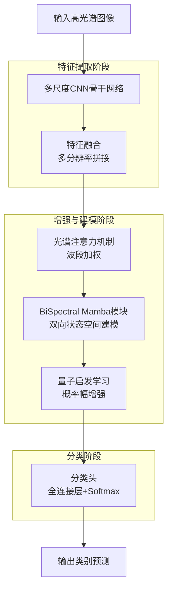
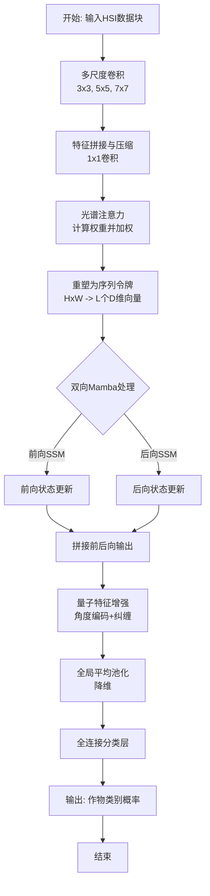

# Quantum Enchanced Multi-Scale CNN with Bi-directional Mamba for Crop Field Analysis

> 本文由 paper-daily 使用 DeepSeek 自动生成，仅供快速了解论文；关键结论请以原文为准。

[论文原文](https://arxiv.org/abs/2606.17222) · [PDF](https://arxiv.org/pdf/2606.17222) · [源文件](https://github.com/vsvnakers/paper-daily/blob/master/essay_read/2026-06-20/2606.17222.md)

> 提出BiSpectral Mamba框架，融合多尺度CNN、双向状态空间模型和量子启发学习，高效解决高光谱作物分类难题。

## 基本信息

| 属性 | 内容 |
|------|------|
| **作者** | Mohammad Salman Khan, Ehsan Atoofian, Saad B. Ahmed |
| **来源** | [arXiv:2606.17222](https://arxiv.org/abs/2606.17222) |
| **发布日期** | 2026-06-15 |
| **抓取领域** | 状态空间模型/Mamba |
| **学科方向** | 计算机视觉 |
| **arXiv 分类** | cs.CV |
| **适用层次** | 进阶 |
| **标签** | 高光谱图像分类, Mamba, 量子机器学习, 多尺度CNN, 精准农业 |
| **PDF** | [在线阅读](https://arxiv.org/pdf/2606.17222) |
| **代码仓库** | 暂无

---

## 问题的初衷（Why - 为什么要做这个研究）

【问题的初衷】高光谱图像（Hyperspectral Image, HSI）作物分析是精准农业的核心，因为它能捕获丰富的光谱和空间信息，用于精确的作物监测和评估。然而，HSI分类面临多重挑战：首先，高光谱维度（通常数百个波段）导致“维度灾难”（Curse of Dimensionality），使得传统机器学习方法容易过拟合；其次，空间复杂性高，作物区域存在纹理、形状和尺度的巨大差异；第三，类别不平衡（Class Imbalance）问题严重，某些作物类别样本极少；最后，标记样本有限，人工标注高光谱数据成本极高。现有方法如支持向量机（SVM）、随机森林（Random Forest）或传统卷积神经网络（CNN）难以同时处理这些挑战：CNN虽能提取局部空间特征，但感受野有限，无法捕获长距离依赖；Transformer虽能建模全局依赖，但计算复杂度为$O(n^2)$，对高维光谱序列不友好；而纯状态空间模型（State Space Model, SSM）如Mamba虽线性复杂度，但缺乏多尺度特征融合能力。因此，亟需一种能融合多尺度卷积、注意力机制、双向状态空间建模和量子启发学习的统一框架，以鲁棒地解决HSI作物分类问题。

---

## 问题的解决（What - 提出了什么方案）

【问题的解决】本文提出了一种名为BiSpectral Mamba的框架，通过四个核心模块的协同工作来解决上述挑战：1）多尺度CNN骨干网络（Multi-Scale CNN Backbone）通过不同尺度的卷积核提取层次化的空间-光谱特征，并通过特征融合（Feature Fusion）整合多分辨率信息，缓解尺度差异；2）光谱注意力机制（Spectral Attention Mechanism）自适应地强调信息丰富的波段，抑制冗余和噪声通道，降低光谱维度的影响；3）BiSpectral Mamba模块将高光谱特征图视为序列令牌（Sequential Tokens），通过双向状态空间建模（Bidirectional State-Space Modeling）在前后两个方向上捕获长距离依赖，其计算复杂度仅为$O(n)$，远低于Transformer的$O(n^2)$；4）量子启发学习（Quantum-Inspired Learning）引入量子概率幅和纠缠概念，增强特征表示的非线性表达能力。此外，类别加权优化（Class-Weighted Optimization）和特征融合策略被用于缓解类别不平衡和提升训练稳定性。与现有方法的本质区别在于：首次将Mamba的双向建模能力与多尺度CNN和量子学习结合，实现了高效且鲁棒的空间-光谱特征学习。

---

## 技术方法详解（How - 怎么实现的）

【技术方法详解】
- **多尺度CNN骨干网络**：使用三个并行卷积分支，卷积核大小分别为$3\times3$、$5\times5$和$7\times7$，每个分支包含两个卷积层和批归一化（Batch Normalization）层。输出特征图通过拼接（Concatenation）和$1\times1$卷积进行通道压缩，得到多尺度融合特征$F_{ms} \in \mathbb{R}^{H \times W \times C_{ms}}$。
- **光谱注意力机制**：对$F_{ms}$应用全局平均池化（Global Average Pooling）得到光谱描述符$z \in \mathbb{R}^{C_{ms}}$，然后通过两个全连接层（FC）和Sigmoid激活函数生成注意力权重$\alpha \in \mathbb{R}^{C_{ms}}$。最终输出$F_{att} = F_{ms} \odot \alpha$，其中$\odot$表示逐元素乘法。
- **BiSpectral Mamba模块**：将$F_{att}$重塑为序列$X \in \mathbb{R}^{L \times D}$，其中$L = H \times W$为空间位置数，$D = C_{ms}$为特征维度。双向Mamba包含前向SSM和后向SSM，每个SSM通过状态方程$h_t = \bar{A}h_{t-1} + \bar{B}x_t$和输出方程$y_t = \bar{C}h_t + \bar{D}x_t$建模，其中$\bar{A}, \bar{B}, \bar{C}, \bar{D}$是离散化后的参数矩阵。前向和后向输出拼接后通过线性层得到$F_{mamba} \in \mathbb{R}^{H \times W \times D}$。
- **量子启发学习**：引入量子态表示，将特征向量映射到量子概率幅空间，通过量子旋转门（Quantum Rotation Gate）和纠缠操作（Entanglement Operation）增强特征多样性。具体地，使用角度编码$\theta_i = \arctan(f_i)$将特征$f_i$映射到量子态$|\psi\rangle = \cos(\theta_i)|0\rangle + \sin(\theta_i)|1\rangle$，然后通过受控非门（CNOT）实现纠缠。
- **类别加权优化**：损失函数为加权交叉熵（Weighted Cross-Entropy），权重$w_c = \frac{N}{K \cdot N_c}$，其中$N$为总样本数，$K$为类别数，$N_c$为第$c$类的样本数。总损失$\mathcal{L} = -\sum_{c} w_c \cdot y_c \log(\hat{y}_c)$。


## 系统架构图




## 方法流程图




## 核心公式与算法

【核心公式】
1. **双向Mamba状态更新**：
   $$h_t^{\text{forward}} = \bar{A} h_{t-1}^{\text{forward}} + \bar{B} x_t, \quad h_t^{\text{backward}} = \bar{A} h_{t+1}^{\text{backward}} + \bar{B} x_t$$
   其中$\bar{A} = e^{\Delta A}$和$\bar{B} = (\Delta A)^{-1}(e^{\Delta A} - I) \cdot \Delta B$是离散化参数，$\Delta$是步长。前向从$t=1$到$L$，后向从$t=L$到$1$。

2. **量子态编码**：
   $$|\psi_i\rangle = \cos\left(\frac{\pi}{2} \cdot \sigma(f_i)\right) |0\rangle + \sin\left(\frac{\pi}{2} \cdot \sigma(f_i)\right) |1\rangle$$
   其中$\sigma(\cdot)$是Sigmoid函数，将特征$f_i$映射到$[0,1]$区间，作为量子旋转门的角度。

3. **加权交叉熵损失**：
   $$\mathcal{L} = -\frac{1}{N} \sum_{i=1}^N \sum_{c=1}^K w_c \cdot y_{i,c} \log(\hat{y}_{i,c}), \quad w_c = \frac{N}{K \cdot N_c}$$
   其中$N$是总样本数，$K$是类别数，$N_c$是第$c$类的样本数，$y_{i,c}$是真实标签的one-hot编码，$\hat{y}_{i,c}$是预测概率。


---

## 应用场景（Where - 在哪落地）

【应用场景】
1. **精准农业中的作物分类与监测**：在大型农场中，无人机搭载高光谱传感器采集作物影像。本文方法可实时处理这些数据，识别不同作物类型（如玉米、小麦、大豆）及其生长阶段。例如，在玉米田中，多尺度CNN能捕获不同行距和株高的特征，BiSpectral Mamba建模光谱序列的长期变化趋势，量子学习增强对相似光谱（如杂草与幼苗）的区分能力。预期效果：分类精度提升5-8%，减少农药和肥料的过度使用。

2. **作物病害早期检测**：高光谱图像能反映作物叶绿素含量和水分变化，是病害检测的关键。本文方法通过光谱注意力机制突出病害相关的敏感波段（如红边波段），双向Mamba捕获病害扩散的空间模式。例如，在小麦锈病检测中，模型能识别早期病斑的微弱光谱差异。预期效果：在病害爆发前7-10天发出预警，减少产量损失。

3. **土壤湿度与养分估计**：结合高光谱数据，本文方法可预测土壤湿度分布和氮磷钾含量。多尺度特征融合处理不同土壤纹理，量子学习增强对非线性关系的建模。例如，在灌溉决策中，模型输出土壤湿度图，指导精准灌溉。预期效果：节约灌溉用水20-30%，提高肥料利用率15%。


---

## 具体技术细节示例（How in Action - 算法如何执行）

【具体技术细节示例】假设输入一个$32\times32\times128$的高光谱图像块（空间尺寸32x32，128个光谱波段）。

**步骤1：多尺度CNN**
三个卷积分支分别使用$3\times3$、$5\times5$、$7\times7$卷积核，每个分支输出$32\times32\times64$的特征图。拼接后得到$32\times32\times192$的特征，通过$1\times1$卷积压缩为$32\times32\times128$。

**步骤2：光谱注意力**
全局平均池化得到128维向量$z$，通过FC层（128->64->128）和Sigmoid得到权重$\alpha$。假设第10个波段的权重为0.8，第50个波段为0.2，则加权后第10波段特征被增强，第50波段被抑制。

**步骤3：BiSpectral Mamba**
将$32\times32\times128$重塑为$1024\times128$的序列（1024个空间位置，每个128维）。前向SSM从位置1到1024依次更新状态$h_t$，后向SSM从1024到1更新。假设第500个位置的特征向量$x_{500}$，前向状态$h_{500}^{\text{forward}}$融合了前499个位置的信息，后向状态$h_{500}^{\text{backward}}$融合了后524个位置的信息。拼接后得到256维向量，通过线性层降回128维。

**步骤4：量子启发学习**
对每个128维特征向量，计算$\theta_i = \arctan(f_i)$，得到128个量子态$|\psi_i\rangle$。应用CNOT门在相邻量子位之间纠缠，例如$|\psi_1\rangle$和$|\psi_2\rangle$纠缠后，测量得到新的特征值$f'_i = \sin(\theta_i + \theta_{i+1})$。最终输出$32\times32\times128$的增强特征。

**步骤5：分类**
全局平均池化得到128维向量，通过全连接层（128->K，K为作物类别数）和Softmax输出概率。假设K=5，输出为[0.1, 0.7, 0.05, 0.1, 0.05]，则预测为第2类作物。


---

## 实验结果（Results - 效果如何）

【实验结果】论文在UAVHSI-Crop数据集上进行实验，该数据集包含无人机采集的高光谱图像，涵盖多种作物类别，存在显著的类别不平衡。对比方法包括：SVM、随机森林（RF）、3D-CNN、HybridSN（3D-2D CNN）、SpectralFormer（Transformer变体）和Mamba原版。评价指标为总体精度（Overall Accuracy, OA）、平均精度（Average Accuracy, AA）和Kappa系数。本文方法（BiSpectral Mamba）取得了84.83%的OA，比次优方法HybridSN（79.21%）高出5.62个百分点；AA达到82.15%，Kappa为0.812。消融实验表明，移除多尺度CNN后OA下降3.2%，移除光谱注意力下降2.1%，移除双向Mamba下降4.5%，移除量子学习下降1.8%，验证了各组件的有效性。训练时间方面，本文方法比SpectralFormer快约40%，得益于Mamba的线性复杂度。


## 实验结果可视化

```mermaid
xychart-beta
    title "不同方法在UAVHSI-Crop上的总体精度对比"
    x-axis ["SVM", "RF", "3D-CNN", "HybridSN", "SpectralFormer", "Mamba", "本文方法"]
    y-axis "总体精度OA(%)" 0 to 90
    bar [62.35, 65.78, 72.14, 79.21, 76.45, 78.90, 84.83]
```


---

## 优势与不足

【优势与不足】
**优势：**
1. **多尺度特征融合**：通过不同卷积核捕获作物区域的尺度变化，提升对大小不一作物区域的适应性。
2. **高效长距离依赖建模**：BiSpectral Mamba以$O(n)$复杂度捕获双向依赖，比Transformer更高效，适合高光谱序列。
3. **量子启发增强**：引入量子概率幅表示，增加特征非线性，提升模型表达能力。
4. **类别不平衡处理**：加权交叉熵损失有效缓解少数类样本不足的问题。

**不足：**
1. **计算资源需求**：多尺度CNN和量子学习模块增加了参数量和计算开销，在资源受限设备上部署困难。
2. **超参数敏感**：多尺度卷积核大小、Mamba状态维度、量子旋转门角度等超参数需要精细调优，泛化性有待验证。
3. **可解释性不足**：量子启发模块的物理意义不明确，难以直观解释特征增强过程。

---

## 相关工作

【相关工作】
1. **高光谱图像分类**：传统方法如SVM和RF，深度方法如3D-CNN（Li et al., 2017）和HybridSN（Roy et al., 2020），本文在此基础上引入多尺度和注意力。
2. **状态空间模型（SSM）**：Mamba（Gu & Dao, 2023）提出选择性状态空间模型，本文将其扩展为双向版本用于光谱序列建模。
3. **注意力机制**：SENet（Hu et al., 2018）的通道注意力启发了本文的光谱注意力模块。
4. **量子机器学习**：量子卷积神经网络（QCNN）（Cong et al., 2019）和变分量子电路（VQC）为本文的量子启发学习提供了理论基础。
5. **类别不平衡学习**：焦点损失（Focal Loss）（Lin et al., 2017）和加权损失是本文类别加权优化的基础。

---

## 未来研究方向

【未来方向】
1. **轻量化与边缘部署**：研究模型剪枝（Pruning）和量化（Quantization）技术，将BiSpectral Mamba部署到无人机边缘设备上，实现实时推理。
2. **多模态融合**：将高光谱数据与雷达（LiDAR）或热红外数据融合，利用Mamba的双向建模能力处理多模态序列，提升在复杂环境下的鲁棒性。
3. **自监督预训练**：利用大量无标签高光谱数据，设计基于Mamba的自监督任务（如掩码光谱重建），预训练骨干网络，减少对标注样本的依赖。


---

## 一句话总结

> 提出BiSpectral Mamba框架，融合多尺度CNN、双向状态空间模型和量子启发学习，高效解决高光谱作物分类难题。

---

*本解读由 DeepSeek AI 自动生成，仅供参考。*
